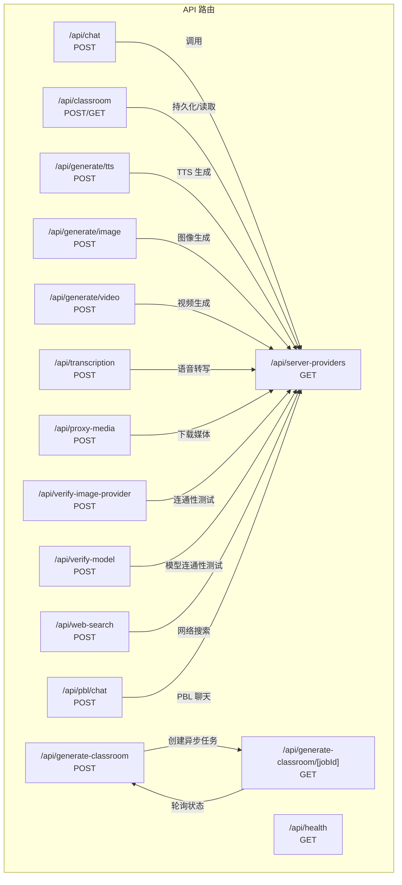
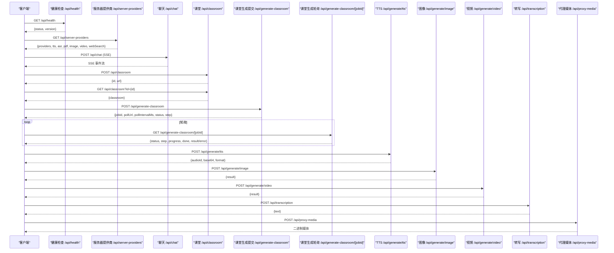
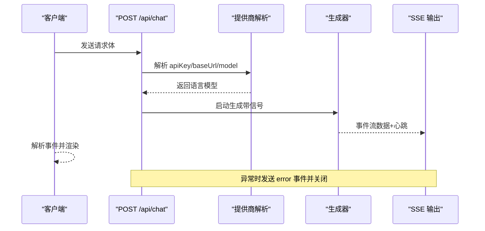
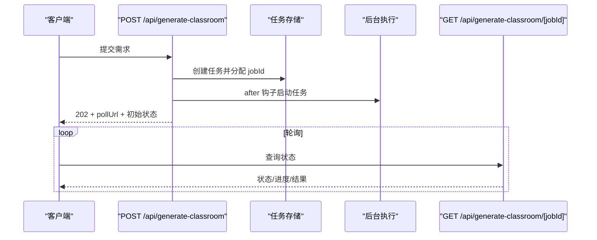
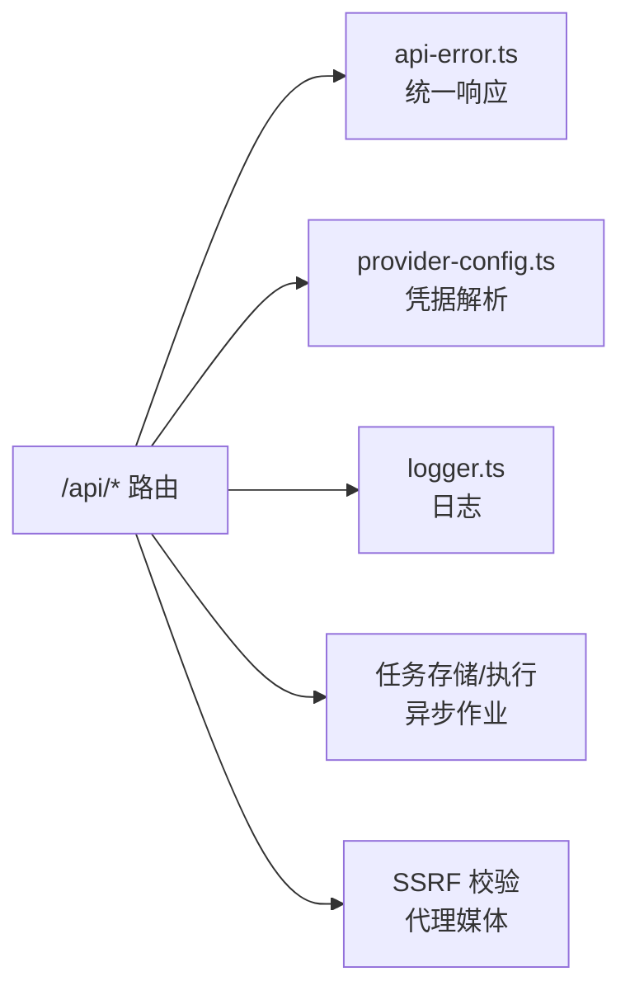

# API 接口文档

<cite>
**本文档引用的文件**
- [app/api/chat/route.ts](file://app/api/chat/route.ts)
- [app/api/classroom/route.ts](file://app/api/classroom/route.ts)
- [app/api/generate-classroom/route.ts](file://app/api/generate-classroom/route.ts)
- [app/api/generate-classroom/[jobId]/route.ts](file://app/api/generate-classroom/[jobId]/route.ts)
- [app/api/server-providers/route.ts](file://app/api/server-providers/route.ts)
- [app/api/health/route.ts](file://app/api/health/route.ts)
- [app/api/generate/tts/route.ts](file://app/api/generate/tts/route.ts)
- [app/api/generate/image/route.ts](file://app/api/generate/image/route.ts)
- [app/api/generate/video/route.ts](file://app/api/generate/video/route.ts)
- [app/api/transcription/route.ts](file://app/api/transcription/route.ts)
- [app/api/proxy-media/route.ts](file://app/api/proxy-media/route.ts)
- [app/api/verify-image-provider/route.ts](file://app/api/verify-image-provider/route.ts)
- [app/api/verify-model/route.ts](file://app/api/verify-model/route.ts)
- [app/api/web-search/route.ts](file://app/api/web-search/route.ts)
- [app/api/pbl/chat/route.ts](file://app/api/pbl/chat/route.ts)
</cite>

## 目录
1. [简介](#简介)
2. [项目结构](#项目结构)
3. [核心组件](#核心组件)
4. [架构总览](#架构总览)
5. [详细组件分析](#详细组件分析)
6. [依赖关系分析](#依赖关系分析)
7. [性能考量](#性能考量)
8. [故障排查指南](#故障排查指南)
9. [结论](#结论)
10. [附录](#附录)

## 简介
本文件为 OpenMAIC 的完整 API 接口文档，覆盖聊天、课堂、生成（TTS/ASR/图像/视频）、代理媒体、健康检查、服务器提供商配置与验证等接口。文档包含每个接口的 HTTP 方法、URL 模式、请求/响应格式、认证方式、错误处理策略、安全与速率限制建议、常见用例与客户端实现要点，以及调试与监控方法。

## 项目结构
OpenMAIC 使用 Next.js App Router，API 路由集中于 app/api 下，按功能域划分目录，如 chat、generate、transcription、proxy-media 等。各路由文件导出标准的 Next.js 请求处理器（GET/POST），统一通过 apiSuccess/apiError 返回标准化响应，并在必要处设置 maxDuration 控制执行时长。

图表来源
- [app/api/chat/route.ts:1-191](file://app/api/chat/route.ts#L1-L191)
- [app/api/classroom/route.ts:1-71](file://app/api/classroom/route.ts#L1-L71)
- [app/api/generate-classroom/route.ts:1-52](file://app/api/generate-classroom/route.ts#L1-L52)
- [app/api/generate-classroom/[jobId]/route.ts](file://app/api/generate-classroom/[jobId]/route.ts#L1-L49)
- [app/api/server-providers/route.ts:1-35](file://app/api/server-providers/route.ts#L1-L35)
- [app/api/health/route.ts:1-8](file://app/api/health/route.ts#L1-L8)
- [app/api/generate/tts/route.ts:1-81](file://app/api/generate/tts/route.ts#L1-L81)
- [app/api/generate/image/route.ts:1-79](file://app/api/generate/image/route.ts#L1-L79)
- [app/api/generate/video/route.ts:1-84](file://app/api/generate/video/route.ts#L1-L84)
- [app/api/transcription/route.ts:1-52](file://app/api/transcription/route.ts#L1-L52)
- [app/api/proxy-media/route.ts:1-61](file://app/api/proxy-media/route.ts#L1-L61)
- [app/api/verify-image-provider/route.ts:1-57](file://app/api/verify-image-provider/route.ts#L1-L57)
- [app/api/verify-model/route.ts:1-69](file://app/api/verify-model/route.ts#L1-L69)
- [app/api/web-search/route.ts:1-52](file://app/api/web-search/route.ts#L1-L52)
- [app/api/pbl/chat/route.ts:1-75](file://app/api/pbl/chat/route.ts#L1-L75)

章节来源
- [app/api/chat/route.ts:1-191](file://app/api/chat/route.ts#L1-L191)
- [app/api/classroom/route.ts:1-71](file://app/api/classroom/route.ts#L1-L71)
- [app/api/generate-classroom/route.ts:1-52](file://app/api/generate-classroom/route.ts#L1-L52)
- [app/api/generate-classroom/[jobId]/route.ts](file://app/api/generate-classroom/[jobId]/route.ts#L1-L49)
- [app/api/server-providers/route.ts:1-35](file://app/api/server-providers/route.ts#L1-L35)
- [app/api/health/route.ts:1-8](file://app/api/health/route.ts#L1-L8)
- [app/api/generate/tts/route.ts:1-81](file://app/api/generate/tts/route.ts#L1-L81)
- [app/api/generate/image/route.ts:1-79](file://app/api/generate/image/route.ts#L1-L79)
- [app/api/generate/video/route.ts:1-84](file://app/api/generate/video/route.ts#L1-L84)
- [app/api/transcription/route.ts:1-52](file://app/api/transcription/route.ts#L1-L52)
- [app/api/proxy-media/route.ts:1-61](file://app/api/proxy-media/route.ts#L1-L61)
- [app/api/verify-image-provider/route.ts:1-57](file://app/api/verify-image-provider/route.ts#L1-L57)
- [app/api/verify-model/route.ts:1-69](file://app/api/verify-model/route.ts#L1-L69)
- [app/api/web-search/route.ts:1-52](file://app/api/web-search/route.ts#L1-L52)
- [app/api/pbl/chat/route.ts:1-75](file://app/api/pbl/chat/route.ts#L1-L75)

## 核心组件
- 统一响应与错误处理：所有路由使用 apiSuccess/apiError 返回标准化 JSON 响应，包含状态码、消息与数据字段。
- 提供商配置解析：通过 resolveApiKey/resolveBaseUrl 等函数从客户端或服务端配置解析有效凭据与基础地址。
- 异步作业：课堂生成采用“提交 → 轮询”模式，通过 after 钩子后台运行任务，客户端以固定轮询间隔查询状态。
- SSE 流：聊天接口返回 Server-Sent Events 流，支持心跳维持连接，中断通过 AbortSignal 处理。
- 安全与防护：代理媒体接口对 URL 进行 SSRF 校验，禁止重定向；内容敏感检测对图像/视频生成进行拦截。

章节来源
- [app/api/chat/route.ts:44-191](file://app/api/chat/route.ts#L44-L191)
- [app/api/generate-classroom/route.ts:11-52](file://app/api/generate-classroom/route.ts#L11-L52)
- [app/api/generate-classroom/[jobId]/route.ts](file://app/api/generate-classroom/[jobId]/route.ts#L11-L49)
- [app/api/proxy-media/route.ts:23-61](file://app/api/proxy-media/route.ts#L23-L61)

## 架构总览
下图展示主要 API 的交互流程与职责边界：

图表来源
- [app/api/health/route.ts:1-8](file://app/api/health/route.ts#L1-L8)
- [app/api/server-providers/route.ts:1-35](file://app/api/server-providers/route.ts#L1-L35)
- [app/api/chat/route.ts:44-191](file://app/api/chat/route.ts#L44-L191)
- [app/api/classroom/route.ts:11-71](file://app/api/classroom/route.ts#L11-L71)
- [app/api/generate-classroom/route.ts:11-52](file://app/api/generate-classroom/route.ts#L11-L52)
- [app/api/generate-classroom/[jobId]/route.ts](file://app/api/generate-classroom/[jobId]/route.ts#L11-L49)
- [app/api/generate/tts/route.ts:21-81](file://app/api/generate/tts/route.ts#L21-L81)
- [app/api/generate/image/route.ts:29-79](file://app/api/generate/image/route.ts#L29-L79)
- [app/api/generate/video/route.ts:30-84](file://app/api/generate/video/route.ts#L30-L84)
- [app/api/transcription/route.ts:11-52](file://app/api/transcription/route.ts#L11-L52)
- [app/api/proxy-media/route.ts:23-61](file://app/api/proxy-media/route.ts#L23-L61)

## 详细组件分析

### 健康检查接口
- 方法与路径
  - GET /api/health
- 功能
  - 返回服务状态与版本信息，用于存活探测与版本确认。
- 认证
  - 无需认证。
- 响应
  - 成功：包含 status 与 version 字段。
- 错误
  - 无内部错误路径，异常将被统一错误处理捕获。
- 速率限制
  - 建议按服务规模设置每分钟上限，避免探测风暴。
- 安全
  - 无敏感信息，可公开访问。

章节来源
- [app/api/health/route.ts:1-8](file://app/api/health/route.ts#L1-L8)

### 服务器提供商配置接口
- 方法与路径
  - GET /api/server-providers
- 功能
  - 返回当前可用的服务器端提供商清单，涵盖通用模型、TTS、ASR、PDF、图像、视频与网络搜索。
- 认证
  - 无需认证。
- 响应
  - 成功：包含 providers、tts、asr、pdf、image、video、webSearch 等键。
- 错误
  - 内部错误时返回统一错误响应。
- 速率限制
  - 可适度放宽，但需结合后端限流策略。
- 安全
  - 仅返回公开配置，不暴露密钥。

章节来源
- [app/api/server-providers/route.ts:1-35](file://app/api/server-providers/route.ts#L1-L35)

### 聊天接口（SSE）
- 方法与路径
  - POST /api/chat
- 功能
  - 接收客户端完整状态（消息与 storeState），单次生成并通过 SSE 流式返回增量文本与工具调用事件。
- 认证
  - 支持客户端传入 apiKey/baseUrl 或使用服务端默认配置解析。
- 请求体
  - StatelessChatRequest：包含 messages、storeState、config（含 agentIds）、可选 apiKey、baseUrl、model。
- 响应
  - 文本事件流（text/event-stream），事件类型包括数据事件与心跳注释，异常时发送 error 事件。
- 中断与超时
  - 使用 AbortSignal 处理客户端中断；服务端设置心跳维持连接，maxDuration 限制最长执行时间。
- 错误
  - 缺少必填字段返回 400；未配置 API Key 返回 401；内部错误返回 500。
- 速率限制
  - 建议按用户/IP 限速，避免滥用；可结合 maxDuration 控制资源占用。
- 安全
  - 严格校验输入参数，避免注入；SSE 心跳防止代理/浏览器关闭空闲连接。
- 客户端实现要点
  - 使用 EventSource 或 fetch + ReadableStream 解析 SSE；监听 error 事件并提示重试。
- 性能优化
  - 合理设置 maxDuration；短消息优先直连；长对话建议分段或缓存上下文。

图表来源
- [app/api/chat/route.ts:44-191](file://app/api/chat/route.ts#L44-L191)

章节来源
- [app/api/chat/route.ts:1-191](file://app/api/chat/route.ts#L1-L191)

### 课堂接口（同步存储与异步生成）
- 同步课堂存储
  - 方法与路径
    - POST /api/classroom
    - GET /api/classroom?id={id}
  - 功能
    - 创建课堂并返回唯一 id 与可访问链接；根据 id 查询课堂内容。
  - 认证
    - 无需认证。
  - 请求体/参数
    - POST：stage、scenes 为必填；GET：id 为查询参数。
  - 响应
    - POST：201，返回 id 与 url；GET：200，返回 classroom。
  - 错误
    - 缺少必填字段返回 400；无效 id 返回 400；未找到返回 404；内部错误返回 500。
- 异步课堂生成
  - 方法与路径
    - POST /api/generate-classroom
    - GET /api/generate-classroom/[jobId]
  - 功能
    - 提交生成需求，立即返回 jobId 与轮询地址；轮询获取进度与结果。
  - 认证
    - 无需认证。
  - 请求体
    - requirement 为必填；可选 pdfContent、language。
  - 响应
    - POST：202，返回 jobId、pollUrl、pollIntervalMs、初始状态；GET：返回状态、进度、场景数、结果或错误。
  - 错误
    - 缺少 requirement 返回 400；内部错误返回 500。
  - 速率限制
    - 建议限制单用户并发任务数量与轮询频率。
  - 安全
    - jobId 与轮询地址仅用于状态查询，不暴露敏感数据。
  - 客户端实现要点
    - 使用固定轮询间隔（如 5 秒）；done=true 后停止轮询；失败时提示重试。
  - 性能优化
    - 合理拆分需求，避免一次性生成过多场景；利用缓存与增量更新。

图表来源
- [app/api/generate-classroom/route.ts:11-52](file://app/api/generate-classroom/route.ts#L11-L52)
- [app/api/generate-classroom/[jobId]/route.ts](file://app/api/generate-classroom/[jobId]/route.ts#L11-L49)

章节来源
- [app/api/classroom/route.ts:11-71](file://app/api/classroom/route.ts#L11-L71)
- [app/api/generate-classroom/route.ts:1-52](file://app/api/generate-classroom/route.ts#L1-L52)
- [app/api/generate-classroom/[jobId]/route.ts](file://app/api/generate-classroom/[jobId]/route.ts#L1-L49)

### 多媒体接口

#### TTS（文本转语音）
- 方法与路径
  - POST /api/generate/tts
- 功能
  - 将文本转换为音频，返回 base64 编码与格式信息。
- 认证
  - 支持客户端传入 ttsApiKey/ttsBaseUrl 或使用服务端默认配置。
- 请求体
  - text、audioId、ttsProviderId、ttsVoice 为必填；ttsSpeed 可选；禁止使用 browser-native-tts。
- 响应
  - 成功：{audioId, base64, format}。
- 错误
  - 缺少必填字段返回 400；未配置 API Key 返回 401；内部错误返回 500。
- 速率限制
  - 建议按用户/会话限速，避免高并发导致上游限流。
- 安全
  - 禁止浏览器原生 TTS，确保统一控制与日志追踪。
- 客户端实现要点
  - 并行调用多个 TTS 接口以提升体验；注意音频 ID 对齐播放顺序。

章节来源
- [app/api/generate/tts/route.ts:1-81](file://app/api/generate/tts/route.ts#L1-L81)

#### 图像生成
- 方法与路径
  - POST /api/generate/image
- 功能
  - 根据提示词生成图像，支持宽高或比例自动推导。
- 认证
  - 通过请求头 x-image-provider、x-api-key、x-base-url、x-image-model 指定提供商与凭据；若未提供则使用服务端默认配置。
- 请求体
  - prompt 为必填；可选 negativePrompt、width、height、aspectRatio、style；当提供 aspectRatio 且未指定宽高时自动换算尺寸。
- 响应
  - 成功：{result}；失败：根据内容安全策略返回 400 或 500。
- 错误
  - 缺少 prompt 返回 400；未配置 API Key 返回 401；内容敏感返回 400；内部错误返回 500。
- 速率限制
  - 建议按提供商与账户额度限流，避免触发上游风控。
- 安全
  - 内容敏感检测拦截敏感内容；代理媒体用于跨域下载。

章节来源
- [app/api/generate/image/route.ts:1-79](file://app/api/generate/image/route.ts#L1-L79)

#### 视频生成
- 方法与路径
  - POST /api/generate/video
- 功能
  - 根据提示词生成视频，采用异步任务模式，maxDuration 较长。
- 认证
  - 通过请求头 x-video-provider、x-video-model、x-api-key、x-base-url 指定提供商与凭据。
- 请求体
  - prompt 为必填；可选 duration、aspectRatio、resolution；内部进行选项归一化。
- 响应
  - 成功：{result}；失败：根据内容安全策略返回 400 或 500。
- 错误
  - 缺少 prompt 返回 400；未配置 API Key 返回 401；内容敏感返回 400；内部错误返回 500。
- 速率限制
  - 视频生成耗时较长，建议限制并发与频率，合理排队。
- 安全
  - 内容敏感检测拦截敏感内容；代理媒体用于跨域下载。

章节来源
- [app/api/generate/video/route.ts:1-84](file://app/api/generate/video/route.ts#L1-L84)

#### 语音转写（ASR）
- 方法与路径
  - POST /api/transcription
- 功能
  - 上传音频文件并进行语音转写。
- 认证
  - 通过表单字段 providerId、language、apiKey、baseUrl 指定提供商与凭据；providerId 必须由客户端提供。
- 请求体
  - multipart/form-data：audio（必填）、providerId、language、apiKey、baseUrl。
- 响应
  - 成功：{text}。
- 错误
  - 缺少音频返回 400；内部错误返回 500。
- 速率限制
  - 建议按音频时长与并发限制，避免超时与限流。
- 安全
  - 严格校验上传文件类型与大小，避免恶意文件。

章节来源
- [app/api/transcription/route.ts:1-52](file://app/api/transcription/route.ts#L1-L52)

#### 代理媒体（跨域下载）
- 方法与路径
  - POST /api/proxy-media
- 功能
  - 服务端代理下载远程媒体（图片/视频），解决浏览器 CORS 问题。
- 认证
  - 无需认证。
- 请求体
  - { url }。
- 响应
  - 成功：二进制 blob，携带 Content-Type 与长度；失败：400/403/502。
- 错误
  - 缺少 url 返回 400；SSRF 防护拒绝返回 403；上游错误返回 502。
- 速率限制
  - 建议限制单 IP 下载速率与并发，防止滥用。
- 安全
  - SSRF 校验与禁用重定向，防止内网探测与中间人攻击。

章节来源
- [app/api/proxy-media/route.ts:1-61](file://app/api/proxy-media/route.ts#L1-L61)

### 配置与验证接口

#### 验证图像提供商连通性
- 方法与路径
  - POST /api/verify-image-provider
- 功能
  - 在不实际生成图像的前提下验证提供商凭据与连通性。
- 认证
  - 通过请求头 x-image-provider、x-image-model、x-api-key、x-base-url 指定配置。
- 响应
  - 成功：{message}；失败：400/500。
- 速率限制
  - 可适度放宽，但需防扫描行为。
- 安全
  - 仅做连通性测试，不产生费用。

章节来源
- [app/api/verify-image-provider/route.ts:1-57](file://app/api/verify-image-provider/route.ts#L1-L57)

#### 验证模型连通性
- 方法与路径
  - POST /api/verify-model
- 功能
  - 解析模型字符串并尝试最小化文本生成，验证连通性与凭据有效性。
- 认证
  - 请求体包含 apiKey、baseUrl、model、providerType、requiresApiKey。
- 响应
  - 成功：{message, response}；失败：400/401/429/500（根据错误类型细化）。
- 速率限制
  - 可作为诊断接口，限制调用频率。
- 安全
  - 不暴露真实业务数据，仅做连通性测试。

章节来源
- [app/api/verify-model/route.ts:1-69](file://app/api/verify-model/route.ts#L1-L69)

#### 网络搜索
- 方法与路径
  - POST /api/web-search
- 功能
  - 使用 Tavily 执行网络搜索，返回答案、来源与上下文。
- 认证
  - 通过请求体 apiKey 或服务端配置解析 Tavily 凭据。
- 请求体
  - { query, apiKey? }。
- 响应
  - 成功：{answer, sources, context, query, responseTime}；失败：500。
- 错误
  - 缺少 query 返回 400；未配置 API Key 返回 400；内部错误返回 500。
- 速率限制
  - 受上游配额限制，建议客户端缓存与节流。
- 安全
  - 仅传递查询，不保存敏感内容。

章节来源
- [app/api/web-search/route.ts:1-52](file://app/api/web-search/route.ts#L1-L52)

#### PBL 聊天（@提及路由）
- 方法与路径
  - POST /api/pbl/chat
- 功能
  - 在 PBL 运行时，根据 @question/@judge 场景生成相应回复。
- 认证
  - 通过请求头解析模型配置。
- 请求体
  - 包含 message、agent、currentIssue、recentMessages、userRole、agentType。
- 响应
  - 成功：{message, agentName}；失败：500。
- 错误
  - 缺少必填字段返回 400；内部错误返回 500。
- 速率限制
  - 可适度放宽，但需结合模型成本控制。
- 安全
  - 严格校验上下文与角色，避免越权输出。

章节来源
- [app/api/pbl/chat/route.ts:1-75](file://app/api/pbl/chat/route.ts#L1-L75)

## 依赖关系分析
- 统一错误处理：所有路由依赖 api-error.ts 提供的 apiError/apiSuccess，保证响应一致性。
- 提供商解析：provider-config.ts 提供 resolveApiKey/resolveBaseUrl 等解析函数，支持客户端覆盖与服务端回退。
- 异步作业：after 钩子与任务存储模块协作，实现“提交 → 轮询”模式。
- SSE 流：chat 路由使用 TransformStream 与心跳机制，确保长连接稳定。
- SSRF 防护：proxy-media 路由对 URL 进行 SSRF 校验与重定向禁用。

图表来源
- [app/api/chat/route.ts:21-23](file://app/api/chat/route.ts#L21-L23)
- [app/api/generate-classroom/route.ts:5-7](file://app/api/generate-classroom/route.ts#L5-L7)
- [app/api/proxy-media/route.ts:15-35](file://app/api/proxy-media/route.ts#L15-L35)

章节来源
- [app/api/chat/route.ts:1-191](file://app/api/chat/route.ts#L1-L191)
- [app/api/generate-classroom/route.ts:1-52](file://app/api/generate-classroom/route.ts#L1-L52)
- [app/api/proxy-media/route.ts:1-61](file://app/api/proxy-media/route.ts#L1-L61)

## 性能考量
- SSE 连接
  - 使用心跳维持连接，避免代理/浏览器关闭空闲连接；合理设置 maxDuration。
- 异步作业
  - 课堂生成采用 after 钩子后台执行，客户端轮询；建议固定轮询间隔与最大轮询次数。
- 多媒体生成
  - 图像/视频生成耗时较长，建议限制并发与排队；对大文件进行预检与分片处理。
- 代理媒体
  - 设置 maxDuration 与缓存头，减少重复下载；对上游错误进行降级处理。
- 模型连通性测试
  - 仅做轻量测试，避免高频调用；对 429/超时进行指数退避。

## 故障排查指南
- 通用错误
  - 使用统一错误响应定位问题；查看日志中错误堆栈与请求参数。
- API Key 问题
  - verify-model 与 verify-image-provider 可快速验证凭据有效性。
- SSE 连接中断
  - 检查心跳是否正常；确认客户端是否正确处理 AbortSignal；排查代理/防火墙。
- 异步作业未完成
  - 确认 jobId 是否有效；检查轮询间隔与服务端任务状态；关注错误字段。
- 内容敏感拦截
  - 图像/视频生成可能因内容安全策略被拒绝；调整提示词或更换提供商。
- 代理媒体失败
  - 检查 URL 是否符合 SSRF 校验；确认上游返回状态与内容类型；避免重定向。

章节来源
- [app/api/verify-model/route.ts:46-67](file://app/api/verify-model/route.ts#L46-L67)
- [app/api/verify-image-provider/route.ts:47-54](file://app/api/verify-image-provider/route.ts#L47-L54)
- [app/api/generate/image/route.ts:70-77](file://app/api/generate/image/route.ts#L70-L77)
- [app/api/generate/video/route.ts:75-82](file://app/api/generate/video/route.ts#L75-L82)
- [app/api/proxy-media/route.ts:31-44](file://app/api/proxy-media/route.ts#L31-L44)

## 结论
OpenMAIC 的 API 设计遵循统一响应、可配置提供商与异步作业模式，覆盖聊天、课堂、多媒体与网络搜索等核心能力。通过 SSE、异步轮询与严格的错误处理与安全策略，系统在易用性与稳定性之间取得平衡。建议在生产环境中结合速率限制、日志监控与告警策略，持续优化性能与用户体验。

## 附录

### 协议与认证
- 认证方式
  - 大多数接口支持客户端显式传入 apiKey/baseUrl，或使用服务端默认配置回退。
  - 聊天接口通过 AbortSignal 实现中断；课堂生成通过 jobId 与轮询地址实现无状态查询。
- 速率限制建议
  - 基于用户/IP/模型维度设置 QPS 与并发上限；对 SSE/异步作业设置最大时长与重试退避。
- 安全考虑
  - SSRF 校验与重定向禁用；内容敏感检测；代理媒体仅允许合法 URL；日志脱敏。

### 常见用例与客户端实现要点
- 聊天（SSE）
  - 使用 EventSource 或 fetch + ReadableStream；处理 error 事件与中断；合并增量事件。
- 课堂生成
  - 提交后轮询状态，done=true 后停止；失败时提示重试或回退策略。
- 多媒体生成
  - 并行调用 TTS；使用代理媒体下载远端资源；对敏感内容进行二次校验。
- 模型验证
  - 在设置页面或初始化阶段调用 verify-model；根据错误类型引导用户修正配置。

### 调试与监控
- 日志
  - 使用统一 logger 记录请求参数、错误堆栈与关键指标。
- 监控
  - 关键指标：请求量、成功率、P95/P99 延迟、错误分布、上游配额使用率。
- 工具
  - curl/postman 快速验证；浏览器开发者工具观察 SSE 与轮询；服务端日志聚合与告警。