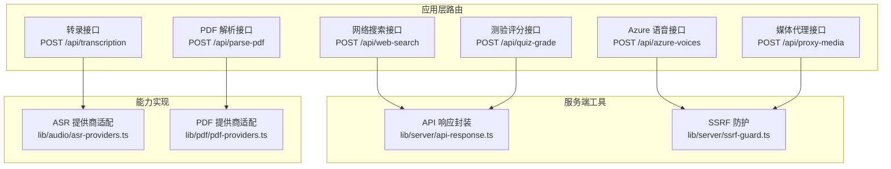
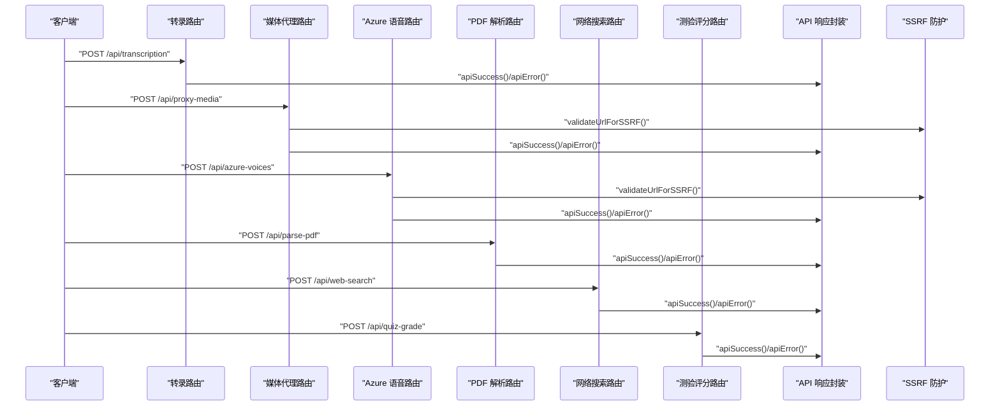
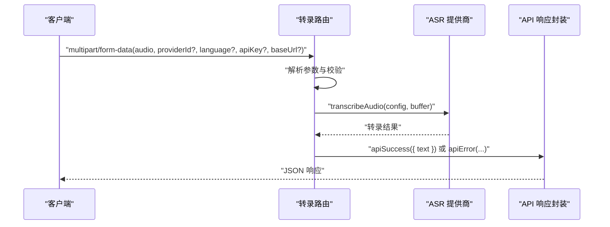
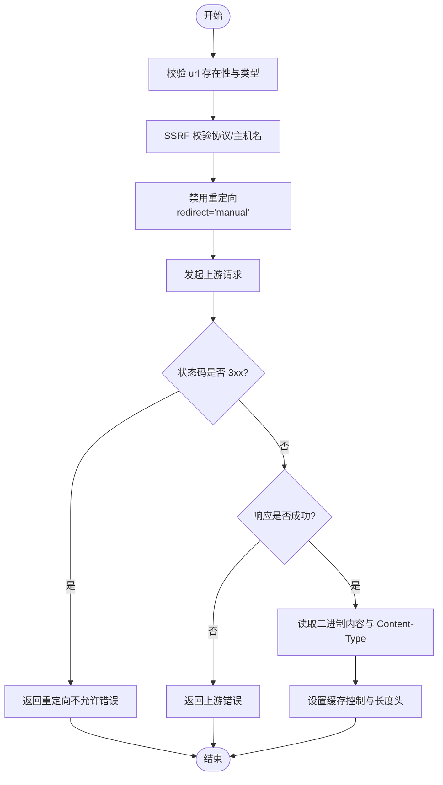
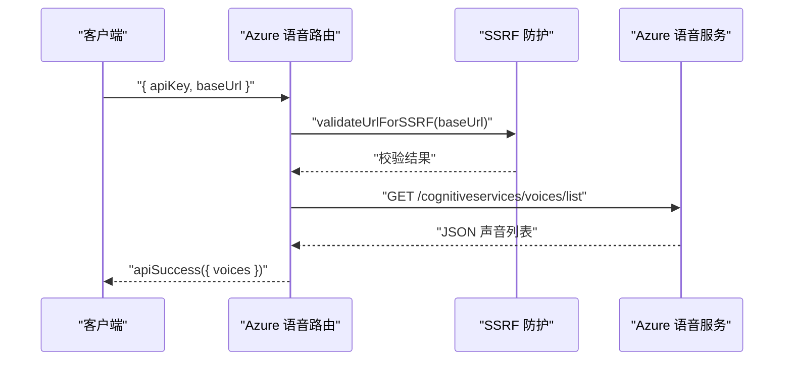
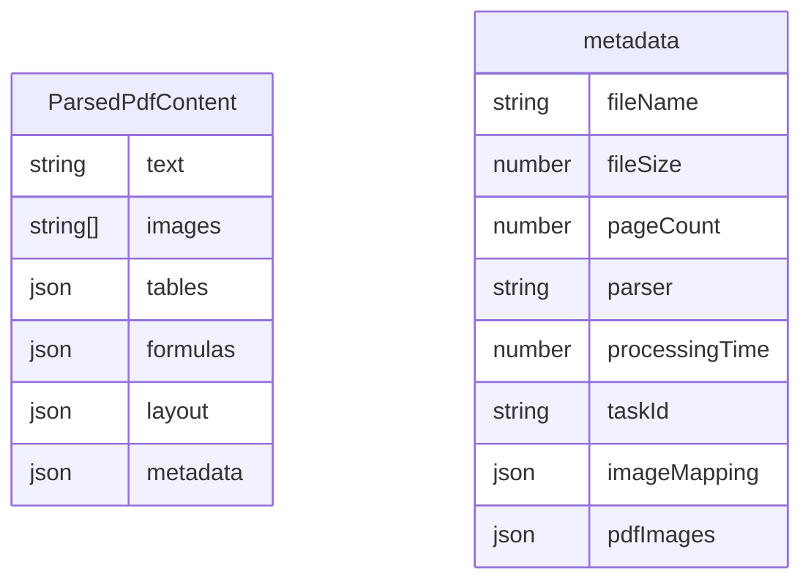
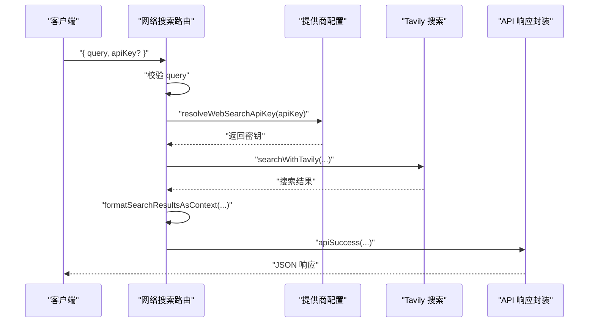
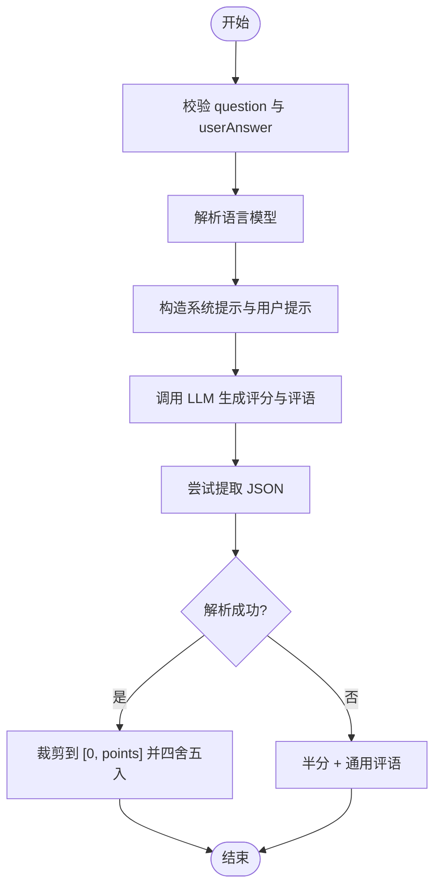
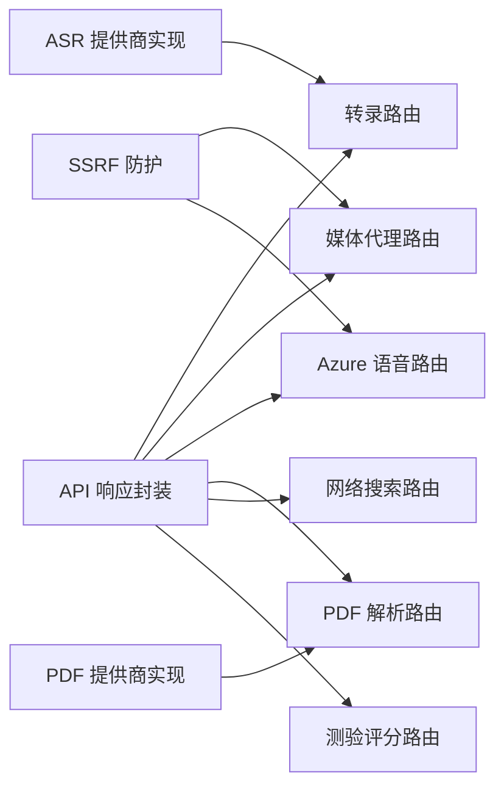

# 多媒体接口

<cite>
**本文引用的文件**
- [app/api/transcription/route.ts](file://app/api/transcription/route.ts)
- [app/api/proxy-media/route.ts](file://app/api/proxy-media/route.ts)
- [app/api/azure-voices/route.ts](file://app/api/azure-voices/route.ts)
- [app/api/parse-pdf/route.ts](file://app/api/parse-pdf/route.ts)
- [app/api/web-search/route.ts](file://app/api/web-search/route.ts)
- [app/api/quiz-grade/route.ts](file://app/api/quiz-grade/route.ts)
- [lib/audio/asr-providers.ts](file://lib/audio/asr-providers.ts)
- [lib/pdf/pdf-providers.ts](file://lib/pdf/pdf-providers.ts)
- [lib/audio/types.ts](file://lib/audio/types.ts)
- [lib/pdf/types.ts](file://lib/pdf/types.ts)
- [lib/types/pdf.ts](file://lib/types/pdf.ts)
- [lib/server/api-response.ts](file://lib/server/api-response.ts)
- [lib/server/ssrf-guard.ts](file://lib/server/ssrf-guard.ts)
</cite>

## 目录
1. [简介](#简介)
2. [项目结构](#项目结构)
3. [核心组件](#核心组件)
4. [架构总览](#架构总览)
5. [详细组件分析](#详细组件分析)
6. [依赖关系分析](#依赖关系分析)
7. [性能考量](#性能考量)
8. [故障排查指南](#故障排查指南)
9. [结论](#结论)
10. [附录](#附录)

## 简介
本文件为 OpenMAIC 的多媒体接口提供系统化的 API 文档与实现解析，覆盖以下能力：
- 语音转录接口：音频格式支持、转录参数与输出格式
- 媒体代理接口：媒体文件代理转发与缓存策略
- Azure 语音接口：语音列表获取与安全限制
- PDF 解析接口：PDF 处理、内容提取与格式转换
- 网络搜索接口：搜索参数、结果过滤与安全考虑
- 测验评分接口：评分算法与结果处理
- 性能优化建议与最佳实践
- 完整 API 示例、错误处理与集成指南

## 项目结构
OpenMAIC 的多媒体相关 API 主要位于应用层路由目录，配合服务端工具与类型定义完成请求处理、鉴权与响应封装。

**图表来源**
- [app/api/transcription/route.ts:1-52](file://app/api/transcription/route.ts#L1-L52)
- [app/api/proxy-media/route.ts:1-61](file://app/api/proxy-media/route.ts#L1-L61)
- [app/api/azure-voices/route.ts:1-67](file://app/api/azure-voices/route.ts#L1-L67)
- [app/api/parse-pdf/route.ts:1-65](file://app/api/parse-pdf/route.ts#L1-L65)
- [app/api/web-search/route.ts:1-52](file://app/api/web-search/route.ts#L1-L52)
- [app/api/quiz-grade/route.ts:1-96](file://app/api/quiz-grade/route.ts#L1-L96)
- [lib/server/api-response.ts:1-46](file://lib/server/api-response.ts#L1-L46)
- [lib/server/ssrf-guard.ts:1-50](file://lib/server/ssrf-guard.ts#L1-L50)
- [lib/audio/asr-providers.ts](file://lib/audio/asr-providers.ts)
- [lib/pdf/pdf-providers.ts](file://lib/pdf/pdf-providers.ts)

**章节来源**
- [app/api/transcription/route.ts:1-52](file://app/api/transcription/route.ts#L1-L52)
- [app/api/proxy-media/route.ts:1-61](file://app/api/proxy-media/route.ts#L1-L61)
- [app/api/azure-voices/route.ts:1-67](file://app/api/azure-voices/route.ts#L1-L67)
- [app/api/parse-pdf/route.ts:1-65](file://app/api/parse-pdf/route.ts#L1-L65)
- [app/api/web-search/route.ts:1-52](file://app/api/web-search/route.ts#L1-L52)
- [app/api/quiz-grade/route.ts:1-96](file://app/api/quiz-grade/route.ts#L1-L96)

## 核心组件
- 转录接口：接收音频文件与可选的提供商、语言、密钥与基础地址，调用 ASR 提供商执行转录，返回文本结果。
- 媒体代理接口：对用户提供的远程媒体 URL 进行 SSRF 校验与重定向限制，下载二进制内容并返回，带缓存控制头。
- Azure 语音接口：校验密钥与基础地址后，向 Azure 语音服务获取可用声音列表。
- PDF 解析接口：接收 PDF 文件与可选提供商、密钥与基础地址，调用 PDF 提供商解析，附加文件元数据。
- 网络搜索接口：接收查询与可选密钥，调用 Tavily 搜索并格式化上下文。
- 测验评分接口：接收题目、用户答案、分数与可选语言与评分要点，通过 LLM 评分并返回分数与评语。

**章节来源**
- [app/api/transcription/route.ts:11-51](file://app/api/transcription/route.ts#L11-L51)
- [app/api/proxy-media/route.ts:23-59](file://app/api/proxy-media/route.ts#L23-L59)
- [app/api/azure-voices/route.ts:13-65](file://app/api/azure-voices/route.ts#L13-L65)
- [app/api/parse-pdf/route.ts:10-63](file://app/api/parse-pdf/route.ts#L10-L63)
- [app/api/web-search/route.ts:15-50](file://app/api/web-search/route.ts#L15-L50)
- [app/api/quiz-grade/route.ts:28-94](file://app/api/quiz-grade/route.ts#L28-L94)

## 架构总览
下图展示各多媒体接口的请求流程与关键安全与响应封装点：

**图表来源**
- [app/api/transcription/route.ts:11-51](file://app/api/transcription/route.ts#L11-L51)
- [app/api/proxy-media/route.ts:23-59](file://app/api/proxy-media/route.ts#L23-L59)
- [app/api/azure-voices/route.ts:13-65](file://app/api/azure-voices/route.ts#L13-L65)
- [app/api/parse-pdf/route.ts:10-63](file://app/api/parse-pdf/route.ts#L10-L63)
- [app/api/web-search/route.ts:15-50](file://app/api/web-search/route.ts#L15-L50)
- [app/api/quiz-grade/route.ts:28-94](file://app/api/quiz-grade/route.ts#L28-L94)
- [lib/server/api-response.ts:26-45](file://lib/server/api-response.ts#L26-L45)
- [lib/server/ssrf-guard.ts:19-48](file://lib/server/ssrf-guard.ts#L19-L48)

## 详细组件分析

### 语音转录接口
- 接口路径：POST /api/transcription
- 请求体：
  - audio: 二进制音频文件（必填）
  - providerId: ASR 提供商标识（可选，默认使用 openai-whisper）
  - language: 语言代码（可选，默认自动检测）
  - apiKey: 提供商密钥（可选，优先使用传入值）
  - baseUrl: 自定义基础地址（可选）
- 处理逻辑：
  - 校验必填字段；若未指定提供商则回退到默认值
  - 解析提供商密钥与基础地址
  - 将上传的音频文件读取为字节缓冲区
  - 调用 ASR 提供商实现进行转录
  - 返回文本结果
- 输出：
  - 成功：包含 text 字段的结果对象
  - 失败：统一错误码与错误信息
- 安全与限制：
  - 支持最大执行时长限制
  - 使用统一的错误封装与日志记录

**图表来源**
- [app/api/transcription/route.ts:11-51](file://app/api/transcription/route.ts#L11-L51)
- [lib/audio/asr-providers.ts](file://lib/audio/asr-providers.ts)

**章节来源**
- [app/api/transcription/route.ts:11-51](file://app/api/transcription/route.ts#L11-L51)
- [lib/audio/types.ts:144-172](file://lib/audio/types.ts#L144-L172)

### 媒体代理接口
- 接口路径：POST /api/proxy-media
- 请求体：{ url: string }
- 处理逻辑：
  - 校验 url 是否存在且为字符串
  - 执行 SSRF 校验，禁止本地/私有网络地址
  - 禁止跟随重定向，避免内部跳转风险
  - 获取上游响应的二进制内容与 Content-Type
  - 设置缓存控制头并返回二进制流
- 输出：
  - 成功：二进制响应，包含 Content-Type 与 Content-Length
  - 失败：统一错误码与错误信息
- 安全与限制：
  - 最大执行时长限制
  - 严格的 URL 协议与主机名白名单校验
  - 禁止重定向，防止 SSRF 利用

**图表来源**
- [app/api/proxy-media/route.ts:23-59](file://app/api/proxy-media/route.ts#L23-L59)
- [lib/server/ssrf-guard.ts:19-48](file://lib/server/ssrf-guard.ts#L19-L48)

**章节来源**
- [app/api/proxy-media/route.ts:23-59](file://app/api/proxy-media/route.ts#L23-L59)
- [lib/server/ssrf-guard.ts:19-48](file://lib/server/ssrf-guard.ts#L19-L48)

### Azure 语音接口
- 接口路径：POST /api/azure-voices
- 请求体：{ apiKey: string, baseUrl: string }
- 处理逻辑：
  - 校验密钥与基础地址
  - 对基础地址执行 SSRF 校验
  - 向 Azure 语音服务的“声音列表”端点发起 GET 请求（禁用重定向）
  - 解析 JSON 并返回可用声音列表
- 输出：
  - 成功：包含 voices 数组的结果对象
  - 失败：统一错误码与错误信息
- 安全与限制：
  - 最大执行时长限制
  - 严格的基础地址校验与重定向限制

**图表来源**
- [app/api/azure-voices/route.ts:13-65](file://app/api/azure-voices/route.ts#L13-L65)
- [lib/server/ssrf-guard.ts:19-48](file://lib/server/ssrf-guard.ts#L19-L48)

**章节来源**
- [app/api/azure-voices/route.ts:13-65](file://app/api/azure-voices/route.ts#L13-L65)

### PDF 解析接口
- 接口路径：POST /api/parse-pdf
- 请求体：multipart/form-data(pdf, providerId?, apiKey?, baseUrl?)
- 处理逻辑：
  - 校验 Content-Type 必须为 multipart/form-data
  - 校验 PDF 文件是否存在
  - 解析提供商标识、密钥与基础地址（默认使用 unpdf）
  - 将 PDF 文件读取为字节缓冲区
  - 调用 PDF 提供商实现进行解析
  - 补充文件元数据（文件名、大小、页数等）
- 输出：
  - 成功：包含 data（ParsedPdfContent）的结果对象
  - 失败：统一错误码与错误信息
- 数据模型（简化）：
  - ParsedPdfContent：text、images、tables、formulas、layout、metadata
  - metadata：fileName、fileSize、pageCount、parser、processingTime、taskId、imageMapping、pdfImages 等

**图表来源**
- [lib/types/pdf.ts:9-59](file://lib/types/pdf.ts#L9-L59)

**章节来源**
- [app/api/parse-pdf/route.ts:10-63](file://app/api/parse-pdf/route.ts#L10-L63)
- [lib/pdf/types.ts:8-29](file://lib/pdf/types.ts#L8-L29)
- [lib/types/pdf.ts:9-59](file://lib/types/pdf.ts#L9-L59)

### 网络搜索接口
- 接口路径：POST /api/web-search
- 请求体：{ query: string, apiKey?: string }
- 处理逻辑：
  - 校验查询词
  - 解析或使用配置中的 Tavily 密钥
  - 调用搜索函数并格式化为上下文
  - 返回答案、来源、上下文、查询与响应时间
- 输出：
  - 成功：包含 answer、sources、context、query、responseTime 的结果对象
  - 失败：统一错误码与错误信息
- 安全与限制：
  - 严格校验查询词
  - 未配置密钥时拒绝请求

**图表来源**
- [app/api/web-search/route.ts:15-50](file://app/api/web-search/route.ts#L15-L50)

**章节来源**
- [app/api/web-search/route.ts:15-50](file://app/api/web-search/route.ts#L15-L50)

### 测验评分接口
- 接口路径：POST /api/quiz-grade
- 请求体：{
  question: string,
  userAnswer: string,
  points: number,
  commentPrompt?: string,
  language?: string
}
- 处理逻辑：
  - 校验必填字段
  - 从请求头解析语言模型
  - 根据语言构造系统提示与用户提示
  - 调用 LLM 生成评分与评语
  - 从 LLM 响应中提取 JSON，若失败则给予半分并通用评语
- 输出：
  - 成功：包含 score（0~points 的整数）与 comment 的结果对象
  - 失败：统一错误码与错误信息
- 安全与限制：
  - 严格校验必填字段
  - 通过 JSON 匹配与边界裁剪保证数值合法

**图表来源**
- [app/api/quiz-grade/route.ts:28-94](file://app/api/quiz-grade/route.ts#L28-L94)

**章节来源**
- [app/api/quiz-grade/route.ts:28-94](file://app/api/quiz-grade/route.ts#L28-L94)

## 依赖关系分析
- 统一响应封装：所有接口均使用统一的错误码与响应体结构，便于前端一致处理。
- SSRF 防护：媒体代理与 Azure 语音接口均依赖 SSRF 校验工具，确保仅允许安全的 HTTP(S) 地址。
- 类型系统：ASR 与 PDF 提供商的类型定义集中于各自类型文件，便于扩展新的提供商。
- 外部能力：转录与 PDF 解析分别委托给对应的提供商实现文件，保持路由层的简洁与可维护性。

**图表来源**
- [lib/server/api-response.ts:26-45](file://lib/server/api-response.ts#L26-L45)
- [lib/server/ssrf-guard.ts:19-48](file://lib/server/ssrf-guard.ts#L19-L48)
- [lib/audio/asr-providers.ts](file://lib/audio/asr-providers.ts)
- [lib/pdf/pdf-providers.ts](file://lib/pdf/pdf-providers.ts)

**章节来源**
- [lib/server/api-response.ts:1-46](file://lib/server/api-response.ts#L1-L46)
- [lib/server/ssrf-guard.ts:1-50](file://lib/server/ssrf-guard.ts#L1-L50)
- [lib/audio/types.ts:1-173](file://lib/audio/types.ts#L1-L173)
- [lib/pdf/types.ts:1-32](file://lib/pdf/types.ts#L1-L32)

## 性能考量
- 超时与并发
  - 转录与 Azure 语音接口设置了最大执行时长，避免长时间占用资源。
  - 建议在网关或反向代理层设置合理的超时阈值，保障整体稳定性。
- 缓存策略
  - 媒体代理接口返回了缓存控制头，建议在 CDN 或反向代理层启用缓存，降低上游压力。
- 输入校验与最小化传输
  - 在客户端对音频与 PDF 的格式与大小进行预校验，减少无效请求。
  - 对大文件采用分块上传或断点续传（如适用），提升成功率。
- 错误快速失败
  - 对缺失参数与无效 URL 立即返回错误，避免无意义的下游调用。
- 日志与可观测性
  - 统一日志格式，记录请求 ID、提供商标识与耗时，便于定位问题。

## 故障排查指南
- 常见错误码
  - 缺少必填字段：检查请求体字段是否完整（如音频、PDF、查询词、URL 等）
  - 缺少 API 密钥：确认提供商密钥配置正确
  - 无效请求：检查 Content-Type 与请求体结构
  - 无效 URL：确认 URL 协议与主机名符合要求
  - 重定向不允许：上游返回重定向，需改为直接可访问的 URL
  - 上游错误：上游服务返回非 2xx 状态码，需检查密钥与网络连通性
  - 内部错误：服务器异常，查看日志定位具体环节
- 典型问题定位步骤
  - 转录失败：确认音频格式与提供商支持范围、语言参数是否合理
  - 媒体代理 403：检查 URL 是否为本地/私有网络地址
  - Azure 语音 401/403：核对密钥与基础地址
  - PDF 解析失败：确认 PDF 文件完整性与提供商可用性
  - 网络搜索失败：确认 Tavily 密钥与网络环境
  - 测验评分 JSON 解析失败：检查 LLM 输出格式与系统提示

**章节来源**
- [lib/server/api-response.ts:3-15](file://lib/server/api-response.ts#L3-L15)
- [app/api/proxy-media/route.ts:32-44](file://app/api/proxy-media/route.ts#L32-L44)
- [app/api/azure-voices/route.ts:44-52](file://app/api/azure-voices/route.ts#L44-L52)
- [app/api/web-search/route.ts:27-34](file://app/api/web-search/route.ts#L27-L34)

## 结论
OpenMAIC 的多媒体接口围绕统一的响应封装与安全防护构建，具备良好的扩展性与安全性。通过明确的参数规范、严格的 SSRF 校验与错误码体系，能够稳定支撑语音转录、媒体代理、Azure 语音、PDF 解析、网络搜索与测验评分等场景。建议在生产环境中结合缓存与超时策略，持续监控与优化性能表现。

## 附录

### API 参考速查
- 转录接口
  - 方法：POST
  - 路径：/api/transcription
  - 请求体字段：audio（必填）、providerId（可选）、language（可选）、apiKey（可选）、baseUrl（可选）
  - 成功响应字段：text
- 媒体代理接口
  - 方法：POST
  - 路径：/api/proxy-media
  - 请求体字段：url（必填）
  - 成功响应：二进制流，附带 Content-Type 与缓存控制头
- Azure 语音接口
  - 方法：POST
  - 路径：/api/azure-voices
  - 请求体字段：apiKey（必填）、baseUrl（必填）
  - 成功响应字段：voices（数组）
- PDF 解析接口
  - 方法：POST
  - 路径：/api/parse-pdf
  - 请求体字段：pdf（必填）、providerId（可选）、apiKey（可选）、baseUrl（可选）
  - 成功响应字段：data（ParsedPdfContent）
- 网络搜索接口
  - 方法：POST
  - 路径：/api/web-search
  - 请求体字段：query（必填）、apiKey（可选）
  - 成功响应字段：answer、sources、context、query、responseTime
- 测验评分接口
  - 方法：POST
  - 路径：/api/quiz-grade
  - 请求体字段：question（必填）、userAnswer（必填）、points（必填）、commentPrompt（可选）、language（可选）
  - 成功响应字段：score、comment

### 集成示例（步骤说明）
- 转录
  - 准备音频文件与可选提供商参数
  - 以 multipart/form-data 提交到 /api/transcription
  - 读取响应中的 text 字段
- 媒体代理
  - 以 JSON 提交 { url } 到 /api/proxy-media
  - 保存返回的二进制流并按 Content-Type 使用
- Azure 语音
  - 提交 { apiKey, baseUrl } 到 /api/azure-voices
  - 使用返回的 voices 列表进行声音选择
- PDF 解析
  - 以 multipart/form-data 提交 { pdf, providerId?, apiKey?, baseUrl? } 到 /api/parse-pdf
  - 使用返回 data 中的 text、images、tables 等
- 网络搜索
  - 提交 { query, apiKey? } 到 /api/web-search
  - 使用 answer、sources、context 等字段
- 测验评分
  - 提交 { question, userAnswer, points, commentPrompt?, language? } 到 /api/quiz-grade
  - 使用 score 与 comment 字段