# 生成接口

<cite>
**本文引用的文件**
- [app/api/generate/scene-outlines-stream/route.ts](file://app/api/generate/scene-outlines-stream/route.ts)
- [app/api/generate/scene-content/route.ts](file://app/api/generate/scene-content/route.ts)
- [app/api/generate/scene-actions/route.ts](file://app/api/generate/scene-actions/route.ts)
- [app/api/generate/agent-profiles/route.ts](file://app/api/generate/agent-profiles/route.ts)
- [app/api/generate/image/route.ts](file://app/api/generate/image/route.ts)
- [app/api/generate/tts/route.ts](file://app/api/generate/tts/route.ts)
- [app/api/generate/video/route.ts](file://app/api/generate/video/route.ts)
- [lib/types/generation.ts](file://lib/types/generation.ts)
- [lib/media/types.ts](file://lib/media/types.ts)
- [lib/audio/types.ts](file://lib/audio/types.ts)
</cite>

## 目录
1. [简介](#简介)
2. [项目结构](#项目结构)
3. [核心组件](#核心组件)
4. [架构总览](#架构总览)
5. [详细组件分析](#详细组件分析)
6. [依赖关系分析](#依赖关系分析)
7. [性能考量](#性能考量)
8. [故障排查指南](#故障排查指南)
9. [结论](#结论)
10. [附录](#附录)

## 简介
本文件面向 OpenMAIC 的生成接口，系统性地文档化以下能力：
- 场景大纲生成（流式）
- 场景内容生成
- 智能体配置（教师/助教/学生档案）
- 图像生成
- 语音合成（TTS）
- 视频生成
- 场景动作生成

文档覆盖请求参数、响应格式、流式传输机制、输入输出结构、错误处理与性能优化建议，并提供关键流程的时序图与类图，帮助开发者快速集成与排障。

## 项目结构
生成相关 API 集中位于后端路由层，按功能划分在 app/api/generate 下，配合 lib/types 与 lib/media/types 等类型定义，形成清晰的职责边界：路由负责协议与鉴权、参数校验、调用底层模型或媒体服务；类型定义统一约束输入输出结构。

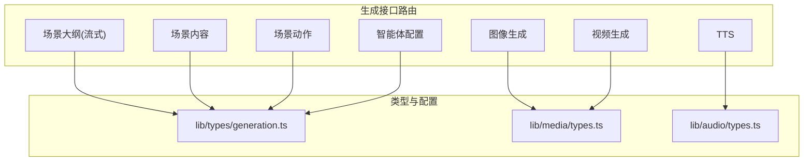

图表来源
- [app/api/generate/scene-outlines-stream/route.ts:1-362](file://app/api/generate/scene-outlines-stream/route.ts#L1-L362)
- [app/api/generate/scene-content/route.ts:1-168](file://app/api/generate/scene-content/route.ts#L1-L168)
- [app/api/generate/scene-actions/route.ts:1-159](file://app/api/generate/scene-actions/route.ts#L1-L159)
- [app/api/generate/agent-profiles/route.ts:1-183](file://app/api/generate/agent-profiles/route.ts#L1-L183)
- [app/api/generate/image/route.ts:1-79](file://app/api/generate/image/route.ts#L1-L79)
- [app/api/generate/tts/route.ts:1-81](file://app/api/generate/tts/route.ts#L1-L81)
- [app/api/generate/video/route.ts:1-84](file://app/api/generate/video/route.ts#L1-L84)
- [lib/types/generation.ts:1-229](file://lib/types/generation.ts#L1-L229)
- [lib/media/types.ts:1-321](file://lib/media/types.ts#L1-L321)
- [lib/audio/types.ts:1-173](file://lib/audio/types.ts#L1-L173)

章节来源
- [app/api/generate/scene-outlines-stream/route.ts:1-362](file://app/api/generate/scene-outlines-stream/route.ts#L1-L362)
- [app/api/generate/scene-content/route.ts:1-168](file://app/api/generate/scene-content/route.ts#L1-L168)
- [app/api/generate/scene-actions/route.ts:1-159](file://app/api/generate/scene-actions/route.ts#L1-L159)
- [app/api/generate/agent-profiles/route.ts:1-183](file://app/api/generate/agent-profiles/route.ts#L1-L183)
- [app/api/generate/image/route.ts:1-79](file://app/api/generate/image/route.ts#L1-L79)
- [app/api/generate/tts/route.ts:1-81](file://app/api/generate/tts/route.ts#L1-L81)
- [app/api/generate/video/route.ts:1-84](file://app/api/generate/video/route.ts#L1-L84)
- [lib/types/generation.ts:1-229](file://lib/types/generation.ts#L1-L229)
- [lib/media/types.ts:1-321](file://lib/media/types.ts#L1-L321)
- [lib/audio/types.ts:1-173](file://lib/audio/types.ts#L1-L173)

## 核心组件
- 场景大纲（流式，SSE）：接收用户需求与可选 PDF/图片上下文，通过多轮重试与增量解析，以 Server-Sent Events 实时推送逐条场景大纲，支持心跳保活与错误事件。
- 场景内容：基于单个大纲生成具体课件内容（幻灯片/测验/互动/PBL），支持视觉模式（当模型具备视觉能力时）。
- 场景动作：在内容基础上生成动作序列，组装完整场景对象，支持跨场景连贯性（如前言语音列表）。
- 智能体配置：根据课程阶段与场景概要生成教师/助教/学生档案，包含角色、个性、头像与颜色等。
- 媒体生成：图像与视频生成采用“提交-轮询”异步模式（视频），TTS 返回 base64 音频。
- 类型体系：统一的生成类型、媒体类型与音频类型，确保前后端契约一致。

章节来源
- [app/api/generate/scene-outlines-stream/route.ts:1-362](file://app/api/generate/scene-outlines-stream/route.ts#L1-L362)
- [app/api/generate/scene-content/route.ts:1-168](file://app/api/generate/scene-content/route.ts#L1-L168)
- [app/api/generate/scene-actions/route.ts:1-159](file://app/api/generate/scene-actions/route.ts#L1-L159)
- [app/api/generate/agent-profiles/route.ts:1-183](file://app/api/generate/agent-profiles/route.ts#L1-L183)
- [app/api/generate/image/route.ts:1-79](file://app/api/generate/image/route.ts#L1-L79)
- [app/api/generate/tts/route.ts:1-81](file://app/api/generate/tts/route.ts#L1-L81)
- [app/api/generate/video/route.ts:1-84](file://app/api/generate/video/route.ts#L1-L84)
- [lib/types/generation.ts:1-229](file://lib/types/generation.ts#L1-L229)
- [lib/media/types.ts:1-321](file://lib/media/types.ts#L1-L321)
- [lib/audio/types.ts:1-173](file://lib/audio/types.ts#L1-L173)

## 架构总览
下图展示两阶段生成流水线：先由“场景大纲（流式）”产出每页大纲，再由“场景内容/动作”生成完整场景；媒体生成（图像/视频/TTS）作为并行子任务在内容生成后进行。

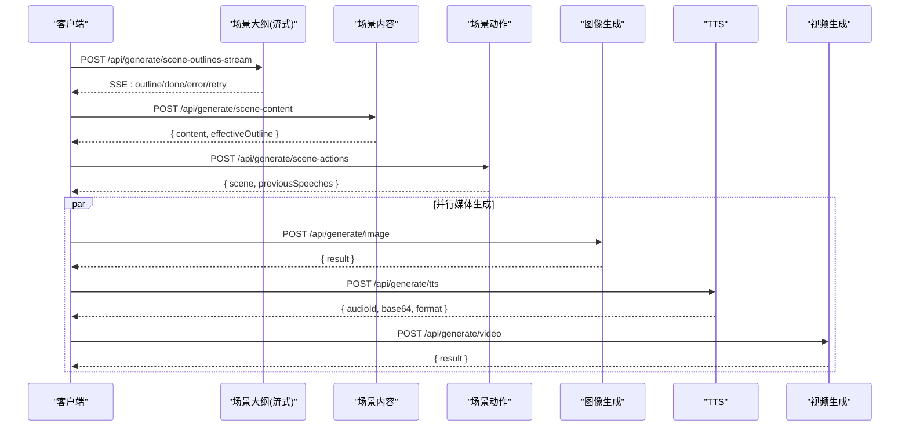

图表来源
- [app/api/generate/scene-outlines-stream/route.ts:197-356](file://app/api/generate/scene-outlines-stream/route.ts#L197-L356)
- [app/api/generate/scene-content/route.ts:139-148](file://app/api/generate/scene-content/route.ts#L139-L148)
- [app/api/generate/scene-actions/route.ts:131-136](file://app/api/generate/scene-actions/route.ts#L131-L136)
- [app/api/generate/image/route.ts:65-67](file://app/api/generate/image/route.ts#L65-L67)
- [app/api/generate/tts/route.ts:66-69](file://app/api/generate/tts/route.ts#L66-L69)
- [app/api/generate/video/route.ts:63-66](file://app/api/generate/video/route.ts#L63-L66)

## 详细组件分析

### 场景大纲生成（流式接口）
- 接口路径：POST /api/generate/scene-outlines-stream
- 请求头
  - x-image-generation-enabled: 是否允许大纲中包含图像生成请求（字符串布尔）
  - x-video-generation-enabled: 是否允许大纲中包含视频生成请求（字符串布尔）
  - 其他模型选择相关头由模型解析器读取
- 请求体
  - requirements: 用户需求（含语言）
  - pdfText: 可选 PDF 文本摘要
  - pdfImages: 可选 PDF 中提取的图片元数据
  - imageMapping: 可选 图片ID→URL 映射（用于视觉模式）
  - researchContext: 可选 研究背景
  - agents: 可选 教师/助教/学生档案（用于提示词）
- 响应
  - 内容类型：text/event-stream
  - 事件类型：
    - outline: { type: 'outline', data: 场景大纲, index: 序号 }
    - done: { type: 'done', outlines: 场景大纲数组 }
    - error: { type: 'error', error: 错误信息 }
    - retry: { type: 'retry', attempt: 已尝试次数, maxAttempts: 最大重试次数 }
  - 心跳：每 15 秒发送一次注释行保持连接
  - 重试：最多进行固定次数重试，空结果或异常会触发 retry 事件
- 流式解析：从累积文本中增量提取 JSON 数组元素，逐条推送，保证前端可逐步渲染
- 视觉模式：若模型具备视觉能力且提供 imageMapping，则将部分图片作为视觉输入，其余转为文字描述
- 媒体策略：根据请求头决定是否允许图像/视频生成请求出现在大纲中

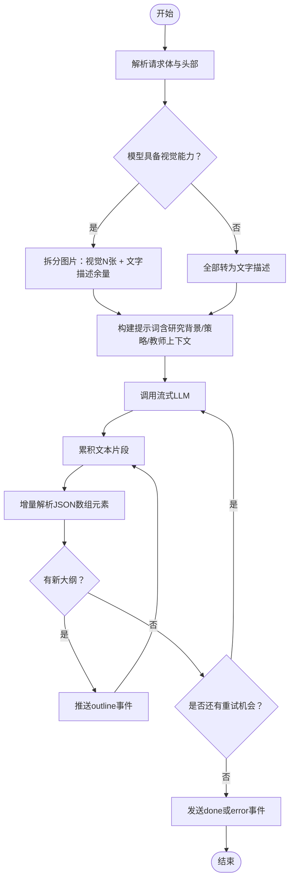

图表来源
- [app/api/generate/scene-outlines-stream/route.ts:45-97](file://app/api/generate/scene-outlines-stream/route.ts#L45-L97)
- [app/api/generate/scene-outlines-stream/route.ts:197-356](file://app/api/generate/scene-outlines-stream/route.ts#L197-L356)

章节来源
- [app/api/generate/scene-outlines-stream/route.ts:1-362](file://app/api/generate/scene-outlines-stream/route.ts#L1-L362)
- [lib/types/generation.ts:65-129](file://lib/types/generation.ts#L65-L129)

### 场景内容生成接口
- 接口路径：POST /api/generate/scene-content
- 输入
  - outline: 当前页面大纲（含类型、标题、要点等）
  - allOutlines: 全部大纲（用于语言回填与上下文）
  - pdfImages: 可选 PDF 图片
  - imageMapping: 可选 图片映射
  - stageInfo: 阶段信息（名称/描述/语言/风格）
  - stageId: 阶段标识
  - agents: 可选 教师/助教/学生档案
- 输出
  - content: 生成的具体内容（幻灯片/测验/互动/PBL）
  - effectiveOutline: 经过回填后的有效大纲（含语言等）
- 视觉模式：若模型具备视觉能力，可将指定图片作为视觉输入；否则仅使用文本
- 媒体占位符：内容生成阶段不直接生成媒体，保留占位符 ID，后续由客户端并行生成

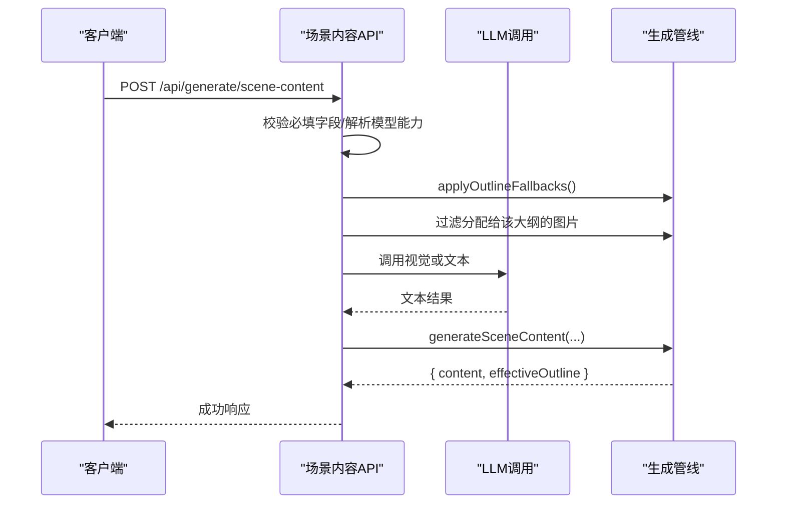

图表来源
- [app/api/generate/scene-content/route.ts:26-162](file://app/api/generate/scene-content/route.ts#L26-L162)

章节来源
- [app/api/generate/scene-content/route.ts:1-168](file://app/api/generate/scene-content/route.ts#L1-L168)
- [lib/types/generation.ts:94-129](file://lib/types/generation.ts#L94-L129)

### 智能体配置接口
- 接口路径：POST /api/generate/agent-profiles
- 输入
  - stageInfo: { name, description? }
  - sceneOutlines: 可选 { title, description? }[]
  - language: 目标语言
  - availableAvatars: 可用头像列表
- 输出
  - agents: 自动生成的教师/助教/学生档案数组（含 id/name/role/persona/avatar/color/priority）
- 提示词约束：要求返回严格 JSON，包含角色数量与优先级规则，头像与颜色去重
- 解析与校验：去除代码围栏，严格校验结构与教师数量

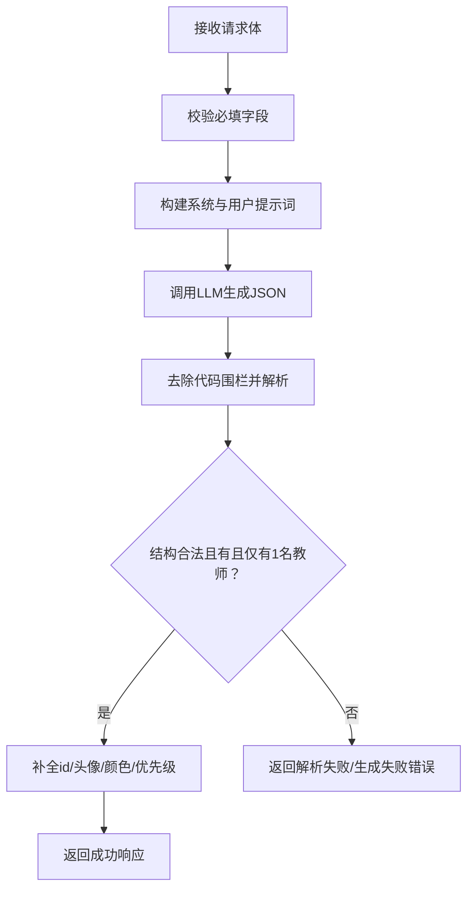

图表来源
- [app/api/generate/agent-profiles/route.ts:50-177](file://app/api/generate/agent-profiles/route.ts#L50-L177)

章节来源
- [app/api/generate/agent-profiles/route.ts:1-183](file://app/api/generate/agent-profiles/route.ts#L1-L183)
- [lib/types/generation.ts:94-129](file://lib/types/generation.ts#L94-L129)

### 图像生成接口
- 接口路径：POST /api/generate/image
- 请求头
  - x-image-provider: 图像提供商ID（默认 seedream）
  - x-api-key: 可选，覆盖服务器端密钥
  - x-base-url: 可选，覆盖服务器端基础地址
  - x-image-model: 可选，覆盖模型ID
- 请求体
  - prompt: 必填，图像生成提示词
  - negativePrompt: 可选，负面提示
  - width/height: 可选，像素
  - aspectRatio: 可选，自动换算尺寸
  - style: 可选，风格（需提供商支持）
- 响应
  - 成功：{ result: { url/base64, width, height } }
  - 失败：{ error: "敏感内容/未配置密钥/内部错误" }
- 安全过滤：检测敏感内容关键词并返回明确错误

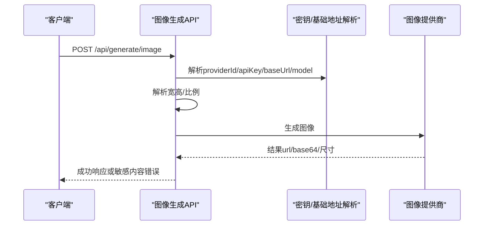

图表来源
- [app/api/generate/image/route.ts:29-77](file://app/api/generate/image/route.ts#L29-L77)
- [lib/media/types.ts:122-169](file://lib/media/types.ts#L122-L169)

章节来源
- [app/api/generate/image/route.ts:1-79](file://app/api/generate/image/route.ts#L1-L79)
- [lib/media/types.ts:1-321](file://lib/media/types.ts#L1-L321)

### 语音合成接口（TTS）
- 接口路径：POST /api/generate/tts
- 请求体
  - text: 必填，待合成文本
  - audioId: 必填，音频标识（用于客户端关联）
  - ttsProviderId: 必填，提供商ID
  - ttsVoice: 必填，声音ID
  - ttsSpeed: 可选，语速
  - ttsApiKey/ttsBaseUrl: 可选，覆盖服务器端密钥与基础地址
- 响应
  - 成功：{ audioId, base64, format }
  - 失败：{ error: "无效请求/生成失败/内部错误" }
- 限制：禁止使用浏览器原生 TTS（必须由服务端提供商处理）

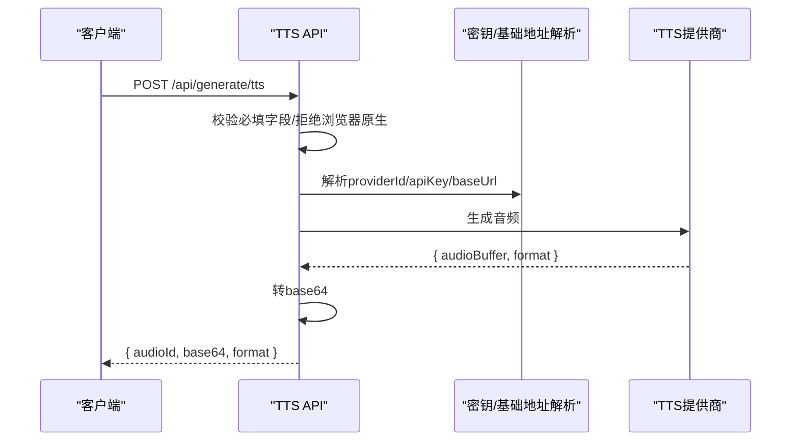

图表来源
- [app/api/generate/tts/route.ts:21-79](file://app/api/generate/tts/route.ts#L21-L79)
- [lib/audio/types.ts:80-132](file://lib/audio/types.ts#L80-L132)

章节来源
- [app/api/generate/tts/route.ts:1-81](file://app/api/generate/tts/route.ts#L1-L81)
- [lib/audio/types.ts:1-173](file://lib/audio/types.ts#L1-L173)

### 视频生成接口
- 接口路径：POST /api/generate/video
- 请求头
  - x-video-provider: 视频提供商ID（默认 seedance）
  - x-video-model: 可选，覆盖模型ID
  - x-api-key: 可选，覆盖服务器端密钥
  - x-base-url: 可选，覆盖服务器端基础地址
- 请求体
  - prompt: 必填，视频生成提示词
  - duration: 可选，秒
  - aspectRatio: 可选，如 16:9 等
  - resolution: 可选，如 720p/1080p
- 响应
  - 成功：{ result: 视频结果（含url/尺寸/时长等） }
  - 失败：{ error: "敏感内容/未配置密钥/内部错误" }
- 规范化：根据提供商能力对参数进行归一化（如不支持的比例/分辨率）

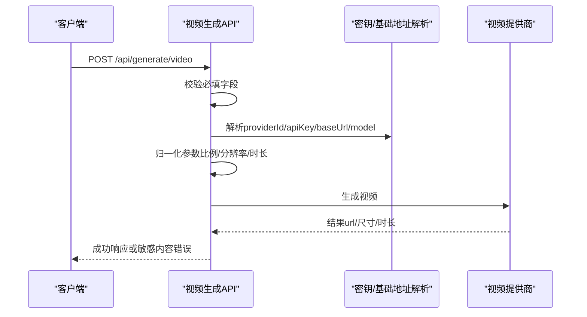

图表来源
- [app/api/generate/video/route.ts:30-83](file://app/api/generate/video/route.ts#L30-L83)
- [lib/media/types.ts:224-250](file://lib/media/types.ts#L224-L250)

章节来源
- [app/api/generate/video/route.ts:1-84](file://app/api/generate/video/route.ts#L1-L84)
- [lib/media/types.ts:1-321](file://lib/media/types.ts#L1-L321)

### 场景动作接口
- 接口路径：POST /api/generate/scene-actions
- 输入
  - outline/allOutlines/content/stageId: 同内容生成
  - agents: 可选 教师/助教/学生档案
  - previousSpeeches: 可选 上一场景的语音文本列表（用于连贯性）
  - userProfile: 可选 用户画像
- 输出
  - scene: 完整场景对象（含大纲/内容/动作）
  - previousSpeeches: 本次场景中提取的语音文本列表，供下一场景复用
- 视觉能力：保留视觉调用分支但通常不使用
- 上下文：计算当前页索引、总页数与标题列表，便于动作生成时的跨页一致性

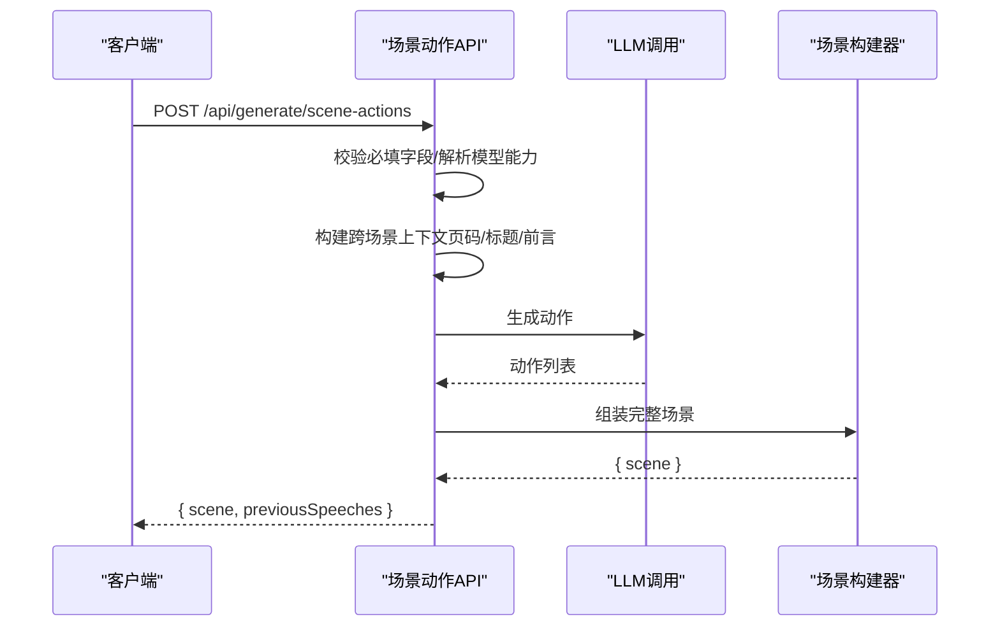

图表来源
- [app/api/generate/scene-actions/route.ts:34-153](file://app/api/generate/scene-actions/route.ts#L34-L153)

章节来源
- [app/api/generate/scene-actions/route.ts:1-159](file://app/api/generate/scene-actions/route.ts#L1-L159)
- [lib/types/generation.ts:94-129](file://lib/types/generation.ts#L94-L129)

## 依赖关系分析
- 路由到类型
  - 场景大纲/内容/动作：依赖 lib/types/generation.ts 中的 SceneOutline、Generated*Content 等类型
  - 图像/TTS/视频：依赖 lib/media/types.ts 与 lib/audio/types.ts
- 路由到运行时
  - 模型解析：通过请求头解析模型与能力（如视觉）
  - 媒体生成：通过 provider-config 解析密钥与基础地址
  - 日志与错误：统一使用 apiError/apiSuccess 与日志器

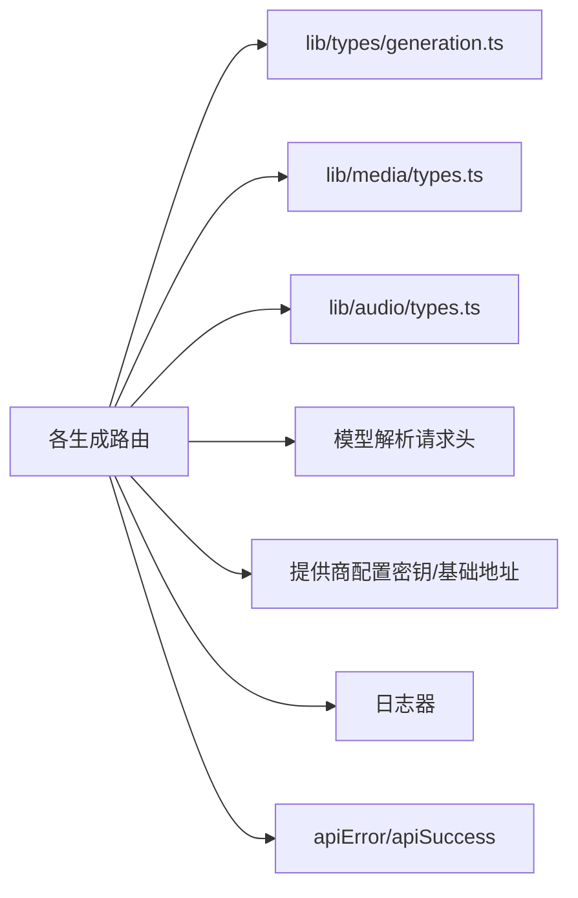

图表来源
- [app/api/generate/scene-outlines-stream/route.ts:104-105](file://app/api/generate/scene-outlines-stream/route.ts#L104-L105)
- [app/api/generate/image/route.ts:42-51](file://app/api/generate/image/route.ts#L42-L51)
- [app/api/generate/tts/route.ts:49-50](file://app/api/generate/tts/route.ts#L49-L50)
- [app/api/generate/video/route.ts:43-50](file://app/api/generate/video/route.ts#L43-L50)
- [lib/types/generation.ts:1-229](file://lib/types/generation.ts#L1-L229)
- [lib/media/types.ts:1-321](file://lib/media/types.ts#L1-L321)
- [lib/audio/types.ts:1-173](file://lib/audio/types.ts#L1-L173)

章节来源
- [app/api/generate/scene-outlines-stream/route.ts:1-362](file://app/api/generate/scene-outlines-stream/route.ts#L1-L362)
- [app/api/generate/scene-content/route.ts:1-168](file://app/api/generate/scene-content/route.ts#L1-L168)
- [app/api/generate/scene-actions/route.ts:1-159](file://app/api/generate/scene-actions/route.ts#L1-L159)
- [app/api/generate/agent-profiles/route.ts:1-183](file://app/api/generate/agent-profiles/route.ts#L1-L183)
- [app/api/generate/image/route.ts:1-79](file://app/api/generate/image/route.ts#L1-L79)
- [app/api/generate/tts/route.ts:1-81](file://app/api/generate/tts/route.ts#L1-L81)
- [app/api/generate/video/route.ts:1-84](file://app/api/generate/video/route.ts#L1-L84)
- [lib/types/generation.ts:1-229](file://lib/types/generation.ts#L1-L229)
- [lib/media/types.ts:1-321](file://lib/media/types.ts#L1-L321)
- [lib/audio/types.ts:1-173](file://lib/audio/types.ts#L1-L173)

## 性能考量
- 流式传输
  - 场景大纲使用 SSE，启用心跳防止超时，避免一次性返回大量数据导致前端卡顿
  - 增量解析 JSON 数组，尽早推送已解析项，提升感知速度
- 重试策略
  - 对空结果或异常进行有限次重试，减少首屏失败率
- 视觉能力
  - 仅在模型具备视觉能力时启用视觉模式，避免不必要的复杂度与成本
- 媒体并行化
  - 图像/TTS/视频在内容生成后并行执行，缩短整体生成时间
- 参数规范化
  - 视频参数按提供商能力进行归一化，减少失败重试

## 故障排查指南
- 通用错误
  - 缺少必填字段：检查请求体与请求头是否齐全
  - 内部错误：查看服务端日志定位具体异常
- 场景大纲（流式）
  - 空结果：确认模型输出是否可被解析为 JSON 数组；关注 retry 事件了解重试情况
  - 连接中断：检查网络与心跳设置，确保客户端正确处理 SSE 注释行
- 场景内容/动作
  - 生成失败：确认模型能力与提示词构造；检查图片映射与占位符一致性
- 智能体配置
  - JSON 解析失败：确认 LLM 返回严格 JSON，去除代码围栏
  - 教师数量不符：检查提示词约束与解析逻辑
- 媒体生成
  - 未配置密钥：检查提供商密钥与基础地址配置
  - 敏感内容：根据错误提示调整提示词或内容策略
- TTS
  - 浏览器原生 TTS：禁止使用，改用服务端提供商

章节来源
- [app/api/generate/scene-outlines-stream/route.ts:286-335](file://app/api/generate/scene-outlines-stream/route.ts#L286-L335)
- [app/api/generate/agent-profiles/route.ts:136-151](file://app/api/generate/agent-profiles/route.ts#L136-L151)
- [app/api/generate/image/route.ts:68-77](file://app/api/generate/image/route.ts#L68-L77)
- [app/api/generate/tts/route.ts:44-46](file://app/api/generate/tts/route.ts#L44-L46)
- [app/api/generate/video/route.ts:74-82](file://app/api/generate/video/route.ts#L74-L82)

## 结论
OpenMAIC 的生成接口以清晰的两阶段流水线为核心：先产出可增量渲染的大纲，再生成具体场景内容与动作，并通过媒体生成接口实现高质量的图像/视频/TTS 输出。借助严格的类型定义、完善的错误处理与性能优化策略，开发者可以稳定地集成并扩展新的提供商与功能。

## 附录
- 数据模型类图（节选）
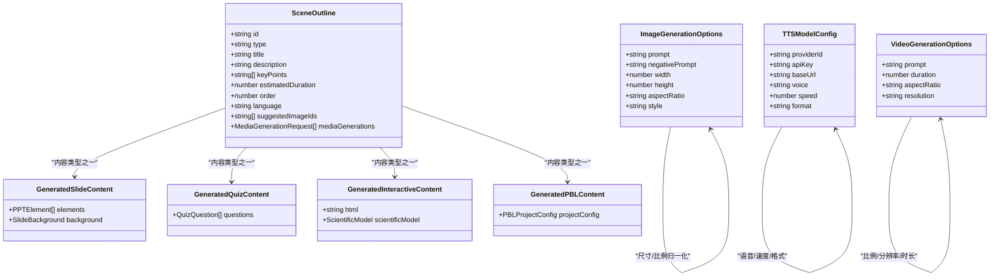

图表来源
- [lib/types/generation.ts:94-181](file://lib/types/generation.ts#L94-L181)
- [lib/media/types.ts:139-169](file://lib/media/types.ts#L139-L169)
- [lib/audio/types.ts:125-132](file://lib/audio/types.ts#L125-L132)
- [lib/media/types.ts:241-250](file://lib/media/types.ts#L241-L250)