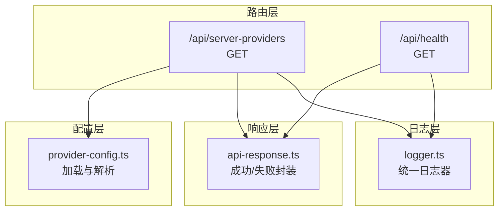
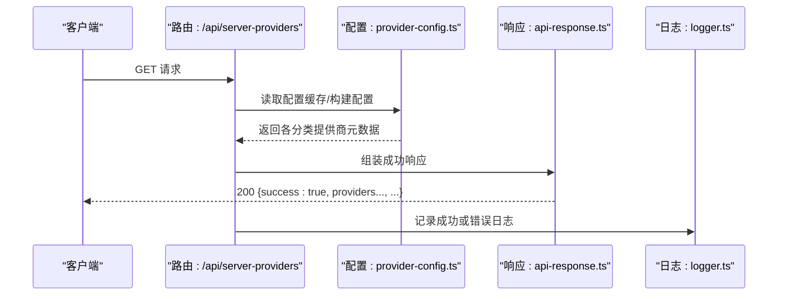
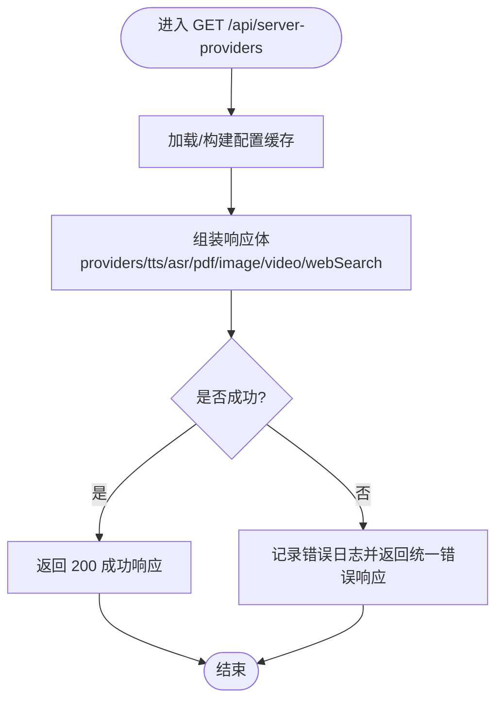
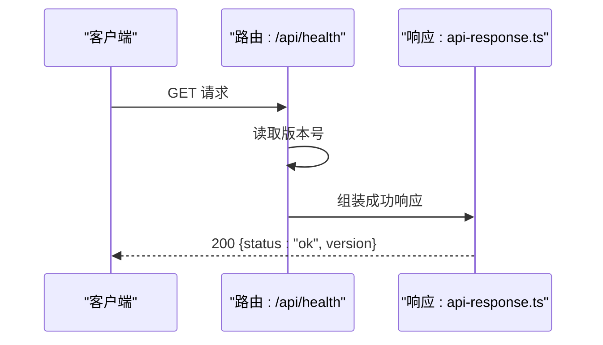
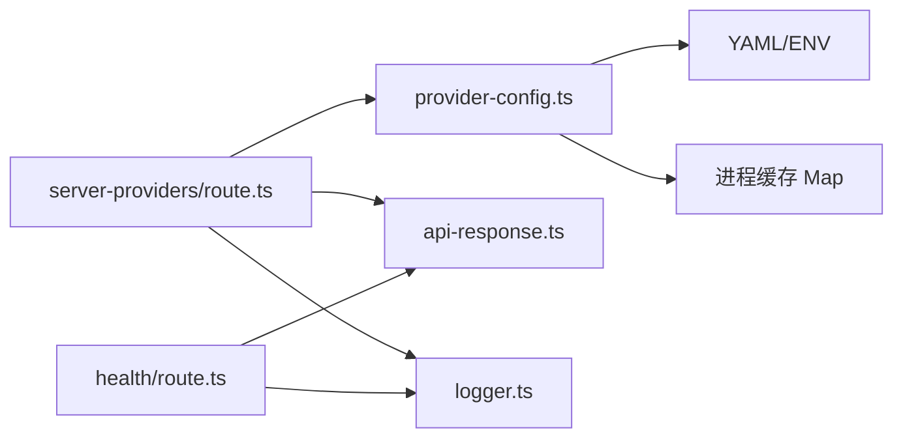

# 系统接口

<cite>
**本文引用的文件**
- [app/api/server-providers/route.ts](file://app/api/server-providers/route.ts)
- [app/api/health/route.ts](file://app/api/health/route.ts)
- [lib/server/api-response.ts](file://lib/server/api-response.ts)
- [lib/server/provider-config.ts](file://lib/server/provider-config.ts)
- [lib/logger.ts](file://lib/logger.ts)
- [components/settings/provider-config-panel.tsx](file://components/settings/provider-config-panel.tsx)
- [lib/ai/providers.ts](file://lib/ai/providers.ts)
</cite>

## 目录
1. [简介](#简介)
2. [项目结构](#项目结构)
3. [核心组件](#核心组件)
4. [架构总览](#架构总览)
5. [详细组件分析](#详细组件分析)
6. [依赖关系分析](#依赖关系分析)
7. [性能考量](#性能考量)
8. [故障排除指南](#故障排除指南)
9. [结论](#结论)
10. [附录](#附录)

## 简介
本文件面向 OpenMAIC 的系统接口，聚焦以下目标：
- 记录服务器提供商接口的实现：配置加载、动态覆盖与对外暴露策略
- 说明健康检查接口的功能：系统状态检测、版本信息返回
- 文档化认证与授权机制：当前实现以“密钥解析与覆盖”为主，未发现显式鉴权中间件
- 提供监控与日志记录：统一日志器与错误响应封装
- 记录错误处理与故障恢复：错误码体系、异常捕获与降级思路
- 给出 API 调用示例、响应格式与集成要点
- 提供系统维护与故障排除操作指南

## 项目结构
OpenMAIC 的系统接口主要由以下模块构成：
- 路由层：Next.js App Router 的 API 路由（如 /api/server-providers、/api/health）
- 配置层：服务端配置加载与解析（YAML + 环境变量），并提供对外只读视图
- 响应层：统一的 API 成功/失败响应封装
- 日志层：统一的日志器，支持级别与格式控制
- 前端设置面板：用于测试模型连通性、显示服务端配置提示等

图表来源
- [app/api/server-providers/route.ts:15-35](file://app/api/server-providers/route.ts#L15-L35)
- [app/api/health/route.ts:5-7](file://app/api/health/route.ts#L5-L7)
- [lib/server/provider-config.ts:101-217](file://lib/server/provider-config.ts#L101-L217)
- [lib/server/api-response.ts:26-45](file://lib/server/api-response.ts#L26-L45)
- [lib/logger.ts:28-52](file://lib/logger.ts#L28-L52)

章节来源
- [app/api/server-providers/route.ts:15-35](file://app/api/server-providers/route.ts#L15-L35)
- [app/api/health/route.ts:5-7](file://app/api/health/route.ts#L5-L7)
- [lib/server/provider-config.ts:101-217](file://lib/server/provider-config.ts#L101-L217)
- [lib/server/api-response.ts:26-45](file://lib/server/api-response.ts#L26-L45)
- [lib/logger.ts:28-52](file://lib/logger.ts#L28-L52)

## 核心组件
- 服务器提供商接口（GET /api/server-providers）
  - 功能：返回 LLM、TTS、ASR、PDF、图像、视频、网络搜索等各类服务的“可对外展示元数据”，不暴露密钥
  - 数据来源：从 YAML 与环境变量合并构建的配置缓存
  - 错误处理：捕获异常并返回统一错误响应
- 健康检查接口（GET /api/health）
  - 功能：返回系统状态与版本号
- API 响应封装（api-response.ts）
  - 定义统一错误码集合与成功/失败响应函数
- 服务端配置加载（provider-config.ts）
  - 支持 YAML 主配置 + 环境变量覆盖；按类别聚合；缓存单例；仅对外暴露 ID 与基础元数据
- 日志器（logger.ts）
  - 支持最小日志级别与 JSON 输出格式；按标签输出

章节来源
- [app/api/server-providers/route.ts:15-35](file://app/api/server-providers/route.ts#L15-L35)
- [app/api/health/route.ts:5-7](file://app/api/health/route.ts#L5-L7)
- [lib/server/api-response.ts:3-17](file://lib/server/api-response.ts#L3-L17)
- [lib/server/api-response.ts:26-45](file://lib/server/api-response.ts#L26-L45)
- [lib/server/provider-config.ts:101-217](file://lib/server/provider-config.ts#L101-L217)
- [lib/logger.ts:28-52](file://lib/logger.ts#L28-L52)

## 架构总览
下图展示了“请求—配置—响应—日志”的整体流程。

图表来源
- [app/api/server-providers/route.ts:15-35](file://app/api/server-providers/route.ts#L15-L35)
- [lib/server/provider-config.ts:101-217](file://lib/server/provider-config.ts#L101-L217)
- [lib/server/api-response.ts:43-45](file://lib/server/api-response.ts#L43-L45)
- [lib/logger.ts:28-52](file://lib/logger.ts#L28-L52)

## 详细组件分析

### 服务器提供商接口（GET /api/server-providers）
- 接口职责
  - 汇总 LLM、TTS、ASR、PDF、图像、视频、网络搜索等提供商的“可公开元数据”
  - 不直接暴露密钥；密钥解析与覆盖在调用侧进行
- 关键行为
  - 从 YAML 与环境变量合并配置，构建缓存
  - 对外仅返回每个提供商的 ID、基础 URL、模型列表（若存在）等
  - 异常时返回统一错误响应
- 典型响应字段
  - providers、tts、asr、pdf、image、video、webSearch：均为对象映射，值包含基础 URL 与模型数组（若配置）

图表来源
- [app/api/server-providers/route.ts:15-35](file://app/api/server-providers/route.ts#L15-L35)
- [lib/server/provider-config.ts:101-217](file://lib/server/provider-config.ts#L101-L217)
- [lib/server/api-response.ts:26-45](file://lib/server/api-response.ts#L26-L45)
- [lib/logger.ts:28-52](file://lib/logger.ts#L28-L52)

章节来源
- [app/api/server-providers/route.ts:15-35](file://app/api/server-providers/route.ts#L15-L35)
- [lib/server/provider-config.ts:223-250](file://lib/server/provider-config.ts#L223-L250)
- [lib/server/provider-config.ts:256-274](file://lib/server/provider-config.ts#L256-L274)
- [lib/server/provider-config.ts:280-298](file://lib/server/provider-config.ts#L280-L298)
- [lib/server/provider-config.ts:304-322](file://lib/server/provider-config.ts#L304-L322)
- [lib/server/provider-config.ts:328-348](file://lib/server/provider-config.ts#L328-L348)
- [lib/server/provider-config.ts:354-374](file://lib/server/provider-config.ts#L354-L374)
- [lib/server/provider-config.ts:380-397](file://lib/server/provider-config.ts#L380-L397)

### 健康检查接口（GET /api/health）
- 接口职责
  - 返回系统健康状态与版本号
- 响应字段
  - status：固定为 “ok”
  - version：来自包版本环境变量

图表来源
- [app/api/health/route.ts:5-7](file://app/api/health/route.ts#L5-L7)
- [lib/server/api-response.ts:43-45](file://lib/server/api-response.ts#L43-L45)

章节来源
- [app/api/health/route.ts:5-7](file://app/api/health/route.ts#L5-L7)

### 认证与授权机制
- 密钥解析与覆盖
  - 客户端可传入自定义密钥与基础 URL；若未提供，则回退到服务端配置
  - 对于 Web Search（Tavily）提供额外的密钥解析逻辑（优先客户端，其次服务端，再次环境变量）
- 当前实现特征
  - 未发现显式的全局鉴权中间件或访问令牌校验
  - 通过“客户端覆盖 + 服务端默认”的方式实现“动态切换”
- 建议
  - 如需强制鉴权，可在路由层增加鉴权中间件，并结合环境变量或数据库校验访问权限

章节来源
- [lib/server/provider-config.ts:235-249](file://lib/server/provider-config.ts#L235-L249)
- [lib/server/provider-config.ts:266-274](file://lib/server/provider-config.ts#L266-L274)
- [lib/server/provider-config.ts:290-298](file://lib/server/provider-config.ts#L290-L298)
- [lib/server/provider-config.ts:314-322](file://lib/server/provider-config.ts#L314-L322)
- [lib/server/provider-config.ts:337-348](file://lib/server/provider-config.ts#L337-L348)
- [lib/server/provider-config.ts:363-374](file://lib/server/provider-config.ts#L363-L374)
- [lib/server/provider-config.ts:392-397](file://lib/server/provider-config.ts#L392-L397)

### 监控与日志记录
- 日志器能力
  - 支持 debug/info/warn/error 四级
  - 可通过环境变量设置最小日志级别与 JSON 输出格式
- 使用场景
  - 在路由层与配置加载处记录关键事件与错误
- 建议
  - 在生产环境启用 JSON 日志与更高等级过滤，便于集中采集与检索

章节来源
- [lib/logger.ts:28-52](file://lib/logger.ts#L28-L52)
- [app/api/server-providers/route.ts:27-32](file://app/api/server-providers/route.ts#L27-L32)

### 错误处理与故障恢复
- 错误码体系
  - 统一错误码集合涵盖缺失字段、无效请求、上游错误、生成/转录/解析失败、内部错误等
- 失败响应
  - 包含 success=false、errorCode、error、details（可选）
- 故障恢复建议
  - 对上游服务失败采用指数退避重试
  - 对配置加载失败使用默认兜底与告警通知
  - 对客户端参数错误返回明确的错误码与提示

章节来源
- [lib/server/api-response.ts:3-17](file://lib/server/api-response.ts#L3-L17)
- [lib/server/api-response.ts:26-41](file://lib/server/api-response.ts#L26-L41)
- [app/api/server-providers/route.ts:26-33](file://app/api/server-providers/route.ts#L26-L33)

### 前端集成与测试
- 设置面板中的“连接测试”流程
  - 选择某提供商后，前端调用“验证模型”接口进行连通性测试
  - 测试成功/失败会反馈 UI 状态与消息
- 该流程体现了“客户端覆盖 + 服务端默认”的密钥解析策略在前端的落地

章节来源
- [components/settings/provider-config-panel.tsx:110-150](file://components/settings/provider-config-panel.tsx#L110-L150)

## 依赖关系分析
- 路由依赖
  - /api/server-providers 依赖 provider-config.ts 进行配置加载与解析
  - 两者共同依赖 api-response.ts 与 logger.ts
- 配置依赖
  - provider-config.ts 依赖 YAML 解析库与进程环境变量
  - 通过缓存 Map 实现进程内单例，避免重复 IO
- 类型与模型
  - lib/ai/providers.ts 定义了统一的提供商注册表与模型能力描述，为前端与服务端提供一致的模型清单参考

图表来源
- [app/api/server-providers/route.ts:1-13](file://app/api/server-providers/route.ts#L1-L13)
- [lib/server/provider-config.ts:101-217](file://lib/server/provider-config.ts#L101-L217)
- [lib/server/api-response.ts:1-46](file://lib/server/api-response.ts#L1-L46)
- [lib/logger.ts:1-53](file://lib/logger.ts#L1-L53)
- [app/api/health/route.ts:1-7](file://app/api/health/route.ts#L1-L7)

章节来源
- [lib/server/provider-config.ts:101-217](file://lib/server/provider-config.ts#L101-L217)
- [lib/ai/providers.ts:51-800](file://lib/ai/providers.ts#L51-L800)

## 性能考量
- 配置缓存
  - 通过 Map 缓存配置，避免重复读取 YAML 与解析
- 响应封装
  - 统一的成功/失败响应减少分支判断开销
- 日志级别
  - 生产环境建议提升最小日志级别，降低 I/O 压力

[本节为通用指导，无需列出具体文件来源]

## 故障排除指南
- 健康检查失败
  - 确认路由可达与版本号读取正常
- 提供商配置为空
  - 检查 YAML 文件是否存在且可读
  - 检查对应环境变量是否正确设置
  - 查看日志中关于配置加载的警告或错误
- 连接测试失败
  - 确认客户端已正确传入密钥或允许使用服务端默认
  - 检查基础 URL 是否正确
  - 查看前端测试结果中的错误消息

章节来源
- [app/api/health/route.ts:5-7](file://app/api/health/route.ts#L5-L7)
- [lib/server/provider-config.ts:101-113](file://lib/server/provider-config.ts#L101-L113)
- [lib/server/provider-config.ts:119-168](file://lib/server/provider-config.ts#L119-L168)
- [components/settings/provider-config-panel.tsx:110-150](file://components/settings/provider-config-panel.tsx#L110-L150)
- [lib/logger.ts:28-52](file://lib/logger.ts#L28-L52)

## 结论
- OpenMAIC 的系统接口以“配置驱动 + 客户端覆盖”为核心设计，既保证了灵活性，又确保密钥安全
- 健康检查简洁可靠，统一响应与日志为运维提供了便利
- 若需更强的安全性，建议在路由层引入鉴权中间件与访问控制策略

[本节为总结性内容，无需列出具体文件来源]

## 附录

### API 调用示例与响应格式

- 获取提供商配置
  - 方法与路径：GET /api/server-providers
  - 成功响应字段：success（true）、providers、tts、asr、pdf、image、video、webSearch
  - 失败响应字段：success（false）、errorCode、error、details（可选）
  - 参考路径：[app/api/server-providers/route.ts:15-35](file://app/api/server-providers/route.ts#L15-L35)，[lib/server/api-response.ts:43-45](file://lib/server/api-response.ts#L43-L45)

- 健康检查
  - 方法与路径：GET /api/health
  - 成功响应字段：status（固定为 "ok"）、version
  - 参考路径：[app/api/health/route.ts:5-7](file://app/api/health/route.ts#L5-L7)

- 错误码参考
  - 参考路径：[lib/server/api-response.ts:3-17](file://lib/server/api-response.ts#L3-L17)

### 集成指南
- 配置加载顺序（客户端覆盖优先）
  - 客户端传入：apiKey、baseUrl
  - 服务端默认：来自 YAML 与环境变量
  - Web Search（Tavily）：客户端 > 服务端 > 环境变量 TAVILY_API_KEY
  - 参考路径：[lib/server/provider-config.ts:119-168](file://lib/server/provider-config.ts#L119-L168)，[lib/server/provider-config.ts:392-397](file://lib/server/provider-config.ts#L392-L397)

- 前端测试流程
  - 选择提供商 → 触发“连接测试” → 调用“验证模型”接口 → 展示测试结果
  - 参考路径：[components/settings/provider-config-panel.tsx:110-150](file://components/settings/provider-config-panel.tsx#L110-L150)