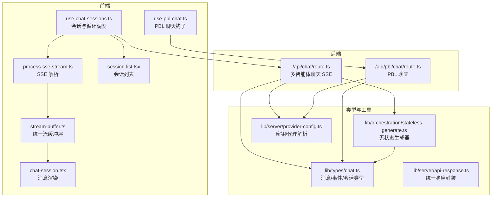
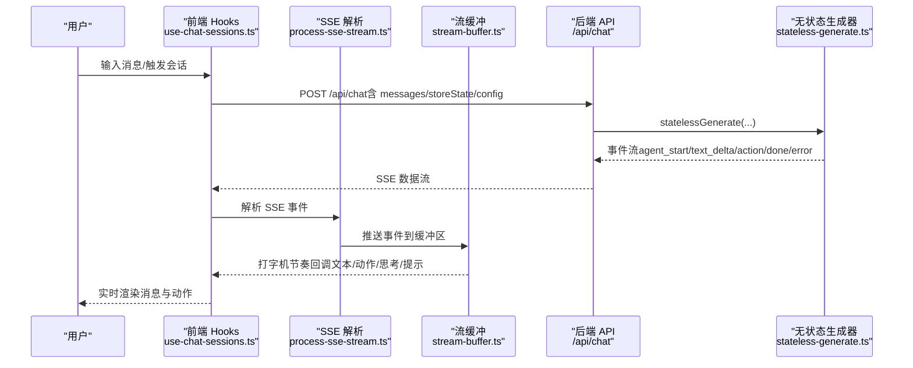
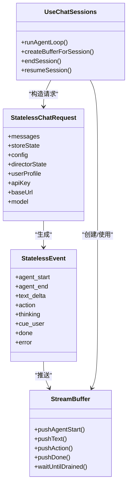

# 聊天接口

<cite>
**本文引用的文件**
- [app/api/chat/route.ts](file://app/api/chat/route.ts)
- [app/api/pbl/chat/route.ts](file://app/api/pbl/chat/route.ts)
- [lib/types/chat.ts](file://lib/types/chat.ts)
- [lib/orchestration/stateless-generate.ts](file://lib/orchestration/stateless-generate.ts)
- [components/chat/process-sse-stream.ts](file://components/chat/process-sse-stream.ts)
- [components/chat/use-chat-sessions.ts](file://components/chat/use-chat-sessions.ts)
- [lib/buffer/stream-buffer.ts](file://lib/buffer/stream-buffer.ts)
- [components/scene-renderers/pbl/use-pbl-chat.ts](file://components/scene-renderers/pbl/use-pbl-chat.ts)
- [lib/pbl/types.ts](file://lib/pbl/types.ts)
- [lib/server/provider-config.ts](file://lib/server/provider-config.ts)
- [lib/server/api-response.ts](file://lib/server/api-response.ts)
- [components/chat/chat-session.tsx](file://components/chat/chat-session.tsx)
- [components/chat/session-list.tsx](file://components/chat/session-list.tsx)
</cite>

## 目录
1. [简介](#简介)
2. [项目结构](#项目结构)
3. [核心组件](#核心组件)
4. [架构总览](#架构总览)
5. [详细组件分析](#详细组件分析)
6. [依赖关系分析](#依赖关系分析)
7. [性能考量](#性能考量)
8. [故障排查指南](#故障排查指南)
9. [结论](#结论)
10. [附录](#附录)

## 简介
本文件系统性梳理 OpenMAIC 的聊天接口，覆盖多智能体聊天与项目式学习（PBL）聊天两大场景，重点说明：
- SSE 流式传输与事件模型
- 消息格式与事件类型
- 会话管理与状态流转
- 角色分配、讨论控制与进度跟踪
- 安全与认证策略
- 错误处理与重连策略
- 请求/响应示例与实时通信模式
- 性能优化建议

## 项目结构
聊天相关代码主要分布在以下区域：
- 后端 API：多智能体聊天与 PBL 聊天接口
- 前端 Hooks 与组件：SSE 解析、流缓冲、会话管理与 UI 渲染
- 类型定义：统一的消息、事件与会话数据结构
- 服务器配置：提供商密钥解析与代理配置

图表来源
- [app/api/chat/route.ts:1-191](file://app/api/chat/route.ts#L1-L191)
- [app/api/pbl/chat/route.ts:1-75](file://app/api/pbl/chat/route.ts#L1-L75)
- [lib/types/chat.ts:1-337](file://lib/types/chat.ts#L1-L337)
- [lib/orchestration/stateless-generate.ts:1-435](file://lib/orchestration/stateless-generate.ts#L1-L435)
- [components/chat/process-sse-stream.ts:1-123](file://components/chat/process-sse-stream.ts#L1-L123)
- [lib/buffer/stream-buffer.ts:1-605](file://lib/buffer/stream-buffer.ts#L1-L605)
- [components/chat/chat-session.tsx:1-387](file://components/chat/chat-session.tsx#L1-L387)
- [components/chat/session-list.tsx:1-141](file://components/chat/session-list.tsx#L1-L141)
- [components/scene-renderers/pbl/use-pbl-chat.ts:1-273](file://components/scene-renderers/pbl/use-pbl-chat.ts#L1-L273)
- [lib/server/provider-config.ts:1-398](file://lib/server/provider-config.ts#L1-L398)
- [lib/server/api-response.ts:1-46](file://lib/server/api-response.ts#L1-L46)

章节来源
- [app/api/chat/route.ts:1-191](file://app/api/chat/route.ts#L1-L191)
- [app/api/pbl/chat/route.ts:1-75](file://app/api/pbl/chat/route.ts#L1-L75)
- [lib/types/chat.ts:1-337](file://lib/types/chat.ts#L1-L337)

## 核心组件
- 多智能体聊天 API（SSE）
  - 接口：POST /api/chat
  - 特点：无状态、单次生成、SSE 流式返回事件
  - 关键实现：请求体校验、模型解析、SSE 写入、心跳维持、中断处理
- PBL 聊天 API
  - 接口：POST /api/pbl/chat
  - 特点：按需即时生成，支持 @mention 路由到问题/法官代理
- SSE 解析与流缓冲
  - 前端解析 /api/chat 的 SSE，分发到统一的 StreamBuffer
  - StreamBuffer 控制打字机节奏、动作延迟与 UI 回调
- 会话管理与 UI
  - use-chat-sessions.ts 驱动多轮 agent 循环，管理会话生命周期
  - chat-session.tsx 与 session-list.tsx 负责渲染与交互
- 类型与事件
  - StatelessEvent、SessionEvent、ChatSession 等统一定义
- 安全与配置
  - 服务端密钥/代理解析，避免敏感信息泄露

章节来源
- [app/api/chat/route.ts:25-191](file://app/api/chat/route.ts#L25-L191)
- [app/api/pbl/chat/route.ts:25-75](file://app/api/pbl/chat/route.ts#L25-L75)
- [components/chat/process-sse-stream.ts:12-123](file://components/chat/process-sse-stream.ts#L12-L123)
- [lib/buffer/stream-buffer.ts:151-605](file://lib/buffer/stream-buffer.ts#L151-L605)
- [components/chat/use-chat-sessions.ts:340-502](file://components/chat/use-chat-sessions.ts#L340-L502)
- [lib/types/chat.ts:97-127](file://lib/types/chat.ts#L97-L127)

## 架构总览
下图展示从用户输入到 UI 呈现的完整链路，包括多智能体循环与 PBL 聊天两种路径。

图表来源
- [components/chat/use-chat-sessions.ts:340-502](file://components/chat/use-chat-sessions.ts#L340-L502)
- [components/chat/process-sse-stream.ts:12-123](file://components/chat/process-sse-stream.ts#L12-L123)
- [lib/buffer/stream-buffer.ts:151-605](file://lib/buffer/stream-buffer.ts#L151-L605)
- [app/api/chat/route.ts:95-181](file://app/api/chat/route.ts#L95-L181)
- [lib/orchestration/stateless-generate.ts:317-435](file://lib/orchestration/stateless-generate.ts#L317-L435)

## 详细组件分析

### 多智能体聊天 API（SSE）
- 请求体字段
  - messages：客户端维护的历史消息
  - storeState：当前应用状态（舞台、场景、当前场景、模式、白板）
  - config：agentIds、sessionType、讨论主题/提示、首次发言代理等
  - directorState：累计导演状态（用于多轮）
  - userProfile：个性化信息
  - apiKey/baseUrl/model：OpenAI 兼容凭据
- 响应：SSE 事件流，事件类型见“事件类型”小节
- 心跳与超时
  - 后端每 15 秒发送一次注释行以保持连接活跃
  - Next.js 最大执行时长限制为 60 秒
- 中断处理
  - 使用原生 AbortSignal，客户端取消请求即中断生成
  - 服务端捕获中断并返回 error 事件或静默关闭

章节来源
- [app/api/chat/route.ts:28-191](file://app/api/chat/route.ts#L28-L191)
- [lib/types/chat.ts:236-282](file://lib/types/chat.ts#L236-L282)

### SSE 事件与消息格式
- 事件类型（StatelessEvent）
  - agent_start：开始一个代理发言，携带 messageId、agentId、名称与头像/颜色
  - agent_end：结束代理发言
  - text_delta：文本增量
  - action：动作调用（名称与参数），可被 UI 作为操作徽章呈现
  - thinking：思考阶段（director/agent_loading）
  - cue_user：提示用户介入（进入用户回合）
  - done：本轮结束，包含统计与 directorState
  - error：错误事件
- 事件解析
  - 前端按行解析，过滤以 “data: ” 开头的行，再 JSON 解析
  - 将事件推送到 StreamBuffer，驱动 UI 更新

章节来源
- [lib/types/chat.ts:299-337](file://lib/types/chat.ts#L299-L337)
- [components/chat/process-sse-stream.ts:12-123](file://components/chat/process-sse-stream.ts#L12-L123)

### 无状态生成器与事件流
- 单轮生成
  - 使用 LangGraph StateGraph 进行编排，通过自定义流模式输出事件
  - 支持结构化输出解析（部分 JSON 修复与增量解析）
- 事件聚合
  - 统计本轮动作数、代理数、是否产生内容，并构建新的 directorState
  - 在 done 事件中返回累积状态，供前端下一轮使用

章节来源
- [lib/orchestration/stateless-generate.ts:317-435](file://lib/orchestration/stateless-generate.ts#L317-L435)
- [lib/orchestration/stateless-generate.ts:136-255](file://lib/orchestration/stateless-generate.ts#L136-L255)

### 流缓冲与 UI 呈现
- StreamBuffer
  - 统一的打字机节奏（默认 30ms/字符）、动作延迟、换气停顿
  - 将事件转换为 UI 可消费的回调：onTextReveal、onActionReady、onThinking、onCueUser、onDone、onError
- 前端 Hooks
  - use-chat-sessions.ts
    - 创建/销毁缓冲区，启动/暂停/恢复
    - 驱动多轮 agent 循环：每次迭代刷新 storeState，POST /api/chat，解析 SSE，等待缓冲区排空
    - 结束条件：收到 cue_user（用户回合）、无代理说话（END）、达到最大轮次
  - chat-session.tsx 与 session-list.tsx
    - 渲染消息气泡、动作徽章、滚动行为与会话状态徽标

章节来源
- [lib/buffer/stream-buffer.ts:151-605](file://lib/buffer/stream-buffer.ts#L151-L605)
- [components/chat/use-chat-sessions.ts:340-502](file://components/chat/use-chat-sessions.ts#L340-L502)
- [components/chat/chat-session.tsx:176-387](file://components/chat/chat-session.tsx#L176-L387)
- [components/chat/session-list.tsx:41-141](file://components/chat/session-list.tsx#L41-L141)

### 项目式学习（PBL）聊天接口
- 功能要点
  - 支持 @question/@judge 路由到对应代理
  - 自动识别当前议题，拼接议题上下文与最近对话
  - 判官代理完成时自动推进议题进度（标记完成、激活下一议题、生成问题）
- 请求体
  - message、agent、currentIssue、recentMessages、userRole、agentType
- 响应
  - 返回生成的回复与代理名称

章节来源
- [app/api/pbl/chat/route.ts:16-75](file://app/api/pbl/chat/route.ts#L16-L75)
- [components/scene-renderers/pbl/use-pbl-chat.ts:29-129](file://components/scene-renderers/pbl/use-pbl-chat.ts#L29-L129)
- [components/scene-renderers/pbl/use-pbl-chat.ts:164-273](file://components/scene-renderers/pbl/use-pbl-chat.ts#L164-L273)
- [lib/pbl/types.ts:29-80](file://lib/pbl/types.ts#L29-L80)

### 会话管理与状态更新
- 会话类型与状态
  - 类型：qa、discussion、lecture
  - 状态：idle、active、interrupted、completed
- 生命周期
  - 创建：生成唯一 sessionId，初始状态 active
  - 运行：多轮 agent 循环，SSE 流式推进
  - 结束：自然结束（END）、用户主动结束、软暂停（保留 active 状态）
- 中断与恢复
  - 中断：在 active 且正在流式时，追加省略号与中断标记
  - 恢复：重新发起 /api/chat，继续未完的对话

章节来源
- [lib/types/chat.ts:10-54](file://lib/types/chat.ts#L10-L54)
- [components/chat/use-chat-sessions.ts:507-622](file://components/chat/use-chat-sessions.ts#L507-L622)
- [components/chat/use-chat-sessions.ts:627-724](file://components/chat/use-chat-sessions.ts#L627-L724)
- [components/chat/use-chat-sessions.ts:729-821](file://components/chat/use-chat-sessions.ts#L729-L821)

### 连接维护与心跳
- 服务端心跳
  - 每 15 秒发送注释行，防止代理/浏览器因空闲而关闭连接
- 客户端心跳
  - 通过 SSE 注释行维持连接；若长时间无事件，前端可结合 UI 轮询或重试策略
- 超时与中断
  - Next.js 最大执行时长 60 秒
  - 客户端可随时中断（AbortController）

章节来源
- [app/api/chat/route.ts:96-120](file://app/api/chat/route.ts#L96-L120)
- [app/api/chat/route.ts:131-173](file://app/api/chat/route.ts#L131-L173)

### 错误处理与重连策略
- 服务端错误
  - 缺少必填字段：400
  - 缺少 API Key：401
  - 其他内部错误：500，统一返回结构
- SSE 错误
  - 前端解析到 error 事件时，触发 onError 回调
- 重连与退避
  - 建议：前端在 done 事件后或错误发生时，根据业务语义决定是否重试
  - 对于 PBL 聊天，可在判官完成时自动推进议题，减少用户干预

章节来源
- [lib/server/api-response.ts:26-46](file://lib/server/api-response.ts#L26-L46)
- [app/api/chat/route.ts:143-172](file://app/api/chat/route.ts#L143-L172)
- [components/chat/process-sse-stream.ts:106-117](file://components/chat/process-sse-stream.ts#L106-L117)

### 安全与认证
- 密钥解析策略
  - 优先级：客户端传入 > 服务端配置（YAML/环境变量）> 空
  - 仅在服务端解析与转发，不回传原始密钥
- 代理与基础地址
  - 支持服务端配置代理与基础 URL，便于合规与网络策略
- 访问控制
  - 当前路由未显式实现鉴权逻辑，建议在网关或中间件层添加鉴权

章节来源
- [lib/server/provider-config.ts:235-250](file://lib/server/provider-config.ts#L235-L250)
- [app/api/chat/route.ts:63-73](file://app/api/chat/route.ts#L63-L73)
- [app/api/pbl/chat/route.ts:34-36](file://app/api/pbl/chat/route.ts#L34-L36)

## 依赖关系分析

图表来源
- [lib/types/chat.ts:236-337](file://lib/types/chat.ts#L236-L337)
- [lib/buffer/stream-buffer.ts:151-327](file://lib/buffer/stream-buffer.ts#L151-L327)
- [components/chat/use-chat-sessions.ts:340-329](file://components/chat/use-chat-sessions.ts#L340-L329)

章节来源
- [lib/types/chat.ts:236-337](file://lib/types/chat.ts#L236-L337)
- [lib/buffer/stream-buffer.ts:151-327](file://lib/buffer/stream-buffer.ts#L151-L327)
- [components/chat/use-chat-sessions.ts:340-329](file://components/chat/use-chat-sessions.ts#L340-L329)

## 性能考量
- 打字机节奏
  - 默认 30ms/字符，可通过 StreamBuffer 选项调整
  - 文本结束后固定停顿与动作延迟，提升阅读体验
- 流式解析
  - SSE 分块解析，增量推送，降低首帧延迟
- 无状态设计
  - 服务端无需持久化会话，降低内存压力
- 并发与中断
  - 单次生成 + 单个 SSE 连接，避免并发开销
  - 客户端可快速中断，释放资源

章节来源
- [lib/buffer/stream-buffer.ts:131-147](file://lib/buffer/stream-buffer.ts#L131-L147)
- [app/api/chat/route.ts:96-120](file://app/api/chat/route.ts#L96-L120)

## 故障排查指南
- 常见错误码
  - 缺少必填字段：检查 messages、storeState、config.agentIds
  - 缺少 API Key：确认客户端或服务端配置
  - 内部错误：查看日志与错误事件
- 断线与超时
  - 若连接被代理/浏览器关闭，检查心跳注释行是否持续
  - 超过最大执行时长，考虑拆分请求或优化模型
- PBL 聊天异常
  - @mention 未识别：确认议题与代理名称
  - 判官完成后未推进：检查议题完成判断逻辑与后续问题生成

章节来源
- [lib/server/api-response.ts:26-46](file://lib/server/api-response.ts#L26-L46)
- [app/api/chat/route.ts:50-62](file://app/api/chat/route.ts#L50-L62)
- [components/scene-renderers/pbl/use-pbl-chat.ts:164-273](file://components/scene-renderers/pbl/use-pbl-chat.ts#L164-L273)

## 结论
OpenMAIC 的聊天接口采用“无状态 + SSE”的设计，既保证了实时性与可扩展性，又简化了服务端复杂度。多智能体循环与 PBL 聊天分别满足课堂互动与项目推进需求。通过统一的事件模型与流缓冲层，前端实现了稳定的打字机效果与动作联动。建议在生产环境中配合鉴权与限流策略，并针对不同网络环境优化心跳与重连策略。

## 附录

### 请求/响应示例（文字描述）
- 多智能体聊天（POST /api/chat）
  - 请求体：包含 messages、storeState、config（agentIds/sessionType）、可选 directorState、userProfile、apiKey/baseUrl/model
  - 响应：SSE 事件流，包含 agent_start、text_delta、action、done、error 等
- PBL 聊天（POST /api/pbl/chat）
  - 请求体：message、agent、currentIssue、recentMessages、userRole、agentType
  - 响应：包含生成消息与代理名称

章节来源
- [app/api/chat/route.ts:28-43](file://app/api/chat/route.ts#L28-L43)
- [app/api/pbl/chat/route.ts:16-23](file://app/api/pbl/chat/route.ts#L16-L23)