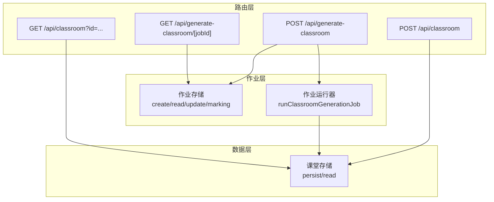
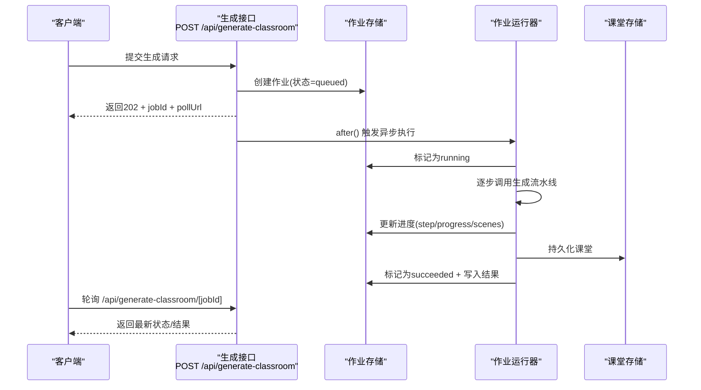
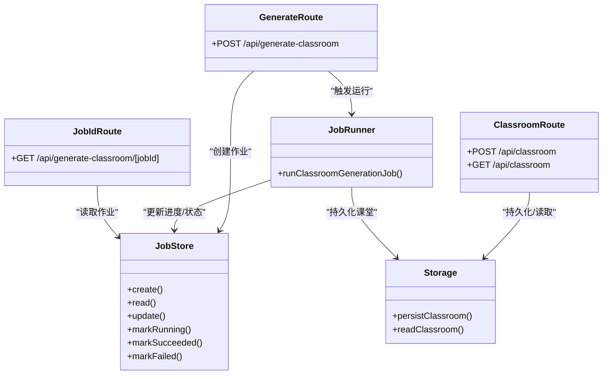

# 课堂接口

<cite>
**本文引用的文件**
- [app/api/classroom/route.ts](file://app/api/classroom/route.ts)
- [app/api/generate-classroom/route.ts](file://app/api/generate-classroom/route.ts)
- [app/api/generate-classroom/[jobId]/route.ts](file://app/api/generate-classroom/[jobId]/route.ts)
- [lib/server/classroom-storage.ts](file://lib/server/classroom-storage.ts)
- [lib/server/classroom-job-store.ts](file://lib/server/classroom-job-store.ts)
- [lib/server/classroom-job-runner.ts](file://lib/server/classroom-job-runner.ts)
- [lib/server/classroom-generation.ts](file://lib/server/classroom-generation.ts)
- [lib/server/api-response.ts](file://lib/server/api-response.ts)
</cite>

## 目录
1. [简介](#简介)
2. [项目结构](#项目结构)
3. [核心组件](#核心组件)
4. [架构总览](#架构总览)
5. [详细组件分析](#详细组件分析)
6. [依赖关系分析](#依赖关系分析)
7. [性能考量](#性能考量)
8. [故障排除指南](#故障排除指南)
9. [结论](#结论)
10. [附录](#附录)

## 简介
本文件为 OpenMAIC 的“课堂接口”提供完整 API 文档，覆盖以下能力：
- 课堂创建：接收课堂场景与舞台配置，持久化后返回可访问链接
- 异步课堂生成作业：提交生成请求，返回作业 ID 与轮询地址；支持轮询查询进度与结果
- 作业 ID 查询：通过作业 ID 获取生成进度、步骤、消息、场景统计、结果或错误
- 课堂数据接口：根据课堂 ID 获取已持久化的课堂信息（舞台与场景）
- 错误码定义与最佳实践
- 客户端集成示例与故障排除建议

## 项目结构
课堂接口由三层组成：
- 路由层：暴露 REST API，处理请求与响应
- 作业层：作业存储、进度更新、运行器调度
- 数据层：课堂持久化与读取

图表来源
- [app/api/classroom/route.ts:11-70](file://app/api/classroom/route.ts#L11-L70)
- [app/api/generate-classroom/route.ts:11-51](file://app/api/generate-classroom/route.ts#L11-L51)
- [app/api/generate-classroom/[jobId]/route.ts](file://app/api/generate-classroom/[jobId]/route.ts#L11-L48)
- [lib/server/classroom-storage.ts:61-84](file://lib/server/classroom-storage.ts#L61-L84)
- [lib/server/classroom-job-store.ts:102-226](file://lib/server/classroom-job-store.ts#L102-L226)
- [lib/server/classroom-job-runner.ts:13-50](file://lib/server/classroom-job-runner.ts#L13-L50)

章节来源
- [app/api/classroom/route.ts:11-70](file://app/api/classroom/route.ts#L11-L70)
- [app/api/generate-classroom/route.ts:11-51](file://app/api/generate-classroom/route.ts#L11-L51)
- [app/api/generate-classroom/[jobId]/route.ts](file://app/api/generate-classroom/[jobId]/route.ts#L11-L48)
- [lib/server/classroom-storage.ts:61-84](file://lib/server/classroom-storage.ts#L61-L84)
- [lib/server/classroom-job-store.ts:102-226](file://lib/server/classroom-job-store.ts#L102-L226)
- [lib/server/classroom-job-runner.ts:13-50](file://lib/server/classroom-job-runner.ts#L13-L50)

## 核心组件
- 课堂创建接口：接收舞台与场景数组，校验必填字段，持久化后返回课堂 ID 与可访问 URL
- 课堂数据接口：按 ID 读取已持久化的课堂数据
- 异步课堂生成接口：接收需求描述（可选 PDF 内容与语言），创建作业并立即返回 202，后台异步执行
- 作业 ID 查询接口：轮询获取作业状态、进度、步骤、消息、场景统计、结果或错误

章节来源
- [app/api/classroom/route.ts:11-70](file://app/api/classroom/route.ts#L11-L70)
- [app/api/generate-classroom/route.ts:11-51](file://app/api/generate-classroom/route.ts#L11-L51)
- [app/api/generate-classroom/[jobId]/route.ts](file://app/api/generate-classroom/[jobId]/route.ts#L11-L48)
- [lib/server/classroom-storage.ts:44-84](file://lib/server/classroom-storage.ts#L44-L84)
- [lib/server/classroom-job-store.ts:15-42](file://lib/server/classroom-job-store.ts#L15-L42)
- [lib/server/classroom-generation.ts:25-53](file://lib/server/classroom-generation.ts#L25-L53)

## 架构总览
课堂接口采用“请求即刻返回 + 后台异步执行”的模式，结合作业存储与运行器，实现可轮询的状态查询。

图表来源
- [app/api/generate-classroom/route.ts:11-51](file://app/api/generate-classroom/route.ts#L11-L51)
- [app/api/generate-classroom/[jobId]/route.ts](file://app/api/generate-classroom/[jobId]/route.ts#L11-L48)
- [lib/server/classroom-job-store.ts:102-226](file://lib/server/classroom-job-store.ts#L102-L226)
- [lib/server/classroom-job-runner.ts:13-50](file://lib/server/classroom-job-runner.ts#L13-L50)
- [lib/server/classroom-storage.ts:61-84](file://lib/server/classroom-storage.ts#L61-L84)

## 详细组件分析

### 课堂创建接口
- 方法与路径
  - POST /api/classroom
- 请求体
  - stage: 舞台对象（包含 id 或由服务端生成 UUID）
  - scenes: 场景数组
- 响应
  - 201 Created：返回 { id, url }
  - 400 Bad Request：缺少必填字段
  - 500 Internal Error：存储失败
- 关键行为
  - 校验 stage 与 scenes 是否存在
  - 若 stage.id 缺失则生成随机 ID
  - 使用请求头构建基础 URL，生成课堂页面链接
  - 将舞台与场景写入 data/classrooms/<id>.json

章节来源
- [app/api/classroom/route.ts:11-38](file://app/api/classroom/route.ts#L11-L38)
- [lib/server/classroom-storage.ts:31-84](file://lib/server/classroom-storage.ts#L31-L84)
- [lib/server/api-response.ts:26-45](file://lib/server/api-response.ts#L26-L45)

### 课堂数据接口
- 方法与路径
  - GET /api/classroom?id={课堂ID}
- 参数
  - id: 必填，字母数字下划线连字符
- 响应
  - 200 OK：返回 { classroom: { id, stage, scenes, createdAt } }
  - 400 Bad Request：缺少 id 或 id 非法
  - 404 Not Found：未找到课堂
  - 500 Internal Error：读取失败

章节来源
- [app/api/classroom/route.ts:40-70](file://app/api/classroom/route.ts#L40-L70)
- [lib/server/classroom-storage.ts:44-59](file://lib/server/classroom-storage.ts#L44-L59)

### 异步课堂生成作业接口
- 方法与路径
  - POST /api/generate-classroom
- 请求体
  - requirement: 必填，课堂主题/教学目标
  - pdfContent: 可选，{ text, images[] }
  - language: 可选，默认 zh-CN
- 响应
  - 202 Accepted：返回 { jobId, status, step, message, pollUrl, pollIntervalMs }
  - 400 Bad Request：缺少必填字段 requirement
  - 500 Internal Error：创建作业失败
- 关键行为
  - 校验 requirement
  - 生成 jobId（短 ID），创建作业记录
  - 立即返回 202，同时 after() 中触发异步执行
  - 轮询地址为 /api/generate-classroom/{jobId}

章节来源
- [app/api/generate-classroom/route.ts:11-51](file://app/api/generate-classroom/route.ts#L11-L51)
- [lib/server/classroom-job-store.ts:102-122](file://lib/server/classroom-job-store.ts#L102-L122)

### 作业 ID 接口
- 方法与路径
  - GET /api/generate-classroom/[jobId]
- 参数
  - jobId: 必填，字母数字下划线连字符
- 响应
  - 200 OK：返回作业详情（含状态、步骤、进度、消息、场景统计、结果或错误）
  - 400 Bad Request：非法 jobId
  - 404 Not Found：作业不存在
  - 500 Internal Error：读取失败
- 关键行为
  - 校验 jobId 格式
  - 读取作业并进行“过期检查”（超过 30 分钟无更新标记为失败）
  - 返回 done 字段用于判断是否结束

章节来源
- [app/api/generate-classroom/[jobId]/route.ts](file://app/api/generate-classroom/[jobId]/route.ts#L11-L48)
- [lib/server/classroom-job-store.ts:98-137](file://lib/server/classroom-job-store.ts#L98-L137)

### 课堂生成流水线（内部）
- 输入
  - requirement, pdfContent, language
- 进度事件
  - initializing → generating_outlines → generating_scenes → persisting → completed
- 输出
  - 生成的舞台与场景集合，持久化后返回 { id, url, stage, scenes, scenesCount, createdAt }

章节来源
- [lib/server/classroom-generation.ts:86-264](file://lib/server/classroom-generation.ts#L86-L264)
- [lib/server/classroom-job-runner.ts:13-50](file://lib/server/classroom-job-runner.ts#L13-L50)

## 依赖关系分析
- 路由到作业存储
  - 生成接口创建作业并标记为 running
  - 作业运行器在回调中更新进度与最终结果
- 作业存储到课堂存储
  - 生成完成后调用持久化，写入 classrooms 目录
- API 响应统一格式
  - 统一错误码与成功响应结构

图表来源
- [app/api/classroom/route.ts:11-70](file://app/api/classroom/route.ts#L11-L70)
- [app/api/generate-classroom/route.ts:11-51](file://app/api/generate-classroom/route.ts#L11-L51)
- [app/api/generate-classroom/[jobId]/route.ts](file://app/api/generate-classroom/[jobId]/route.ts#L11-L48)
- [lib/server/classroom-job-store.ts:102-226](file://lib/server/classroom-job-store.ts#L102-L226)
- [lib/server/classroom-job-runner.ts:13-50](file://lib/server/classroom-job-runner.ts#L13-L50)
- [lib/server/classroom-storage.ts:61-84](file://lib/server/classroom-storage.ts#L61-L84)

## 性能考量
- 异步执行与轮询
  - 生成接口返回 202 后立即释放请求线程，避免阻塞
  - 客户端以固定轮询间隔（如 5 秒）查询作业状态
- 文件原子写入
  - 课堂与作业均采用临时文件 + 原子重命名，降低并发写入风险
- 过期检测
  - 作业长时间无更新会被标记为失败，防止僵尸任务占用资源
- 并发控制
  - 作业文件读写加锁，保证同一作业的并发一致性

章节来源
- [lib/server/classroom-storage.ts:21-29](file://lib/server/classroom-storage.ts#L21-L29)
- [lib/server/classroom-job-store.ts:59-76](file://lib/server/classroom-job-store.ts#L59-L76)
- [lib/server/classroom-job-store.ts:81-96](file://lib/server/classroom-job-store.ts#L81-L96)

## 故障排除指南
- 常见错误与排查
  - 缺少必填字段：检查请求体是否包含 requirement（生成）、stage 与 scenes（创建）
  - 非法 ID：确认 id 与 jobId 仅包含字母、数字、下划线与连字符
  - 未找到课堂/作业：确认 ID 正确且对应资源存在
  - 生成失败：查看作业状态中的 error 字段与日志
  - API Key 缺失：生成阶段会校验提供商密钥，确保环境变量或配置文件已设置
- 建议
  - 生成接口返回 202 后立即保存 jobId，避免丢失
  - 轮询时注意控制频率，避免对服务器造成压力
  - 对于长时间运行的生成，建议在前端显示阶段性提示（step/message）

章节来源
- [lib/server/api-response.ts:3-15](file://lib/server/api-response.ts#L3-L15)
- [lib/server/classroom-generation.ts:105-113](file://lib/server/classroom-generation.ts#L105-L113)
- [lib/server/classroom-job-store.ts:215-226](file://lib/server/classroom-job-store.ts#L215-L226)

## 结论
课堂接口提供了从“课堂创建”到“异步生成”的完整链路，具备清晰的错误码、稳定的持久化与可靠的作业状态管理。客户端可通过作业 ID 实现进度跟踪与结果获取，适合在教学场景中批量生成与分发课堂内容。

## 附录

### API 定义与示例

- 课堂创建
  - 方法：POST /api/classroom
  - 请求体字段
    - stage: 对象，包含 id（可选）、name、description、language、style、createdAt、updatedAt 等
    - scenes: 数组，每个元素为场景对象
  - 成功响应：201，返回 { id, url }
  - 失败响应：400/500，返回统一错误结构

- 课堂数据
  - 方法：GET /api/classroom?id={id}
  - 成功响应：200，返回 { classroom }

- 异步课堂生成
  - 方法：POST /api/generate-classroom
  - 请求体字段
    - requirement: 字符串，必填
    - pdfContent: 可选，包含 text 与 images[]
    - language: 可选，如 zh-CN/en-US
  - 成功响应：202，返回 { jobId, status, step, message, pollUrl, pollIntervalMs }

- 作业 ID 查询
  - 方法：GET /api/generate-classroom/[jobId]
  - 成功响应：200，返回作业状态与进度，包含 done 字段

章节来源
- [app/api/classroom/route.ts:11-70](file://app/api/classroom/route.ts#L11-L70)
- [app/api/generate-classroom/route.ts:11-51](file://app/api/generate-classroom/route.ts#L11-L51)
- [app/api/generate-classroom/[jobId]/route.ts](file://app/api/generate-classroom/[jobId]/route.ts#L11-L48)

### 错误码定义
- MISSING_REQUIRED_FIELD：缺少必填字段
- MISSING_API_KEY：API Key 缺失
- INVALID_REQUEST：请求无效（如非法 ID）
- INVALID_URL：URL 不合法
- REDIRECT_NOT_ALLOWED：不允许重定向
- CONTENT_SENSITIVE：内容敏感
- UPSTREAM_ERROR：上游错误
- GENERATION_FAILED：生成失败
- TRANSCRIPTION_FAILED：转录失败
- PARSE_FAILED：解析失败
- INTERNAL_ERROR：内部错误

章节来源
- [lib/server/api-response.ts:3-15](file://lib/server/api-response.ts#L3-L15)

### 最佳实践
- 客户端
  - 生成接口收到 202 后立即记录 jobId，并在 UI 展示“生成中”
  - 使用固定轮询间隔（例如 5 秒），直到 done=true
  - 对于失败状态，展示错误信息并允许用户重试
- 服务端
  - 保持作业文件原子写入，避免并发冲突
  - 对长时间无更新的作业进行过期标记，防止资源泄漏
  - 在生成过程中及时上报进度，提升用户体验