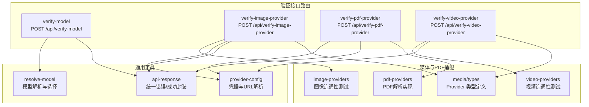
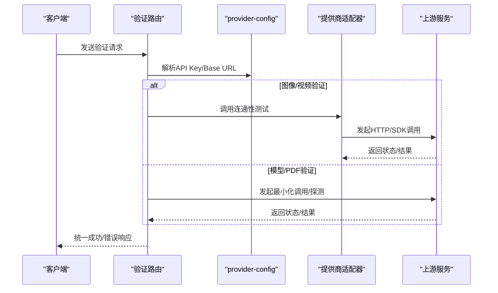
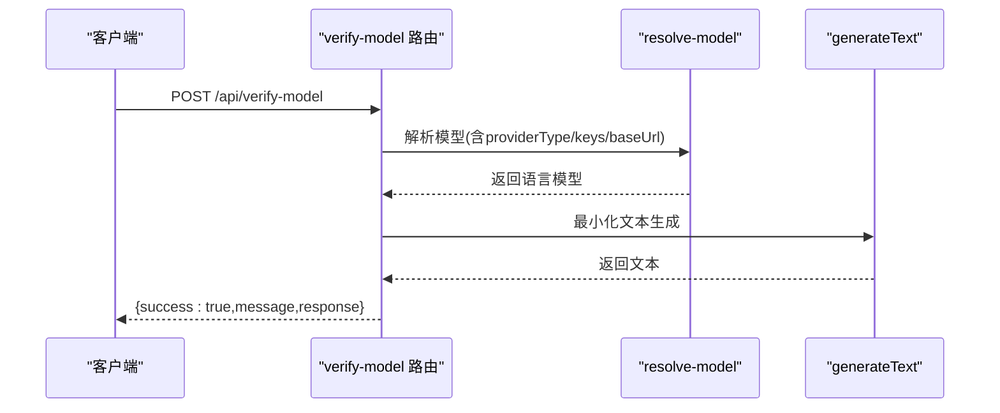
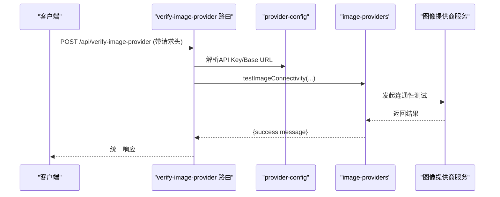
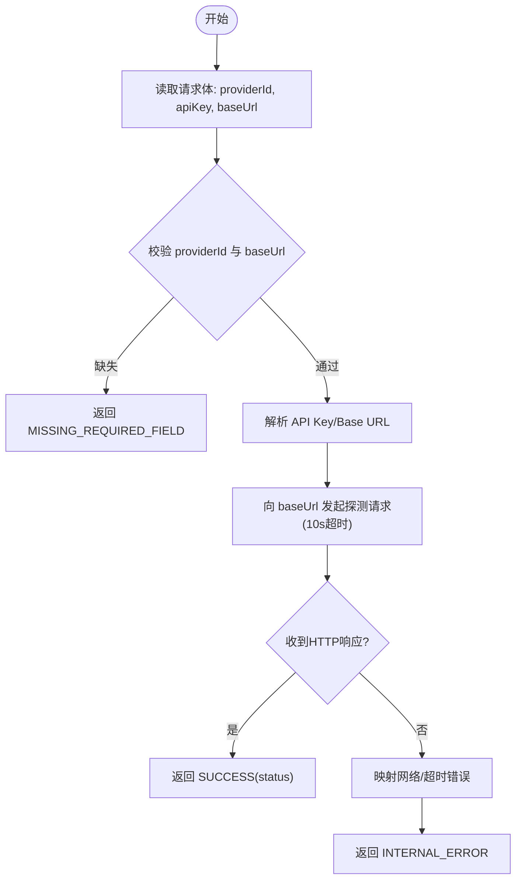
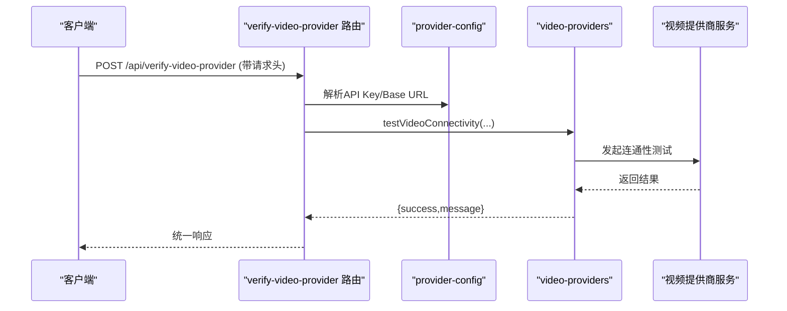
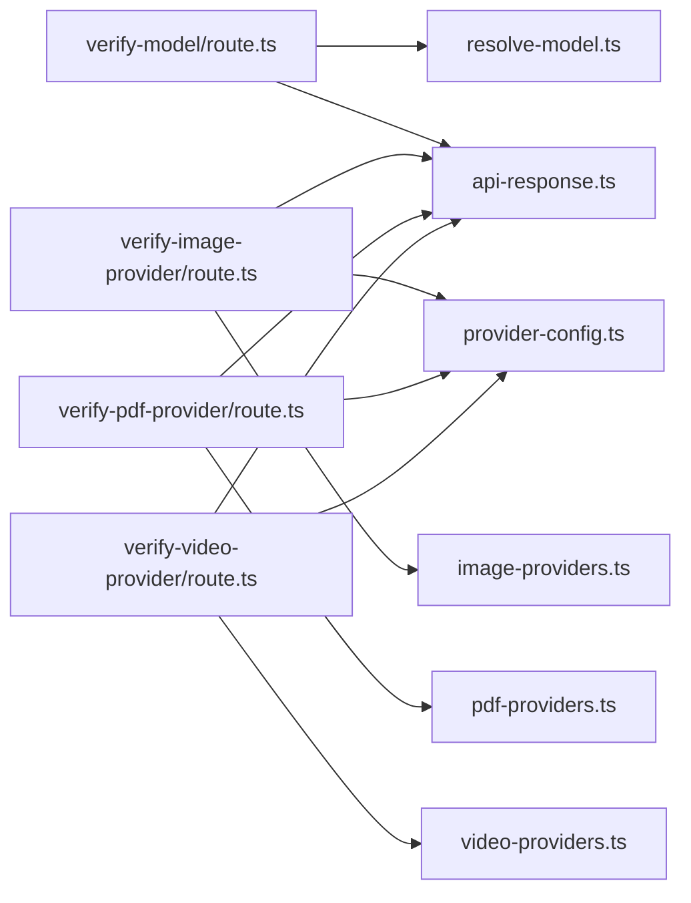

# 验证接口

<cite>
**本文引用的文件**
- [app/api/verify-model/route.ts](file://app/api/verify-model/route.ts)
- [app/api/verify-image-provider/route.ts](file://app/api/verify-image-provider/route.ts)
- [app/api/verify-pdf-provider/route.ts](file://app/api/verify-pdf-provider/route.ts)
- [app/api/verify-video-provider/route.ts](file://app/api/verify-video-provider/route.ts)
- [lib/server/resolve-model.ts](file://lib/server/resolve-model.ts)
- [lib/server/provider-config.ts](file://lib/server/provider-config.ts)
- [lib/server/api-response.ts](file://lib/server/api-response.ts)
- [lib/media/image-providers.ts](file://lib/media/image-providers.ts)
- [lib/media/video-providers.ts](file://lib/media/video-providers.ts)
- [lib/media/types.ts](file://lib/media/types.ts)
- [lib/pdf/pdf-providers.ts](file://lib/pdf/pdf-providers.ts)
</cite>

## 目录
1. [简介](#简介)
2. [项目结构](#项目结构)
3. [核心组件](#核心组件)
4. [架构总览](#架构总览)
5. [详细组件分析](#详细组件分析)
6. [依赖关系分析](#依赖关系分析)
7. [性能考量](#性能考量)
8. [故障排除指南](#故障排除指南)
9. [结论](#结论)
10. [附录：API 调用示例与参数说明](#附录api-调用示例与参数说明)

## 简介
本文件为 OpenMAIC 的验证接口提供完整 API 文档，覆盖以下四类验证端点：
- 模型验证接口：验证大模型可用性与配置正确性（含模型解析、连通性测试）。
- 图像提供商验证接口：验证图像生成服务可用性与配置（不实际生成图片）。
- PDF 提供商验证接口：验证 PDF 解析服务可用性与基础连通性。
- 视频提供商验证接口：验证视频生成服务可用性与配置（不实际生成视频）。

这些接口在系统配置中扮演关键角色：确保用户或管理员在启用具体功能前，能快速确认上游服务可达、凭据有效、URL 正确，并识别常见网络与配额问题，从而降低运行时失败率。

## 项目结构
验证接口位于后端路由层，采用 Next.js App Router 的 route.ts 结构组织；各接口通过统一的响应封装与配置解析工具完成请求处理与错误归因。

图表来源
- [app/api/verify-model/route.ts:1-69](file://app/api/verify-model/route.ts#L1-L69)
- [app/api/verify-image-provider/route.ts:1-57](file://app/api/verify-image-provider/route.ts#L1-L57)
- [app/api/verify-pdf-provider/route.ts:1-58](file://app/api/verify-pdf-provider/route.ts#L1-L58)
- [app/api/verify-video-provider/route.ts:1-57](file://app/api/verify-video-provider/route.ts#L1-L57)
- [lib/server/resolve-model.ts:1-61](file://lib/server/resolve-model.ts#L1-L61)
- [lib/server/provider-config.ts:1-398](file://lib/server/provider-config.ts#L1-L398)
- [lib/server/api-response.ts:1-46](file://lib/server/api-response.ts#L1-L46)
- [lib/media/image-providers.ts:1-113](file://lib/media/image-providers.ts#L1-L113)
- [lib/media/video-providers.ts:1-156](file://lib/media/video-providers.ts#L1-L156)
- [lib/media/types.ts:1-321](file://lib/media/types.ts#L1-L321)
- [lib/pdf/pdf-providers.ts:1-464](file://lib/pdf/pdf-providers.ts#L1-L464)

章节来源
- [app/api/verify-model/route.ts:1-69](file://app/api/verify-model/route.ts#L1-L69)
- [app/api/verify-image-provider/route.ts:1-57](file://app/api/verify-image-provider/route.ts#L1-L57)
- [app/api/verify-pdf-provider/route.ts:1-58](file://app/api/verify-pdf-provider/route.ts#L1-L58)
- [app/api/verify-video-provider/route.ts:1-57](file://app/api/verify-video-provider/route.ts#L1-L57)

## 核心组件
- 统一响应封装：提供标准的成功/失败响应体与错误码常量，便于前端一致处理。
- 服务器端配置解析：从 YAML 与环境变量加载提供商配置，支持客户端覆盖与服务端回退。
- 模型解析器：将模型字符串解析为具体 Provider 与模型 ID，并结合 API Key、Base URL、代理等进行最终选择。
- 媒体提供商适配：图像/视频提供商各自提供连通性测试方法，用于轻量级可用性校验。

章节来源
- [lib/server/api-response.ts:1-46](file://lib/server/api-response.ts#L1-L46)
- [lib/server/provider-config.ts:1-398](file://lib/server/provider-config.ts#L1-L398)
- [lib/server/resolve-model.ts:1-61](file://lib/server/resolve-model.ts#L1-L61)
- [lib/media/image-providers.ts:1-113](file://lib/media/image-providers.ts#L1-L113)
- [lib/media/video-providers.ts:1-156](file://lib/media/video-providers.ts#L1-L156)

## 架构总览
验证接口的通用处理流程如下：
- 接收请求（请求体或请求头）
- 解析与校验必要字段
- 通过 provider-config 解析 API Key 与 Base URL（支持客户端覆盖与服务端回退）
- 执行对应提供商的连通性测试或最小化调用
- 封装统一响应，按错误类型映射到标准错误码

图表来源
- [app/api/verify-model/route.ts:8-68](file://app/api/verify-model/route.ts#L8-L68)
- [app/api/verify-image-provider/route.ts:26-56](file://app/api/verify-image-provider/route.ts#L26-L56)
- [app/api/verify-pdf-provider/route.ts:8-57](file://app/api/verify-pdf-provider/route.ts#L8-L57)
- [app/api/verify-video-provider/route.ts:26-56](file://app/api/verify-video-provider/route.ts#L26-L56)
- [lib/server/provider-config.ts:314-374](file://lib/server/provider-config.ts#L314-L374)
- [lib/media/image-providers.ts:71-87](file://lib/media/image-providers.ts#L71-L87)
- [lib/media/video-providers.ts:79-95](file://lib/media/video-providers.ts#L79-L95)

## 详细组件分析

### 模型验证接口
- 功能概述
  - 解析模型字符串，解析优先级：请求体参数 > 服务端默认值
  - 通过最小化文本生成请求验证连通性与鉴权
  - 对常见错误进行语义化提示（如 401/404/429/网络异常/超时）

- 请求方式与路径
  - POST /api/verify-model

- 请求体字段
  - apiKey: 可选，客户端可传入覆盖服务端配置
  - baseUrl: 可选，客户端可传入覆盖服务端配置
  - model: 必填，模型标识（如 provider/model-id）
  - providerType: 可选，显式指定提供商类型
  - requiresApiKey: 可选，是否强制要求 API Key

- 成功响应
  - message: 连接成功提示
  - response: 服务返回的文本片段（最小化测试）

- 错误响应
  - MISSING_REQUIRED_FIELD: 缺少必填字段（如未提供 model）
  - INVALID_REQUEST: 模型解析失败（如未知提供商/模型）
  - INTERNAL_ERROR: 其他错误（包含对常见错误码的语义化映射）

- 关键处理逻辑
  - 使用 resolveModel 完成模型解析与选择
  - 使用 generateText 发起最小化请求
  - 对网络/鉴权/配额/超时等错误进行分类与友好提示

图表来源
- [app/api/verify-model/route.ts:8-44](file://app/api/verify-model/route.ts#L8-L44)
- [lib/server/resolve-model.ts:22-45](file://lib/server/resolve-model.ts#L22-L45)

章节来源
- [app/api/verify-model/route.ts:1-69](file://app/api/verify-model/route.ts#L1-L69)
- [lib/server/resolve-model.ts:1-61](file://lib/server/resolve-model.ts#L1-L61)
- [lib/server/api-response.ts:1-46](file://lib/server/api-response.ts#L1-L46)

### 图像提供商验证接口
- 功能概述
  - 通过请求头指定提供商与可选模型
  - 解析 API Key 与 Base URL（支持客户端覆盖与服务端回退）
  - 调用图像提供商的连通性测试函数，不实际生成图片
  - 返回统一的成功/错误响应

- 请求方式与路径
  - POST /api/verify-image-provider

- 请求头字段
  - x-image-provider: ImageProviderId（默认 seedream）
  - x-image-model: 可选，目标模型标识
  - x-api-key: 可选，覆盖服务端配置
  - x-base-url: 可选，覆盖服务端配置

- 成功响应
  - message: 连接成功提示

- 错误响应
  - MISSING_API_KEY: 未配置 API Key
  - UPSTREAM_ERROR: 上游提供商返回错误
  - INTERNAL_ERROR: 内部错误

- 支持的提供商与能力
  - seedream、qwen-image、nano-banana
  - 各提供商支持的默认 Base URL、模型列表、宽高比等能力在类型定义中声明

图表来源
- [app/api/verify-image-provider/route.ts:26-51](file://app/api/verify-image-provider/route.ts#L26-L51)
- [lib/server/provider-config.ts:337-348](file://lib/server/provider-config.ts#L337-L348)
- [lib/media/image-providers.ts:71-87](file://lib/media/image-providers.ts#L71-L87)

章节来源
- [app/api/verify-image-provider/route.ts:1-57](file://app/api/verify-image-provider/route.ts#L1-L57)
- [lib/server/provider-config.ts:328-348](file://lib/server/provider-config.ts#L328-L348)
- [lib/media/image-providers.ts:1-113](file://lib/media/image-providers.ts#L1-L113)
- [lib/media/types.ts:62-114](file://lib/media/types.ts#L62-L114)

### PDF 提供商验证接口
- 功能概述
  - 通过请求体指定 providerId、apiKey、baseUrl
  - 解析 API Key 与 Base URL（支持客户端覆盖与服务端回退）
  - 向 Base URL 发起探测请求（设置 10 秒超时），任何 HTTP 响应（包括 404）均视为服务可达
  - 返回统一的成功/错误响应

- 请求方式与路径
  - POST /api/verify-pdf-provider

- 请求体字段
  - providerId: 必填，提供商标识（如 mineru 或 unpdf）
  - apiKey: 可选，覆盖服务端配置
  - baseUrl: 必填，提供商服务地址

- 成功响应
  - message: 连接成功提示
  - status: 实际 HTTP 状态码

- 错误响应
  - MISSING_REQUIRED_FIELD: 缺少 providerId 或 Base URL
  - INTERNAL_ERROR: 其他错误（如连接被拒、域名不可达、超时）

- 注意事项
  - 对于 MinerU（自托管）根路径可能返回 404，但服务可达，接口会将其判定为成功

图表来源
- [app/api/verify-pdf-provider/route.ts:8-57](file://app/api/verify-pdf-provider/route.ts#L8-L57)
- [lib/server/provider-config.ts:314-322](file://lib/server/provider-config.ts#L314-L322)

章节来源
- [app/api/verify-pdf-provider/route.ts:1-58](file://app/api/verify-pdf-provider/route.ts#L1-L58)
- [lib/server/provider-config.ts:304-322](file://lib/server/provider-config.ts#L304-L322)

### 视频提供商验证接口
- 功能概述
  - 通过请求头指定提供商与可选模型
  - 解析 API Key 与 Base URL（支持客户端覆盖与服务端回退）
  - 调用视频提供商的连通性测试函数，不实际生成视频
  - 返回统一的成功/错误响应

- 请求方式与路径
  - POST /api/verify-video-provider

- 请求头字段
  - x-video-provider: VideoProviderId（默认 seedance）
  - x-video-model: 可选，目标模型标识
  - x-api-key: 可选，覆盖服务端配置
  - x-base-url: 可选，覆盖服务端配置

- 成功响应
  - message: 连接成功提示

- 错误响应
  - MISSING_API_KEY: 未配置 API Key
  - UPSTREAM_ERROR: 上游提供商返回错误
  - INTERNAL_ERROR: 内部错误

- 支持的提供商与能力
  - seedance、kling、veo、sora
  - 各提供商支持的默认 Base URL、模型列表、宽高比、时长、分辨率等能力在类型定义中声明

图表来源
- [app/api/verify-video-provider/route.ts:26-51](file://app/api/verify-video-provider/route.ts#L26-L51)
- [lib/server/provider-config.ts:363-374](file://lib/server/provider-config.ts#L363-L374)
- [lib/media/video-providers.ts:79-95](file://lib/media/video-providers.ts#L79-L95)

章节来源
- [app/api/verify-video-provider/route.ts:1-57](file://app/api/verify-video-provider/route.ts#L1-L57)
- [lib/server/provider-config.ts:354-374](file://lib/server/provider-config.ts#L354-L374)
- [lib/media/video-providers.ts:1-156](file://lib/media/video-providers.ts#L1-L156)
- [lib/media/types.ts:175-216](file://lib/media/types.ts#L175-L216)

## 依赖关系分析
- 路由层依赖
  - 统一响应封装：api-response
  - 配置解析：provider-config
  - 模型解析：resolve-model（仅模型验证）
  - 媒体提供商适配：image-providers、video-providers
  - PDF 解析实现：pdf-providers（用于 PDF 验证的 URL 探测）

- 关键耦合点
  - provider-config 提供了跨模块的统一凭据与 URL 解析能力，支持客户端覆盖与服务端回退
  - image-providers/video-providers 将具体提供商的连通性测试抽象为统一接口
  - api-response 统一了错误码与响应结构，便于前端一致性处理

图表来源
- [app/api/verify-model/route.ts:1-69](file://app/api/verify-model/route.ts#L1-L69)
- [app/api/verify-image-provider/route.ts:1-57](file://app/api/verify-image-provider/route.ts#L1-L57)
- [app/api/verify-pdf-provider/route.ts:1-58](file://app/api/verify-pdf-provider/route.ts#L1-L58)
- [app/api/verify-video-provider/route.ts:1-57](file://app/api/verify-video-provider/route.ts#L1-L57)
- [lib/server/resolve-model.ts:1-61](file://lib/server/resolve-model.ts#L1-L61)
- [lib/server/provider-config.ts:1-398](file://lib/server/provider-config.ts#L1-L398)
- [lib/server/api-response.ts:1-46](file://lib/server/api-response.ts#L1-L46)
- [lib/media/image-providers.ts:1-113](file://lib/media/image-providers.ts#L1-L113)
- [lib/media/video-providers.ts:1-156](file://lib/media/video-providers.ts#L1-L156)
- [lib/pdf/pdf-providers.ts:1-464](file://lib/pdf/pdf-providers.ts#L1-L464)

章节来源
- [lib/server/provider-config.ts:1-398](file://lib/server/provider-config.ts#L1-L398)
- [lib/server/api-response.ts:1-46](file://lib/server/api-response.ts#L1-L46)

## 性能考量
- 轻量化设计：验证接口不执行实际生成任务，仅进行最小化连通性测试或探测请求，避免资源占用。
- 超时控制：PDF 验证设置了 10 秒超时，防止阻塞；模型验证依赖底层 SDK 的默认行为。
- 缓存策略：provider-config 在进程内缓存 YAML 配置，减少重复 IO。
- 错误早返回：在缺少必要字段或解析失败时尽早返回，避免无效调用。

## 故障排除指南
- 模型验证
  - 缺少 model：请在请求体中提供模型标识
  - 解析失败：检查模型字符串格式与 providerType 是否匹配
  - 401/404/429：分别对应鉴权失败、模型不存在或配额限制，需核对 API Key、模型与网络
  - 网络异常/超时：检查 Base URL 与网络连通性

- 图像/视频提供商验证
  - 缺少 API Key：请在服务端配置或请求头中提供
  - 上游错误：查看提供商返回的具体信息
  - 服务不可达：检查 Base URL 与 DNS/防火墙设置

- PDF 提供商验证
  - 缺少 providerId 或 Base URL：请在请求体中补齐
  - 连接被拒/域名不可达：检查服务地址与网络策略
  - 超时：适当放宽网络条件或检查服务端负载

章节来源
- [app/api/verify-model/route.ts:45-67](file://app/api/verify-model/route.ts#L45-L67)
- [app/api/verify-image-provider/route.ts:36-55](file://app/api/verify-image-provider/route.ts#L36-L55)
- [app/api/verify-pdf-provider/route.ts:39-56](file://app/api/verify-pdf-provider/route.ts#L39-L56)
- [app/api/verify-video-provider/route.ts:36-55](file://app/api/verify-video-provider/route.ts#L36-L55)

## 结论
验证接口通过统一的响应封装与配置解析机制，为模型、图像、视频与 PDF 提供商提供了标准化的可用性与配置验证能力。它们在系统配置阶段即能暴露潜在问题，显著提升系统的稳定性与可维护性。建议在新增或变更提供商配置时，优先调用相应验证接口，确保上游服务与凭据正确无误。

## 附录：API 调用示例与参数说明

- 模型验证
  - 路径：POST /api/verify-model
  - 请求体字段：apiKey（可选）、baseUrl（可选）、model（必填）、providerType（可选）、requiresApiKey（可选）
  - 成功响应字段：message、response
  - 常见错误：MISSING_REQUIRED_FIELD、INVALID_REQUEST、INTERNAL_ERROR

- 图像提供商验证
  - 路径：POST /api/verify-image-provider
  - 请求头字段：x-image-provider（默认 seedream）、x-image-model（可选）、x-api-key（可选）、x-base-url（可选）
  - 成功响应字段：message
  - 常见错误：MISSING_API_KEY、UPSTREAM_ERROR、INTERNAL_ERROR

- PDF 提供商验证
  - 路径：POST /api/verify-pdf-provider
  - 请求体字段：providerId（必填）、apiKey（可选）、baseUrl（必填）
  - 成功响应字段：message、status
  - 常见错误：MISSING_REQUIRED_FIELD、INTERNAL_ERROR

- 视频提供商验证
  - 路径：POST /api/verify-video-provider
  - 请求头字段：x-video-provider（默认 seedance）、x-video-model（可选）、x-api-key（可选）、x-base-url（可选）
  - 成功响应字段：message
  - 常见错误：MISSING_API_KEY、UPSTREAM_ERROR、INTERNAL_ERROR

章节来源
- [app/api/verify-model/route.ts:8-44](file://app/api/verify-model/route.ts#L8-L44)
- [app/api/verify-image-provider/route.ts:26-51](file://app/api/verify-image-provider/route.ts#L26-L51)
- [app/api/verify-pdf-provider/route.ts:8-38](file://app/api/verify-pdf-provider/route.ts#L8-L38)
- [app/api/verify-video-provider/route.ts:26-51](file://app/api/verify-video-provider/route.ts#L26-L51)