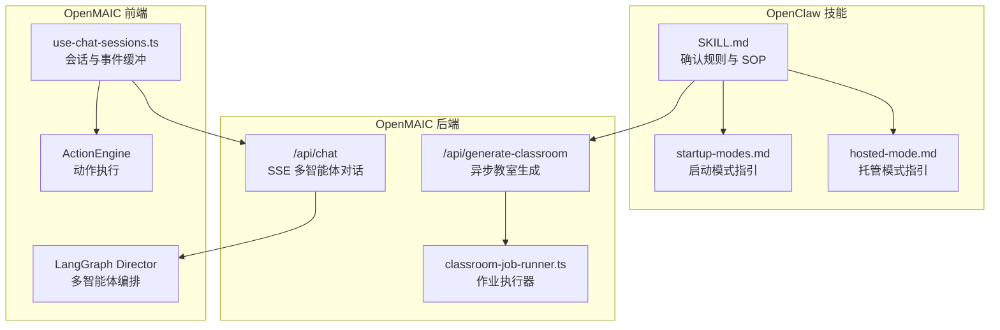
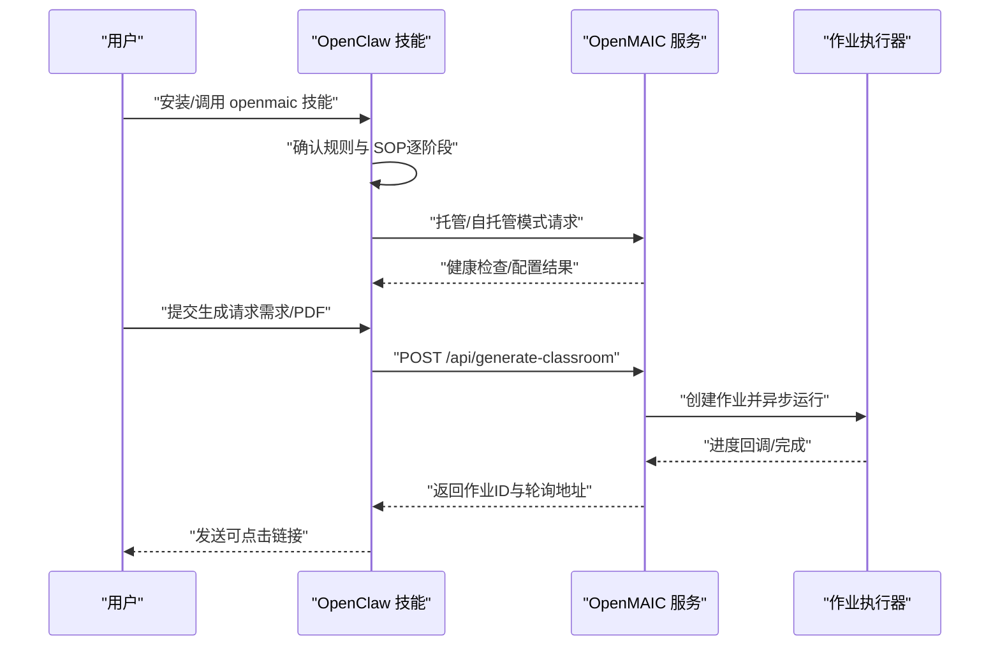
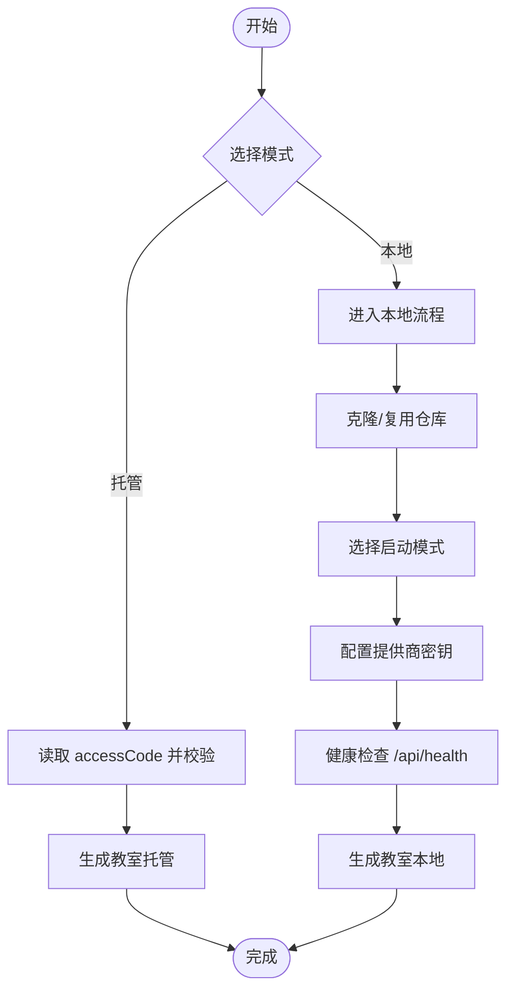
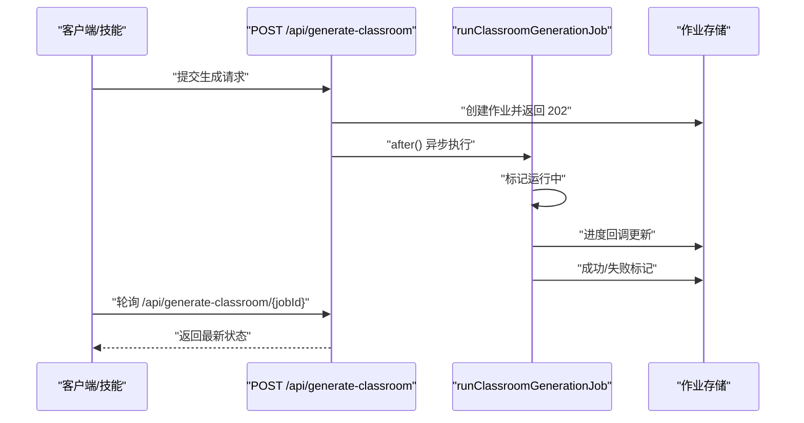
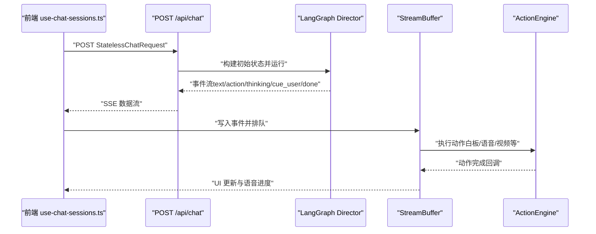
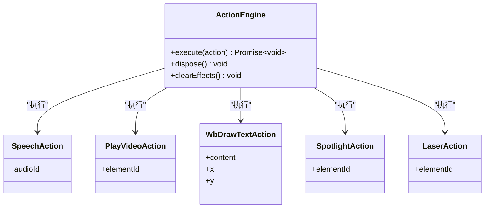
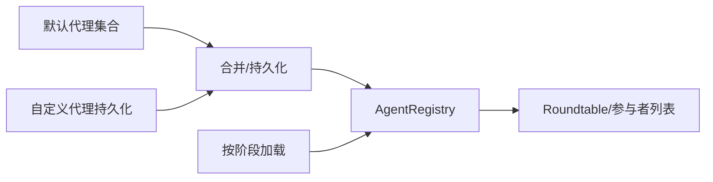
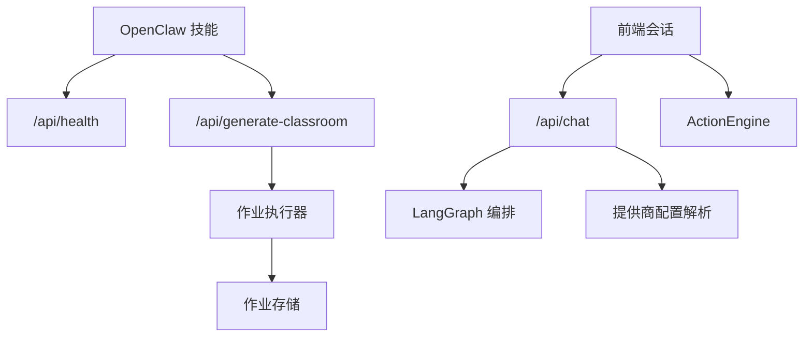

# OpenClaw 集成

<cite>
**本文引用的文件**
- [README.md](file://README.md)
- [package.json](file://package.json)
- [SKILL.md](file://skills/openmaic/SKILL.md)
- [hosted-mode.md](file://skills/openmaic/references/hosted-mode.md)
- [startup-modes.md](file://skills/openmaic/references/startup-modes.md)
- [route.ts（生成教室作业）](file://app/api/generate-classroom/route.ts)
- [route.ts（聊天 SSE）](file://app/api/chat/route.ts)
- [director-graph.ts](file://lib/orchestration/director-graph.ts)
- [use-chat-sessions.ts](file://components/chat/use-chat-sessions.ts)
- [engine.ts（动作引擎）](file://lib/action/engine.ts)
- [chat.ts（聊天类型定义）](file://lib/types/chat.ts)
- [classroom-job-runner.ts](file://lib/server/classroom-job-runner.ts)
- [store.ts（代理注册表）](file://lib/orchestration/registry/store.ts)
</cite>

## 目录
1. [简介](#简介)
2. [项目结构](#项目结构)
3. [核心组件](#核心组件)
4. [架构总览](#架构总览)
5. [详细组件分析](#详细组件分析)
6. [依赖关系分析](#依赖关系分析)
7. [性能考量](#性能考量)
8. [故障排除指南](#故障排除指南)
9. [结论](#结论)
10. [附录](#附录)

## 简介
本文件面向希望在聊天应用中无缝集成 OpenMAIC 的开发者与运维人员，系统性阐述 OpenClaw 技能集成的架构设计、配置管理机制（托管模式 vs 自托管模式）、工作流自动化（从聊天输入到课堂生成）、代理集成（消息路由、状态同步、用户交互）、部署配置（ClawHub 集成、技能安装与运行时配置）、开发模式（确认规则、错误处理、用户反馈），并提供实际部署示例、故障排除与性能优化建议，以及多平台支持与扩展开发指导。

## 项目结构
OpenMAIC 基于 Next.js App Router 提供服务端 API 与前端界面；OpenClaw 技能通过“薄路由 + 确认规则”的方式引导用户完成克隆、启动、配置与生成等步骤。关键目录与职责概览如下：
- app/api：后端 API 路由，包含聊天（SSE 流式输出）、教室生成（异步作业）、健康检查等
- lib：核心业务逻辑，包括多智能体编排（LangGraph）、动作执行引擎、类型定义、服务器侧作业调度等
- components：前端组件，包含聊天会话、动作缓冲与播放、场景渲染器等
- skills/openmaic：OpenClaw 技能定义与参考文档，提供托管/自托管模式的 SOP 与配置说明
- configs、public：共享常量与静态资源

**图表来源**
- [SKILL.md:1-101](file://skills/openmaic/SKILL.md#L1-L101)
- [hosted-mode.md:1-39](file://skills/openmaic/references/hosted-mode.md#L1-L39)
- [startup-modes.md:1-70](file://skills/openmaic/references/startup-modes.md#L1-L70)
- [route.ts（生成教室作业）:1-52](file://app/api/generate-classroom/route.ts#L1-L52)
- [route.ts（聊天 SSE）:1-191](file://app/api/chat/route.ts#L1-L191)
- [classroom-job-runner.ts:1-51](file://lib/server/classroom-job-runner.ts#L1-L51)
- [use-chat-sessions.ts:1-800](file://components/chat/use-chat-sessions.ts#L1-L800)
- [engine.ts（动作引擎）:1-519](file://lib/action/engine.ts#L1-L519)
- [director-graph.ts:1-550](file://lib/orchestration/director-graph.ts#L1-L550)

**章节来源**
- [README.md:238-311](file://README.md#L238-L311)
- [package.json:1-124](file://package.json#L1-L124)

## 核心组件
- OpenClaw 技能（SKILL.md）
  - 以“一次一步 + 明确确认”为原则，引导用户完成托管或自托管模式选择、仓库克隆、启动模式选择、API 密钥配置、服务健康检查与教室生成。
  - 支持从本地配置文件读取默认值（如 accessCode、repoDir、url），并在每次操作前要求确认。
- 托管模式（hosted-mode.md）
  - 使用 open.maic.chat 的访问令牌进行认证，无需本地部署；提供配额限制与错误码处理。
- 启动模式（startup-modes.md）
  - 提供开发模式（pnpm dev）、生产类本地模式（pnpm build && pnpm start）、Docker Compose 三种启动方式，并给出权衡与健康检查建议。
- 教室生成 API（/api/generate-classroom）
  - 接收需求或 PDF 内容，创建异步作业，返回轮询地址；后台作业完成后更新状态并持久化结果。
- 聊天 SSE API（/api/chat）
  - 接收客户端全量状态，使用统一模型提供方抽象创建语言模型实例，流式返回事件（文本增量、动作、思考阶段、结束等）。
- 多智能体编排（LangGraph Director）
  - 定义状态图拓扑，根据单/多代理策略决定下一个发言代理；支持触发代理首回合快速路径与用户提示（cue_user）。
- 动作执行引擎（ActionEngine）
  - 统一执行 28+ 类型的动作（如白板绘制、高亮、激光、语音、视频播放），区分“即时生效”与“需等待完成”的两类。
- 前端会话与事件缓冲（use-chat-sessions.ts）
  - 将 SSE 事件映射为 UI 消息与动作，驱动 ActionEngine 执行，维护会话列表、软暂停/恢复、中断标记等。
- 代理注册表（Agent Registry）
  - 默认内置教师、助教、学生等角色，支持持久化与按阶段加载生成的代理。

**章节来源**
- [SKILL.md:12-101](file://skills/openmaic/SKILL.md#L12-L101)
- [hosted-mode.md:1-39](file://skills/openmaic/references/hosted-mode.md#L1-L39)
- [startup-modes.md:1-70](file://skills/openmaic/references/startup-modes.md#L1-L70)
- [route.ts（生成教室作业）:1-52](file://app/api/generate-classroom/route.ts#L1-L52)
- [route.ts（聊天 SSE）:1-191](file://app/api/chat/route.ts#L1-L191)
- [director-graph.ts:1-550](file://lib/orchestration/director-graph.ts#L1-L550)
- [engine.ts（动作引擎）:1-519](file://lib/action/engine.ts#L1-L519)
- [use-chat-sessions.ts:1-800](file://components/chat/use-chat-sessions.ts#L1-L800)
- [store.ts（代理注册表）:1-398](file://lib/orchestration/registry/store.ts#L1-L398)

## 架构总览
OpenClaw 技能作为“向导”，将用户从“选择模式”到“生成教室”的全流程串联起来；OpenMAIC 后端负责实际的生成与多智能体交互，前端负责实时渲染与动作执行。

**图表来源**
- [SKILL.md:52-101](file://skills/openmaic/SKILL.md#L52-L101)
- [hosted-mode.md:19-39](file://skills/openmaic/references/hosted-mode.md#L19-L39)
- [startup-modes.md:56-70](file://skills/openmaic/references/startup-modes.md#L56-L70)
- [route.ts（生成教室作业）:11-52](file://app/api/generate-classroom/route.ts#L11-L52)
- [classroom-job-runner.ts:13-51](file://lib/server/classroom-job-runner.ts#L13-L51)

## 详细组件分析

### OpenClaw 技能：确认规则与 SOP
- 设计要点
  - 严格的一次一步原则，所有可能改变状态的操作均需明确确认
  - 优先引导用户编辑本地配置文件而非直接粘贴密钥
  - 仅允许服务器端配置文件控制模型与提供商选择
  - 若已存在本地状态，先展示再询问是否保留
- 关键流程
  - 选择模式：若配置中存在 accessCode 则直接进入托管模式；否则由用户选择托管或本地
  - 克隆/复用仓库：展示现有检出或引导克隆
  - 启动模式：提供开发、生产类本地、Docker 三种选项与权衡说明
  - 配置密钥：推荐使用服务器端配置文件，失败时回退到该阶段修正
  - 健康检查：启动后验证 /api/health
  - 生成教室：遵循生成流程，支持长作业稀疏轮询与二次确认豁免

**图表来源**
- [SKILL.md:52-101](file://skills/openmaic/SKILL.md#L52-L101)
- [hosted-mode.md:5-39](file://skills/openmaic/references/hosted-mode.md#L5-L39)
- [startup-modes.md:7-70](file://skills/openmaic/references/startup-modes.md#L7-L70)

**章节来源**
- [SKILL.md:12-101](file://skills/openmaic/SKILL.md#L12-L101)
- [hosted-mode.md:1-39](file://skills/openmaic/references/hosted-mode.md#L1-L39)
- [startup-modes.md:1-70](file://skills/openmaic/references/startup-modes.md#L1-L70)

### 教室生成：异步作业与轮询
- 请求入口
  - POST /api/generate-classroom 接收 requirement/pdf/language 等字段，校验必填项后创建作业并立即返回 202
  - 返回内容包含 jobId/status/step/message/pollUrl/pollIntervalMs
- 后台执行
  - after() 触发 runClassroomGenerationJob(jobId, body, baseUrl)
  - 作业运行期间持续上报进度，成功后持久化结果，失败则记录错误信息
- 轮询与消费
  - 客户端定期 GET /api/generate-classroom/{jobId} 获取最新状态
  - 技能在作业完成后推送可访问的教室链接

**图表来源**
- [route.ts（生成教室作业）:11-52](file://app/api/generate-classroom/route.ts#L11-L52)
- [classroom-job-runner.ts:13-51](file://lib/server/classroom-job-runner.ts#L13-L51)

**章节来源**
- [route.ts（生成教室作业）:1-52](file://app/api/generate-classroom/route.ts#L1-L52)
- [classroom-job-runner.ts:1-51](file://lib/server/classroom-job-runner.ts#L1-L51)

### 聊天与多智能体编排：SSE 与 LangGraph
- SSE 聊天接口
  - POST /api/chat 接收 StatelessChatRequest，解析模型字符串与提供商配置，创建 LanguageModel 实例
  - 使用 TransformStream 创建 SSE 流，周期性心跳保持连接活跃
  - 流式事件类型：agent_start/text_delta/action/thinking/cue_user/done/error
- 多智能体编排
  - LangGraph 状态图：START → director → agent_generate → director（循环）
  - 单代理：纯代码逻辑，首回合派发，后续回合提示用户
  - 多代理：首回合可指定触发代理；其余回合由 LLM 决策下一个代理或提示用户
  - 事件通过 writer 推送，前端缓冲器按顺序呈现文本与动作
- 前端会话与动作
  - use-chat-sessions.ts 维护会话列表、软暂停/恢复、中断标记
  - 将 text_delta 与 action 事件映射为 UI 消息与动作徽章，并交由 ActionEngine 执行

**图表来源**
- [route.ts（聊天 SSE）:44-191](file://app/api/chat/route.ts#L44-L191)
- [director-graph.ts:88-228](file://lib/orchestration/director-graph.ts#L88-L228)
- [use-chat-sessions.ts:144-329](file://components/chat/use-chat-sessions.ts#L144-L329)
- [engine.ts（动作引擎）:80-125](file://lib/action/engine.ts#L80-L125)

**章节来源**
- [route.ts（聊天 SSE）:1-191](file://app/api/chat/route.ts#L1-L191)
- [director-graph.ts:1-550](file://lib/orchestration/director-graph.ts#L1-L550)
- [use-chat-sessions.ts:1-800](file://components/chat/use-chat-sessions.ts#L1-L800)
- [engine.ts（动作引擎）:1-519](file://lib/action/engine.ts#L1-L519)
- [chat.ts（聊天类型定义）:299-337](file://lib/types/chat.ts#L299-L337)

### 动作执行引擎：统一动作层
- 能力范围
  - 即时生效：spotlight、laser（自动清理）
  - 需等待：speech、play_video、wb_*（白板绘制/删除/清空等）
- 执行策略
  - 白板相关动作自动确保白板打开
  - 语音播放等待音频播放完成
  - 视频播放等待元素不再处于播放状态
- 与前端联动
  - 通过 useCanvasStore 与媒体生成任务状态协调
  - 与 Stage API 协同创建/更新白板元素

**图表来源**
- [engine.ts（动作引擎）:55-125](file://lib/action/engine.ts#L55-L125)
- [engine.ts（动作引擎）:165-228](file://lib/action/engine.ts#L165-L228)
- [engine.ts（动作引擎）:280-335](file://lib/action/engine.ts#L280-L335)
- [engine.ts（动作引擎）:149-161](file://lib/action/engine.ts#L149-L161)

**章节来源**
- [engine.ts（动作引擎）:1-519](file://lib/action/engine.ts#L1-L519)

### 代理注册与角色管理
- 默认代理
  - 内置教师、助教、学生等角色，定义角色 persona、头像、颜色与允许动作集合
- 注册表
  - 支持持久化与迁移，合并默认代理与自定义代理
  - 按角色与优先级排序，用于 UI 参与者列表与 Roundtable 布局
- 生成代理
  - 按阶段从 IndexedDB 加载生成的代理，避免持久缓存生成代理

**图表来源**
- [store.ts（代理注册表）:42-187](file://lib/orchestration/registry/store.ts#L42-L187)
- [store.ts（代理注册表）:318-350](file://lib/orchestration/registry/store.ts#L318-L350)

**章节来源**
- [store.ts（代理注册表）:1-398](file://lib/orchestration/registry/store.ts#L1-L398)

## 依赖关系分析
- OpenClaw 技能依赖
  - 本地配置文件（~/.openclaw/openclaw.json）中的技能配置项
  - OpenMAIC 服务端 API（/api/health、/api/generate-classroom、/api/chat）
- OpenMAIC 后端依赖
  - LangGraph 用于多智能体编排
  - 服务器侧提供商配置解析（模型字符串解析、API Key/BaseURL 解析、代理设置）
  - 作业存储与进度回调
- 前端依赖
  - SSE 流处理与事件缓冲
  - ActionEngine 与画布/媒体状态

**图表来源**
- [route.ts（聊天 SSE）:63-86](file://app/api/chat/route.ts#L63-L86)
- [route.ts（生成教室作业）:25-42](file://app/api/generate-classroom/route.ts#L25-L42)
- [classroom-job-runner.ts:27-34](file://lib/server/classroom-job-runner.ts#L27-L34)
- [use-chat-sessions.ts:400-420](file://components/chat/use-chat-sessions.ts#L400-L420)

**章节来源**
- [route.ts（聊天 SSE）:1-191](file://app/api/chat/route.ts#L1-L191)
- [route.ts（生成教室作业）:1-52](file://app/api/generate-classroom/route.ts#L1-L52)
- [classroom-job-runner.ts:1-51](file://lib/server/classroom-job-runner.ts#L1-L51)
- [use-chat-sessions.ts:1-800](file://components/chat/use-chat-sessions.ts#L1-L800)

## 性能考量
- SSE 心跳
  - 服务端定时发送心跳注释，避免代理/浏览器在长时间无事件时关闭连接
- 最大时长与超时
  - 聊天与教室生成接口设置最大执行时长，避免长时间占用资源
- 前端缓冲与节拍
  - 讨论/问答场景增加文本与动作节拍延迟，提升可读性；讲座场景由播放引擎控制节奏
- 动作执行批处理
  - 白板批量动画采用渐进式与级联效果，合理控制动画时长上限

[本节为通用性能建议，不直接分析具体文件]

## 故障排除指南
- OpenClaw 技能
  - 若 accessCode 无效：检查 open.maic.chat 上的令牌有效性与网络连通性
  - 若生成返回 403 Daily quota exhausted：提示每日配额耗尽，次日重置
  - 若托管服务不可达：切换至自托管模式或检查网络
- 本地启动
  - 健康检查失败：确认已正确配置 API Key 与服务端口，查看日志
  - 生成作业长时间无响应：检查作业存储与回调链路
- 聊天 SSE
  - 连接被代理/浏览器关闭：启用心跳；检查客户端信号中断处理
  - 事件缺失：确认前端缓冲器已正确接收 done 事件并更新会话状态
- 动作执行
  - 语音/视频未播放：检查媒体任务状态与占位符解析；确认播放器可用
  - 白板无响应：确认白板已打开且元素 ID 正确

**章节来源**
- [hosted-mode.md:32-39](file://skills/openmaic/references/hosted-mode.md#L32-L39)
- [startup-modes.md:56-64](file://skills/openmaic/references/startup-modes.md#L56-L64)
- [route.ts（聊天 SSE）:96-116](file://app/api/chat/route.ts#L96-L116)
- [use-chat-sessions.ts:300-320](file://components/chat/use-chat-sessions.ts#L300-L320)
- [engine.ts（动作引擎）:180-228](file://lib/action/engine.ts#L180-L228)

## 结论
OpenMAIC 通过 OpenClaw 技能实现了从聊天应用到课堂生成的无缝衔接：技能以“确认规则 + SOP”保障用户体验与安全性，后端以 LangGraph 实现多智能体编排与 SSE 实时渲染，前端以动作引擎与缓冲器实现丰富的课堂交互。托管与自托管两种模式满足不同部署需求，配合完善的错误处理与性能优化建议，可稳定支撑多平台与扩展开发。

[本节为总结性内容，不直接分析具体文件]

## 附录

### 部署配置与运行时配置
- ClawHub 集成与技能安装
  - 通过 clawhub install openmaic 或手动复制技能目录到 ~/.openclaw/skills/openmaic
- 技能配置（~/.openclaw/openclaw.json）
  - openmaic.config.accessCode：托管模式访问令牌
  - openmaic.config.repoDir/url：自托管模式本地仓库路径与服务地址
- OpenMAIC 服务端配置
  - .env.local：至少配置一个 LLM 提供商 API Key
  - server-providers.yml：可选的服务器端提供商配置文件
  - 默认模型：可通过环境变量设置默认模型字符串

**章节来源**
- [README.md:265-278](file://README.md#L265-L278)
- [SKILL.md:27-51](file://skills/openmaic/SKILL.md#L27-L51)
- [README.md:88-117](file://README.md#L88-L117)

### 开发模式与用户反馈
- 确认规则
  - 每个状态变更前必须获得用户确认
  - 对本地文件读取（如 PDF）也要求二次确认
- 用户反馈
  - 生成链接直接以纯文本形式发送，避免格式化干扰
  - 错误码与提示信息清晰，便于用户定位问题

**章节来源**
- [SKILL.md:12-26](file://skills/openmaic/SKILL.md#L12-L26)
- [SKILL.md:94-101](file://skills/openmaic/SKILL.md#L94-L101)

### 多平台支持与扩展开发
- 多平台支持
  - OpenClaw 已适配 Feishu、Slack、Discord、Telegram 等 20+ 聊天平台
- 扩展开发
  - 新增代理：通过代理注册表添加新角色与 persona
  - 新增动作：在 ActionEngine 中扩展动作类型与执行逻辑
  - 新增场景：在前端场景渲染器中扩展对应 UI 与交互

**章节来源**
- [README.md:244-253](file://README.md#L244-L253)
- [store.ts（代理注册表）:42-187](file://lib/orchestration/registry/store.ts#L42-L187)
- [engine.ts（动作引擎）:80-125](file://lib/action/engine.ts#L80-L125)