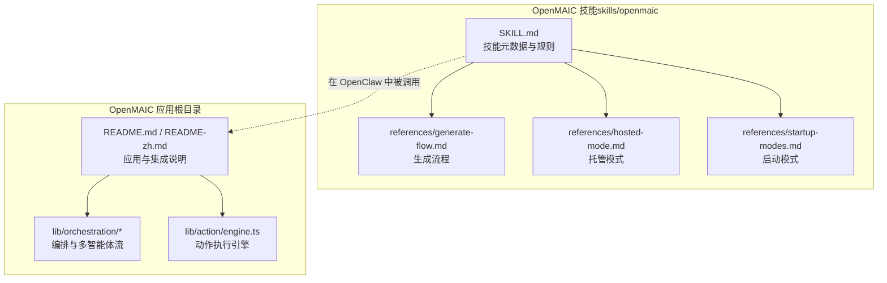
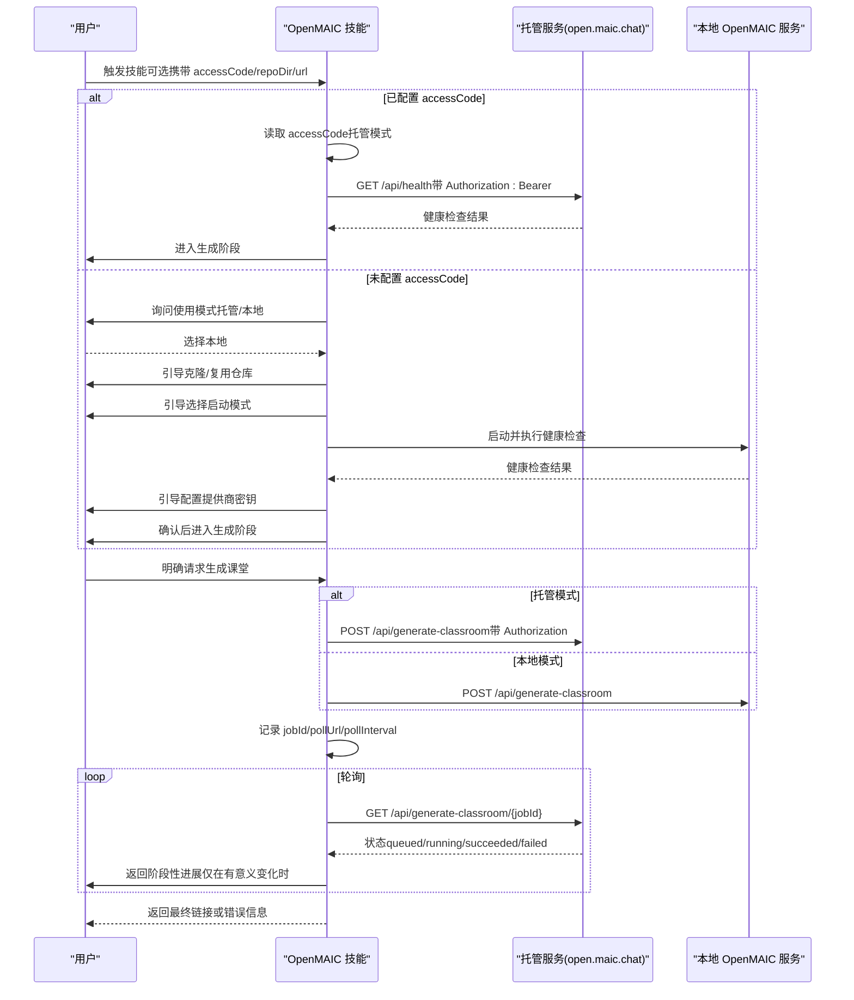
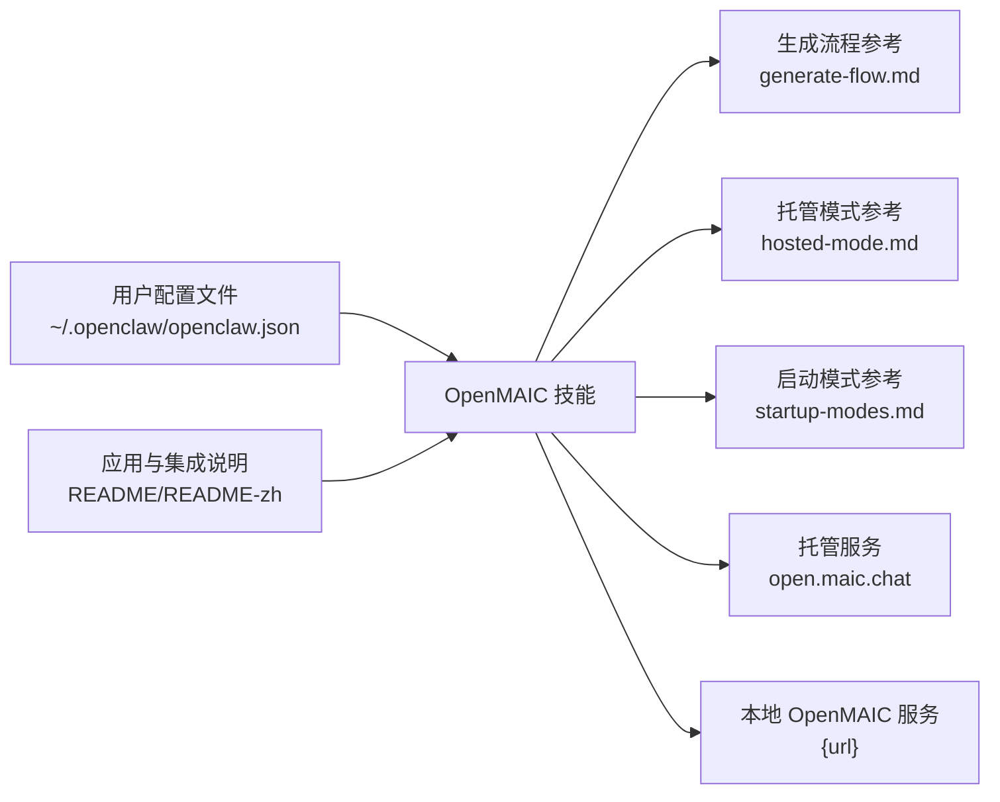

# 技能概述

<cite>
**本文引用的文件**   
- [SKILL.md](file://skills/openmaic/SKILL.md)
- [generate-flow.md](file://skills/openmaic/references/generate-flow.md)
- [hosted-mode.md](file://skills/openmaic/references/hosted-mode.md)
- [startup-modes.md](file://skills/openmaic/references/startup-modes.md)
- [README.md](file://README.md)
- [README-zh.md](file://README-zh.md)
- [engine.ts](file://lib/action/engine.ts)
- [director-graph.ts](file://lib/orchestration/director-graph.ts)
- [tool-schemas.ts](file://lib/orchestration/tool-schemas.ts)
</cite>

## 目录
1. [简介](#简介)
2. [项目结构](#项目结构)
3. [核心组件](#核心组件)
4. [架构总览](#架构总览)
5. [详细组件分析](#详细组件分析)
6. [依赖关系分析](#依赖关系分析)
7. [性能考量](#性能考量)
8. [故障排查指南](#故障排查指南)
9. [结论](#结论)
10. [附录](#附录)

## 简介
本文件为 OpenMAIC 技能在 OpenClaw 生态系统中的“技能概述”。它聚焦于以下目标：
- 解释 OpenMAIC 技能的核心功能与设计原则，阐明其在 OpenClaw 中的定位与作用。
- 详述技能的基本规则与约束，包括确认机制、状态变更要求与安全考虑。
- 说明技能的可调用性配置与元数据设置。
- 给出技能整体架构与工作流程，并对关键配置项（accessCode、repoDir、url）进行说明。
- 总结推荐使用模式与最佳实践。

## 项目结构
OpenMAIC 技能位于 skills/openmaic 目录，核心由技能元数据与一组参考文档组成；同时，OpenMAIC 应用主体位于根目录，包含前端界面、API、组件与运行时逻辑。技能在 OpenClaw 中以“受控的 SOP（标准作业程序）”形式存在，强调分阶段推进与用户确认。

**图示来源**
- [SKILL.md:1-101](file://skills/openmaic/SKILL.md#L1-L101)
- [generate-flow.md:1-143](file://skills/openmaic/references/generate-flow.md#L1-L143)
- [hosted-mode.md:1-39](file://skills/openmaic/references/hosted-mode.md#L1-L39)
- [startup-modes.md:1-70](file://skills/openmaic/references/startup-modes.md#L1-L70)
- [README.md:238-317](file://README.md#L238-L317)
- [README-zh.md:53-336](file://README-zh.md#L53-L336)
- [engine.ts:1-519](file://lib/action/engine.ts#L1-L519)
- [director-graph.ts:1-550](file://lib/orchestration/director-graph.ts#L1-L550)

**章节来源**
- [SKILL.md:1-101](file://skills/openmaic/SKILL.md#L1-L101)
- [README.md:238-317](file://README.md#L238-L317)
- [README-zh.md:53-336](file://README-zh.md#L53-L336)

## 核心组件
- 技能元数据与规则（SKILL.md）
  - 描述了技能名称、用途、是否可由用户直接调用、元数据（含 OpenClaw 侧的展示标记），并给出“核心规则”“可选技能配置”“SOP 阶段”等。
- 生成流程参考（generate-flow.md）
  - 明确生成前置条件、请求体字段、托管模式差异、轮询策略与可靠性规则、错误处理与返回格式。
- 托管模式参考（hosted-mode.md）
  - 说明 accessCode 的读取与验证、授权头、生成差异、配额与错误处理。
- 启动模式参考（startup-modes.md）
  - 列举开发、生产本地与 Docker 三种启动方式及其权衡，并给出健康检查步骤。
- 应用与集成说明（README/README-zh）
  - 展示 OpenMAIC 与 OpenClaw 的集成方式、可选配置与导出能力。
- 动作执行引擎（lib/action/engine.ts）
  - 提供统一的动作执行层，支持“一次性动作”与“同步动作”，用于白板绘制、视频播放、高亮/激光等。
- 编排与多智能体（lib/orchestration/*）
  - 通过 LangGraph 构建导演节点与生成节点，实现单/多智能体的循环编排与事件流输出。

**章节来源**
- [SKILL.md:1-101](file://skills/openmaic/SKILL.md#L1-L101)
- [generate-flow.md:1-143](file://skills/openmaic/references/generate-flow.md#L1-L143)
- [hosted-mode.md:1-39](file://skills/openmaic/references/hosted-mode.md#L1-L39)
- [startup-modes.md:1-70](file://skills/openmaic/references/startup-modes.md#L1-L70)
- [README.md:238-317](file://README.md#L238-L317)
- [README-zh.md:53-336](file://README-zh.md#L53-L336)
- [engine.ts:1-519](file://lib/action/engine.ts#L1-L519)
- [director-graph.ts:1-550](file://lib/orchestration/director-graph.ts#L1-L550)
- [tool-schemas.ts:1-69](file://lib/orchestration/tool-schemas.ts#L1-L69)

## 架构总览
OpenMAIC 技能在 OpenClaw 中扮演“引导者”角色，遵循“一次只做一步、每一步均需确认”的原则。其工作流围绕“模式选择—克隆/复用—启动与校验—配置提供商—生成课堂—轮询与结果返回”展开。托管模式与本地模式共享同一生成流程，但认证与基础 URL 存在差异。

**图示来源**
- [SKILL.md:52-101](file://skills/openmaic/SKILL.md#L52-L101)
- [generate-flow.md:3-143](file://skills/openmaic/references/generate-flow.md#L3-L143)
- [hosted-mode.md:1-39](file://skills/openmaic/references/hosted-mode.md#L1-L39)
- [startup-modes.md:1-70](file://skills/openmaic/references/startup-modes.md#L1-L70)

## 详细组件分析

### 技能元数据与可调用性配置
- 可调用性
  - 技能声明为“用户可直接调用”，表明可在 OpenClaw 中通过命令或对话直接触发。
- 元数据
  - 包含 OpenClaw 侧的展示标记（如 emoji），便于在 UI 中识别。
- 可选技能配置
  - 支持从用户配置文件中读取默认值，包括：
    - accessCode：托管模式的访问令牌。
    - repoDir：本地模式下仓库路径的默认值。
    - url：本地模式下服务地址的默认值。
  - 若配置中存在 accessCode，则默认进入托管模式，跳过模式选择阶段。

**章节来源**
- [SKILL.md:1-6](file://skills/openmaic/SKILL.md#L1-L6)
- [SKILL.md:27-50](file://skills/openmaic/SKILL.md#L27-L50)
- [README.md:290-308](file://README.md#L290-L308)
- [README-zh.md:290-308](file://README-zh.md#L290-L308)

### 核心规则与约束
- 进度控制
  - 每次只推进一个阶段；任何会产生状态变更的操作都必须先征得用户确认。
- 本地状态处理
  - 若检测到已有本地状态，应告知用户并询问是否保留。
- 供应商与模型
  - 不假设 OpenClaw 代理使用的模型/密钥会被 OpenMAIC 复用；OpenMAIC 的课堂生成完全依赖其服务器端配置文件。
  - 技能不应在请求时覆盖模型或提供商参数；仅允许服务器端配置生效。
- API 密钥输入
  - 不建议在聊天中让用户粘贴密钥；优先引导用户自行编辑本地配置文件。
- 生成阶段的确认
  - 当用户已明确表达生成意图时，在提交生成作业前不再进行二次确认。
  - 对本地 PDF 读取仍需确认。

**章节来源**
- [SKILL.md:12-26](file://skills/openmaic/SKILL.md#L12-L26)

### 生成流程与可靠性规则
- 前置条件
  - 仓库路径已确认、启动模式已选择、OpenMAIC 健康、提供商密钥已配置。
- 请求与响应
  - 生成接口为 POST {url}/api/generate-classroom，请求体支持 requirement、pdfContent、language 等字段。
  - 仅发送受支持的内容字段，不依赖请求时的模型/提供商覆盖。
- 轮询策略
  - 记录 jobId、pollUrl、pollIntervalMs；对长时间运行的任务，建议保守轮询节奏（例如约 60 秒一次）。
  - queued/running 视为进行中；仅当状态变为 succeeded 或 failed 时停止轮询。
- 可靠性与错误处理
  - 单次轮询失败不自动重启；遇到瞬时网络错误或 5xx，等待约 60 秒后重试相同 pollUrl。
  - 若一轮内轮询超时，提示用户稍后再回继续跟踪，避免重复提交。
  - 失败时返回服务器错误与 jobId；成功时使用最终轮询响应中的 classroomId 与 url。
  - 若错误指向提供商或模型配置问题，指导用户修改服务器端配置文件而非尝试运行时覆盖。

**章节来源**
- [generate-flow.md:3-143](file://skills/openmaic/references/generate-flow.md#L3-L143)

### 托管模式与本地模式差异
- 托管模式
  - 从技能配置读取 accessCode，直接使用托管服务的健康检查与生成接口。
  - 所有请求需携带 Authorization: Bearer <access-code>。
  - 基础 URL 固定为托管域名，不可配置；返回的课堂链接为托管域名下的链接。
  - 存在每日配额限制，失败时按状态码给出相应指引。
- 本地模式
  - 使用本地 repoDir 与 url 作为默认值；仍需用户确认后执行。
  - 健康检查使用本地服务地址；生成接口与托管一致，但无 Authorization 头。
  - 课堂链接为本地服务地址。

**章节来源**
- [hosted-mode.md:1-39](file://skills/openmaic/references/hosted-mode.md#L1-L39)
- [startup-modes.md:56-64](file://skills/openmaic/references/startup-modes.md#L56-L64)
- [SKILL.md:48-50](file://skills/openmaic/SKILL.md#L48-L50)

### 动作执行与编排（与技能协作）
- 动作执行引擎
  - 提供统一的动作执行层，区分“一次性动作”（如 spotlight、laser）与“同步动作”（如 speech、play_video、wb_* 白板操作）。
  - 在白板相关动作前确保白板打开，保证用户体验一致性。
- 编排与多智能体
  - 通过 LangGraph 的导演节点与生成节点，实现单/多智能体的循环编排。
  - 生成节点负责解析模型输出、过滤允许的动作、按顺序输出文本与动作事件。
  - 动作描述与有效性过滤由工具 Schema 提供，确保在非幻灯片场景下移除仅限幻灯片的动作。

这些组件虽然不是技能的直接实现，但与技能在 OpenMAIC 应用内的整体运行密切相关，有助于理解技能如何与应用的渲染与交互层协同工作。

**章节来源**
- [engine.ts:1-519](file://lib/action/engine.ts#L1-L519)
- [director-graph.ts:1-550](file://lib/orchestration/director-graph.ts#L1-L550)
- [tool-schemas.ts:1-69](file://lib/orchestration/tool-schemas.ts#L1-L69)

## 依赖关系分析
- 技能对外部系统的依赖
  - 托管模式依赖 open.maic.chat 的健康检查与生成接口，并需要 accessCode 进行鉴权。
  - 本地模式依赖本地 OpenMAIC 服务的健康检查与生成接口，使用本地 url 与 repoDir。
- 技能内部依赖
  - 生成流程依赖参考文档（generate-flow.md）与托管/本地模式文档（hosted-mode.md、startup-modes.md）。
  - 技能配置（accessCode/repoDir/url）来自用户配置文件，影响模式选择与默认行为。
- 与应用主体的耦合
  - README/README-zh 展示了 OpenMAIC 与 OpenClaw 的集成方式与可选配置，技能遵循其约定。

**图示来源**
- [SKILL.md:27-50](file://skills/openmaic/SKILL.md#L27-L50)
- [generate-flow.md:1-143](file://skills/openmaic/references/generate-flow.md#L1-L143)
- [hosted-mode.md:1-39](file://skills/openmaic/references/hosted-mode.md#L1-L39)
- [startup-modes.md:1-70](file://skills/openmaic/references/startup-modes.md#L1-L70)
- [README.md:238-317](file://README.md#L238-L317)
- [README-zh.md:53-336](file://README-zh.md#L53-L336)

**章节来源**
- [SKILL.md:27-50](file://skills/openmaic/SKILL.md#L27-L50)
- [README.md:238-317](file://README.md#L238-L317)
- [README-zh.md:53-336](file://README-zh.md#L53-L336)

## 性能考量
- 轮询节律
  - 对长时间运行的生成任务，建议保守轮询节奏（例如约 60 秒一次），以降低请求压力并避免超出代理回合限制。
- 资源占用
  - 生成任务可能涉及大体量内容处理，建议在单轮内限制主动轮询时间窗口（例如约 10 分钟），结束后提示用户后续回查。
- 错误恢复
  - 单次轮询失败不自动重启；遇到瞬时网络错误或 5xx，等待约 60 秒后重试相同 pollUrl，避免频繁重试导致资源浪费。

**章节来源**
- [generate-flow.md:70-96](file://skills/openmaic/references/generate-flow.md#L70-L96)

## 故障排查指南
- 托管模式
  - 401 无效访问码：提示用户检查或重新生成 accessCode，并更新配置文件。
  - 403 额度耗尽：告知每日限额（10 次），建议次日再试。
  - 500 服务器错误：建议稍后重试或切换至本地模式。
- 生成失败
  - 返回服务器错误与 jobId；若错误指向提供商或模型配置问题，指导用户修改服务器端配置文件（如 .env.local 或 server-providers.yml），而非尝试运行时覆盖。
- 本地模式
  - 健康检查失败：检查本地服务是否正常启动、端口与 url 是否正确、防火墙与网络连通性。

**章节来源**
- [hosted-mode.md:32-39](file://skills/openmaic/references/hosted-mode.md#L32-L39)
- [generate-flow.md:86-138](file://skills/openmaic/references/generate-flow.md#L86-L138)

## 结论
OpenMAIC 技能在 OpenClaw 中承担“受控引导者”的职责：以“一次一阶段、每步必确认”的方式，帮助用户完成从模式选择、本地部署到课堂生成的全流程。其设计强调安全性（不依赖请求时覆盖）、可维护性（仅服务器端配置生效）与可靠性（保守轮询与稳健错误处理）。通过合理的配置项（accessCode、repoDir、url）与清晰的 SOP 文档，技能能够在托管与本地两种模式下稳定地驱动 OpenMAIC 的课堂生成。

## 附录

### 技能配置项详解
- accessCode
  - 作用：托管模式的访问令牌，用于 open.maic.chat 的鉴权。
  - 位置：技能配置文件中 skills.entries.openmaic.config.accessCode。
  - 行为：若存在，技能默认进入托管模式，跳过模式选择阶段。
- repoDir
  - 作用：本地模式下仓库路径的默认值。
  - 行为：仅作为默认值；实际操作仍需用户确认。
- url
  - 作用：本地模式下服务地址的默认值。
  - 行为：仅作为默认值；实际操作仍需用户确认。

**章节来源**
- [SKILL.md:27-50](file://skills/openmaic/SKILL.md#L27-L50)
- [README.md:290-308](file://README.md#L290-L308)
- [README-zh.md:290-308](file://README-zh.md#L290-L308)

### 推荐使用模式与最佳实践
- 快速起步（托管模式）
  - 在配置文件中写入 accessCode，直接进入生成阶段，无需本地部署。
- 首次部署（本地模式）
  - 选择开发模式（pnpm dev）以获得最快反馈；随后根据需求切换生产本地或 Docker。
- 配置提供商
  - 优先编辑服务器端配置文件（如 .env.local 或 server-providers.yml），避免在聊天中粘贴密钥。
- 生成课堂
  - 明确表达生成意图后，技能将直接提交作业并进入轮询；若一轮内无法完成，提示用户稍后再回继续跟踪。
- 错误处理
  - 将错误归因于服务器端配置问题时，指导用户修正配置文件后再试。

**章节来源**
- [startup-modes.md:1-70](file://skills/openmaic/references/startup-modes.md#L1-L70)
- [SKILL.md:12-26](file://skills/openmaic/SKILL.md#L12-L26)
- [generate-flow.md:70-138](file://skills/openmaic/references/generate-flow.md#L70-L138)