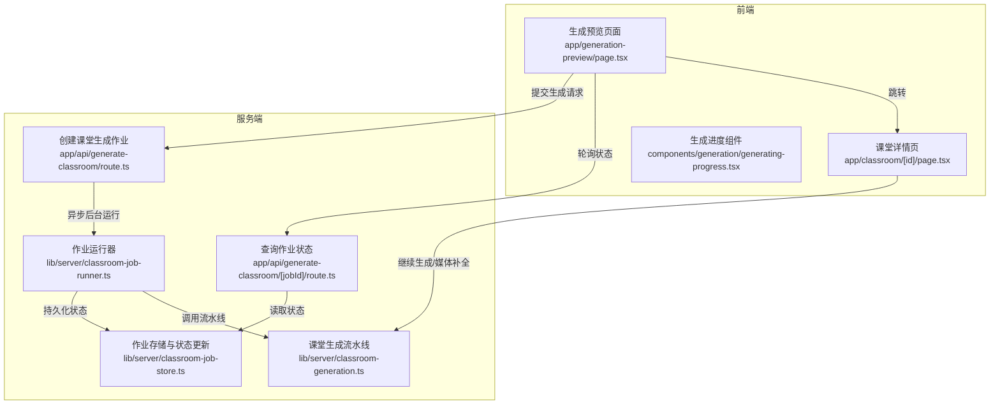
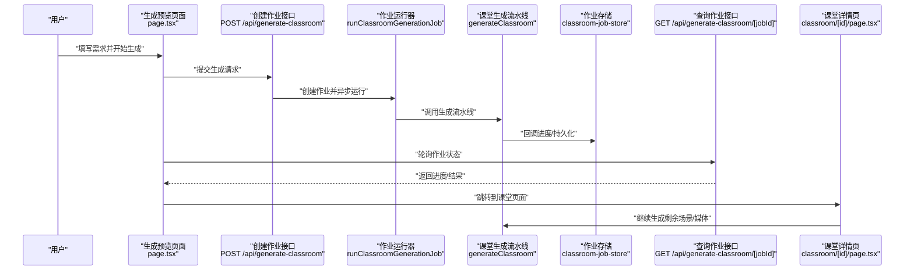
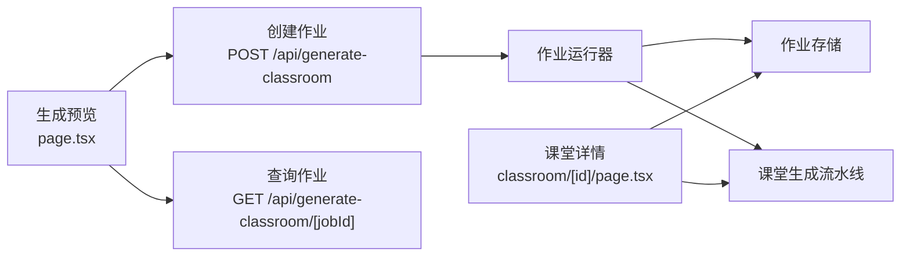
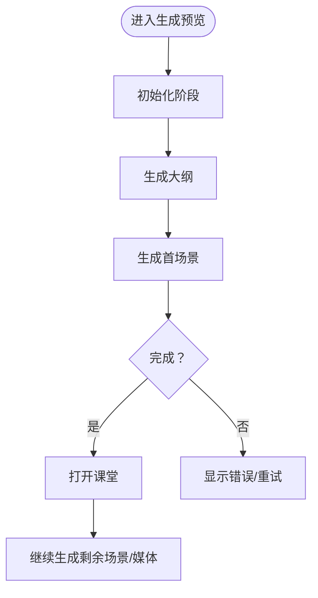

# 生成工作流

<cite>
**本文引用的文件**
- [app/api/generate-classroom/route.ts](file://app/api/generate-classroom/route.ts)
- [app/api/generate-classroom/[jobId]/route.ts](file://app/api/generate-classroom/[jobId]/route.ts)
- [lib/server/classroom-job-store.ts](file://lib/server/classroom-job-store.ts)
- [lib/server/classroom-job-runner.ts](file://lib/server/classroom-job-runner.ts)
- [lib/server/classroom-generation.ts](file://lib/server/classroom-generation.ts)
- [lib/types/generation.ts](file://lib/types/generation.ts)
- [app/generation-preview/page.tsx](file://app/generation-preview/page.tsx)
- [app/classroom/[id]/page.tsx](file://app/classroom/[id]/page.tsx)
- [components/generation/generating-progress.tsx](file://components/generation/generating-progress.tsx)
</cite>

## 目录
1. [简介](#简介)
2. [项目结构](#项目结构)
3. [核心组件](#核心组件)
4. [架构总览](#架构总览)
5. [详细组件分析](#详细组件分析)
6. [依赖关系分析](#依赖关系分析)
7. [性能考量](#性能考量)
8. [故障排查指南](#故障排查指南)
9. [结论](#结论)
10. [附录](#附录)

## 简介
本文件系统性阐述“课堂生成工作流”的完整自动化流程，覆盖从聊天输入到课堂生成与交付的全过程：需求分析、参数提取、作业提交、状态轮询与可视化监控、长作业处理与重试、错误处理与恢复、以及生成完成后的结果交付与链接分享。文档同时给出生成请求的参数配置与字段说明、进度可视化组件、以及性能优化与批量生成最佳实践。

## 项目结构
该工作流由前端预览页面、服务端生成接口、作业存储与运行器、以及课堂展示页面构成。前端负责收集用户输入、触发生成、展示进度；后端以异步作业形式执行长耗时任务，并通过轮询接口返回状态；最终在课堂页面呈现生成内容。

图表来源
- [app/generation-preview/page.tsx:129-735](file://app/generation-preview/page.tsx#L129-L735)
- [app/api/generate-classroom/route.ts:11-51](file://app/api/generate-classroom/route.ts#L11-L51)
- [app/api/generate-classroom/[jobId]/route.ts:11-48](file://app/api/generate-classroom/[jobId]/route.ts#L11-L48)
- [lib/server/classroom-job-store.ts:102-226](file://lib/server/classroom-job-store.ts#L102-L226)
- [lib/server/classroom-job-runner.ts:13-50](file://lib/server/classroom-job-runner.ts#L13-L50)
- [lib/server/classroom-generation.ts:86-264](file://lib/server/classroom-generation.ts#L86-L264)
- [app/classroom/[id]/page.tsx:34-145](file://app/classroom/[id]/page.tsx#L34-L145)

章节来源
- [app/generation-preview/page.tsx:129-735](file://app/generation-preview/page.tsx#L129-L735)
- [app/api/generate-classroom/route.ts:11-51](file://app/api/generate-classroom/route.ts#L11-L51)
- [app/api/generate-classroom/[jobId]/route.ts:11-48](file://app/api/generate-classroom/[jobId]/route.ts#L11-L48)
- [lib/server/classroom-job-store.ts:102-226](file://lib/server/classroom-job-store.ts#L102-L226)
- [lib/server/classroom-job-runner.ts:13-50](file://lib/server/classroom-job-runner.ts#L13-L50)
- [lib/server/classroom-generation.ts:86-264](file://lib/server/classroom-generation.ts#L86-L264)
- [app/classroom/[id]/page.tsx:34-145](file://app/classroom/[id]/page.tsx#L34-L145)

## 核心组件
- 生成请求入口（创建作业）
  - 负责校验必填字段、构建作业、立即返回202 Accepted并启动后台运行。
  - 关键点：使用 after 钩子在当前请求结束后异步执行作业，避免阻塞响应。
- 作业状态查询
  - 提供轮询接口，返回当前状态、进度、场景计数、结果链接等。
- 作业存储与状态机
  - 定义作业状态、步骤、进度、错误信息、结果等字段；提供原子写入与过期检测。
- 作业运行器
  - 将作业标记为 running，调用生成流水线，回调进度并持久化，最终成功或失败标记。
- 课堂生成流水线
  - 解析语言模型与密钥、生成大纲、逐场景生成内容与动作、持久化课堂数据并返回结果。
- 前端生成预览与课堂页面
  - 预览页负责触发生成、展示进度、跳转课堂；课堂页负责继续生成剩余场景与媒体补全。
- 进度可视化组件
  - 展示大纲生成、首页生成等里程碑状态与加载动画、错误提示。

章节来源
- [app/api/generate-classroom/route.ts:11-51](file://app/api/generate-classroom/route.ts#L11-L51)
- [app/api/generate-classroom/[jobId]/route.ts:11-48](file://app/api/generate-classroom/[jobId]/route.ts#L11-L48)
- [lib/server/classroom-job-store.ts:17-42](file://lib/server/classroom-job-store.ts#L17-L42)
- [lib/server/classroom-job-runner.ts:13-50](file://lib/server/classroom-job-runner.ts#L13-L50)
- [lib/server/classroom-generation.ts:25-53](file://lib/server/classroom-generation.ts#L25-L53)
- [app/generation-preview/page.tsx:129-735](file://app/generation-preview/page.tsx#L129-L735)
- [app/classroom/[id]/page.tsx:34-145](file://app/classroom/[id]/page.tsx#L34-L145)
- [components/generation/generating-progress.tsx:15-140](file://components/generation/generating-progress.tsx#L15-L140)

## 架构总览
下图展示了从用户提交到课堂生成与交付的关键交互路径。

图表来源
- [app/generation-preview/page.tsx:129-735](file://app/generation-preview/page.tsx#L129-L735)
- [app/api/generate-classroom/route.ts:11-51](file://app/api/generate-classroom/route.ts#L11-L51)
- [app/api/generate-classroom/[jobId]/route.ts:11-48](file://app/api/generate-classroom/[jobId]/route.ts#L11-L48)
- [lib/server/classroom-job-store.ts:102-226](file://lib/server/classroom-job-store.ts#L102-L226)
- [lib/server/classroom-job-runner.ts:13-50](file://lib/server/classroom-job-runner.ts#L13-L50)
- [lib/server/classroom-generation.ts:86-264](file://lib/server/classroom-generation.ts#L86-L264)
- [app/classroom/[id]/page.tsx:34-145](file://app/classroom/[id]/page.tsx#L34-L145)

## 详细组件分析

### 生成请求与参数配置
- 请求方法与路由
  - 创建作业：POST /api/generate-classroom
  - 查询作业：GET /api/generate-classroom/[jobId]
- 必填字段与可选字段
  - 必填：requirement（课程需求文本）
  - 可选：language（语言）、pdfContent（PDF 文本与图片列表）
- 返回字段（创建作业）
  - jobId、status、step、message、pollUrl、pollIntervalMs（固定 5000ms）
- 返回字段（查询作业）
  - jobId、status、step、progress、message、pollUrl、pollIntervalMs、scenesGenerated、totalScenes、result、error、done

章节来源
- [app/api/generate-classroom/route.ts:11-51](file://app/api/generate-classroom/route.ts#L11-L51)
- [app/api/generate-classroom/[jobId]/route.ts:11-48](file://app/api/generate-classroom/[jobId]/route.ts#L11-L48)
- [lib/server/classroom-generation.ts:25-29](file://lib/server/classroom-generation.ts#L25-L29)

### 作业状态与持久化
- 状态机
  - queued → running → succeeded 或 failed
  - 支持 step：initializing、generating_outlines、generating_scenes、persisting、completed
- 进度字段
  - progress（百分比）、message（状态描述）、scenesGenerated、totalScenes
- 错误与结果
  - error 字段记录失败原因；result 包含 classroomId、url、scenesCount
- 原子更新与锁
  - 使用 per-job mutex 序列化读改写，避免并发冲突
- 过期检测
  - 若 running 超过 30 分钟无更新，标记为 stale 并失败

章节来源
- [lib/server/classroom-job-store.ts:15-42](file://lib/server/classroom-job-store.ts#L15-L42)
- [lib/server/classroom-job-store.ts:78-96](file://lib/server/classroom-job-store.ts#L78-L96)
- [lib/server/classroom-job-store.ts:102-226](file://lib/server/classroom-job-store.ts#L102-L226)

### 作业运行器与流水线
- 运行器职责
  - 标记作业为 running
  - 调用 generateClassroom 并传入 onProgress 回调
  - 成功则 markClassroomGenerationJobSucceeded，失败则 markClassroomGenerationJobFailed
- 流水线职责
  - 解析模型与密钥（fail-fast 检查）
  - 生成大纲、逐场景生成内容与动作、持久化课堂
  - 回调进度：初始化、生成大纲、生成场景、持久化、完成
- 结果交付
  - 返回 classroom id、url、stage、scenes、createdAt

章节来源
- [lib/server/classroom-job-runner.ts:13-50](file://lib/server/classroom-job-runner.ts#L13-L50)
- [lib/server/classroom-generation.ts:86-264](file://lib/server/classroom-generation.ts#L86-L264)

### 前端生成预览与课堂页面
- 生成预览
  - 触发生成、解析 PDF、网络搜索、生成代理、生成大纲（SSE）、生成首场景内容与动作、TTS、导航至课堂
  - 存储 generationParams 以便课堂页继续生成
- 课堂页面
  - 加载课堂数据（本地或服务端），自动恢复未完成场景与媒体生成
  - 提供重试单个场景的能力

章节来源
- [app/generation-preview/page.tsx:129-735](file://app/generation-preview/page.tsx#L129-L735)
- [app/classroom/[id]/page.tsx:34-145](file://app/classroom/[id]/page.tsx#L34-L145)

### 进度可视化与用户反馈
- 组件功能
  - 展示“大纲就绪”“首页就绪”两个里程碑状态
  - 加载中显示动态点号，错误时显示错误卡片
  - 根据状态切换图标与文案
- 适用场景
  - 生成预览阶段：展示大纲与首场景生成进度
  - 课堂阶段：展示剩余场景与媒体生成进度

章节来源
- [components/generation/generating-progress.tsx:15-140](file://components/generation/generating-progress.tsx#L15-L140)

## 依赖关系分析
- 组件耦合
  - 生成预览页依赖多个 API（PDF 解析、网络搜索、大纲生成、内容与动作生成、TTS）与本地存储
  - 课堂页依赖本地存储与媒体生成补全
  - 作业相关 API 依赖作业存储与运行器
- 外部依赖
  - LLM 调用、模型解析与密钥解析
  - 文件存储（PDF、图片、音频）

图表来源
- [app/generation-preview/page.tsx:129-735](file://app/generation-preview/page.tsx#L129-L735)
- [app/api/generate-classroom/route.ts:11-51](file://app/api/generate-classroom/route.ts#L11-L51)
- [app/api/generate-classroom/[jobId]/route.ts:11-48](file://app/api/generate-classroom/[jobId]/route.ts#L11-L48)
- [lib/server/classroom-job-store.ts:102-226](file://lib/server/classroom-job-store.ts#L102-L226)
- [lib/server/classroom-job-runner.ts:13-50](file://lib/server/classroom-job-runner.ts#L13-L50)
- [lib/server/classroom-generation.ts:86-264](file://lib/server/classroom-generation.ts#L86-L264)
- [app/classroom/[id]/page.tsx:34-145](file://app/classroom/[id]/page.tsx#L34-L145)

## 性能考量
- 异步作业与非阻塞
  - 创建作业即返回 202，后台异步运行，避免超时与阻塞
- 轮询间隔
  - 固定 5 秒轮询一次，平衡实时性与服务器压力
- 进度回调与增量更新
  - 流水线按场景推进进度，前端可及时感知
- 原子写入与锁
  - 避免并发写导致的状态不一致
- 过期检测
  - 30 分钟无更新自动标记失败，防止僵尸作业占用资源
- 批量生成建议
  - 控制并发作业数量，优先级队列调度
  - 合理拆分需求，减少单次生成场景数
  - 利用缓存与复用（如已生成的场景、媒体）

[本节为通用性能建议，无需特定文件引用]

## 故障排查指南
- 常见错误与定位
  - 缺少必填字段：创建作业时校验 requirement
  - 无效作业 ID：查询作业前校验 jobId 格式
  - 作业不存在：读取作业返回 404
  - 作业过期：running 超时被标记为 failed
  - 生成失败：查看作业 error 字段与日志
- 重试策略
  - 对于可恢复的网络错误，前端可重新发起轮询或重试对应步骤
  - 课堂页面支持重试单个场景
- 日志与可观测性
  - 服务端记录作业状态变化与错误
  - 前端记录生成过程与异常

章节来源
- [app/api/generate-classroom/route.ts:21-23](file://app/api/generate-classroom/route.ts#L21-L23)
- [app/api/generate-classroom/[jobId]/route.ts:15-22](file://app/api/generate-classroom/[jobId]/route.ts#L15-L22)
- [lib/server/classroom-job-store.ts:81-96](file://lib/server/classroom-job-store.ts#L81-L96)
- [lib/server/classroom-job-runner.ts:35-42](file://lib/server/classroom-job-runner.ts#L35-L42)
- [app/classroom/[id]/page.tsx:100-145](file://app/classroom/[id]/page.tsx#L100-L145)

## 结论
该工作流通过“请求-作业-运行器-流水线-状态查询-课堂展示”的闭环设计，实现了从需求输入到课堂交付的自动化与可观测性。前端负责交互与进度反馈，后端以异步作业承载长耗时任务并提供稳定的状态查询能力。结合进度可视化与错误处理机制，既保证了用户体验，也便于运维与扩展。

[本节为总结性内容，无需特定文件引用]

## 附录

### 生成请求参数说明
- requirement（必填）
  - 类型：字符串
  - 描述：课程需求文本，包含主题、目标、风格等全部要求
- language（可选）
  - 类型：枚举 'zh-CN' | 'en-US'
  - 默认：'zh-CN'
- pdfContent（可选）
  - 类型：对象
  - 字段：
    - text：字符串，PDF 文本
    - images：字符串数组，PDF 提取的图片 URL 列表

章节来源
- [lib/server/classroom-generation.ts:25-29](file://lib/server/classroom-generation.ts#L25-L29)
- [lib/types/generation.ts:65-71](file://lib/types/generation.ts#L65-L71)

### 作业状态字段说明
- status：作业状态（queued/running/succeeded/failed）
- step：当前步骤（initializing/generating_outlines/generating_scenes/persisting/completed）
- progress：整体进度百分比（0-100）
- message：状态描述
- scenesGenerated：已生成场景数
- totalScenes：总场景数（可选）
- result：成功时返回的课堂结果（id/url/scenesCount）
- error：失败时的错误信息
- done：是否结束（status 为 succeeded 或 failed）

章节来源
- [lib/server/classroom-job-store.ts:17-42](file://lib/server/classroom-job-store.ts#L17-L42)
- [app/api/generate-classroom/[jobId]/route.ts:26-39](file://app/api/generate-classroom/[jobId]/route.ts#L26-L39)

### 生成进度可视化流程

图表来源
- [components/generation/generating-progress.tsx:15-140](file://components/generation/generating-progress.tsx#L15-L140)
- [app/generation-preview/page.tsx:129-735](file://app/generation-preview/page.tsx#L129-L735)