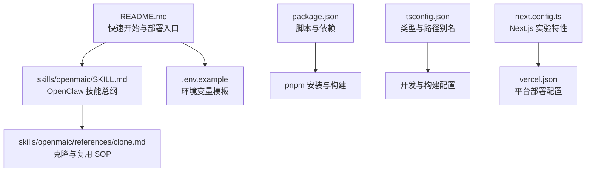
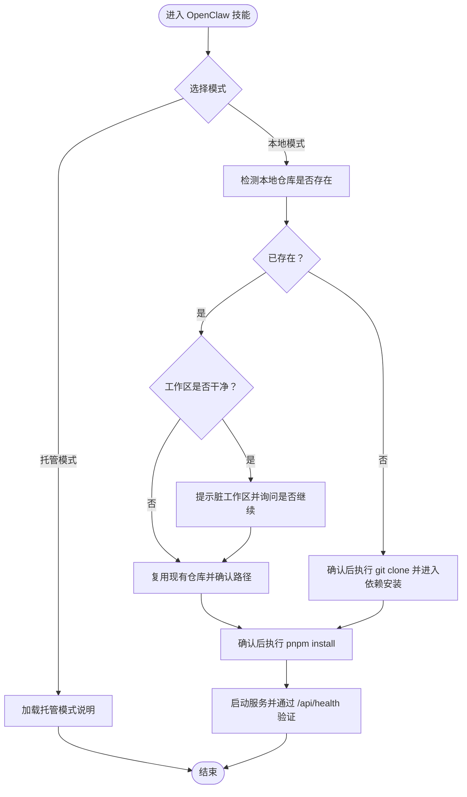
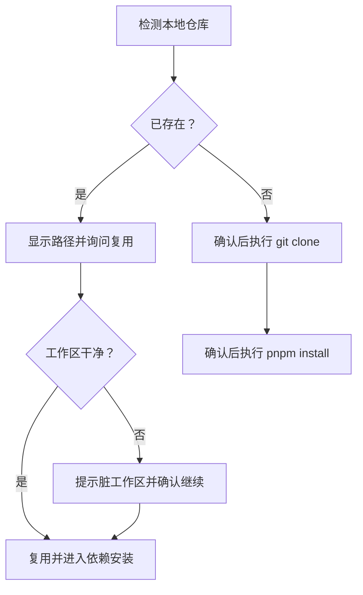
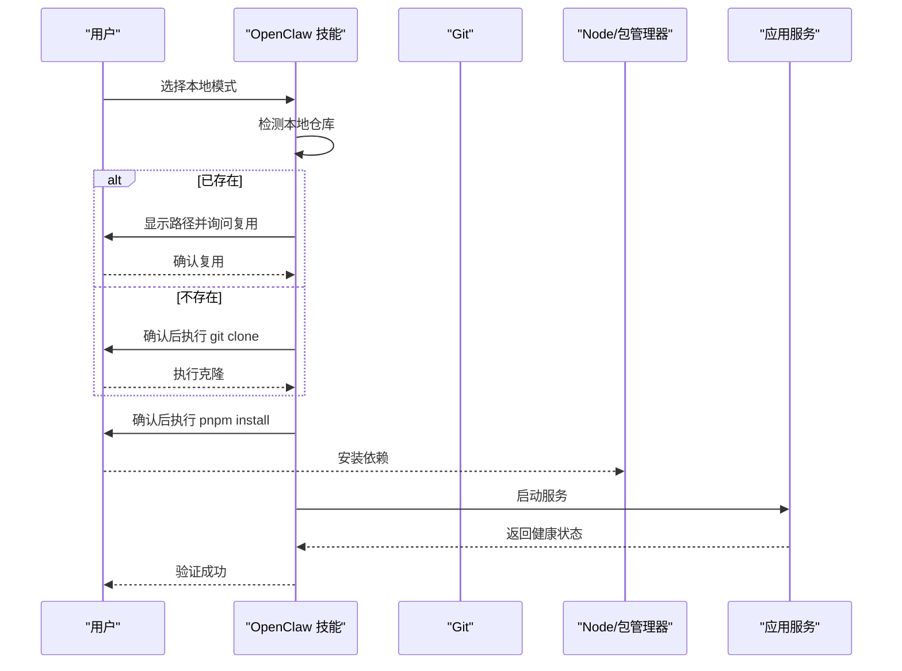
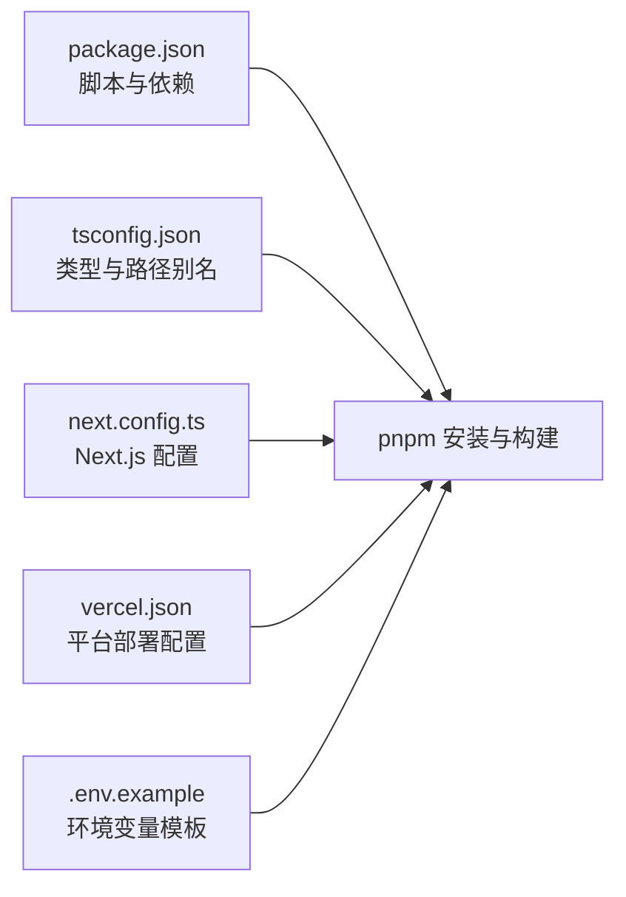

# 仓库克隆

<cite>
**本文引用的文件**
- [README.md](file://README.md)
- [README-zh.md](file://README-zh.md)
- [SKILL.md](file://skills/openmaic/SKILL.md)
- [clone.md](file://skills/openmaic/references/clone.md)
- [health/route.ts](file://app/api/health/route.ts)
- [.env.example](file://.env.example)
- [package.json](file://package.json)
- [tsconfig.json](file://tsconfig.json)
- [next.config.ts](file://next.config.ts)
- [vercel.json](file://vercel.json)
</cite>

## 目录
1. [简介](#简介)
2. [项目结构](#项目结构)
3. [核心组件](#核心组件)
4. [架构总览](#架构总览)
5. [详细组件分析](#详细组件分析)
6. [依赖关系分析](#依赖关系分析)
7. [性能考虑](#性能考虑)
8. [故障排查指南](#故障排查指南)
9. [结论](#结论)
10. [附录](#附录)

## 简介
本章节面向首次接触 OpenMAIC 的用户与集成者，系统性阐述“仓库克隆”阶段的完整流程与最佳实践。内容覆盖：
- 远程仓库地址、分支策略与本地路径配置
- 现有仓库检测与重复安装处理
- 多种克隆方式（HTTPS 与 SSH）的操作指南
- 克隆过程中的错误处理与网络问题解决方案
- 权限配置、代理设置与镜像源配置
- 克隆完成后验证与目录结构说明

本指南严格基于仓库内现有文档与脚本，确保可操作性与准确性。

## 项目结构
OpenMAIC 采用 Next.js 应用结构，结合多包工作区与技能化引导（OpenClaw）。与“仓库克隆”直接相关的关键位置如下：
- 快速开始与克隆命令：位于根级 README 中
- OpenClaw 技能与克隆 SOP：位于 skills/openmaic 及其 references 子目录
- 依赖安装与构建配置：位于 package.json、tsconfig.json、next.config.ts、vercel.json
- 环境变量模板：位于 .env.example

**图示来源**
- [README.md:73-125](file://README.md#L73-L125)
- [SKILL.md:52-92](file://skills/openmaic/SKILL.md#L52-L92)
- [clone.md:1-39](file://skills/openmaic/references/clone.md#L1-L39)
- [.env.example:1-124](file://.env.example#L1-L124)
- [package.json:1-124](file://package.json#L1-L124)
- [tsconfig.json:1-35](file://tsconfig.json#L1-L35)
- [next.config.ts:1-13](file://next.config.ts#L1-L13)
- [vercel.json:1-15](file://vercel.json#L1-L15)

**章节来源**
- [README.md:73-125](file://README.md#L73-L125)
- [README-zh.md:372-426](file://README-zh.md#L372-L426)
- [SKILL.md:52-92](file://skills/openmaic/SKILL.md#L52-L92)
- [clone.md:1-39](file://skills/openmaic/references/clone.md#L1-L39)
- [package.json:1-124](file://package.json#L1-L124)
- [tsconfig.json:1-35](file://tsconfig.json#L1-L35)
- [next.config.ts:1-13](file://next.config.ts#L1-L13)
- [vercel.json:1-15](file://vercel.json#L1-L15)

## 核心组件
- 远程仓库与默认分支
  - 默认使用主分支（main），克隆命令指向官方仓库地址。
  - 若需特定分支或自建私有仓库，请在确认后调整命令参数。
- 本地路径与复用策略
  - 若本地已存在目标仓库，优先复用；若工作区不干净（dirty），提示用户确认是否继续。
  - 若不存在，则引导用户确认后执行克隆，并单独确认依赖安装步骤。
- 依赖安装与构建
  - 使用 pnpm 进行安装与构建；根脚本与工作区包均参与构建流程。
- 健康检查与启动验证
  - 通过健康接口返回状态与版本信息，作为启动后验证的依据。

**章节来源**
- [README.md:80-86](file://README.md#L80-L86)
- [clone.md:9-17](file://skills/openmaic/references/clone.md#L9-L17)
- [clone.md:34-38](file://skills/openmaic/references/clone.md#L34-L38)
- [package.json:6-14](file://package.json#L6-L14)
- [health/route.ts:1-8](file://app/api/health/route.ts#L1-L8)

## 架构总览
下图展示从“选择模式”到“克隆与复用”的整体流程，以及后续的依赖安装与验证步骤。

**图示来源**
- [SKILL.md:54-92](file://skills/openmaic/SKILL.md#L54-L92)
- [clone.md:7-17](file://skills/openmaic/references/clone.md#L7-L17)
- [health/route.ts:1-8](file://app/api/health/route.ts#L1-L8)

## 详细组件分析

### 组件一：远程仓库地址与分支策略
- 默认远程地址与分支
  - 官方仓库地址与默认分支在快速开始与 OpenClaw 技能中均有体现，建议遵循默认 main 分支进行克隆。
- 自定义分支与私有仓库
  - 若需指定分支或使用私有仓库，请在确认后修改克隆命令参数；保持与后续依赖安装与配置一致。

**章节来源**
- [README.md:80-86](file://README.md#L80-L86)
- [SKILL.md:56-64](file://skills/openmaic/SKILL.md#L56-L64)

### 组件二：现有仓库检测与重复安装处理
- 检测逻辑
  - 在本地模式下，先检查目标路径是否存在 OpenMAIC 仓库；若存在则显示路径并询问是否复用。
- 脏工作区处理
  - 若工作区未清理（存在未提交更改），提示用户确认是否继续使用该仓库，避免潜在冲突。
- 重复安装
  - 若决定复用，跳过克隆步骤，直接进入依赖安装确认；若重新克隆，按流程再次确认安装。

**图示来源**
- [clone.md:9-17](file://skills/openmaic/references/clone.md#L9-L17)
- [clone.md:34-38](file://skills/openmaic/references/clone.md#L34-L38)

**章节来源**
- [clone.md:9-17](file://skills/openmaic/references/clone.md#L9-L17)
- [clone.md:34-38](file://skills/openmaic/references/clone.md#L34-L38)

### 组件三：多种克隆方式（HTTPS 与 SSH）
- HTTPS 克隆
  - 使用官方 HTTPS 地址进行克隆，适合大多数用户与 CI 环境。
- SSH 克隆
  - 若已配置 SSH 密钥，可改用 SSH 地址进行克隆；注意确保本地已添加并授权相应密钥。
- 分支与路径
  - 如需指定分支或自定义本地路径，请在确认后调整克隆命令参数。

**章节来源**
- [README.md:80-86](file://README.md#L80-L86)
- [SKILL.md:56-64](file://skills/openmaic/SKILL.md#L56-L64)

### 组件四：克隆过程中的错误处理与网络问题
- 常见问题
  - 网络超时、认证失败、权限不足、代理限制等。
- 处理建议
  - 使用稳定网络重试；检查凭据与权限；必要时配置代理或更换镜像源；对私有仓库确保密钥有效。
- 重复安装与回退
  - 若克隆失败，清理临时目录后重新确认克隆；如需复用仓库，确保工作区干净后再继续。

**章节来源**
- [clone.md:34-38](file://skills/openmaic/references/clone.md#L34-L38)

### 组件五：权限配置、代理设置与镜像源
- 权限与凭据
  - HTTPS 克隆需正确填写凭据；SSH 克隆需确保本地密钥已添加并授权。
- 代理设置
  - 可通过环境变量配置 HTTP/HTTPS 代理；在代理受限环境中优先使用受信任代理。
- 镜像源
  - 在网络不稳定时可考虑使用镜像源；请在确认后替换默认地址并重试。

**章节来源**
- [.env.example:110-114](file://.env.example#L110-L114)

### 组件六：克隆完成后的验证与目录结构
- 启动与健康检查
  - 安装完成后启动服务，并通过健康接口获取状态与版本信息，确认服务可用。
- 目录结构
  - 克隆后应包含 app、lib、components、configs、public、skills 等顶层目录；具体以 README 的项目结构说明为准。

**图示来源**
- [SKILL.md:84-86](file://skills/openmaic/SKILL.md#L84-L86)
- [health/route.ts:1-8](file://app/api/health/route.ts#L1-L8)

**章节来源**
- [README-zh.md:372-426](file://README-zh.md#L372-L426)
- [health/route.ts:1-8](file://app/api/health/route.ts#L1-L8)

## 依赖关系分析
- 包管理与构建
  - 使用 pnpm 作为包管理器，根脚本负责安装与构建；工作区子包参与构建流程。
- 开发与运行时配置
  - tsconfig.json 提供路径别名与严格类型检查；next.config.ts 配置实验特性与外部包；vercel.json 定义部署行为。
- 环境变量
  - .env.example 提供各类提供商与功能的配置项模板，便于在本地或部署环境中按需启用。

**图示来源**
- [package.json:6-14](file://package.json#L6-L14)
- [tsconfig.json:1-35](file://tsconfig.json#L1-L35)
- [next.config.ts:1-13](file://next.config.ts#L1-L13)
- [vercel.json:1-15](file://vercel.json#L1-L15)
- [.env.example:1-124](file://.env.example#L1-L124)

**章节来源**
- [package.json:6-14](file://package.json#L6-L14)
- [tsconfig.json:1-35](file://tsconfig.json#L1-L35)
- [next.config.ts:1-13](file://next.config.ts#L1-L13)
- [vercel.json:1-15](file://vercel.json#L1-L15)
- [.env.example:1-124](file://.env.example#L1-L124)

## 性能考虑
- 克隆速度
  - 优先使用稳定网络与直连源；在带宽受限环境下可考虑镜像源。
- 依赖安装
  - 使用 pnpm 的高效缓存与去重能力；避免同时运行多个大型构建任务。
- 启动验证
  - 健康检查轻量且快速，适合作为启动后的即时验证手段。

## 故障排查指南
- 克隆失败
  - 检查网络连通性与代理设置；确认凭据或密钥有效性；必要时更换镜像源重试。
- 工作区脏状态
  - 若存在未提交更改，根据提示清理或确认继续；避免后续安装与构建冲突。
- 依赖安装异常
  - 清理缓存后重试；检查 pnpm 版本与 Node 版本要求；确保磁盘空间充足。
- 健康检查失败
  - 查看服务日志与环境变量配置；确认端口占用与防火墙设置。

**章节来源**
- [clone.md:34-38](file://skills/openmaic/references/clone.md#L34-L38)
- [health/route.ts:1-8](file://app/api/health/route.ts#L1-L8)

## 结论
“仓库克隆”阶段是 OpenMAIC 本地部署与集成的第一步。通过明确远程地址与分支、规范现有仓库检测与复用策略、提供 HTTPS/SSH 多种克隆方式、完善错误处理与网络问题解决方案，并结合权限、代理与镜像源配置，可显著提升部署成功率与用户体验。完成克隆后，配合健康检查与目录结构核验，即可顺利进入后续的配置与启动环节。

## 附录
- 快速开始与部署入口：参见根级 README 的“快速开始”与“Vercel 部署”部分。
- OpenClaw 技能与克隆 SOP：参见 skills/openmaic 目录下的 SKILL.md 与 references/clone.md。
- 依赖与构建：参见 package.json、tsconfig.json、next.config.ts、vercel.json。
- 环境变量模板：参见 .env.example。

**章节来源**
- [README.md:73-142](file://README.md#L73-L142)
- [SKILL.md:52-92](file://skills/openmaic/SKILL.md#L52-L92)
- [clone.md:1-39](file://skills/openmaic/references/clone.md#L1-L39)
- [package.json:1-124](file://package.json#L1-L124)
- [.env.example:1-124](file://.env.example#L1-L124)