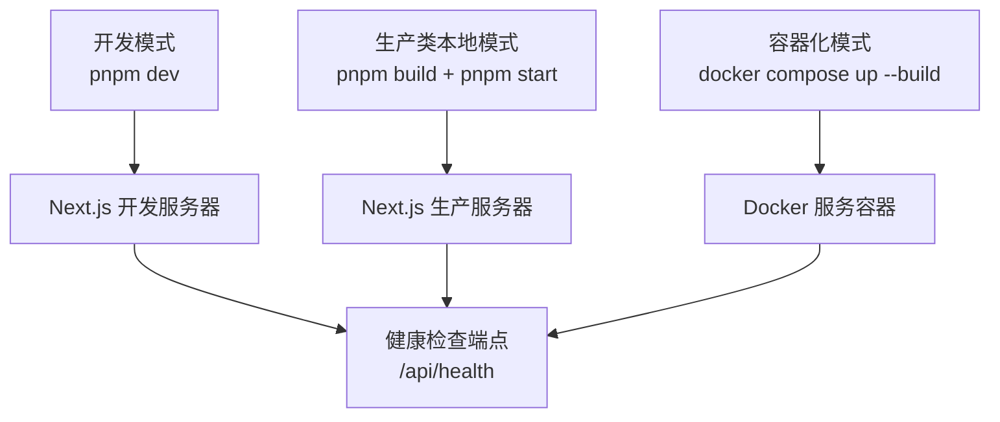
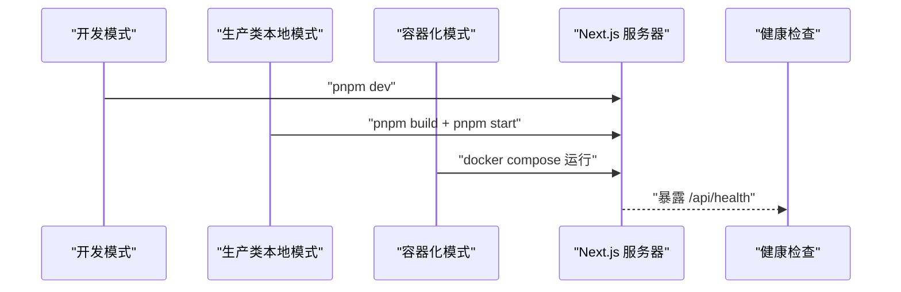
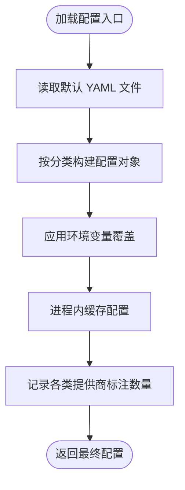
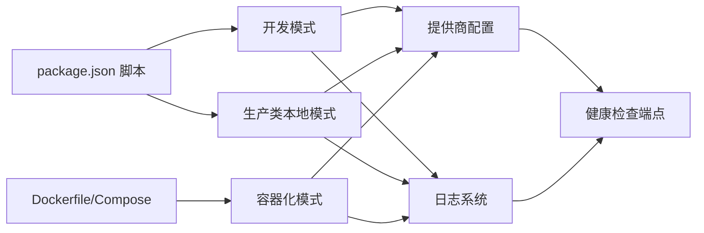

# 启动模式配置

<cite>
**本文引用的文件**
- [package.json](file://package.json)
- [Dockerfile](file://Dockerfile)
- [docker-compose.yml](file://docker-compose.yml)
- [startup-modes.md](file://skills/openmaic/references/startup-modes.md)
- [next.config.ts](file://next.config.ts)
- [logger.ts](file://lib/logger.ts)
- [provider-config.ts](file://lib/server/provider-config.ts)
- [route.ts（健康检查）](file://app/api/health/route.ts)
- [README.md](file://README.md)
</cite>

## 目录
1. [简介](#简介)
2. [项目结构](#项目结构)
3. [核心组件](#核心组件)
4. [架构总览](#架构总览)
5. [详细组件分析](#详细组件分析)
6. [依赖关系分析](#依赖关系分析)
7. [性能考量](#性能考量)
8. [故障排查指南](#故障排查指南)
9. [结论](#结论)
10. [附录](#附录)

## 简介
本文件聚焦 OpenMAIC 的“启动模式配置”，系统性说明三种启动模式：开发模式、生产类本地模式与容器化模式；解释各模式的配置要点、适用场景、对资源与性能的影响；提供启动参数与环境变量设置指南；对比 Docker 与传统 Node.js 部署差异；并给出启动日志分析与故障诊断方法，以及性能监控与资源优化建议。

## 项目结构
OpenMAIC 基于 Next.js 16，采用 App Router，核心启动脚本由包管理脚本定义，容器化通过多阶段 Dockerfile 实现，运行时通过健康检查端点验证服务可用性。

图示来源
- [package.json:6-13](file://package.json#L6-L13)
- [Dockerfile:34-51](file://Dockerfile#L34-L51)
- [next.config.ts:3-10](file://next.config.ts#L3-L10)
- [route.ts（健康检查）:5-7](file://app/api/health/route.ts#L5-L7)

章节来源
- [package.json:6-13](file://package.json#L6-L13)
- [Dockerfile:34-51](file://Dockerfile#L34-L51)
- [next.config.ts:3-10](file://next.config.ts#L3-L10)
- [route.ts（健康检查）:5-7](file://app/api/health/route.ts#L5-L7)

## 核心组件
- 启动脚本与模式
  - 开发模式：使用 Next.js 开发服务器，热重载与快速反馈，适合首次安装与调试。
  - 生产类本地模式：先构建再以生产服务器启动，更接近真实部署行为。
  - 容器化模式：通过 Docker 多阶段构建与 Compose 编排，隔离性更好但启动较慢。
- 日志系统
  - 支持最小日志级别与输出格式控制，便于在不同模式下调整可观测性。
- 提供商配置
  - 支持 YAML 文件与环境变量双源配置，环境变量优先级更高，便于容器化部署覆盖默认值。
- 健康检查
  - 暴露统一健康检查端点，便于容器编排与外部探针验证。

章节来源
- [startup-modes.md:9-48](file://skills/openmaic/references/startup-modes.md#L9-L48)
- [package.json:8-10](file://package.json#L8-L10)
- [logger.ts:4-11](file://lib/logger.ts#L4-L11)
- [provider-config.ts:119-168](file://lib/server/provider-config.ts#L119-L168)
- [route.ts（健康检查）:5-7](file://app/api/health/route.ts#L5-L7)

## 架构总览
下图展示三种启动模式的总体流程与关键差异。

图示来源
- [package.json:8-10](file://package.json#L8-L10)
- [Dockerfile:49-51](file://Dockerfile#L49-L51)
- [route.ts（健康检查）:5-7](file://app/api/health/route.ts#L5-L7)

## 详细组件分析

### 开发模式（推荐首次安装与调试）
- 启动命令
  - 使用开发脚本启动 Next.js 开发服务器，具备热更新能力，启动速度最快。
- 资源与性能影响
  - 内存占用相对较低，CPU 占用随热重载与类型检查波动；I/O 受文件监听影响。
  - 不等同生产启动，不建议用于性能评估。
- 配置要点
  - 本地 .env.local 或环境变量生效；可直接修改配置并即时验证。
  - 建议开启较低日志级别以便快速定位问题。
- 健康检查
  - 启动后访问健康检查端点验证服务可用性。

章节来源
- [startup-modes.md:9-22](file://skills/openmaic/references/startup-modes.md#L9-L22)
- [package.json:8](file://package.json#L8)
- [route.ts（健康检查）:5-7](file://app/api/health/route.ts#L5-L7)

### 生产类本地模式（更贴近部署行为）
- 启动命令
  - 先构建产物，再以生产服务器启动，启动时间较长但行为更接近真实部署。
- 资源与性能影响
  - 冷启动时间较长，内存与 CPU 在请求高峰期上升；静态资源与独立打包提升运行时稳定性。
- 配置要点
  - 构建前确保环境变量已正确注入；如需覆盖默认提供商配置，可通过环境变量优先级生效。
- 健康检查
  - 启动后访问健康检查端点验证服务可用性。

章节来源
- [startup-modes.md:23-35](file://skills/openmaic/references/startup-modes.md#L23-L35)
- [package.json:9-10](file://package.json#L9-L10)
- [next.config.ts:4](file://next.config.ts#L4)

### 容器化模式（Docker Compose）
- 启动命令
  - 通过 Compose 构建镜像并启动服务，默认映射端口与挂载数据卷。
- 资源与性能影响
  - 镜像体积较大，首次构建耗时较长；容器内运行时资源隔离性好，便于横向扩展。
- 配置要点
  - 通过 env_file 引入环境变量；可挂载 server-providers.yml 以覆盖默认提供商配置。
  - 运行用户与权限已降权，容器内暴露端口为 3000。
- 健康检查
  - 启动后访问健康检查端点验证服务可用性。

章节来源
- [startup-modes.md:36-49](file://skills/openmaic/references/startup-modes.md#L36-L49)
- [docker-compose.yml:1-16](file://docker-compose.yml#L1-L16)
- [Dockerfile:34-51](file://Dockerfile#L34-L51)

### 日志系统与可观测性
- 日志级别与格式
  - 支持最小日志级别与 JSON 输出格式切换，便于在不同模式下调整可观测性。
- 使用建议
  - 开发模式可设为较低级别与文本格式；生产或容器化模式可设为较高级别与 JSON 格式，便于日志采集与检索。

章节来源
- [logger.ts:4-11](file://lib/logger.ts#L4-L11)

### 提供商配置加载机制
- 配置来源
  - 默认从 YAML 文件加载；环境变量具有更高优先级，可覆盖 YAML 中的密钥、基础地址与模型列表。
- 影响
  - 容器化部署中可通过环境变量安全地覆盖敏感信息，避免硬编码在仓库中。
- 关键路径
  - 环境变量解析与合并逻辑；配置缓存与日志统计。

图示来源
- [provider-config.ts:101-113](file://lib/server/provider-config.ts#L101-L113)
- [provider-config.ts:179-189](file://lib/server/provider-config.ts#L179-L189)
- [provider-config.ts:208-217](file://lib/server/provider-config.ts#L208-L217)

章节来源
- [provider-config.ts:119-168](file://lib/server/provider-config.ts#L119-L168)
- [provider-config.ts:191-206](file://lib/server/provider-config.ts#L191-L206)

### 健康检查端点
- 端点
  - 统一返回状态与版本信息，便于自动化探活与部署验证。
- 使用
  - 任一启动模式完成后，访问健康检查端点确认服务正常。

章节来源
- [route.ts（健康检查）:5-7](file://app/api/health/route.ts#L5-L7)
- [startup-modes.md:56-64](file://skills/openmaic/references/startup-modes.md#L56-L64)

## 依赖关系分析
- 启动脚本与运行时
  - 开发模式依赖 Next.js 开发服务器；生产类本地模式依赖构建产物与生产服务器；容器化模式依赖 Docker 镜像与 Compose 编排。
- 配置与日志
  - 提供商配置与日志系统贯穿所有模式，容器化模式通过环境变量与卷实现配置注入与持久化。

图示来源
- [package.json:6-13](file://package.json#L6-L13)
- [Dockerfile:34-51](file://Dockerfile#L34-L51)
- [docker-compose.yml:1-16](file://docker-compose.yml#L1-L16)
- [provider-config.ts:179-189](file://lib/server/provider-config.ts#L179-L189)
- [logger.ts:28-52](file://lib/logger.ts#L28-L52)
- [route.ts（健康检查）:5-7](file://app/api/health/route.ts#L5-L7)

章节来源
- [package.json:6-13](file://package.json#L6-L13)
- [Dockerfile:34-51](file://Dockerfile#L34-L51)
- [docker-compose.yml:1-16](file://docker-compose.yml#L1-L16)
- [provider-config.ts:179-189](file://lib/server/provider-config.ts#L179-L189)
- [logger.ts:28-52](file://lib/logger.ts#L28-L52)
- [route.ts（健康检查）:5-7](file://app/api/health/route.ts#L5-L7)

## 性能考量
- 启动性能
  - 开发模式启动最快，适合频繁改动与调试；生产类本地模式启动较慢但更稳定；容器化模式构建与启动最慢，但隔离性最佳。
- 运行时性能
  - 生产与容器化模式在冷启动后表现更稳定；容器化模式建议预热与资源配额规划。
- 日志开销
  - 在高并发场景建议降低日志级别或启用 JSON 格式以减少解析成本。
- 配置覆盖
  - 容器化部署中通过环境变量覆盖敏感配置，避免重复构建镜像。

## 故障排查指南
- 健康检查
  - 启动后立即访问健康检查端点，确认服务可用与版本信息返回正常。
- 日志分析
  - 设置合适的日志级别与格式，结合错误堆栈定位问题；在容器化模式下收集容器日志进行聚合分析。
- 配置核验
  - 确认环境变量是否覆盖到对应提供商字段；检查 YAML 文件是否存在且可读。
- 常见问题
  - 开发模式无法热更新：检查文件监听与磁盘权限；生产模式启动失败：检查构建产物与运行时依赖；容器化模式端口冲突：调整映射端口或停止占用进程。

章节来源
- [startup-modes.md:56-64](file://skills/openmaic/references/startup-modes.md#L56-L64)
- [logger.ts:28-52](file://lib/logger.ts#L28-L52)
- [provider-config.ts:101-113](file://lib/server/provider-config.ts#L101-L113)

## 结论
- 选择建议
  - 首次安装与调试优先开发模式；需要更接近生产的体验选择生产类本地模式；追求隔离与标准化部署选择容器化模式。
- 最佳实践
  - 使用环境变量覆盖敏感配置；在容器化环境中通过卷与 env_file 管理配置；通过健康检查与日志系统建立可观测性闭环。

## 附录

### 启动参数与环境变量配置指南
- 启动脚本
  - 开发模式：使用开发脚本启动 Next.js 开发服务器。
  - 生产类本地模式：先构建再启动生产服务器。
  - 容器化模式：通过 Compose 启动服务，映射端口并挂载数据卷。
- 环境变量
  - 日志相关：最小日志级别与输出格式。
  - 提供商配置：通过环境变量覆盖密钥、基础地址与模型列表。
  - 容器运行：容器内默认端口与主机绑定策略。

章节来源
- [package.json:8-10](file://package.json#L8-L10)
- [Dockerfile:34-36](file://Dockerfile#L34-L36)
- [docker-compose.yml:4-12](file://docker-compose.yml#L4-L12)
- [logger.ts:4-11](file://lib/logger.ts#L4-L11)
- [provider-config.ts:119-168](file://lib/server/provider-config.ts#L119-L168)

### Docker 与传统 Node.js 部署区别
- 镜像与运行时
  - Docker 采用多阶段构建与独立运行时，容器内以非特权用户运行，具备更强的隔离性与一致性。
- 配置注入
  - 传统模式通过 .env.local 或环境变量注入；容器化模式通过 env_file 与卷注入，更适合 CI/CD 场景。
- 端口与网络
  - 容器化模式显式暴露端口并通过 Compose 映射，便于多服务编排。

章节来源
- [Dockerfile:34-51](file://Dockerfile#L34-L51)
- [docker-compose.yml:1-16](file://docker-compose.yml#L1-L16)
- [README.md:143-149](file://README.md#L143-L149)