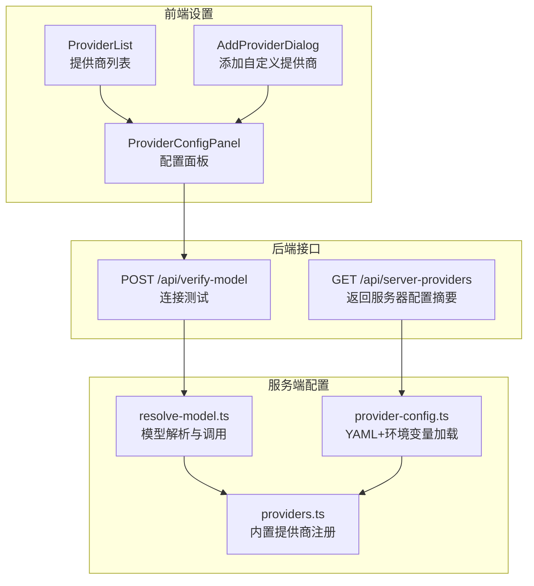
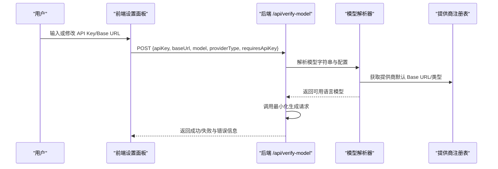
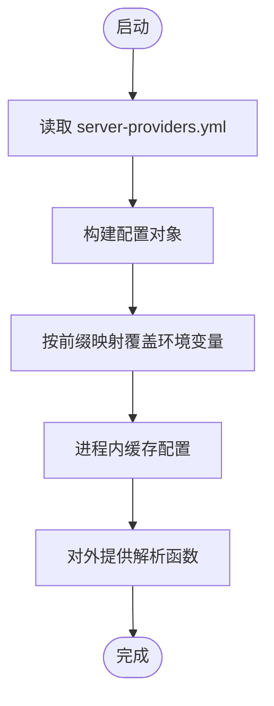
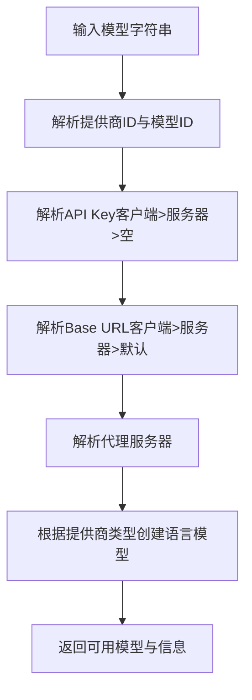
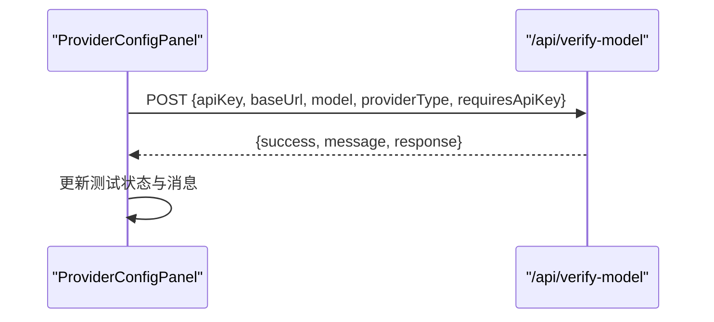
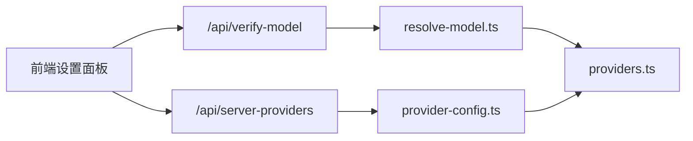

# 提供商密钥配置

<cite>
**本文引用的文件**
- [skills/openmaic/references/provider-keys.md](file://skills/openmaic/references/provider-keys.md)
- [lib/ai/providers.ts](file://lib/ai/providers.ts)
- [lib/server/provider-config.ts](file://lib/server/provider-config.ts)
- [lib/server/resolve-model.ts](file://lib/server/resolve-model.ts)
- [app/api/server-providers/route.ts](file://app/api/server-providers/route.ts)
- [app/api/verify-model/route.ts](file://app/api/verify-model/route.ts)
- [components/settings/provider-config-panel.tsx](file://components/settings/provider-config-panel.tsx)
- [components/settings/provider-list.tsx](file://components/settings/provider-list.tsx)
- [components/settings/add-provider-dialog.tsx](file://components/settings/add-provider-dialog.tsx)
- [lib/types/settings.ts](file://lib/types/settings.ts)
- [package.json](file://package.json)
</cite>

## 目录
1. [简介](#简介)
2. [项目结构](#项目结构)
3. [核心组件](#核心组件)
4. [架构总览](#架构总览)
5. [详细组件分析](#详细组件分析)
6. [依赖关系分析](#依赖关系分析)
7. [性能考量](#性能考量)
8. [故障排查指南](#故障排查指南)
9. [结论](#结论)
10. [附录](#附录)

## 简介
本文件面向 OpenMAIC 的提供商密钥配置，系统性说明如何为 OpenAI、Anthropic、Google Gemini 等主流 AI 服务配置密钥与端点，并给出安全最佳实践、配置文件结构、字段说明、密钥轮换与失效处理、配置验证与连接测试方法，以及常见问题排查路径。

## 项目结构
围绕“提供商密钥配置”的关键目录与文件如下：
- 配置加载与解析：lib/server/provider-config.ts（从 YAML 与环境变量加载）
- 模型解析与调用：lib/server/resolve-model.ts、lib/ai/providers.ts
- 前端设置面板：components/settings/provider-config-panel.tsx、provider-list.tsx、add-provider-dialog.tsx
- 后端接口：app/api/server-providers/route.ts、app/api/verify-model/route.ts
- 参考文档：skills/openmaic/references/provider-keys.md
- 类型定义：lib/types/settings.ts
- 依赖声明：package.json

图表来源
- [components/settings/provider-config-panel.tsx:110-150](file://components/settings/provider-config-panel.tsx#L110-L150)
- [app/api/server-providers/route.ts:15-34](file://app/api/server-providers/route.ts#L15-L34)
- [app/api/verify-model/route.ts:8-68](file://app/api/verify-model/route.ts#L8-L68)
- [lib/server/provider-config.ts:208-245](file://lib/server/provider-config.ts#L208-L245)
- [lib/server/resolve-model.ts:22-45](file://lib/server/resolve-model.ts#L22-L45)
- [lib/ai/providers.ts:51-800](file://lib/ai/providers.ts#L51-L800)

章节来源
- [components/settings/provider-config-panel.tsx:110-150](file://components/settings/provider-config-panel.tsx#L110-L150)
- [app/api/server-providers/route.ts:15-34](file://app/api/server-providers/route.ts#L15-L34)
- [app/api/verify-model/route.ts:8-68](file://app/api/verify-model/route.ts#L8-L68)
- [lib/server/provider-config.ts:208-245](file://lib/server/provider-config.ts#L208-L245)
- [lib/server/resolve-model.ts:22-45](file://lib/server/resolve-model.ts#L22-L45)
- [lib/ai/providers.ts:51-800](file://lib/ai/providers.ts#L51-L800)

## 核心组件
- 服务器配置加载器：负责从 YAML 文件与环境变量合并加载提供商配置，确保密钥不外泄，仅暴露提供商 ID 与元数据。
- 模型解析器：统一解析模型字符串（含提供商前缀），并结合客户端或服务器配置解析 API Key、Base URL、代理等。
- 前端配置面板：支持编辑 API Key、Base URL、是否需要 Key、模型列表管理，并提供一键连接测试。
- 后端接口：
  - 获取服务器配置摘要（不含密钥）。
  - 连接测试接口，用于验证密钥、模型与网络连通性。

章节来源
- [lib/server/provider-config.ts:223-250](file://lib/server/provider-config.ts#L223-L250)
- [lib/server/resolve-model.ts:22-45](file://lib/server/resolve-model.ts#L22-L45)
- [components/settings/provider-config-panel.tsx:110-150](file://components/settings/provider-config-panel.tsx#L110-L150)
- [app/api/server-providers/route.ts:15-34](file://app/api/server-providers/route.ts#L15-L34)
- [app/api/verify-model/route.ts:8-68](file://app/api/verify-model/route.ts#L8-L68)

## 架构总览
OpenMAIC 的密钥配置采用“服务器侧集中管理 + 客户端可选覆盖”的双层策略：
- 服务器侧：通过 YAML 文件与环境变量加载，密钥不暴露给前端。
- 客户端侧：可在设置面板中覆盖 API Key、Base URL、是否需要 Key；若未覆盖，则使用服务器配置。
- 连接测试：前端调用后端 /api/verify-model，后端解析模型并发起最小化请求以验证连通性与鉴权。

图表来源
- [components/settings/provider-config-panel.tsx:110-150](file://components/settings/provider-config-panel.tsx#L110-L150)
- [app/api/verify-model/route.ts:8-68](file://app/api/verify-model/route.ts#L8-L68)
- [lib/server/resolve-model.ts:22-45](file://lib/server/resolve-model.ts#L22-L45)
- [lib/ai/providers.ts:51-800](file://lib/ai/providers.ts#L51-L800)

## 详细组件分析

### 服务器配置加载（YAML + 环境变量）
- 支持的模块：LLM、TTS、ASR、PDF、图像、视频、网页搜索。
- 加载顺序：先读取 YAML 文件，再以环境变量覆盖同名字段。
- 密钥安全：仅对外暴露提供商 ID 与元数据，不回传密钥。
- 关键函数：
  - 读取 YAML 并构建配置对象。
  - 将环境变量映射到对应提供商 ID。
  - 提供解析 API Key、Base URL、代理的解析函数。

图表来源
- [lib/server/provider-config.ts:101-168](file://lib/server/provider-config.ts#L101-L168)
- [lib/server/provider-config.ts:208-245](file://lib/server/provider-config.ts#L208-L245)

章节来源
- [lib/server/provider-config.ts:19-86](file://lib/server/provider-config.ts#L19-L86)
- [lib/server/provider-config.ts:101-168](file://lib/server/provider-config.ts#L101-L168)
- [lib/server/provider-config.ts:208-245](file://lib/server/provider-config.ts#L208-L245)

### 模型解析与调用
- 模型字符串规则：必须包含提供商前缀（如 openai:、anthropic:、google:），否则会被解析为 OpenAI。
- 解析流程：parseModelString → resolveApiKey → resolveBaseUrl → resolveProxy → getModel。
- 默认模型：若未指定，默认使用 gpt-4o-mini（可通过环境变量 DEFAULT_MODEL 覆盖）。

图表来源
- [lib/server/resolve-model.ts:22-45](file://lib/server/resolve-model.ts#L22-L45)
- [lib/ai/providers.ts:51-800](file://lib/ai/providers.ts#L51-L800)

章节来源
- [lib/server/resolve-model.ts:22-45](file://lib/server/resolve-model.ts#L22-L45)
- [lib/ai/providers.ts:51-800](file://lib/ai/providers.ts#L51-L800)

### 前端配置面板与连接测试
- 面板能力：
  - 编辑 API Key（可隐藏/显示）、Base URL、是否需要 Key。
  - 展示模型列表与能力标签（视觉/工具/流式）。
  - 一键测试连接，返回成功/失败与提示信息。
- 测试逻辑：选择可用模型的第一个进行最小化文本生成，依据响应判断连通性与鉴权状态。

图表来源
- [components/settings/provider-config-panel.tsx:110-150](file://components/settings/provider-config-panel.tsx#L110-L150)
- [app/api/verify-model/route.ts:8-68](file://app/api/verify-model/route.ts#L8-L68)

章节来源
- [components/settings/provider-config-panel.tsx:110-150](file://components/settings/provider-config-panel.tsx#L110-L150)
- [app/api/verify-model/route.ts:8-68](file://app/api/verify-model/route.ts#L8-L68)

### 自定义提供商与模型管理
- 支持添加自定义提供商（OpenAI/Anthropic/Google 兼容模式），设置名称、类型、默认 Base URL、图标与是否需要 Key。
- 模型列表支持增删改，便于精细化控制可用模型集合。

章节来源
- [components/settings/add-provider-dialog.tsx:27-62](file://components/settings/add-provider-dialog.tsx#L27-L62)
- [components/settings/provider-config-panel.tsx:280-378](file://components/settings/provider-config-panel.tsx#L280-L378)

## 依赖关系分析
- 前端设置依赖后端接口：
  - /api/server-providers：获取服务器配置摘要（不含密钥）。
  - /api/verify-model：执行连接测试。
- 服务器配置依赖：
  - YAML 文件与环境变量映射。
  - 内置提供商注册表（统一模型与能力描述）。
- 依赖包：
  - @ai-sdk/* 与 ai 库用于统一模型调用。

图表来源
- [app/api/server-providers/route.ts:15-34](file://app/api/server-providers/route.ts#L15-L34)
- [app/api/verify-model/route.ts:8-68](file://app/api/verify-model/route.ts#L8-L68)
- [lib/server/provider-config.ts:208-245](file://lib/server/provider-config.ts#L208-L245)
- [lib/server/resolve-model.ts:22-45](file://lib/server/resolve-model.ts#L22-L45)
- [lib/ai/providers.ts:51-800](file://lib/ai/providers.ts#L51-L800)

章节来源
- [package.json:15-94](file://package.json#L15-L94)
- [app/api/server-providers/route.ts:15-34](file://app/api/server-providers/route.ts#L15-L34)
- [app/api/verify-model/route.ts:8-68](file://app/api/verify-model/route.ts#L8-L68)
- [lib/server/provider-config.ts:208-245](file://lib/server/provider-config.ts#L208-L245)
- [lib/server/resolve-model.ts:22-45](file://lib/server/resolve-model.ts#L22-L45)
- [lib/ai/providers.ts:51-800](file://lib/ai/providers.ts#L51-L800)

## 性能考量
- 连接测试应尽量轻量：使用最小化提示词与短响应，避免高延迟与高开销。
- 模型解析与配置缓存：服务器侧已做进程级缓存，减少重复 IO。
- 前端测试按钮禁用条件：在缺少必要参数时禁用，避免无效请求。

## 故障排查指南
- 常见错误与定位
  - 401/未授权：检查 API Key 是否正确、过期或被撤销。
  - 404/未找到：检查模型名称是否正确、是否支持该模型。
  - 429/配额/限流：等待重试或提升额度。
  - DNS/连接拒绝：检查 Base URL 是否正确、网络是否可达。
  - 超时：检查网络质量与代理设置。
- 排查步骤
  - 在设置面板中点击“测试连接”，查看具体错误提示。
  - 若服务器已配置密钥，确认前端是否勾选“需要 API Key”且未填写客户端 Key。
  - 使用 /api/server-providers 接口确认服务器侧配置是否生效。
  - 检查模型字符串是否包含正确的提供商前缀。
- 参考建议
  - 首次配置优先使用 .env.local 或 server-providers.yml。
  - 如需默认模型，务必带上提供商前缀（如 google:gemini-3-flash-preview）。

章节来源
- [app/api/verify-model/route.ts:48-66](file://app/api/verify-model/route.ts#L48-L66)
- [skills/openmaic/references/provider-keys.md:126-147](file://skills/openmaic/references/provider-keys.md#L126-L147)

## 结论
OpenMAIC 的提供商密钥配置遵循“服务器集中管理、客户端可选覆盖、测试先行”的原则。通过 YAML/环境变量与前端设置面板的协同，既能满足快速上手，又能保障密钥安全与配置可控。建议在生产环境中优先使用服务器侧配置，配合连接测试与模型前缀规范，降低配置风险。

## 附录

### 配置文件结构与字段说明
- YAML 主文件：server-providers.yml
  - providers/anon/tts/asr/pdf/image/video/web-search：各模块的提供商条目
  - 每个条目字段：
    - apiKey：提供商密钥（服务器侧加载）
    - baseUrl：可选，覆盖默认 Base URL
    - models：可选，限制可用模型列表
    - proxy：可选，代理地址（服务器侧）
- 环境变量映射（示例）
  - OPENAI_API_KEY、ANTHROPIC_API_KEY、GOOGLE_API_KEY、DEEPSEEK_API_KEY、QWEN_API_KEY、KIMI_API_KEY、MINIMAX_API_KEY、GLM_API_KEY、SILICONFLOW_API_KEY、DOUBAO_API_KEY
  - 对应的 Base URL、模型列表等可通过同名前缀的 *_BASE_URL、*_MODELS 环境变量覆盖
- 默认模型
  - 未指定时默认使用 gpt-4o-mini；可通过 DEFAULT_MODEL 设置为其他提供商的带前缀模型

章节来源
- [lib/server/provider-config.ts:19-86](file://lib/server/provider-config.ts#L19-L86)
- [lib/server/provider-config.ts:119-168](file://lib/server/provider-config.ts#L119-L168)
- [lib/server/resolve-model.ts:29-30](file://lib/server/resolve-model.ts#L29-L30)
- [skills/openmaic/references/provider-keys.md:83-95](file://skills/openmaic/references/provider-keys.md#L83-L95)

### 密钥存储与环境变量配置安全最佳实践
- 不在客户端持久化密钥；优先使用服务器侧配置。
- 使用环境变量覆盖时，确保只暴露必要的 *_API_KEY、*_BASE_URL、*_MODELS。
- 为不同模块分别配置密钥，避免单一密钥泄露影响所有模块。
- 定期轮换密钥，更新服务器配置后立即进行连接测试。

章节来源
- [lib/server/provider-config.ts:223-250](file://lib/server/provider-config.ts#L223-L250)
- [skills/openmaic/references/provider-keys.md:13-22](file://skills/openmaic/references/provider-keys.md#L13-L22)

### 密钥轮换与失效处理流程
- 轮换步骤
  - 在提供商平台生成新密钥
  - 更新服务器配置（YAML 或环境变量）
  - 执行连接测试，确认可用
  - 如需客户端覆盖，同步更新前端设置
- 失效处理
  - 若出现 401/403，优先检查服务器配置是否已更新
  - 使用 /api/server-providers 确认服务器侧配置可见
  - 回退至默认模型或切换备用提供商

章节来源
- [app/api/verify-model/route.ts:48-66](file://app/api/verify-model/route.ts#L48-L66)
- [app/api/server-providers/route.ts:15-34](file://app/api/server-providers/route.ts#L15-L34)

### 配置验证与连接测试方法
- 前端测试
  - 在提供商配置面板点击“测试连接”
  - 观察成功/失败状态与提示信息
- 后端测试
  - 调用 /api/verify-model，传入 apiKey、baseUrl、model（含前缀）、providerType、requiresApiKey
  - 根据返回的错误码与消息定位问题

章节来源
- [components/settings/provider-config-panel.tsx:110-150](file://components/settings/provider-config-panel.tsx#L110-L150)
- [app/api/verify-model/route.ts:8-68](file://app/api/verify-model/route.ts#L8-L68)

### 常见配置错误与解决方案
- 错误：模型解析为 OpenAI
  - 原因：未使用带前缀的模型字符串
  - 解决：改为 google:gemini-3-flash-preview、anthropic:claude-3-5-haiku-20241022、openai:gpt-4o-mini 等
- 错误：连接失败/超时
  - 原因：Base URL 错误或网络不可达
  - 解决：核对 Base URL，检查代理与防火墙
- 错误：401/未授权
  - 原因：密钥无效或过期
  - 解决：重新生成密钥并更新服务器配置

章节来源
- [skills/openmaic/references/provider-keys.md:83-95](file://skills/openmaic/references/provider-keys.md#L83-L95)
- [app/api/verify-model/route.ts:48-66](file://app/api/verify-model/route.ts#L48-L66)