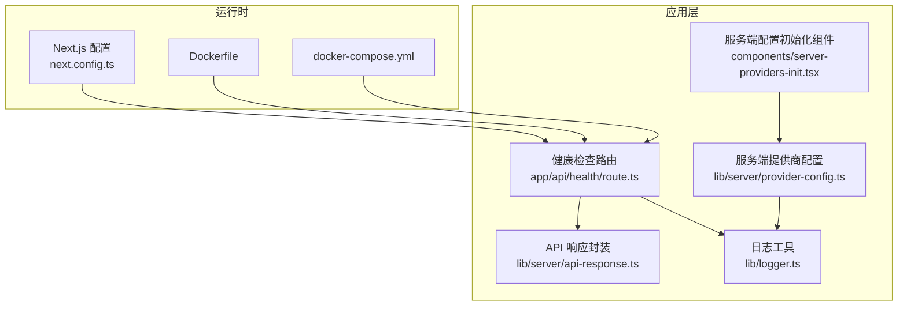
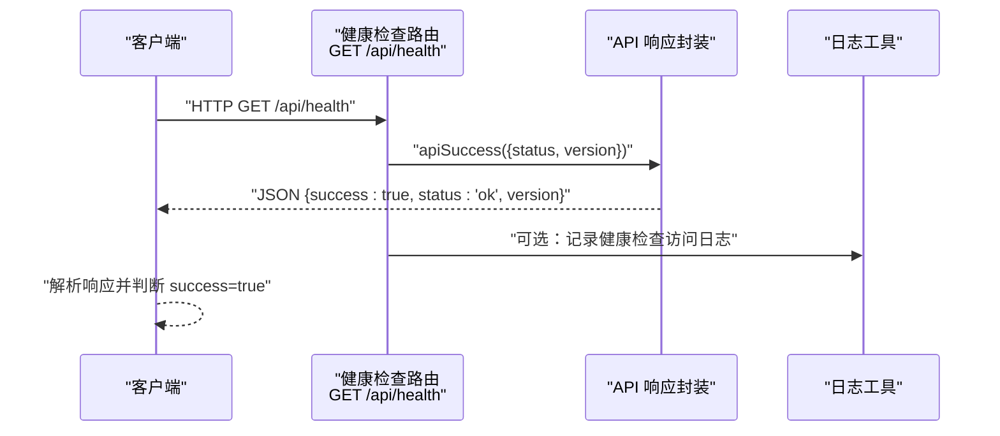
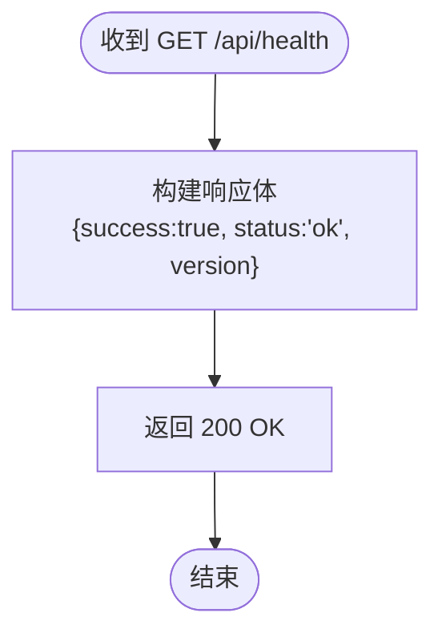
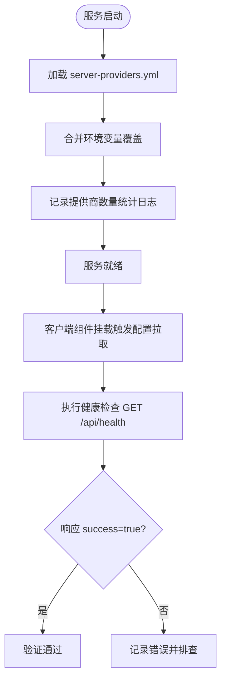
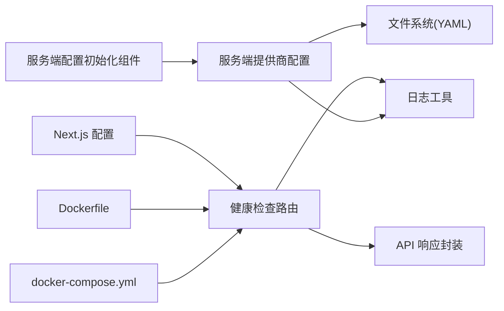

# 服务验证

<cite>
**本文引用的文件**
- [app/api/health/route.ts](file://app/api/health/route.ts)
- [lib/server/api-response.ts](file://lib/server/api-response.ts)
- [lib/logger.ts](file://lib/logger.ts)
- [lib/server/provider-config.ts](file://lib/server/provider-config.ts)
- [components/server-providers-init.tsx](file://components/server-providers-init.tsx)
- [skills/openmaic/references/startup-modes.md](file://skills/openmaic/references/startup-modes.md)
- [skills/openmaic/SKILL.md](file://skills/openmaic/SKILL.md)
- [Dockerfile](file://Dockerfile)
- [docker-compose.yml](file://docker-compose.yml)
- [next.config.ts](file://next.config.ts)
- [package.json](file://package.json)
- [README.md](file://README.md)
</cite>

## 目录
1. [简介](#简介)
2. [项目结构](#项目结构)
3. [核心组件](#核心组件)
4. [架构总览](#架构总览)
5. [详细组件分析](#详细组件分析)
6. [依赖关系分析](#依赖关系分析)
7. [性能考量](#性能考量)
8. [故障排查指南](#故障排查指南)
9. [结论](#结论)
10. [附录](#附录)

## 简介
本文件面向 OpenMAIC 服务的验证与运维，聚焦“健康检查”能力与启动后自检流程，帮助用户在不同部署模式（开发、生产本地、容器）下完成服务可用性验证，并提供多场景验证方法、常见失败原因与排障思路、日志与错误诊断技巧，以及监控与告警建议。

## 项目结构
OpenMAIC 使用 Next.js 作为前端与 API 框架，健康检查端点位于 app/api/health/route.ts；通用 API 响应封装位于 lib/server/api-response.ts；日志工具位于 lib/logger.ts；服务端提供商配置加载位于 lib/server/provider-config.ts；组件侧通过 components/server-providers-init.tsx 触发服务端配置拉取；部署与运行环境由 Dockerfile、docker-compose.yml 与 next.config.ts 配置决定；技能引导文档 skills/openmaic/references/startup-modes.md 提供了健康检查命令与启动模式说明。

**图表来源**
- [app/api/health/route.ts:1-8](file://app/api/health/route.ts#L1-L8)
- [lib/server/api-response.ts:1-46](file://lib/server/api-response.ts#L1-L46)
- [lib/logger.ts:1-53](file://lib/logger.ts#L1-L53)
- [lib/server/provider-config.ts:1-200](file://lib/server/provider-config.ts#L1-L200)
- [components/server-providers-init.tsx:1-18](file://components/server-providers-init.tsx#L1-L18)
- [next.config.ts:1-13](file://next.config.ts#L1-L13)
- [Dockerfile:1-52](file://Dockerfile#L1-L52)
- [docker-compose.yml:1-16](file://docker-compose.yml#L1-L16)

**章节来源**
- [app/api/health/route.ts:1-8](file://app/api/health/route.ts#L1-L8)
- [lib/server/api-response.ts:1-46](file://lib/server/api-response.ts#L1-L46)
- [lib/logger.ts:1-53](file://lib/logger.ts#L1-L53)
- [lib/server/provider-config.ts:1-200](file://lib/server/provider-config.ts#L1-L200)
- [components/server-providers-init.tsx:1-18](file://components/server-providers-init.tsx#L1-L18)
- [next.config.ts:1-13](file://next.config.ts#L1-L13)
- [Dockerfile:1-52](file://Dockerfile#L1-L52)
- [docker-compose.yml:1-16](file://docker-compose.yml#L1-L16)

## 核心组件
- 健康检查路由：提供只读 GET /api/health，返回统一成功响应，包含服务状态与版本信息。
- API 响应封装：统一 success/error 响应结构与错误码常量，便于一致化处理。
- 日志工具：支持按环境变量控制日志级别与输出格式，便于诊断。
- 服务端提供商配置：从 YAML 文件与环境变量加载提供商配置，记录加载统计与警告日志。
- 服务端配置初始化组件：客户端挂载时触发服务端配置拉取，确保前端可使用服务端默认配置。
- 运行时配置：Next.js standalone 输出、代理最大请求体大小等；Dockerfile 定义生产镜像与运行参数；docker-compose 映射端口与数据卷。

**章节来源**
- [app/api/health/route.ts:1-8](file://app/api/health/route.ts#L1-L8)
- [lib/server/api-response.ts:1-46](file://lib/server/api-response.ts#L1-L46)
- [lib/logger.ts:1-53](file://lib/logger.ts#L1-L53)
- [lib/server/provider-config.ts:1-200](file://lib/server/provider-config.ts#L1-L200)
- [components/server-providers-init.tsx:1-18](file://components/server-providers-init.tsx#L1-L18)
- [next.config.ts:1-13](file://next.config.ts#L1-L13)
- [Dockerfile:1-52](file://Dockerfile#L1-L52)
- [docker-compose.yml:1-16](file://docker-compose.yml#L1-L16)

## 架构总览
健康检查端点在请求到达时，直接调用统一响应封装返回成功结果；服务启动后，系统会加载服务端提供商配置并通过日志输出加载统计；客户端组件可在挂载时触发服务端配置拉取，以确保前端具备默认配置。

**图表来源**
- [app/api/health/route.ts:1-8](file://app/api/health/route.ts#L1-L8)
- [lib/server/api-response.ts:43-45](file://lib/server/api-response.ts#L43-L45)
- [lib/logger.ts:28-52](file://lib/logger.ts#L28-L52)

## 详细组件分析

### 健康检查 API
- 端点：GET /api/health
- 请求：无鉴权要求（仅查询）
- 成功响应：统一成功结构，包含字段 success=true、status='ok'、version（来自 npm 包版本）
- 状态码：200 OK
- 失败响应：该端点不返回错误结构；若出现非 200，通常为网络或中间件问题

**图表来源**
- [app/api/health/route.ts:5-7](file://app/api/health/route.ts#L5-L7)
- [lib/server/api-response.ts:43-45](file://lib/server/api-response.ts#L43-L45)
- [package.json:2-4](file://package.json#L2-L4)

**章节来源**
- [app/api/health/route.ts:1-8](file://app/api/health/route.ts#L1-L8)
- [lib/server/api-response.ts:1-46](file://lib/server/api-response.ts#L1-L46)
- [package.json:1-124](file://package.json#L1-L124)

### 服务启动后的自检与依赖验证
- 启动模式与验证命令
  - 开发模式：pnpm dev 后，使用 curl -fsS http://localhost:3000/api/health 验证
  - 生产本地模式：pnpm build && pnpm start 后，同上
  - Docker Compose：docker compose up --build 后，同上
- 服务端配置加载
  - 从当前工作目录加载 server-providers.yml（如存在），并合并环境变量覆盖
  - 加载完成后记录各模块提供商数量的日志，便于核验
- 客户端配置初始化
  - 组件挂载时触发服务端配置拉取，确保前端设置与服务端一致

**图表来源**
- [lib/server/provider-config.ts:101-113](file://lib/server/provider-config.ts#L101-L113)
- [lib/server/provider-config.ts:119-168](file://lib/server/provider-config.ts#L119-L168)
- [lib/server/provider-config.ts:191-206](file://lib/server/provider-config.ts#L191-L206)
- [components/server-providers-init.tsx:10-15](file://components/server-providers-init.tsx#L10-L15)
- [skills/openmaic/references/startup-modes.md:56-64](file://skills/openmaic/references/startup-modes.md#L56-L64)

**章节来源**
- [skills/openmaic/references/startup-modes.md:1-70](file://skills/openmaic/references/startup-modes.md#L1-L70)
- [lib/server/provider-config.ts:1-200](file://lib/server/provider-config.ts#L1-L200)
- [components/server-providers-init.tsx:1-18](file://components/server-providers-init.tsx#L1-L18)

### 多种验证方法与工具
- curl 命令
  - curl -fsS http://localhost:3000/api/health
  - 可结合 -w 查看响应码：curl -w "%{http_code}\n" -o /dev/null -sS http://localhost:3000/api/health
- 浏览器访问
  - 在地址栏输入 http://localhost:3000/api/health，查看 JSON 响应
- 自动化脚本
  - 使用 shell 脚本循环探测 /api/health 并记录时间戳与状态码
  - 使用 curl 的 -m 设置超时，-f 非 2xx 返回即失败，-s 静默输出
- 技能引导中的 URL 默认值
  - 若技能配置提供 url，默认使用该地址进行验证

**章节来源**
- [skills/openmaic/references/startup-modes.md:56-64](file://skills/openmaic/references/startup-modes.md#L56-L64)
- [skills/openmaic/SKILL.md:84-86](file://skills/openmaic/SKILL.md#L84-L86)

### 常见验证失败原因与解决步骤
- 端口未开放或被占用
  - 检查进程占用与防火墙设置；Docker Compose 已映射 3000:3000，确认宿主机端口空闲
- 服务未完全启动
  - 等待构建与静态资源生成完成；生产本地模式需先 pnpm build 再 pnpm start
- 环境变量缺失导致配置异常
  - 检查 .env.local 与 server-providers.yml；确认所需提供商 API Key 已配置
- 网络或代理问题
  - 使用 -v 或 -vv 打印详细请求/响应头，定位中间环节阻断
- 响应非 200
  - 该端点不返回错误结构，非 200 通常表示网络或上游中间件异常

**章节来源**
- [docker-compose.yml:1-16](file://docker-compose.yml#L1-L16)
- [Dockerfile:34-49](file://Dockerfile#L34-L49)
- [lib/server/provider-config.ts:101-113](file://lib/server/provider-config.ts#L101-L113)
- [README.md:90-117](file://README.md#L90-L117)

### 日志分析与错误诊断技巧
- 日志级别与格式
  - 支持通过 LOG_LEVEL 控制最小输出级别，LOG_FORMAT=json 输出结构化日志
- 健康检查与配置加载日志
  - 健康检查端点可配合日志工具输出访问日志
  - 服务端配置加载完成后会输出各模块提供商数量统计，便于核验
- 诊断步骤
  - 将日志级别提升至 debug，观察配置加载与初始化过程
  - 结合 curl -v/-vv 查看请求链路与响应头
  - 在容器中使用 docker logs 查看标准输出

**章节来源**
- [lib/logger.ts:1-53](file://lib/logger.ts#L1-L53)
- [lib/server/provider-config.ts:191-206](file://lib/server/provider-config.ts#L191-L206)
- [app/api/health/route.ts:1-8](file://app/api/health/route.ts#L1-L8)

### 服务监控与告警配置建议
- 基础指标
  - 健康检查成功率与延迟（P95/P99）
  - 服务端配置加载耗时与失败次数
- 告警阈值示例
  - 连续 N 次健康检查失败触发告警
  - 延迟超过 X 毫秒触发慢调用告警
- 探测方式
  - 使用 curl 或 HTTP 客户端定时访问 /api/health
  - 在容器化环境中，结合 Docker/Compose 日志采集与告警
- 可观测性
  - 将日志格式设为 JSON，便于日志平台解析
  - 记录版本号与启动时间，辅助回溯问题

[本节为通用建议，无需特定文件引用]

## 依赖关系分析
- 健康检查路由依赖 API 响应封装与日志工具
- 服务端配置加载依赖 YAML 解析与文件系统，同时记录日志
- 客户端组件依赖设置存储，触发服务端配置拉取
- 运行时配置影响端口暴露与输出模式

**图表来源**
- [app/api/health/route.ts:1-8](file://app/api/health/route.ts#L1-L8)
- [lib/server/api-response.ts:1-46](file://lib/server/api-response.ts#L1-L46)
- [lib/logger.ts:1-53](file://lib/logger.ts#L1-L53)
- [lib/server/provider-config.ts:1-200](file://lib/server/provider-config.ts#L1-L200)
- [components/server-providers-init.tsx:1-18](file://components/server-providers-init.tsx#L1-L18)
- [next.config.ts:1-13](file://next.config.ts#L1-L13)
- [Dockerfile:1-52](file://Dockerfile#L1-L52)
- [docker-compose.yml:1-16](file://docker-compose.yml#L1-L16)

**章节来源**
- [app/api/health/route.ts:1-8](file://app/api/health/route.ts#L1-L8)
- [lib/server/api-response.ts:1-46](file://lib/server/api-response.ts#L1-L46)
- [lib/logger.ts:1-53](file://lib/logger.ts#L1-53)
- [lib/server/provider-config.ts:1-200](file://lib/server/provider-config.ts#L1-L200)
- [components/server-providers-init.tsx:1-18](file://components/server-providers-init.tsx#L1-L18)
- [next.config.ts:1-13](file://next.config.ts#L1-L13)
- [Dockerfile:1-52](file://Dockerfile#L1-L52)
- [docker-compose.yml:1-16](file://docker-compose.yml#L1-L16)

## 性能考量
- 健康检查为轻量级只读请求，响应体小，适合高频探测
- 生产本地模式与容器模式均采用 Next.js standalone 输出，启动与冷启动表现稳定
- 如需降低探活开销，可调整探测频率与超时参数

[本节为通用建议，无需特定文件引用]

## 故障排查指南
- 无法访问 /api/health
  - 检查端口映射与防火墙（Docker Compose 已映射 3000:3000）
  - 确认服务已构建并启动（pnpm build && pnpm start 或 docker compose）
- 响应非 200
  - 该端点不返回错误结构，非 200 通常为网络或上游问题
  - 使用 curl -v/-vv 获取详细信息
- 配置未生效
  - 检查 server-providers.yml 与环境变量覆盖逻辑
  - 关注日志中“Loaded ... providers”统计行
- 日志为空或级别过低
  - 设置 LOG_LEVEL 与 LOG_FORMAT，必要时提升到 debug

**章节来源**
- [docker-compose.yml:1-16](file://docker-compose.yml#L1-L16)
- [Dockerfile:34-49](file://Dockerfile#L34-L49)
- [lib/server/provider-config.ts:191-206](file://lib/server/provider-config.ts#L191-L206)
- [lib/logger.ts:4-11](file://lib/logger.ts#L4-L11)

## 结论
OpenMAIC 的健康检查 API 设计简洁可靠，统一的成功响应便于自动化验证；结合服务端配置加载与日志工具，可快速定位启动与配置问题。按照推荐的启动模式与验证命令，即可高效完成服务可用性验证与持续监控。

[本节为总结，无需特定文件引用]

## 附录
- 快速验证命令
  - curl -fsS http://localhost:3000/api/health
- 关键环境变量
  - LOG_LEVEL、LOG_FORMAT、各 PROVIDER_* 系列环境变量（用于覆盖 server-providers.yml）
- 运行时端口
  - 默认 3000（容器内暴露）

**章节来源**
- [skills/openmaic/references/startup-modes.md:56-64](file://skills/openmaic/references/startup-modes.md#L56-L64)
- [lib/logger.ts:4-11](file://lib/logger.ts#L4-L11)
- [lib/server/provider-config.ts:119-168](file://lib/server/provider-config.ts#L119-L168)
- [Dockerfile:34-49](file://Dockerfile#L34-L49)