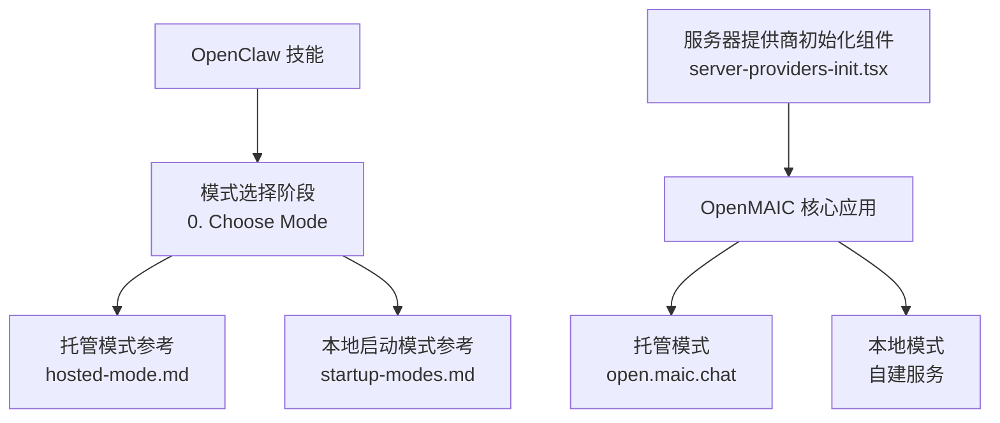
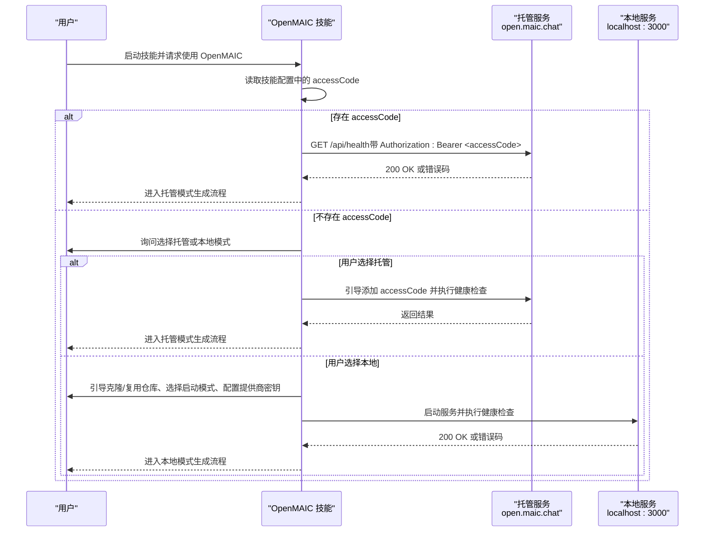
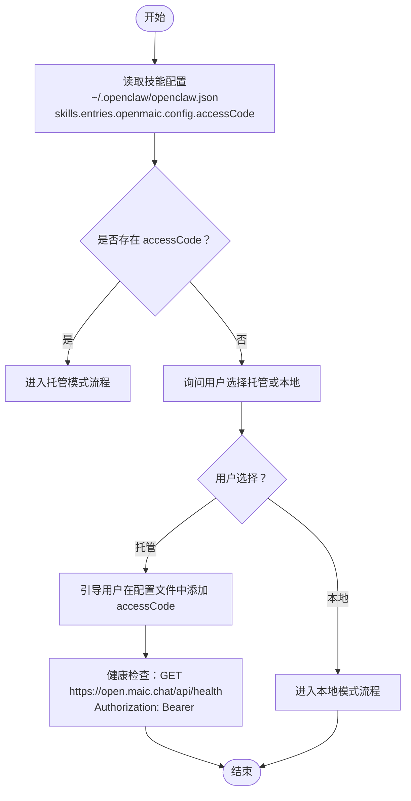
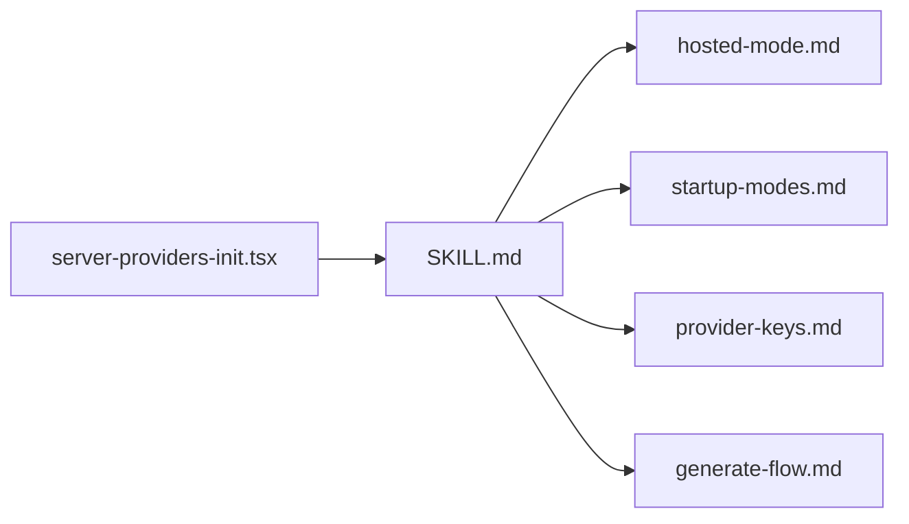
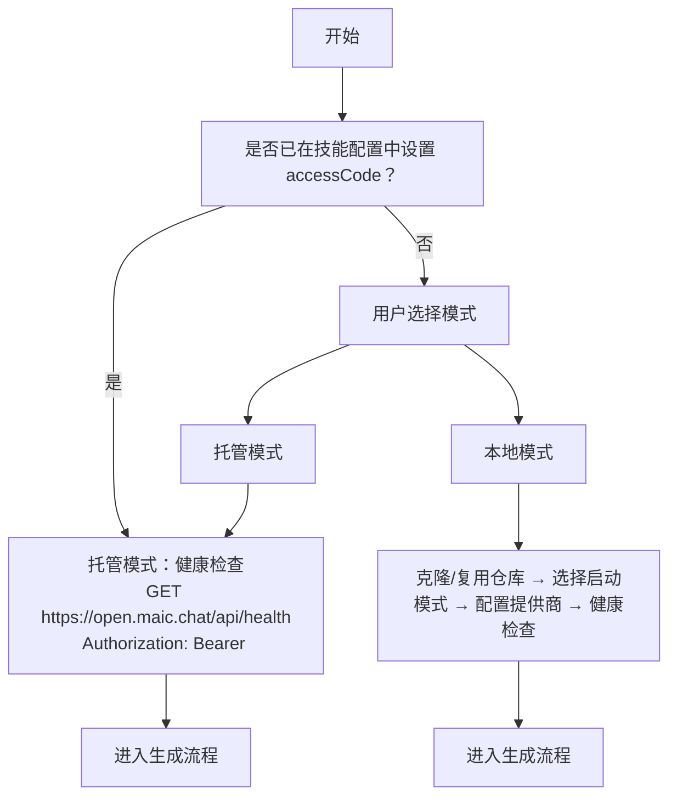

# 模式选择

<cite>
**本文引用的文件**
- [README.md](file://README.md)
- [SKILL.md](file://skills/openmaic/SKILL.md)
- [hosted-mode.md](file://skills/openmaic/references/hosted-mode.md)
- [startup-modes.md](file://skills/openmaic/references/startup-modes.md)
- [provider-keys.md](file://skills/openmaic/references/provider-keys.md)
- [generate-flow.md](file://skills/openmaic/references/generate-flow.md)
- [server-providers-init.tsx](file://components/server-providers-init.tsx)
</cite>

## 目录
1. [简介](#简介)
2. [项目结构](#项目结构)
3. [核心组件](#核心组件)
4. [架构总览](#架构总览)
5. [详细组件分析](#详细组件分析)
6. [依赖关系分析](#依赖关系分析)
7. [性能考量](#性能考量)
8. [故障排查指南](#故障排查指南)
9. [结论](#结论)
10. [附录](#附录)

## 简介
本文件聚焦 OpenMAIC 的“模式选择”阶段，系统性阐述托管模式与本地模式的差异、适用场景、优缺点对比，并给出基于仓库内现有文档的决策树与推荐场景。同时，结合 OpenClaw 技能中的 accessCode 自动检测机制与配置文件读取流程，说明如何在不直接粘贴密钥的前提下完成模式选择与后续生成流程；最后提供模式切换注意事项、迁移步骤以及用户选择对话示例与确认流程。

## 项目结构
围绕模式选择与配置的关键位置如下：
- OpenClaw 技能定义与模式选择流程：skills/openmaic/SKILL.md
- 托管模式参考文档：skills/openmaic/references/hosted-mode.md
- 本地启动模式参考文档：skills/openmaic/references/startup-modes.md
- 提供商密钥配置参考文档：skills/openmaic/references/provider-keys.md
- 生成流程参考文档：skills/openmaic/references/generate-flow.md
- 服务器端提供商初始化客户端组件：components/server-providers-init.tsx
- 顶层使用说明与部署指引：README.md

图表来源
- [SKILL.md:52-65](file://skills/openmaic/SKILL.md#L52-L65)
- [hosted-mode.md:1-30](file://skills/openmaic/references/hosted-mode.md#L1-L30)
- [startup-modes.md:1-70](file://skills/openmaic/references/startup-modes.md#L1-L70)
- [server-providers-init.tsx:1-19](file://components/server-providers-init.tsx#L1-L19)

章节来源
- [README.md:62-67](file://README.md#L62-L67)
- [SKILL.md:52-65](file://skills/openmaic/SKILL.md#L52-L65)

## 核心组件
- 模式选择器（OpenClaw 技能）
  - 负责在“托管模式”和“本地模式”之间进行选择，并根据技能配置自动检测 accessCode。
  - 若存在 accessCode，则直接进入托管模式流程，跳过克隆、配置与启动等本地准备阶段。
- 托管模式参考
  - 定义了通过 open.maic.chat 获取 accessCode 的方式、连接性验证方法、授权头格式、配额限制与错误处理策略。
- 本地启动模式参考
  - 提供开发模式、生产风格本地模式与 Docker Compose 三种启动方式及其权衡。
- 服务器提供商初始化组件
  - 应用挂载时从服务器拉取已配置的提供商列表，合并到本地设置状态中，确保生成与运行使用统一的后端配置。

章节来源
- [SKILL.md:52-65](file://skills/openmaic/SKILL.md#L52-L65)
- [hosted-mode.md:1-30](file://skills/openmaic/references/hosted-mode.md#L1-L30)
- [startup-modes.md:1-70](file://skills/openmaic/references/startup-modes.md#L1-L70)
- [server-providers-init.tsx:1-19](file://components/server-providers-init.tsx#L1-L19)

## 架构总览
下图展示了 OpenClaw 技能在模式选择阶段的交互与数据流，包括 accessCode 的读取、托管模式的健康检查与授权头注入，以及本地模式的启动与健康检查。

图表来源
- [SKILL.md:52-65](file://skills/openmaic/SKILL.md#L52-L65)
- [hosted-mode.md:1-30](file://skills/openmaic/references/hosted-mode.md#L1-L30)
- [startup-modes.md:1-70](file://skills/openmaic/references/startup-modes.md#L1-L70)
- [generate-flow.md:1-143](file://skills/openmaic/references/generate-flow.md#L1-L143)

## 详细组件分析

### 组件一：模式选择与 accessCode 自动检测
- 访问入口
  - OpenClaw 技能在“0. Choose Mode”阶段读取技能配置中的 accessCode 字段。
- 自动检测机制
  - 若配置中存在 accessCode，则直接进入托管模式，不再提示本地模式选项。
  - 若不存在，则向用户展示两种模式选项并等待确认。
- 配置文件读取流程
  - 技能配置位于 ~/.openclaw/openclaw.json，键路径为 skills.entries.openmaic.config.accessCode。
  - 托管模式参考文档明确指出：若未找到 accessCode，应指导用户编辑该 JSON 文件并设置 accessCode 字段，随后进行健康检查。
- 授权与生成差异
  - 托管模式使用固定基础地址与 Authorization: Bearer <accessCode> 头。
  - 本地模式使用用户指定的 url，并通过本地健康检查接口验证可用性。

图表来源
- [SKILL.md:27-51](file://skills/openmaic/SKILL.md#L27-L51)
- [hosted-mode.md:1-30](file://skills/openmaic/references/hosted-mode.md#L1-L30)

章节来源
- [SKILL.md:27-51](file://skills/openmaic/SKILL.md#L27-L51)
- [hosted-mode.md:1-30](file://skills/openmaic/references/hosted-mode.md#L1-L30)

### 组件二：托管模式特点与适用场景
- 快速启动优势
  - 无需本地安装与配置，直接获取 accessCode 即可开始生成。
  - 由托管服务负责运行与扩展，适合首次体验、临时演示或无运维资源的场景。
- 完全控制能力
  - 托管模式不提供本地控制能力；若需要完全控制，应选择本地模式。
- 授权与配额
  - 使用 Bearer Token 授权，每日独立配额限制，超出时返回 403。
- 错误处理
  - 401：accessCode 无效，建议检查或重新生成。
  - 403：配额耗尽，告知重置时间。
  - 500：服务器错误，建议稍后重试或切换本地模式。

章节来源
- [hosted-mode.md:19-39](file://skills/openmaic/references/hosted-mode.md#L19-L39)

### 组件三：本地模式特点与适用场景
- 特点
  - 可以完全掌控运行环境、模型与提供商配置，适合长期使用、私有化部署与定制化需求。
  - 支持多种启动方式：开发模式、生产风格本地模式、Docker Compose。
- 启动方式对比
  - 开发模式：反馈最快，便于调试，但与生产不完全一致。
  - 生产风格本地模式：更接近部署形态，启动较慢。
  - Docker Compose：隔离性更好，但启动与调试成本更高。
- 健康检查
  - 启动后通过 curl 访问 /api/health 验证服务可用性；若技能配置提供自定义 url，则使用该地址。

章节来源
- [startup-modes.md:1-70](file://skills/openmaic/references/startup-modes.md#L1-L70)

### 组件四：提供商配置与服务器侧一致性
- 关键边界
  - OpenMAIC 生成不复用 OpenClaw 当前模型或密钥；所有模型与提供商选择必须来自 OpenMAIC 服务器侧配置文件。
  - 不允许在请求时覆盖模型、提供商、API 密钥、基础地址或提供商类型。
- 推荐配置路径
  - 首次设置优先使用 .env.local；也可使用 server-providers.yml。
  - 若使用非默认提供商，需显式设置 DEFAULT_MODEL 并包含提供商前缀。
- 交互策略
  - 不直接要求用户提供密钥；先推荐路径，再询问配置位置，指导用户自行编辑配置文件。
  - 若生成失败，指引用户回到服务器侧配置文件修正后再试。

章节来源
- [provider-keys.md:1-147](file://skills/openmaic/references/provider-keys.md#L1-L147)

### 组件五：生成流程与健康检查
- 前置条件
  - 仓库路径确认、启动模式选定、服务健康、提供商密钥配置。
  - 托管模式下上述条件均已满足，仅需添加 Authorization 头。
- 作业提交与轮询
  - 提交生成作业后保存 jobId、pollUrl 与 pollIntervalMs。
  - 轮询间隔建议保守（约 60 秒），避免频繁请求导致超时或限流。
  - 仅当状态变为 succeeded 或 failed 时停止轮询。
- 结果输出
  - 成功时返回 classroomId 与可直接点击的教室链接（纯文本，不含加粗、Markdown 表格等格式）。
  - 失败时返回 jobID 与服务器错误信息，不尝试运行时覆盖修复。

章节来源
- [generate-flow.md:1-143](file://skills/openmaic/references/generate-flow.md#L1-L143)

### 组件六：服务器提供商初始化（客户端）
- 作用
  - 应用挂载时调用 fetchServerProviders，从服务器端拉取已配置的提供商列表并合并到本地设置状态。
- 影响
  - 确保前端 UI 与后端配置保持一致，避免因本地误配导致生成失败。

章节来源
- [server-providers-init.tsx:1-19](file://components/server-providers-init.tsx#L1-L19)

## 依赖关系分析
- OpenClaw 技能依赖于多个参考文档来驱动用户决策与操作：
  - SKILL.md 决定模式选择与阶段推进顺序。
  - hosted-mode.md 与 startup-modes.md 分别定义托管与本地的健康检查与授权方式。
  - provider-keys.md 规范服务器侧配置与交互策略。
  - generate-flow.md 描述生成作业提交、轮询与结果输出。
- 客户端组件 server-providers-init.tsx 依赖服务器端配置，确保前后端一致。

图表来源
- [SKILL.md:52-92](file://skills/openmaic/SKILL.md#L52-L92)
- [hosted-mode.md:1-30](file://skills/openmaic/references/hosted-mode.md#L1-L30)
- [startup-modes.md:1-70](file://skills/openmaic/references/startup-modes.md#L1-L70)
- [provider-keys.md:1-147](file://skills/openmaic/references/provider-keys.md#L1-L147)
- [generate-flow.md:1-143](file://skills/openmaic/references/generate-flow.md#L1-L143)
- [server-providers-init.tsx:1-19](file://components/server-providers-init.tsx#L1-L19)

章节来源
- [SKILL.md:52-92](file://skills/openmaic/SKILL.md#L52-L92)

## 性能考量
- 托管模式
  - 优点：启动极快、无需本地资源；缺点：网络延迟与配额限制可能影响体验。
- 本地模式
  - 开发模式反馈最快，适合调试；生产风格本地模式更贴近真实部署；Docker Compose 隔离性好但启动与排障成本较高。
- 生成轮询
  - 建议保守轮询间隔（约 60 秒），减少不必要的请求压力与失败重试。

## 故障排查指南
- 托管模式
  - 401：检查 accessCode 是否正确或重新生成；更新配置文件后再次健康检查。
  - 403：当日配额已用尽，等待次日午夜重置或切换本地模式。
  - 500：服务器内部错误，稍后重试或切换本地模式。
- 本地模式
  - 健康检查失败：确认启动命令与端口、防火墙与代理设置；必要时切换其他启动方式。
  - 生成失败：依据错误提示回到服务器侧配置文件修正（.env.local 或 server-providers.yml），再重试。

章节来源
- [hosted-mode.md:32-39](file://skills/openmaic/references/hosted-mode.md#L32-L39)
- [generate-flow.md:86-96](file://skills/openmaic/references/generate-flow.md#L86-L96)

## 结论
- 若追求“即刻可用”，优先托管模式；若需要“完全可控与私有化”，选择本地模式。
- accessCode 的自动检测与配置文件读取流程确保了用户在不直接粘贴敏感信息的情况下完成模式选择。
- 生成流程强调“服务器侧配置优先”，避免运行时覆盖带来的不确定性。
- 切换模式时务必遵循配置迁移与健康检查步骤，确保生成稳定可靠。

## 附录

### 模式选择决策树（基于仓库文档）

图表来源
- [SKILL.md:52-65](file://skills/openmaic/SKILL.md#L52-L65)
- [hosted-mode.md:1-30](file://skills/openmaic/references/hosted-mode.md#L1-L30)
- [startup-modes.md:1-70](file://skills/openmaic/references/startup-modes.md#L1-L70)
- [generate-flow.md:1-143](file://skills/openmaic/references/generate-flow.md#L1-L143)

### 推荐场景
- 托管模式适用于：
  - 首次体验、临时演示、无运维资源或希望快速上手的用户。
- 本地模式适用于：
  - 需要私有化部署、长期使用、定制化模型与提供商、或对数据主权有严格要求的团队。

### 模式切换注意事项与迁移步骤
- 切换至托管模式
  - 在 ~/.openclaw/openclaw.json 中设置 accessCode；执行健康检查；按托管模式参考文档进行生成。
- 切换至本地模式
  - 准备仓库与依赖；选择启动模式并启动服务；执行健康检查；配置提供商密钥；按本地生成流程进行生成。
- 迁移配置
  - 将服务器侧配置（.env.local 或 server-providers.yml）从旧环境复制到新环境；确保 DEFAULT_MODEL 与提供商前缀正确。

### 用户选择对话示例与确认流程
- 示例对话
  - 技能：您希望如何使用 OpenMAIC？
  - 用户：托管模式
  - 技能：请在 ~/.openclaw/openclaw.json 中设置 accessCode 字段，完成后我将为您执行健康检查。
  - 用户：已设置
  - 技能：正在检查连接，请稍候。
  - 技能：连接成功，现在可以开始生成课堂。
- 确认要求
  - 对于任何会改变状态的操作（如克隆、安装、启动、生成），均需用户明确确认。
  - 生成前若用户已明确表达生成意图，可省略二次确认。

章节来源
- [SKILL.md:12-26](file://skills/openmaic/SKILL.md#L12-L26)
- [hosted-mode.md:1-30](file://skills/openmaic/references/hosted-mode.md#L1-L30)
- [startup-modes.md:66-70](file://skills/openmaic/references/startup-modes.md#L66-L70)
- [generate-flow.md:139-143](file://skills/openmaic/references/generate-flow.md#L139-L143)