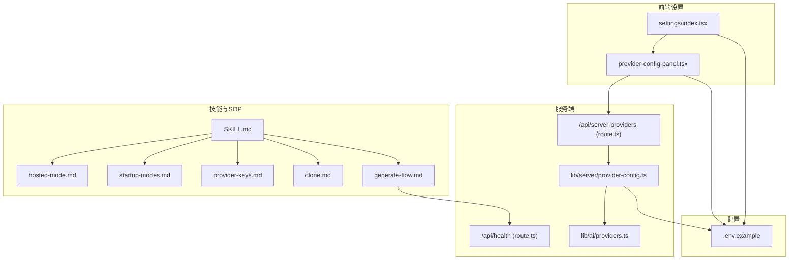
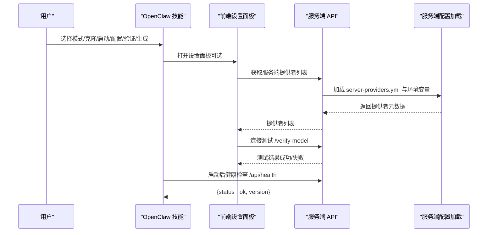
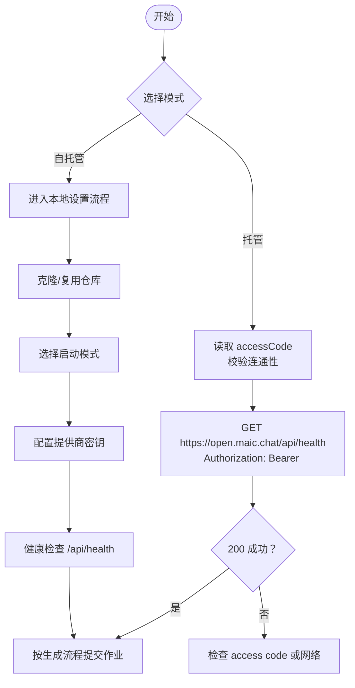
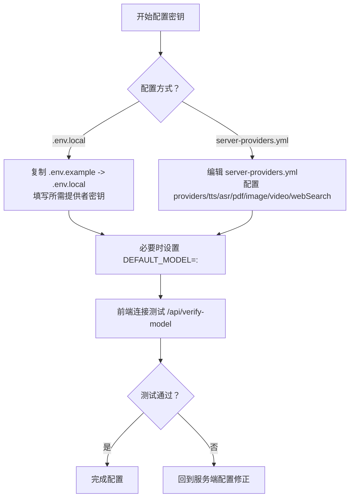
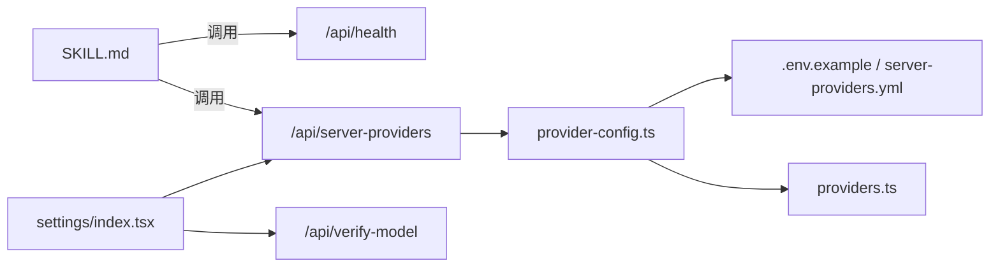

# 设置流程

<cite>
**本文引用的文件**
- [README.md](file://README.md)
- [SKILL.md](file://skills/openmaic/SKILL.md)
- [hosted-mode.md](file://skills/openmaic/references/hosted-mode.md)
- [startup-modes.md](file://skills/openmaic/references/startup-modes.md)
- [provider-keys.md](file://skills/openmaic/references/provider-keys.md)
- [clone.md](file://skills/openmaic/references/clone.md)
- [generate-flow.md](file://skills/openmaic/references/generate-flow.md)
- [route.ts（健康检查）](file://app/api/health/route.ts)
- [package.json](file://package.json)
- [.env.example](file://.env.example)
- [settings/index.tsx](file://components/settings/index.tsx)
- [provider-config-panel.tsx](file://components/settings/provider-config-panel.tsx)
- [provider-config.ts](file://lib/server/provider-config.ts)
- [route.ts（服务端提供者列表）](file://app/api/server-providers/route.ts)
- [providers.ts](file://lib/ai/providers.ts)
</cite>

## 目录
1. [简介](#简介)
2. [项目结构](#项目结构)
3. [核心组件](#核心组件)
4. [架构总览](#架构总览)
5. [详细组件分析](#详细组件分析)
6. [依赖关系分析](#依赖关系分析)
7. [性能考量](#性能考量)
8. [故障排查指南](#故障排查指南)
9. [结论](#结论)
10. [附录](#附录)

## 简介
本文件面向首次部署与日常维护 OpenMAIC 的用户，系统化梳理“设置流程”的五个核心阶段：模式选择、仓库克隆、启动模式配置、提供商密钥配置、服务器验证。同时对比“托管模式”与“自托管模式”的差异与适用场景，给出启动模式的优缺点与推荐顺序，并详述提供商密钥的配置方法与安全注意事项。最后提供服务器健康检查步骤、验证标准、常见问题排查与实际操作示例。

## 项目结构
OpenMAIC 基于 Next.js App Router 构建，核心设置流程由 OpenClaw 技能（skills/openmaic）引导，配合服务端 API 与前端设置面板完成。关键目录与文件如下：
- 技能与参考文档：skills/openmaic 及其 references 下的 SOP 文档
- 服务端 API：app/api/* 提供健康检查、服务端提供者列表等接口
- 配置加载：lib/server/provider-config.ts 负责从 YAML 与环境变量加载服务端配置
- 前端设置：components/settings/* 提供密钥与模型配置界面
- 示例配置：.env.example 展示可用的环境变量键名

**图表来源**
- [SKILL.md:52-92](file://skills/openmaic/SKILL.md#L52-L92)
- [startup-modes.md:1-70](file://skills/openmaic/references/startup-modes.md#L1-L70)
- [provider-keys.md:1-147](file://skills/openmaic/references/provider-keys.md#L1-L147)
- [clone.md:1-39](file://skills/openmaic/references/clone.md#L1-L39)
- [generate-flow.md:1-143](file://skills/openmaic/references/generate-flow.md#L1-L143)
- [route.ts（健康检查）:1-8](file://app/api/health/route.ts#L1-L8)
- [route.ts（服务端提供者列表）:1-35](file://app/api/server-providers/route.ts#L1-L35)
- [provider-config.ts:1-177](file://lib/server/provider-config.ts#L1-L177)
- [providers.ts:1-800](file://lib/ai/providers.ts#L1-L800)
- [.env.example:1-124](file://.env.example#L1-L124)

**章节来源**
- [README.md:372-426](file://README.md#L372-L426)
- [package.json:1-124](file://package.json#L1-L124)

## 核心组件
- OpenClaw 技能（SOP 引导器）
  - 将设置拆分为“模式选择—克隆—启动—配置密钥—验证—生成”五步，每步均要求确认，避免误操作。
- 服务端健康检查
  - 提供统一健康检查端点，返回状态与版本信息，作为启动后验证的关键步骤。
- 服务端提供者配置加载
  - 支持 server-providers.yml 与环境变量双通道，优先级为环境变量覆盖 YAML；仅暴露提供者元数据，不泄露密钥。
- 前端设置面板
  - 提供密钥输入、连接测试、模型管理与重置等功能，支持“服务端已配置”提示与自动保存。

**章节来源**
- [SKILL.md:52-92](file://skills/openmaic/SKILL.md#L52-L92)
- [route.ts（健康检查）:1-8](file://app/api/health/route.ts#L1-L8)
- [provider-config.ts:1-177](file://lib/server/provider-config.ts#L1-L177)
- [settings/index.tsx:1-800](file://components/settings/index.tsx#L1-L800)
- [provider-config-panel.tsx:1-403](file://components/settings/provider-config-panel.tsx#L1-L403)

## 架构总览
下图展示从 OpenClaw 技能到服务端 API 与前端设置的整体交互路径，以及配置加载链路。

**图表来源**
- [SKILL.md:52-92](file://skills/openmaic/SKILL.md#L52-L92)
- [route.ts（服务端提供者列表）:1-35](file://app/api/server-providers/route.ts#L1-L35)
- [provider-config.ts:1-177](file://lib/server/provider-config.ts#L1-L177)
- [provider-config-panel.tsx:110-150](file://components/settings/provider-config-panel.tsx#L110-L150)
- [route.ts（健康检查）:1-8](file://app/api/health/route.ts#L1-L8)

## 详细组件分析

### 模式选择：托管模式 vs 自托管模式
- 托管模式
  - 通过访问码（access code）直接连接 open.maic.chat，无需本地安装。
  - 适合快速体验与无运维需求的用户。
- 自托管模式
  - 本地克隆仓库、安装依赖、配置密钥、选择启动方式（开发/生产/容器），适合需要完全控制或离线使用的场景。

**图表来源**
- [hosted-mode.md:1-39](file://skills/openmaic/references/hosted-mode.md#L1-L39)
- [SKILL.md:52-64](file://skills/openmaic/SKILL.md#L52-L64)
- [route.ts（健康检查）:1-8](file://app/api/health/route.ts#L1-L8)

**章节来源**
- [hosted-mode.md:1-39](file://skills/openmaic/references/hosted-mode.md#L1-L39)
- [SKILL.md:52-64](file://skills/openmaic/SKILL.md#L52-L64)

### 仓库克隆
- 目标：确定本地使用的 OpenMAIC 代码检出位置。
- 行为：检测现有检出、询问是否复用；若无则建议克隆并安装依赖。
- 注意：脏工作区需明确提示风险。

**章节来源**
- [clone.md:1-39](file://skills/openmaic/references/clone.md#L1-L39)

### 启动模式配置
- 三种启动方式与权衡
  - 开发模式（pnpm dev）：最快反馈，便于调试，但与生产启动不完全一致。
  - 生产类本地（pnpm build && pnpm start）：更接近部署行为，启动较慢。
  - Docker Compose：隔离性好，但启动与排障成本更高。
- 推荐顺序：开发 > 生产类本地 > Docker
- 健康检查：启动后执行 curl -fsS http://localhost:3000/api/health

**章节来源**
- [startup-modes.md:1-70](file://skills/openmaic/references/startup-modes.md#L1-L70)

### 提供商密钥配置
- 配置入口
  - 优先使用 .env.local（最简配置路径）
  - 备选 server-providers.yml（适合复杂多提供者场景）
- 推荐路径
  - 最低摩擦：配置一个主要提供者的密钥即可快速起步
  - 更佳速度/成本平衡：推荐 Google 并显式设置 DEFAULT_MODEL=google:gemini-3-flash-preview
  - 复用既有提供者：保留已有 OpenAI/DeepSeek 等密钥
- 关键规则
  - 明确提供者前缀（如 google:、anthropic:、openai:、deepseek:），否则默认解析为 OpenAI
  - 不在请求时临时覆盖模型/提供者，应修改服务端配置
  - 若生成失败，指引回到服务端配置修正后再试
- 安全要点
  - 密钥仅在服务端生效，前端仅做连接测试与 UI 管理
  - 不在聊天中粘贴密钥；遵循“先推荐，再让用户自行编辑配置文件”的原则

**图表来源**
- [provider-keys.md:1-147](file://skills/openmaic/references/provider-keys.md#L1-L147)
- [provider-config-panel.tsx:110-150](file://components/settings/provider-config-panel.tsx#L110-L150)
- [provider-config.ts:119-168](file://lib/server/provider-config.ts#L119-L168)
- [.env.example:1-124](file://.env.example#L1-L124)

**章节来源**
- [provider-keys.md:1-147](file://skills/openmaic/references/provider-keys.md#L1-L147)
- [provider-config-panel.tsx:1-403](file://components/settings/provider-config-panel.tsx#L1-L403)
- [provider-config.ts:1-177](file://lib/server/provider-config.ts#L1-L177)
- [.env.example:1-124](file://.env.example#L1-L124)

### 服务器验证
- 健康检查端点：GET /api/health
- 返回字段：status（通常为 ok）、version（来自包版本）
- 建议：启动后立即执行，确保服务正常运行

**章节来源**
- [route.ts（健康检查）:1-8](file://app/api/health/route.ts#L1-L8)
- [startup-modes.md:56-64](file://skills/openmaic/references/startup-modes.md#L56-L64)

### 生成教室（可选）
- 前置条件：仓库路径确认、启动模式已选、服务健康、密钥已配置
- 提交作业：POST /api/generate-classroom（仅发送受支持字段）
- 轮询：GET /api/generate-classroom/{jobId}，建议保守轮询间隔（约 60 秒）
- 失败处理：依据服务端错误返回，不尝试在请求层修复提供者/模型配置

**章节来源**
- [generate-flow.md:1-143](file://skills/openmaic/references/generate-flow.md#L1-L143)

## 依赖关系分析
- 技能层依赖
  - SOP 文档定义了严格的状态机与确认机制，确保每一步都可回溯与可控
- 前端依赖
  - 设置面板依赖服务端提供者列表与连接测试接口，用于密钥与模型配置
- 服务端依赖
  - 配置加载模块从 YAML 与环境变量合并配置，提供者注册表定义模型能力与默认参数
- 运行时依赖
  - Next.js 16、React 19、TypeScript、Tailwind CSS 等

**图表来源**
- [SKILL.md:52-92](file://skills/openmaic/SKILL.md#L52-L92)
- [route.ts（健康检查）:1-8](file://app/api/health/route.ts#L1-L8)
- [route.ts（服务端提供者列表）:1-35](file://app/api/server-providers/route.ts#L1-L35)
- [provider-config.ts:1-177](file://lib/server/provider-config.ts#L1-L177)
- [providers.ts:1-800](file://lib/ai/providers.ts#L1-L800)
- [settings/index.tsx:1-800](file://components/settings/index.tsx#L1-L800)

**章节来源**
- [package.json:1-124](file://package.json#L1-L124)

## 性能考量
- 启动模式选择
  - 开发模式反馈最快，适合频繁改动配置
  - 生产类本地更贴近真实部署，启动时间较长
  - Docker 启动与调试成本较高，适合隔离与标准化部署
- 生成作业轮询
  - 建议保守轮询（约 60 秒），避免过于频繁导致资源压力
  - 单次对话内限制轮询时长，避免超时或中断

[本节为通用建议，不涉及具体文件分析]

## 故障排查指南
- 访问码无效（托管模式）
  - 现象：401 Unauthorized
  - 处理：重新在 open.maic.chat 生成访问码并更新配置
- 配额耗尽（托管模式）
  - 现象：403 Daily quota exhausted
  - 处理：等待至次日午夜重置或切换到自托管
- 服务器内部错误（托管/自托管）
  - 现象：500 Internal Error
  - 处理：稍后重试或切换到另一种启动方式
- 健康检查失败
  - 现象：/api/health 无法访问或返回异常
  - 处理：确认启动命令正确、端口占用、进程状态；检查代理与防火墙
- 提供商/模型配置错误
  - 现象：生成失败，返回提供者或模型相关错误
  - 处理：回到服务端配置（.env.local 或 server-providers.yml）修正密钥、模型字符串前缀与默认模型

**章节来源**
- [hosted-mode.md:32-39](file://skills/openmaic/references/hosted-mode.md#L32-L39)
- [generate-flow.md:86-96](file://skills/openmaic/references/generate-flow.md#L86-L96)
- [provider-keys.md:139-147](file://skills/openmaic/references/provider-keys.md#L139-L147)

## 结论
OpenMAIC 的设置流程以 OpenClaw 技能为核心，结合服务端健康检查与前端设置面板，形成“可确认、可回退、可验证”的闭环。托管模式适合快速体验，自托管模式适合深度定制与离线使用。密钥与模型配置应集中在服务端配置文件中，避免在请求层临时覆盖。通过严格的 SOP 与稳健的健康检查，可显著降低部署与运维门槛。

[本节为总结性内容，不涉及具体文件分析]

## 附录

### 实际操作示例与截图说明
- 模式选择
  - 在 OpenClaw 中选择“使用托管 OpenMAIC”或“运行本地”，根据提示确认下一步
- 仓库克隆
  - 若存在检出，确认复用；否则执行克隆与依赖安装
- 启动模式
  - 选择开发模式进行快速验证，或生产类本地/容器以贴近部署
- 配置提供商密钥
  - 复制 .env.example 为 .env.local，填写所需提供者密钥；必要时设置 DEFAULT_MODEL
  - 使用前端“连接测试”按钮验证配置
- 服务器验证
  - 启动后立即访问 http://localhost:3000/api/health，确认返回 {status: "ok", version}
- 生成教室（可选）
  - 提交生成作业并按建议轮询，直至 succeeded 或 failed

[本节为操作性说明，不涉及具体文件分析]