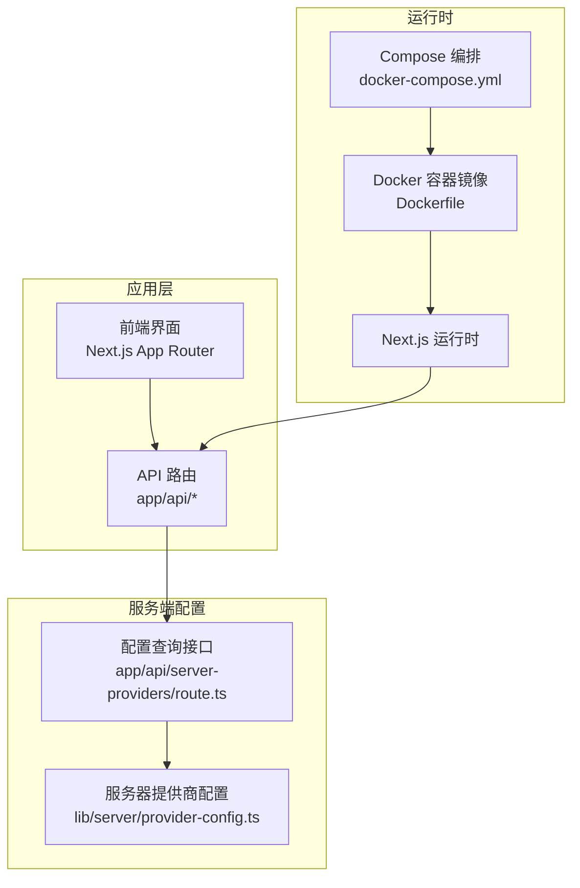
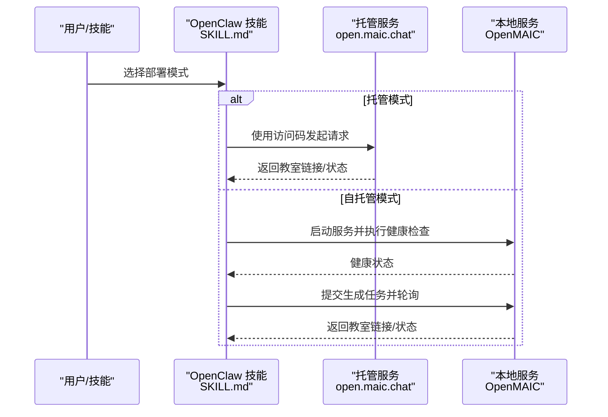
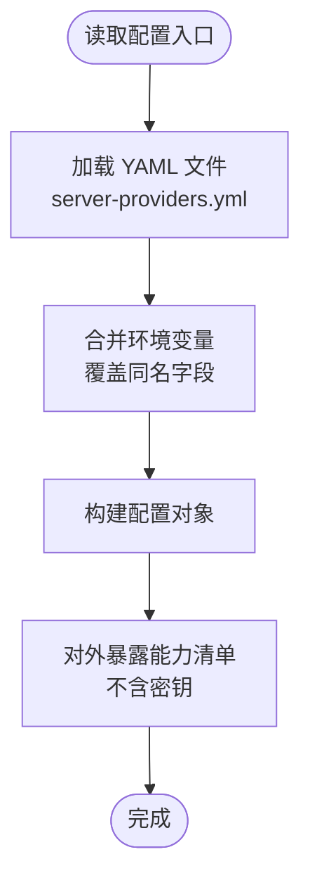
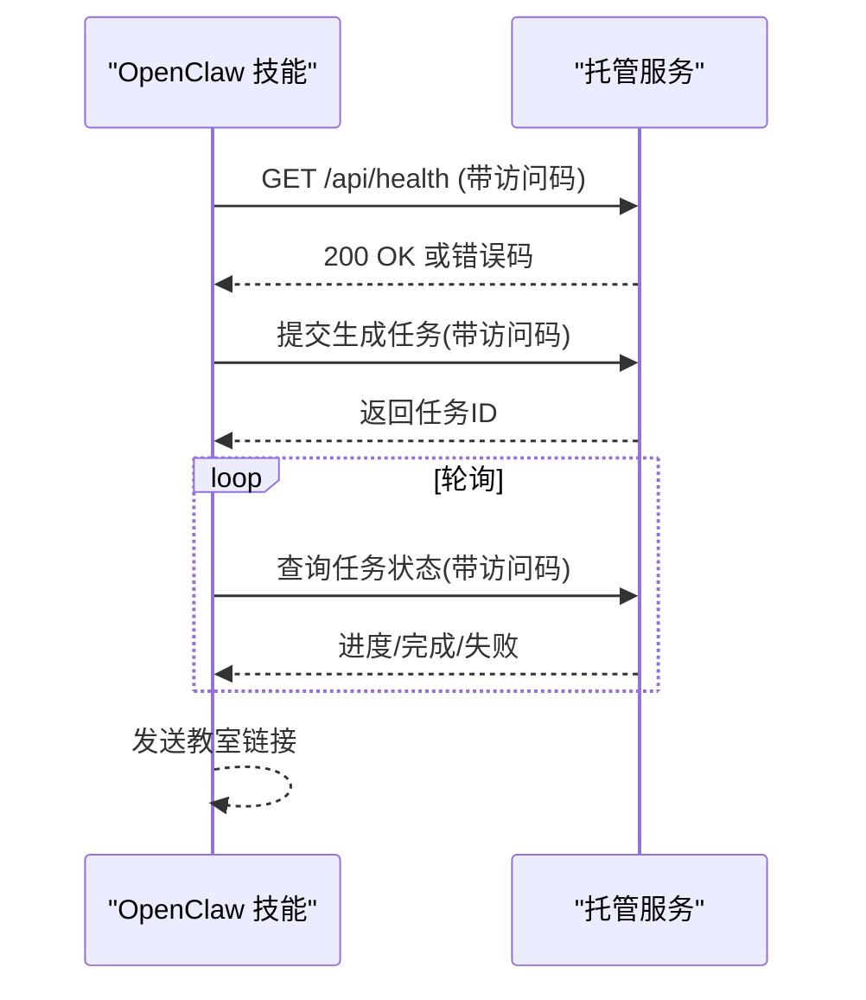
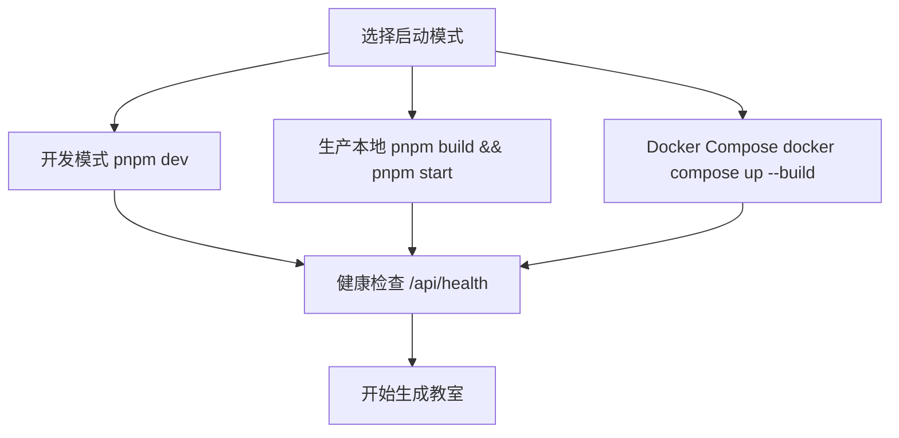
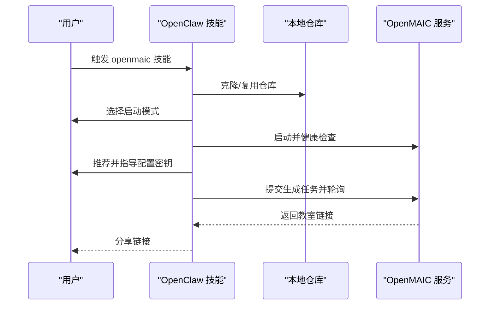
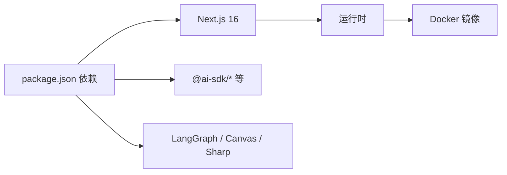

# 部署配置

<cite>
**本文引用的文件**
- [README.md](file://README.md)
- [Dockerfile](file://Dockerfile)
- [docker-compose.yml](file://docker-compose.yml)
- [package.json](file://package.json)
- [next.config.ts](file://next.config.ts)
- [skills/openmaic/SKILL.md](file://skills/openmaic/SKILL.md)
- [skills/openmaic/references/hosted-mode.md](file://skills/openmaic/references/hosted-mode.md)
- [skills/openmaic/references/startup-modes.md](file://skills/openmaic/references/startup-modes.md)
- [skills/openmaic/references/provider-keys.md](file://skills/openmaic/references/provider-keys.md)
- [lib/server/provider-config.ts](file://lib/server/provider-config.ts)
- [app/api/server-providers/route.ts](file://app/api/server-providers/route.ts)
</cite>

## 目录
1. [简介](#简介)
2. [项目结构](#项目结构)
3. [核心组件](#核心组件)
4. [架构总览](#架构总览)
5. [详细组件分析](#详细组件分析)
6. [依赖关系分析](#依赖关系分析)
7. [性能考虑](#性能考虑)
8. [故障排查指南](#故障排查指南)
9. [结论](#结论)
10. [附录](#附录)

## 简介
本文件面向运维与平台工程团队，系统性梳理 OpenMAIC 的部署配置与实施流程，覆盖以下主题：
- 托管模式（云端）与自托管模式（本地）两种部署形态的配置要点与操作步骤
- ClawHub/OpenClaw 集成的配置方法与认证机制
- 服务器配置文件（环境变量与 YAML）的参数说明与调优建议
- 网络配置、防火墙与域名绑定的实践
- 环境变量设置与敏感信息安全管理
- 容器化部署与 Kubernetes 集群部署的参考配置
- 监控、日志与故障恢复策略

## 项目结构
OpenMAIC 基于 Next.js 16 构建，采用 App Router 组织 API 路由与页面；服务端通过独立的“服务器提供商配置”模块加载 LLM/TTS/ASR/PDF/Image/Video/WebSearch 等能力的后端配置，并以只暴露元数据的方式对外提供接口。

图表来源
- [next.config.ts:1-13](file://next.config.ts#L1-L13)
- [Dockerfile:1-52](file://Dockerfile#L1-L52)
- [docker-compose.yml:1-16](file://docker-compose.yml#L1-L16)
- [lib/server/provider-config.ts:1-245](file://lib/server/provider-config.ts#L1-L245)
- [app/api/server-providers/route.ts:1-34](file://app/api/server-providers/route.ts#L1-L34)

章节来源
- [README.md:372-426](file://README.md#L372-L426)
- [next.config.ts:1-13](file://next.config.ts#L1-L13)
- [Dockerfile:1-52](file://Dockerfile#L1-L52)
- [docker-compose.yml:1-16](file://docker-compose.yml#L1-L16)
- [lib/server/provider-config.ts:1-245](file://lib/server/provider-config.ts#L1-L245)
- [app/api/server-providers/route.ts:1-34](file://app/api/server-providers/route.ts#L1-L34)

## 核心组件
- 服务器提供商配置模块：负责从 YAML 与环境变量加载后端能力配置，支持 LLM、TTS、ASR、PDF、图像、视频、网页搜索等分类，且仅对外暴露元数据，不回传密钥。
- 服务器提供商查询接口：对外提供当前已配置的能力清单，便于前端或技能侧进行选择与展示。
- 启动模式与健康检查：提供开发、生产本地与 Docker 三种启动方式，并在技能中内置健康检查命令。
- 托管模式接入：通过访问码（Access Code）与云端服务交互，技能侧提供统一的生成流程与错误处理映射。

章节来源
- [lib/server/provider-config.ts:1-245](file://lib/server/provider-config.ts#L1-L245)
- [app/api/server-providers/route.ts:1-34](file://app/api/server-providers/route.ts#L1-L34)
- [skills/openmaic/references/startup-modes.md:1-70](file://skills/openmaic/references/startup-modes.md#L1-L70)
- [skills/openmaic/references/hosted-mode.md:1-39](file://skills/openmaic/references/hosted-mode.md#L1-L39)

## 架构总览
下图展示 OpenMAIC 在不同部署模式下的关键交互路径与配置来源：

图表来源
- [skills/openmaic/SKILL.md:52-93](file://skills/openmaic/SKILL.md#L52-L93)
- [skills/openmaic/references/hosted-mode.md:19-39](file://skills/openmaic/references/hosted-mode.md#L19-L39)
- [skills/openmaic/references/startup-modes.md:56-64](file://skills/openmaic/references/startup-modes.md#L56-L64)

## 详细组件分析

### 组件一：服务器提供商配置与查询
- 配置来源优先级：YAML（主）> 环境变量（备）
- 支持能力分类：providers（LLM）、tts、asr、pdf、image、video、webSearch
- 对外暴露：仅返回能力 ID、基础地址与模型列表，不包含密钥
- 解析规则：支持为不同供应商设置 API Key、基础地址、模型白名单与代理

图表来源
- [lib/server/provider-config.ts:101-168](file://lib/server/provider-config.ts#L101-L168)
- [lib/server/provider-config.ts:179-206](file://lib/server/provider-config.ts#L179-L206)
- [app/api/server-providers/route.ts:15-34](file://app/api/server-providers/route.ts#L15-L34)

章节来源
- [lib/server/provider-config.ts:1-245](file://lib/server/provider-config.ts#L1-L245)
- [app/api/server-providers/route.ts:1-34](file://app/api/server-providers/route.ts#L1-L34)

### 组件二：托管模式（云端）与认证
- 访问码来源：open.maic.chat 获取
- 认证方式：所有请求携带 Authorization: Bearer <access-code>
- 生成流程：提交异步任务，轮询直至完成，返回教室链接
- 错误映射：401（无效访问码）、403（配额耗尽）、500（服务器错误）

图表来源
- [skills/openmaic/references/hosted-mode.md:14-39](file://skills/openmaic/references/hosted-mode.md#L14-L39)

章节来源
- [skills/openmaic/references/hosted-mode.md:1-39](file://skills/openmaic/references/hosted-mode.md#L1-L39)

### 组件三：自托管模式（本地）启动与健康检查
- 启动方式：开发模式、生产本地模式、Docker Compose
- 健康检查：curl -fsS http://localhost:3000/api/health
- 技能侧确认：每次变更需用户确认，避免黑盒自动化

图表来源
- [skills/openmaic/references/startup-modes.md:9-64](file://skills/openmaic/references/startup-modes.md#L9-L64)

章节来源
- [skills/openmaic/references/startup-modes.md:1-70](file://skills/openmaic/references/startup-modes.md#L1-L70)

### 组件四：ClawHub/OpenClaw 集成与配置
- 技能入口：openmaic 技能提供引导式 SOP，分阶段执行（克隆、启动模式、配置密钥、启动验证、生成）
- 可选配置：~/.openclaw/openclaw.json 中可预设 accessCode、repoDir、url
- 安全边界：OpenMAIC 不复用 OpenClaw 当前模型/密钥，生成使用 OpenMAIC 服务器端配置

图表来源
- [skills/openmaic/SKILL.md:52-93](file://skills/openmaic/SKILL.md#L52-L93)
- [skills/openmaic/references/clone.md:1-39](file://skills/openmaic/references/clone.md#L1-L39)
- [skills/openmaic/references/provider-keys.md:1-147](file://skills/openmaic/references/provider-keys.md#L1-L147)

章节来源
- [skills/openmaic/SKILL.md:1-101](file://skills/openmaic/SKILL.md#L1-L101)
- [skills/openmaic/references/clone.md:1-39](file://skills/openmaic/references/clone.md#L1-L39)
- [skills/openmaic/references/provider-keys.md:1-147](file://skills/openmaic/references/provider-keys.md#L1-L147)

## 依赖关系分析
- 运行时依赖：Next.js 16、Node.js 22（容器镜像中启用 pnpm 与构建工具链）
- 构建产物：standalone 输出（非 Vercel 环境），便于容器化运行
- 外部包：多供应商 SDK（OpenAI、Anthropic、Google）、LangGraph、Canvas、Sharp 等

图表来源
- [package.json:15-94](file://package.json#L15-L94)
- [Dockerfile:1-52](file://Dockerfile#L1-L52)
- [next.config.ts:1-13](file://next.config.ts#L1-L13)

章节来源
- [package.json:1-124](file://package.json#L1-L124)
- [Dockerfile:1-52](file://Dockerfile#L1-L52)
- [next.config.ts:1-13](file://next.config.ts#L1-L13)

## 性能考虑
- 构建与运行分离：Dockerfile 采用多阶段构建，减少运行镜像体积
- 依赖安装优化：启用 corepack 与 pnpm，锁定版本
- 二进制依赖：容器中预装 Cairo/Pango/JPEG/GIFLib/RSVG，满足图像处理需求
- 输出模式：standalone 适合容器化部署，减少冷启动开销

章节来源
- [Dockerfile:1-52](file://Dockerfile#L1-L52)
- [next.config.ts:1-13](file://next.config.ts#L1-L13)
- [package.json:116-123](file://package.json#L116-L123)

## 故障排查指南
- 健康检查失败
  - 检查端口与主机绑定（容器默认 0.0.0.0:3000）
  - 确认环境变量与 YAML 配置是否正确加载
  - 查看服务端日志输出
- 认证错误（托管模式）
  - 401：访问码无效或过期，前往 open.maic.chat 重新获取
  - 403：当日配额耗尽，等待重置或切换自托管
  - 500：服务端异常，稍后重试或切换模式
- 生成失败（自托管）
  - 检查 LLM/TTS/ASR/PDF/Image/Video/WebSearch 的 API Key 与模型字符串前缀
  - 确保 DEFAULT_MODEL 与供应商前缀匹配（如 google:gemini-3-flash-preview）

章节来源
- [skills/openmaic/references/hosted-mode.md:32-39](file://skills/openmaic/references/hosted-mode.md#L32-L39)
- [skills/openmaic/references/provider-keys.md:83-95](file://skills/openmaic/references/provider-keys.md#L83-L95)
- [skills/openmaic/references/startup-modes.md:56-64](file://skills/openmaic/references/startup-modes.md#L56-L64)

## 结论
OpenMAIC 提供了清晰的双模式部署路径与安全可控的配置边界。通过服务器端配置模块与 OpenClaw 技能的协同，既可快速上手托管模式，也可灵活落地自托管与容器化方案。建议在生产环境中结合健康检查、日志与监控体系，确保服务稳定可用。

## 附录

### A. 部署模式与实施步骤

- 托管模式（云端）
  - 步骤
    - 在 open.maic.chat 获取访问码
    - 在技能配置中写入 accessCode（可选）
    - 使用技能提交生成任务并轮询结果
  - 关键点
    - 请求头携带 Authorization: Bearer <access-code>
    - 日配额限制与错误映射需关注

- 自托管模式（本地）
  - 步骤
    - 克隆仓库并安装依赖
    - 配置至少一个 LLM 供应商的 API Key
    - 选择启动模式（开发/生产本地/Docker）
    - 健康检查通过后提交生成任务
  - 关键点
    - 服务器端配置优先 YAML，环境变量可覆盖
    - 生成使用 OpenMAIC 服务器端配置，不复用技能当前模型/密钥

章节来源
- [skills/openmaic/references/hosted-mode.md:1-39](file://skills/openmaic/references/hosted-mode.md#L1-L39)
- [skills/openmaic/references/startup-modes.md:1-70](file://skills/openmaic/references/startup-modes.md#L1-L70)
- [skills/openmaic/references/clone.md:1-39](file://skills/openmaic/references/clone.md#L1-L39)
- [skills/openmaic/references/provider-keys.md:1-147](file://skills/openmaic/references/provider-keys.md#L1-L147)

### B. 服务器配置文件与参数说明

- server-providers.yml（主配置）
  - 位置：项目根目录
  - 字段：providers、tts、asr、pdf、image、video、web-search
  - 示例：见 README 中 YAML 配置片段

- .env.local（环境变量）
  - 位置：项目根目录
  - 建议：优先使用 .env.local，便于本地管理
  - 示例：见 README 中环境变量片段

- DEFAULT_MODEL
  - 作用：指定默认模型，需包含供应商前缀
  - 示例：google:gemini-3-flash-preview

- 模型字符串规则
  - 必须包含供应商前缀，否则解析为 OpenAI 模型

章节来源
- [README.md:94-117](file://README.md#L94-L117)
- [skills/openmaic/references/provider-keys.md:83-95](file://skills/openmaic/references/provider-keys.md#L83-L95)

### C. 网络配置、防火墙与域名绑定

- 端口与主机
  - 容器默认监听 0.0.0.0:3000
  - Docker Compose 将宿主机 3000 映射到容器 3000

- 健康检查
  - curl -fsS http://localhost:3000/api/health

- 域名与反向代理
  - 建议通过 Nginx/Traefik 等反向代理暴露 HTTPS
  - 注意代理最大请求体大小与 WebSocket 支持（Next.js SSE）

章节来源
- [Dockerfile:34-49](file://Dockerfile#L34-L49)
- [docker-compose.yml:4-5](file://docker-compose.yml#L4-L5)
- [skills/openmaic/references/startup-modes.md:56-64](file://skills/openmaic/references/startup-modes.md#L56-L64)
- [next.config.ts:7-9](file://next.config.ts#L7-L9)

### D. 环境变量与敏感信息管理

- 环境变量前缀映射（LLM）
  - OPENAI、ANTHROPIC、GOOGLE、DEEPSEEK、QWEN、KIMI、MINIMAX、GLM、SILICONFLOW、DOUBAO
- 覆盖规则
  - 同名字段以环境变量为准
- 安全边界
  - 服务器端不回传密钥，仅暴露能力 ID、基础地址与模型列表

章节来源
- [lib/server/provider-config.ts:40-51](file://lib/server/provider-config.ts#L40-L51)
- [lib/server/provider-config.ts:119-168](file://lib/server/provider-config.ts#L119-L168)

### E. 容器化部署与 Kubernetes 集群部署

- 容器化部署
  - 基于 Dockerfile 构建镜像
  - 使用 docker-compose.yml 启动服务，挂载数据卷与可选 server-providers.yml
  - 生产建议：使用只读挂载 server-providers.yml，避免容器内修改

- Kubernetes 部署要点
  - Deployment：副本数、资源限制与就绪/存活探针
  - Service：ClusterIP/NodePort/LoadBalancer
  - ConfigMap：server-providers.yml 内容
  - Secret：.env.local 中的敏感变量
  - Ingress：TLS 与路径转发
  - 数据持久化：PersistentVolume（用于缓存/临时文件）

章节来源
- [Dockerfile:1-52](file://Dockerfile#L1-L52)
- [docker-compose.yml:1-16](file://docker-compose.yml#L1-L16)

### F. 监控、日志与故障恢复

- 监控
  - 健康检查端点：/api/health
  - 业务指标：生成任务成功率、平均耗时、错误分布
- 日志
  - 服务端日志输出（按模块记录）
  - 容器日志采集（stdout/stderr）
- 故障恢复
  - 健康检查失败：重启 Pod/容器
  - 认证错误（托管模式）：更新访问码或切换自托管
  - 生成失败：修正服务器端配置后重试

章节来源
- [app/api/server-providers/route.ts:15-34](file://app/api/server-providers/route.ts#L15-L34)
- [skills/openmaic/references/hosted-mode.md:32-39](file://skills/openmaic/references/hosted-mode.md#L32-L39)