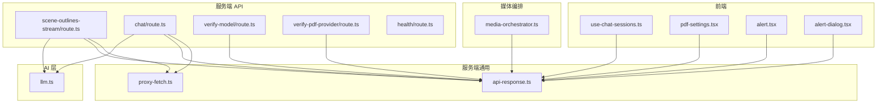
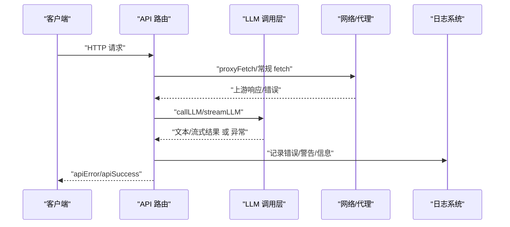
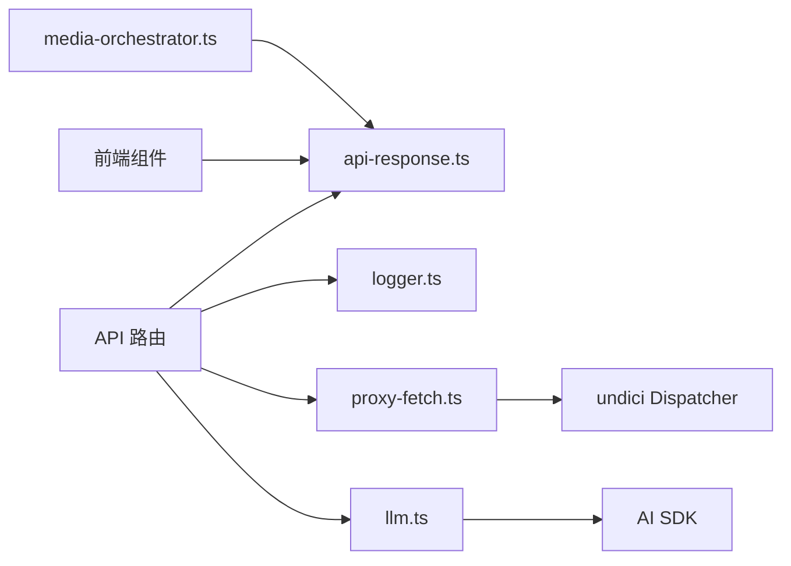

# 错误处理

<cite>
**本文引用的文件**
- [logger.ts](file://lib/logger.ts)
- [api-response.ts](file://lib/server/api-response.ts)
- [proxy-fetch.ts](file://lib/server/proxy-fetch.ts)
- [scene-outlines-stream/route.ts](file://app/api/generate/scene-outlines-stream/route.ts)
- [chat/route.ts](file://app/api/chat/route.ts)
- [verify-model/route.ts](file://app/api/verify-model/route.ts)
- [verify-pdf-provider/route.ts](file://app/api/verify-pdf-provider/route.ts)
- [llm.ts](file://lib/ai/llm.ts)
- [media-orchestrator.ts](file://lib/media/media-orchestrator.ts)
- [use-chat-sessions.ts](file://components/chat/use-chat-sessions.ts)
- [pdf-settings.tsx](file://components/settings/pdf-settings.tsx)
- [hosted-mode.md](file://skills/openmaic/references/hosted-mode.md)
- [health/route.ts](file://app/api/health/route.ts)
- [alert.tsx](file://components/ui/alert.tsx)
- [alert-dialog.tsx](file://components/ui/alert-dialog.tsx)
</cite>

## 目录
1. [简介](#简介)
2. [项目结构](#项目结构)
3. [核心组件](#核心组件)
4. [架构总览](#架构总览)
5. [详细组件分析](#详细组件分析)
6. [依赖关系分析](#依赖关系分析)
7. [性能考量](#性能考量)
8. [故障排除指南](#故障排除指南)
9. [结论](#结论)
10. [附录](#附录)

## 简介
本文件系统性梳理 OpenMAIC 的错误处理体系，覆盖网络连接错误、认证失败、配置错误与生成异常等常见场景，解释诊断方法（日志、状态检查）、恢复策略（重试与降级）、用户友好提示设计，并给出性能问题识别与优化建议、故障排除清单与调试技巧，以及如何收集与上报错误信息以获得更好技术支持。

## 项目结构
OpenMAIC 的错误处理贯穿服务端 API、AI 调用层、媒体编排层与前端 UI 组件，形成“统一错误码 + 结构化响应 + 日志记录 + 用户提示”的闭环。

图表来源
- [scene-outlines-stream/route.ts:1-362](file://app/api/generate/scene-outlines-stream/route.ts#L1-L362)
- [chat/route.ts:88-129](file://app/api/chat/route.ts#L88-L129)
- [verify-model/route.ts:48-68](file://app/api/verify-model/route.ts#L48-L68)
- [verify-pdf-provider/route.ts:42-57](file://app/api/verify-pdf-provider/route.ts#L42-L57)
- [api-response.ts:1-46](file://lib/server/api-response.ts#L1-L46)
- [proxy-fetch.ts:48-70](file://lib/server/proxy-fetch.ts#L48-L70)
- [llm.ts:285-359](file://lib/ai/llm.ts#L285-L359)
- [media-orchestrator.ts:74-115](file://lib/media/media-orchestrator.ts#L74-L115)
- [use-chat-sessions.ts:785-822](file://components/chat/use-chat-sessions.ts#L785-L822)
- [pdf-settings.tsx:76-99](file://components/settings/pdf-settings.tsx#L76-L99)
- [alert.tsx:1-74](file://components/ui/alert.tsx#L1-L74)
- [alert-dialog.tsx:1-183](file://components/ui/alert-dialog.tsx#L1-L183)

章节来源
- [scene-outlines-stream/route.ts:1-362](file://app/api/generate/scene-outlines-stream/route.ts#L1-L362)
- [api-response.ts:1-46](file://lib/server/api-response.ts#L1-L46)

## 核心组件
- 统一错误码与响应体：定义标准错误码与响应结构，确保前后端一致的错误语义与可解析格式。
- 日志系统：支持级别过滤、JSON 输出、错误堆栈/消息格式化，便于集中化日志采集与检索。
- 代理与网络：封装 fetch，自动适配代理环境，降低网络层不确定性。
- LLM 调用与重试：统一的调用包装，支持验证失败重试与流式心跳保活，提升稳定性。
- 媒体生成与回退：在全局开关关闭时主动标记失败，避免无效尝试；支持重试标记与清理持久化失败记录。
- 前端错误展示：对话会话中注入错误消息；设置页测试连接结果反馈；UI 组件提供警示样式与对话框。

章节来源
- [api-response.ts:3-45](file://lib/server/api-response.ts#L3-L45)
- [logger.ts:1-53](file://lib/logger.ts#L1-L53)
- [proxy-fetch.ts:48-70](file://lib/server/proxy-fetch.ts#L48-L70)
- [llm.ts:263-359](file://lib/ai/llm.ts#L263-L359)
- [media-orchestrator.ts:74-115](file://lib/media/media-orchestrator.ts#L74-L115)
- [use-chat-sessions.ts:785-822](file://components/chat/use-chat-sessions.ts#L785-L822)
- [pdf-settings.tsx:76-99](file://components/settings/pdf-settings.tsx#L76-L99)
- [alert.tsx:1-74](file://components/ui/alert.tsx#L1-L74)
- [alert-dialog.tsx:1-183](file://components/ui/alert-dialog.tsx#L1-L183)

## 架构总览
下图展示从请求进入 API 到错误响应或成功返回的关键路径，以及日志与代理在网络层的作用。

图表来源
- [scene-outlines-stream/route.ts:99-361](file://app/api/generate/scene-outlines-stream/route.ts#L99-L361)
- [chat/route.ts:88-129](file://app/api/chat/route.ts#L88-L129)
- [llm.ts:285-359](file://lib/ai/llm.ts#L285-L359)
- [proxy-fetch.ts:52-70](file://lib/server/proxy-fetch.ts#L52-L70)
- [logger.ts:28-52](file://lib/logger.ts#L28-L52)

## 详细组件分析

### 统一错误码与响应体
- 设计要点
  - 定义一组稳定错误码，覆盖必填字段缺失、密钥缺失、请求非法、URL 非法、重定向限制、敏感内容、上游错误、生成失败、转写失败、解析失败、内部错误等。
  - 统一响应体包含 success、errorCode、error、details 字段，便于前端解析与展示。
- 使用方式
  - API 路由在参数校验失败或运行时异常时，调用 apiError 返回标准化错误。
  - 成功时使用 apiSuccess 返回 { success: true, ... }。
- 最佳实践
  - 对于网络/上游错误，优先映射到 UPSTREAM_ERROR 并保留原始错误信息。
  - 对于业务规则错误（如配额耗尽），使用对应业务错误码并在 details 中补充上下文。

章节来源
- [api-response.ts:3-45](file://lib/server/api-response.ts#L3-L45)

### 日志系统
- 设计要点
  - 支持 debug/info/warn/error 四级日志，可通过环境变量控制最小输出级别与 JSON 输出格式。
  - 自动格式化时间戳、级别、标签与消息，对 Error 对象输出 stack 或 message。
- 使用方式
  - 各模块通过 createLogger(tag) 创建带标签的日志器，按需输出。
  - 在网络层、AI 层、API 层均进行关键事件与异常记录。
- 最佳实践
  - 将敏感信息脱敏后再写入日志。
  - 在生产环境启用 JSON 格式，便于日志平台解析。

章节来源
- [logger.ts:1-53](file://lib/logger.ts#L1-L53)

### 代理与网络层
- 设计要点
  - 提供 proxyFetch 作为 fetch 的代理封装，自动读取代理配置并使用 undici Dispatcher。
  - 未配置代理时回退为原生 fetch，保证兼容性。
- 故障定位
  - 连接被拒绝、域名不可达、超时等错误在上游路由中被识别并转换为用户可理解的消息。
- 最佳实践
  - 在容器/边缘部署环境中，优先通过环境变量配置代理，减少网络波动影响。

章节来源
- [proxy-fetch.ts:48-70](file://lib/server/proxy-fetch.ts#L48-L70)
- [verify-pdf-provider/route.ts:42-57](file://app/api/verify-pdf-provider/route.ts#L42-L57)

### LLM 调用与重试
- 设计要点
  - callLLM 支持“验证失败重试”（retries + validate），默认验证非空字符串，避免空结果。
  - streamLLM 提供流式接口，配合心跳保活避免代理/浏览器断开。
  - 对 OpenAI 兼容模型，通过 thinkingContext 注入供应商特定参数。
- 重试策略
  - 验证失败时按配置重试；网络异常由 AI SDK 内部重试（maxRetries）与上层 validate 双重保障。
- 最佳实践
  - 对长耗时流式任务，开启心跳定时器；对易抖动的上游，适当提高 retries 并实现幂等消费。

章节来源
- [llm.ts:263-359](file://lib/ai/llm.ts#L263-L359)
- [scene-outlines-stream/route.ts:197-247](file://app/api/generate/scene-outlines-stream/route.ts#L197-L247)

### 媒体生成与降级
- 设计要点
  - 若全局开关禁用某类媒体生成，则直接标记失败，避免无效尝试。
  - 清理持久化失败记录，允许重新生成。
  - 对可重试的任务，标记 pending-for-retry 并触发重新生成。
- 最佳实践
  - 在 UI 上明确显示“生成已禁用”的原因与开关位置，减少用户困惑。

章节来源
- [media-orchestrator.ts:74-115](file://lib/media/media-orchestrator.ts#L74-L115)

### 前端错误展示与引导
- 对话错误注入
  - 在会话中注入一条错误消息，标注来源与时间，便于用户定位问题。
- 设置页测试反馈
  - 测试 PDF/模型等连接时，根据后端返回的 success/error 与 error 字段更新 UI 状态与提示文案。
- UI 组件
  - 使用警示类样式与对话框组件，突出错误信息并提供操作入口（如重试、查看日志）。

章节来源
- [use-chat-sessions.ts:785-822](file://components/chat/use-chat-sessions.ts#L785-L822)
- [pdf-settings.tsx:76-99](file://components/settings/pdf-settings.tsx#L76-L99)
- [alert.tsx:1-74](file://components/ui/alert.tsx#L1-L74)
- [alert-dialog.tsx:1-183](file://components/ui/alert-dialog.tsx#L1-L183)

## 依赖关系分析
- 模块耦合
  - API 路由依赖统一响应体与日志系统；部分路由还依赖代理网络层。
  - LLM 调用层向上游提供统一接口，向下兼容多种供应商。
  - 媒体编排层依赖全局设置与数据库键空间，负责失败清理与重试标记。
  - 前端组件依赖后端响应结构与 UI 组件库，负责错误可视化与交互。
- 外部依赖
  - Next.js/NextResponse 用于标准化响应。
  - AI SDK 的 generateText/streamText 用于大模型调用。
  - undici 的 Dispatcher 用于代理网络。

图表来源
- [api-response.ts:1-46](file://lib/server/api-response.ts#L1-L46)
- [logger.ts:1-53](file://lib/logger.ts#L1-L53)
- [proxy-fetch.ts:48-70](file://lib/server/proxy-fetch.ts#L48-L70)
- [llm.ts:1-13](file://lib/ai/llm.ts#L1-L13)
- [media-orchestrator.ts:74-115](file://lib/media/media-orchestrator.ts#L74-L115)
- [scene-outlines-stream/route.ts:1-36](file://app/api/generate/scene-outlines-stream/route.ts#L1-L36)

## 性能考量
- 心跳保活
  - 流式接口使用心跳注释维持连接，避免代理/浏览器超时导致的中断。
- 重试与验证
  - 对空结果或解析失败进行有限次数重试，减少失败率；同时避免无限循环。
- 日志级别
  - 生产环境建议提升最小日志级别，减少 IO 压力；必要时切换 JSON 格式便于异步处理。
- 代理与网络
  - 在高延迟/不稳定网络中启用代理并复用连接，有助于降低握手成本。

章节来源
- [chat/route.ts:96-116](file://app/api/chat/route.ts#L96-L116)
- [scene-outlines-stream/route.ts:221-247](file://app/api/generate/scene-outlines-stream/route.ts#L221-L247)
- [llm.ts:263-275](file://lib/ai/llm.ts#L263-L275)
- [logger.ts:4-11](file://lib/logger.ts#L4-L11)
- [proxy-fetch.ts:48-70](file://lib/server/proxy-fetch.ts#L48-L70)

## 故障排除指南

### 常见错误类型与处理策略
- 网络连接错误
  - 现象：连接被拒绝、域名不可达、超时。
  - 处理：在上游路由中识别错误特征并返回用户可理解的消息；必要时切换本地模式或检查代理配置。
  - 参考
    - [verify-pdf-provider/route.ts:42-57](file://app/api/verify-pdf-provider/route.ts#L42-L57)
    - [verify-model/route.ts:48-68](file://app/api/verify-model/route.ts#L48-L68)
- 认证失败
  - 现象：401 未授权、访问码无效。
  - 处理：提示用户检查访问码或重新生成；Hosted 模式下建议切换到本地模式。
  - 参考
    - [hosted-mode.md:32-39](file://skills/openmaic/references/hosted-mode.md#L32-L39)
- 配置错误
  - 现象：必填字段缺失、URL 非法、上游错误。
  - 处理：返回对应错误码与详情；前端设置页提供测试连接反馈。
  - 参考
    - [api-response.ts:3-15](file://lib/server/api-response.ts#L3-L15)
    - [pdf-settings.tsx:76-99](file://components/settings/pdf-settings.tsx#L76-L99)
- 生成异常
  - 现象：空结果、解析失败、上游服务错误。
  - 处理：流式任务进行有限次重试并通知客户端；最终失败时返回错误事件；LLM 层支持验证失败重试。
  - 参考
    - [scene-outlines-stream/route.ts:248-315](file://app/api/generate/scene-outlines-stream/route.ts#L248-L315)
    - [llm.ts:305-335](file://lib/ai/llm.ts#L305-L335)

### 诊断方法与工具
- 日志分析
  - 设置 LOG_LEVEL 与 LOG_FORMAT，结合错误标签快速定位模块与调用源。
  - 关注 warn/error 级别日志中的错误堆栈与上下文。
- 状态检查
  - 使用健康检查接口确认服务可用性。
  - 参考
    - [health/route.ts:1-8](file://app/api/health/route.ts#L1-L8)
- 端到端验证
  - 使用设置页测试 PDF/模型提供方连通性，观察 success/error 与 error 字段。
  - 参考
    - [pdf-settings.tsx:76-99](file://components/settings/pdf-settings.tsx#L76-L99)

### 错误恢复步骤与最佳实践
- 重试机制
  - 对空结果/解析失败采用有限次数重试；对网络/上游错误依赖 AI SDK 与自定义重试。
  - 参考
    - [scene-outlines-stream/route.ts:221-315](file://app/api/generate/scene-outlines-stream/route.ts#L221-L315)
    - [llm.ts:292-335](file://lib/ai/llm.ts#L292-L335)
- 降级策略
  - 全局禁用某类媒体生成时立即失败并提示；清理持久化失败记录以便后续重试。
  - 参考
    - [media-orchestrator.ts:74-115](file://lib/media/media-orchestrator.ts#L74-L115)
- 用户引导
  - 在对话中注入错误消息；在设置页展示测试结果；使用 UI 组件强调错误并提供操作按钮。
  - 参考
    - [use-chat-sessions.ts:785-822](file://components/chat/use-chat-sessions.ts#L785-L822)
    - [alert.tsx:1-74](file://components/ui/alert.tsx#L1-L74)
    - [alert-dialog.tsx:1-183](file://components/ui/alert-dialog.tsx#L1-L183)

### 用户友好错误消息设计
- 明确性：将技术错误映射为用户可理解的语言（如“服务器未找到，请检查 Base URL”）。
- 可操作性：提供下一步建议（重试、检查网络、切换模式）。
- 一致性：统一错误码与响应结构，前端按相同逻辑渲染。

章节来源
- [verify-model/route.ts:48-68](file://app/api/verify-model/route.ts#L48-L68)
- [verify-pdf-provider/route.ts:42-57](file://app/api/verify-pdf-provider/route.ts#L42-L57)
- [hosted-mode.md:32-39](file://skills/openmaic/references/hosted-mode.md#L32-L39)
- [pdf-settings.tsx:76-99](file://components/settings/pdf-settings.tsx#L76-L99)

### 性能问题识别与优化
- 识别
  - 长时间空闲导致连接断开：启用心跳。
  - 重试风暴：限制最大重试次数与退避策略。
  - 日志噪声：提升最小日志级别或切换 JSON 格式。
- 优化
  - 代理复用连接，减少握手开销。
  - 对易抖动上游增加验证失败重试窗口与幂等消费。

章节来源
- [chat/route.ts:96-116](file://app/api/chat/route.ts#L96-L116)
- [scene-outlines-stream/route.ts:221-247](file://app/api/generate/scene-outlines-stream/route.ts#L221-L247)
- [proxy-fetch.ts:48-70](file://lib/server/proxy-fetch.ts#L48-L70)
- [logger.ts:4-11](file://lib/logger.ts#L4-L11)

### 故障排除检查清单
- 网络与代理
  - 是否正确配置代理？是否能直连？上游服务可达？
  - 参考
    - [proxy-fetch.ts:48-70](file://lib/server/proxy-fetch.ts#L48-L70)
- 认证与配额
  - 访问码是否有效？是否超过配额？服务端返回的状态码含义？
  - 参考
    - [hosted-mode.md:32-39](file://skills/openmaic/references/hosted-mode.md#L32-L39)
- 参数与配置
  - 必填字段是否齐全？URL 是否合法？上游错误码是否明确？
  - 参考
    - [api-response.ts:3-15](file://lib/server/api-response.ts#L3-L15)
- 生成流程
  - 是否出现空结果或解析失败？是否触发了有限次重试？最终错误事件是否正确下发？
  - 参考
    - [scene-outlines-stream/route.ts:248-336](file://app/api/generate/scene-outlines-stream/route.ts#L248-L336)
    - [llm.ts:305-335](file://lib/ai/llm.ts#L305-L335)
- 前端展示
  - 设置页测试是否返回 success/error 与 error 字段？对话中是否注入了错误消息？
  - 参考
    - [pdf-settings.tsx:76-99](file://components/settings/pdf-settings.tsx#L76-L99)
    - [use-chat-sessions.ts:785-822](file://components/chat/use-chat-sessions.ts#L785-L822)

### 调试技巧
- 启用更细粒度日志：临时将 LOG_LEVEL 降至 debug，观察关键路径。
- 复现最小化：使用独立脚本或 curl 直接调用 API，剔除前端干扰。
- 分层排查：先检查代理/网络，再检查认证与参数，最后检查上游服务状态。
- 观察 SSE：在流式接口中留意 retry 事件与 error 事件，确认重试与失败路径。

章节来源
- [logger.ts:4-11](file://lib/logger.ts#L4-L11)
- [scene-outlines-stream/route.ts:286-342](file://app/api/generate/scene-outlines-stream/route.ts#L286-L342)

### 如何收集与上报错误信息
- 收集
  - 日志：提供时间戳、级别、标签、错误消息与堆栈；必要时附上请求 ID。
  - 环境：Node 版本、依赖版本、代理配置、网络拓扑。
  - 行为：重现步骤、期望 vs 实际、截图/录屏。
- 上报
  - 使用统一错误码与 details 字段描述业务上下文。
  - 在 Issue 模板中填写“复现步骤、期望行为、实际行为、日志片段、环境信息”。

章节来源
- [api-response.ts:19-45](file://lib/server/api-response.ts#L19-L45)
- [logger.ts:13-26](file://lib/logger.ts#L13-L26)

## 结论
OpenMAIC 的错误处理体系以“统一错误码 + 结构化响应 + 日志记录 + 用户引导”为核心，覆盖网络、认证、配置与生成全链路。通过有限重试、心跳保活、代理适配与 UI 友好提示，显著提升了稳定性与用户体验。建议在生产环境中严格控制日志级别与格式，完善健康检查与监控告警，并持续优化重试策略与前端引导文案。

## 附录

### API 错误码速查
- 缺少必填字段、缺少 API 密钥、请求非法、URL 非法、不允许重定向、内容敏感、上游错误、生成失败、转写失败、解析失败、内部错误。

章节来源
- [api-response.ts:3-15](file://lib/server/api-response.ts#L3-L15)