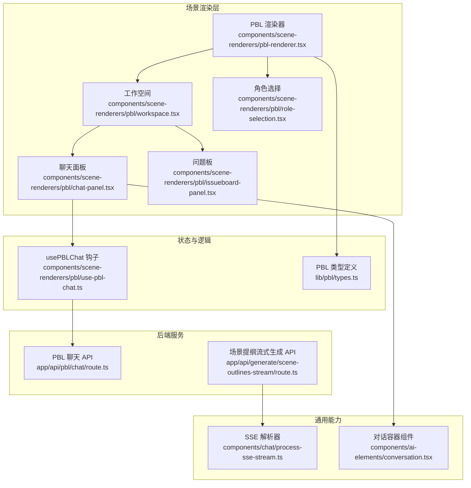
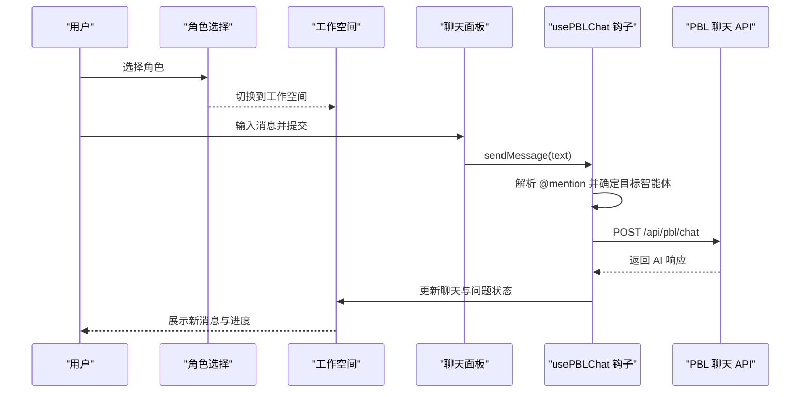
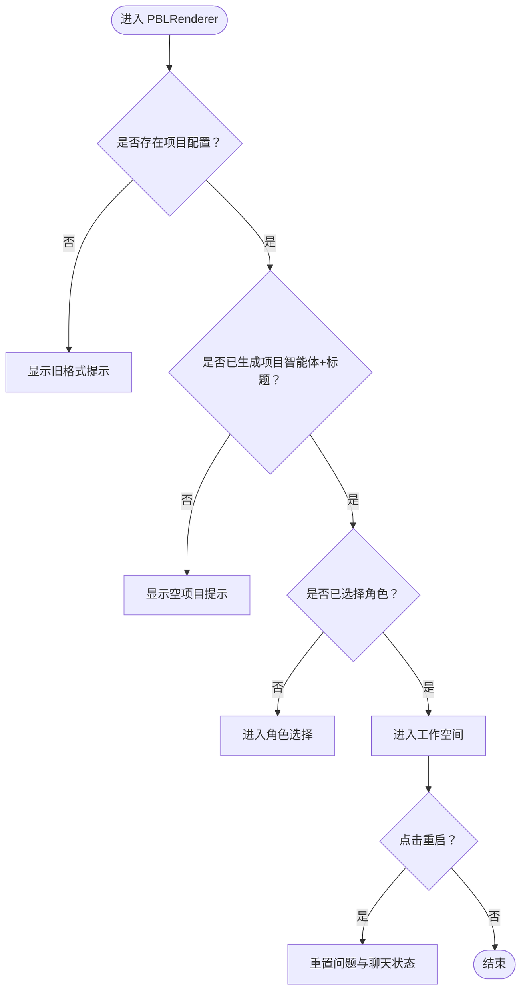
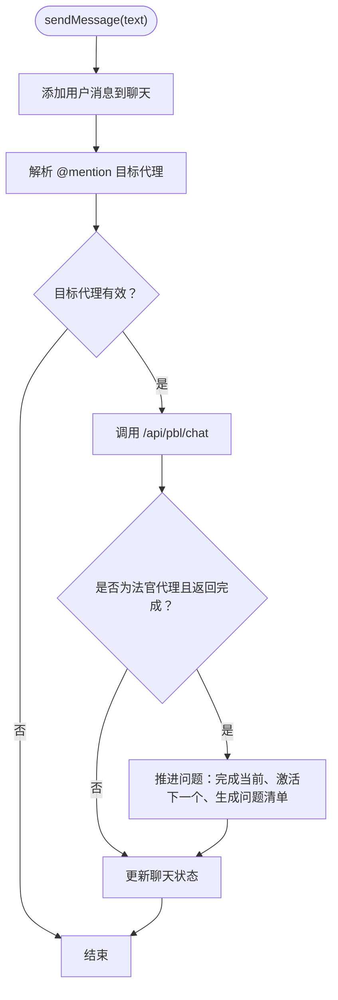
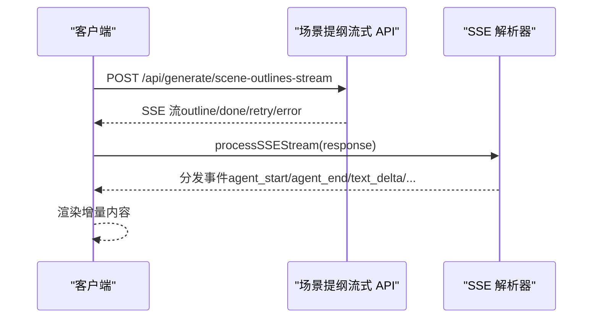
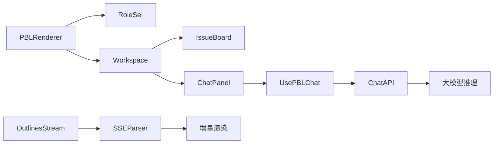

# PBL 场景渲染器

<cite>
**本文引用的文件**
- [app/api/pbl/chat/route.ts](file://app/api/pbl/chat/route.ts)
- [components/scene-renderers/pbl-renderer.tsx](file://components/scene-renderers/pbl-renderer.tsx)
- [components/scene-renderers/pbl/workspace.tsx](file://components/scene-renderers/pbl/workspace.tsx)
- [components/scene-renderers/pbl/chat-panel.tsx](file://components/scene-renderers/pbl/chat-panel.tsx)
- [components/scene-renderers/pbl/issueboard-panel.tsx](file://components/scene-renderers/pbl/issueboard-panel.tsx)
- [components/scene-renderers/pbl/role-selection.tsx](file://components/scene-renderers/pbl/role-selection.tsx)
- [components/scene-renderers/pbl/use-pbl-chat.ts](file://components/scene-renderers/pbl/use-pbl-chat.ts)
- [lib/pbl/types.ts](file://lib/pbl/types.ts)
- [components/chat/process-sse-stream.ts](file://components/chat/process-sse-stream.ts)
- [app/api/generate/scene-outlines-stream/route.ts](file://app/api/generate/scene-outlines-stream/route.ts)
- [components/ai-elements/conversation.tsx](file://components/ai-elements/conversation.tsx)
</cite>

## 目录
1. [简介](#简介)
2. [项目结构](#项目结构)
3. [核心组件](#核心组件)
4. [架构总览](#架构总览)
5. [详细组件分析](#详细组件分析)
6. [依赖关系分析](#依赖关系分析)
7. [性能考量](#性能考量)
8. [故障排查指南](#故障排查指南)
9. [结论](#结论)
10. [附录：配置与自定义开发指南](#附录配置与自定义开发指南)

## 简介
本技术文档面向 PBL（项目式学习）场景渲染器，系统性阐述其前端渲染架构与后端服务接口，重点覆盖以下方面：
- 工作空间、聊天面板、问题板与角色选择等核心 UI 组件
- 多智能体交互实现（AI 教师与同伴协作）
- 项目式学习工作流程（任务分配、进度跟踪、成果展示）
- 实时通信机制（SSE 流式传输与 WebSocket 连接）
- 配置项与自定义开发指南
- 多智能体编排的实际案例与最佳实践

## 项目结构
PBL 渲染器由“场景渲染器 + 子面板 + 聊天钩子 + 类型定义 + 后端 API”构成，采用模块化设计，便于扩展与维护。

图表来源
- [components/scene-renderers/pbl-renderer.tsx:17-128](file://components/scene-renderers/pbl-renderer.tsx#L17-L128)
- [components/scene-renderers/pbl/workspace.tsx:19-92](file://components/scene-renderers/pbl/workspace.tsx#L19-L92)
- [components/scene-renderers/pbl/role-selection.tsx:13-63](file://components/scene-renderers/pbl/role-selection.tsx#L13-L63)
- [components/scene-renderers/pbl/chat-panel.tsx:19-151](file://components/scene-renderers/pbl/chat-panel.tsx#L19-L151)
- [components/scene-renderers/pbl/issueboard-panel.tsx:10-49](file://components/scene-renderers/pbl/issueboard-panel.tsx#L10-L49)
- [components/scene-renderers/pbl/use-pbl-chat.ts:21-129](file://components/scene-renderers/pbl/use-pbl-chat.ts#L21-L129)
- [lib/pbl/types.ts:63-69](file://lib/pbl/types.ts#L63-L69)
- [app/api/pbl/chat/route.ts:25-74](file://app/api/pbl/chat/route.ts#L25-L74)
- [app/api/generate/scene-outlines-stream/route.ts:99-361](file://app/api/generate/scene-outlines-stream/route.ts#L99-L361)
- [components/chat/process-sse-stream.ts:12-122](file://components/chat/process-sse-stream.ts#L12-L122)
- [components/ai-elements/conversation.tsx:12-87](file://components/ai-elements/conversation.tsx#L12-L87)

章节来源
- [components/scene-renderers/pbl-renderer.tsx:17-128](file://components/scene-renderers/pbl-renderer.tsx#L17-L128)
- [components/scene-renderers/pbl/workspace.tsx:19-92](file://components/scene-renderers/pbl/workspace.tsx#L19-L92)
- [components/scene-renderers/pbl/role-selection.tsx:13-63](file://components/scene-renderers/pbl/role-selection.tsx#L13-L63)
- [components/scene-renderers/pbl/chat-panel.tsx:19-151](file://components/scene-renderers/pbl/chat-panel.tsx#L19-L151)
- [components/scene-renderers/pbl/issueboard-panel.tsx:10-49](file://components/scene-renderers/pbl/issueboard-panel.tsx#L10-L49)
- [components/scene-renderers/pbl/use-pbl-chat.ts:21-129](file://components/scene-renderers/pbl/use-pbl-chat.ts#L21-L129)
- [lib/pbl/types.ts:63-69](file://lib/pbl/types.ts#L63-L69)
- [app/api/pbl/chat/route.ts:25-74](file://app/api/pbl/chat/route.ts#L25-L74)
- [app/api/generate/scene-outlines-stream/route.ts:99-361](file://app/api/generate/scene-outlines-stream/route.ts#L99-L361)
- [components/chat/process-sse-stream.ts:12-122](file://components/chat/process-sse-stream.ts#L12-L122)
- [components/ai-elements/conversation.tsx:12-87](file://components/ai-elements/conversation.tsx#L12-L87)

## 核心组件
- PBL 渲染器：根据项目配置决定显示角色选择或工作空间，并负责更新场景状态。
- 角色选择：筛选可选智能体，支持学生选择参与角色。
- 工作空间：左右布局，左侧问题板，右侧聊天面板；提供重启确认与引导面板。
- 问题板：展示问题列表、完成进度与状态标签。
- 聊天面板：输入草稿缓存、@提及解析、语音转写集成、消息渲染与加载态。
- usePBLChat 钩子：统一处理消息发送、@提及路由、调用后端 API、完成判定与问题推进。
- 类型定义：标准化 PBL 的项目信息、智能体、问题、聊天消息与项目配置。

章节来源
- [components/scene-renderers/pbl-renderer.tsx:17-128](file://components/scene-renderers/pbl-renderer.tsx#L17-L128)
- [components/scene-renderers/pbl/role-selection.tsx:13-63](file://components/scene-renderers/pbl/role-selection.tsx#L13-L63)
- [components/scene-renderers/pbl/workspace.tsx:19-92](file://components/scene-renderers/pbl/workspace.tsx#L19-L92)
- [components/scene-renderers/pbl/issueboard-panel.tsx:10-49](file://components/scene-renderers/pbl/issueboard-panel.tsx#L10-L49)
- [components/scene-renderers/pbl/chat-panel.tsx:19-151](file://components/scene-renderers/pbl/chat-panel.tsx#L19-L151)
- [components/scene-renderers/pbl/use-pbl-chat.ts:21-129](file://components/scene-renderers/pbl/use-pbl-chat.ts#L21-L129)
- [lib/pbl/types.ts:63-69](file://lib/pbl/types.ts#L63-L69)

## 架构总览
PBL 渲染器采用“前端组件 + 自定义 Hooks + 后端 API”的分层架构：
- 前端负责 UI 渲染与用户交互，通过 usePBLChat 钩子管理聊天状态与 @mention 路由。
- 后端 API 提供两类能力：PBL 聊天推理与场景提纲的 SSE 流式生成。
- SSE 解析器与对话容器组件支撑通用的流式事件处理与滚动行为。

图表来源
- [components/scene-renderers/pbl/role-selection.tsx:13-63](file://components/scene-renderers/pbl/role-selection.tsx#L13-L63)
- [components/scene-renderers/pbl/workspace.tsx:19-92](file://components/scene-renderers/pbl/workspace.tsx#L19-L92)
- [components/scene-renderers/pbl/chat-panel.tsx:19-151](file://components/scene-renderers/pbl/chat-panel.tsx#L19-L151)
- [components/scene-renderers/pbl/use-pbl-chat.ts:29-126](file://components/scene-renderers/pbl/use-pbl-chat.ts#L29-L126)
- [app/api/pbl/chat/route.ts:25-74](file://app/api/pbl/chat/route.ts#L25-L74)

## 详细组件分析

### PBL 渲染器（PBLRenderer）
- 功能职责
  - 根据项目配置判断是否已生成（存在智能体与标题），否则提示空项目。
  - 若未选择角色，进入角色选择阶段；否则进入工作空间。
  - 支持重置：清空聊天、重置问题状态并激活首个问题。
- 关键点
  - 使用场景存储更新项目配置，确保 UI 与状态一致。
  - 在首次进入且问题已生成问题清单时，自动注入“问题代理欢迎消息”。

图表来源
- [components/scene-renderers/pbl-renderer.tsx:17-128](file://components/scene-renderers/pbl-renderer.tsx#L17-L128)

章节来源
- [components/scene-renderers/pbl-renderer.tsx:17-128](file://components/scene-renderers/pbl-renderer.tsx#L17-L128)

### 工作空间（PBLWorkspace）
- 布局与职责
  - 左侧问题板：展示问题列表、完成进度与状态标签。
  - 右侧聊天面板：承载消息展示、输入与发送。
  - 引导面板与重启确认：提供使用指引与安全重启入口。
- 交互细节
  - 顶部按钮支持“重启项目”，二次确认后调用父级 onReset。
  - 通过 usePBLChat 获取当前问题、消息列表与发送函数。

章节来源
- [components/scene-renderers/pbl/workspace.tsx:19-92](file://components/scene-renderers/pbl/workspace.tsx#L19-L92)

### 问题板（IssueboardPanel）
- 功能职责
  - 按索引排序展示问题卡片。
  - 计算整体完成百分比并展示进度条。
  - 根据状态（待办/进行中/已完成）设置样式与徽标。
- 用户体验
  - 卡片包含标题、描述、负责人等关键信息，便于快速浏览。

章节来源
- [components/scene-renderers/pbl/issueboard-panel.tsx:10-49](file://components/scene-renderers/pbl/issueboard-panel.tsx#L10-L49)

### 聊天面板（ChatPanel）
- 功能职责
  - 消息列表渲染：区分用户与 AI，系统消息居中展示。
  - 输入区：支持草稿缓存、回车发送、输入法组合文本处理。
  - 集成语音转写：将语音识别结果拼接到输入框。
- 交互细节
  - 自动滚动至最新消息。
  - 加载态以三点动画表示 AI 正在思考。

章节来源
- [components/scene-renderers/pbl/chat-panel.tsx:19-151](file://components/scene-renderers/pbl/chat-panel.tsx#L19-L151)

### 角色选择（PBLRoleSelection）
- 功能职责
  - 过滤系统代理与非开发角色，仅展示可选角色。
  - 展示项目标题与描述，提供角色卡片点击选择。
- 设计要点
  - 卡片包含头像占位符、角色名称与演员角色描述。

章节来源
- [components/scene-renderers/pbl/role-selection.tsx:13-63](file://components/scene-renderers/pbl/role-selection.tsx#L13-L63)

### usePBLChat 钩子
- 功能职责
  - 管理聊天状态（消息列表、加载态）、@mention 解析与目标智能体路由。
  - 发送消息到后端 API，接收响应并更新本地状态。
  - 完成判定：当“法官代理”返回“完成”且不含“需要修订”时，推进问题流程。
- 关键算法
  - @mention 解析：支持 @question、@judge 或直接代理名；默认路由到问题代理。
  - 问题推进：标记当前问题完成、激活下一个未完成问题、生成问题清单并推送欢迎消息。
  - 请求头：从模型配置注入 x-model、x-api-key、x-base-url、x-provider-type 等。

图表来源
- [components/scene-renderers/pbl/use-pbl-chat.ts:29-126](file://components/scene-renderers/pbl/use-pbl-chat.ts#L29-L126)
- [components/scene-renderers/pbl/use-pbl-chat.ts:134-159](file://components/scene-renderers/pbl/use-pbl-chat.ts#L134-L159)
- [components/scene-renderers/pbl/use-pbl-chat.ts:164-272](file://components/scene-renderers/pbl/use-pbl-chat.ts#L164-L272)

章节来源
- [components/scene-renderers/pbl/use-pbl-chat.ts:21-129](file://components/scene-renderers/pbl/use-pbl-chat.ts#L21-L129)
- [components/scene-renderers/pbl/use-pbl-chat.ts:134-159](file://components/scene-renderers/pbl/use-pbl-chat.ts#L134-L159)
- [components/scene-renderers/pbl/use-pbl-chat.ts:164-272](file://components/scene-renderers/pbl/use-pbl-chat.ts#L164-L272)

### PBL 聊天 API（后端）
- 功能职责
  - 接收消息、当前问题、最近对话与用户角色，构建系统提示词。
  - 区分“问题代理”与“法官代理”的上下文，注入问题清单或评估标准。
  - 调用大模型推理并返回 AI 响应。
- 错误处理
  - 参数校验失败返回错误码；内部异常记录日志并返回统一错误响应。

章节来源
- [app/api/pbl/chat/route.ts:25-74](file://app/api/pbl/chat/route.ts#L25-L74)

### 类型定义（lib/pbl/types.ts）
- 数据模型
  - PBLProjectConfig：项目信息、智能体集合、问题板与聊天配置、当前选中角色。
  - PBLAgent：智能体元数据（名称、角色分工、系统提示词等）。
  - PBLIssue/PBLIssueboard：问题实体与问题板集合及当前活动问题。
  - PBLChat/PBLChatMessage：聊天消息集合与单条消息。
- 作用
  - 统一前后端数据契约，保证状态一致性与类型安全。

章节来源
- [lib/pbl/types.ts:63-69](file://lib/pbl/types.ts#L63-L69)

### 实时通信机制（SSE）
- 场景提纲流式生成
  - 后端以 Server-Sent Events 形式增量推送 outline 对象，前端解析并逐步渲染。
  - 心跳保活：定期发送注释行维持连接。
  - 错误与重试：当解析为空或流异常时，发送 retry 事件并最多重试指定次数。
- 通用 SSE 解析器
  - 将 data: 事件解析为 Typed 事件，推送到缓冲区，交由上层 UI 逐帧消费。
  - 支持 agent_start/agent_end/text_delta/action/thinking/cue_user/done/error 等事件类型。

图表来源
- [app/api/generate/scene-outlines-stream/route.ts:99-361](file://app/api/generate/scene-outlines-stream/route.ts#L99-L361)
- [components/chat/process-sse-stream.ts:12-122](file://components/chat/process-sse-stream.ts#L12-L122)

章节来源
- [app/api/generate/scene-outlines-stream/route.ts:99-361](file://app/api/generate/scene-outlines-stream/route.ts#L99-L361)
- [components/chat/process-sse-stream.ts:12-122](file://components/chat/process-sse-stream.ts#L12-L122)

## 依赖关系分析
- 组件耦合
  - PBLRenderer 依赖角色选择与工作空间；工作空间依赖问题板与聊天面板。
  - usePBLChat 与聊天面板强耦合，同时依赖后端 API。
- 数据流
  - 从用户输入到 @mention 解析，再到 API 调用与状态更新，形成闭环。
- 外部依赖
  - 模型配置通过请求头注入；SSE 事件解析器独立于业务逻辑，便于复用。

图表来源
- [components/scene-renderers/pbl-renderer.tsx:17-128](file://components/scene-renderers/pbl-renderer.tsx#L17-L128)
- [components/scene-renderers/pbl/workspace.tsx:19-92](file://components/scene-renderers/pbl/workspace.tsx#L19-L92)
- [components/scene-renderers/pbl/chat-panel.tsx:19-151](file://components/scene-renderers/pbl/chat-panel.tsx#L19-L151)
- [components/scene-renderers/pbl/use-pbl-chat.ts:21-129](file://components/scene-renderers/pbl/use-pbl-chat.ts#L21-L129)
- [app/api/pbl/chat/route.ts:25-74](file://app/api/pbl/chat/route.ts#L25-L74)
- [app/api/generate/scene-outlines-stream/route.ts:99-361](file://app/api/generate/scene-outlines-stream/route.ts#L99-L361)
- [components/chat/process-sse-stream.ts:12-122](file://components/chat/process-sse-stream.ts#L12-L122)

章节来源
- [components/scene-renderers/pbl-renderer.tsx:17-128](file://components/scene-renderers/pbl-renderer.tsx#L17-L128)
- [components/scene-renderers/pbl/workspace.tsx:19-92](file://components/scene-renderers/pbl/workspace.tsx#L19-L92)
- [components/scene-renderers/pbl/chat-panel.tsx:19-151](file://components/scene-renderers/pbl/chat-panel.tsx#L19-L151)
- [components/scene-renderers/pbl/use-pbl-chat.ts:21-129](file://components/scene-renderers/pbl/use-pbl-chat.ts#L21-L129)
- [app/api/pbl/chat/route.ts:25-74](file://app/api/pbl/chat/route.ts#L25-L74)
- [app/api/generate/scene-outlines-stream/route.ts:99-361](file://app/api/generate/scene-outlines-stream/route.ts#L99-L361)
- [components/chat/process-sse-stream.ts:12-122](file://components/chat/process-sse-stream.ts#L12-L122)

## 性能考量
- 流式渲染
  - SSE 增量推送减少首屏延迟，提升感知性能。
- 状态更新
  - usePBLChat 仅在必要时更新状态，避免不必要的重渲染。
- 文本处理
  - @mention 解析与消息拼接在前端完成，降低后端负担。
- 资源控制
  - SSE 心跳与最大重试次数限制，防止资源泄露与无限等待。

## 故障排查指南
- 聊天无响应
  - 检查模型配置头（x-model/x-api-key/base-url/provider-type）是否正确。
  - 确认后端 API 是否返回成功；查看浏览器网络面板与后端日志。
- @mention 未生效
  - 确认消息以 @question/@judge 或代理名开头；检查当前问题是否已绑定对应代理。
- 问题无法推进
  - 确认“法官代理”返回内容包含“完成”且不含“需要修订”；检查生成的问题清单是否已存在。
- SSE 连接中断
  - 查看心跳是否正常；关注 retry 事件与错误事件；检查网络与跨域配置。

章节来源
- [components/scene-renderers/pbl/use-pbl-chat.ts:29-126](file://components/scene-renderers/pbl/use-pbl-chat.ts#L29-L126)
- [app/api/pbl/chat/route.ts:25-74](file://app/api/pbl/chat/route.ts#L25-L74)
- [components/chat/process-sse-stream.ts:12-122](file://components/chat/process-sse-stream.ts#L12-L122)

## 结论
PBL 场景渲染器通过清晰的组件划分与稳定的前后端协议，实现了角色驱动的多智能体协作学习体验。其基于 SSE 的增量渲染与基于 @mention 的智能路由，使得课堂交互自然流畅。建议在实际部署中重点关注模型配置、SSE 心跳与错误恢复策略，以获得更稳健的用户体验。

## 附录：配置与自定义开发指南
- 配置项
  - 模型配置头：x-model、x-api-key、x-base-url、x-provider-type、x-requires-api-key。
  - 场景提纲流式生成：x-image-generation-enabled、x-video-generation-enabled。
- 自定义开发建议
  - 新增智能体：在项目配置中扩展 agents，确保包含系统提示词与角色分工。
  - 扩展 @mention 语义：在 usePBLChat 中扩展解析规则，增加新的路由类型。
  - 自定义 SSE 事件：在 SSE 解析器中新增事件类型分支，完善前端渲染。
  - 对话容器增强：结合对话容器组件，优化滚动与空状态展示。
- 最佳实践
  - 保持系统提示词与问题上下文的一致性，避免重复与矛盾。
  - 在问题推进前明确“完成”判定条件，减少歧义。
  - 使用草稿缓存与语音转写提升输入效率与可访问性。
  - 对长对话保留最近 N 条上下文，平衡性能与效果。