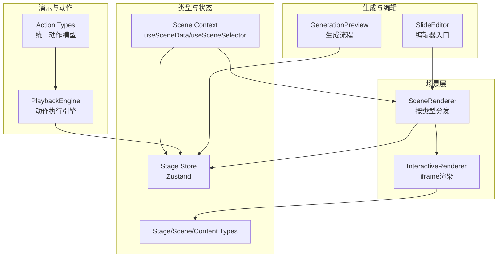
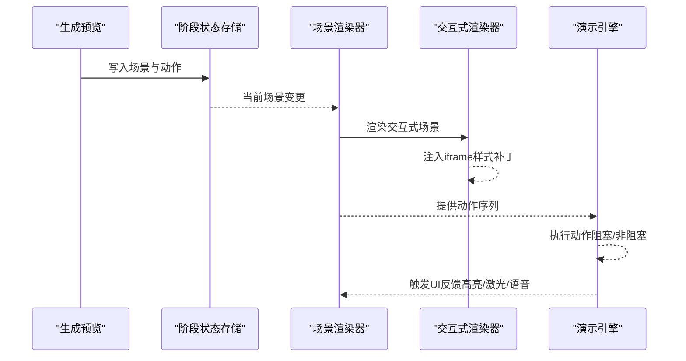
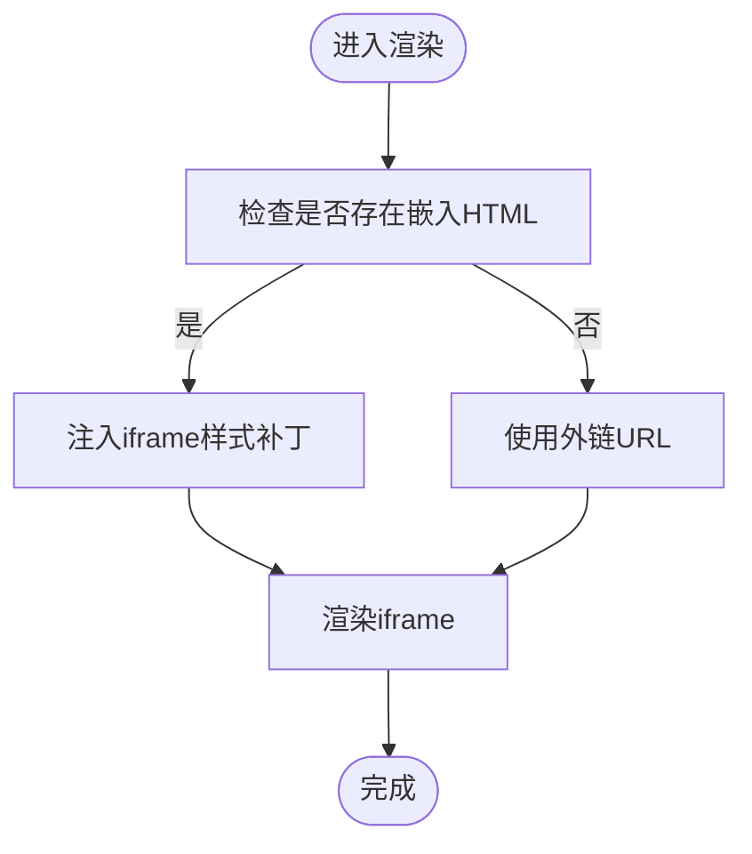
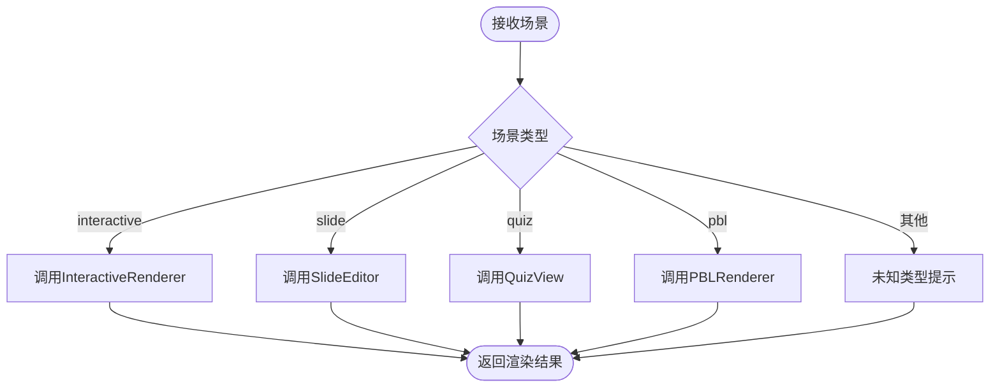
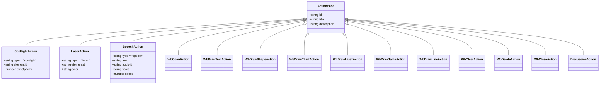
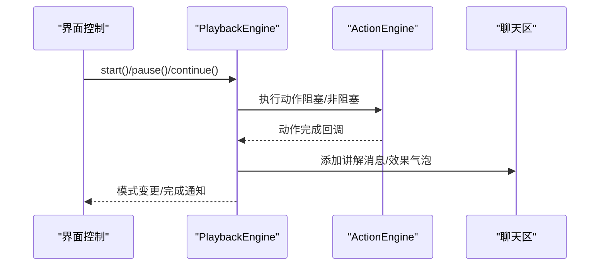
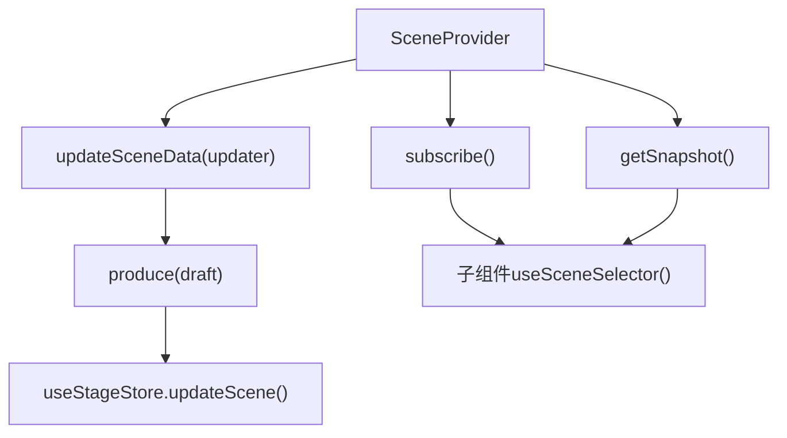
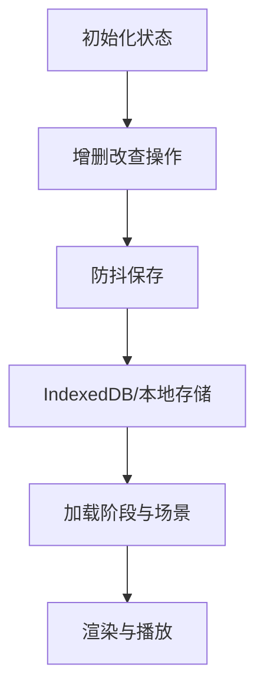
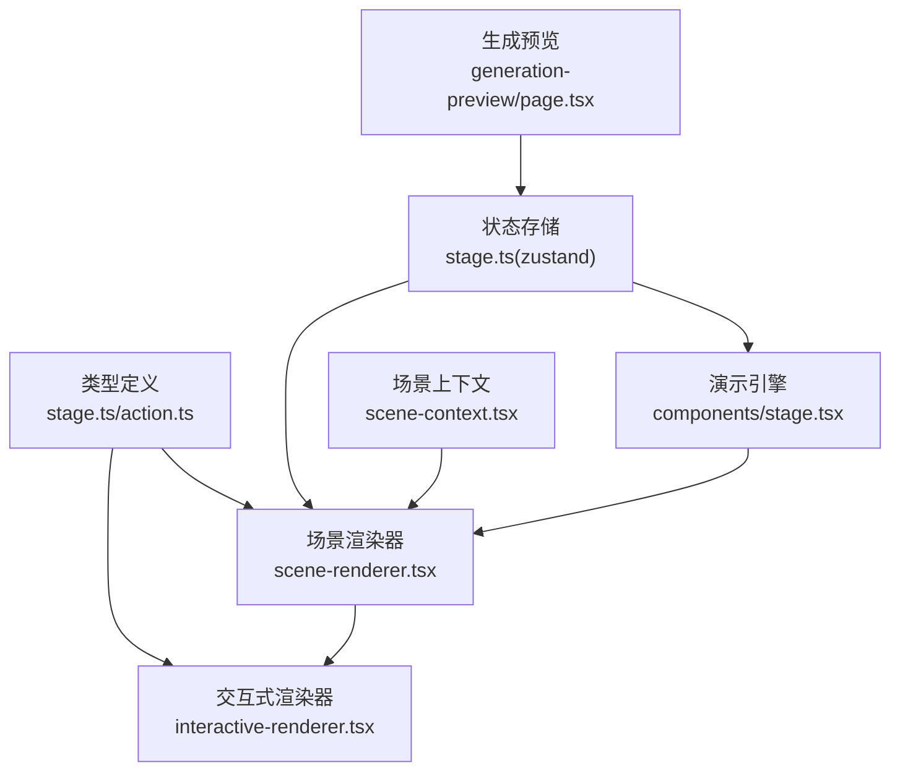

# 交互式模拟渲染器

<cite>
**本文引用的文件**
- [components/stage/scene-renderer.tsx](file://components/stage/scene-renderer.tsx)
- [components/scene-renderers/interactive-renderer.tsx](file://components/scene-renderers/interactive-renderer.tsx)
- [lib/types/stage.ts](file://lib/types/stage.ts)
- [lib/store/stage.ts](file://lib/store/stage.ts)
- [lib/contexts/scene-context.tsx](file://lib/contexts/scene-context.tsx)
- [lib/types/action.ts](file://lib/types/action.ts)
- [components/stage.tsx](file://components/stage.tsx)
- [app/generation-preview/page.tsx](file://app/generation-preview/page.tsx)
- [components/slide-renderer/Editor/index.tsx](file://components/slide-renderer/Editor/index.tsx)
</cite>

## 目录
1. [引言](#引言)
2. [项目结构](#项目结构)
3. [核心组件](#核心组件)
4. [架构总览](#架构总览)
5. [详细组件分析](#详细组件分析)
6. [依赖关系分析](#依赖关系分析)
7. [性能考量](#性能考量)
8. [故障排查指南](#故障排查指南)
9. [结论](#结论)
10. [附录](#附录)

## 引言
本技术文档聚焦于“交互式模拟渲染器”的实现与使用，系统性阐述交互式场景的渲染策略、事件处理机制、数据绑定与状态管理，并提供扩展开发指南与实际应用示例路径。交互式场景在本项目中以独立的场景类型存在，通过 iframe 安全沙箱加载外部交互页面或嵌入 HTML，结合统一的动作系统与播放引擎，实现从生成到演示的完整闭环。

## 项目结构
围绕交互式模拟渲染器的关键目录与文件如下：
- 场景渲染分发：根据场景类型选择具体渲染器
- 交互式渲染器：负责 iframe 嵌入与样式补丁
- 类型定义：场景、动作、内容模型
- 状态存储：阶段与场景的状态管理
- 场景上下文：为场景内组件提供精确订阅与更新能力
- 演示引擎：驱动动作执行与播放控制
- 生成预览：生成流程中的交互式场景产出与接入

图表来源
- [components/stage/scene-renderer.tsx:15-36](file://components/stage/scene-renderer.tsx#L15-L36)
- [components/scene-renderers/interactive-renderer.tsx:12-29](file://components/scene-renderers/interactive-renderer.tsx#L12-L29)
- [lib/types/stage.ts:62-106](file://lib/types/stage.ts#L62-L106)
- [lib/store/stage.ts:98-325](file://lib/store/stage.ts#L98-L325)
- [lib/contexts/scene-context.tsx:38-103](file://lib/contexts/scene-context.tsx#L38-L103)
- [lib/types/action.ts:165-182](file://lib/types/action.ts#L165-L182)
- [components/stage.tsx:264-404](file://components/stage.tsx#L264-L404)
- [app/generation-preview/page.tsx:569-726](file://app/generation-preview/page.tsx#L569-L726)
- [components/slide-renderer/Editor/index.tsx:10-18](file://components/slide-renderer/Editor/index.tsx#L10-L18)

章节来源
- [components/stage/scene-renderer.tsx:15-36](file://components/stage/scene-renderer.tsx#L15-L36)
- [components/scene-renderers/interactive-renderer.tsx:12-29](file://components/scene-renderers/interactive-renderer.tsx#L12-L29)
- [lib/types/stage.ts:62-106](file://lib/types/stage.ts#L62-L106)
- [lib/store/stage.ts:98-325](file://lib/store/stage.ts#L98-L325)
- [lib/contexts/scene-context.tsx:38-103](file://lib/contexts/scene-context.tsx#L38-L103)
- [lib/types/action.ts:165-182](file://lib/types/action.ts#L165-L182)
- [components/stage.tsx:264-404](file://components/stage.tsx#L264-L404)
- [app/generation-preview/page.tsx:569-726](file://app/generation-preview/page.tsx#L569-L726)
- [components/slide-renderer/Editor/index.tsx:10-18](file://components/slide-renderer/Editor/index.tsx#L10-L18)

## 核心组件
- 场景渲染分发器：根据场景类型选择渲染器，确保交互式场景由专用渲染器处理
- 交互式渲染器：将外部 URL 或嵌入 HTML 放入 iframe，注入样式补丁以适配容器尺寸与滚动
- 统一动作系统：定义可阻塞与非阻塞动作，支撑演示引擎按序执行
- 演示引擎：基于动作序列驱动播放，处理语音、白板、视频等同步动作
- 场景上下文：提供场景级数据的精确订阅与不可变更新，便于交互式元素响应状态变化
- 阶段状态存储：持久化与恢复场景、动作、生成进度等状态

章节来源
- [components/stage/scene-renderer.tsx:15-36](file://components/stage/scene-renderer.tsx#L15-L36)
- [components/scene-renderers/interactive-renderer.tsx:12-29](file://components/scene-renderers/interactive-renderer.tsx#L12-L29)
- [lib/types/action.ts:165-182](file://lib/types/action.ts#L165-L182)
- [lib/contexts/scene-context.tsx:38-103](file://lib/contexts/scene-context.tsx#L38-L103)
- [lib/store/stage.ts:98-325](file://lib/store/stage.ts#L98-L325)

## 架构总览
交互式模拟渲染器贯穿“生成—存储—渲染—演示”链路，核心流程如下：

图表来源
- [app/generation-preview/page.tsx:569-726](file://app/generation-preview/page.tsx#L569-L726)
- [lib/store/stage.ts:98-325](file://lib/store/stage.ts#L98-L325)
- [components/stage/scene-renderer.tsx:15-36](file://components/stage/scene-renderer.tsx#L15-L36)
- [components/scene-renderers/interactive-renderer.tsx:12-29](file://components/scene-renderers/interactive-renderer.tsx#L12-L29)
- [components/stage.tsx:264-404](file://components/stage.tsx#L264-L404)

## 详细组件分析

### 交互式渲染器（InteractiveRenderer）
职责与策略
- 将外部 URL 或嵌入 HTML 放入 iframe，启用脚本、表单、弹窗等受限权限
- 对嵌入 HTML 注入样式补丁，确保在 iframe 中正确填充容器并避免溢出
- 通过补丁修复常见布局问题，如视口高度、最小高度与滚动行为

图表来源
- [components/scene-renderers/interactive-renderer.tsx:12-29](file://components/scene-renderers/interactive-renderer.tsx#L12-L29)
- [components/scene-renderers/interactive-renderer.tsx:39-72](file://components/scene-renderers/interactive-renderer.tsx#L39-L72)

章节来源
- [components/scene-renderers/interactive-renderer.tsx:12-29](file://components/scene-renderers/interactive-renderer.tsx#L12-L29)
- [components/scene-renderers/interactive-renderer.tsx:39-72](file://components/scene-renderers/interactive-renderer.tsx#L39-L72)

### 场景渲染分发器（SceneRenderer）
职责与策略
- 根据场景类型选择对应渲染器：幻灯片、测验、交互式、PBL
- 对交互式场景传入场景内容、模式与场景ID，交由专用渲染器处理
- 在类型不匹配时返回占位提示，保证运行时健壮性

图表来源
- [components/stage/scene-renderer.tsx:15-36](file://components/stage/scene-renderer.tsx#L15-L36)

章节来源
- [components/stage/scene-renderer.tsx:15-36](file://components/stage/scene-renderer.tsx#L15-L36)

### 统一动作系统（Action）
职责与策略
- 定义两类动作：非阻塞性（如高亮、激光）与同步性（如语音、白板绘制、讨论）
- 动作类型集合与分类常量用于演示引擎调度与渲染层联动
- 百分比几何类型用于响应式定位，适配不同分辨率与缩放

图表来源
- [lib/types/action.ts:14-182](file://lib/types/action.ts#L14-L182)

章节来源
- [lib/types/action.ts:14-182](file://lib/types/action.ts#L14-L182)

### 演示引擎与播放控制（PlaybackEngine 与 ActionEngine）
职责与策略
- 演示引擎接收当前场景的动作序列，按顺序驱动播放，支持开始、暂停、继续、完成回调
- 同步动作需等待完成后再推进，非阻塞动作即时生效
- 引擎回调与聊天区联动，实现“讲解语音”“讨论触发”“结束闪屏”等体验

图表来源
- [components/stage.tsx:264-404](file://components/stage.tsx#L264-L404)

章节来源
- [components/stage.tsx:264-404](file://components/stage.tsx#L264-L404)

### 场景上下文与数据绑定（SceneProvider/useSceneData/useSceneSelector）
职责与策略
- 提供当前场景数据快照与订阅接口，子组件可精确订阅所需字段
- 使用不可变更新（Immer）确保场景内容安全更新，并回写至阶段状态存储
- 适用于交互式元素的细粒度响应与高效重渲染

图表来源
- [lib/contexts/scene-context.tsx:38-103](file://lib/contexts/scene-context.tsx#L38-L103)
- [lib/contexts/scene-context.tsx:142-180](file://lib/contexts/scene-context.tsx#L142-L180)

章节来源
- [lib/contexts/scene-context.tsx:38-103](file://lib/contexts/scene-context.tsx#L38-L103)
- [lib/contexts/scene-context.tsx:142-180](file://lib/contexts/scene-context.tsx#L142-L180)

### 阶段状态存储（Stage Store）
职责与策略
- 管理阶段信息、场景列表、当前场景、聊天会话、生成进度与失败项
- 提供保存/加载能力，支持断点续播与刷新恢复
- 通过防抖保存减少频繁写入，提升性能

图表来源
- [lib/store/stage.ts:98-325](file://lib/store/stage.ts#L98-L325)

章节来源
- [lib/store/stage.ts:98-325](file://lib/store/stage.ts#L98-L325)

### 生成预览与交互式场景接入
职责与策略
- 生成预览页面在完成大纲与内容生成后，将首个场景加入阶段状态存储
- 将交互式场景的 URL 或 HTML 写入场景内容，随后由场景渲染器与交互式渲染器负责展示
- 生成流程完成后跳转到课堂页，演示引擎接管播放控制

章节来源
- [app/generation-preview/page.tsx:569-726](file://app/generation-preview/page.tsx#L569-L726)

### 编辑器入口（SlideEditor）
职责与策略
- 根据模式切换编辑画布或只读屏幕画布
- 为交互式场景提供一致的编辑/演示入口

章节来源
- [components/slide-renderer/Editor/index.tsx:10-18](file://components/slide-renderer/Editor/index.tsx#L10-L18)

## 依赖关系分析
交互式模拟渲染器的耦合与协作关系如下：

图表来源
- [lib/types/stage.ts:62-106](file://lib/types/stage.ts#L62-L106)
- [lib/types/action.ts:165-182](file://lib/types/action.ts#L165-L182)
- [lib/store/stage.ts:98-325](file://lib/store/stage.ts#L98-L325)
- [lib/contexts/scene-context.tsx:38-103](file://lib/contexts/scene-context.tsx#L38-L103)
- [components/stage/scene-renderer.tsx:15-36](file://components/stage/scene-renderer.tsx#L15-L36)
- [components/scene-renderers/interactive-renderer.tsx:12-29](file://components/scene-renderers/interactive-renderer.tsx#L12-L29)
- [components/stage.tsx:264-404](file://components/stage.tsx#L264-L404)
- [app/generation-preview/page.tsx:569-726](file://app/generation-preview/page.tsx#L569-L726)

章节来源
- [lib/types/stage.ts:62-106](file://lib/types/stage.ts#L62-L106)
- [lib/types/action.ts:165-182](file://lib/types/action.ts#L165-L182)
- [lib/store/stage.ts:98-325](file://lib/store/stage.ts#L98-L325)
- [lib/contexts/scene-context.tsx:38-103](file://lib/contexts/scene-context.tsx#L38-L103)
- [components/stage/scene-renderer.tsx:15-36](file://components/stage/scene-renderer.tsx#L15-L36)
- [components/scene-renderers/interactive-renderer.tsx:12-29](file://components/scene-renderers/interactive-renderer.tsx#L12-L29)
- [components/stage.tsx:264-404](file://components/stage.tsx#L264-L404)
- [app/generation-preview/page.tsx:569-726](file://app/generation-preview/page.tsx#L569-L726)

## 性能考量
- 防抖保存：状态变更通过防抖函数降低写入频率，避免频繁 I/O
- 精确订阅：场景上下文使用浅比较与选择器，仅在所选字段变化时触发重渲染
- iframe 沙箱：在保证功能可用的同时限制潜在风险，避免跨域与脚本冲突
- 播放节流：演示引擎按设定速度推进，避免过载；TTS 静音/音量/速率动态调整

## 故障排查指南
- 交互式页面未显示
  - 检查场景内容是否包含 URL 或嵌入 HTML
  - 确认 iframe 补丁是否成功注入
- 播放异常或动作不生效
  - 核对动作类型是否属于同步动作，确认演示引擎回调是否被正确注册
- 状态不持久或刷新丢失
  - 检查状态存储的保存/加载流程与 IndexedDB 访问
- 生成预览无法进入课堂
  - 确认生成流程已将场景写入阶段状态存储并清理会话缓存

章节来源
- [components/scene-renderers/interactive-renderer.tsx:12-29](file://components/scene-renderers/interactive-renderer.tsx#L12-L29)
- [components/stage.tsx:264-404](file://components/stage.tsx#L264-L404)
- [lib/store/stage.ts:250-306](file://lib/store/stage.ts#L250-L306)
- [app/generation-preview/page.tsx:727-735](file://app/generation-preview/page.tsx#L727-L735)

## 结论
交互式模拟渲染器通过“类型定义—状态存储—场景上下文—渲染器—演示引擎”的清晰分层，实现了可扩展、可维护且高性能的交互式场景渲染与演示。其核心优势在于：
- 统一的动作模型与演示引擎，确保交互式元素与课堂节奏协同
- 精准的数据绑定与订阅机制，降低渲染开销
- 生成到演示的无缝衔接，支持断点续播与自动推进

## 附录

### 实际应用场景与开发示例
- 课堂演示：将交互式教学资源作为场景内容，配合动作系统实现讲解、标注与讨论
- 自主学习：在自主模式下，交互式元素可直接响应用户输入与操作
- 生成集成：通过生成预览页面将交互式场景纳入课程生成流程

章节来源
- [app/generation-preview/page.tsx:569-726](file://app/generation-preview/page.tsx#L569-L726)
- [components/stage.tsx:368-403](file://components/stage.tsx#L368-L403)