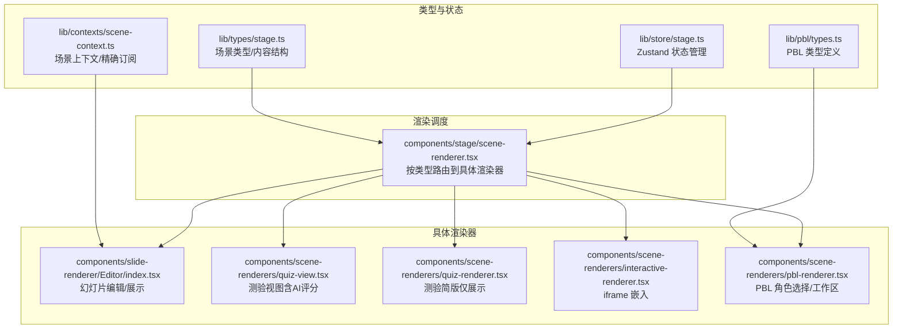
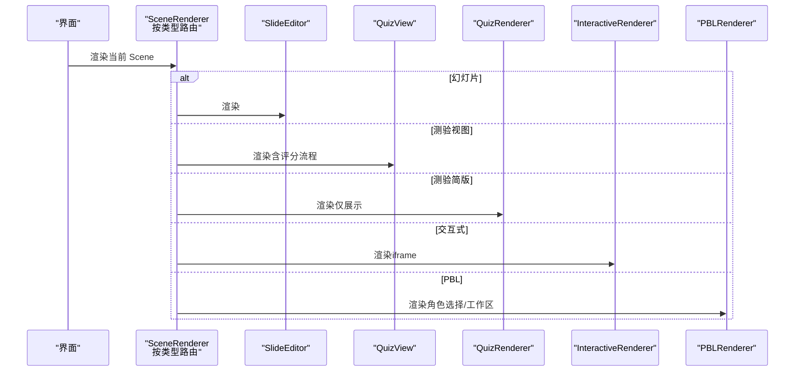
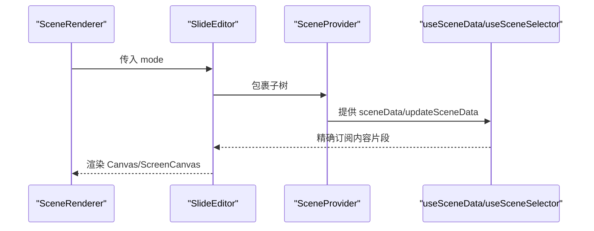
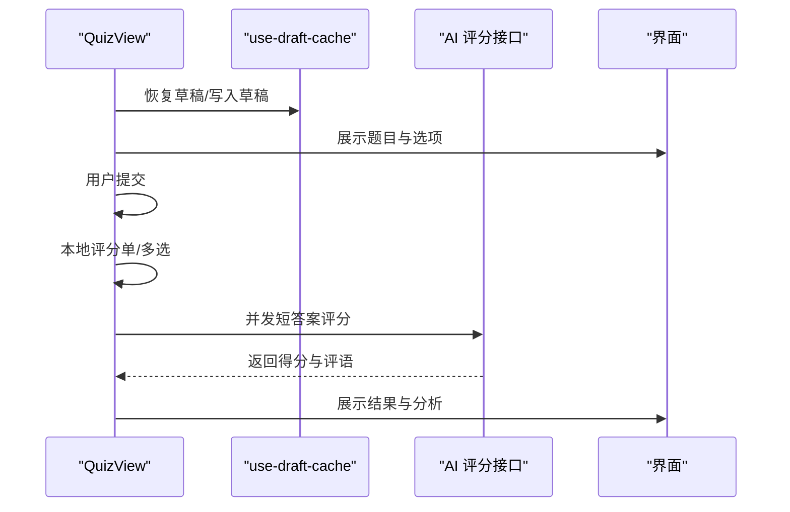
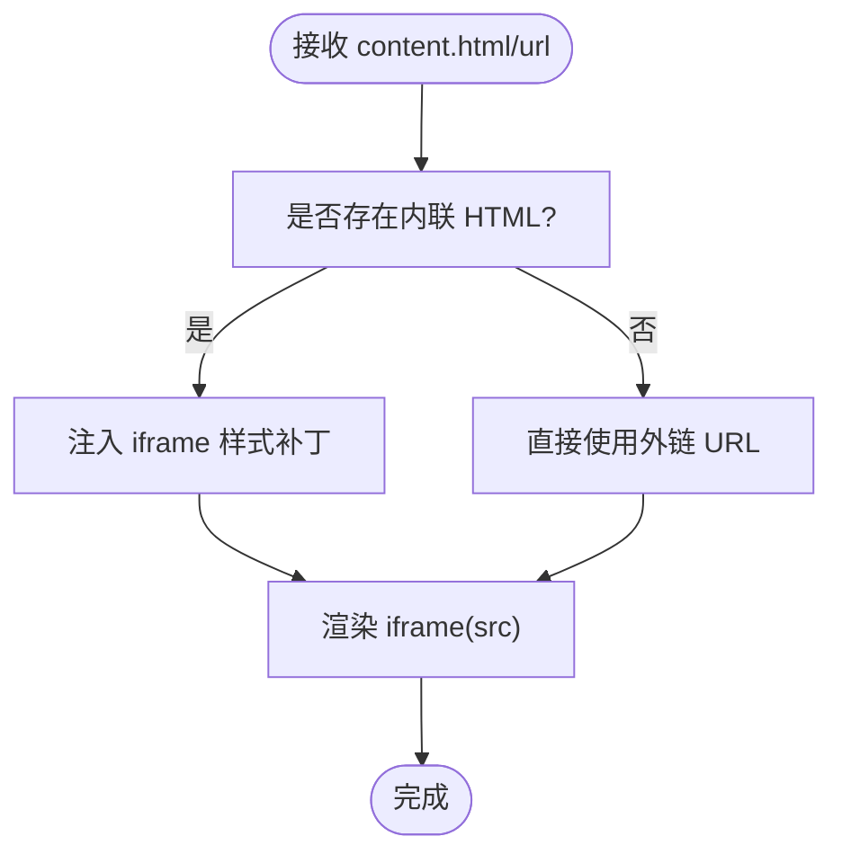
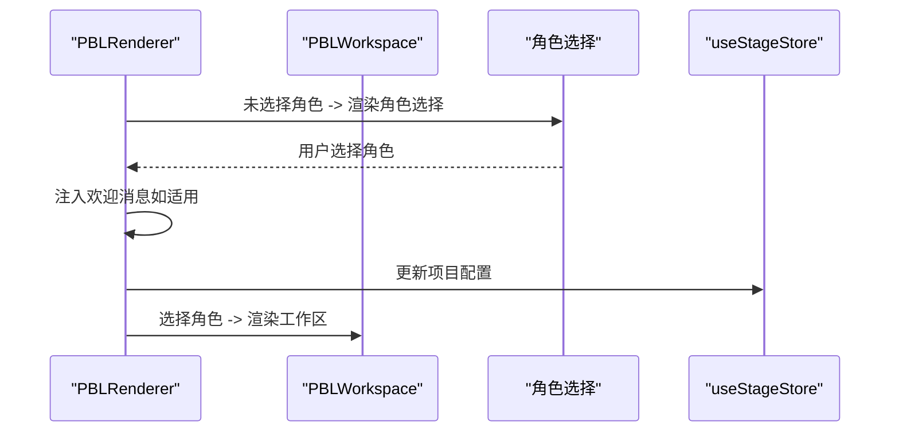
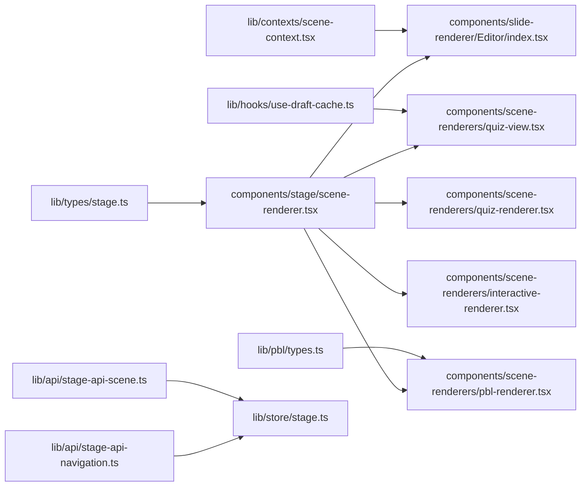

# 场景渲染系统

<cite>
**本文引用的文件**
- [components/stage/scene-renderer.tsx](file://components/stage/scene-renderer.tsx)
- [components/scene-renderers/quiz-view.tsx](file://components/scene-renderers/quiz-view.tsx)
- [components/scene-renderers/quiz-renderer.tsx](file://components/scene-renderers/quiz-renderer.tsx)
- [components/scene-renderers/interactive-renderer.tsx](file://components/scene-renderers/interactive-renderer.tsx)
- [components/scene-renderers/pbl-renderer.tsx](file://components/scene-renderers/pbl-renderer.tsx)
- [components/slide-renderer/Editor/index.tsx](file://components/slide-renderer/Editor/index.tsx)
- [lib/types/stage.ts](file://lib/types/stage.ts)
- [lib/pbl/types.ts](file://lib/pbl/types.ts)
- [lib/store/stage.ts](file://lib/store/stage.ts)
- [lib/contexts/scene-context.tsx](file://lib/contexts/scene-context.tsx)
- [lib/hooks/use-draft-cache.ts](file://lib/hooks/use-draft-cache.ts)
- [lib/api/stage-api-scene.ts](file://lib/api/stage-api-scene.ts)
- [lib/api/stage-api-navigation.ts](file://lib/api/stage-api-navigation.ts)
</cite>

## 目录
1. [引言](#引言)
2. [项目结构](#项目结构)
3. [核心组件](#核心组件)
4. [架构总览](#架构总览)
5. [详细组件分析](#详细组件分析)
6. [依赖关系分析](#依赖关系分析)
7. [性能考量](#性能考量)
8. [故障排查指南](#故障排查指南)
9. [结论](#结论)
10. [附录：扩展开发指南](#附录扩展开发指南)

## 引言
本技术文档围绕“场景渲染系统”展开，系统性阐述多类型教学场景（幻灯片、测验、交互式内容、PBL）的渲染实现与架构设计，覆盖渲染器的生命周期管理、性能优化策略（虚拟化、懒加载、缓存）、可扩展性与配置定制，并提供实际开发示例与最佳实践建议。目标是帮助开发者快速理解并高效扩展新的场景类型与自定义渲染逻辑。

## 项目结构
场景渲染系统主要由以下层次构成：
- 类型与状态层：定义场景类型、内容结构、全局状态与上下文
- 渲染调度层：根据场景类型选择具体渲染器
- 具体渲染器层：针对不同场景类型实现各自的渲染逻辑
- 工具与缓存层：提供草稿缓存、精确订阅等能力



图表来源
- [lib/types/stage.ts:1-124](file://lib/types/stage.ts#L1-L124)
- [lib/pbl/types.ts:1-80](file://lib/pbl/types.ts#L1-L80)
- [lib/store/stage.ts:1-336](file://lib/store/stage.ts#L1-L336)
- [lib/contexts/scene-context.tsx:1-212](file://lib/contexts/scene-context.tsx#L1-L212)
- [components/stage/scene-renderer.tsx:1-37](file://components/stage/scene-renderer.tsx#L1-L37)
- [components/slide-renderer/Editor/index.tsx:1-19](file://components/slide-renderer/Editor/index.tsx#L1-L19)
- [components/scene-renderers/quiz-view.tsx:1-1006](file://components/scene-renderers/quiz-view.tsx#L1-L1006)
- [components/scene-renderers/quiz-renderer.tsx:1-84](file://components/scene-renderers/quiz-renderer.tsx#L1-L84)
- [components/scene-renderers/interactive-renderer.tsx:1-73](file://components/scene-renderers/interactive-renderer.tsx#L1-L73)
- [components/scene-renderers/pbl-renderer.tsx:1-129](file://components/scene-renderers/pbl-renderer.tsx#L1-L129)

章节来源
- [lib/types/stage.ts:1-124](file://lib/types/stage.ts#L1-L124)
- [lib/store/stage.ts:1-336](file://lib/store/stage.ts#L1-L336)
- [lib/contexts/scene-context.tsx:1-212](file://lib/contexts/scene-context.tsx#L1-L212)
- [components/stage/scene-renderer.tsx:1-37](file://components/stage/scene-renderer.tsx#L1-L37)

## 核心组件
- 场景类型与内容结构：统一定义场景类型枚举与各类型内容接口，确保渲染器与数据模型解耦
- 渲染器路由：根据场景类型选择对应渲染器，保证扩展新类型时只需新增渲染器与路由分支
- 幻灯片渲染器：在自主模式与回放模式下切换不同的画布组件
- 测验渲染器：提供两种形态——简版展示与完整视图（含本地与AI评分）
- 交互式渲染器：通过 iframe 安全沙箱嵌入外部网页或内联 HTML
- PBL 渲染器：角色选择与工作区组合，支持项目配置的动态更新
- 场景上下文：提供精确订阅与深度更新能力，避免不必要重渲染
- 草稿缓存：基于 localStorage 的防抖草稿缓存，提升用户输入体验

章节来源
- [lib/types/stage.ts:6-124](file://lib/types/stage.ts#L6-L124)
- [components/stage/scene-renderer.tsx:15-36](file://components/stage/scene-renderer.tsx#L15-L36)
- [components/slide-renderer/Editor/index.tsx:10-18](file://components/slide-renderer/Editor/index.tsx#L10-L18)
- [components/scene-renderers/quiz-view.tsx:688-795](file://components/scene-renderers/quiz-view.tsx#L688-L795)
- [components/scene-renderers/quiz-renderer.tsx:15-84](file://components/scene-renderers/quiz-renderer.tsx#L15-L84)
- [components/scene-renderers/interactive-renderer.tsx:12-29](file://components/scene-renderers/interactive-renderer.tsx#L12-L29)
- [components/scene-renderers/pbl-renderer.tsx:17-128](file://components/scene-renderers/pbl-renderer.tsx#L17-L128)
- [lib/contexts/scene-context.tsx:119-125](file://lib/contexts/scene-context.tsx#L119-L125)
- [lib/hooks/use-draft-cache.ts:16-95](file://lib/hooks/use-draft-cache.ts#L16-L95)

## 架构总览
系统采用“类型驱动 + 上下文 + 状态”的架构：
- 类型驱动：通过 Scene.type 决定渲染器分支
- 上下文驱动：使用 useSceneData/useSceneSelector 提供精确订阅与不可变更新
- 状态驱动：Zustand 管理场景列表、当前场景、生成进度等，配合持久化与去抖保存



图表来源
- [components/stage/scene-renderer.tsx:15-36](file://components/stage/scene-renderer.tsx#L15-L36)
- [components/slide-renderer/Editor/index.tsx:10-18](file://components/slide-renderer/Editor/index.tsx#L10-L18)
- [components/scene-renderers/quiz-view.tsx:688-795](file://components/scene-renderers/quiz-view.tsx#L688-L795)
- [components/scene-renderers/quiz-renderer.tsx:15-84](file://components/scene-renderers/quiz-renderer.tsx#L15-L84)
- [components/scene-renderers/interactive-renderer.tsx:12-29](file://components/scene-renderers/interactive-renderer.tsx#L12-L29)
- [components/scene-renderers/pbl-renderer.tsx:17-128](file://components/scene-renderers/pbl-renderer.tsx#L17-L128)

## 详细组件分析

### 幻灯片渲染器（SlideRenderer）
- 模式切换：自主模式使用 Canvas，回放模式使用 ScreenCanvas
- 数据访问：通过 SceneProvider 与 useSceneData/useSceneSelector 访问/更新场景内容
- 生命周期：随当前场景变化而挂载/卸载；在无场景时返回空



图表来源
- [components/stage/scene-renderer.tsx:15-36](file://components/stage/scene-renderer.tsx#L15-L36)
- [components/slide-renderer/Editor/index.tsx:10-18](file://components/slide-renderer/Editor/index.tsx#L10-L18)
- [lib/contexts/scene-context.tsx:119-125](file://lib/contexts/scene-context.tsx#L119-L125)

章节来源
- [components/slide-renderer/Editor/index.tsx:10-18](file://components/slide-renderer/Editor/index.tsx#L10-L18)
- [lib/contexts/scene-context.tsx:38-103](file://lib/contexts/scene-context.tsx#L38-L103)

### 测验场景渲染（QuizView 与 QuizRenderer）
- QuizView：完整测验体验，包含开始页、答题、评分（本地+AI）、回顾页、分数统计与动画反馈
- QuizRenderer：简化版测验，仅用于静态展示
- 评分流程：本地单选/多选即时评分 + 短答案并发调用 AI 评分 API，最终合并结果
- 草稿缓存：基于 use-draft-cache 将用户作答按场景隔离缓存，恢复时自动进入答题态



图表来源
- [components/scene-renderers/quiz-view.tsx:688-795](file://components/scene-renderers/quiz-view.tsx#L688-L795)
- [components/scene-renderers/quiz-view.tsx:82-136](file://components/scene-renderers/quiz-view.tsx#L82-L136)
- [lib/hooks/use-draft-cache.ts:16-95](file://lib/hooks/use-draft-cache.ts#L16-L95)

章节来源
- [components/scene-renderers/quiz-view.tsx:688-795](file://components/scene-renderers/quiz-view.tsx#L688-L795)
- [components/scene-renderers/quiz-renderer.tsx:15-84](file://components/scene-renderers/quiz-renderer.tsx#L15-L84)
- [lib/hooks/use-draft-cache.ts:16-95](file://lib/hooks/use-draft-cache.ts#L16-L95)

### 交互式场景渲染（InteractiveRenderer）
- 通过 iframe 安全沙箱嵌入外部网页或内联 HTML
- 对内联 HTML 进行补丁，确保在 iframe 中正确填充视口、消除滚动溢出问题
- 支持沙箱权限控制，保障运行安全



图表来源
- [components/scene-renderers/interactive-renderer.tsx:12-29](file://components/scene-renderers/interactive-renderer.tsx#L12-L29)
- [components/scene-renderers/interactive-renderer.tsx:39-72](file://components/scene-renderers/interactive-renderer.tsx#L39-L72)

章节来源
- [components/scene-renderers/interactive-renderer.tsx:12-29](file://components/scene-renderers/interactive-renderer.tsx#L12-L29)

### PBL 场景渲染（PBLRenderer）
- 角色选择：根据项目配置显示可用角色，首次选择后自动注入欢迎消息
- 工作区：展示议题板、聊天与项目信息，支持重置与配置更新
- 配置更新：通过 useStageStore 更新场景内容，保持与全局状态同步



图表来源
- [components/scene-renderers/pbl-renderer.tsx:17-128](file://components/scene-renderers/pbl-renderer.tsx#L17-L128)

章节来源
- [components/scene-renderers/pbl-renderer.tsx:17-128](file://components/scene-renderers/pbl-renderer.tsx#L17-L128)
- [lib/pbl/types.ts:63-69](file://lib/pbl/types.ts#L63-L69)

### 场景上下文与生命周期管理
- 精确订阅：useSceneSelector 使用 useSyncExternalStore，仅当选择器返回值变化时触发重渲染
- 不可变更新：通过 Immer 在 updateSceneData 中进行不可变更新，自动同步至 Zustand
- 生命周期：SceneProvider 在无当前场景时不渲染；渲染器随当前场景切换而挂载/卸载

```mermaid
classDiagram
class SceneProvider {
+sceneId : string
+sceneType : SceneType
+sceneData : any
+updateSceneData(updater)
+subscribe(cb)
+getSnapshot()
}
class useSceneData {
+返回 : {sceneId, sceneType, sceneData, updateSceneData}
}
class useSceneSelector {
+参数 : selector(data)
+返回 : 选择的数据片段
}
SceneProvider --> useSceneData : "提供"
SceneProvider --> useSceneSelector : "提供"
```

图表来源
- [lib/contexts/scene-context.tsx:16-24](file://lib/contexts/scene-context.tsx#L16-L24)
- [lib/contexts/scene-context.tsx:119-125](file://lib/contexts/scene-context.tsx#L119-L125)
- [lib/contexts/scene-context.tsx:142-179](file://lib/contexts/scene-context.tsx#L142-L179)

章节来源
- [lib/contexts/scene-context.tsx:38-103](file://lib/contexts/scene-context.tsx#L38-L103)
- [lib/contexts/scene-context.tsx:119-125](file://lib/contexts/scene-context.tsx#L119-L125)
- [lib/contexts/scene-context.tsx:142-179](file://lib/contexts/scene-context.tsx#L142-L179)

## 依赖关系分析
- 渲染器路由依赖类型定义与全局状态
- 幻灯片渲染器依赖场景上下文与画布组件
- 测验渲染器依赖草稿缓存与评分 API
- PBL 渲染器依赖项目配置类型与全局状态
- 状态管理依赖持久化与去抖保存



图表来源
- [lib/types/stage.ts:6-124](file://lib/types/stage.ts#L6-L124)
- [lib/pbl/types.ts:63-69](file://lib/pbl/types.ts#L63-L69)
- [lib/contexts/scene-context.tsx:119-125](file://lib/contexts/scene-context.tsx#L119-L125)
- [lib/hooks/use-draft-cache.ts:16-95](file://lib/hooks/use-draft-cache.ts#L16-L95)
- [lib/api/stage-api-scene.ts:43-176](file://lib/api/stage-api-scene.ts#L43-L176)
- [lib/api/stage-api-navigation.ts:51-94](file://lib/api/stage-api-navigation.ts#L51-L94)
- [lib/store/stage.ts:98-323](file://lib/store/stage.ts#L98-L323)
- [components/stage/scene-renderer.tsx:15-36](file://components/stage/scene-renderer.tsx#L15-L36)

章节来源
- [lib/store/stage.ts:98-323](file://lib/store/stage.ts#L98-L323)
- [lib/api/stage-api-scene.ts:43-176](file://lib/api/stage-api-scene.ts#L43-L176)
- [lib/api/stage-api-navigation.ts:51-94](file://lib/api/stage-api-navigation.ts#L51-L94)

## 性能考量
- 精准订阅与浅比较：useSceneSelector 通过浅比较避免不必要的重渲染
- 草稿缓存防抖：use-draft-cache 默认 500ms 防抖写入 localStorage，降低频繁 IO
- 去抖保存：Zustand 状态变更通过去抖保存，减少持久化压力
- 懒加载与沙箱：交互式渲染器按需加载 iframe，iframe 沙箱限制资源访问
- 虚拟化建议：对于长列表（如题库、议题板），可引入虚拟列表以降低 DOM 数量

章节来源
- [lib/contexts/scene-context.tsx:142-179](file://lib/contexts/scene-context.tsx#L142-L179)
- [lib/hooks/use-draft-cache.ts:16-95](file://lib/hooks/use-draft-cache.ts#L16-L95)
- [lib/store/stage.ts:333-335](file://lib/store/stage.ts#L333-L335)
- [components/scene-renderers/interactive-renderer.tsx:12-29](file://components/scene-renderers/interactive-renderer.tsx#L12-L29)

## 故障排查指南
- 无法渲染场景：检查当前场景是否为空；若为空，渲染器应返回空或占位提示
- 测验评分异常：确认 AI 评分接口可用与鉴权头设置；查看日志输出定位错误
- PBL 角色选择无效：确认项目配置存在且包含 agents；检查 selectedRole 更新逻辑
- 交互式页面空白：检查内联 HTML 补丁是否成功注入；确认沙箱权限与跨域策略
- 状态不一致：检查 useStageStore 的更新路径与持久化保存时机

章节来源
- [components/stage/scene-renderer.tsx:15-36](file://components/stage/scene-renderer.tsx#L15-L36)
- [components/scene-renderers/quiz-view.tsx:122-136](file://components/scene-renderers/quiz-view.tsx#L122-L136)
- [components/scene-renderers/pbl-renderer.tsx:91-106](file://components/scene-renderers/pbl-renderer.tsx#L91-L106)
- [components/scene-renderers/interactive-renderer.tsx:39-72](file://components/scene-renderers/interactive-renderer.tsx#L39-L72)
- [lib/store/stage.ts:250-306](file://lib/store/stage.ts#L250-L306)

## 结论
该场景渲染系统通过类型驱动与上下文/状态解耦，实现了对多种教学场景的统一渲染与扩展。借助精确订阅、草稿缓存与去抖保存等策略，系统在性能与用户体验之间取得良好平衡。未来扩展新场景类型时，遵循现有路由与上下文模式即可快速集成。

## 附录：扩展开发指南
- 新增场景类型步骤
  1) 在类型定义中新增场景类型与内容接口
     - 参考路径：[lib/types/stage.ts:6-124](file://lib/types/stage.ts#L6-L124)
  2) 实现渲染器组件（自主/回放模式适配）
     - 参考现有渲染器：[components/scene-renderers/quiz-view.tsx:688-795](file://components/scene-renderers/quiz-view.tsx#L688-L795)，[components/scene-renderers/interactive-renderer.tsx:12-29](file://components/scene-renderers/interactive-renderer.tsx#L12-L29)，[components/scene-renderers/pbl-renderer.tsx:17-128](file://components/scene-renderers/pbl-renderer.tsx#L17-L128)
  3) 在渲染路由中增加分支
     - 参考路径：[components/stage/scene-renderer.tsx:17-32](file://components/stage/scene-renderer.tsx#L17-L32)
  4) 如需编辑/预览能力，提供对应的场景上下文与更新方法
     - 参考路径：[lib/contexts/scene-context.tsx:72-83](file://lib/contexts/scene-context.tsx#L72-L83)
  5) 若涉及持久化，完善状态保存与恢复逻辑
     - 参考路径：[lib/store/stage.ts:250-306](file://lib/store/stage.ts#L250-L306)，[lib/api/stage-api-scene.ts:43-176](file://lib/api/stage-api-scene.ts#L43-L176)

- 配置选项与样式定制
  - 渲染器内部样式通过组件类名与主题变量控制，可在组件根节点添加容器类名以实现局部样式覆盖
  - 交互式场景可通过内联 HTML 补丁注入样式，确保在 iframe 中正确渲染
  - 参考路径：[components/scene-renderers/interactive-renderer.tsx:39-72](file://components/scene-renderers/interactive-renderer.tsx#L39-L72)

- 响应式设计支持
  - 所有渲染器均使用百分比尺寸与相对单位，适配不同屏幕尺寸
  - 交互式场景通过 iframe 填充容器，避免滚动溢出
  - 参考路径：[components/scene-renderers/interactive-renderer.tsx:18-28](file://components/scene-renderers/interactive-renderer.tsx#L18-L28)

- 最佳实践
  - 使用 useSceneSelector 精准订阅场景片段，避免全量重渲染
  - 对高频输入使用草稿缓存与防抖，提升交互流畅度
  - 严格区分“只读展示”与“可编辑”场景，避免状态污染
  - 为每个场景提供明确的错误边界与降级提示