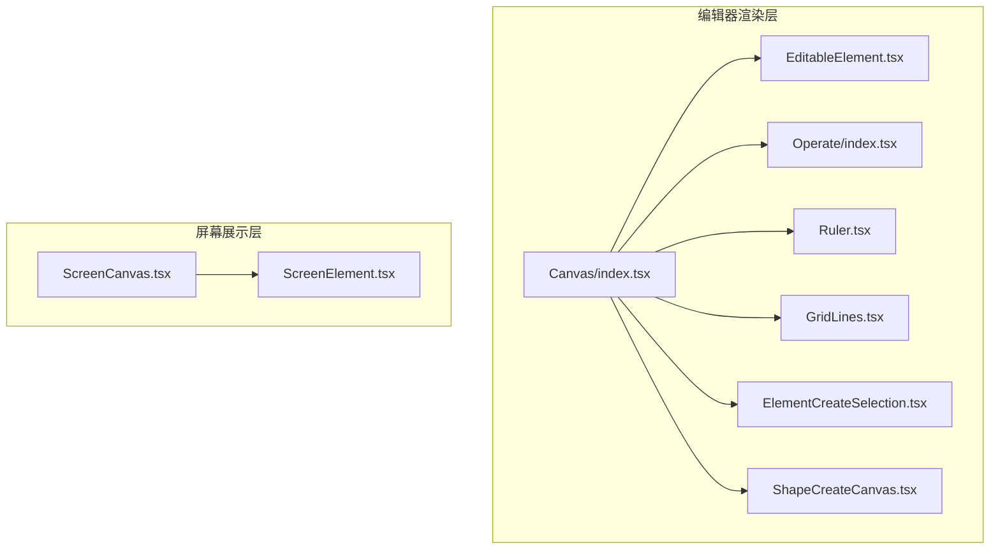
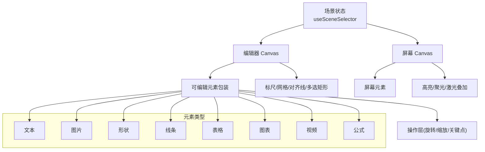
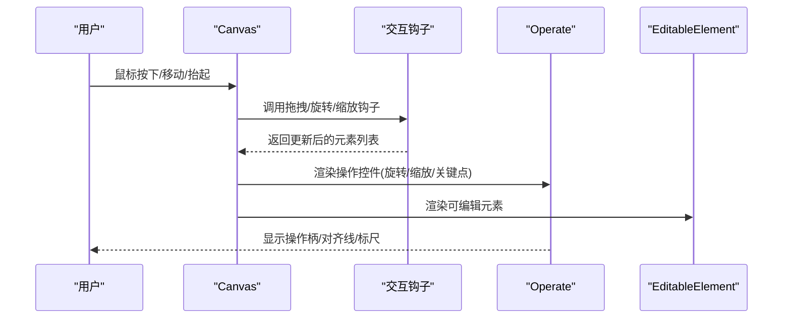
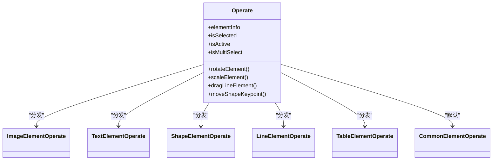
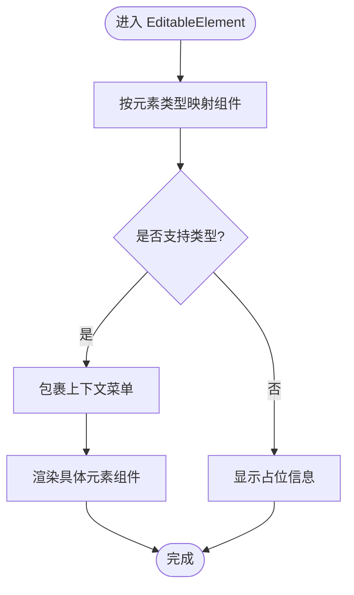
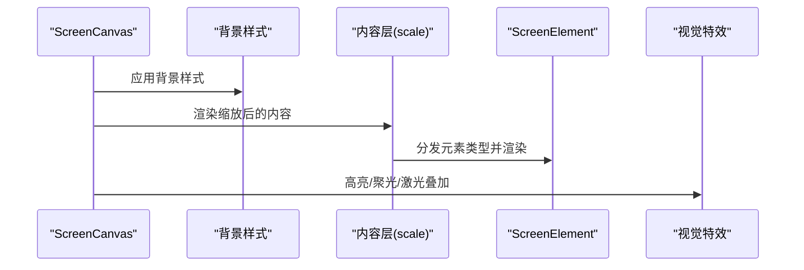
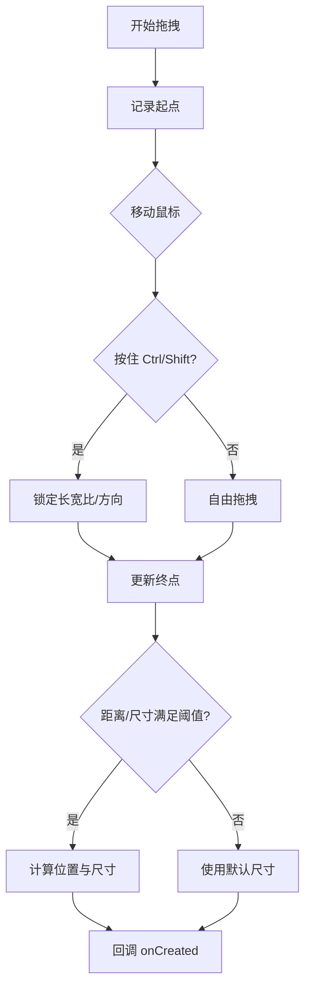
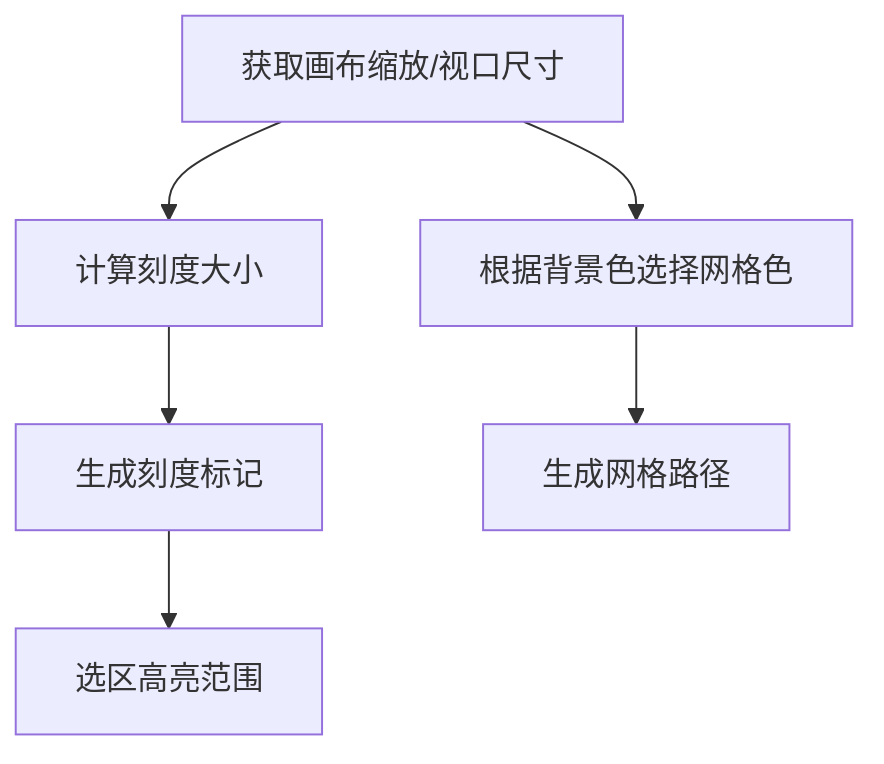
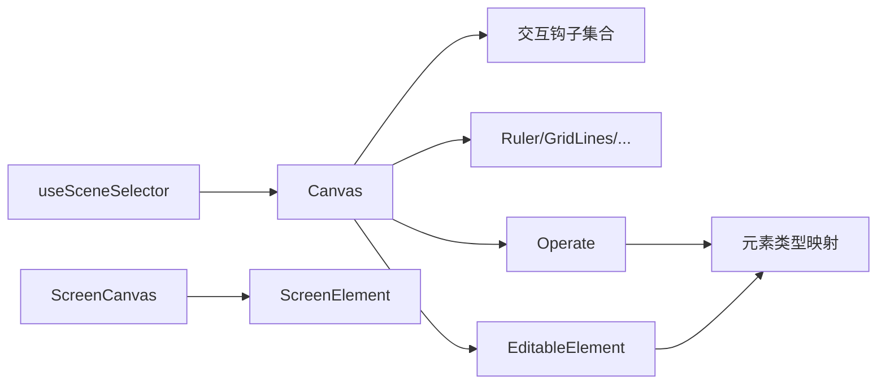

# 幻灯片渲染器

<cite>
**本文引用的文件**
- [Editor/index.tsx](file://components/slide-renderer/Editor/index.tsx)
- [Canvas/index.tsx](file://components/slide-renderer/Editor/Canvas/index.tsx)
- [ScreenCanvas.tsx](file://components/slide-renderer/Editor/ScreenCanvas.tsx)
- [ScreenElement.tsx](file://components/slide-renderer/Editor/ScreenElement.tsx)
- [Operate/index.tsx](file://components/slide-renderer/Editor/Canvas/Operate/index.tsx)
- [EditableElement.tsx](file://components/slide-renderer/Editor/Canvas/EditableElement.tsx)
- [ElementCreateSelection.tsx](file://components/slide-renderer/Editor/Canvas/ElementCreateSelection.tsx)
- [ShapeCreateCanvas.tsx](file://components/slide-renderer/Editor/Canvas/ShapeCreateCanvas.tsx)
- [Ruler.tsx](file://components/slide-renderer/Editor/Canvas/Ruler.tsx)
- [GridLines.tsx](file://components/slide-renderer/Editor/Canvas/GridLines.tsx)
</cite>

## 目录
1. [简介](#简介)
2. [项目结构](#项目结构)
3. [核心组件](#核心组件)
4. [架构总览](#架构总览)
5. [详细组件分析](#详细组件分析)
6. [依赖关系分析](#依赖关系分析)
7. [性能考量](#性能考量)
8. [故障排查指南](#故障排查指南)
9. [结论](#结论)
10. [附录：配置与样式定制](#附录配置与样式定制)

## 简介
本技术文档围绕“幻灯片渲染器”的基于 Canvas 的实现进行系统化阐述，覆盖编辑态与演示态两套渲染路径：编辑器 Canvas（可交互编辑）与屏幕 Canvas（演示态展示）。文档重点包括：
- 核心架构与渲染流程
- 元素类型与绘制机制（文本、图片、形状、表格、线条、图表、视频、公式）
- 性能优化策略（缓存、重绘控制、内存管理）
- 与编辑器的集成（元素选择、拖拽、旋转、缩放、键盘/鼠标交互）
- 配置项与样式定制
- 实际使用示例与性能调优建议

## 项目结构
该渲染器位于“slide-renderer”目录下，采用按功能域分层的组织方式：
- 编辑器层：Canvas 组件及其操作层（Operate）、可编辑元素包装（EditableElement）、辅助工具（Ruler、GridLines、ElementCreateSelection、ShapeCreateCanvas）
- 屏幕展示层：ScreenCanvas 与 ScreenElement，负责演示态的背景、内容、视觉特效叠加
- 元素类型层：各元素类型的基类组件（Base*Element），在运行时根据元素类型动态分发

图示来源
- [Canvas/index.tsx:1-416](file://components/slide-renderer/Editor/Canvas/index.tsx#L1-L416)
- [Operate/index.tsx:1-174](file://components/slide-renderer/Editor/Canvas/Operate/index.tsx#L1-L174)
- [EditableElement.tsx:1-309](file://components/slide-renderer/Editor/Canvas/EditableElement.tsx#L1-L309)
- [Ruler.tsx:1-123](file://components/slide-renderer/Editor/Canvas/Ruler.tsx#L1-L123)
- [GridLines.tsx:1-50](file://components/slide-renderer/Editor/Canvas/GridLines.tsx#L1-L50)
- [ScreenCanvas.tsx:1-124](file://components/slide-renderer/Editor/ScreenCanvas.tsx#L1-L124)
- [ScreenElement.tsx:1-71](file://components/slide-renderer/Editor/ScreenElement.tsx#L1-L71)

章节来源
- [Editor/index.tsx:1-19](file://components/slide-renderer/Editor/index.tsx#L1-L19)
- [Canvas/index.tsx:1-416](file://components/slide-renderer/Editor/Canvas/index.tsx#L1-L416)

## 核心组件
- 编辑器 Canvas：承载元素列表、视口缩放、对齐线、多选矩形、网格、标尺、元素拖拽/旋转/缩放、自定义形状绘制、元素创建选择等交互能力。
- 可编辑元素包装：根据元素类型动态分发到具体元素组件，并提供上下文菜单与层级操作。
- 操作层（Operate）：在选中状态下显示旋转/缩放/关键点移动等操作控件，支持动画索引标注。
- 屏幕 Canvas：演示态渲染，包含背景层、内容层、高亮/聚光/激光等视觉特效叠加层。
- 屏幕元素：按元素类型分发到对应 Base*Element 进行最终绘制。

章节来源
- [Canvas/index.tsx:44-416](file://components/slide-renderer/Editor/Canvas/index.tsx#L44-L416)
- [EditableElement.tsx:35-309](file://components/slide-renderer/Editor/Canvas/EditableElement.tsx#L35-L309)
- [Operate/index.tsx:23-174](file://components/slide-renderer/Editor/Canvas/Operate/index.tsx#L23-L174)
- [ScreenCanvas.tsx:18-124](file://components/slide-renderer/Editor/ScreenCanvas.tsx#L18-L124)
- [ScreenElement.tsx:17-71](file://components/slide-renderer/Editor/ScreenElement.tsx#L17-L71)

## 架构总览
编辑态与演示态通过统一的场景数据源驱动，二者共享元素模型（PPTElement），但渲染管线不同：
- 编辑态：以 Canvas 为核心，结合 Operate 控件与交互钩子，实现元素的增删改查、对齐、对齐线提示、网格吸附、标尺测量等。
- 演示态：以 ScreenCanvas 为核心，叠加高亮/聚光/激光等效果，支持缩放目标聚焦与平滑过渡。

图示来源
- [Canvas/index.tsx:67-101](file://components/slide-renderer/Editor/Canvas/index.tsx#L67-L101)
- [ScreenCanvas.tsx:20-32](file://components/slide-renderer/Editor/ScreenCanvas.tsx#L20-L32)
- [EditableElement.tsx:54-69](file://components/slide-renderer/Editor/Canvas/EditableElement.tsx#L54-L69)
- [Operate/index.tsx:103-117](file://components/slide-renderer/Editor/Canvas/Operate/index.tsx#L103-L117)
- [ScreenElement.tsx:24-39](file://components/slide-renderer/Editor/ScreenElement.tsx#L24-L39)

## 详细组件分析

### 编辑器 Canvas 渲染与交互
- 数据流：从场景上下文选择元素列表，本地维护 elementListRef 与 elementList，避免每次渲染都创建新数组；订阅画布缩放、活动元素、隐藏元素、网格大小、标尺开关等状态。
- 视口与拖拽：通过 useViewportSize 计算视口尺寸与偏移，支持空区域点击清选、空格拖拽视口。
- 元素操作：useDragElement/useRotateElement/useScaleElement/useScaleElement/useDragLineElement/useMoveShapeKeypoint 提供拖拽、旋转、缩放、线段拖动、形状关键点移动等能力。
- 创建与插入：ElementCreateSelection 支持鼠标拖拽创建元素并计算位置与尺寸；ShapeCreateCanvas 支持手绘自定义路径生成矢量形状。
- 辅助工具：Ruler 提供标尺与选区范围高亮；GridLines 提供网格；AlignmentLine 提供对齐线；MouseSelection 提供多选矩形。

图示来源
- [Canvas/index.tsx:104-135](file://components/slide-renderer/Editor/Canvas/index.tsx#L104-L135)
- [Operate/index.tsx:54-174](file://components/slide-renderer/Editor/Canvas/Operate/index.tsx#L54-L174)
- [EditableElement.tsx:47-309](file://components/slide-renderer/Editor/Canvas/EditableElement.tsx#L47-L309)

章节来源
- [Canvas/index.tsx:62-416](file://components/slide-renderer/Editor/Canvas/index.tsx#L62-L416)
- [ElementCreateSelection.tsx:10-201](file://components/slide-renderer/Editor/Canvas/ElementCreateSelection.tsx#L10-L201)
- [ShapeCreateCanvas.tsx:13-191](file://components/slide-renderer/Editor/Canvas/ShapeCreateCanvas.tsx#L13-L191)
- [Ruler.tsx:12-123](file://components/slide-renderer/Editor/Canvas/Ruler.tsx#L12-L123)
- [GridLines.tsx:6-50](file://components/slide-renderer/Editor/Canvas/GridLines.tsx#L6-L50)

### 操作层（Operate）与元素控件
- 动态分发：根据元素类型映射到对应的 Operate 子组件（文本、图片、形状、线条、表格等），未实现类型显示占位。
- 交互能力：旋转、缩放、线段拖动、形状关键点移动；当元素被锁定或处于多选非激活状态时，控件可见性与透明度调整。
- 动画索引：在动画工具栏开启时，为参与动画的元素显示索引标签，便于动画编排。

图示来源
- [Operate/index.tsx:103-117](file://components/slide-renderer/Editor/Canvas/Operate/index.tsx#L103-L117)
- [Operate/index.tsx:134-172](file://components/slide-renderer/Editor/Canvas/Operate/index.tsx#L134-L172)

章节来源
- [Operate/index.tsx:23-174](file://components/slide-renderer/Editor/Canvas/Operate/index.tsx#L23-L174)

### 可编辑元素包装（EditableElement）
- 类型分发：与 Operate 类似，根据元素类型映射到具体元素组件（文本、图片、形状、线条、图表、公式、表格、视频）。
- 上下文菜单：提供剪切/复制/粘贴/对齐/层级/组合/锁定/删除等常用操作。
- 事件处理：将选择回调传递给具体元素组件，便于元素内部处理焦点与输入。

图示来源
- [EditableElement.tsx:54-69](file://components/slide-renderer/Editor/Canvas/EditableElement.tsx#L54-L69)
- [EditableElement.tsx:236-307](file://components/slide-renderer/Editor/Canvas/EditableElement.tsx#L236-L307)

章节来源
- [EditableElement.tsx:35-309](file://components/slide-renderer/Editor/Canvas/EditableElement.tsx#L35-L309)

### 屏幕 Canvas 与屏幕元素
- 屏幕 Canvas：根据场景背景样式渲染背景层，内容层按缩放比例渲染元素，叠加高亮层与聚光层；支持激光指针动画与缩放目标聚焦。
- 屏幕元素：按元素类型分发到对应 Base*Element 渲染，同时应用主题字体颜色与字体族。

图示来源
- [ScreenCanvas.tsx:61-121](file://components/slide-renderer/Editor/ScreenCanvas.tsx#L61-L121)
- [ScreenElement.tsx:23-70](file://components/slide-renderer/Editor/ScreenElement.tsx#L23-L70)

章节来源
- [ScreenCanvas.tsx:18-124](file://components/slide-renderer/Editor/ScreenCanvas.tsx#L18-L124)
- [ScreenElement.tsx:17-71](file://components/slide-renderer/Editor/ScreenElement.tsx#L17-L71)

### 元素创建与自定义形状
- 元素创建选择：通过鼠标拖拽确定起止坐标，支持 Ctrl/Shift 键锁定长宽比或方向约束；最小尺寸阈值保证可交互性。
- 自定义形状：通过连续点击记录路径点，支持 ESC 取消、ENTER 提前完成；自动计算 viewBox 与路径字符串，生成矢量形状。

图示来源
- [ElementCreateSelection.tsx:28-119](file://components/slide-renderer/Editor/Canvas/ElementCreateSelection.tsx#L28-L119)
- [ElementCreateSelection.tsx:151-170](file://components/slide-renderer/Editor/Canvas/ElementCreateSelection.tsx#L151-L170)

章节来源
- [ElementCreateSelection.tsx:10-201](file://components/slide-renderer/Editor/Canvas/ElementCreateSelection.tsx#L10-L201)
- [ShapeCreateCanvas.tsx:13-191](file://components/slide-renderer/Editor/Canvas/ShapeCreateCanvas.tsx#L13-L191)

### 标尺与网格
- 标尺：根据视口缩放与画布尺寸计算刻度间隔，高亮显示当前选区范围。
- 网格：根据背景色自动选择黑白网格以增强对比度，按网格间距生成 SVG 路径。

图示来源
- [Ruler.tsx:32-83](file://components/slide-renderer/Editor/Canvas/Ruler.tsx#L32-L83)
- [GridLines.tsx:16-47](file://components/slide-renderer/Editor/Canvas/GridLines.tsx#L16-L47)

章节来源
- [Ruler.tsx:12-123](file://components/slide-renderer/Editor/Canvas/Ruler.tsx#L12-L123)
- [GridLines.tsx:6-50](file://components/slide-renderer/Editor/Canvas/GridLines.tsx#L6-L50)

## 依赖关系分析
- 组件耦合：Canvas 作为中枢，依赖多个交互钩子与工具组件；Operate 与 EditableElement 通过元素类型映射解耦具体元素实现。
- 状态来源：元素列表来自场景上下文选择器；画布状态来自画布存储；键盘状态来自键盘存储。
- 外部依赖：上下文菜单组件、动画库（用于演示态激光指针淡入淡出）。

图示来源
- [Canvas/index.tsx:67-101](file://components/slide-renderer/Editor/Canvas/index.tsx#L67-L101)
- [Operate/index.tsx:103-117](file://components/slide-renderer/Editor/Canvas/Operate/index.tsx#L103-L117)
- [EditableElement.tsx:54-69](file://components/slide-renderer/Editor/Canvas/EditableElement.tsx#L54-L69)
- [ScreenCanvas.tsx:20-32](file://components/slide-renderer/Editor/ScreenCanvas.tsx#L20-L32)

章节来源
- [Canvas/index.tsx:1-416](file://components/slide-renderer/Editor/Canvas/index.tsx#L1-L416)
- [Operate/index.tsx:1-174](file://components/slide-renderer/Editor/Canvas/Operate/index.tsx#L1-L174)
- [EditableElement.tsx:1-309](file://components/slide-renderer/Editor/Canvas/EditableElement.tsx#L1-L309)
- [ScreenCanvas.tsx:1-124](file://components/slide-renderer/Editor/ScreenCanvas.tsx#L1-L124)

## 性能考量
- 渲染优化
  - 元素列表同步：通过 useRef 与 useState 同步场景元素，避免重复序列化开销；仅在元素列表变化时更新本地副本。
  - 选择器优化：使用场景选择器精确选择所需字段，减少无关状态变更导致的重渲染。
  - 操作控件与对齐线：仅在选中元素时渲染操作控件，对齐线按需生成，降低 DOM 数量。
  - 缩放与变换：内容层使用 CSS scale，避免逐元素重绘；演示态缩放目标聚焦使用 transform-origin 与过渡动画。
- 内存管理
  - 使用 useMemo 缓存网格路径、标尺刻度、元素范围等计算结果，避免重复计算。
  - 对齐线与多选矩形等临时 UI 在不需要时及时清理，避免累积。
- 交互性能
  - 鼠标拖拽与键盘监听在组件挂载时注册，卸载时清理，防止内存泄漏。
  - Ctrl/Shift 键状态影响约束逻辑，减少无效计算分支。

章节来源
- [Canvas/index.tsx:96-101](file://components/slide-renderer/Editor/Canvas/index.tsx#L96-L101)
- [GridLines.tsx:25-37](file://components/slide-renderer/Editor/Canvas/GridLines.tsx#L25-L37)
- [Ruler.tsx:22-30](file://components/slide-renderer/Editor/Canvas/Ruler.tsx#L22-L30)
- [ScreenCanvas.tsx:70-76](file://components/slide-renderer/Editor/ScreenCanvas.tsx#L70-L76)

## 故障排查指南
- 元素不响应拖拽/旋转/缩放
  - 检查是否处于多选且非激活状态；检查元素是否被锁定；确认交互钩子是否正确初始化。
- 对齐线不显示
  - 确认对齐线生成逻辑与拖拽钩子已触发；检查 activeElementIdList 是否为空。
- 网格颜色不可见
  - 检查背景色亮度判断逻辑；确保网格尺寸大于 0。
- 标尺刻度异常
  - 检查视口缩放与画布尺寸；确认刻度大小计算与 markerSize 的条件。
- 演示态缩放无效
  - 检查 zoomTarget 与 zoomGeometry 是否存在；确认 transform-origin 与 transform 的应用顺序。

章节来源
- [Canvas/index.tsx:138-159](file://components/slide-renderer/Editor/Canvas/index.tsx#L138-L159)
- [GridLines.tsx:16-22](file://components/slide-renderer/Editor/Canvas/GridLines.tsx#L16-L22)
- [Ruler.tsx:32-34](file://components/slide-renderer/Editor/Canvas/Ruler.tsx#L32-L34)
- [ScreenCanvas.tsx:70-76](file://components/slide-renderer/Editor/ScreenCanvas.tsx#L70-L76)

## 结论
该幻灯片渲染器通过清晰的编辑态与演示态分离、以元素类型为中心的动态分发机制，以及完善的交互钩子体系，实现了高效、可扩展的 Canvas 渲染方案。配合对齐线、网格、标尺等辅助工具，编辑体验良好；演示态叠加高亮、聚光、激光等特效，提升了展示表现力。通过选择器优化、缓存与变换策略，整体具备良好的性能基础。

## 附录：配置与样式定制
- 编辑态配置
  - 标尺开关：通过画布存储切换；支持网格线尺寸（无/小/中/大）。
  - 网格线：根据背景色自动选择对比色；网格间距可配置。
  - 视口缩放：通过画布缩放控制整体放大缩小。
  - 对齐吸附：拖拽时自动对齐，支持 Ctrl/Shift 键锁定长宽比或方向。
- 演示态配置
  - 背景样式：支持纯色/图片背景；演示态背景样式由场景上下文提供。
  - 视觉特效：激光指针颜色与持续时间可配置；聚光与高亮层可叠加。
  - 缩放聚焦：支持将指定元素作为缩放目标，平滑过渡至目标中心与比例。
- 主题与字体
  - 字体颜色与字体族由场景主题提供，所有元素继承该主题样式。

章节来源
- [Canvas/index.tsx:72-84](file://components/slide-renderer/Editor/Canvas/index.tsx#L72-L84)
- [ScreenCanvas.tsx:28-32](file://components/slide-renderer/Editor/ScreenCanvas.tsx#L28-L32)
- [ScreenElement.tsx:41-51](file://components/slide-renderer/Editor/ScreenElement.tsx#L41-L51)
- [GridLines.tsx:16-22](file://components/slide-renderer/Editor/Canvas/GridLines.tsx#L16-L22)
- [ScreenCanvas.tsx:105-119](file://components/slide-renderer/Editor/ScreenCanvas.tsx#L105-L119)