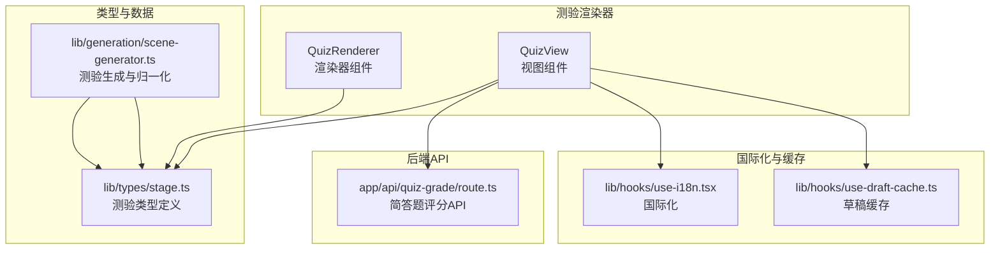
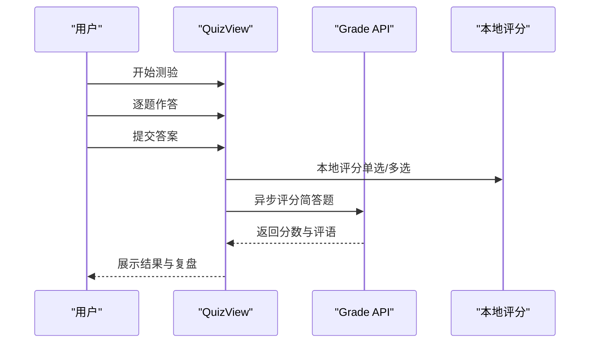
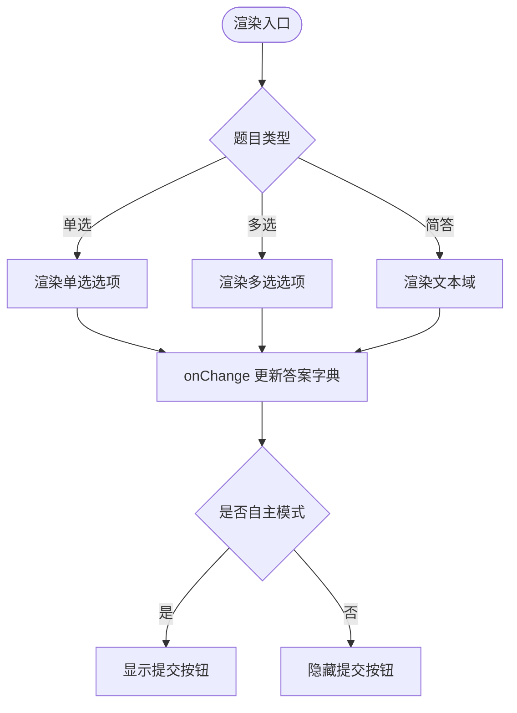
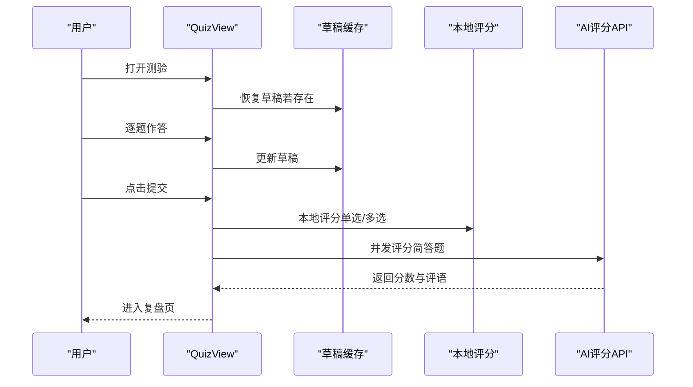
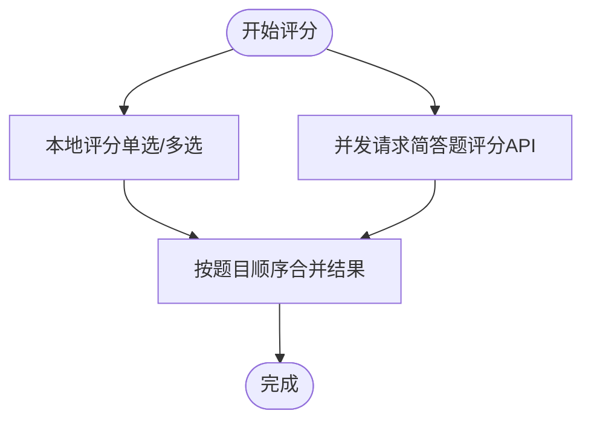
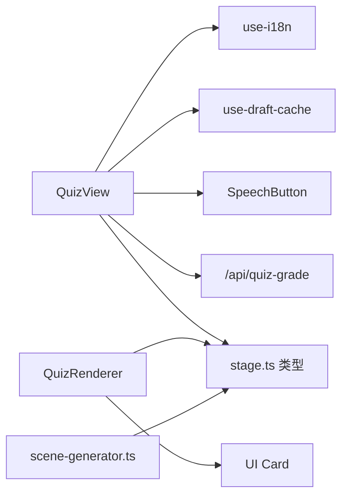

# 测验场景渲染器

<cite>
**本文档引用的文件**
- [quiz-renderer.tsx](file://components/scene-renderers/quiz-renderer.tsx)
- [quiz-view.tsx](file://components/scene-renderers/quiz-view.tsx)
- [stage.ts](file://lib/types/stage.ts)
- [route.ts](file://app/api/quiz-grade/route.ts)
- [scene-generator.ts](file://lib/generation/scene-generator.ts)
- [use-i18n.tsx](file://lib/hooks/use-i18n.tsx)
- [speech-button.tsx](file://components/audio/speech-button.tsx)
- [use-draft-cache.ts](file://lib/hooks/use-draft-cache.ts)
</cite>

## 目录
1. [简介](#简介)
2. [项目结构](#项目结构)
3. [核心组件](#核心组件)
4. [架构总览](#架构总览)
5. [详细组件分析](#详细组件分析)
6. [依赖关系分析](#依赖关系分析)
7. [性能考量](#性能考量)
8. [故障排查指南](#故障排查指南)
9. [结论](#结论)
10. [附录](#附录)

## 简介
本文件为“测验场景渲染器”的技术文档，覆盖以下目标：
- 解释测验渲染器的实现架构与交互流程，包括单选题、多选题与简答题的渲染逻辑
- 文档化测验组件的状态管理，包括答案收集、验证与提交机制
- 深入分析测验视图的交互设计，明确自动模式与回放模式的区别
- 解释测验数据结构与类型定义，涵盖题目类型、选项格式与答案标准
- 提供测验场景的自定义配置与样式定制方案
- 给出实际开发示例与用户体验优化建议

## 项目结构
测验场景渲染器由两套组件构成：
- 渲染器（Renderer）：用于在“内容生成预览”或“课堂播放”中展示测验内容，支持两种模式：自主模式（autonomous）与回放模式（playback）
- 视图（View）：用于课堂内交互式测验，包含开始页、答题页、评分页与复盘页，支持草稿缓存、AI评分与语音输入

图表来源
- [quiz-renderer.tsx:1-84](file://components/scene-renderers/quiz-renderer.tsx#L1-L84)
- [quiz-view.tsx:1-1006](file://components/scene-renderers/quiz-view.tsx#L1-L1006)
- [stage.ts:76-96](file://lib/types/stage.ts#L76-L96)
- [scene-generator.ts:632-727](file://lib/generation/scene-generator.ts#L632-L727)
- [route.ts:28-96](file://app/api/quiz-grade/route.ts#L28-L96)
- [use-i18n.tsx:1-61](file://lib/hooks/use-i18n.tsx#L1-L61)
- [use-draft-cache.ts](file://lib/hooks/use-draft-cache.ts)

章节来源
- [quiz-renderer.tsx:1-84](file://components/scene-renderers/quiz-renderer.tsx#L1-L84)
- [quiz-view.tsx:1-1006](file://components/scene-renderers/quiz-view.tsx#L1-L1006)
- [stage.ts:76-96](file://lib/types/stage.ts#L76-L96)
- [scene-generator.ts:632-727](file://lib/generation/scene-generator.ts#L632-L727)
- [route.ts:28-96](file://app/api/quiz-grade/route.ts#L28-L96)
- [use-i18n.tsx:1-61](file://lib/hooks/use-i18n.tsx#L1-L61)
- [use-draft-cache.ts](file://lib/hooks/use-draft-cache.ts)

## 核心组件
- QuizRenderer（渲染器）
  - 接收 QuizContent，按题目类型渲染单选、多选与简答题
  - 支持两种模式：autonomous（自主）与 playback（回放），在自主模式下显示提交按钮
  - 使用本地状态保存用户答案，onChange 回调更新答案字典
- QuizView（视图）
  - 完整的测验生命周期：封面页 → 答题页 → 评分页 → 复盘页
  - 答题页支持单选、多选与简答题；简答题支持语音转写追加
  - 本地评分单选/多选，异步调用后端API评分简答题
  - 草稿缓存：基于 sceneId 的本地草稿，离开页面时清理，重新进入自动恢复

章节来源
- [quiz-renderer.tsx:9-84](file://components/scene-renderers/quiz-renderer.tsx#L9-L84)
- [quiz-view.tsx:38-1006](file://components/scene-renderers/quiz-view.tsx#L38-L1006)

## 架构总览
测验渲染器采用“渲染器 + 视图 + 类型 + 生成器 + API”的分层架构：
- 渲染器：面向内容展示，不依赖后端评分
- 视图：面向课堂交互，包含评分与反馈
- 类型：统一的题目、选项、答案与内容结构
- 生成器：从大纲生成测验内容，归一化选项与答案
- API：简答题评分服务，返回分数与评语

图表来源
- [quiz-view.tsx:738-777](file://components/scene-renderers/quiz-view.tsx#L738-L777)
- [route.ts:28-96](file://app/api/quiz-grade/route.ts#L28-L96)

## 详细组件分析

### 数据结构与类型定义
- 测验内容结构
  - QuizContent：包含 type: 'quiz' 与 questions 数组
  - QuizQuestion：包含 id、type、question、options、answer、analysis、commentPrompt、hasAnswer、points
  - QuizOption：包含 label 与 value（如 "A"、"B"）

- 生成器中的归一化
  - 将 AI 输出的字符串数组或对象数组归一化为 QuizOption[]
  - 将 AI 输出的答案字段（answer/correctAnswer/correct_answer）归一化为 string[]

章节来源
- [stage.ts:76-96](file://lib/types/stage.ts#L76-L96)
- [scene-generator.ts:686-727](file://lib/generation/scene-generator.ts#L686-L727)

### 渲染器（QuizRenderer）
- 功能要点
  - 单选题：使用 radio 输入，字母前缀作为选项值
  - 多选题：使用 label 包裹的 radio，支持多选
  - 简答题：使用 textarea，支持语音输入追加
  - 自主模式显示提交按钮，回放模式隐藏提交
- 交互逻辑
  - handleAnswerChange 更新 answers 字典
  - answers 通过 props 传入，渲染器不负责持久化

图表来源
- [quiz-renderer.tsx:26-74](file://components/scene-renderers/quiz-renderer.tsx#L26-L74)

章节来源
- [quiz-renderer.tsx:9-84](file://components/scene-renderers/quiz-renderer.tsx#L9-L84)

### 视图（QuizView）
- 生命周期与状态
  - 阶段（Phase）：not_started → answering → grading → reviewing
  - 答案（answers）：Record<string, string | string[]>
  - 结果（results）：QuestionResult[]
  - 草稿缓存：基于 sceneId 的本地缓存，离开页面清理，进入自动恢复
- 渲染子组件
  - SingleChoiceQuestion/MultipleChoiceQuestion/ShortAnswerQuestion：分别处理三类题型
  - QuestionCard：通用题卡样式与边框颜色
  - ScoreBanner：总分与百分比环形图
  - QuizCover：封面页，包含题目数量与总分信息
- 评分与提交
  - 本地评分单选/多选：gradeChoiceQuestions
  - 简答题评分：gradeShortAnswerQuestion（调用 /api/quiz-grade）
  - 并行评分：短答并发请求，完成后合并结果顺序
- 交互细节
  - 答题页禁用提交直到全部作答
  - 复盘页禁用交互，仅展示正确/错误标记与解析
  - 简答题支持语音转写追加（SpeechButton）

图表来源
- [quiz-view.tsx:688-777](file://components/scene-renderers/quiz-view.tsx#L688-L777)
- [route.ts:28-96](file://app/api/quiz-grade/route.ts#L28-L96)

章节来源
- [quiz-view.tsx:28-136](file://components/scene-renderers/quiz-view.tsx#L28-L136)
- [quiz-view.tsx:220-494](file://components/scene-renderers/quiz-view.tsx#L220-L494)
- [quiz-view.tsx:688-1006](file://components/scene-renderers/quiz-view.tsx#L688-L1006)

### 自动模式与回放模式
- 自动模式（autonomous）
  - 用户可提交答案，进入评分阶段
  - 支持草稿缓存与本地恢复
- 回放模式（playback）
  - 主要用于课堂播放，不暴露提交按钮
  - 渲染器不负责答案持久化，仅展示内容

章节来源
- [quiz-renderer.tsx:9-13](file://components/scene-renderers/quiz-renderer.tsx#L9-L13)
- [quiz-renderer.tsx:75-79](file://components/scene-renderers/quiz-renderer.tsx#L75-L79)

### 简答题评分流程
- 本地评分单选/多选：直接比较用户答案与标准答案集合
- 简答题评分：调用 /api/quiz-grade，传入题目、用户答案、分数、语言与评分要点
- 后端评分：根据语言选择系统提示，要求返回 JSON {score, comment}
- 前端合并：将本地与后端结果按题目顺序合并，生成最终结果

图表来源
- [quiz-view.tsx:62-80](file://components/scene-renderers/quiz-view.tsx#L62-L80)
- [quiz-view.tsx:82-136](file://components/scene-renderers/quiz-view.tsx#L82-L136)
- [route.ts:28-96](file://app/api/quiz-grade/route.ts#L28-L96)

章节来源
- [quiz-view.tsx:62-136](file://components/scene-renderers/quiz-view.tsx#L62-L136)
- [route.ts:28-96](file://app/api/quiz-grade/route.ts#L28-L96)

### 选项与答案归一化
- 选项归一化：将 AI 输出的字符串数组或对象数组转换为 {value, label} 形式
- 答案归一化：兼容多种字段名（answer、correctAnswer、correct_answer），输出 string[]

章节来源
- [scene-generator.ts:686-727](file://lib/generation/scene-generator.ts#L686-L727)

## 依赖关系分析
- 组件间依赖
  - QuizView 依赖 useI18n（国际化）、useDraftCache（草稿缓存）、SpeechButton（语音输入）
  - QuizRenderer 依赖 UI 卡片组件与 cn 工具函数
- 类型依赖
  - 两者均依赖 lib/types/stage.ts 中的 QuizContent、QuizQuestion、QuizOption
- 后端依赖
  - 简答题评分依赖 /api/quiz-grade/route.ts

图表来源
- [quiz-view.tsx:17-25](file://components/scene-renderers/quiz-view.tsx#L17-L25)
- [quiz-renderer.tsx:4-7](file://components/scene-renderers/quiz-renderer.tsx#L4-L7)
- [stage.ts:76-96](file://lib/types/stage.ts#L76-L96)
- [scene-generator.ts:632-727](file://lib/generation/scene-generator.ts#L632-L727)
- [route.ts:28-96](file://app/api/quiz-grade/route.ts#L28-L96)

章节来源
- [quiz-view.tsx:17-25](file://components/scene-renderers/quiz-view.tsx#L17-L25)
- [quiz-renderer.tsx:4-7](file://components/scene-renderers/quiz-renderer.tsx#L4-L7)
- [stage.ts:76-96](file://lib/types/stage.ts#L76-L96)
- [scene-generator.ts:632-727](file://lib/generation/scene-generator.ts#L632-L727)
- [route.ts:28-96](file://app/api/quiz-grade/route.ts#L28-L96)

## 性能考量
- 并行评分：简答题评分使用 Promise.all 并发请求，缩短整体等待时间
- 本地评分：单选/多选即时完成，减少网络往返
- 草稿缓存：避免用户离开页面后丢失进度，提升体验
- 动画与过渡：使用 motion/react 的轻量动画，避免阻塞主线程

## 故障排查指南
- 简答题评分失败
  - 现象：出现基础分与提示语
  - 原因：后端 API 返回非 JSON 或网络异常
  - 处理：检查模型配置头（x-model、x-api-key 等）与网络连通性
- 本地评分不一致
  - 现象：多选题排序导致不一致
  - 原因：比较前未排序
  - 处理：arraysEqual 对两个数组先排序再比较
- 国际化文案缺失
  - 现象：显示键名而非文案
  - 原因：翻译键不存在或 locale 不匹配
  - 处理：确认 use-i18n 的 locale 与翻译键

章节来源
- [quiz-view.tsx:122-135](file://components/scene-renderers/quiz-view.tsx#L122-L135)
- [quiz-view.tsx:45-50](file://components/scene-renderers/quiz-view.tsx#L45-L50)
- [use-i18n.tsx:43-50](file://lib/hooks/use-i18n.tsx#L43-L50)

## 结论
测验场景渲染器提供了从内容生成到课堂交互的完整能力：
- 渲染器适合内容预览与回放场景，简洁高效
- 视图适合课堂互动，具备完整的评分与反馈闭环
- 类型与生成器确保了测验数据的一致性与可扩展性
- 通过草稿缓存与国际化，提升了用户体验与可维护性

## 附录

### 自定义配置与样式定制
- 配置项
  - 测验生成：在大纲中设置 quizConfig（题数、难度、题型）
  - 评分要点：在题目中设置 commentPrompt，指导 AI 评分
- 样式定制
  - 可通过主题变量与 Tailwind 类名调整卡片、按钮与边框颜色
  - 语音输入按钮位置与尺寸可通过组件参数微调
- 交互增强
  - 在简答题中集成语音输入，提升无障碍体验
  - 复盘页展示解析与 AI 评语，帮助学习反思

章节来源
- [scene-generator.ts:632-649](file://lib/generation/scene-generator.ts#L632-L649)
- [stage.ts:86-96](file://lib/types/stage.ts#L86-L96)
- [speech-button.tsx](file://components/audio/speech-button.tsx)

### 实际开发示例
- 在大纲中添加 quizConfig 字段，控制生成的题数、难度与题型
- 在题目中设置 commentPrompt，使简答题评分更贴合教学目标
- 在课堂中使用 QuizView，开启草稿缓存，提升连续学习体验

章节来源
- [scene-generator.ts:632-649](file://lib/generation/scene-generator.ts#L632-L649)
- [quiz-view.tsx:694-701](file://components/scene-renderers/quiz-view.tsx#L694-L701)