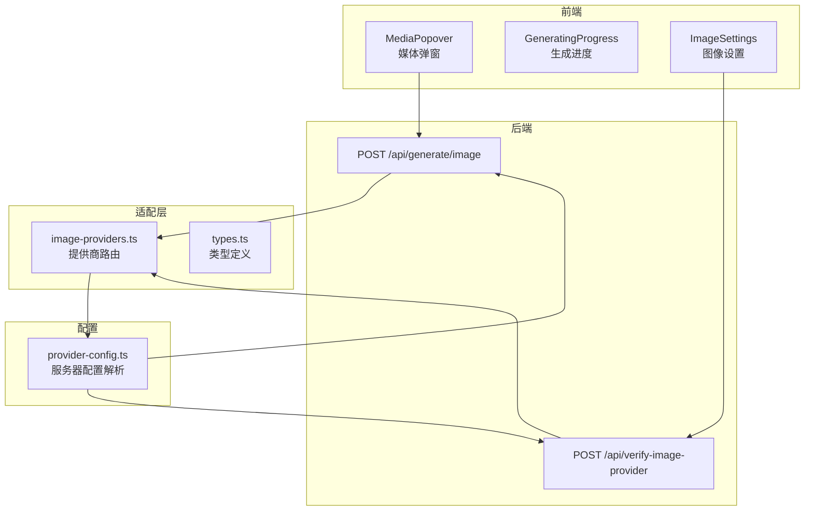
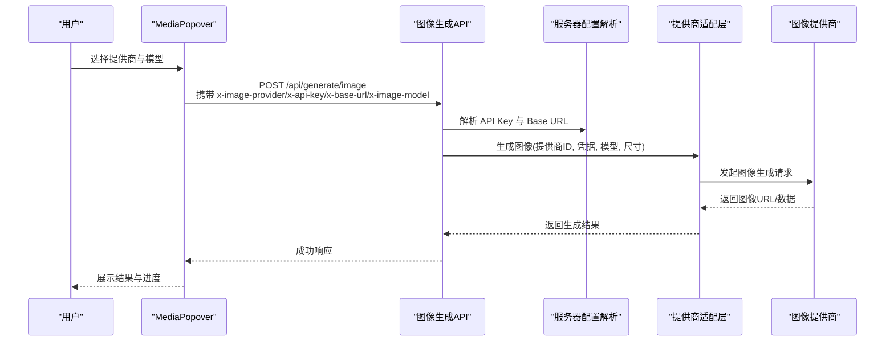
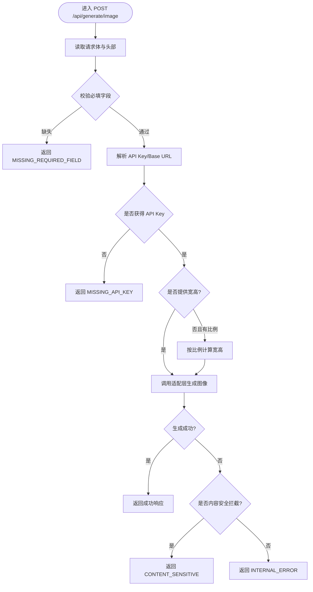
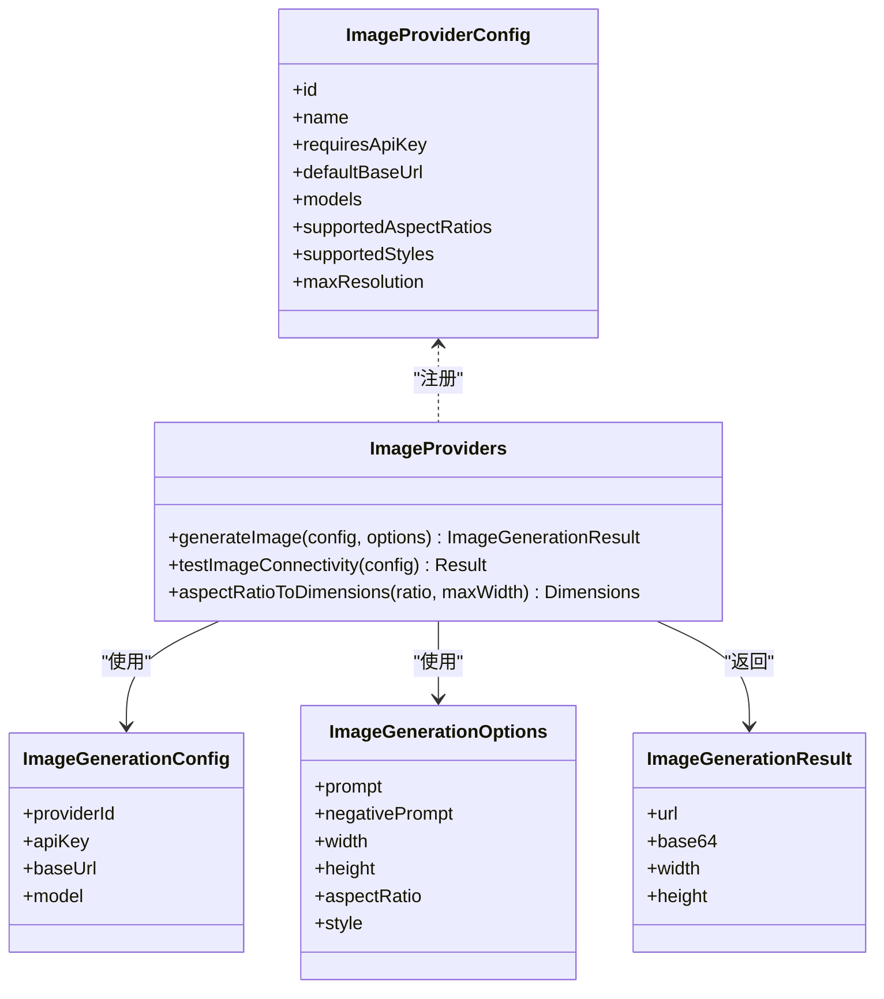
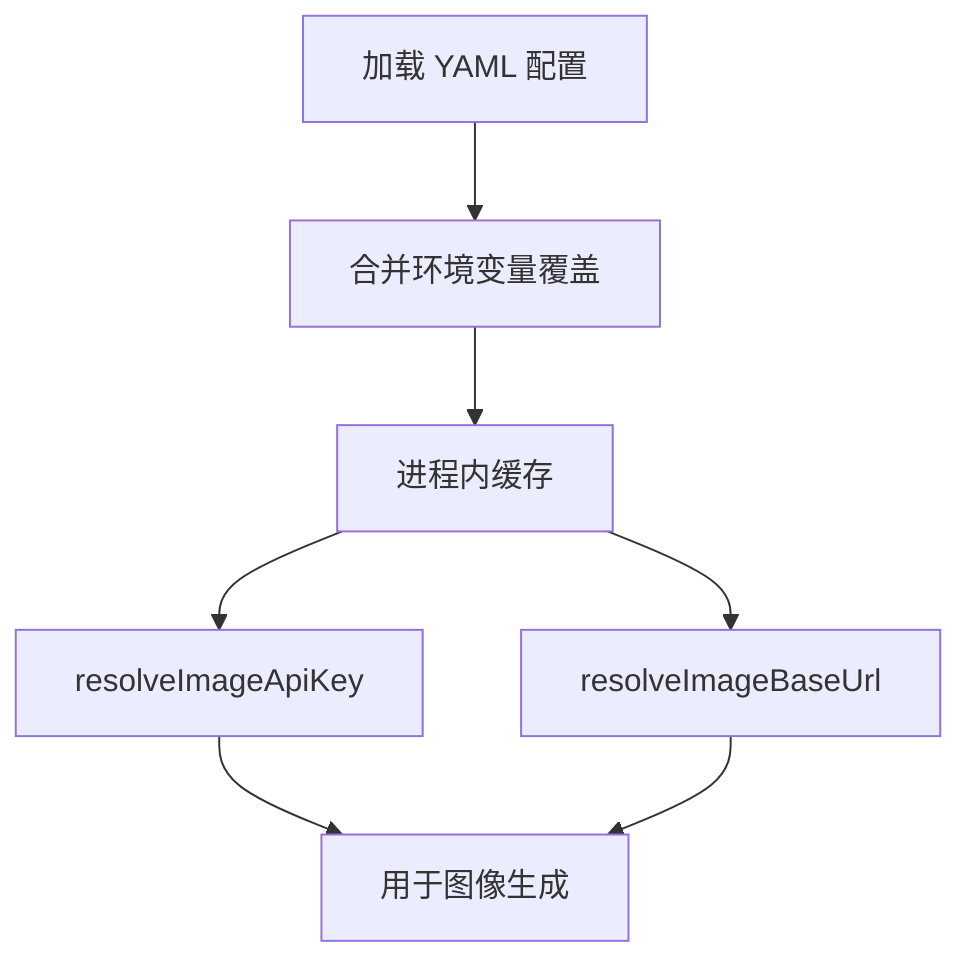
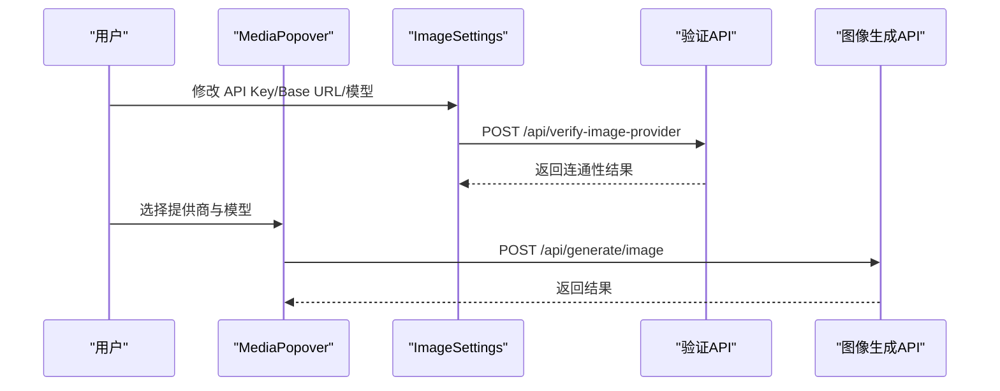
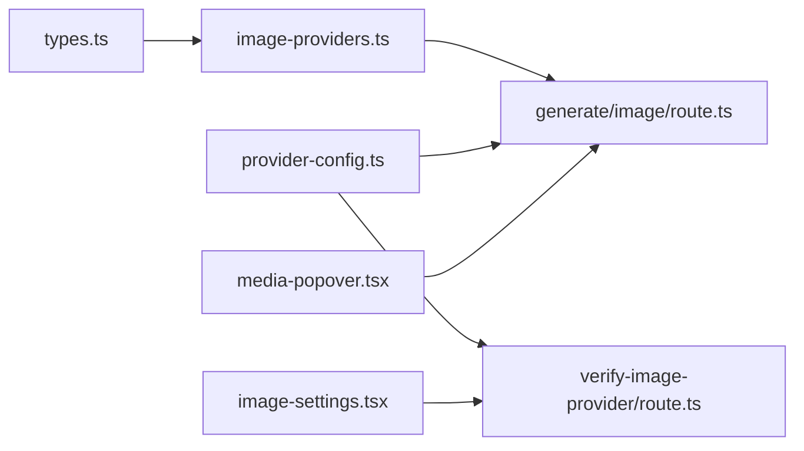
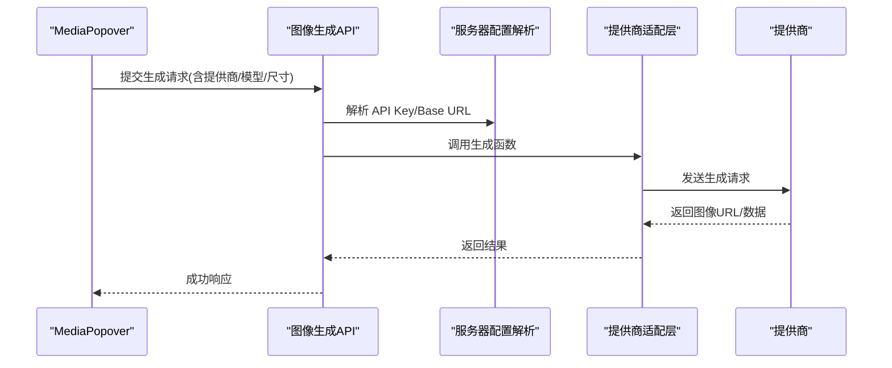

# 图像生成功能

<cite>
**本文引用的文件**
- [app/api/generate/image/route.ts](file://app/api/generate/image/route.ts)
- [app/api/verify-image-provider/route.ts](file://app/api/verify-image-provider/route.ts)
- [lib/media/image-providers.ts](file://lib/media/image-providers.ts)
- [lib/media/types.ts](file://lib/media/types.ts)
- [lib/server/provider-config.ts](file://lib/server/provider-config.ts)
- [components/generation/media-popover.tsx](file://components/generation/media-popover.tsx)
- [components/generation/generating-progress.tsx](file://components/generation/generating-progress.tsx)
- [components/settings/image-settings.tsx](file://components/settings/image-settings.tsx)
- [lib/storage/index.ts](file://lib/storage/index.ts)
</cite>

## 目录
1. [简介](#简介)
2. [项目结构](#项目结构)
3. [核心组件](#核心组件)
4. [架构总览](#架构总览)
5. [详细组件分析](#详细组件分析)
6. [依赖关系分析](#依赖关系分析)
7. [性能考量](#性能考量)
8. [故障排查指南](#故障排查指南)
9. [结论](#结论)
10. [附录](#附录)

## 简介
本文件面向图像生成功能，系统性阐述从用户输入到最终图像输出的完整处理链路，覆盖提示词处理、图像质量与分辨率控制、图像存储与管理、UI 交互与进度展示、多提供商集成与参数配置、以及错误处理与最佳实践。读者可据此快速理解并扩展图像生成能力。

## 项目结构
图像生成功能由“前端 UI 控件 + 后端 API + 提供商适配层 + 服务器配置解析”四部分组成：
- 前端：媒体弹窗选择器、生成进度展示、图像设置面板
- 后端：图像生成 API、提供商连通性验证 API
- 适配层：统一的提供商注册表与生成/连通性函数
- 配置：支持 YAML + 环境变量的服务器侧配置解析

图表来源
- [app/api/generate/image/route.ts:29-78](file://app/api/generate/image/route.ts#L29-L78)
- [app/api/verify-image-provider/route.ts:26-56](file://app/api/verify-image-provider/route.ts#L26-L56)
- [lib/media/image-providers.ts:16-113](file://lib/media/image-providers.ts#L16-L113)
- [lib/media/types.ts:62-170](file://lib/media/types.ts#L62-L170)
- [lib/server/provider-config.ts:328-348](file://lib/server/provider-config.ts#L328-L348)

章节来源
- [app/api/generate/image/route.ts:1-79](file://app/api/generate/image/route.ts#L1-L79)
- [app/api/verify-image-provider/route.ts:1-57](file://app/api/verify-image-provider/route.ts#L1-L57)
- [lib/media/image-providers.ts:1-113](file://lib/media/image-providers.ts#L1-L113)
- [lib/media/types.ts:1-321](file://lib/media/types.ts#L1-L321)
- [lib/server/provider-config.ts:1-398](file://lib/server/provider-config.ts#L1-L398)

## 核心组件
- 图像生成 API（服务端）
  - 负责接收请求、校验参数、解析提供商凭据与基础地址、推导尺寸、调用适配层并返回结果或错误
- 图像提供商适配层
  - 统一注册多个提供商（如 Seedream、Qwen Image、Nano Banana），暴露生成与连通性测试函数
- 服务器配置解析
  - 支持 YAML + 环境变量加载提供商密钥与基础地址，客户端可覆盖但优先使用服务器配置
- 前端组件
  - 媒体弹窗：选择图像提供商与模型
  - 生成进度：展示生成里程碑与状态
  - 图像设置：配置 API Key、Base URL、自定义模型，并进行连通性测试

章节来源
- [app/api/generate/image/route.ts:29-78](file://app/api/generate/image/route.ts#L29-L78)
- [lib/media/image-providers.ts:16-113](file://lib/media/image-providers.ts#L16-L113)
- [lib/server/provider-config.ts:328-348](file://lib/server/provider-config.ts#L328-L348)
- [components/generation/media-popover.tsx:74-448](file://components/generation/media-popover.tsx#L74-L448)
- [components/generation/generating-progress.tsx:57-141](file://components/generation/generating-progress.tsx#L57-L141)
- [components/settings/image-settings.tsx:29-339](file://components/settings/image-settings.tsx#L29-L339)

## 架构总览
下图展示了从浏览器到提供商的完整调用链，以及服务器配置如何在其中发挥作用：

图表来源
- [app/api/generate/image/route.ts:29-78](file://app/api/generate/image/route.ts#L29-L78)
- [lib/server/provider-config.ts:337-348](file://lib/server/provider-config.ts#L337-L348)
- [lib/media/image-providers.ts:89-103](file://lib/media/image-providers.ts#L89-L103)

## 详细组件分析

### 图像生成 API（服务端）
- 请求头与负载
  - 头部：x-image-provider（提供商 ID）、x-api-key（可选，客户端覆盖）、x-base-url（可选）、x-image-model（可选）
  - 负载：prompt（必填）、negativePrompt（可选）、width/height（可选）、aspectRatio（可选）、style（可选）
- 关键逻辑
  - 必填字段校验（缺少 prompt 直接返回错误）
  - 解析提供商凭据与基础地址（优先客户端，其次服务器配置）
  - 当仅提供 aspectRatio 时，自动推导宽高
  - 记录日志并调用适配层生成图像
  - 错误处理：内容安全过滤拦截（敏感内容）与通用异常捕获
- 响应
  - 成功：包含 ImageGenerationResult
  - 失败：标准化错误码与消息

图表来源
- [app/api/generate/image/route.ts:29-78](file://app/api/generate/image/route.ts#L29-L78)

章节来源
- [app/api/generate/image/route.ts:1-79](file://app/api/generate/image/route.ts#L1-L79)

### 图像提供商适配层
- 注册表
  - 统一注册提供商元信息（名称、图标、默认 Base URL、支持的模型、支持的比例等）
- 生成与连通性
  - generateImage：根据提供商 ID 路由到具体适配器
  - testImageConnectivity：轻量连通性测试
  - aspectRatioToDimensions：将比例转换为像素尺寸（默认最大宽度）

图表来源
- [lib/media/image-providers.ts:16-113](file://lib/media/image-providers.ts#L16-L113)
- [lib/media/types.ts:72-170](file://lib/media/types.ts#L72-L170)

章节来源
- [lib/media/image-providers.ts:1-113](file://lib/media/image-providers.ts#L1-L113)
- [lib/media/types.ts:1-321](file://lib/media/types.ts#L1-L321)

### 服务器配置解析（YAML + 环境变量）
- 加载顺序
  - 优先 YAML 文件（默认 server-providers.yml），再叠加环境变量覆盖
- 图像提供商解析
  - resolveImageApiKey / resolveImageBaseUrl：客户端未提供时使用服务器配置
- 其他模块（LLM/TTS/ASR/PDF/视频/网络搜索）亦采用相同模式，便于集中管理

图表来源
- [lib/server/provider-config.ts:101-168](file://lib/server/provider-config.ts#L101-L168)
- [lib/server/provider-config.ts:328-348](file://lib/server/provider-config.ts#L328-L348)

章节来源
- [lib/server/provider-config.ts:1-398](file://lib/server/provider-config.ts#L1-L398)

### 前端组件：媒体弹窗与生成进度
- 媒体弹窗（MediaPopover）
  - 切换图像/视频/TTS/ASR 能力开关
  - 分组选择提供商与模型（含自定义模型）
  - 打开高级设置入口
- 生成进度（GeneratingProgress）
  - 展示大纲完成、第一页生成等里程碑
  - 动态状态与错误提示
- 图像设置（ImageSettings）
  - 配置 API Key、Base URL、自定义模型
  - 连通性测试（调用 /api/verify-image-provider）

图表来源
- [components/generation/media-popover.tsx:74-448](file://components/generation/media-popover.tsx#L74-L448)
- [components/generation/generating-progress.tsx:57-141](file://components/generation/generating-progress.tsx#L57-L141)
- [components/settings/image-settings.tsx:29-339](file://components/settings/image-settings.tsx#L29-L339)
- [app/api/verify-image-provider/route.ts:26-56](file://app/api/verify-image-provider/route.ts#L26-L56)
- [app/api/generate/image/route.ts:29-78](file://app/api/generate/image/route.ts#L29-L78)

章节来源
- [components/generation/media-popover.tsx:1-568](file://components/generation/media-popover.tsx#L1-L568)
- [components/generation/generating-progress.tsx:1-141](file://components/generation/generating-progress.tsx#L1-L141)
- [components/settings/image-settings.tsx:1-339](file://components/settings/image-settings.tsx#L1-L339)

## 依赖关系分析
- 组件耦合
  - 服务端 API 依赖适配层与服务器配置解析；适配层依赖类型定义；前端组件依赖适配层与设置存储
- 外部依赖
  - 提供商 HTTP 接口（由各适配器实现）
  - 日志与响应封装工具（在 API 中使用）
- 可能的循环依赖
  - 代码组织上以“类型定义 → 适配层 → 服务端 API → 前端组件”的单向依赖为主，未见循环

图表来源
- [lib/media/types.ts:62-170](file://lib/media/types.ts#L62-L170)
- [lib/media/image-providers.ts:1-113](file://lib/media/image-providers.ts#L1-L113)
- [app/api/generate/image/route.ts:1-79](file://app/api/generate/image/route.ts#L1-L79)
- [lib/server/provider-config.ts:1-398](file://lib/server/provider-config.ts#L1-L398)
- [app/api/verify-image-provider/route.ts:1-57](file://app/api/verify-image-provider/route.ts#L1-L57)
- [components/generation/media-popover.tsx:1-568](file://components/generation/media-popover.tsx#L1-L568)
- [components/settings/image-settings.tsx:1-339](file://components/settings/image-settings.tsx#L1-L339)

章节来源
- [lib/media/types.ts:1-321](file://lib/media/types.ts#L1-L321)
- [lib/media/image-providers.ts:1-113](file://lib/media/image-providers.ts#L1-L113)
- [app/api/generate/image/route.ts:1-79](file://app/api/generate/image/route.ts#L1-L79)
- [lib/server/provider-config.ts:1-398](file://lib/server/provider-config.ts#L1-L398)
- [app/api/verify-image-provider/route.ts:1-57](file://app/api/verify-image-provider/route.ts#L1-L57)
- [components/generation/media-popover.tsx:1-568](file://components/generation/media-popover.tsx#L1-L568)
- [components/settings/image-settings.tsx:1-339](file://components/settings/image-settings.tsx#L1-L339)

## 性能考量
- 超时与并发
  - 服务端函数设置了最大执行时长，避免长时间占用资源
- 尺寸与比例
  - 自动将比例转换为像素尺寸，减少无效请求与重试
- 缓存与复用
  - 服务器配置采用进程内缓存，降低重复加载成本
- 建议
  - 对于高并发场景，建议在网关层做限流与排队
  - 对于大分辨率输出，建议在前端限制最大宽高并提示用户
  - 对于频繁切换提供商/模型，可在前端做本地缓存与预热

章节来源
- [app/api/generate/image/route.ts:27-27](file://app/api/generate/image/route.ts#L27-L27)
- [lib/media/image-providers.ts:105-113](file://lib/media/image-providers.ts#L105-L113)
- [lib/server/provider-config.ts:176-217](file://lib/server/provider-config.ts#L176-L217)

## 故障排查指南
- 常见错误与定位
  - 缺少必要字段：检查请求体中是否包含 prompt
  - 缺少 API Key：确认客户端是否传入或服务器配置是否存在
  - 内容安全拦截：当提供商返回敏感内容拒绝时，会记录警告并返回特定错误码
  - 通用内部错误：捕获异常并记录堆栈，返回通用错误码
- 连通性测试
  - 使用“图像设置”中的测试按钮，调用验证 API 获取即时反馈
- 日志
  - 服务端 API 与验证 API 均记录关键信息，便于问题追踪

章节来源
- [app/api/generate/image/route.ts:68-78](file://app/api/generate/image/route.ts#L68-L78)
- [app/api/verify-image-provider/route.ts:52-56](file://app/api/verify-image-provider/route.ts#L52-L56)
- [components/settings/image-settings.tsx:72-100](file://components/settings/image-settings.tsx#L72-L100)

## 结论
该图像生成功能以清晰的分层设计实现了从 UI 到提供商的全链路集成：前端负责交互与配置，后端负责参数校验与路由，适配层统一抽象多提供商差异，服务器配置解析保障密钥与地址的安全与灵活管理。通过连通性测试与日志体系，系统具备良好的可观测性与可维护性。建议在生产环境中结合限流、缓存与 CDN 策略进一步提升稳定性与用户体验。

## 附录

### 图像生成流程（从 UI 到输出）

图表来源
- [components/generation/media-popover.tsx:74-448](file://components/generation/media-popover.tsx#L74-L448)
- [app/api/generate/image/route.ts:29-78](file://app/api/generate/image/route.ts#L29-L78)
- [lib/server/provider-config.ts:337-348](file://lib/server/provider-config.ts#L337-L348)
- [lib/media/image-providers.ts:89-103](file://lib/media/image-providers.ts#L89-L103)

### 存储与管理机制现状
- 当前存储提供者为占位实现（Noop），未接入实际持久化
- 建议
  - 若提供商返回托管 URL：直接使用，无需本地缓存
  - 若需要本地缓存：可扩展 StorageProvider 接口，结合 CDN 分发与过期清理策略
  - 清理策略：基于 TTL 或 LRU，定期扫描并删除过期资源

章节来源
- [lib/storage/index.ts:1-14](file://lib/storage/index.ts#L1-L14)

### 不同提供商集成要点
- Seedream/Qwen Image/Nano Banana
  - 在提供商注册表中声明默认 Base URL、支持模型与比例
  - 在适配层实现具体的生成与连通性测试函数
  - 通过服务器配置解析统一注入凭据与地址

章节来源
- [lib/media/image-providers.ts:16-69](file://lib/media/image-providers.ts#L16-L69)
- [lib/server/provider-config.ts:328-348](file://lib/server/provider-config.ts#L328-L348)

### 参数配置与错误处理最佳实践
- 参数
  - prompt 必填；若未显式指定宽高，可使用 aspectRatio 推导
  - API Key 与 Base URL 优先级：客户端覆盖 > 服务器配置
- 错误处理
  - 明确区分内容安全拦截与通用异常
  - 使用标准化错误码与消息，便于前端统一展示

章节来源
- [app/api/generate/image/route.ts:33-78](file://app/api/generate/image/route.ts#L33-L78)
- [lib/media/types.ts:139-152](file://lib/media/types.ts#L139-L152)