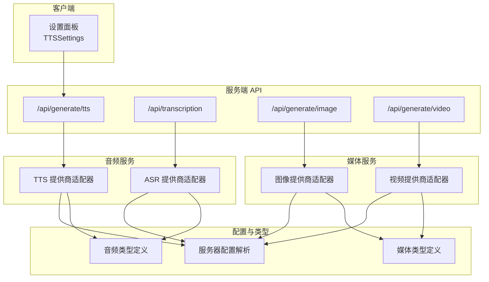
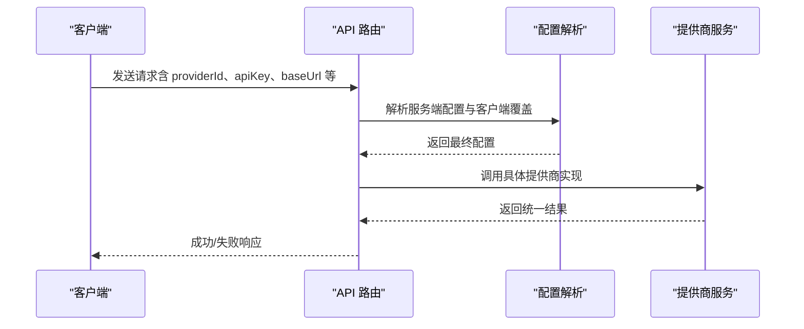
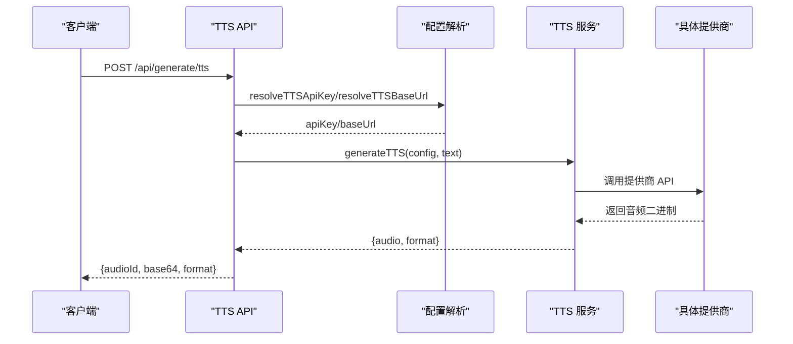
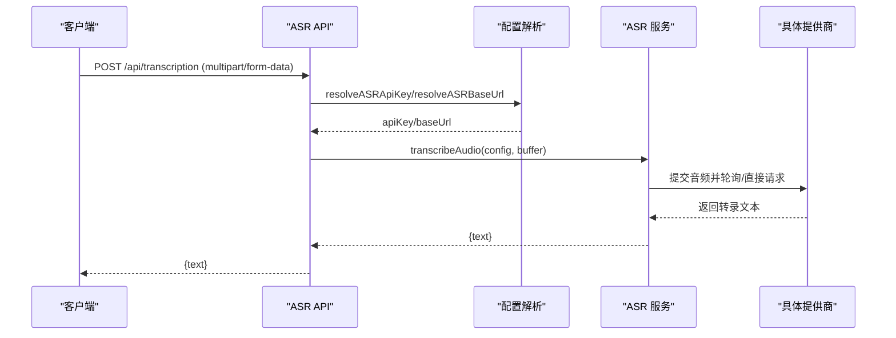
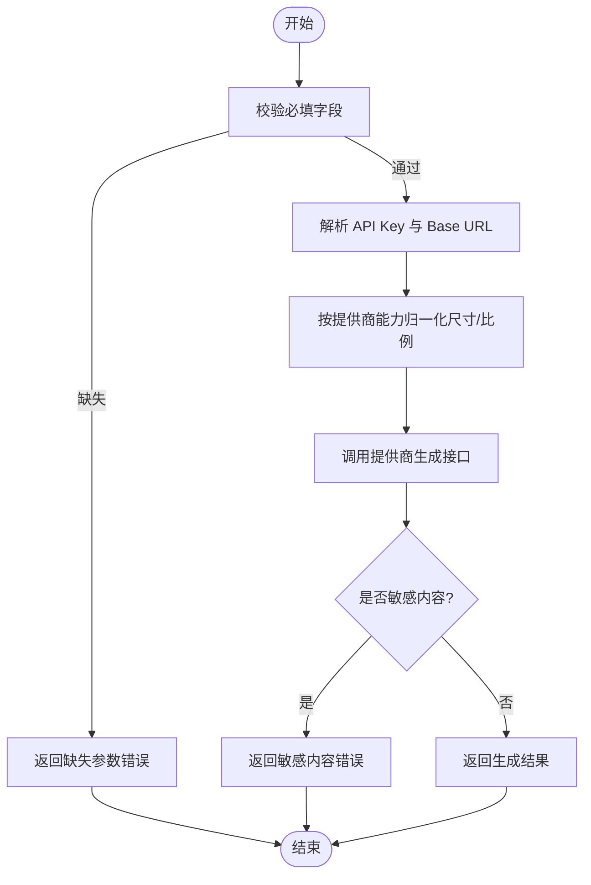
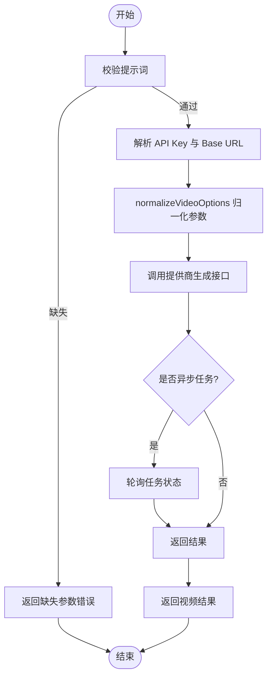
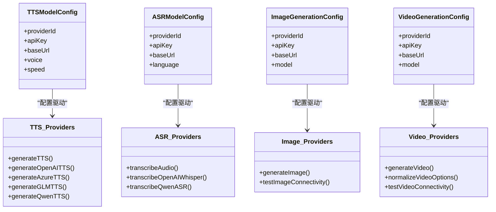

# 多媒体处理系统

<cite>
**本文档引用的文件**
- [README.md](file://README.md)
- [app/api/generate/tts/route.ts](file://app/api/generate/tts/route.ts)
- [app/api/transcription/route.ts](file://app/api/transcription/route.ts)
- [app/api/generate/image/route.ts](file://app/api/generate/image/route.ts)
- [app/api/generate/video/route.ts](file://app/api/generate/video/route.ts)
- [lib/audio/tts-providers.ts](file://lib/audio/tts-providers.ts)
- [lib/audio/asr-providers.ts](file://lib/audio/asr-providers.ts)
- [lib/media/image-providers.ts](file://lib/media/image-providers.ts)
- [lib/media/video-providers.ts](file://lib/media/video-providers.ts)
- [lib/server/provider-config.ts](file://lib/server/provider-config.ts)
- [lib/audio/types.ts](file://lib/audio/types.ts)
- [lib/media/types.ts](file://lib/media/types.ts)
- [components/settings/tts-settings.tsx](file://components/settings/tts-settings.tsx)
</cite>

## 目录
1. [简介](#简介)
2. [项目结构](#项目结构)
3. [核心组件](#核心组件)
4. [架构总览](#架构总览)
5. [详细组件分析](#详细组件分析)
6. [依赖关系分析](#依赖关系分析)
7. [性能考虑](#性能考虑)
8. [故障排除指南](#故障排除指南)
9. [结论](#结论)
10. [附录](#附录)

## 简介
本项目是一个基于 Next.js 的多媒体处理平台，提供语音合成（TTS）、语音识别（ASR）、图像生成与视频生成等能力。系统采用模块化的服务端 API 路由与客户端设置面板相结合的方式，支持多提供商接入、声音定制与实时转录，并通过统一的类型定义与配置管理实现可扩展的多媒体服务集成。

## 项目结构
- 服务端 API 路由位于 app/api 下，分别处理 TTS、ASR、图像与视频生成请求。
- 核心业务逻辑位于 lib 下，包含音频与媒体服务的提供商适配器、类型定义与服务器配置解析。
- 客户端设置面板位于 components/settings 下，用于配置与测试 TTS 提供商。

**图表来源**
- [app/api/generate/tts/route.ts:1-81](file://app/api/generate/tts/route.ts#L1-L81)
- [app/api/transcription/route.ts:1-52](file://app/api/transcription/route.ts#L1-L52)
- [app/api/generate/image/route.ts:1-79](file://app/api/generate/image/route.ts#L1-L79)
- [app/api/generate/video/route.ts:1-84](file://app/api/generate/video/route.ts#L1-L84)
- [lib/audio/tts-providers.ts:1-357](file://lib/audio/tts-providers.ts#L1-L357)
- [lib/audio/asr-providers.ts:1-354](file://lib/audio/asr-providers.ts#L1-L354)
- [lib/media/image-providers.ts:1-113](file://lib/media/image-providers.ts#L1-L113)
- [lib/media/video-providers.ts:1-156](file://lib/media/video-providers.ts#L1-L156)
- [lib/server/provider-config.ts:1-398](file://lib/server/provider-config.ts#L1-L398)
- [lib/audio/types.ts:1-173](file://lib/audio/types.ts#L1-L173)
- [lib/media/types.ts:1-321](file://lib/media/types.ts#L1-L321)

**章节来源**
- [README.md:372-426](file://README.md#L372-L426)

## 核心组件
- 语音合成（TTS）：支持 OpenAI、Azure、GLM、Qwen 等提供商，统一通过 generateTTS 工厂函数路由到具体实现；浏览器原生 TTS 仅限客户端使用。
- 语音识别（ASR）：支持 OpenAI Whisper、Qwen ASR，以及浏览器原生识别；使用 Vercel AI SDK 或直接 API 调用。
- 图像生成：支持 Seedream、Qwen Image、Nano Banana；提供尺寸推断与连通性测试。
- 视频生成：支持 Seedance、Kling、Veo、Sora；提供选项归一化与异步任务适配。
- 配置管理：从 YAML 与环境变量加载提供商密钥与基础地址，支持客户端覆盖与服务端默认值。

**章节来源**
- [lib/audio/tts-providers.ts:106-141](file://lib/audio/tts-providers.ts#L106-L141)
- [lib/audio/asr-providers.ts:163-190](file://lib/audio/asr-providers.ts#L163-L190)
- [lib/media/image-providers.ts:89-103](file://lib/media/image-providers.ts#L89-L103)
- [lib/media/video-providers.ts:141-155](file://lib/media/video-providers.ts#L141-L155)
- [lib/server/provider-config.ts:235-274](file://lib/server/provider-config.ts#L235-L274)

## 架构总览
系统采用“API 路由层 + 服务层 + 配置层”的分层设计：
- API 路由层负责请求解析、鉴权与响应包装；
- 服务层封装各提供商的具体实现，统一返回格式；
- 配置层集中管理提供商密钥、基础地址与模型列表，支持客户端覆盖。

**图表来源**
- [app/api/generate/tts/route.ts:21-80](file://app/api/generate/tts/route.ts#L21-L80)
- [lib/server/provider-config.ts:266-274](file://lib/server/provider-config.ts#L266-L274)
- [lib/audio/tts-providers.ts:106-141](file://lib/audio/tts-providers.ts#L106-L141)

## 详细组件分析

### 语音合成（TTS）系统
- 多提供商支持：OpenAI TTS、Azure TTS、GLM TTS、Qwen TTS；浏览器原生 TTS 仅客户端可用。
- 声音定制：通过 voice、speed 参数控制音色与语速；不同提供商支持不同的速度范围与格式。
- 音频生成流程：API 接收文本与配置，调用 generateTTS，返回 base64 编码的音频数据。

**图表来源**
- [app/api/generate/tts/route.ts:21-80](file://app/api/generate/tts/route.ts#L21-L80)
- [lib/audio/tts-providers.ts:106-141](file://lib/audio/tts-providers.ts#L106-L141)
- [lib/server/provider-config.ts:266-274](file://lib/server/provider-config.ts#L266-L274)

**章节来源**
- [app/api/generate/tts/route.ts:1-81](file://app/api/generate/tts/route.ts#L1-L81)
- [lib/audio/tts-providers.ts:1-357](file://lib/audio/tts-providers.ts#L1-L357)
- [lib/audio/types.ts:80-132](file://lib/audio/types.ts#L80-L132)
- [components/settings/tts-settings.tsx:1-275](file://components/settings/tts-settings.tsx#L1-L275)

### 语音识别（ASR）系统
- 集成 OpenAI Whisper 与 Qwen ASR；浏览器原生识别仅客户端可用。
- 实时转录机制：接收音频文件或 Blob，转换为 Buffer 后提交至提供商；部分提供商采用上传 + 轮询模式。
- 错误处理：对空音频、过短音频进行特殊处理，避免抛错影响用户体验。

**图表来源**
- [app/api/transcription/route.ts:11-51](file://app/api/transcription/route.ts#L11-L51)
- [lib/audio/asr-providers.ts:163-190](file://lib/audio/asr-providers.ts#L163-L190)
- [lib/server/provider-config.ts:290-298](file://lib/server/provider-config.ts#L290-L298)

**章节来源**
- [app/api/transcription/route.ts:1-52](file://app/api/transcription/route.ts#L1-L52)
- [lib/audio/asr-providers.ts:1-354](file://lib/audio/asr-providers.ts#L1-L354)
- [lib/audio/types.ts:144-172](file://lib/audio/types.ts#L144-L172)

### 图像生成系统
- 提示词处理：支持 prompt、negativePrompt、宽高或比例（自动换算）与风格参数。
- 生成质量与存储：返回 URL 或内联 base64 数据；支持内容安全过滤拦截敏感内容。
- 存储管理：根据提供商能力返回托管链接，便于后续下载与缓存策略制定。

**图表来源**
- [app/api/generate/image/route.ts:29-79](file://app/api/generate/image/route.ts#L29-L79)
- [lib/media/image-providers.ts:89-103](file://lib/media/image-providers.ts#L89-L103)

**章节来源**
- [app/api/generate/image/route.ts:1-79](file://app/api/generate/image/route.ts#L1-L79)
- [lib/media/image-providers.ts:1-113](file://lib/media/image-providers.ts#L1-L113)
- [lib/media/types.ts:72-169](file://lib/media/types.ts#L72-L169)

### 视频处理系统
- 视频生成：支持 Seedance、Kling、Veo、Sora；提供选项归一化（时长、比例、分辨率）。
- 异步任务：对不支持同步完成的提供商，采用提交任务 + 轮询状态的模式。
- 导出与播放：返回视频 URL、时长与分辨率信息，便于前端渲染与播放器集成。

**图表来源**
- [app/api/generate/video/route.ts:30-84](file://app/api/generate/video/route.ts#L30-L84)
- [lib/media/video-providers.ts:102-155](file://lib/media/video-providers.ts#L102-L155)

**章节来源**
- [app/api/generate/video/route.ts:1-84](file://app/api/generate/video/route.ts#L1-L84)
- [lib/media/video-providers.ts:1-156](file://lib/media/video-providers.ts#L1-L156)
- [lib/media/types.ts:181-269](file://lib/media/types.ts#L181-L269)

### 多媒体服务集成模式
- 第三方 API 封装：每个提供商在对应服务文件中实现独立的生成函数，统一返回格式。
- 错误处理：对 API 错误、空音频、敏感内容进行分类处理与用户友好提示。
- 配置优先级：客户端传入的 apiKey/baseUrl 优先于服务端配置；若服务端已配置则允许覆盖。

**章节来源**
- [lib/audio/tts-providers.ts:1-357](file://lib/audio/tts-providers.ts#L1-L357)
- [lib/audio/asr-providers.ts:1-354](file://lib/audio/asr-providers.ts#L1-L354)
- [lib/media/image-providers.ts:1-113](file://lib/media/image-providers.ts#L1-L113)
- [lib/media/video-providers.ts:1-156](file://lib/media/video-providers.ts#L1-L156)
- [lib/server/provider-config.ts:235-274](file://lib/server/provider-config.ts#L235-L274)

## 依赖关系分析
- 类型驱动：音频与媒体类型定义确保各提供商实现的一致性与可扩展性。
- 配置解耦：服务端配置解析模块与业务服务解耦，便于多环境部署与动态切换。
- 组件协作：设置面板负责收集用户配置并通过 API 路由调用服务层，形成闭环。

**图表来源**
- [lib/audio/types.ts:125-172](file://lib/audio/types.ts#L125-L172)
- [lib/media/types.ts:122-233](file://lib/media/types.ts#L122-L233)
- [lib/audio/tts-providers.ts:106-141](file://lib/audio/tts-providers.ts#L106-L141)
- [lib/audio/asr-providers.ts:163-190](file://lib/audio/asr-providers.ts#L163-L190)
- [lib/media/image-providers.ts:89-103](file://lib/media/image-providers.ts#L89-L103)
- [lib/media/video-providers.ts:141-155](file://lib/media/video-providers.ts#L141-L155)

**章节来源**
- [lib/audio/types.ts:1-173](file://lib/audio/types.ts#L1-L173)
- [lib/media/types.ts:1-321](file://lib/media/types.ts#L1-L321)

## 性能考虑
- 请求超时与并发：TTS 与 ASR 设置了最大执行时长，避免长时间占用资源；图像与视频生成采用异步任务模式。
- 缓存策略：建议对常用提示词与配置结果进行客户端缓存，减少重复请求。
- 网络优化：合理设置代理与基础 URL，降低跨域与网络延迟；对大体积音频/视频采用流式传输或 CDN 加速。
- 资源释放：及时释放 Blob URL 与音频元素，防止内存泄漏。

## 故障排除指南
- API Key 缺失：检查服务端 YAML 与环境变量配置，确认提供商密钥正确无误。
- 内容安全拦截：当返回敏感内容错误时，调整提示词或更换提供商；必要时启用更严格的内容过滤。
- 浏览器原生限制：浏览器原生 TTS/ASR 在服务端不可用，需在客户端使用相应钩子或 UI 控件。
- 时长/比例不支持：视频生成会自动归一化参数，若仍失败请检查目标提供商的支持范围。

**章节来源**
- [app/api/generate/image/route.ts:68-78](file://app/api/generate/image/route.ts#L68-L78)
- [app/api/generate/video/route.ts:73-83](file://app/api/generate/video/route.ts#L73-L83)
- [lib/audio/tts-providers.ts:133-140](file://lib/audio/tts-providers.ts#L133-L140)
- [lib/audio/asr-providers.ts:181-189](file://lib/audio/asr-providers.ts#L181-L189)

## 结论
本多媒体处理系统通过清晰的分层架构与统一的类型定义，实现了 TTS、ASR、图像与视频生成的可扩展集成。配合灵活的配置管理与完善的错误处理机制，能够在多提供商环境下稳定运行，并为用户提供一致的交互体验。建议在生产环境中结合缓存、CDN 与代理策略进一步提升性能与可靠性。

## 附录
- 实际使用示例
  - TTS：在设置面板中选择提供商与声音，点击“测试 TTS”触发 /api/generate/tts 并播放结果。
  - ASR：通过麦克风录制音频后上传，服务端调用 /api/transcription 获取转录文本。
  - 图像生成：在画布中输入提示词，选择提供商与比例，调用 /api/generate/image 获取图片链接。
  - 视频生成：设置提示词与时长/比例，调用 /api/generate/video 获取视频 URL。
- 配置管理指南
  - 服务器配置：在 server-providers.yml 中填写提供商密钥与基础 URL；环境变量可覆盖。
  - 客户端覆盖：在设置面板中输入自定义 API Key 与 Base URL，优先于服务端配置。
  - 性能优化：根据提供商能力选择合适的速度与格式；对大文件启用 CDN 与流式处理。