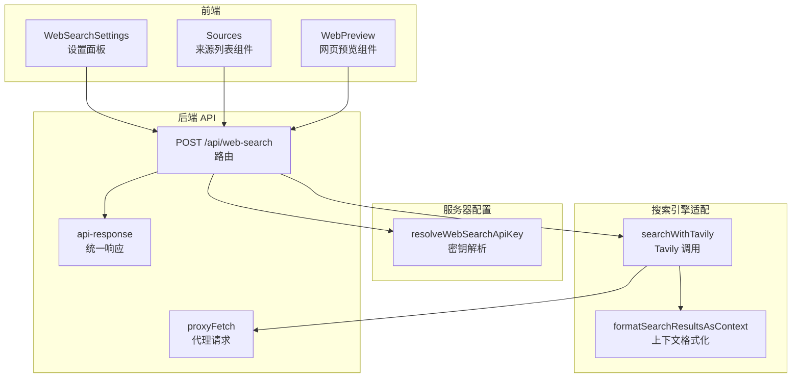
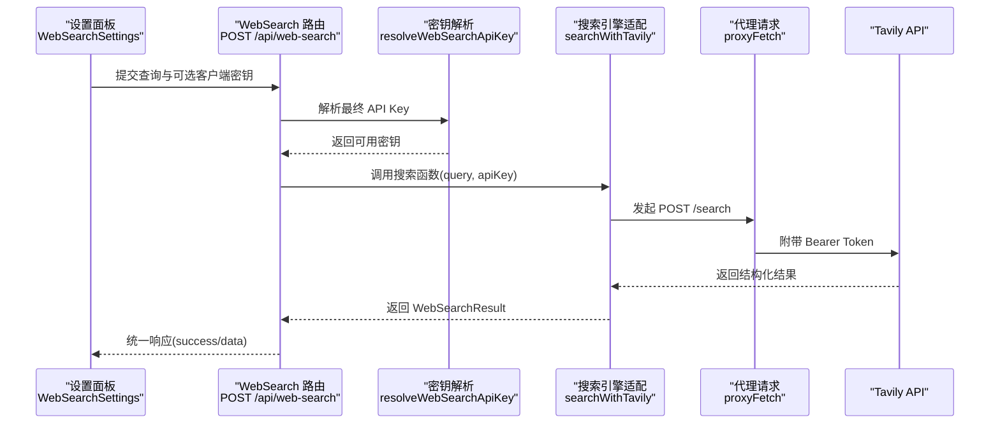
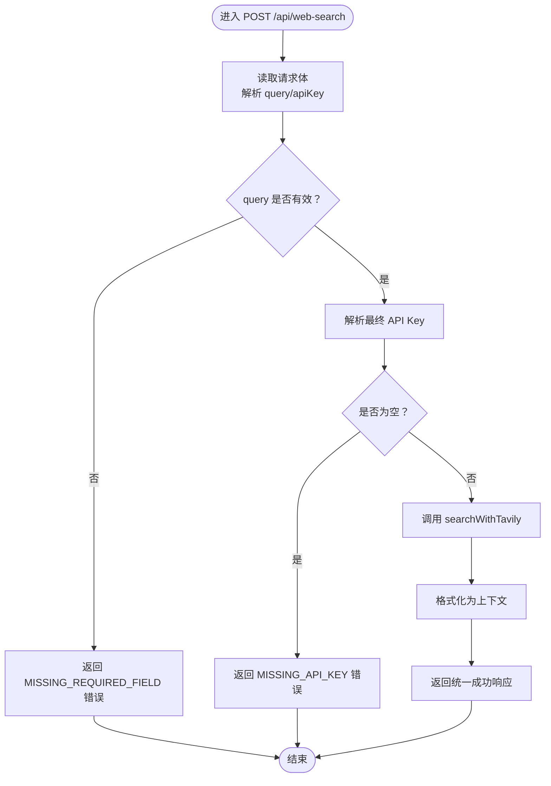
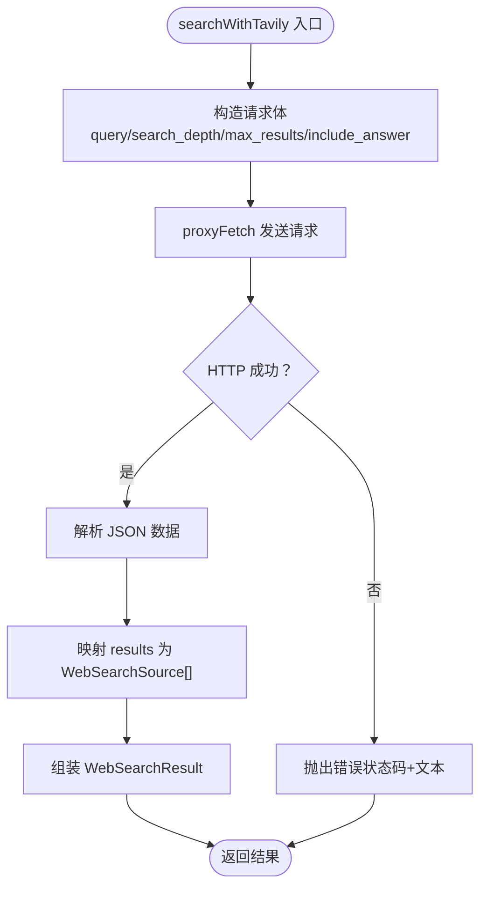
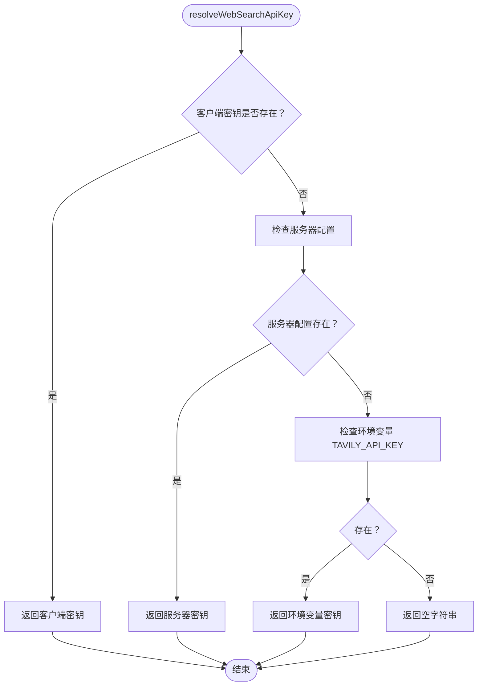
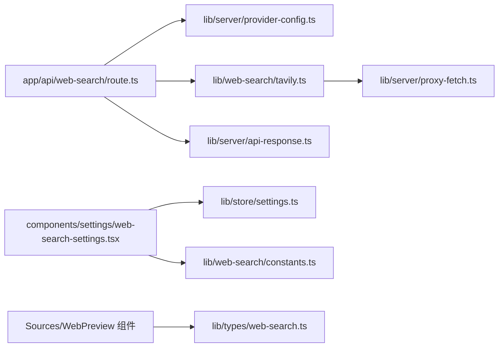

# 网页搜索集成

<cite>
**本文引用的文件**
- [app/api/web-search/route.ts](file://app/api/web-search/route.ts)
- [lib/web-search/tavily.ts](file://lib/web-search/tavily.ts)
- [lib/web-search/constants.ts](file://lib/web-search/constants.ts)
- [lib/web-search/types.ts](file://lib/web-search/types.ts)
- [lib/server/provider-config.ts](file://lib/server/provider-config.ts)
- [lib/server/proxy-fetch.ts](file://lib/server/proxy-fetch.ts)
- [lib/server/api-response.ts](file://lib/server/api-response.ts)
- [lib/store/settings.ts](file://lib/store/settings.ts)
- [components/settings/web-search-settings.tsx](file://components/settings/web-search-settings.tsx)
- [components/ai-elements/sources.tsx](file://components/ai-elements/sources.tsx)
- [components/ai-elements/web-preview.tsx](file://components/ai-elements/web-preview.tsx)
- [lib/types/web-search.ts](file://lib/types/web-search.ts)
</cite>

## 目录
1. [简介](#简介)
2. [项目结构](#项目结构)
3. [核心组件](#核心组件)
4. [架构总览](#架构总览)
5. [详细组件分析](#详细组件分析)
6. [依赖关系分析](#依赖关系分析)
7. [性能考虑](#性能考虑)
8. [故障排查指南](#故障排查指南)
9. [结论](#结论)
10. [附录](#附录)

## 简介
本技术文档围绕网页搜索集成功能展开，系统性阐述从 API 实现到前端展示的完整链路。重点包括：
- 搜索引擎集成：当前以 Tavily 为例，演示如何通过代理与认证机制调用第三方搜索服务。
- 查询构建与结果处理：涵盖请求参数封装、响应解析、上下文格式化与来源组织。
- 结果解析与格式化：摘要生成、链接处理、内容提取与 Markdown 上下文拼接。
- 组件实现：设置面板配置、结果展示与交互（折叠/展开、预览）。
- 多搜索引擎扩展：提供注册表与解析器模式，便于接入其他提供商。
- 性能优化与错误处理：代理支持、缓存策略建议、错误码与日志记录。

## 项目结构
网页搜索功能由“前端设置 + 后端 API + 服务器配置 + 搜索引擎适配层”构成，核心文件分布如下：
- API 层：负责请求校验、密钥解析、调用搜索引擎与统一响应。
- 引擎适配层：封装具体搜索引擎的请求细节与结果映射。
- 服务器配置：集中管理密钥与基础地址，支持环境变量回退。
- 前端组件：设置面板与结果展示 UI。

图表来源
- [app/api/web-search/route.ts:15-51](file://app/api/web-search/route.ts#L15-L51)
- [lib/web-search/tavily.ts:16-67](file://lib/web-search/tavily.ts#L16-L67)
- [lib/server/proxy-fetch.ts:52-70](file://lib/server/proxy-fetch.ts#L52-L70)
- [lib/server/provider-config.ts:391-397](file://lib/server/provider-config.ts#L391-L397)
- [lib/server/api-response.ts:26-45](file://lib/server/api-response.ts#L26-L45)
- [components/settings/web-search-settings.tsx:16-106](file://components/settings/web-search-settings.tsx#L16-L106)
- [components/ai-elements/sources.tsx:10-53](file://components/ai-elements/sources.tsx#L10-L53)
- [components/ai-elements/web-preview.tsx:34-66](file://components/ai-elements/web-preview.tsx#L34-L66)

章节来源
- [app/api/web-search/route.ts:1-52](file://app/api/web-search/route.ts#L1-L52)
- [lib/web-search/tavily.ts:1-93](file://lib/web-search/tavily.ts#L1-L93)
- [lib/server/provider-config.ts:376-397](file://lib/server/provider-config.ts#L376-L397)
- [lib/server/proxy-fetch.ts:1-71](file://lib/server/proxy-fetch.ts#L1-L71)
- [lib/server/api-response.ts:1-46](file://lib/server/api-response.ts#L1-L46)
- [components/settings/web-search-settings.tsx:1-107](file://components/settings/web-search-settings.tsx#L1-L107)
- [components/ai-elements/sources.tsx:1-54](file://components/ai-elements/sources.tsx#L1-L54)
- [components/ai-elements/web-preview.tsx:1-234](file://components/ai-elements/web-preview.tsx#L1-L234)

## 核心组件
- WebSearch API 路由：接收查询与可选客户端密钥，校验必填字段，解析最终密钥，调用搜索引擎并返回统一格式的结果。
- Tavily 适配器：封装 POST /search 请求，设置 Bearer 认证头，解析结果并映射为内部数据结构。
- 服务器配置解析器：优先使用客户端传入的密钥或基础地址；若为空则回退到服务器配置与环境变量。
- 代理请求工具：自动识别 HTTP/HTTPS 代理环境变量，使用 undici 的 ProxyAgent 进行转发。
- 统一响应工具：定义标准错误码与响应体结构，确保前后端一致的错误处理。
- 设置面板组件：提供 API Key 与基础地址输入、显示生效 URL 预览、切换密钥可见性。
- 来源列表组件：用于折叠/展开展示搜索来源，支持外部链接跳转。
- 网页预览组件：在 iframe 中安全预览目标链接，支持控制台日志查看。

章节来源
- [app/api/web-search/route.ts:15-51](file://app/api/web-search/route.ts#L15-L51)
- [lib/web-search/tavily.ts:16-92](file://lib/web-search/tavily.ts#L16-L92)
- [lib/server/provider-config.ts:391-397](file://lib/server/provider-config.ts#L391-L397)
- [lib/server/proxy-fetch.ts:52-70](file://lib/server/proxy-fetch.ts#L52-L70)
- [lib/server/api-response.ts:26-45](file://lib/server/api-response.ts#L26-L45)
- [components/settings/web-search-settings.tsx:16-106](file://components/settings/web-search-settings.tsx#L16-L106)
- [components/ai-elements/sources.tsx:10-53](file://components/ai-elements/sources.tsx#L10-L53)
- [components/ai-elements/web-preview.tsx:34-234](file://components/ai-elements/web-preview.tsx#L34-L234)

## 架构总览
以下序列图展示了从前端设置到后端 API、再到搜索引擎与响应返回的完整流程。

图表来源
- [app/api/web-search/route.ts:15-51](file://app/api/web-search/route.ts#L15-L51)
- [lib/server/provider-config.ts:391-397](file://lib/server/provider-config.ts#L391-L397)
- [lib/web-search/tavily.ts:16-67](file://lib/web-search/tavily.ts#L16-L67)
- [lib/server/proxy-fetch.ts:52-70](file://lib/server/proxy-fetch.ts#L52-L70)

## 详细组件分析

### WebSearch API 路由
- 输入校验：要求存在非空查询字符串，否则返回缺失字段错误。
- 密钥解析：优先使用客户端传入的密钥；若为空则读取服务器配置或环境变量。
- 引擎调用：调用适配器执行搜索，并将结果转换为上下文文本。
- 错误处理：捕获异常并记录日志，返回统一错误响应。

图表来源
- [app/api/web-search/route.ts:15-51](file://app/api/web-search/route.ts#L15-L51)

章节来源
- [app/api/web-search/route.ts:15-51](file://app/api/web-search/route.ts#L15-L51)
- [lib/server/api-response.ts:26-45](file://lib/server/api-response.ts#L26-L45)

### Tavily 搜索适配器
- 请求构造：固定 POST 到 https://api.tavily.com/search，包含查询、深度、结果数量与是否需要答案等参数。
- 认证方式：使用 Bearer Token 在 Authorization 头中传递密钥。
- 响应映射：将返回的 results 数组映射为内部 WebSearchSource 列表，同时保留 answer、query、response_time。
- 上下文格式化：将 answer 与 sources 拼接为 Markdown 文本块，便于注入到提示词中。

图表来源
- [lib/web-search/tavily.ts:16-67](file://lib/web-search/tavily.ts#L16-L67)

章节来源
- [lib/web-search/tavily.ts:16-92](file://lib/web-search/tavily.ts#L16-L92)

### 服务器配置与密钥解析
- 配置来源：优先读取 YAML 文件中的 web-search 节，再应用环境变量覆盖。
- 解析规则：客户端传入的密钥优先于服务器配置；若两者都为空，则回退到环境变量 TAVILY_API_KEY。
- 基础地址：同样支持客户端覆盖与服务器配置回退。

图表来源
- [lib/server/provider-config.ts:391-397](file://lib/server/provider-config.ts#L391-L397)

章节来源
- [lib/server/provider-config.ts:376-397](file://lib/server/provider-config.ts#L376-L397)

### 代理请求工具
- 代理检测：自动读取 https_proxy/HTTPS_PROXY/http_proxy/HTTP_PROXY 等环境变量。
- 代理复用：缓存 ProxyAgent，避免重复创建；当代理 URL 变更时重建。
- 降级策略：未配置代理时直接使用全局 fetch。

章节来源
- [lib/server/proxy-fetch.ts:21-70](file://lib/server/proxy-fetch.ts#L21-L70)

### 统一响应工具
- 错误码枚举：定义了多种错误场景（如缺少字段、缺少密钥、上游错误等）。
- 成功/失败响应：统一返回 success 字段与业务数据或错误信息。

章节来源
- [lib/server/api-response.ts:3-45](file://lib/server/api-response.ts#L3-L45)

### 设置面板组件
- 功能特性：支持 API Key 与基础地址输入、显示生效 URL 预览、切换密钥可见性。
- 服务器配置提示：当服务器已配置时显示提示，允许客户端覆盖或保持默认。

章节来源
- [components/settings/web-search-settings.tsx:16-106](file://components/settings/web-search-settings.tsx#L16-L106)

### 来源列表与网页预览组件
- 来源列表：支持折叠/展开，展示来源标题与链接，点击打开新窗口。
- 网页预览：提供 URL 输入框、导航按钮与 iframe 预览区域，支持控制台日志查看。

章节来源
- [components/ai-elements/sources.tsx:10-53](file://components/ai-elements/sources.tsx#L10-L53)
- [components/ai-elements/web-preview.tsx:34-234](file://components/ai-elements/web-preview.tsx#L34-L234)

## 依赖关系分析
- 路由依赖：API 路由依赖密钥解析器、搜索引擎适配器与统一响应工具。
- 适配器依赖：Tavily 适配器依赖代理请求工具与类型定义。
- 配置依赖：密钥解析器依赖服务器配置加载与环境变量。
- 前端依赖：设置面板依赖全局设置存储与提供商常量；结果展示依赖来源与预览组件。

图表来源
- [app/api/web-search/route.ts:8-11](file://app/api/web-search/route.ts#L8-L11)
- [lib/web-search/tavily.ts:8-9](file://lib/web-search/tavily.ts#L8-L9)
- [lib/server/provider-config.ts:391-397](file://lib/server/provider-config.ts#L391-L397)
- [lib/server/proxy-fetch.ts:16-17](file://lib/server/proxy-fetch.ts#L16-L17)
- [lib/server/api-response.ts:1-2](file://lib/server/api-response.ts#L1-L2)
- [components/settings/web-search-settings.tsx:8-10](file://components/settings/web-search-settings.tsx#L8-L10)
- [lib/store/settings.ts:114-125](file://lib/store/settings.ts#L114-L125)
- [lib/web-search/constants.ts:10-17](file://lib/web-search/constants.ts#L10-L17)
- [lib/types/web-search.ts:1-14](file://lib/types/web-search.ts#L1-L14)

章节来源
- [app/api/web-search/route.ts:8-11](file://app/api/web-search/route.ts#L8-L11)
- [lib/web-search/tavily.ts:8-9](file://lib/web-search/tavily.ts#L8-L9)
- [lib/server/provider-config.ts:391-397](file://lib/server/provider-config.ts#L391-L397)
- [lib/server/proxy-fetch.ts:16-17](file://lib/server/proxy-fetch.ts#L16-L17)
- [lib/server/api-response.ts:1-2](file://lib/server/api-response.ts#L1-L2)
- [components/settings/web-search-settings.tsx:8-10](file://components/settings/web-search-settings.tsx#L8-L10)
- [lib/store/settings.ts:114-125](file://lib/store/settings.ts#L114-L125)
- [lib/web-search/constants.ts:10-17](file://lib/web-search/constants.ts#L10-L17)
- [lib/types/web-search.ts:1-14](file://lib/types/web-search.ts#L1-L14)

## 性能考虑
- 代理支持：通过代理请求工具自动识别并复用代理，减少网络延迟与跨域问题。
- 缓存策略：建议在应用层对相同查询进行短期缓存（基于查询字符串与密钥组合），避免重复调用上游接口。
- 结果裁剪：上下文格式化时对内容长度进行截断，降低提示词体积与成本。
- 并发控制：在高并发场景下限制每秒请求数，避免触发上游限流。
- 日志与监控：统一错误码与日志记录，便于定位慢请求与失败原因。

## 故障排查指南
- 缺少查询参数：确认请求体包含非空 query 字段。
- 缺少 API Key：检查设置面板或环境变量 TAVILY_API_KEY 是否正确配置。
- 代理问题：确认代理环境变量是否正确设置，必要时关闭代理验证直连。
- 上游错误：查看统一错误响应中的错误码与详情，结合日志定位问题。
- 结果为空：确认搜索引擎返回的数据结构与字段映射是否匹配。

章节来源
- [app/api/web-search/route.ts:23-34](file://app/api/web-search/route.ts#L23-L34)
- [lib/server/api-response.ts:26-45](file://lib/server/api-response.ts#L26-L45)
- [lib/server/proxy-fetch.ts:21-46](file://lib/server/proxy-fetch.ts#L21-L46)

## 结论
该网页搜索集成功能以清晰的分层设计实现了从设置到调用再到展示的全链路能力。当前以 Tavily 为核心提供商，具备良好的可扩展性：通过提供商注册表与解析器模式，可便捷接入其他搜索引擎。配合代理支持、统一响应与前端组件，整体具备较好的稳定性与可维护性。

## 附录
- 数据模型：WebSearchResult 与 WebSearchSource 定义了搜索结果的核心字段。
- 类型定义：WebSearchProviderId 与 WebSearchProviderConfig 描述了提供商标识与配置项。
- 常量注册：WEB_SEARCH_PROVIDERS 提供了可用提供商清单与默认配置。

章节来源
- [lib/types/web-search.ts:1-14](file://lib/types/web-search.ts#L1-L14)
- [lib/web-search/types.ts:8-19](file://lib/web-search/types.ts#L8-L19)
- [lib/web-search/constants.ts:10-17](file://lib/web-search/constants.ts#L10-L17)