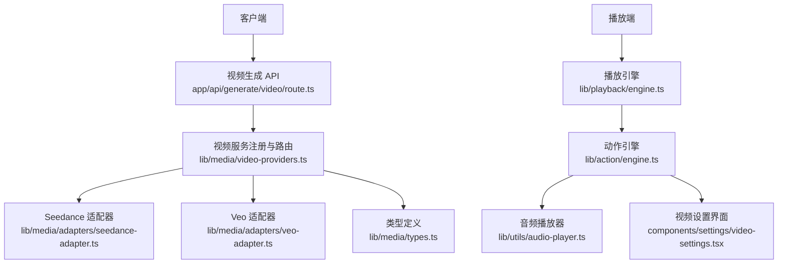
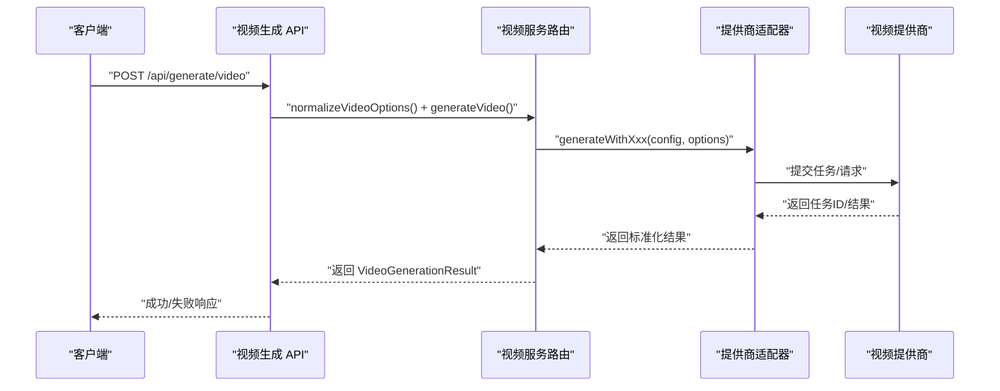
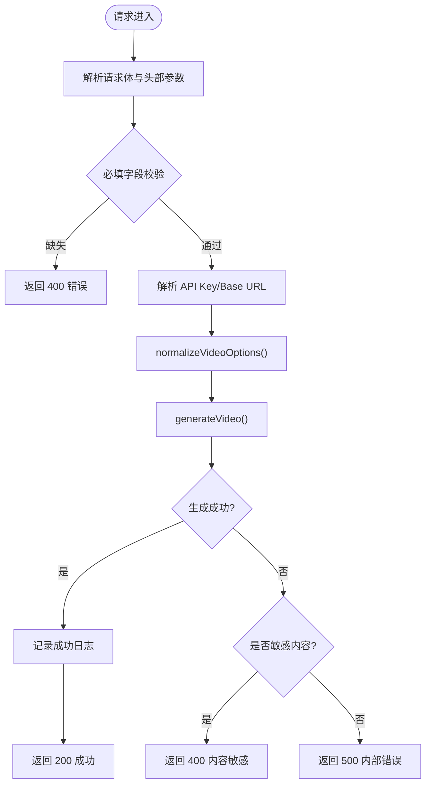
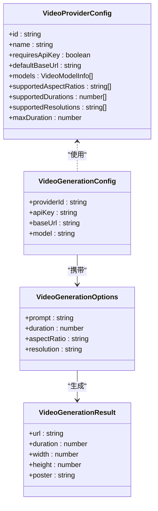
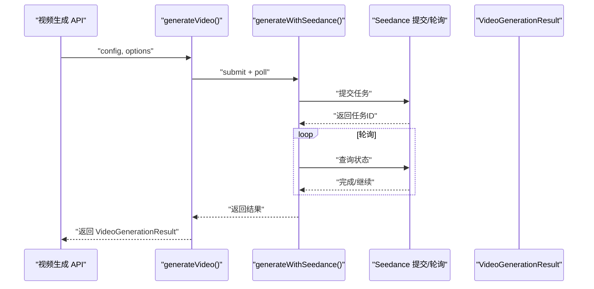
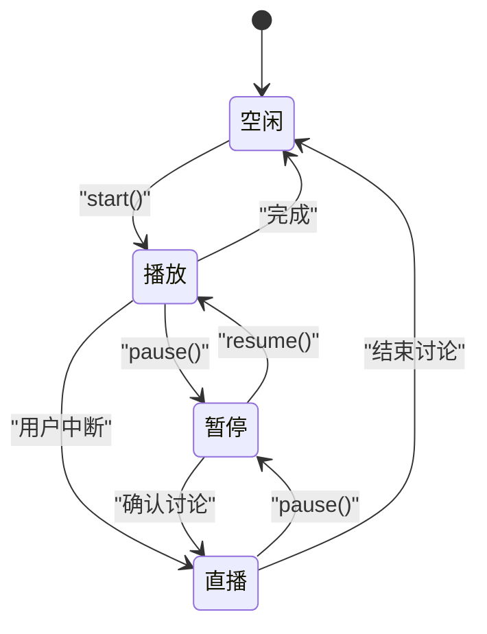
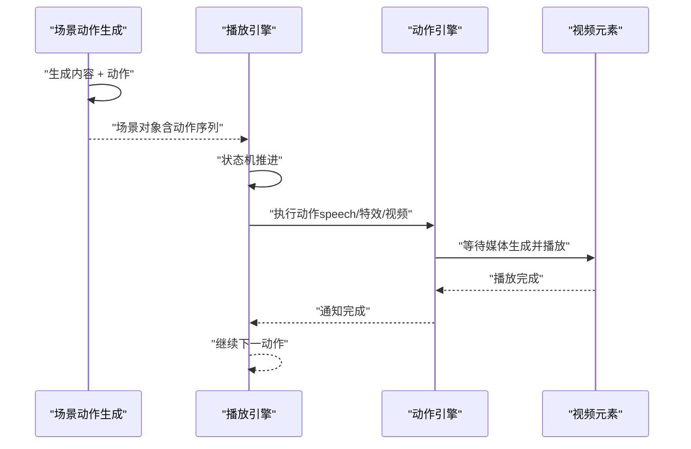
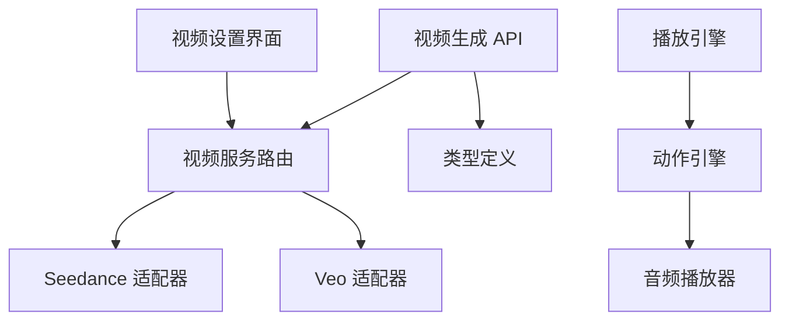

# 视频处理系统

<cite>
**本文档引用的文件**
- [app/api/generate/video/route.ts](file://app/api/generate/video/route.ts)
- [lib/media/video-providers.ts](file://lib/media/video-providers.ts)
- [lib/media/types.ts](file://lib/media/types.ts)
- [lib/media/adapters/seedance-adapter.ts](file://lib/media/adapters/seedance-adapter.ts)
- [lib/media/adapters/veo-adapter.ts](file://lib/media/adapters/veo-adapter.ts)
- [components/settings/video-settings.tsx](file://components/settings/video-settings.tsx)
- [lib/playback/engine.ts](file://lib/playback/engine.ts)
- [lib/playback/types.ts](file://lib/playback/types.ts)
- [lib/action/engine.ts](file://lib/action/engine.ts)
- [lib/utils/audio-player.ts](file://lib/utils/audio-player.ts)
- [components/chat/proactive-card.tsx](file://components/chat/proactive-card.tsx)
- [app/api/generate/scene-actions/route.ts](file://app/api/generate/scene-actions/route.ts)
- [lib/generation/scene-generator.ts](file://lib/generation/scene-generator.ts)
</cite>

## 目录
1. [简介](#简介)
2. [项目结构](#项目结构)
3. [核心组件](#核心组件)
4. [架构总览](#架构总览)
5. [详细组件分析](#详细组件分析)
6. [依赖关系分析](#依赖关系分析)
7. [性能考虑](#性能考虑)
8. [故障排除指南](#故障排除指南)
9. [结论](#结论)
10. [附录](#附录)

## 简介
本技术文档面向视频处理系统，聚焦于视频生成 API 的实现与视频编辑播放能力。系统采用异步任务模式（提交→轮询）处理视频生成请求，支持多家视频生成服务提供商，并在播放端提供基于动作序列的时间轴控制、特效叠加与音频同步。文档涵盖从场景动作到最终视频输出的完整处理链路，以及视频编辑、导出机制、进度监控、错误处理与性能优化建议。

## 项目结构
视频相关的核心代码分布在以下模块：
- API 层：负责接收请求、参数校验、调用视频生成服务并返回结果
- 服务层：统一管理视频提供商配置、选项归一化与生成路由
- 适配器层：针对不同提供商的具体实现（如 Seedance、Veo）
- 播放引擎：基于场景动作执行视频播放、特效与音频同步
- 设置界面：提供视频提供商配置、模型管理与连通性测试

**图表来源**
- [app/api/generate/video/route.ts:1-84](file://app/api/generate/video/route.ts#L1-L84)
- [lib/media/video-providers.ts:1-156](file://lib/media/video-providers.ts#L1-L156)
- [lib/media/adapters/seedance-adapter.ts:223-245](file://lib/media/adapters/seedance-adapter.ts#L223-L245)
- [lib/media/adapters/veo-adapter.ts:86-130](file://lib/media/adapters/veo-adapter.ts#L86-L130)
- [lib/playback/engine.ts:1-525](file://lib/playback/engine.ts#L1-L525)
- [lib/action/engine.ts:1-519](file://lib/action/engine.ts#L1-L519)
- [lib/utils/audio-player.ts:51-187](file://lib/utils/audio-player.ts#L51-L187)
- [components/settings/video-settings.tsx:1-342](file://components/settings/video-settings.tsx#L1-L342)

**章节来源**
- [app/api/generate/video/route.ts:1-84](file://app/api/generate/video/route.ts#L1-L84)
- [lib/media/video-providers.ts:1-156](file://lib/media/video-providers.ts#L1-L156)

## 核心组件
- 视频生成 API：接收请求、解析头部参数与请求体、进行内容安全过滤、调用视频生成服务并返回结果
- 视频服务注册与路由：统一管理提供商配置、选项归一化、异步任务生成与结果返回
- 适配器层：针对不同提供商的提交与轮询逻辑封装
- 播放引擎：基于场景动作序列的状态机驱动，支持特效、讨论触发与音频同步
- 动作引擎：同步/异步动作执行，包含视频播放、白板绘制等
- 音频播放器：播放音频、暂停/恢复、速度/音量控制
- 视频设置界面：提供 API Key、Base URL、模型管理与连通性测试

**章节来源**
- [app/api/generate/video/route.ts:30-83](file://app/api/generate/video/route.ts#L30-L83)
- [lib/media/video-providers.ts:79-155](file://lib/media/video-providers.ts#L79-L155)
- [lib/playback/engine.ts:43-525](file://lib/playback/engine.ts#L43-L525)
- [lib/action/engine.ts:55-228](file://lib/action/engine.ts#L55-L228)
- [lib/utils/audio-player.ts:51-187](file://lib/utils/audio-player.ts#L51-L187)
- [components/settings/video-settings.tsx:71-99](file://components/settings/video-settings.tsx#L71-L99)

## 架构总览
系统采用分层架构：
- 表现层：前端设置界面与播放 UI
- API 层：Next.js 路由处理器，负责参数解析与错误处理
- 服务层：视频生成服务，根据提供商 ID 分发到对应适配器
- 适配器层：封装具体提供商的提交与轮询逻辑
- 播放层：播放引擎与动作引擎协同，按动作序列执行特效与视频播放

**图表来源**
- [app/api/generate/video/route.ts:30-83](file://app/api/generate/video/route.ts#L30-L83)
- [lib/media/video-providers.ts:102-155](file://lib/media/video-providers.ts#L102-L155)
- [lib/media/adapters/seedance-adapter.ts:230-245](file://lib/media/adapters/seedance-adapter.ts#L230-L245)
- [lib/media/adapters/veo-adapter.ts:86-130](file://lib/media/adapters/veo-adapter.ts#L86-L130)

## 详细组件分析

### 视频生成 API 实现
- 请求处理：解析请求体与头部参数（提供商 ID、模型、API Key、Base URL），进行必填字段校验
- 安全过滤：检测敏感内容拒绝信息，返回特定错误码
- 选项归一化：根据提供商能力对时长、宽高比、分辨率进行归一化
- 结果记录：记录生成结果的关键元数据（URL、尺寸、时长）

**图表来源**
- [app/api/generate/video/route.ts:30-83](file://app/api/generate/video/route.ts#L30-L83)
- [lib/media/video-providers.ts:102-139](file://lib/media/video-providers.ts#L102-L139)

**章节来源**
- [app/api/generate/video/route.ts:30-83](file://app/api/generate/video/route.ts#L30-L83)
- [lib/media/video-providers.ts:102-139](file://lib/media/video-providers.ts#L102-L139)

### 视频服务注册与路由
- 提供商配置：维护各提供商的能力清单（支持的宽高比、时长、分辨率、默认 Base URL、模型列表）
- 连通性测试：统一入口测试提供商连通性
- 选项归一化：确保请求参数符合提供商约束
- 生成路由：根据提供商 ID 分发到对应适配器

**图表来源**
- [lib/media/video-providers.ts:16-77](file://lib/media/video-providers.ts#L16-L77)
- [lib/media/types.ts:195-269](file://lib/media/types.ts#L195-L269)

**章节来源**
- [lib/media/video-providers.ts:16-77](file://lib/media/video-providers.ts#L16-L77)
- [lib/media/types.ts:195-269](file://lib/media/types.ts#L195-L269)

### 适配器层（Seedance 与 Veo）
- Seedance 适配器：提交任务后轮询状态，超时抛错；将提供商返回的元数据映射为统一结果
- Veo 适配器：构造请求参数（宽高比、时长等），提交长运行预测任务并轮询操作状态

**图表来源**
- [lib/media/adapters/seedance-adapter.ts:230-245](file://lib/media/adapters/seedance-adapter.ts#L230-L245)
- [lib/media/adapters/veo-adapter.ts:86-130](file://lib/media/adapters/veo-adapter.ts#L86-L130)

**章节来源**
- [lib/media/adapters/seedance-adapter.ts:230-245](file://lib/media/adapters/seedance-adapter.ts#L230-L245)
- [lib/media/adapters/veo-adapter.ts:86-130](file://lib/media/adapters/veo-adapter.ts#L86-L130)

### 播放引擎与动作执行
- 播放引擎：状态机驱动（空闲/播放/暂停/直播），处理场景切换、语音播放、特效触发、讨论交互
- 动作引擎：同步/异步动作执行，支持视频播放等待、白板绘制、激光/聚光灯效果
- 音频播放器：播放音频、暂停/恢复、速度/音量控制，与播放引擎回调联动

**图表来源**
- [lib/playback/engine.ts:43-525](file://lib/playback/engine.ts#L43-L525)
- [lib/action/engine.ts:55-228](file://lib/action/engine.ts#L55-L228)
- [lib/utils/audio-player.ts:51-187](file://lib/utils/audio-player.ts#L51-L187)

**章节来源**
- [lib/playback/engine.ts:43-525](file://lib/playback/engine.ts#L43-L525)
- [lib/action/engine.ts:55-228](file://lib/action/engine.ts#L55-L228)
- [lib/utils/audio-player.ts:51-187](file://lib/utils/audio-player.ts#L51-L187)

### 视频编辑与时间轴控制
- 场景动作生成：先生成内容，再生成动作，构建完整场景
- 播放控制：播放引擎按动作顺序推进，支持讨论触发、特效叠加、白板同步
- 视频播放：动作引擎等待媒体生成完成后再播放，确保时序正确

**图表来源**
- [app/api/generate/scene-actions/route.ts:128-158](file://app/api/generate/scene-actions/route.ts#L128-L158)
- [lib/generation/scene-generator.ts:124-144](file://lib/generation/scene-generator.ts#L124-L144)
- [lib/playback/engine.ts:369-523](file://lib/playback/engine.ts#L369-L523)
- [lib/action/engine.ts:180-228](file://lib/action/engine.ts#L180-L228)

**章节来源**
- [app/api/generate/scene-actions/route.ts:128-158](file://app/api/generate/scene-actions/route.ts#L128-L158)
- [lib/generation/scene-generator.ts:124-144](file://lib/generation/scene-generator.ts#L124-L144)
- [lib/playback/engine.ts:369-523](file://lib/playback/engine.ts#L369-L523)
- [lib/action/engine.ts:180-228](file://lib/action/engine.ts#L180-L228)

### 视频导出机制与格式选择
- 导出结果：视频生成结果包含 URL、时长、尺寸等元数据
- 格式与质量：由提供商决定，系统通过选项归一化确保请求参数在提供商支持范围内
- 压缩优化：由提供商侧完成，系统不直接参与压缩处理

**章节来源**
- [lib/media/types.ts:258-269](file://lib/media/types.ts#L258-L269)
- [lib/media/video-providers.ts:102-139](file://lib/media/video-providers.ts#L102-L139)

### 进度监控、错误处理与用户反馈
- 进度监控：播放引擎在推进动作前回调进度快照，可用于断点续播
- 错误处理：API 层捕获异常并区分内容安全过滤与内部错误；提供商适配器处理超时与失败
- 用户反馈：设置界面提供连通性测试按钮与状态提示

**章节来源**
- [lib/playback/engine.ts:94-108](file://lib/playback/engine.ts#L94-L108)
- [app/api/generate/video/route.ts:74-82](file://app/api/generate/video/route.ts#L74-L82)
- [components/settings/video-settings.tsx:71-99](file://components/settings/video-settings.tsx#L71-L99)

## 依赖关系分析
- API 依赖服务层进行选项归一化与生成路由
- 服务层依赖适配器层实现具体提供商逻辑
- 播放引擎依赖动作引擎与音频播放器
- 设置界面依赖服务层进行连通性测试

**图表来源**
- [app/api/generate/video/route.ts:19-24](file://app/api/generate/video/route.ts#L19-L24)
- [lib/media/video-providers.ts:12-14](file://lib/media/video-providers.ts#L12-L14)
- [lib/playback/engine.ts:37-38](file://lib/playback/engine.ts#L37-L38)
- [lib/action/engine.ts:12-16](file://lib/action/engine.ts#L12-L16)
- [components/settings/video-settings.tsx:10-11](file://components/settings/video-settings.tsx#L10-L11)

**章节来源**
- [app/api/generate/video/route.ts:19-24](file://app/api/generate/video/route.ts#L19-L24)
- [lib/media/video-providers.ts:12-14](file://lib/media/video-providers.ts#L12-L14)
- [lib/playback/engine.ts:37-38](file://lib/playback/engine.ts#L37-L38)
- [lib/action/engine.ts:12-16](file://lib/action/engine.ts#L12-L16)
- [components/settings/video-settings.tsx:10-11](file://components/settings/video-settings.tsx#L10-L11)

## 性能考虑
- 异步任务模式：避免阻塞主线程，合理设置轮询间隔与最大尝试次数
- 播放时序：动作引擎等待媒体生成完成，减少无效渲染与播放失败
- 音频控制：播放器支持速度/音量调整，结合播放引擎回调实现更流畅体验
- 并发处理：动作引擎对不同动作采用同步/异步策略，减少不必要的等待

[本节为通用指导，无需列出具体文件来源]

## 故障排除指南
- 内容安全过滤：当提供商返回敏感内容错误时，API 返回特定错误码，需调整提示词或更换提供商
- 连接性测试：通过设置界面测试提供商连通性，检查 API Key、Base URL 是否正确
- 超时问题：Seedance 适配器存在最大轮询次数与间隔，超时会抛出错误，需检查网络与提供商状态

**章节来源**
- [app/api/generate/video/route.ts:75-82](file://app/api/generate/video/route.ts#L75-L82)
- [components/settings/video-settings.tsx:71-99](file://components/settings/video-settings.tsx#L71-L99)
- [lib/media/adapters/seedance-adapter.ts:236-245](file://lib/media/adapters/seedance-adapter.ts#L236-L245)

## 结论
该视频处理系统以异步任务模式为核心，结合多提供商适配器与统一类型定义，实现了从请求到结果的稳定链路。播放端通过播放引擎与动作引擎协同，提供了时间轴控制、特效叠加与音频同步能力。配合设置界面的连通性测试与错误处理机制，系统具备良好的可维护性与扩展性。

[本节为总结性内容，无需列出具体文件来源]

## 附录
- 讨论触发与倒计时：播放引擎在合适时机显示讨论卡片并启动倒计时，倒计时结束后自动跳过
- 白板与视频联动：动作引擎在执行视频播放前等待媒体生成完成，确保时序一致

**章节来源**
- [lib/playback/engine.ts:482-497](file://lib/playback/engine.ts#L482-L497)
- [components/chat/proactive-card.tsx:91-116](file://components/chat/proactive-card.tsx#L91-L116)
- [lib/action/engine.ts:180-228](file://lib/action/engine.ts#L180-L228)