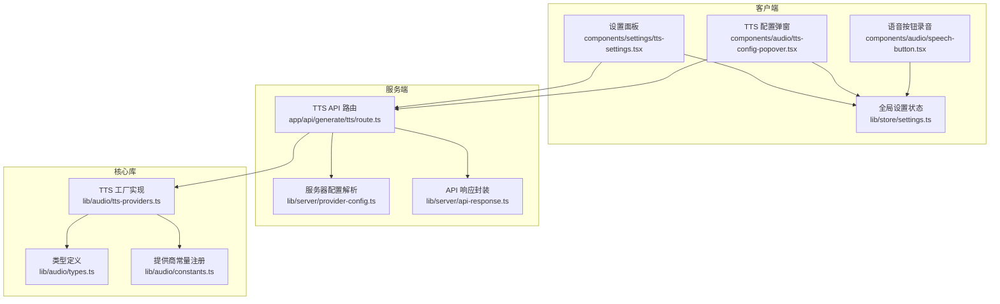
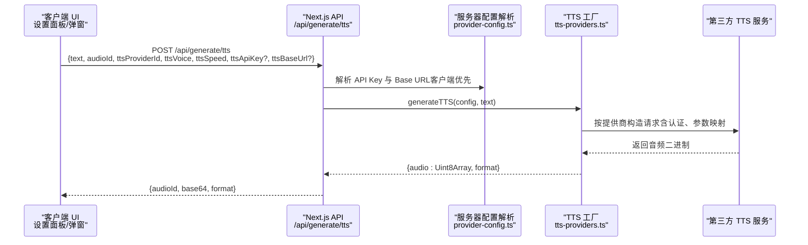
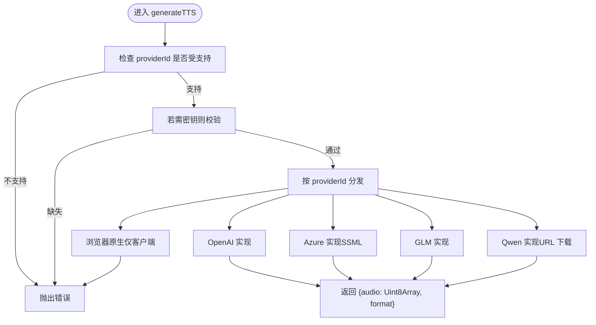
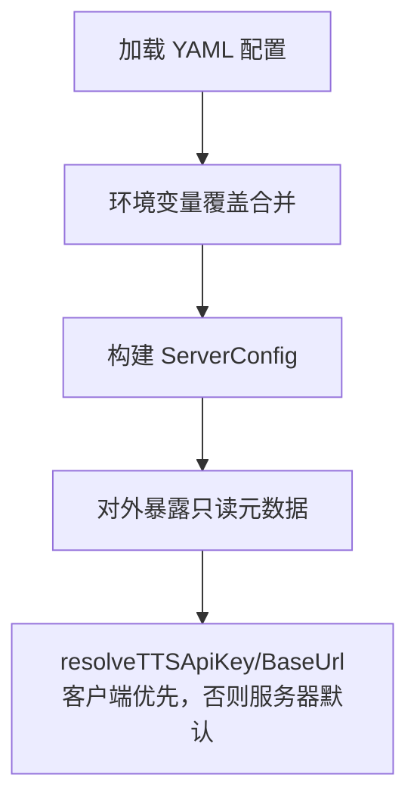
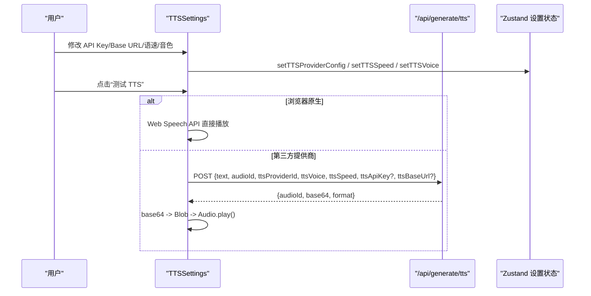
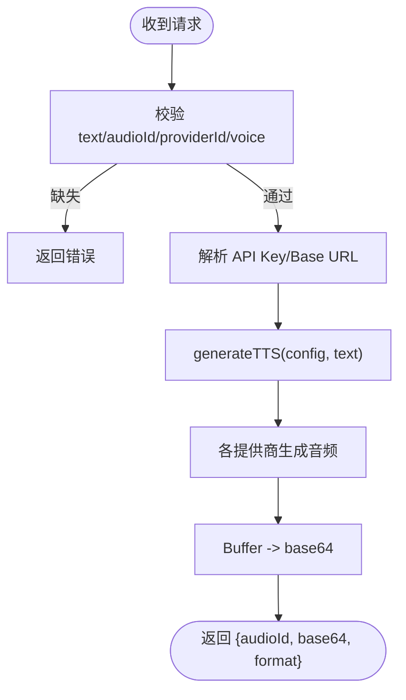
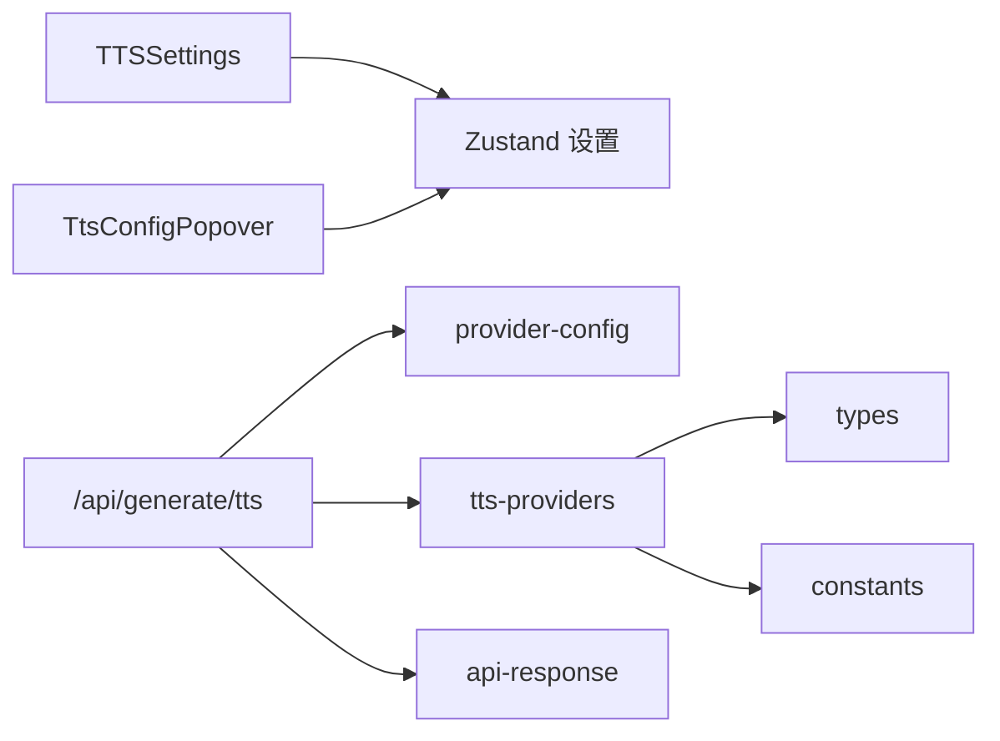

# 语音合成系统 (TTS)

<cite>
**本文引用的文件**
- [app/api/generate/tts/route.ts](file://app/api/generate/tts/route.ts)
- [lib/audio/tts-providers.ts](file://lib/audio/tts-providers.ts)
- [lib/audio/constants.ts](file://lib/audio/constants.ts)
- [lib/audio/types.ts](file://lib/audio/types.ts)
- [lib/server/provider-config.ts](file://lib/server/provider-config.ts)
- [lib/server/api-response.ts](file://lib/server/api-response.ts)
- [lib/store/settings.ts](file://lib/store/settings.ts)
- [components/settings/tts-settings.tsx](file://components/settings/tts-settings.tsx)
- [components/audio/tts-config-popover.tsx](file://components/audio/tts-config-popover.tsx)
- [components/audio/speech-button.tsx](file://components/audio/speech-button.tsx)
</cite>

## 目录
1. [简介](#简介)
2. [项目结构](#项目结构)
3. [核心组件](#核心组件)
4. [架构总览](#架构总览)
5. [详细组件分析](#详细组件分析)
6. [依赖关系分析](#依赖关系分析)
7. [性能考量](#性能考量)
8. [故障排查指南](#故障排查指南)
9. [结论](#结论)
10. [附录](#附录)

## 简介
本文件面向语音合成系统（TTS）的技术文档，聚焦于多服务提供商的统一接口设计与实现，涵盖 OpenAI、Azure、Google Cloud（GLM）、阿里云百炼（Qwen）等多家服务的集成方式；系统还支持浏览器原生 TTS（仅客户端）。文档内容包括：
- 统一接口与工厂模式：通过类型与常量注册，集中路由至各提供商实现
- 声音配置管理：音色选择、语速调节、格式与速度范围约束
- 音频生成流程：从文本输入到音频输出的完整链路
- 配置面板与参数持久化：设置面板的用户交互、测试播放与本地存储
- 多语言支持与声音定制：多语言与方言声音列表、SSML 与参数映射
- 性能优化策略、缓存机制与错误处理方案

## 项目结构
TTS 子系统由三层组成：
- 服务端 API：接收请求、解析参数、调用统一工厂函数生成音频
- 核心库：定义类型、常量、统一工厂与各提供商实现
- 客户端组件：设置面板、配置弹窗、语音按钮与状态持久化

**图表来源**
- [app/api/generate/tts/route.ts:1-81](file://app/api/generate/tts/route.ts#L1-L81)
- [lib/audio/tts-providers.ts:1-357](file://lib/audio/tts-providers.ts#L1-L357)
- [lib/audio/constants.ts:1-866](file://lib/audio/constants.ts#L1-L866)
- [lib/audio/types.ts:1-173](file://lib/audio/types.ts#L1-L173)
- [lib/server/provider-config.ts:1-398](file://lib/server/provider-config.ts#L1-L398)
- [lib/server/api-response.ts:1-46](file://lib/server/api-response.ts#L1-L46)
- [lib/store/settings.ts:1-1053](file://lib/store/settings.ts#L1-L1053)
- [components/settings/tts-settings.tsx:1-275](file://components/settings/tts-settings.tsx#L1-L275)
- [components/audio/tts-config-popover.tsx:1-185](file://components/audio/tts-config-popover.tsx#L1-L185)
- [components/audio/speech-button.tsx:1-142](file://components/audio/speech-button.tsx#L1-L142)

**章节来源**
- [app/api/generate/tts/route.ts:1-81](file://app/api/generate/tts/route.ts#L1-L81)
- [lib/audio/tts-providers.ts:1-357](file://lib/audio/tts-providers.ts#L1-L357)
- [lib/audio/constants.ts:1-866](file://lib/audio/constants.ts#L1-L866)
- [lib/audio/types.ts:1-173](file://lib/audio/types.ts#L1-L173)
- [lib/server/provider-config.ts:1-398](file://lib/server/provider-config.ts#L1-L398)
- [lib/server/api-response.ts:1-46](file://lib/server/api-response.ts#L1-L46)
- [lib/store/settings.ts:1-1053](file://lib/store/settings.ts#L1-L1053)
- [components/settings/tts-settings.tsx:1-275](file://components/settings/tts-settings.tsx#L1-L275)
- [components/audio/tts-config-popover.tsx:1-185](file://components/audio/tts-config-popover.tsx#L1-L185)
- [components/audio/speech-button.tsx:1-142](file://components/audio/speech-button.tsx#L1-L142)

## 核心组件
- 统一类型与常量
  - 类型定义：统一 TTS/ASR 提供商 ID、模型配置、声音信息等
  - 常量注册：各提供商元数据（名称、图标、是否需要密钥、默认基地址、声音列表、支持格式、速度范围）
- 工厂与实现
  - 工厂函数：根据 providerId 分发到具体实现，统一校验 API Key、构建请求与返回二进制音频
  - 各提供商实现：OpenAI、Azure（SSML）、GLM、Qwen（DashScope，含 URL 下载）
- 服务器配置解析
  - 支持 YAML + 环境变量优先级覆盖，仅暴露基地址与元数据，密钥不回传客户端
- 设置与持久化
  - 全局设置状态：提供者、音色、语速、启用开关、音量、自动播放、播放速度等
  - 设置面板：测试播放、API Key/BaseUrl 输入、请求 URL 预览
  - 配置弹窗：快速切换音色与预览播放
- API 路由
  - 单次 TTS 生成接口：校验必填项、拒绝浏览器原生提供商、解析密钥与基地址、调用工厂、Base64 返回

**章节来源**
- [lib/audio/types.ts:1-173](file://lib/audio/types.ts#L1-L173)
- [lib/audio/constants.ts:1-866](file://lib/audio/constants.ts#L1-L866)
- [lib/audio/tts-providers.ts:1-357](file://lib/audio/tts-providers.ts#L1-L357)
- [lib/server/provider-config.ts:1-398](file://lib/server/provider-config.ts#L1-L398)
- [lib/store/settings.ts:1-1053](file://lib/store/settings.ts#L1-L1053)
- [components/settings/tts-settings.tsx:1-275](file://components/settings/tts-settings.tsx#L1-L275)
- [components/audio/tts-config-popover.tsx:1-185](file://components/audio/tts-config-popover.tsx#L1-L185)
- [app/api/generate/tts/route.ts:1-81](file://app/api/generate/tts/route.ts#L1-L81)

## 架构总览
系统采用“类型+常量+工厂”的统一抽象，配合服务器配置解析与客户端设置持久化，形成可扩展、可维护的 TTS 架构。

**图表来源**
- [app/api/generate/tts/route.ts:21-80](file://app/api/generate/tts/route.ts#L21-L80)
- [lib/server/provider-config.ts:266-274](file://lib/server/provider-config.ts#L266-L274)
- [lib/audio/tts-providers.ts:106-141](file://lib/audio/tts-providers.ts#L106-L141)

**章节来源**
- [app/api/generate/tts/route.ts:1-81](file://app/api/generate/tts/route.ts#L1-L81)
- [lib/server/provider-config.ts:1-398](file://lib/server/provider-config.ts#L1-L398)
- [lib/audio/tts-providers.ts:1-357](file://lib/audio/tts-providers.ts#L1-L357)

## 详细组件分析

### 统一接口与工厂模式
- 类型与常量
  - TTSProviderId：统一枚举各提供商 ID，便于在类型层面约束
  - TTSProviderConfig/TTSVoiceInfo：描述提供商能力、声音列表、支持格式与速度范围
  - 常量注册：集中维护各提供商的元数据，确保 UI 与逻辑一致
- 工厂函数
  - generateTTS：按 providerId 分发，统一校验 API Key，返回 {audio: Uint8Array, format}
  - 各提供商实现：
    - OpenAI：直接 API 调用，UTF-8 编码，返回 mp3
    - Azure：SSML 包裹，速率映射为百分比，返回 mp3
    - GLM：DashScope 风格请求，返回 wav
    - Qwen：返回音频 URL，二次下载，返回 wav
    - 浏览器原生：仅客户端使用，抛出错误提示
- 参数映射
  - 语速：OpenAI/Azure/GLM 使用数值；Qwen 映射到 [-500, 500] 的 rate
  - 速率：Azure 使用 SSML prosody rate 百分比
  - 语言：Qwen 默认中文，可扩展为可配置

**图表来源**
- [lib/audio/tts-providers.ts:106-141](file://lib/audio/tts-providers.ts#L106-L141)
- [lib/audio/tts-providers.ts:146-177](file://lib/audio/tts-providers.ts#L146-L177)
- [lib/audio/tts-providers.ts:182-217](file://lib/audio/tts-providers.ts#L182-L217)
- [lib/audio/tts-providers.ts:222-260](file://lib/audio/tts-providers.ts#L222-L260)
- [lib/audio/tts-providers.ts:265-317](file://lib/audio/tts-providers.ts#L265-L317)

**章节来源**
- [lib/audio/types.ts:1-173](file://lib/audio/types.ts#L1-L173)
- [lib/audio/constants.ts:1-866](file://lib/audio/constants.ts#L1-L866)
- [lib/audio/tts-providers.ts:1-357](file://lib/audio/tts-providers.ts#L1-L357)

### 服务器配置解析与安全
- 配置来源
  - YAML 文件（默认 server-providers.yml），环境变量优先覆盖
  - 支持 LLM、TTS、ASR、PDF、图像、视频、网络搜索等模块
- 密钥与基地址
  - 仅暴露基地址与元数据，密钥不回传客户端
  - 客户端可覆盖密钥与基地址，服务端可作为默认值
- 服务器配置合并
  - 在 fetchServerProviders 时，将服务器侧配置合并到本地状态，标记 isServerConfigured 与 serverBaseUrl

**图表来源**
- [lib/server/provider-config.ts:101-168](file://lib/server/provider-config.ts#L101-L168)
- [lib/server/provider-config.ts:208-274](file://lib/server/provider-config.ts#L208-L274)

**章节来源**
- [lib/server/provider-config.ts:1-398](file://lib/server/provider-config.ts#L1-L398)
- [lib/store/settings.ts:620-800](file://lib/store/settings.ts#L620-L800)

### 设置面板与参数持久化
- 设置面板（TTSSettings）
  - API Key/BaseUrl 输入与显示切换
  - 请求 URL 预览（基于提供商默认基地址与路径）
  - 测试播放：浏览器原生直接 speak；第三方通过 /api/generate/tts 获取 base64 并播放
  - 状态反馈：成功/失败提示
- 配置弹窗（TtsConfigPopover）
  - 快速切换启用/禁用、音色、预览播放
  - 本地化音色名展示（英文名提取）
- 全局设置状态（Zustand）
  - ttsEnabled、ttsProviderId、ttsVoice、ttsSpeed、ttsProvidersConfig 等
  - setTTSProvider/setTTSVoice/setTTSSpeed/setTTSProviderConfig 等动作
  - 自动配置合并：fetchServerProviders 合并服务器侧配置

**图表来源**
- [components/settings/tts-settings.tsx:59-139](file://components/settings/tts-settings.tsx#L59-L139)
- [app/api/generate/tts/route.ts:21-80](file://app/api/generate/tts/route.ts#L21-L80)
- [lib/store/settings.ts:517-544](file://lib/store/settings.ts#L517-L544)

**章节来源**
- [components/settings/tts-settings.tsx:1-275](file://components/settings/tts-settings.tsx#L1-L275)
- [components/audio/tts-config-popover.tsx:1-185](file://components/audio/tts-config-popover.tsx#L1-L185)
- [lib/store/settings.ts:1-1053](file://lib/store/settings.ts#L1-L1053)

### 音频生成流程（从文本到音频）
- 客户端触发：设置面板或弹窗触发生成
- 服务端处理：
  - 校验必填字段与提供商合法性
  - 解析 API Key 与 Base URL（客户端优先）
  - 调用 generateTTS，按提供商实现生成音频
  - 将二进制转为 base64 返回
- 客户端播放：将 base64 转换为 Blob 并播放

**图表来源**
- [app/api/generate/tts/route.ts:21-80](file://app/api/generate/tts/route.ts#L21-L80)
- [lib/audio/tts-providers.ts:106-141](file://lib/audio/tts-providers.ts#L106-L141)

**章节来源**
- [app/api/generate/tts/route.ts:1-81](file://app/api/generate/tts/route.ts#L1-L81)
- [lib/audio/tts-providers.ts:1-357](file://lib/audio/tts-providers.ts#L1-L357)

### 多语言支持与声音定制
- 多语言声音列表
  - OpenAI：英语为主的声音集合
  - Azure：中英双语神经元声音
  - GLM：中文普通话与多方言声音
  - Qwen：中文普通话、方言与多国语言声音
- 本地化展示
  - 弹窗中英文名提取，按当前语言显示
- 语速与格式
  - 不同提供商支持不同格式与速度范围，工厂层进行参数映射

**章节来源**
- [lib/audio/constants.ts:1-866](file://lib/audio/constants.ts#L1-L866)
- [components/audio/tts-config-popover.tsx:20-50](file://components/audio/tts-config-popover.tsx#L20-L50)

### 错误处理与 API 响应
- API 错误码
  - 统一错误码：缺少字段、缺少密钥、无效请求、上游错误、生成失败等
- 服务端路由
  - 对必填字段与提供商合法性进行校验
  - 捕获异常并返回标准化错误响应
- 客户端
  - 设置面板捕获错误并展示友好提示

**章节来源**
- [lib/server/api-response.ts:1-46](file://lib/server/api-response.ts#L1-L46)
- [app/api/generate/tts/route.ts:34-80](file://app/api/generate/tts/route.ts#L34-L80)
- [components/settings/tts-settings.tsx:128-139](file://components/settings/tts-settings.tsx#L128-L139)

## 依赖关系分析
- 组件耦合
  - UI 组件依赖全局设置状态与服务器配置解析
  - API 路由依赖工厂与服务器配置解析
  - 工厂依赖类型与常量
- 可能的循环依赖
  - 工厂 getCurrentTTSConfig 通过动态导入避免与客户端状态循环依赖
- 外部依赖
  - 各提供商 API（OpenAI、Azure、GLM、Qwen）
  - 浏览器 Web Speech API（仅客户端）

**图表来源**
- [components/settings/tts-settings.tsx:1-275](file://components/settings/tts-settings.tsx#L1-L275)
- [components/audio/tts-config-popover.tsx:1-185](file://components/audio/tts-config-popover.tsx#L1-L185)
- [lib/store/settings.ts:1-1053](file://lib/store/settings.ts#L1-L1053)
- [app/api/generate/tts/route.ts:1-81](file://app/api/generate/tts/route.ts#L1-L81)
- [lib/server/provider-config.ts:1-398](file://lib/server/provider-config.ts#L1-L398)
- [lib/audio/tts-providers.ts:1-357](file://lib/audio/tts-providers.ts#L1-L357)
- [lib/audio/types.ts:1-173](file://lib/audio/types.ts#L1-L173)
- [lib/audio/constants.ts:1-866](file://lib/audio/constants.ts#L1-L866)
- [lib/server/api-response.ts:1-46](file://lib/server/api-response.ts#L1-L46)

**章节来源**
- [lib/audio/tts-providers.ts:323-341](file://lib/audio/tts-providers.ts#L323-L341)
- [lib/store/settings.ts:1-1053](file://lib/store/settings.ts#L1-L1053)

## 性能考量
- 服务器端限制
  - API 最大执行时长限制，避免长时间占用
- 生成流程优化
  - 直接流式下载：Qwen 返回 URL 时进行二次下载，减少中间层编码开销
  - 字符集与头信息：OpenAI 明确 UTF-8 编码头，提升兼容性
- 客户端体验
  - 预览播放：弹窗支持暂停与重播，避免重复请求
  - 测试播放：浏览器原生直接播放，降低延迟
- 缓存机制建议
  - 本地缓存：以 audioId 为键缓存 base64，避免重复生成
  - 服务器缓存：可结合业务场景对热点文本进行缓存（需评估隐私与成本）
- 并发与节流
  - 并行触发多个 TTS 请求时，注意下游提供商限流与配额

**章节来源**
- [app/api/generate/tts/route.ts:19](file://app/api/generate/tts/route.ts#L19)
- [lib/audio/tts-providers.ts:153-177](file://lib/audio/tts-providers.ts#L153-L177)
- [lib/audio/tts-providers.ts:304-317](file://lib/audio/tts-providers.ts#L304-L317)
- [components/audio/tts-config-popover.tsx:55-98](file://components/audio/tts-config-popover.tsx#L55-L98)

## 故障排查指南
- 常见问题
  - 缺少必填字段：确认 text、audioId、ttsProviderId、ttsVoice
  - 浏览器原生提供商：必须在客户端使用，服务端会拒绝
  - API Key 缺失：某些提供商需要密钥，检查设置面板与服务器配置
  - 服务器配置覆盖：客户端可覆盖密钥与基地址，确认是否生效
- 排查步骤
  - 查看 API 返回的错误码与消息
  - 在设置面板点击“测试 TTS”，观察成功/失败状态
  - 检查请求 URL 预览与实际调用路径
- 日志与可观测性
  - 服务端日志记录请求与错误详情，便于定位上游错误

**章节来源**
- [app/api/generate/tts/route.ts:34-80](file://app/api/generate/tts/route.ts#L34-L80)
- [components/settings/tts-settings.tsx:128-139](file://components/settings/tts-settings.tsx#L128-L139)
- [lib/server/api-response.ts:1-46](file://lib/server/api-response.ts#L1-L46)

## 结论
该 TTS 系统通过统一类型与常量、工厂模式与服务器配置解析，实现了对多家服务提供商的一致接入与扩展。配合完善的设置面板、参数持久化与错误处理，既保证了易用性，也兼顾了安全性与可维护性。未来可通过新增提供商 ID、完善常量与工厂实现，进一步扩展生态支持。

## 附录
- 新增提供商步骤
  - 在类型定义中添加新的 TTSProviderId
  - 在常量注册中添加提供商元数据与声音列表
  - 在工厂中实现 generateXxxTTS 并在 generateTTS 中添加分支
  - 在设置面板与弹窗中完善 UI 与本地化
  - 补充国际化文案