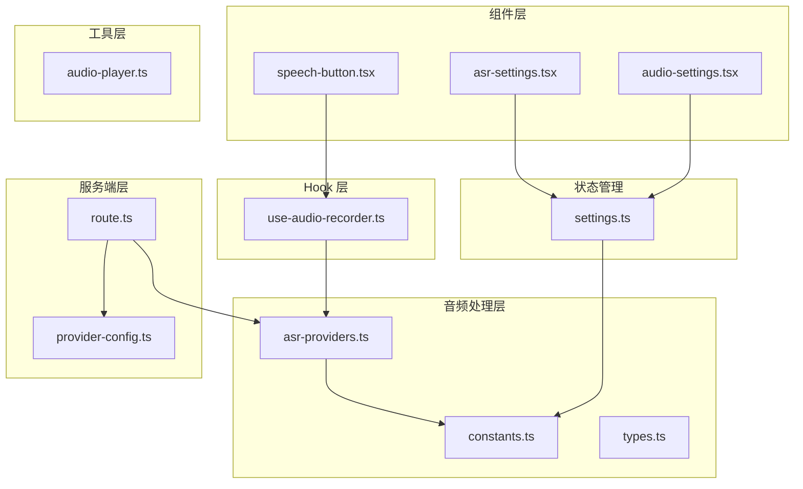
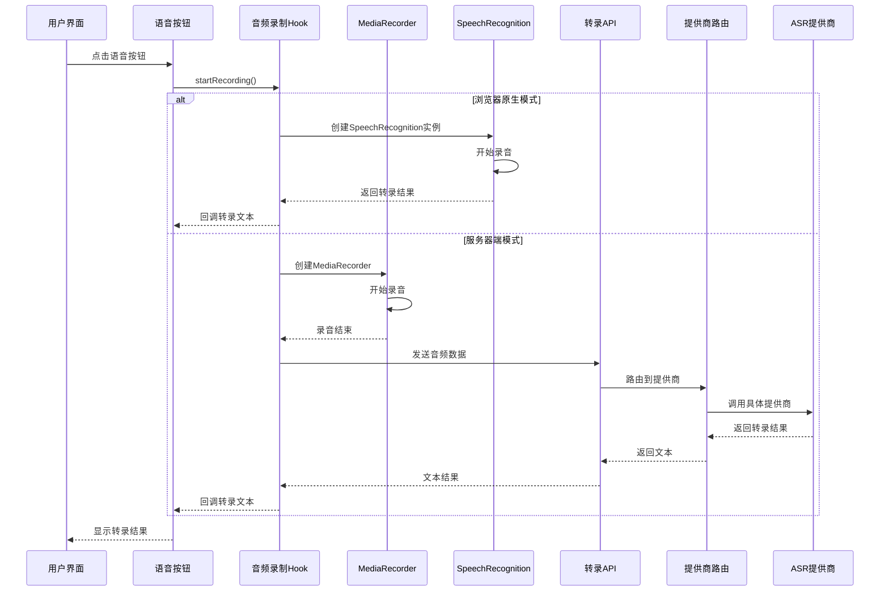
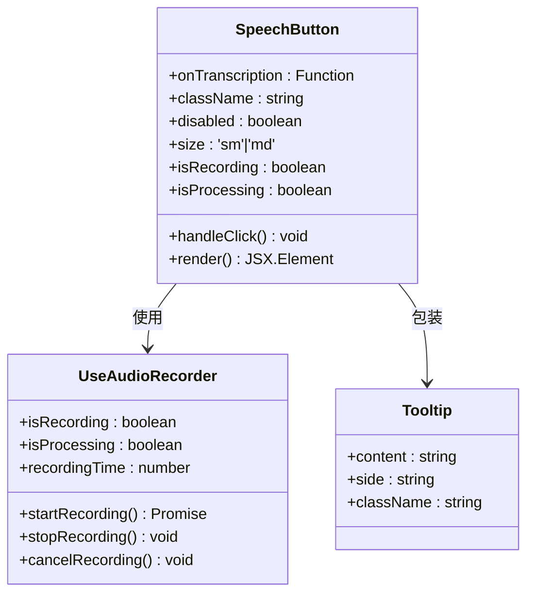
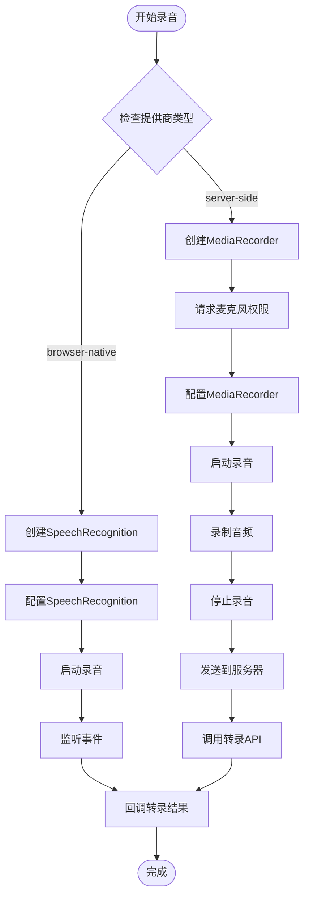
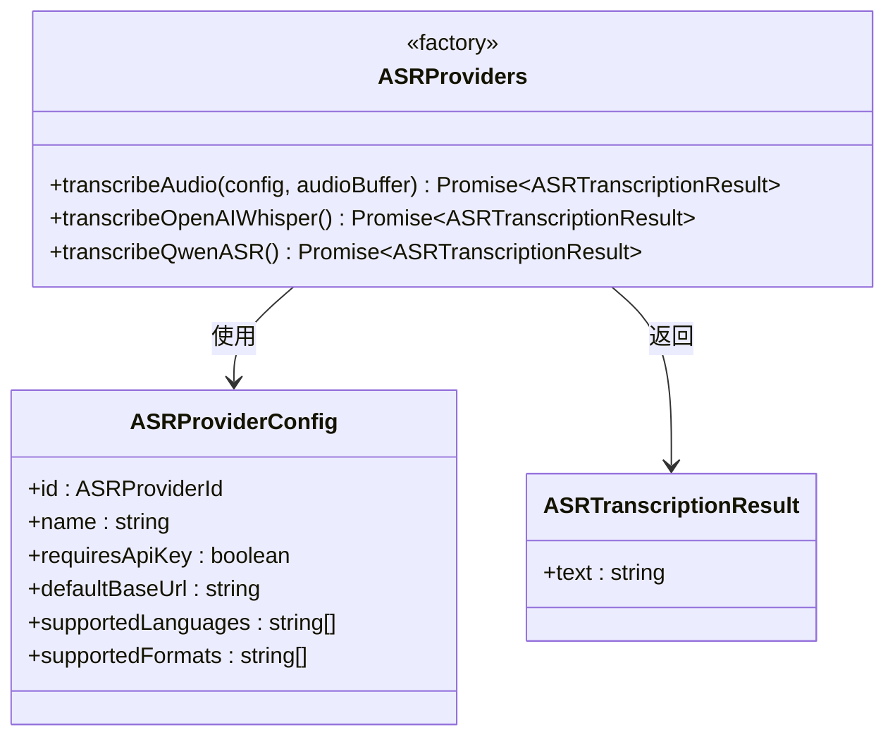
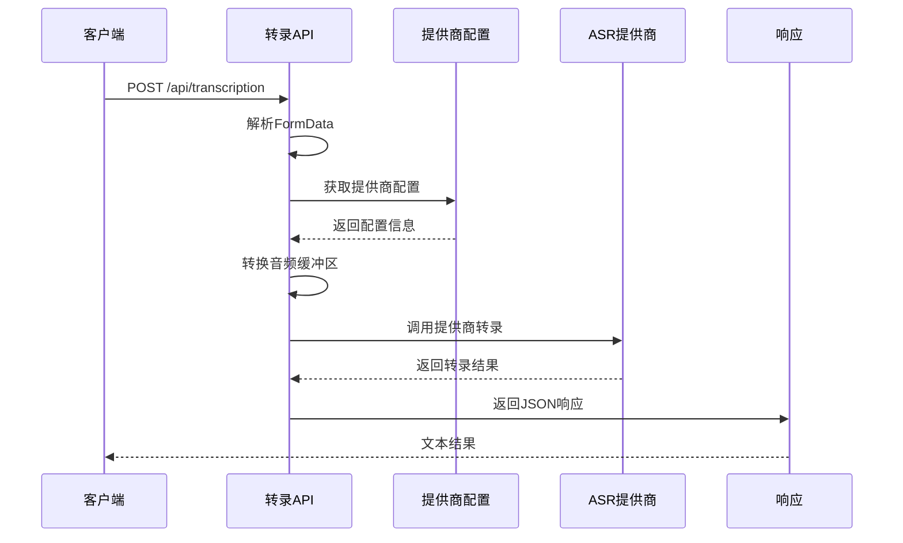
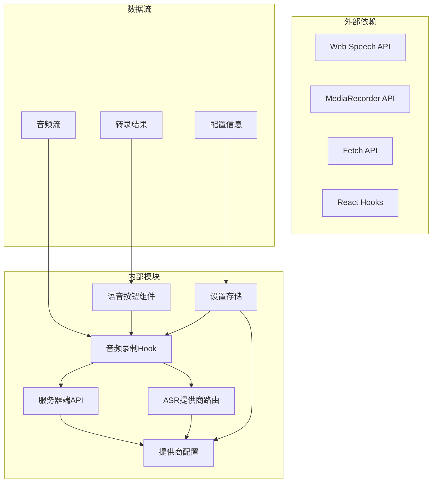

# 语音识别系统（ASR）

<cite>
**本文档引用的文件**
- [speech-button.tsx](file://components/audio/speech-button.tsx)
- [use-audio-recorder.ts](file://lib/hooks/use-audio-recorder.ts)
- [asr-providers.ts](file://lib/audio/asr-providers.ts)
- [types.ts](file://lib/audio/types.ts)
- [constants.ts](file://lib/audio/constants.ts)
- [provider-config.ts](file://lib/server/provider-config.ts)
- [route.ts](file://app/api/transcription/route.ts)
- [asr-settings.tsx](file://components/settings/asr-settings.tsx)
- [audio-settings.tsx](file://components/settings/audio-settings.tsx)
- [settings.ts](file://lib/store/settings.ts)
- [audio-player.ts](file://lib/utils/audio-player.ts)
</cite>

## 目录
1. [简介](#简介)
2. [项目结构](#项目结构)
3. [核心组件](#核心组件)
4. [架构概览](#架构概览)
5. [详细组件分析](#详细组件分析)
6. [依赖关系分析](#依赖关系分析)
7. [性能考虑](#性能考虑)
8. [故障排除指南](#故障排除指南)
9. [结论](#结论)
10. [附录](#附录)

## 简介

OpenMAIC 语音识别系统（ASR）是一个基于 Web 的实时语音转文字解决方案，集成了多种 ASR 提供商，包括 OpenAI Whisper、浏览器原生 Web Speech API 和阿里云 Qwen ASR。该系统提供了完整的语音识别管道，从音频采集到文本输出，并支持实时转录和离线识别模式。

系统采用模块化设计，通过统一的接口抽象不同的 ASR 提供商，支持动态切换和配置管理。用户界面提供了直观的语音按钮组件，支持录音状态管理和用户交互反馈。

## 项目结构

语音识别系统主要分布在以下目录中：



**图表来源**
- [speech-button.tsx:1-142](file://components/audio/speech-button.tsx#L1-L142)
- [use-audio-recorder.ts:1-293](file://lib/hooks/use-audio-recorder.ts#L1-L293)
- [asr-providers.ts:1-354](file://lib/audio/asr-providers.ts#L1-L354)

**章节来源**
- [speech-button.tsx:1-142](file://components/audio/speech-button.tsx#L1-L142)
- [use-audio-recorder.ts:1-293](file://lib/hooks/use-audio-recorder.ts#L1-L293)
- [asr-providers.ts:1-354](file://lib/audio/asr-providers.ts#L1-L354)

## 核心组件

### 语音按钮组件

语音按钮组件是用户交互的核心入口，提供了完整的录音控制功能：

- **录音状态管理**：支持开始录音、停止录音和取消录音
- **用户反馈**：通过视觉效果显示录音状态（呼吸环、等频条）
- **交互控制**：禁用状态处理和尺寸适配
- **国际化支持**：多语言提示信息

### 音频录制 Hook

useAudioRecorder 提供了完整的音频录制和处理能力：

- **双模式支持**：浏览器原生 ASR 和服务器端 ASR
- **状态跟踪**：录音状态、处理状态和录制时间
- **错误处理**：详细的错误分类和用户友好的错误消息
- **资源管理**：自动清理媒体流和定时器

### ASR 提供商集成

系统支持三种主要的 ASR 提供商：

1. **OpenAI Whisper**：云端语音识别服务
2. **浏览器原生**：Web Speech API 客户端识别
3. **Qwen ASR**：阿里云语音识别服务

**章节来源**
- [speech-button.tsx:18-142](file://components/audio/speech-button.tsx#L18-L142)
- [use-audio-recorder.ts:21-293](file://lib/hooks/use-audio-recorder.ts#L21-L293)
- [asr-providers.ts:163-190](file://lib/audio/asr-providers.ts#L163-L190)

## 架构概览

语音识别系统的整体架构采用分层设计：



**图表来源**
- [speech-button.tsx:47-53](file://components/audio/speech-button.tsx#L47-L53)
- [use-audio-recorder.ts:86-216](file://lib/hooks/use-audio-recorder.ts#L86-L216)
- [route.ts:11-51](file://app/api/transcription/route.ts#L11-L51)

## 详细组件分析

### 语音按钮组件实现

语音按钮组件实现了完整的用户交互逻辑：



**图表来源**
- [speech-button.tsx:11-16](file://components/audio/speech-button.tsx#L11-L16)
- [use-audio-recorder.ts:21-293](file://lib/hooks/use-audio-recorder.ts#L21-L293)

组件特性：
- **状态管理**：通过 ref 确保回调函数始终使用最新版本
- **视觉反馈**：录音时的呼吸动画和等频条效果
- **无障碍支持**：工具提示和键盘导航
- **响应式设计**：支持不同尺寸的按钮

**章节来源**
- [speech-button.tsx:18-142](file://components/audio/speech-button.tsx#L18-L142)

### 音频录制 Hook 分析

useAudioRecorder 实现了复杂的音频处理逻辑：



**图表来源**
- [use-audio-recorder.ts:86-216](file://lib/hooks/use-audio-recorder.ts#L86-L216)

关键功能：
- **双模式切换**：根据提供商类型选择合适的录音方式
- **错误分类**：详细的错误类型处理（无语音、音频捕获、权限等）
- **资源清理**：自动停止媒体流和清理定时器
- **状态同步**：录音时间和处理状态的实时更新

**章节来源**
- [use-audio-recorder.ts:21-293](file://lib/hooks/use-audio-recorder.ts#L21-L293)

### ASR 提供商路由系统

ASR 提供商路由系统实现了统一的提供商接口：



**图表来源**
- [asr-providers.ts:163-190](file://lib/audio/asr-providers.ts#L163-L190)
- [constants.ts:630-750](file://lib/audio/constants.ts#L630-L750)

提供商特性：
- **OpenAI Whisper**：支持 58 种语言，高质量转录
- **浏览器原生**：客户端实时识别，无需网络传输
- **Qwen ASR**：阿里云服务，支持多语言方言识别

**章节来源**
- [asr-providers.ts:1-354](file://lib/audio/asr-providers.ts#L1-L354)
- [constants.ts:624-800](file://lib/audio/constants.ts#L624-L800)

### 服务器端转录 API

转录 API 处理来自客户端的音频数据：



**图表来源**
- [route.ts:11-51](file://app/api/transcription/route.ts#L11-L51)

**章节来源**
- [route.ts:1-52](file://app/api/transcription/route.ts#L1-L52)

## 依赖关系分析

系统采用松耦合的设计模式，各组件之间的依赖关系清晰：



**图表来源**
- [speech-button.tsx:3-9](file://components/audio/speech-button.tsx#L3-L9)
- [use-audio-recorder.ts:1-4](file://lib/hooks/use-audio-recorder.ts#L1-L4)
- [asr-providers.ts:148-151](file://lib/audio/asr-providers.ts#L148-L151)

**章节来源**
- [settings.ts:421-800](file://lib/store/settings.ts#L421-L800)
- [provider-config.ts:279-298](file://lib/server/provider-config.ts#L279-L298)

## 性能考虑

### 音频质量优化

系统在音频质量方面采用了多项优化策略：

1. **格式选择**：默认使用 webm 格式，提供良好的压缩比和质量平衡
2. **采样率优化**：根据提供商要求自动调整音频参数
3. **缓冲区管理**：智能的音频块管理和内存释放

### 实时性能

- **延迟控制**：浏览器原生模式提供最低延迟的实时识别
- **并发处理**：支持多个录音会话的并发管理
- **资源复用**：媒体流和定时器的智能复用减少资源消耗

### 内存管理

- **自动清理**：录音结束后自动停止媒体流和清理事件监听器
- **垃圾回收**：及时释放 Blob 对象和音频 URL
- **状态同步**：避免内存泄漏的状态管理

## 故障排除指南

### 常见问题及解决方案

| 问题类型 | 错误代码 | 可能原因 | 解决方案 |
|---------|---------|---------|---------|
| 权限问题 | not-allowed | 用户拒绝麦克风权限 | 检查浏览器权限设置，重新授权 |
| 网络错误 | network | 网络连接不稳定 | 检查网络连接，重试操作 |
| 无语音输入 | no-speech | 未检测到语音 | 调整麦克风位置，确保语音清晰 |
| 音频捕获 | audio-capture | 麦克风硬件问题 | 检查硬件连接，更换设备 |
| API 密钥 | invalid_key | 密钥无效或过期 | 更新有效的 API 密钥 |

### 调试技巧

1. **开发者工具**：使用浏览器开发者工具监控网络请求和控制台日志
2. **状态检查**：通过设置面板查看当前的提供商配置和状态
3. **日志分析**：利用应用日志系统追踪错误发生的具体位置

**章节来源**
- [use-audio-recorder.ts:127-155](file://lib/hooks/use-audio-recorder.ts#L127-L155)
- [audio-settings.tsx:365-467](file://components/settings/audio-settings.tsx#L365-L467)

## 结论

OpenMAIC 语音识别系统提供了一个完整、可扩展的语音转文字解决方案。系统通过模块化设计实现了良好的可维护性和可扩展性，支持多种 ASR 提供商和录音模式。

主要优势包括：
- **多提供商支持**：灵活的提供商选择和配置
- **双模式录音**：实时识别和离线识别的平衡
- **用户友好**：直观的界面和丰富的反馈机制
- **性能优化**：高效的资源管理和内存控制

未来可以考虑的功能增强：
- 支持更多 ASR 提供商
- 实时降噪处理
- 多语言混合识别
- 语音质量评估

## 附录

### 使用示例

#### 实时转录示例
```typescript
// 在组件中使用语音按钮
<SpeechButton 
  onTranscription={(text) => console.log('转录结果:', text)}
  size="md"
/>
```

#### 离线识别示例
```typescript
// 使用音频录制 Hook
const { isRecording, startRecording, stopRecording } = useAudioRecorder({
  onTranscription: (text) => console.log('离线转录:', text)
});

// 开始录音
await startRecording();

// 停止录音并获取结果
stopRecording();
```

### 配置选项

#### 支持的语言列表
系统支持 58 种语言的语音识别，包括：
- 中文（简体、繁体、粤语方言）
- 英语（美式、英式、澳洲式等）
- 日语、韩语、法语、德语等主要欧洲语言
- 阿拉伯语、俄语、印地语等世界主要语言

#### 音频格式支持
- **OpenAI Whisper**：mp3, mp4, mpeg, mpga, m4a, wav, webm
- **Qwen ASR**：mp3, wav, webm, m4a, flac
- **浏览器原生**：浏览器支持的所有格式

**章节来源**
- [constants.ts:637-701](file://lib/audio/constants.ts#L637-L701)
- [asr-settings.tsx:205-221](file://components/settings/asr-settings.tsx#L205-L221)