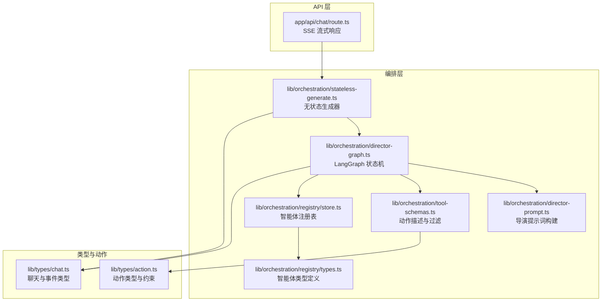
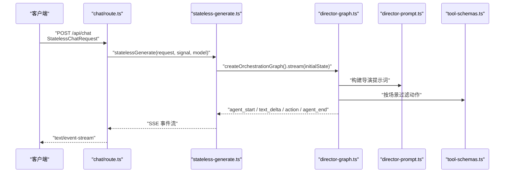
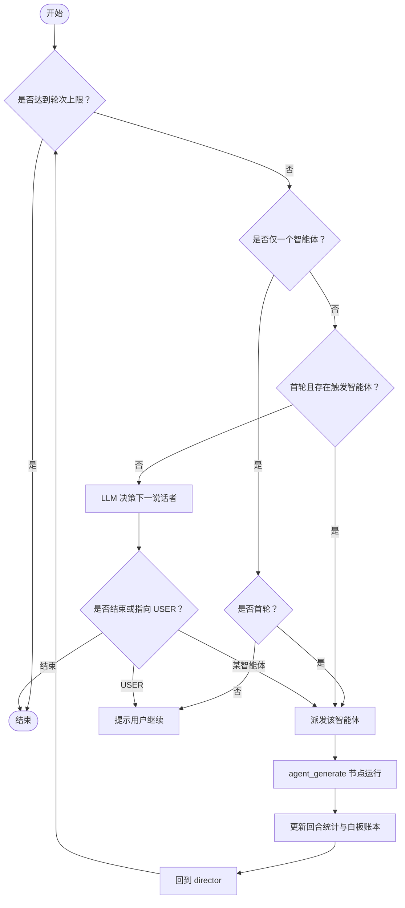
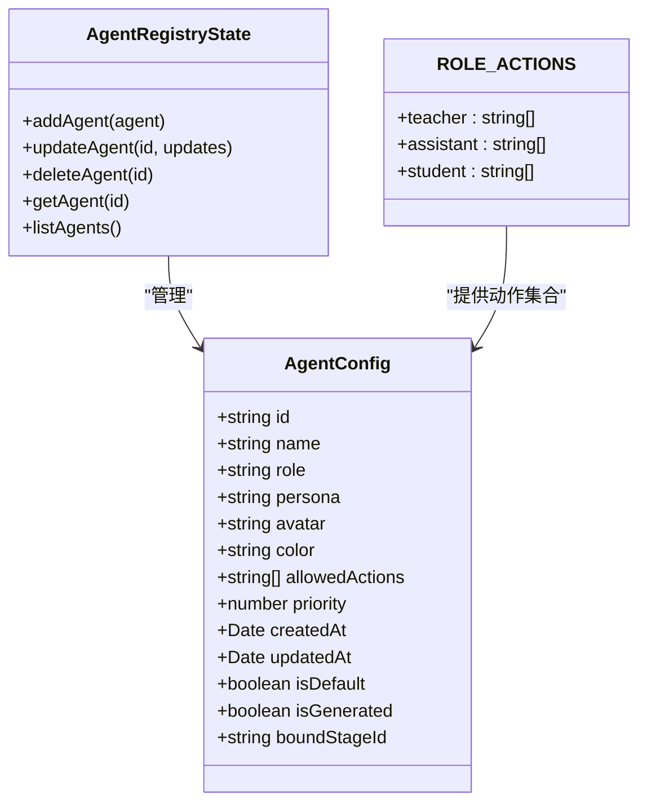
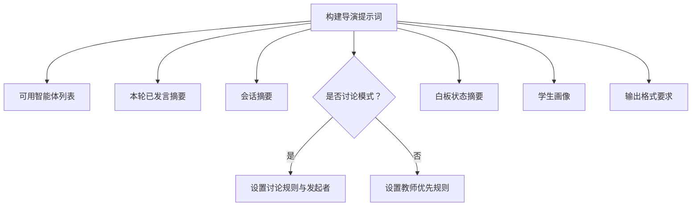
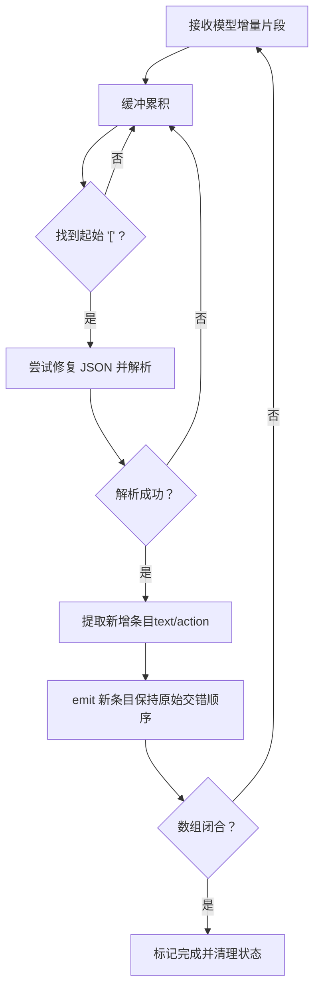
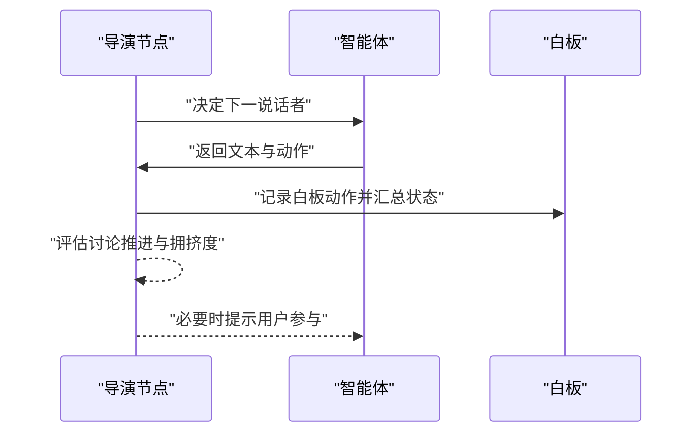
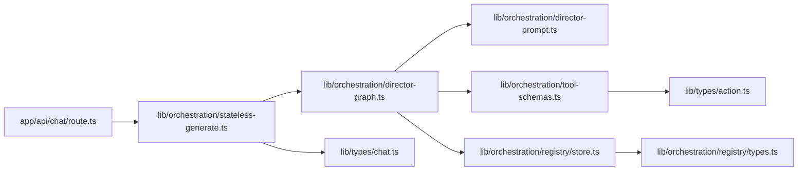

# 多智能体编排

<cite>
**本文档引用的文件**
- [README.md](file://README.md)
- [lib/orchestration/director-graph.ts](file://lib/orchestration/director-graph.ts)
- [lib/orchestration/director-prompt.ts](file://lib/orchestration/director-prompt.ts)
- [lib/orchestration/tool-schemas.ts](file://lib/orchestration/tool-schemas.ts)
- [lib/orchestration/registry/store.ts](file://lib/orchestration/registry/store.ts)
- [lib/orchestration/registry/types.ts](file://lib/orchestration/registry/types.ts)
- [lib/orchestration/stateless-generate.ts](file://lib/orchestration/stateless-generate.ts)
- [lib/types/chat.ts](file://lib/types/chat.ts)
- [lib/types/action.ts](file://lib/types/action.ts)
- [app/api/chat/route.ts](file://app/api/chat/route.ts)
</cite>

## 目录
1. [引言](#引言)
2. [项目结构](#项目结构)
3. [核心组件](#核心组件)
4. [架构总览](#架构总览)
5. [详细组件分析](#详细组件分析)
6. [依赖关系分析](#依赖关系分析)
7. [性能考量](#性能考量)
8. [故障排查指南](#故障排查指南)
9. [结论](#结论)
10. [附录](#附录)

## 引言
本文件面向多智能体编排系统，围绕基于 LangGraph 的状态机设计与实现，系统性阐述以下主题：
- LangGraph 状态机如何协调多个 AI 智能体的交互与轮次管理
- 智能体配置管理机制：角色定义、能力分配与行为模式
- 对话流程控制：轮次限制、话题引导与讨论模式
- 工具调用模式：可用工具注册、参数校验与执行
- 讨论模式实现：课堂讨论、圆桌辩论与 Q&A 的具体策略
- 扩展指南：新增智能体与自定义行为的实现路径

该系统以“无状态聊天”为核心 API，通过 LangGraph 状态机驱动多智能体的单轮生成与事件流式输出，确保前端可实时渲染文本与动作。

## 项目结构
本项目采用分层组织方式，核心编排逻辑位于 lib/orchestration，API 入口位于 app/api，类型与动作定义位于 lib/types。

**图示来源**
- [app/api/chat/route.ts:1-191](file://app/api/chat/route.ts#L1-L191)
- [lib/orchestration/stateless-generate.ts:1-435](file://lib/orchestration/stateless-generate.ts#L1-L435)
- [lib/orchestration/director-graph.ts:1-550](file://lib/orchestration/director-graph.ts#L1-L550)
- [lib/orchestration/director-prompt.ts:1-278](file://lib/orchestration/director-prompt.ts#L1-L278)
- [lib/orchestration/tool-schemas.ts:1-69](file://lib/orchestration/tool-schemas.ts#L1-L69)
- [lib/orchestration/registry/store.ts:1-398](file://lib/orchestration/registry/store.ts#L1-L398)
- [lib/orchestration/registry/types.ts:1-87](file://lib/orchestration/registry/types.ts#L1-L87)
- [lib/types/chat.ts:1-337](file://lib/types/chat.ts#L1-L337)
- [lib/types/action.ts:1-221](file://lib/types/action.ts#L1-L221)

**章节来源**
- [README.md:428-434](file://README.md#L428-L434)
- [app/api/chat/route.ts:1-191](file://app/api/chat/route.ts#L1-L191)

## 核心组件
- LangGraph 状态机：统一拓扑 START → director → agent_generate → director，支持单智能体纯逻辑决策与多智能体 LLM 决策。
- 导演提示词：根据会话摘要、已发言列表、白板状态与学生画像，输出下一说话者或结束指令。
- 动作过滤与描述：按场景类型动态过滤滑动专用动作；在系统提示中注入动作描述。
- 智能体注册表：默认模板与持久化自定义智能体；支持按阶段加载生成的智能体。
- 无状态生成器：单次生成、结构化数组输出、增量解析与事件流式输出。
- 类型与动作：统一的动作类型、同步/异步动作边界与滑动专用动作集合。

**章节来源**
- [lib/orchestration/director-graph.ts:1-550](file://lib/orchestration/director-graph.ts#L1-L550)
- [lib/orchestration/director-prompt.ts:1-278](file://lib/orchestration/director-prompt.ts#L1-L278)
- [lib/orchestration/tool-schemas.ts:1-69](file://lib/orchestration/tool-schemas.ts#L1-L69)
- [lib/orchestration/registry/store.ts:1-398](file://lib/orchestration/registry/store.ts#L1-L398)
- [lib/orchestration/registry/types.ts:1-87](file://lib/orchestration/registry/types.ts#L1-L87)
- [lib/orchestration/stateless-generate.ts:1-435](file://lib/orchestration/stateless-generate.ts#L1-L435)
- [lib/types/chat.ts:1-337](file://lib/types/chat.ts#L1-L337)
- [lib/types/action.ts:1-221](file://lib/types/action.ts#L1-L221)

## 架构总览
下图展示从 API 请求到事件流式输出的端到端流程，以及 LangGraph 状态机在其中的角色。

**图示来源**
- [app/api/chat/route.ts:44-191](file://app/api/chat/route.ts#L44-L191)
- [lib/orchestration/stateless-generate.ts:317-435](file://lib/orchestration/stateless-generate.ts#L317-L435)
- [lib/orchestration/director-graph.ts:484-550](file://lib/orchestration/director-graph.ts#L484-L550)
- [lib/orchestration/director-prompt.ts:52-138](file://lib/orchestration/director-prompt.ts#L52-L138)
- [lib/orchestration/tool-schemas.ts:16-21](file://lib/orchestration/tool-schemas.ts#L16-L21)

## 详细组件分析

### LangGraph 状态机与轮次管理
- 统一拓扑：START → director → agent_generate → director，条件边依据 shouldEnd 切换至 END 或循环。
- 单智能体策略：首回合直接派发，后续回合仅提示用户继续，保持会话活性。
- 多智能体策略：首回合若存在触发智能体则优先派发；否则由 LLM 决定下一说话者或结束。
- 轮次限制：turnCount 达到 maxTurns 后强制结束，避免无限循环。
- 事件流：writer 回调逐段推送事件，前端按顺序渲染。

**图示来源**
- [lib/orchestration/director-graph.ts:114-228](file://lib/orchestration/director-graph.ts#L114-L228)
- [lib/orchestration/director-graph.ts:439-472](file://lib/orchestration/director-graph.ts#L439-L472)

**章节来源**
- [lib/orchestration/director-graph.ts:1-550](file://lib/orchestration/director-graph.ts#L1-L550)

### 智能体配置管理机制
- 默认智能体：教师、助教、多种学生角色，内置 persona、颜色、头像与动作集合。
- 注册表：Zustand + 持久化，支持增删改查、合并默认与持久化数据。
- 角色到动作映射：教师拥有滑动与白板全集，其他角色仅白板动作。
- 按阶段加载生成智能体：从 IndexedDB 加载，清空旧生成项后写入新记录。
- 解析器：请求级覆盖优先于全局注册表，保证服务端无状态。

**图示来源**
- [lib/orchestration/registry/types.ts:6-24](file://lib/orchestration/registry/types.ts#L6-L24)
- [lib/orchestration/registry/store.ts:14-24](file://lib/orchestration/registry/store.ts#L14-L24)
- [lib/orchestration/registry/types.ts:74-86](file://lib/orchestration/registry/types.ts#L74-L86)

**章节来源**
- [lib/orchestration/registry/store.ts:1-398](file://lib/orchestration/registry/store.ts#L1-L398)
- [lib/orchestration/registry/types.ts:1-87](file://lib/orchestration/registry/types.ts#L1-L87)

### 对话流程控制系统
- 会话类型：QA、讨论、讲座；讨论模式由 discussionTopic 与 triggerAgentId 触发。
- 白板状态感知：导演提示词包含元素数量、贡献者与拥挤警告，避免过度绘制。
- 学生画像：昵称与背景信息用于个性化路由。
- 质量规则：角色多样性、内容去重、讨论推进、问候规则等，确保对话质量与节奏。

**图示来源**
- [lib/orchestration/director-prompt.ts:52-138](file://lib/orchestration/director-prompt.ts#L52-L138)

**章节来源**
- [lib/orchestration/director-prompt.ts:1-278](file://lib/orchestration/director-prompt.ts#L1-L278)
- [lib/types/chat.ts:226-282](file://lib/types/chat.ts#L226-L282)

### 工具调用模式与参数校验
- 结构化数组输出：模型输出形如 [{"type":"action","name":"...","params":{}}, {"type":"text","content":""}] 的数组。
- 增量解析：使用 partial-json 与 jsonrepair 支持不完整 JSON 的逐步解析，保留原始顺序。
- 动作过滤：非滑动场景移除 spotlight/laser 等滑动专用动作，确保一致性。
- 参数校验：前端接收后进行参数校验与执行；后端仅做动作名与类型检查。

**图示来源**
- [lib/orchestration/stateless-generate.ts:136-255](file://lib/orchestration/stateless-generate.ts#L136-L255)

**章节来源**
- [lib/orchestration/stateless-generate.ts:1-435](file://lib/orchestration/stateless-generate.ts#L1-L435)
- [lib/orchestration/tool-schemas.ts:16-69](file://lib/orchestration/tool-schemas.ts#L16-L69)
- [lib/types/action.ts:184-205](file://lib/types/action.ts#L184-L205)

### 讨论模式实现
- 课堂讨论：由学生智能体发起，教师随后引导，遵循“解释—提问—深化—不同视角—总结”的推进路径。
- 圆桌辩论：多智能体不同角色围绕主题展开，配合白板绘制增强可视化。
- Q&A 模式：教师优先响应用户问题，必要时引入讨论动作进行深度探索。
- 讨论触发：通过 discussionTopic 与 triggerAgentId 控制话题与发起者；讨论必须置于数组末尾。

**图示来源**
- [lib/orchestration/director-prompt.ts:80-138](file://lib/orchestration/director-prompt.ts#L80-L138)
- [lib/orchestration/director-graph.ts:284-312](file://lib/orchestration/director-graph.ts#L284-L312)

**章节来源**
- [lib/orchestration/director-prompt.ts:1-278](file://lib/orchestration/director-prompt.ts#L1-L278)
- [lib/types/chat.ts:226-282](file://lib/types/chat.ts#L226-L282)

### 扩展指南：新增智能体与自定义行为
- 新增智能体
  - 在注册表中添加 AgentConfig，指定角色、动作集合与优先级。
  - 若为生成智能体，通过 saveGeneratedAgents 写入 IndexedDB，并在当前阶段加载。
- 自定义行为
  - 在智能体 persona 中明确职责与风格，结合导演提示词的质量规则提升对话质量。
  - 通过 allowedActions 控制动作范围，必要时使用 getEffectiveActions 进行场景过滤。
- API 集成
  - 在 StatelessChatRequest.config.agentIds 中加入新智能体 ID。
  - 如需讨论模式，设置 discussionTopic 与 triggerAgentId。

**章节来源**
- [lib/orchestration/registry/store.ts:318-398](file://lib/orchestration/registry/store.ts#L318-L398)
- [lib/orchestration/registry/types.ts:6-24](file://lib/orchestration/registry/types.ts#L6-L24)
- [lib/orchestration/tool-schemas.ts:16-21](file://lib/orchestration/tool-schemas.ts#L16-L21)
- [lib/types/chat.ts:248-282](file://lib/types/chat.ts#L248-L282)

## 依赖关系分析
- 编排层依赖类型层提供的事件与状态结构，确保前后端一致。
- 动作层提供统一的动作类型与约束，编排层在生成与过滤时复用。
- API 层负责 SSE 流式输出与心跳保活，避免代理/浏览器超时断连。

**图示来源**
- [app/api/chat/route.ts:1-191](file://app/api/chat/route.ts#L1-L191)
- [lib/orchestration/stateless-generate.ts:1-435](file://lib/orchestration/stateless-generate.ts#L1-L435)
- [lib/orchestration/director-graph.ts:1-550](file://lib/orchestration/director-graph.ts#L1-L550)
- [lib/orchestration/director-prompt.ts:1-278](file://lib/orchestration/director-prompt.ts#L1-L278)
- [lib/orchestration/tool-schemas.ts:1-69](file://lib/orchestration/tool-schemas.ts#L1-L69)
- [lib/orchestration/registry/store.ts:1-398](file://lib/orchestration/registry/store.ts#L1-L398)
- [lib/orchestration/registry/types.ts:1-87](file://lib/orchestration/registry/types.ts#L1-L87)
- [lib/types/chat.ts:1-337](file://lib/types/chat.ts#L1-L337)
- [lib/types/action.ts:1-221](file://lib/types/action.ts#L1-L221)

**章节来源**
- [app/api/chat/route.ts:1-191](file://app/api/chat/route.ts#L1-L191)
- [lib/orchestration/stateless-generate.ts:1-435](file://lib/orchestration/stateless-generate.ts#L1-L435)
- [lib/orchestration/director-graph.ts:1-550](file://lib/orchestration/director-graph.ts#L1-L550)

## 性能考量
- 单次生成与无状态：每次请求携带完整上下文，避免服务端状态膨胀，便于横向扩展。
- 增量解析与流式输出：partial-json 与 jsonrepair 提升鲁棒性，减少重试成本。
- 心跳保活：SSE 连接空闲时发送心跳，降低代理/浏览器超时断开风险。
- 动作过滤：按场景类型剔除无效动作，减少前端渲染与执行负担。

[本节为通用指导，无需特定文件引用]

## 故障排查指南
- SSE 连接中断
  - 现象：前端长时间无响应或连接被关闭。
  - 排查：确认心跳定时器正常运行；检查网络代理与浏览器对 SSE 的限制。
  - 参考：[app/api/chat/route.ts:95-173](file://app/api/chat/route.ts#L95-L173)
- 生成异常
  - 现象：模型输出非预期格式导致解析失败。
  - 排查：启用 jsonrepair 与 partial-json 容错；检查模型输出前缀与 JSON 闭合。
  - 参考：[lib/orchestration/stateless-generate.ts:165-180](file://lib/orchestration/stateless-generate.ts#L165-L180)
- 动作未生效
  - 现象：某些动作未在当前场景执行。
  - 排查：确认 getEffectiveActions 是否剔除了滑动专用动作；检查 allowedActions 配置。
  - 参考：[lib/orchestration/tool-schemas.ts:16-21](file://lib/orchestration/tool-schemas.ts#L16-L21)
- 智能体未出现
  - 现象：新增智能体未出现在对话中。
  - 排查：确认 agentIds 已加入请求；生成智能体是否正确加载到注册表。
  - 参考：[lib/orchestration/registry/store.ts:318-350](file://lib/orchestration/registry/store.ts#L318-L350)

**章节来源**
- [app/api/chat/route.ts:95-173](file://app/api/chat/route.ts#L95-L173)
- [lib/orchestration/stateless-generate.ts:165-180](file://lib/orchestration/stateless-generate.ts#L165-L180)
- [lib/orchestration/tool-schemas.ts:16-21](file://lib/orchestration/tool-schemas.ts#L16-L21)
- [lib/orchestration/registry/store.ts:318-350](file://lib/orchestration/registry/store.ts#L318-L350)

## 结论
本系统通过 LangGraph 状态机与无状态生成器，实现了多智能体的高效编排与流畅交互。导演提示词与动作过滤确保了对话质量与场景一致性，注册表机制提供了灵活的智能体管理能力。结合 SSE 流式输出与心跳保活，系统在复杂讨论与可视化场景中具备良好的扩展性与稳定性。

[本节为总结，无需特定文件引用]

## 附录
- 关键类型与事件
  - StatelessChatRequest：包含消息历史、应用状态、智能体配置与导演状态。
  - StatelessEvent：agent_start、text_delta、action、agent_end、thinking、cue_user、done、error。
- 动作类型
  - 同步动作：speech、play_video、wb_open、wb_draw_*、wb_clear、wb_delete、wb_close、discussion。
  - 滑动专用动作：spotlight、laser。
  - 非阻塞动作：spotlight、laser。

**章节来源**
- [lib/types/chat.ts:236-337](file://lib/types/chat.ts#L236-L337)
- [lib/types/action.ts:184-205](file://lib/types/action.ts#L184-L205)