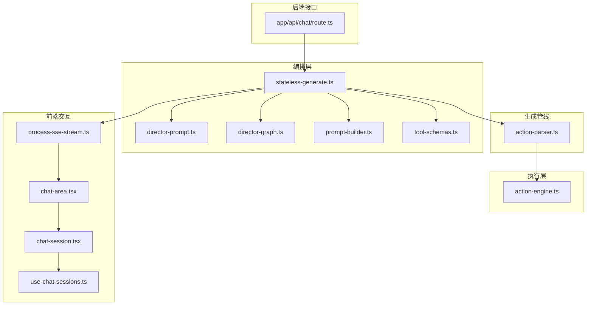
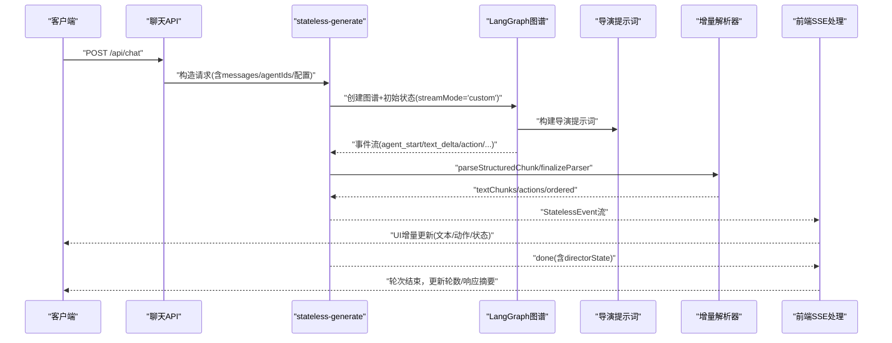
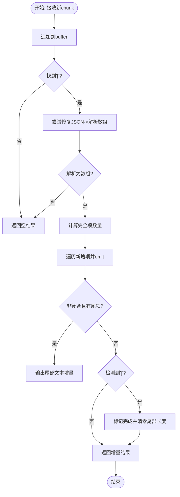
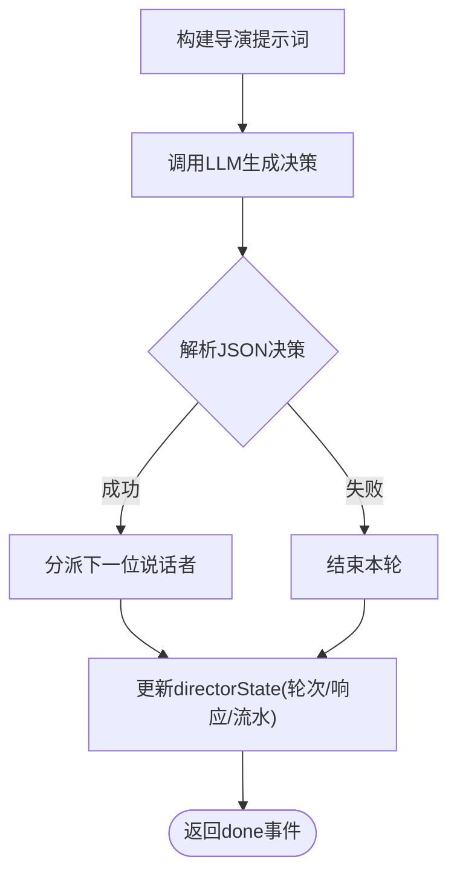
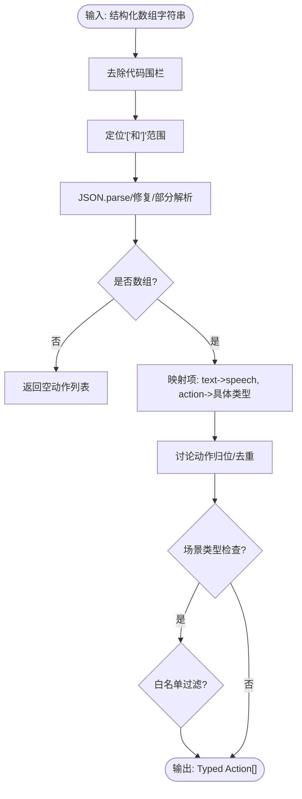
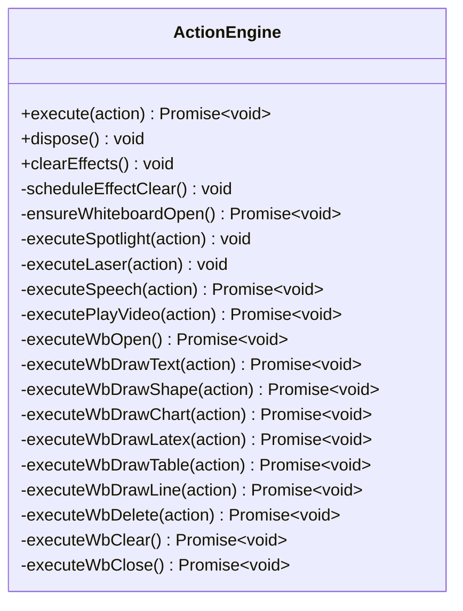
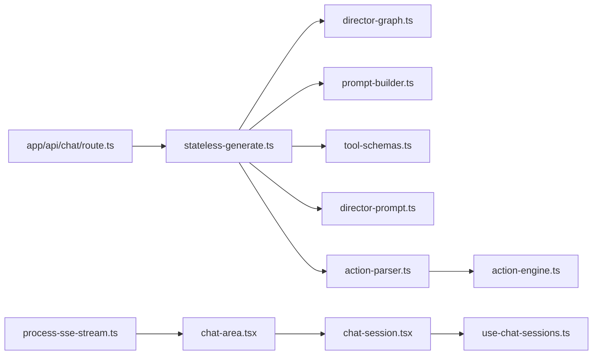

# 对话流程控制

<cite>
**本文引用的文件**
- [lib/orchestration/stateless-generate.ts](file://lib/orchestration/stateless-generate.ts)
- [lib/orchestration/director-prompt.ts](file://lib/orchestration/director-prompt.ts)
- [lib/orchestration/director-graph.ts](file://lib/orchestration/director-graph.ts)
- [lib/orchestration/prompt-builder.ts](file://lib/orchestration/prompt-builder.ts)
- [lib/orchestration/tool-schemas.ts](file://lib/orchestration/tool-schemas.ts)
- [lib/generation/action-parser.ts](file://lib/generation/action-parser.ts)
- [lib/chat/action-translations.ts](file://lib/chat/action-translations.ts)
- [lib/action/engine.ts](file://lib/action/engine.ts)
- [components/chat/process-sse-stream.ts](file://components/chat/process-sse-stream.ts)
- [components/chat/chat-area.tsx](file://components/chat/chat-area.tsx)
- [components/chat/chat-session.tsx](file://components/chat/chat-session.tsx)
- [components/chat/use-chat-sessions.ts](file://components/chat/use-chat-sessions.ts)
- [app/api/chat/route.ts](file://app/api/chat/route.ts)
</cite>

## 目录
1. [简介](#简介)
2. [项目结构](#项目结构)
3. [核心组件](#核心组件)
4. [架构总览](#架构总览)
5. [详细组件分析](#详细组件分析)
6. [依赖关系分析](#依赖关系分析)
7. [性能考量](#性能考量)
8. [故障排查指南](#故障排查指南)
9. [结论](#结论)
10. [附录](#附录)

## 简介
本技术文档围绕“对话流程控制系统”展开，重点解释以下能力与机制：
- 对话历史的构建与总结：消息格式转换、对话摘要生成、上下文压缩策略
- 无状态生成解析器：结构化内容解析、动作提取、文本增量处理
- 对话轮次管理：当前说话者追踪、对话状态维护、中断处理
- 定制指南：新增对话模式、提示词模板修改、解析规则扩展
- 调试与性能：调试工具使用、性能监控指标与优化建议

该系统采用“无状态多智能体生成”设计，通过 LangGraph 的自定义流模式进行多轮调度，结合结构化 JSON 数组输出与增量解析，确保前端可流式渲染自然口语化的教学对话与白板动作。

## 项目结构
对话流程控制相关代码主要分布在以下模块：
- orchestration（编排层）：无状态生成、导演提示词、图谱构建、工具模式
- generation（生成管线）：动作解析器（离线/在线桥接）
- action（执行层）：统一动作引擎，支持火速/同步两类执行模式
- chat（前端交互）：SSE 流处理、聊天区域、会话管理
- api（后端接口）：聊天路由入口

图表来源
- [lib/orchestration/stateless-generate.ts:1-435](file://lib/orchestration/stateless-generate.ts#L1-L435)
- [lib/orchestration/director-prompt.ts:1-278](file://lib/orchestration/director-prompt.ts#L1-L278)
- [lib/generation/action-parser.ts:1-155](file://lib/generation/action-parser.ts#L1-L155)
- [lib/action/engine.ts:1-519](file://lib/action/engine.ts#L1-L519)
- [components/chat/process-sse-stream.ts](file://components/chat/process-sse-stream.ts)
- [components/chat/chat-area.tsx](file://components/chat/chat-area.tsx)
- [components/chat/chat-session.tsx](file://components/chat/chat-session.tsx)
- [components/chat/use-chat-sessions.ts](file://components/chat/use-chat-sessions.ts)
- [app/api/chat/route.ts](file://app/api/chat/route.ts)

章节来源
- [lib/orchestration/stateless-generate.ts:1-435](file://lib/orchestration/stateless-generate.ts#L1-L435)
- [lib/orchestration/director-prompt.ts:1-278](file://lib/orchestration/director-prompt.ts#L1-L278)
- [lib/generation/action-parser.ts:1-155](file://lib/generation/action-parser.ts#L1-L155)
- [lib/action/engine.ts:1-519](file://lib/action/engine.ts#L1-L519)
- [components/chat/process-sse-stream.ts](file://components/chat/process-sse-stream.ts)
- [components/chat/chat-area.tsx](file://components/chat/chat-area.tsx)
- [components/chat/chat-session.tsx](file://components/chat/chat-session.tsx)
- [components/chat/use-chat-sessions.ts](file://components/chat/use-chat-sessions.ts)
- [app/api/chat/route.ts](file://app/api/chat/route.ts)

## 核心组件
- 无状态生成与增量解析：负责从模型输出中解析结构化数组，按序产出文本片段与动作，支持部分 JSON 修复与增量文本流式输出
- 导演提示词与图谱：构建导演系统提示词，汇总白板状态与学生画像，决定下一位说话者
- 动作解析器：将结构化数组转为 Typed Action 列表，保留原始交错顺序，过滤不被允许的动作
- 统一动作引擎：集中执行所有动作，区分“一次性效果”与“需等待完成”的同步动作
- 前端 SSE 处理：将后端流事件映射到 UI，支持状态徽章、文本增量与动作执行

章节来源
- [lib/orchestration/stateless-generate.ts:1-435](file://lib/orchestration/stateless-generate.ts#L1-L435)
- [lib/orchestration/director-prompt.ts:1-278](file://lib/orchestration/director-prompt.ts#L1-L278)
- [lib/generation/action-parser.ts:1-155](file://lib/generation/action-parser.ts#L1-L155)
- [lib/action/engine.ts:1-519](file://lib/action/engine.ts#L1-L519)
- [components/chat/process-sse-stream.ts](file://components/chat/process-sse-stream.ts)

## 架构总览
系统以“无状态生成 + 多智能体编排”为核心，通过 LangGraph 的自定义流模式驱动每轮对话。后端在单次调用内完成一次“代理回合”，前端循环消费事件直至结束，同时维护导演状态（轮次、代理响应、白板流水）。

图表来源
- [lib/orchestration/stateless-generate.ts:317-434](file://lib/orchestration/stateless-generate.ts#L317-L434)
- [lib/orchestration/director-prompt.ts:52-138](file://lib/orchestration/director-prompt.ts#L52-L138)
- [lib/orchestration/director-graph.ts](file://lib/orchestration/director-graph.ts)
- [lib/orchestration/prompt-builder.ts](file://lib/orchestration/prompt-builder.ts)
- [lib/orchestration/tool-schemas.ts](file://lib/orchestration/tool-schemas.ts)
- [components/chat/process-sse-stream.ts](file://components/chat/process-sse-stream.ts)

## 详细组件分析

### 无状态生成与增量解析器
- 设计目标
  - 后端无状态：所有状态在请求/响应中传递
  - 单次生成：不重复生成/调用工具/循环
  - 自然口语：输出为教师口语，非元评论
  - 静默工具：仅展示结果，不暴露内部步骤
  - 交错输出：动作与文本可自由穿插
  - 使用部分 JSON 解析以稳健地流式处理不完整 JSON
- 关键数据结构
  - ParserState：累积缓冲、是否发现起始方括号、已解析项计数、尾部文本长度、是否完成
  - ParseResult：文本片段、动作列表、是否完成、交错顺序记录
- 解析流程
  - 跳过起始前缀（代码围栏、解释性文字），定位数组开始
  - 尝试修复 JSON（jsonrepair），再回退到部分 JSON 解析
  - 计算完全项数量：数组闭合时全部完成；流式时除最后一项外均完成
  - 对于尾部文本项，仅输出剩余增量
  - 标记完成：检测到闭合右方括号
  - 结束阶段：若未产生有效数组，将缓冲区作为纯文本兜底
- 事件聚合与导演状态
  - 收集本轮代理总数、动作总数、是否产生内容
  - 汇总代理内容预览、动作计数、白板动作流水
  - 生成新的导演状态：轮次递增、追加代理响应、合并白板流水

图表来源
- [lib/orchestration/stateless-generate.ts:136-255](file://lib/orchestration/stateless-generate.ts#L136-L255)

章节来源
- [lib/orchestration/stateless-generate.ts:1-435](file://lib/orchestration/stateless-generate.ts#L1-L435)

### 导演提示词与轮次管理
- 提示词构建
  - 可用代理清单、已发言代理摘要、对话上下文、讨论模式信息、白板状态、学生画像
  - 规则强调角色多样性、内容去重、讨论推进、问候避免等
- 白板状态汇总
  - 统计元素数量、贡献者集合，给出拥挤警告
  - 将动作摘要为简洁描述，供导演路由决策
- 决策解析
  - 从 LLM 输出中提取 JSON，解析 next_agent 字段
  - 默认失败即结束本轮
- 轮次与状态更新
  - 每次 statelessGenerate 处理一个代理回合
  - 生成新的 directorState：轮次+1、追加代理响应、合并白板流水

图表来源
- [lib/orchestration/director-prompt.ts:52-138](file://lib/orchestration/director-prompt.ts#L52-L138)
- [lib/orchestration/director-prompt.ts:200-246](file://lib/orchestration/director-prompt.ts#L200-L246)
- [lib/orchestration/director-prompt.ts:248-278](file://lib/orchestration/director-prompt.ts#L248-L278)
- [lib/orchestration/stateless-generate.ts:385-417](file://lib/orchestration/stateless-generate.ts#L385-L417)

章节来源
- [lib/orchestration/director-prompt.ts:1-278](file://lib/orchestration/director-prompt.ts#L1-L278)
- [lib/orchestration/stateless-generate.ts:317-434](file://lib/orchestration/stateless-generate.ts#L317-L434)

### 动作解析器（离线/在线桥接）
- 目标
  - 将结构化数组输出转换为 Typed Action[]，保持交错顺序
  - 兼容新旧格式（name/params vs tool_name/parameters）
  - 文本项转为 speech 动作；动作项映射为具体类型
- 安全过滤
  - 非 slide 场景剔除仅白板动作
  - 白名单过滤，防止代理“模仿”不允许的动作
  - 讨论动作必须位于末尾，最多一个
- 容错策略
  - 去除代码围栏
  - JSON.parse -> jsonrepair -> 部分 JSON 解析三阶段

图表来源
- [lib/generation/action-parser.ts:42-154](file://lib/generation/action-parser.ts#L42-L154)

章节来源
- [lib/generation/action-parser.ts:1-155](file://lib/generation/action-parser.ts#L1-L155)

### 统一动作引擎
- 执行模式
  - 火速类：spotlight、laser，立即生效并定时清理
  - 同步类：speech、play_video、wb_* 系列，等待完成后再继续
- 白板自动打开
  - 针对 wb_* 非 open/close 的操作，若白板关闭则先打开
- 媒体播放桥接
  - 将元素 ID 映射为媒体占位符 ID，等待任务完成或失败
- 动画与延迟
  - 多数绘制/删除操作带淡入/级联删除动画，引擎等待动画完成

图表来源
- [lib/action/engine.ts:55-519](file://lib/action/engine.ts#L55-L519)

章节来源
- [lib/action/engine.ts:1-519](file://lib/action/engine.ts#L1-L519)

### 前端交互与SSE处理
- 状态徽章与本地化
  - 将 SSE 状态映射为本地化标签与图标
  - 提取消息中的文本与动作部件
- SSE 流处理
  - 将后端事件映射为 UI 片段，支持文本增量与动作执行
- 聊天区域与会话
  - 聊天区域负责渲染与滚动
  - 会话管理维护历史与当前状态
  - Hooks 管理会话列表与切换

章节来源
- [lib/chat/action-translations.ts:1-92](file://lib/chat/action-translations.ts#L1-L92)
- [components/chat/process-sse-stream.ts](file://components/chat/process-sse-stream.ts)
- [components/chat/chat-area.tsx](file://components/chat/chat-area.tsx)
- [components/chat/chat-session.tsx](file://components/chat/chat-session.tsx)
- [components/chat/use-chat-sessions.ts](file://components/chat/use-chat-sessions.ts)

## 依赖关系分析
- 编排层依赖
  - stateless-generate 依赖 director-graph、prompt-builder、tool-schemas
  - 导演提示词依赖白板流水与学生画像
- 生成管线依赖
  - action-parser 依赖部分 JSON 与修复库，兼容多种输出格式
- 执行层依赖
  - ActionEngine 依赖舞台存储、媒体生成状态与音频播放器
- 前端依赖
  - SSE 处理依赖状态徽章与消息部件提取
  - 聊天区域依赖会话管理与渲染组件

图表来源
- [lib/orchestration/stateless-generate.ts:25-28](file://lib/orchestration/stateless-generate.ts#L25-L28)
- [lib/orchestration/director-prompt.ts:8-11](file://lib/orchestration/director-prompt.ts#L8-L11)
- [lib/generation/action-parser.ts:12-18](file://lib/generation/action-parser.ts#L12-L18)
- [lib/action/engine.ts:12-34](file://lib/action/engine.ts#L12-L34)
- [components/chat/process-sse-stream.ts](file://components/chat/process-sse-stream.ts)
- [components/chat/chat-area.tsx](file://components/chat/chat-area.tsx)
- [components/chat/chat-session.tsx](file://components/chat/chat-session.tsx)
- [components/chat/use-chat-sessions.ts](file://components/chat/use-chat-sessions.ts)
- [app/api/chat/route.ts](file://app/api/chat/route.ts)

章节来源
- [lib/orchestration/stateless-generate.ts:1-435](file://lib/orchestration/stateless-generate.ts#L1-L435)
- [lib/orchestration/director-prompt.ts:1-278](file://lib/orchestration/director-prompt.ts#L1-L278)
- [lib/generation/action-parser.ts:1-155](file://lib/generation/action-parser.ts#L1-L155)
- [lib/action/engine.ts:1-519](file://lib/action/engine.ts#L1-L519)
- [components/chat/process-sse-stream.ts](file://components/chat/process-sse-stream.ts)
- [components/chat/chat-area.tsx](file://components/chat/chat-area.tsx)
- [components/chat/chat-session.tsx](file://components/chat/chat-session.tsx)
- [components/chat/use-chat-sessions.ts](file://components/chat/use-chat-sessions.ts)
- [app/api/chat/route.ts](file://app/api/chat/route.ts)

## 性能考量
- 流式解析优化
  - 使用部分 JSON 与修复策略，降低因模型输出不完整导致的失败率
  - 尾部文本增量输出，减少前端拼接开销
- 执行模式分离
  - 火速类动作即时生效并定时清理，避免阻塞后续动作
  - 同步动作等待完成，保证时序正确性
- 白板状态感知
  - 导演根据白板元素数量与贡献者给出路由建议，避免过度拥挤
- 前端渲染
  - SSE 事件按序到达，UI 逐步渲染，避免一次性大块更新
- 建议
  - 控制每轮动作数量，遵循“简短优先”原则
  - 在讨论模式下，严格控制轮次与推进质量，避免冗长循环

[本节为通用指导，无需特定文件来源]

## 故障排查指南
- 无 JSON 数组输出
  - 现象：前端未显示任何内容
  - 排查：确认模型输出是否包含数组；查看 finalizeParser 的兜底逻辑
  - 参考
    - [lib/orchestration/stateless-generate.ts:265-306](file://lib/orchestration/stateless-generate.ts#L265-L306)
- JSON 格式错误
  - 现象：解析失败或部分项丢失
  - 排查：启用 jsonrepair 与部分 JSON 回退；检查引号与特殊字符
  - 参考
    - [lib/orchestration/stateless-generate.ts:165-180](file://lib/orchestration/stateless-generate.ts#L165-L180)
    - [lib/generation/action-parser.ts:61-81](file://lib/generation/action-parser.ts#L61-L81)
- 动作未执行或无效
  - 现象：动作未生效或被过滤
  - 排查：确认场景类型与白名单；检查动作类型是否受支持
  - 参考
    - [lib/generation/action-parser.ts:129-151](file://lib/generation/action-parser.ts#L129-L151)
    - [lib/action/engine.ts:86-125](file://lib/action/engine.ts#L86-L125)
- 中断与异常
  - 现象：请求被中断或抛出错误
  - 排查：捕获 AbortError 并上报；记录错误信息
  - 参考
    - [lib/orchestration/stateless-generate.ts:421-433](file://lib/orchestration/stateless-generate.ts#L421-L433)
- 白板拥挤
  - 现象：路由频繁触发清理/组织动作
  - 排查：检查白板流水与元素统计；调整路由规则
  - 参考
    - [lib/orchestration/director-prompt.ts:200-246](file://lib/orchestration/director-prompt.ts#L200-L246)

章节来源
- [lib/orchestration/stateless-generate.ts:165-180](file://lib/orchestration/stateless-generate.ts#L165-L180)
- [lib/orchestration/stateless-generate.ts:265-306](file://lib/orchestration/stateless-generate.ts#L265-L306)
- [lib/generation/action-parser.ts:61-81](file://lib/generation/action-parser.ts#L61-L81)
- [lib/generation/action-parser.ts:129-151](file://lib/generation/action-parser.ts#L129-L151)
- [lib/action/engine.ts:86-125](file://lib/action/engine.ts#L86-L125)
- [lib/orchestration/stateless-generate.ts:421-433](file://lib/orchestration/stateless-generate.ts#L421-L433)
- [lib/orchestration/director-prompt.ts:200-246](file://lib/orchestration/director-prompt.ts#L200-L246)

## 结论
本系统通过“无状态生成 + 多智能体编排 + 增量解析 + 统一执行”的组合，实现了高鲁棒性的教学对话流程控制。其关键优势在于：
- 结构化输出与增量解析确保前端可流式渲染
- 导演提示词与白板状态感知提升对话质量与节奏控制
- 动作解析与执行引擎保障一致性与安全性
- 前端 SSE 处理与状态徽章提升可观测性与用户体验

## 附录

### 对话历史构建与摘要机制
- 消息格式转换
  - 将模型输出的结构化数组映射为文本片段与动作序列
  - 保留交错顺序，便于前端按序渲染
- 对话摘要生成
  - 每轮结束生成代理响应摘要（内容预览、动作计数、白板动作）
  - 导演状态累计历史，用于后续轮次决策
- 上下文压缩
  - 通过“内容预览”与“白板摘要”降低上下文长度
  - 讨论模式与用户画像进一步约束输出方向

章节来源
- [lib/orchestration/stateless-generate.ts:364-417](file://lib/orchestration/stateless-generate.ts#L364-L417)
- [lib/orchestration/director-prompt.ts:67-76](file://lib/orchestration/director-prompt.ts#L67-L76)
- [lib/orchestration/director-prompt.ts:143-198](file://lib/orchestration/director-prompt.ts#L143-L198)

### 无状态生成解析器实现要点
- 结构化内容解析
  - 三阶段解析：原生 JSON -> 修复 JSON -> 部分 JSON
  - 容错边界：缺失数组、不完整 JSON、异常字符
- 动作提取
  - 兼容新旧字段命名；统一为 Typed Action
  - 过滤与校正：场景限制、白名单、讨论动作归位
- 文本增量处理
  - 仅输出尾部增量，避免重复传输
  - 完成标记后清空尾部长度

章节来源
- [lib/orchestration/stateless-generate.ts:136-255](file://lib/orchestration/stateless-generate.ts#L136-L255)
- [lib/generation/action-parser.ts:42-154](file://lib/generation/action-parser.ts#L42-L154)

### 对话轮次管理逻辑
- 当前说话者追踪
  - 代理回合开始时记录 agentId/agentName
  - 聚合本轮内容预览与动作计数
- 对话状态管理
  - 生成新的 directorState：轮次递增、追加响应、合并白板流水
- 中断处理
  - 捕获中断信号并上报“请求被中断”
  - 其他错误记录日志并返回错误事件

章节来源
- [lib/orchestration/stateless-generate.ts:356-417](file://lib/orchestration/stateless-generate.ts#L356-L417)

### 对话流程定制指南
- 新增对话模式
  - 在导演提示词中扩展规则与输出格式
  - 更新工具模式与白板状态感知
  - 参考
    - [lib/orchestration/director-prompt.ts:52-138](file://lib/orchestration/director-prompt.ts#L52-L138)
    - [lib/orchestration/tool-schemas.ts](file://lib/orchestration/tool-schemas.ts)
- 修改提示词模板
  - 调整可用代理、规则、讨论模式与学生画像段落
  - 参考
    - [lib/orchestration/director-prompt.ts:103-137](file://lib/orchestration/director-prompt.ts#L103-L137)
- 扩展解析规则
  - 在动作解析器中增加新动作类型映射与过滤条件
  - 参考
    - [lib/generation/action-parser.ts:104-121](file://lib/generation/action-parser.ts#L104-L121)
    - [lib/generation/action-parser.ts:139-151](file://lib/generation/action-parser.ts#L139-L151)

### 对话流程调试工具与性能监控
- 调试工具
  - 前端状态徽章：输入流/可用、输出可用/错误/拒绝、运行中、结果、错误
  - 参考
    - [lib/chat/action-translations.ts:33-67](file://lib/chat/action-translations.ts#L33-L67)
- 性能监控指标
  - 生成耗时、动作数量、代理数量、轮次时长、白板元素数量
  - 建议在后端日志中记录关键事件与耗时，前端记录渲染时延与事件到达间隔

章节来源
- [lib/chat/action-translations.ts:1-92](file://lib/chat/action-translations.ts#L1-L92)
- [lib/orchestration/stateless-generate.ts:323-421](file://lib/orchestration/stateless-generate.ts#L323-L421)