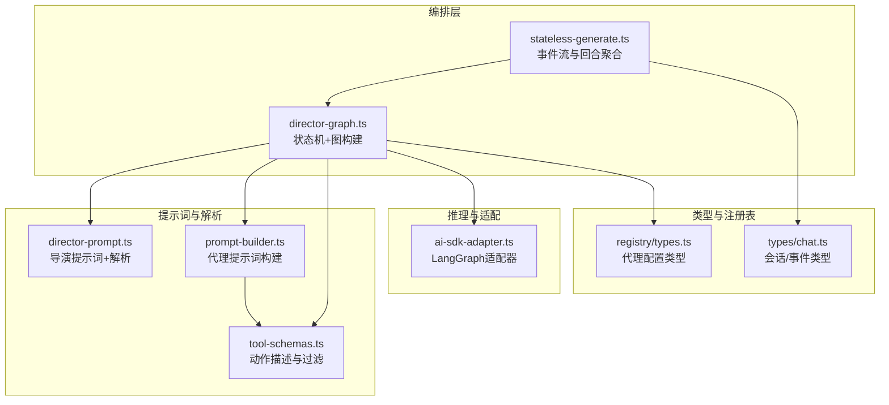
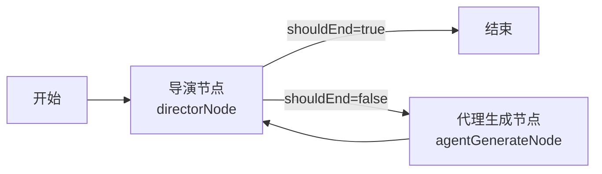
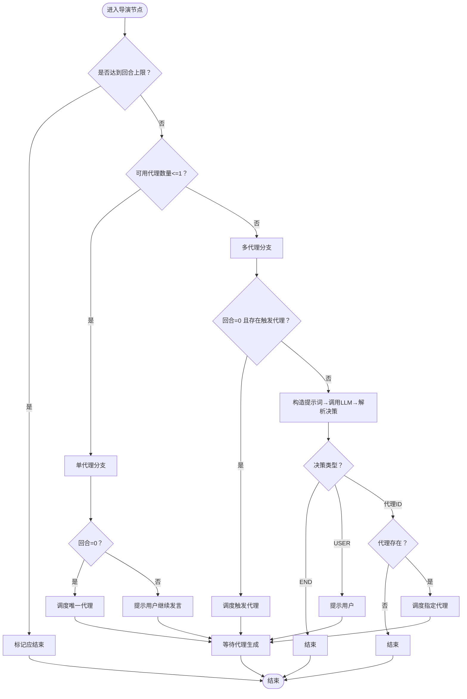
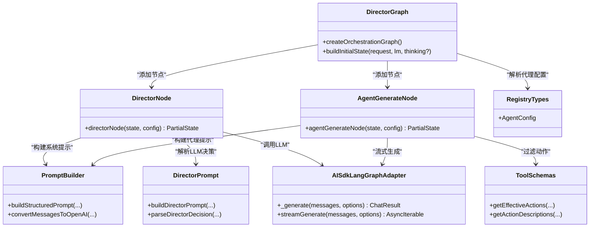
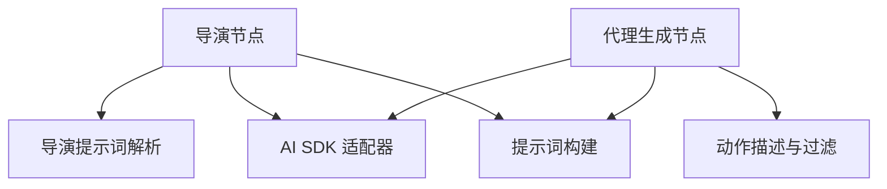

# 导演图设计

<cite>
**本文引用的文件**
- [lib/orchestration/director-graph.ts](file://lib/orchestration/director-graph.ts)
- [lib/orchestration/director-prompt.ts](file://lib/orchestration/director-prompt.ts)
- [lib/orchestration/stateless-generate.ts](file://lib/orchestration/stateless-generate.ts)
- [lib/orchestration/prompt-builder.ts](file://lib/orchestration/prompt-builder.ts)
- [lib/orchestration/tool-schemas.ts](file://lib/orchestration/tool-schemas.ts)
- [lib/orchestration/ai-sdk-adapter.ts](file://lib/orchestration/ai-sdk-adapter.ts)
- [lib/orchestration/registry/types.ts](file://lib/orchestration/registry/types.ts)
- [lib/types/chat.ts](file://lib/types/chat.ts)
</cite>

## 目录
1. [引言](#引言)
2. [项目结构](#项目结构)
3. [核心组件](#核心组件)
4. [架构总览](#架构总览)
5. [详细组件分析](#详细组件分析)
6. [依赖分析](#依赖分析)
7. [性能考虑](#性能考虑)
8. [故障排查指南](#故障排查指南)
9. [结论](#结论)
10. [附录：扩展与定制指南](#附录扩展与定制指南)

## 引言
本文件面向“导演图”（Director Graph）的设计与实现，系统阐述基于 LangGraph 的多智能体编排状态机：从状态注解、节点连接与条件边逻辑，到单智能体与多智能体两种模式下的决策策略差异；并详解导演节点的状态管理、回合数限制、代理可用性列表与讨论上下文的综合决策过程。同时提供扩展指南，帮助开发者在不破坏现有流控的前提下，安全地添加新的决策规则与自定义策略。

## 项目结构
导演图位于 lib/orchestration 目录下，围绕以下关键模块组织：
- 状态机与图构建：director-graph.ts
- 导演提示词与解析：director-prompt.ts
- 无状态生成与事件流：stateless-generate.ts
- 代理系统提示词构建：prompt-builder.ts
- 工具动作描述与过滤：tool-schemas.ts
- AI SDK 适配器：ai-sdk-adapter.ts
- 代理注册表类型：registry/types.ts
- 会话与事件类型：types/chat.ts

图表来源
- [lib/orchestration/director-graph.ts:44-76](file://lib/orchestration/director-graph.ts#L44-L76)
- [lib/orchestration/stateless-generate.ts:317-434](file://lib/orchestration/stateless-generate.ts#L317-L434)
- [lib/orchestration/director-prompt.ts:52-138](file://lib/orchestration/director-prompt.ts#L52-L138)
- [lib/orchestration/prompt-builder.ts:93-253](file://lib/orchestration/prompt-builder.ts#L93-L253)
- [lib/orchestration/tool-schemas.ts:16-68](file://lib/orchestration/tool-schemas.ts#L16-L68)
- [lib/orchestration/ai-sdk-adapter.ts:43-98](file://lib/orchestration/ai-sdk-adapter.ts#L43-L98)
- [lib/orchestration/registry/types.ts:6-24](file://lib/orchestration/registry/types.ts#L6-L24)
- [lib/types/chat.ts:232-282](file://lib/types/chat.ts#L232-L282)

章节来源
- [lib/orchestration/director-graph.ts:1-550](file://lib/orchestration/director-graph.ts#L1-L550)
- [lib/orchestration/stateless-generate.ts:1-435](file://lib/orchestration/stateless-generate.ts#L1-L435)
- [lib/orchestration/director-prompt.ts:1-278](file://lib/orchestration/director-prompt.ts#L1-L278)
- [lib/orchestration/prompt-builder.ts:1-849](file://lib/orchestration/prompt-builder.ts#L1-L849)
- [lib/orchestration/tool-schemas.ts:1-69](file://lib/orchestration/tool-schemas.ts#L1-L69)
- [lib/orchestration/ai-sdk-adapter.ts:1-98](file://lib/orchestration/ai-sdk-adapter.ts#L1-L98)
- [lib/orchestration/registry/types.ts:1-87](file://lib/orchestration/registry/types.ts#L1-L87)
- [lib/types/chat.ts:1-337](file://lib/types/chat.ts#L1-L337)

## 核心组件
- 状态注解（OrchestratorState）
  - 输入态：消息历史、应用状态、可用代理ID、最大回合、语言模型、思考配置、讨论上下文、触发代理、用户画像、请求级代理覆盖
  - 可变态：当前代理、回合计数、代理响应摘要、白板流水、结束标志、总动作数
- 节点
  - 导演节点（directorNode）：依据单/多智能体模式与回合数、触发代理、对话上下文等，决定下一步是结束还是调度代理
  - 代理生成节点（agentGenerateNode）：运行单个代理，按顺序产出事件（开始/文本增量/动作/结束），并更新回合统计
- 条件边
  - 导演节点输出：根据 shouldEnd 决定跳转至 END 或 agent_generate
  - agent_generate 完成后回环至 director

章节来源
- [lib/orchestration/director-graph.ts:49-76](file://lib/orchestration/director-graph.ts#L49-L76)
- [lib/orchestration/director-graph.ts:102-228](file://lib/orchestration/director-graph.ts#L102-L228)
- [lib/orchestration/director-graph.ts:239-472](file://lib/orchestration/director-graph.ts#L239-L472)
- [lib/orchestration/director-graph.ts:230-232](file://lib/orchestration/director-graph.ts#L230-L232)
- [lib/orchestration/director-graph.ts:484-496](file://lib/orchestration/director-graph.ts#L484-L496)

## 架构总览
导演图采用统一拓扑，无论单/多智能体均遵循“START → 导演 → {结束或进入代理生成} → 回环至导演”的循环。

图表来源
- [lib/orchestration/director-graph.ts:484-496](file://lib/orchestration/director-graph.ts#L484-L496)

## 详细组件分析

### 状态注解与初始状态
- 状态注解定义了输入态与可变态，确保服务端无状态：所有状态随请求传递并在每轮结束后由前端聚合
- 初始状态构建时，将请求中的代理配置覆盖合并入状态，并基于上一轮 directorState 计算 maxTurns（允许一次完整 director→agent 循环）

章节来源
- [lib/orchestration/director-graph.ts:49-76](file://lib/orchestration/director-graph.ts#L49-L76)
- [lib/orchestration/director-graph.ts:502-549](file://lib/orchestration/director-graph.ts#L502-L549)

### 导演节点：单/多智能体决策策略
- 单智能体模式（<=1 个可用代理）
  - 首回合直接调度该代理；非首回合则提示用户继续发言，保持会话活跃
- 多智能体模式
  - 首回合且存在触发代理：优先调度触发代理（跳过 LLM 决策）
  - 否则：构造系统提示词，调用 LLM 决策，解析 JSON 输出，支持 END、USER 或具体代理ID
  - 若解析失败或未知代理，安全降级为结束
- 回合限制：当回合数达到 maxTurns 时强制结束

图表来源
- [lib/orchestration/director-graph.ts:114-228](file://lib/orchestration/director-graph.ts#L114-L228)
- [lib/orchestration/director-prompt.ts:254-277](file://lib/orchestration/director-prompt.ts#L254-L277)

章节来源
- [lib/orchestration/director-graph.ts:90-228](file://lib/orchestration/director-graph.ts#L90-L228)
- [lib/orchestration/director-prompt.ts:52-138](file://lib/orchestration/director-prompt.ts#L52-L138)

### 代理生成节点：事件流与动作过滤
- 事件序列：agent_start → text_delta（可多次）→ action（可多次）→ agent_end
- 动作过滤：根据场景类型移除仅滑动页可用的动作（如 spotlight/laser），确保动作合法性
- 白板动作记录：对 wb_ 前缀动作写入白板流水，供导演感知白板状态
- 统计更新：回合数+1、总动作数累加、代理响应摘要追加

章节来源
- [lib/orchestration/director-graph.ts:239-472](file://lib/orchestration/director-graph.ts#L239-L472)
- [lib/orchestration/tool-schemas.ts:16-21](file://lib/orchestration/tool-schemas.ts#L16-L21)

### 提示词与解析：导演与代理
- 导演提示词
  - 汇总可用代理、已说话代理、对话摘要、讨论上下文、白板状态、学生画像
  - 规则强调角色多样性、内容去重、讨论推进、问候规则等
  - 输出格式限定为 JSON 对象，包含 next_agent 字段
  - 解析器具备容错：从任意位置提取 JSON 片段，无法解析时默认结束
- 代理提示词
  - 基于角色指南、场景状态、虚拟白板上下文、同伴发言摘要、语言约束等
  - 输出格式为 JSON 数组，元素为 text 或 action，严格约束顺序与长度

章节来源
- [lib/orchestration/director-prompt.ts:52-138](file://lib/orchestration/director-prompt.ts#L52-L138)
- [lib/orchestration/director-prompt.ts:254-277](file://lib/orchestration/director-prompt.ts#L254-L277)
- [lib/orchestration/prompt-builder.ts:93-253](file://lib/orchestration/prompt-builder.ts#L93-L253)

### 无状态生成与事件流
- 通过 LangGraph 的自定义流模式，将每个节点产生的 StatelessEvent 事件实时推送
- stateless-generate 负责：
  - 创建图与初始状态
  - 流式消费事件，累计动作数、代理数、是否产生内容
  - 在每轮结束后生成 directorState 并通过 done 事件返回给前端

章节来源
- [lib/orchestration/stateless-generate.ts:317-434](file://lib/orchestration/stateless-generate.ts#L317-L434)

### 类关系与依赖（代码级）

图表来源
- [lib/orchestration/director-graph.ts:484-496](file://lib/orchestration/director-graph.ts#L484-L496)
- [lib/orchestration/director-graph.ts:102-228](file://lib/orchestration/director-graph.ts#L102-L228)
- [lib/orchestration/director-graph.ts:239-472](file://lib/orchestration/director-graph.ts#L239-L472)
- [lib/orchestration/ai-sdk-adapter.ts:43-98](file://lib/orchestration/ai-sdk-adapter.ts#L43-L98)
- [lib/orchestration/prompt-builder.ts:93-253](file://lib/orchestration/prompt-builder.ts#L93-L253)
- [lib/orchestration/director-prompt.ts:52-138](file://lib/orchestration/director-prompt.ts#L52-L138)
- [lib/orchestration/tool-schemas.ts:16-68](file://lib/orchestration/tool-schemas.ts#L16-L68)
- [lib/orchestration/registry/types.ts:6-24](file://lib/orchestration/registry/types.ts#L6-L24)

## 依赖分析
- 导演节点依赖
  - 提示词构建：将消息转换为 OpenAI 格式、汇总对话、拼装导演提示词
  - LLM 适配：通过 AISdkLangGraphAdapter 执行生成与流式生成
  - 决策解析：从 LLM 输出中提取 JSON 并判定下一步
- 代理生成节点依赖
  - 动作过滤：依据场景类型剔除滑动页专属动作
  - 事件流：将文本增量与动作事件逐条推送给前端
  - 白板流水：记录 wb_ 动作，供后续导演决策使用

图表来源
- [lib/orchestration/director-graph.ts:166-187](file://lib/orchestration/director-graph.ts#L166-L187)
- [lib/orchestration/director-graph.ts:284-300](file://lib/orchestration/director-graph.ts#L284-L300)
- [lib/orchestration/ai-sdk-adapter.ts:80-98](file://lib/orchestration/ai-sdk-adapter.ts#L80-L98)
- [lib/orchestration/tool-schemas.ts:16-21](file://lib/orchestration/tool-schemas.ts#L16-L21)

章节来源
- [lib/orchestration/director-graph.ts:166-187](file://lib/orchestration/director-graph.ts#L166-L187)
- [lib/orchestration/director-graph.ts:284-300](file://lib/orchestration/director-graph.ts#L284-L300)
- [lib/orchestration/ai-sdk-adapter.ts:43-98](file://lib/orchestration/ai-sdk-adapter.ts#L43-L98)
- [lib/orchestration/tool-schemas.ts:16-68](file://lib/orchestration/tool-schemas.ts#L16-L68)

## 性能考虑
- 单轮一次性生成：避免多次往返，降低延迟
- 流式输出：文本增量与动作事件实时推送，提升交互体验
- 动作过滤前置：在进入 LLM 之前剔除无效动作，减少无效输出
- 白板状态轻量汇总：仅记录 wb_ 动作，避免冗余计算
- 回合限制：防止无限循环，保障资源可控

## 故障排查指南
- LLM 决策解析失败
  - 现象：导演节点解析 JSON 失败或输出异常
  - 处理：解析器会回退为结束；检查提示词格式与 LLM 输出稳定性
- 未知代理ID
  - 现象：LLM 返回代理ID不在可用列表
  - 处理：导演节点安全结束；确认代理注册与请求覆盖配置一致
- 代理无内容
  - 现象：代理生成节点返回空文本与零动作
  - 处理：记录告警并继续流程；检查代理提示词与动作过滤逻辑
- 中断与取消
  - 现象：前端中断导致流中断
  - 处理：stateless-generate 捕获 AbortError 并上报错误事件

章节来源
- [lib/orchestration/director-prompt.ts:254-277](file://lib/orchestration/director-prompt.ts#L254-L277)
- [lib/orchestration/director-graph.ts:208-212](file://lib/orchestration/director-graph.ts#L208-L212)
- [lib/orchestration/director-graph.ts:451-455](file://lib/orchestration/director-graph.ts#L451-L455)
- [lib/orchestration/stateless-generate.ts:421-433](file://lib/orchestration/stateless-generate.ts#L421-L433)

## 结论
导演图通过统一的状态机拓扑与清晰的节点职责划分，在单/多智能体场景下实现了高效、可扩展的编排：单智能体模式以纯逻辑快速推进，多智能体模式结合 LLM 决策与代码快路径，兼顾灵活性与确定性。配合严格的提示词与解析、动作过滤与事件流，系统在保证教学场景质量的同时，提供了良好的可维护性与扩展性。

## 附录：扩展与定制指南

### 新增导演决策规则
- 在导演提示词中增加规则与输出格式约束，确保 LLM 输出仍满足 JSON 结构
- 在解析器中补充容错策略，避免因 LLM 输出偏差导致流程中断
- 在导演节点中新增条件分支前，先评估对“回合限制”“触发代理”等既有分支的影响

章节来源
- [lib/orchestration/director-prompt.ts:114-138](file://lib/orchestration/director-prompt.ts#L114-L138)
- [lib/orchestration/director-prompt.ts:254-277](file://lib/orchestration/director-prompt.ts#L254-L277)
- [lib/orchestration/director-graph.ts:114-228](file://lib/orchestration/director-graph.ts#L114-L228)

### 自定义代理策略
- 代理提示词：在 prompt-builder 中调整角色指南、长度与风格、白板布局与互斥规则
- 动作集合：通过 tool-schemas 控制不同场景下的有效动作集
- 代理注册：在 registry/types 中扩展 AgentConfig 字段，或在请求中使用 agentConfigOverrides 注入临时配置

章节来源
- [lib/orchestration/prompt-builder.ts:93-253](file://lib/orchestration/prompt-builder.ts#L93-L253)
- [lib/orchestration/tool-schemas.ts:16-68](file://lib/orchestration/tool-schemas.ts#L16-L68)
- [lib/orchestration/registry/types.ts:6-24](file://lib/orchestration/registry/types.ts#L6-L24)
- [lib/orchestration/director-graph.ts:507-519](file://lib/orchestration/director-graph.ts#L507-L519)

### 事件流与前端集成
- 使用 stateless-generate 的 done 事件携带 directorState，前端据此更新 UI 与下一轮初始状态
- 注意区分“文本增量”“动作”“代理开始/结束”等事件类型，确保渲染与交互一致性

章节来源
- [lib/orchestration/stateless-generate.ts:353-434](file://lib/orchestration/stateless-generate.ts#L353-L434)
- [lib/types/chat.ts:97-116](file://lib/types/chat.ts#L97-L116)