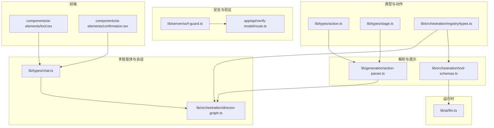
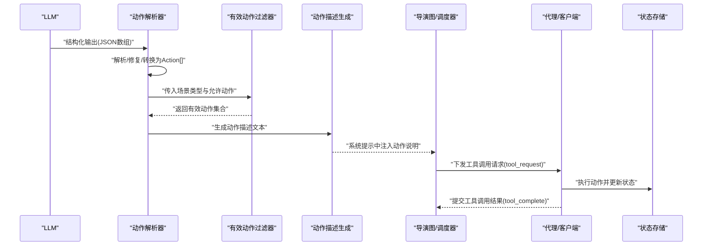
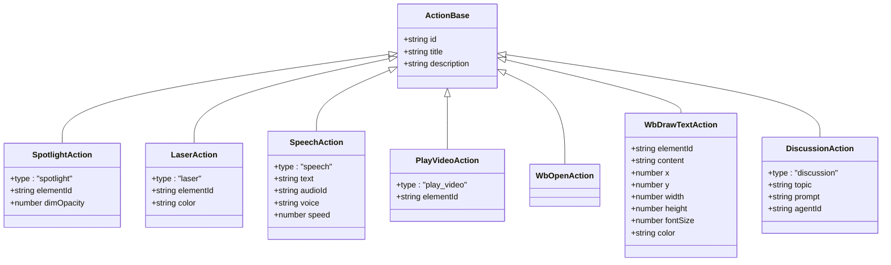
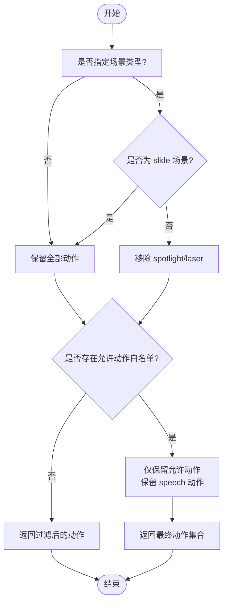
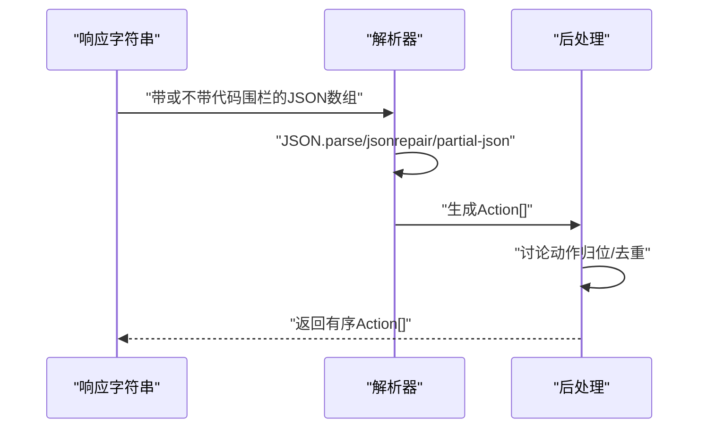
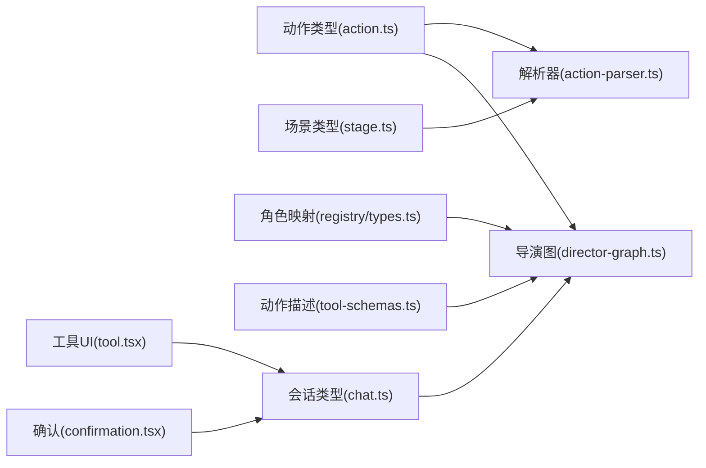

# 工具调用模式

<cite>
**本文引用的文件**
- [lib/types/action.ts](file://lib/types/action.ts)
- [lib/generation/action-parser.ts](file://lib/generation/action-parser.ts)
- [lib/orchestration/tool-schemas.ts](file://lib/orchestration/tool-schemas.ts)
- [lib/types/stage.ts](file://lib/types/stage.ts)
- [lib/orchestration/registry/types.ts](file://lib/orchestration/registry/types.ts)
- [lib/types/chat.ts](file://lib/types/chat.ts)
- [lib/server/ssrf-guard.ts](file://lib/server/ssrf-guard.ts)
- [app/api/verify-model/route.ts](file://app/api/verify-model/route.ts)
- [lib/ai/llm.ts](file://lib/ai/llm.ts)
- [components/ai-elements/tool.tsx](file://components/ai-elements/tool.tsx)
- [components/ai-elements/confirmation.tsx](file://components/ai-elements/confirmation.tsx)
- [lib/orchestration/director-graph.ts](file://lib/orchestration/director-graph.ts)
</cite>

## 目录
1. [引言](#引言)
2. [项目结构](#项目结构)
3. [核心组件](#核心组件)
4. [架构总览](#架构总览)
5. [组件详解](#组件详解)
6. [依赖关系分析](#依赖关系分析)
7. [性能考量](#性能考量)
8. [故障排查指南](#故障排查指南)
9. [结论](#结论)
10. [附录：扩展指南](#附录扩展指南)

## 引言
本技术文档围绕“工具调用模式系统”进行系统化梳理，重点阐述以下方面：
- 工具（动作）的定义与分类：动作类型、同步/异步语义、场景适配规则
- 有效动作过滤器的工作原理：基于场景类型与角色白名单的动态裁剪
- 安全检查机制：URL 防 SSRF 校验、模型连通性验证、动作权限与参数类型校验
- 扩展指南：新增动作类型、参数模式与验证规则的定制
- 错误处理策略与调试方法：重试、降级与可观测性

## 项目结构
与工具调用模式相关的核心模块分布于如下路径：
- 类型与动作定义：lib/types/action.ts
- 动作解析与后处理：lib/generation/action-parser.ts
- 提示词与动作描述：lib/orchestration/tool-schemas.ts
- 场景与模式类型：lib/types/stage.ts
- 角色到动作映射：lib/orchestration/registry/types.ts
- 多智能体会话与工具调用记录：lib/types/chat.ts
- 安全防护：lib/server/ssrf-guard.ts、app/api/verify-model/route.ts
- LLM 调用与重试：lib/ai/llm.ts
- 前端工具 UI 与确认流程：components/ai-elements/tool.tsx、components/ai-elements/confirmation.tsx
- 导演图中动作有效性校验：lib/orchestration/director-graph.ts

图表来源
- [lib/types/action.ts:1-221](file://lib/types/action.ts#L1-L221)
- [lib/generation/action-parser.ts:1-155](file://lib/generation/action-parser.ts#L1-L155)
- [lib/orchestration/tool-schemas.ts:1-69](file://lib/orchestration/tool-schemas.ts#L1-L69)
- [lib/types/stage.ts:1-124](file://lib/types/stage.ts#L1-L124)
- [lib/orchestration/registry/types.ts:54-86](file://lib/orchestration/registry/types.ts#L54-L86)
- [lib/types/chat.ts:67-92](file://lib/types/chat.ts#L67-L92)
- [lib/server/ssrf-guard.ts:1-49](file://lib/server/ssrf-guard.ts#L1-L49)
- [app/api/verify-model/route.ts:1-46](file://app/api/verify-model/route.ts#L1-L46)
- [components/ai-elements/tool.tsx:1-75](file://components/ai-elements/tool.tsx#L1-L75)
- [components/ai-elements/confirmation.tsx:64-147](file://components/ai-elements/confirmation.tsx#L64-L147)
- [lib/orchestration/director-graph.ts:350-381](file://lib/orchestration/director-graph.ts#L350-L381)

章节来源
- [lib/types/action.ts:1-221](file://lib/types/action.ts#L1-L221)
- [lib/generation/action-parser.ts:1-155](file://lib/generation/action-parser.ts#L1-L155)
- [lib/orchestration/tool-schemas.ts:1-69](file://lib/orchestration/tool-schemas.ts#L1-L69)
- [lib/types/stage.ts:1-124](file://lib/types/stage.ts#L1-L124)
- [lib/orchestration/registry/types.ts:54-86](file://lib/orchestration/registry/types.ts#L54-L86)
- [lib/types/chat.ts:67-92](file://lib/types/chat.ts#L67-L92)
- [lib/server/ssrf-guard.ts:1-49](file://lib/server/ssrf-guard.ts#L1-L49)
- [app/api/verify-model/route.ts:1-46](file://app/api/verify-model/route.ts#L1-L46)
- [components/ai-elements/tool.tsx:1-75](file://components/ai-elements/tool.tsx#L1-L75)
- [components/ai-elements/confirmation.tsx:64-147](file://components/ai-elements/confirmation.tsx#L64-L147)
- [lib/orchestration/director-graph.ts:350-381](file://lib/orchestration/director-graph.ts#L350-L381)

## 核心组件
- 动作类型与语义
  - 同步动作：speech、play_video、wb_open/wb_draw_*、wb_clear/delete/close、discussion 等，需等待完成后再继续后续动作
  - 异步动作：spotlight、laser，即时生效，不阻塞后续动作
  - 幻灯片专用动作：spotlight、laser 仅在 slide 场景有效
- 有效动作过滤器
  - 基于场景类型过滤：非 slide 场景移除 spotlight/laser
  - 基于角色白名单过滤：按 agent.allowedActions 进行二次裁剪
- 解析与后处理
  - 支持新旧两种结构化输出格式，自动识别并转换为统一 Action 数组
  - 保持原始交错顺序；讨论动作最多一个且必须位于末尾
- 提示词与动作描述
  - 生成系统提示中的动作描述文本，供模型选择合适动作
  - 提供 getEffectiveActions 以按场景类型筛选可选动作集合

章节来源
- [lib/types/action.ts:184-205](file://lib/types/action.ts#L184-L205)
- [lib/generation/action-parser.ts:28-154](file://lib/generation/action-parser.ts#L28-L154)
- [lib/orchestration/tool-schemas.ts:16-21](file://lib/orchestration/tool-schemas.ts#L16-L21)
- [lib/orchestration/tool-schemas.ts:29-68](file://lib/orchestration/tool-schemas.ts#L29-L68)

## 架构总览
工具调用模式贯穿“类型定义 → 解析与过滤 → 提示词 → 多智能体调度 → 执行与记录”的链路。

图表来源
- [lib/generation/action-parser.ts:42-154](file://lib/generation/action-parser.ts#L42-L154)
- [lib/orchestration/tool-schemas.ts:16-21](file://lib/orchestration/tool-schemas.ts#L16-L21)
- [lib/orchestration/tool-schemas.ts:29-68](file://lib/orchestration/tool-schemas.ts#L29-L68)
- [lib/types/chat.ts:69-92](file://lib/types/chat.ts#L69-L92)
- [lib/orchestration/director-graph.ts:350-381](file://lib/orchestration/director-graph.ts#L350-L381)

## 组件详解

### 动作类型与分类
- 同步/异步语义
  - 异步：spotlight、laser
  - 同步：speech、play_video、wb_*、discussion
- 场景适配
  - 幻灯片专用：spotlight、laser 仅在 scene.type='slide' 生效
- 参数约束
  - 白板绘制类动作包含位置、尺寸、颜色等参数
  - 讨论动作包含主题与可选提示
  - 播放视频动作要求元素存在

图表来源
- [lib/types/action.ts:22-161](file://lib/types/action.ts#L22-L161)

章节来源
- [lib/types/action.ts:184-205](file://lib/types/action.ts#L184-L205)
- [lib/types/action.ts:22-161](file://lib/types/action.ts#L22-L161)

### 有效动作过滤器
- 场景类型过滤：当 sceneType 存在且不为 'slide' 时，移除 spotlight、laser
- 角色白名单过滤：仅保留 allowedActions 中的动作，且保留 speech 动作作为兜底
- 二次防御：即使模型“幻觉”生成了不允许的动作，也会被过滤掉

图表来源
- [lib/generation/action-parser.ts:129-151](file://lib/generation/action-parser.ts#L129-L151)
- [lib/orchestration/tool-schemas.ts:16-21](file://lib/orchestration/tool-schemas.ts#L16-L21)

章节来源
- [lib/generation/action-parser.ts:129-151](file://lib/generation/action-parser.ts#L129-L151)
- [lib/orchestration/tool-schemas.ts:16-21](file://lib/orchestration/tool-schemas.ts#L16-L21)

### 动作解析与后处理
- 支持新旧两种结构化输出格式，自动识别并转换为统一 Action 数组
- 自动修复 JSON（jsonrepair）与部分 JSON（partial-json）
- 讨论动作最多一个，且必须位于末尾
- 严格按原交错顺序输出，保证时序一致性

图表来源
- [lib/generation/action-parser.ts:42-154](file://lib/generation/action-parser.ts#L42-L154)

章节来源
- [lib/generation/action-parser.ts:28-154](file://lib/generation/action-parser.ts#L28-L154)

### 提示词与动作描述
- 生成系统提示中的动作描述文本，帮助模型理解可用动作及其参数
- 提供 getEffectiveActions 用于在提示中仅列出当前场景可使用的动作

章节来源
- [lib/orchestration/tool-schemas.ts:29-68](file://lib/orchestration/tool-schemas.ts#L29-L68)
- [lib/orchestration/tool-schemas.ts:16-21](file://lib/orchestration/tool-schemas.ts#L16-L21)

### 角色到动作映射与场景适配
- 角色到动作集合：教师拥有幻灯片与白板双重控制；助教/学生仅白板
- 导演图中对动作进行二次校验，确保动作在当前场景与角色下合法

章节来源
- [lib/orchestration/registry/types.ts:54-86](file://lib/orchestration/registry/types.ts#L54-L86)
- [lib/orchestration/director-graph.ts:350-381](file://lib/orchestration/director-graph.ts#L350-L381)

### 多智能体会话与工具调用记录
- 工具调用请求与记录：pending/executing/completed/failed 状态机
- SSE 事件：tool_request/tool_complete 等，驱动前端 UI 与状态流转

章节来源
- [lib/types/chat.ts:67-92](file://lib/types/chat.ts#L67-L92)
- [lib/types/chat.ts:299-337](file://lib/types/chat.ts#L299-L337)

### 前端工具 UI 与用户确认
- 工具 UI 状态徽标：input-streaming/input-available/approval-requested/output-available/output-error/output-denied
- 用户确认：approval-requested/ responded/denied 的分支渲染

章节来源
- [components/ai-elements/tool.tsx:32-58](file://components/ai-elements/tool.tsx#L32-L58)
- [components/ai-elements/confirmation.tsx:64-147](file://components/ai-elements/confirmation.tsx#L64-L147)

## 依赖关系分析
- 动作类型定义被解析器与导演图共同依赖
- 有效动作过滤器同时被解析器与提示词生成使用
- 角色映射为导演图提供动作合法性判断依据
- 多智能体会话类型贯穿工具调用请求/记录与前端 UI

图表来源
- [lib/types/action.ts:184-205](file://lib/types/action.ts#L184-L205)
- [lib/generation/action-parser.ts:129-151](file://lib/generation/action-parser.ts#L129-L151)
- [lib/orchestration/tool-schemas.ts:16-21](file://lib/orchestration/tool-schemas.ts#L16-L21)
- [lib/types/stage.ts:6-7](file://lib/types/stage.ts#L6-L7)
- [lib/orchestration/registry/types.ts:74-86](file://lib/orchestration/registry/types.ts#L74-L86)
- [lib/types/chat.ts:67-92](file://lib/types/chat.ts#L67-L92)
- [components/ai-elements/tool.tsx:32-58](file://components/ai-elements/tool.tsx#L32-L58)
- [components/ai-elements/confirmation.tsx:64-147](file://components/ai-elements/confirmation.tsx#L64-L147)

章节来源
- [lib/types/action.ts:184-205](file://lib/types/action.ts#L184-L205)
- [lib/generation/action-parser.ts:129-151](file://lib/generation/action-parser.ts#L129-L151)
- [lib/orchestration/tool-schemas.ts:16-21](file://lib/orchestration/tool-schemas.ts#L16-L21)
- [lib/types/stage.ts:6-7](file://lib/types/stage.ts#L6-L7)
- [lib/orchestration/registry/types.ts:74-86](file://lib/orchestration/registry/types.ts#L74-L86)
- [lib/types/chat.ts:67-92](file://lib/types/chat.ts#L67-L92)
- [components/ai-elements/tool.tsx:32-58](file://components/ai-elements/tool.tsx#L32-L58)
- [components/ai-elements/confirmation.tsx:64-147](file://components/ai-elements/confirmation.tsx#L64-L147)

## 性能考量
- 解析鲁棒性：优先使用 JSON.parse，其次 jsonrepair，最后 partial-json，避免因格式问题导致失败重试
- 过滤成本低：基于常量集合与线性过滤，复杂度 O(n)，在动作数量有限场景开销可忽略
- 提示词生成：按需生成动作描述，避免冗余文本
- LLM 调用重试：支持基于结果校验的重试策略，减少无效输出带来的下游开销

章节来源
- [lib/generation/action-parser.ts:61-81](file://lib/generation/action-parser.ts#L61-L81)
- [lib/ai/llm.ts:285-335](file://lib/ai/llm.ts#L285-L335)

## 故障排查指南
- 动作被过滤
  - 检查场景类型是否为 'slide'，否则 spotlight/laser 将被移除
  - 检查 agent.allowedActions 是否包含该动作
- 结构化输出解析失败
  - 查看日志中 JSON 解析/修复/部分解析的警告信息
  - 确认输出格式符合预期（新/旧两种格式之一）
- 工具调用状态异常
  - 关注 tool_request/tool_complete 事件，核对 pending/executing/completed/failed 状态
  - 若出现 denied/error，检查前端确认流程与后端权限
- SSRF 与模型连通性
  - 使用 verify-model 接口验证模型连通性
  - 对外部 URL 进行 SSRF 校验，拒绝本地/私有网络地址

章节来源
- [lib/generation/action-parser.ts:129-151](file://lib/generation/action-parser.ts#L129-L151)
- [lib/types/chat.ts:69-92](file://lib/types/chat.ts#L69-L92)
- [app/api/verify-model/route.ts:8-46](file://app/api/verify-model/route.ts#L8-L46)
- [lib/server/ssrf-guard.ts:19-49](file://lib/server/ssrf-guard.ts#L19-L49)

## 结论
工具调用模式系统通过“类型统一 + 解析健壮 + 场景与角色双层过滤 + 可观测的状态机”，实现了从 LLM 到执行端的稳定闭环。其设计兼顾安全性（SSRF、权限）、可扩展性（动作描述、角色映射）与可维护性（清晰的过滤与解析流程）。建议在扩展新动作时遵循现有模式，确保类型定义、描述文本、过滤逻辑与 UI 状态一致。

## 附录：扩展指南
- 新增动作类型
  - 在动作类型定义中增加接口与联合类型，并标注同步/异步与场景适配
  - 在动作描述生成中补充对应描述文本
  - 如为幻灯片专用动作，确保在过滤器中被正确移除
- 新增参数模式
  - 在类型定义中明确参数字段与默认值
  - 在解析器中保持向后兼容（如支持新旧字段名）
- 自定义验证规则
  - 在导演图或解析后处理中增加参数校验与边界检查
  - 对外部资源（如 URL）进行 SSRF 校验
- 降级与回退
  - 当动作不可用时，保留 speech 动作作为兜底
  - 对解析失败采用 jsonrepair/partial-json 降级策略
  - 对 LLM 输出失败启用重试与验证

章节来源
- [lib/types/action.ts:165-205](file://lib/types/action.ts#L165-L205)
- [lib/orchestration/tool-schemas.ts:29-68](file://lib/orchestration/tool-schemas.ts#L29-L68)
- [lib/generation/action-parser.ts:104-121](file://lib/generation/action-parser.ts#L104-L121)
- [lib/server/ssrf-guard.ts:19-49](file://lib/server/ssrf-guard.ts#L19-L49)
- [lib/ai/llm.ts:285-335](file://lib/ai/llm.ts#L285-L335)