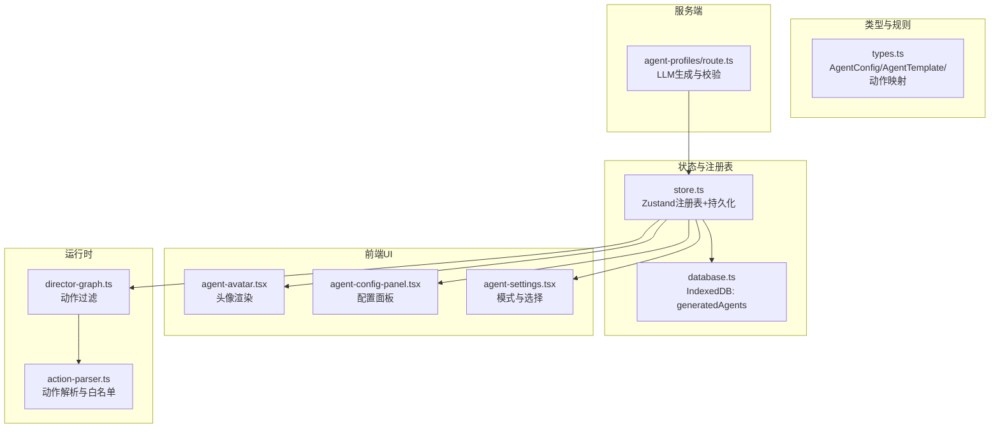
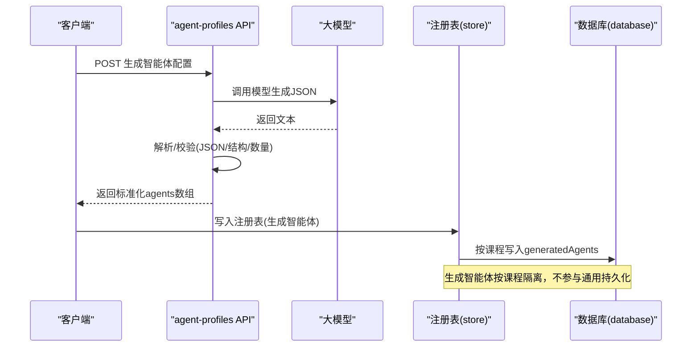
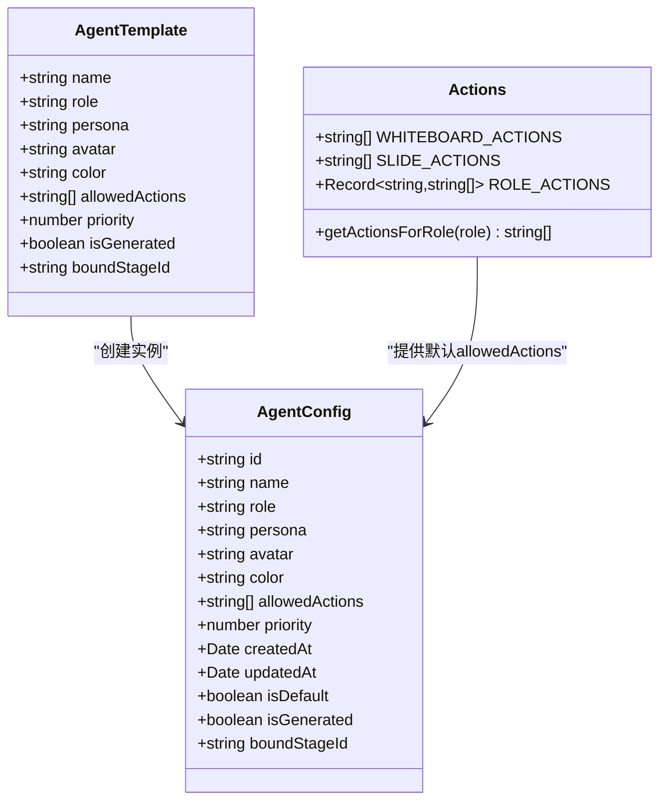
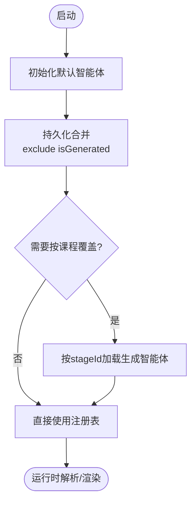
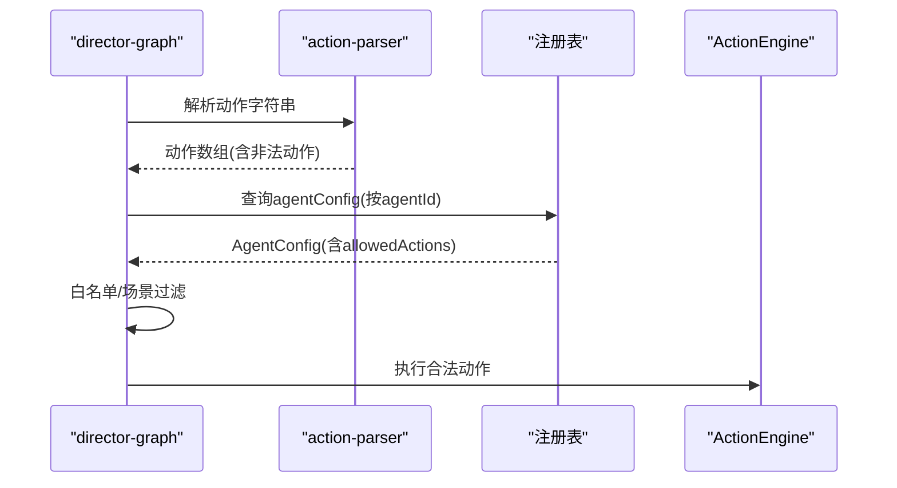
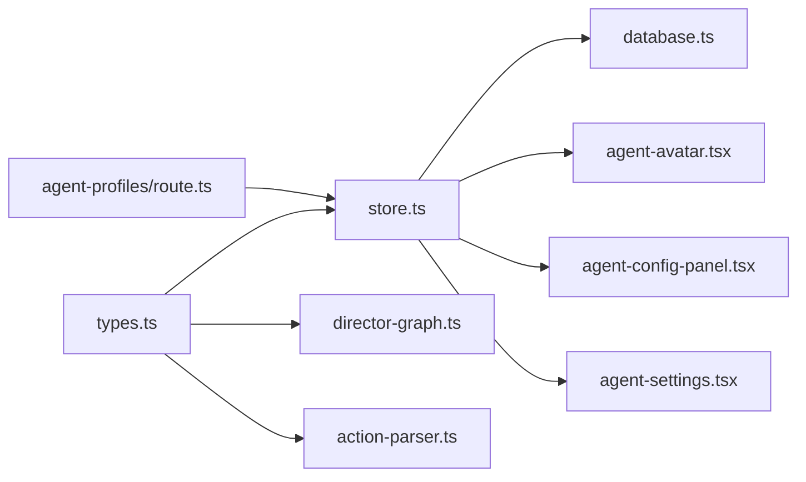

# 智能体配置管理

<cite>
**本文档引用的文件**
- [lib/orchestration/registry/types.ts](file://lib/orchestration/registry/types.ts)
- [lib/orchestration/registry/store.ts](file://lib/orchestration/registry/store.ts)
- [app/api/generate/agent-profiles/route.ts](file://app/api/generate/agent-profiles/route.ts)
- [lib/utils/database.ts](file://lib/utils/database.ts)
- [components/agent/agent-avatar.tsx](file://components/agent/agent-avatar.tsx)
- [components/agent/agent-config-panel.tsx](file://components/agent/agent-config-panel.tsx)
- [components/settings/agent-settings.tsx](file://components/settings/agent-settings.tsx)
- [lib/orchestration/director-graph.ts](file://lib/orchestration/director-graph.ts)
- [lib/generation/action-parser.ts](file://lib/generation/action-parser.ts)
</cite>

## 目录
1. [简介](#简介)
2. [项目结构](#项目结构)
3. [核心组件](#核心组件)
4. [架构总览](#架构总览)
5. [详细组件分析](#详细组件分析)
6. [依赖关系分析](#依赖关系分析)
7. [性能考量](#性能考量)
8. [故障排查指南](#故障排查指南)
9. [结论](#结论)
10. [附录](#附录)

## 简介
本文件为“智能体配置管理系统”的技术文档，聚焦于多智能体课堂仿真中的智能体配置数据结构、注册表工作机制、运行时解析流程、扩展指南与最佳实践。系统支持默认模板智能体与由大模型生成的动态智能体两类来源，并通过本地持久化与按需加载实现全局注册表与请求作用域覆盖配置的协同。

## 项目结构
围绕智能体配置管理的关键模块分布如下：
- 类型定义：统一的智能体配置接口与角色动作映射
- 注册表存储：Zustand 状态管理 + 持久化，含默认智能体与自定义智能体合并策略
- 生成 API：基于 LLM 的智能体画像生成与校验
- 数据库：IndexedDB 存储生成的智能体记录
- UI 组件：智能体头像展示、配置面板、设置界面
- 运行时解析：动作解析与白板/课件场景隔离

图表来源
- [lib/orchestration/registry/types.ts:6-52](file://lib/orchestration/registry/types.ts#L6-L52)
- [lib/orchestration/registry/store.ts:14-246](file://lib/orchestration/registry/store.ts#L14-L246)
- [lib/utils/database.ts:155-167](file://lib/utils/database.ts#L155-L167)
- [app/api/generate/agent-profiles/route.ts:50-183](file://app/api/generate/agent-profiles/route.ts#L50-L183)
- [components/agent/agent-avatar.tsx:20-48](file://components/agent/agent-avatar.tsx#L20-L48)
- [components/agent/agent-config-panel.tsx:17-153](file://components/agent/agent-config-panel.tsx#L17-L153)
- [components/settings/agent-settings.tsx:30-199](file://components/settings/agent-settings.tsx#L30-L199)
- [lib/orchestration/director-graph.ts:350-381](file://lib/orchestration/director-graph.ts#L350-L381)
- [lib/generation/action-parser.ts:59-154](file://lib/generation/action-parser.ts#L59-L154)

章节来源
- [lib/orchestration/registry/types.ts:1-87](file://lib/orchestration/registry/types.ts#L1-L87)
- [lib/orchestration/registry/store.ts:1-398](file://lib/orchestration/registry/store.ts#L1-L398)
- [app/api/generate/agent-profiles/route.ts:1-183](file://app/api/generate/agent-profiles/route.ts#L1-L183)
- [lib/utils/database.ts:1-446](file://lib/utils/database.ts#L1-L446)
- [components/agent/agent-avatar.tsx:1-48](file://components/agent/agent-avatar.tsx#L1-L48)
- [components/agent/agent-config-panel.tsx:1-153](file://components/agent/agent-config-panel.tsx#L1-L153)
- [components/settings/agent-settings.tsx:1-199](file://components/settings/agent-settings.tsx#L1-L199)
- [lib/orchestration/director-graph.ts:350-381](file://lib/orchestration/director-graph.ts#L350-L381)
- [lib/generation/action-parser.ts:59-154](file://lib/generation/action-parser.ts#L59-L154)

## 核心组件
- 智能体配置数据结构（AgentConfig）
  - 关键字段：id、name、role、persona、avatar、color、allowedActions、priority、时间戳与标记位等
  - 用途：统一描述智能体身份、外观、行为权限与排序权重
- 角色动作映射（ROLE_ACTIONS）
  - 教师：可控制课件与白板；助教/学生：仅白板
  - 提供 getActionsForRole 用于默认动作集推导
- 注册表（AgentRegistry）
  - 默认智能体：代码内预置，始终可用
  - 自定义智能体：用户编辑或导入，持久化到本地缓存
  - 合并策略：启动时将默认智能体与持久化自定义智能体合并，排除已生成的智能体（避免重复持久化）
- 生成 API（agent-profiles）
  - 输入：课程信息、场景大纲、语言、可用头像列表
  - 输出：标准化 JSON，包含多个智能体的 name、role、persona、avatar、color、priority
  - 校验：数量、教师唯一性、结构完整性
- 数据库（generatedAgents）
  - 存储每门课程生成的智能体，按 stageId 分组，支持按需加载与清理
- UI 组件
  - 头像组件：根据 avatar/color/name 渲染，支持 URL/Emoji
  - 配置面板：列出所有智能体，支持删除与概览
  - 设置界面：多智能体协作模式、最大轮次等

章节来源
- [lib/orchestration/registry/types.ts:6-52](file://lib/orchestration/registry/types.ts#L6-L52)
- [lib/orchestration/registry/store.ts:42-187](file://lib/orchestration/registry/store.ts#L42-L187)
- [app/api/generate/agent-profiles/route.ts:50-183](file://app/api/generate/agent-profiles/route.ts#L50-L183)
- [lib/utils/database.ts:155-167](file://lib/utils/database.ts#L155-L167)
- [components/agent/agent-avatar.tsx:8-48](file://components/agent/agent-avatar.tsx#L8-L48)
- [components/agent/agent-config-panel.tsx:17-153](file://components/agent/agent-config-panel.tsx#L17-L153)
- [components/settings/agent-settings.tsx:20-199](file://components/settings/agent-settings.tsx#L20-L199)

## 架构总览
系统采用“类型定义—注册表—持久化—UI—运行时解析”的分层设计：
- 类型层：统一数据结构与动作映射
- 注册表层：Zustand 管理内存状态，持久化中间件负责合并默认与自定义智能体
- 生成层：服务端 API 调用大模型生成智能体，返回结构化 JSON 并进行严格校验
- 存储层：IndexedDB 保存生成的智能体，按课程维度隔离
- UI 层：展示智能体头像、配置与设置
- 运行时层：解析动作、按场景与角色进行白名单过滤

图表来源
- [app/api/generate/agent-profiles/route.ts:50-183](file://app/api/generate/agent-profiles/route.ts#L50-L183)
- [lib/orchestration/registry/store.ts:356-397](file://lib/orchestration/registry/store.ts#L356-L397)
- [lib/utils/database.ts:423-427](file://lib/utils/database.ts#L423-L427)

## 详细组件分析

### 数据结构定义与角色动作映射
- AgentConfig 字段职责
  - id：唯一标识，用于注册表索引与运行时解析
  - name/role/persona：智能体身份与行为描述
  - avatar/color：头像与主题色，用于 UI 呈现
  - allowedActions：动作白名单，受角色与场景限制
  - priority：导演选择优先级（1-10），用于排序
  - 时间戳与标记位：isDefault/isGenerated/boundStageId 等
- 动作映射与默认值
  - 白板动作集合：wb_open/wb_close/... 等
  - 课件动作集合：spotlight/laser/play_video
  - 角色到动作映射：teacher 含课件+白板；assistant/student 仅白板
  - getActionsForRole：未知角色回退为白板动作

图表来源
- [lib/orchestration/registry/types.ts:6-52](file://lib/orchestration/registry/types.ts#L6-L52)
- [lib/orchestration/registry/types.ts:54-86](file://lib/orchestration/registry/types.ts#L54-L86)

章节来源
- [lib/orchestration/registry/types.ts:6-52](file://lib/orchestration/registry/types.ts#L6-L52)
- [lib/orchestration/registry/types.ts:54-86](file://lib/orchestration/registry/types.ts#L54-L86)

### 注册表工作机制：全局注册表与请求作用域覆盖
- 全局注册表（Zustand）
  - 初始化：包含默认智能体字典
  - 持久化：使用 persist 中间件，版本号迁移策略
  - 合并策略：merge 将默认智能体与持久化的自定义智能体合并，排除 isGenerated 的智能体（避免重复持久化）
- 请求作用域覆盖（按课程）
  - 加载：loadGeneratedAgentsForStage 按 stageId 从 IndexedDB 读取生成智能体，先清空之前加载的生成智能体，再注入新集合
  - 使用：运行时解析与导演图中，使用当前注册表内的智能体配置
  - 保存：saveGeneratedAgents 清理旧记录，批量写入新记录并同步到注册表

图表来源
- [lib/orchestration/registry/store.ts:189-246](file://lib/orchestration/registry/store.ts#L189-L246)
- [lib/orchestration/registry/store.ts:318-350](file://lib/orchestration/registry/store.ts#L318-L350)
- [lib/orchestration/registry/store.ts:356-397](file://lib/orchestration/registry/store.ts#L356-L397)

章节来源
- [lib/orchestration/registry/store.ts:189-246](file://lib/orchestration/registry/store.ts#L189-L246)
- [lib/orchestration/registry/store.ts:318-350](file://lib/orchestration/registry/store.ts#L318-L350)
- [lib/orchestration/registry/store.ts:356-397](file://lib/orchestration/registry/store.ts#L356-L397)

### 代理配置解析流程：运行时按 ID 解析有效配置
- 解析步骤
  - 从注册表按 id 获取 AgentConfig
  - 若存在则进入后续流程（排序、渲染、动作执行）
  - 若不存在，触发错误处理（如提示用户选择有效智能体）
- 动作解析与过滤
  - 动作解析：从 LLM 输出中提取动作数组，容错修复与部分解析
  - 白名单过滤：按 allowedActions 过滤非法动作；对非课件场景剔除仅课件动作
  - 导演图过滤：若动作不在允许集合，记录警告并跳过

图表来源
- [lib/orchestration/director-graph.ts:350-381](file://lib/orchestration/director-graph.ts#L350-L381)
- [lib/generation/action-parser.ts:59-154](file://lib/generation/action-parser.ts#L59-L154)
- [lib/orchestration/registry/store.ts:214-216](file://lib/orchestration/registry/store.ts#L214-L216)

章节来源
- [lib/orchestration/director-graph.ts:350-381](file://lib/orchestration/director-graph.ts#L350-L381)
- [lib/generation/action-parser.ts:59-154](file://lib/generation/action-parser.ts#L59-L154)
- [lib/orchestration/registry/store.ts:214-216](file://lib/orchestration/registry/store.ts#L214-L216)

### 生成 API：智能体画像生成与校验
- 输入校验
  - 必填项：stageInfo.name、language、availableAvatars 非空
- 提示工程
  - systemPrompt 指定角色与输出格式要求
  - userPrompt 包含课程信息、场景大纲、约束（数量、教师唯一性、优先级范围、头像与颜色池）
- 输出与校验
  - stripCodeFences 去除代码块包装
  - JSON.parse 校验结构，失败返回解析错误
  - 结构校验：至少 2 个智能体、且有且仅有 1 个教师
  - 补充 id、优先级与头像/颜色默认值
- 成功响应：返回标准化 agents 数组

章节来源
- [app/api/generate/agent-profiles/route.ts:50-183](file://app/api/generate/agent-profiles/route.ts#L50-L183)

### 数据库：生成智能体的持久化与查询
- 表结构：generatedAgents（id、stageId、name、role、persona、avatar、color、priority、createdAt）
- 查询：按 stageId 查询该课程的所有生成智能体
- 删除：按课程删除生成智能体记录
- 版本：v8 引入 generatedAgents 表

章节来源
- [lib/utils/database.ts:155-167](file://lib/utils/database.ts#L155-L167)
- [lib/utils/database.ts:298-311](file://lib/utils/database.ts#L298-L311)
- [lib/utils/database.ts:423-427](file://lib/utils/database.ts#L423-L427)

### UI 组件：头像、配置面板与设置
- 头像组件：根据 avatar 是否为 URL/Emoji 渲染头像与占位符，应用 color 作为边框与背景强调色
- 配置面板：展示所有智能体，支持删除；显示优先级、是否默认、可用动作数量
- 设置界面：多智能体协作模式、最大轮次配置、教师必选提示

章节来源
- [components/agent/agent-avatar.tsx:8-48](file://components/agent/agent-avatar.tsx#L8-L48)
- [components/agent/agent-config-panel.tsx:17-153](file://components/agent/agent-config-panel.tsx#L17-L153)
- [components/settings/agent-settings.tsx:20-199](file://components/settings/agent-settings.tsx#L20-L199)

## 依赖关系分析
- 类型依赖：注册表与 UI 组件均依赖 AgentConfig 接口
- 注册表依赖：动作映射函数 getActionsForRole 用于默认 allowedActions 推导
- 生成 API 依赖：调用 LLM 与日志工具，返回结构化 JSON
- 数据库依赖：IndexedDB 用于生成智能体的持久化与查询
- 运行时依赖：director-graph 与 action-parser 在运行时进行动作解析与过滤

图表来源
- [lib/orchestration/registry/types.ts:6-52](file://lib/orchestration/registry/types.ts#L6-L52)
- [lib/orchestration/registry/store.ts:14-246](file://lib/orchestration/registry/store.ts#L14-L246)
- [lib/utils/database.ts:155-167](file://lib/utils/database.ts#L155-L167)
- [app/api/generate/agent-profiles/route.ts:50-183](file://app/api/generate/agent-profiles/route.ts#L50-L183)
- [components/agent/agent-avatar.tsx:20-48](file://components/agent/agent-avatar.tsx#L20-L48)
- [components/agent/agent-config-panel.tsx:17-153](file://components/agent/agent-config-panel.tsx#L17-L153)
- [components/settings/agent-settings.tsx:30-199](file://components/settings/agent-settings.tsx#L30-L199)
- [lib/orchestration/director-graph.ts:350-381](file://lib/orchestration/director-graph.ts#L350-L381)
- [lib/generation/action-parser.ts:59-154](file://lib/generation/action-parser.ts#L59-L154)

章节来源
- [lib/orchestration/registry/types.ts:1-87](file://lib/orchestration/registry/types.ts#L1-L87)
- [lib/orchestration/registry/store.ts:1-398](file://lib/orchestration/registry/store.ts#L1-L398)
- [lib/utils/database.ts:1-446](file://lib/utils/database.ts#L1-L446)
- [app/api/generate/agent-profiles/route.ts:1-183](file://app/api/generate/agent-profiles/route.ts#L1-L183)
- [components/agent/agent-avatar.tsx:1-48](file://components/agent/agent-avatar.tsx#L1-L48)
- [components/agent/agent-config-panel.tsx:1-153](file://components/agent/agent-config-panel.tsx#L1-L153)
- [components/settings/agent-settings.tsx:1-199](file://components/settings/agent-settings.tsx#L1-L199)
- [lib/orchestration/director-graph.ts:350-381](file://lib/orchestration/director-graph.ts#L350-L381)
- [lib/generation/action-parser.ts:59-154](file://lib/generation/action-parser.ts#L59-L154)

## 性能考量
- 注册表持久化
  - 合并策略排除 isGenerated 智能体，减少持久化体积，提升启动速度
  - 版本迁移与合并逻辑确保兼容性与一致性
- 生成智能体按课程加载
  - 仅在需要时加载，避免全局注册表膨胀
  - 加载前清理旧生成智能体，防止重复注入
- 动作解析与过滤
  - 解析阶段采用容错策略（JSON.parse/jsonrepair/部分解析），降低失败率
  - 白名单与场景过滤在导演图与解析器两处双重保障，避免越权动作
- UI 渲染
  - 头像组件按需渲染，颜色与占位符逻辑简单高效

[本节为通用性能建议，无需特定文件引用]

## 故障排查指南
- 生成 API 返回解析失败
  - 检查 LLM 输出是否包裹代码块，确认 stripCodeFences 是否正确移除
  - 校验 JSON 结构与字段完整性，确保至少 2 个智能体且仅 1 个教师
- 注册表未显示生成智能体
  - 确认是否已调用按课程加载函数，且传入正确的 stageId
  - 检查是否在加载前清理了旧生成智能体
- 动作被过滤
  - 检查 allowedActions 是否包含该动作
  - 确认场景类型是否为课件场景（仅课件动作在非课件场景会被剔除）
- 头像显示异常
  - avatar 为 URL 时检查可访问性；Emoji/字符占位符逻辑依赖 color 与首字母

章节来源
- [app/api/generate/agent-profiles/route.ts:123-161](file://app/api/generate/agent-profiles/route.ts#L123-L161)
- [lib/orchestration/registry/store.ts:318-350](file://lib/orchestration/registry/store.ts#L318-L350)
- [lib/generation/action-parser.ts:129-151](file://lib/generation/action-parser.ts#L129-L151)
- [components/agent/agent-avatar.tsx:15-41](file://components/agent/agent-avatar.tsx#L15-L41)

## 结论
本系统通过清晰的类型定义、可靠的注册表持久化与按课程覆盖机制、严格的生成与解析校验，实现了灵活而安全的智能体配置管理。默认智能体保证开箱即用，生成智能体支持个性化定制，动作白名单与场景过滤确保运行时安全可控。建议在扩展新代理类型时遵循现有接口与动作映射约定，并充分利用按课程加载与持久化策略以获得最佳体验。

[本节为总结性内容，无需特定文件引用]

## 附录

### 扩展指南：新增代理类型与自定义属性
- 新增角色类型
  - 在动作映射中为新角色补充 allowedActions，默认可复用 getActionsForRole 回退策略
  - 在生成 API 的 userPrompt 中增加对该角色的约束与示例
- 自定义属性
  - 在 AgentConfig/AgentTemplate 中新增字段，并在 createAgentFromTemplate 与生成 API 的输出映射中处理
  - 在 UI 组件中展示新属性，保持与现有头像/颜色/动作的统一风格
- 配置验证机制
  - 生成 API：结构校验、数量与唯一性校验、默认值补全
  - 运行时：动作解析器与导演图的白名单与场景过滤

章节来源
- [lib/orchestration/registry/types.ts:54-86](file://lib/orchestration/registry/types.ts#L54-L86)
- [app/api/generate/agent-profiles/route.ts:80-110](file://app/api/generate/agent-profiles/route.ts#L80-L110)
- [lib/orchestration/registry/types.ts:44-52](file://lib/orchestration/registry/types.ts#L44-L52)