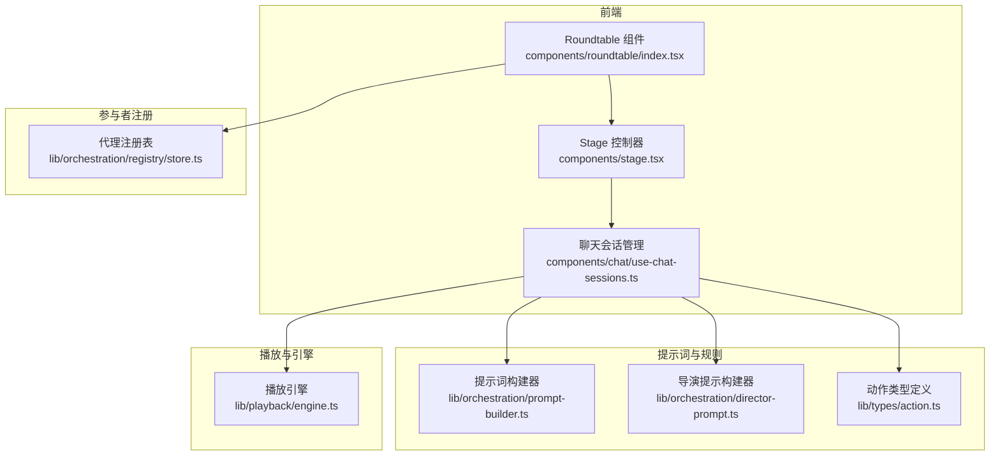
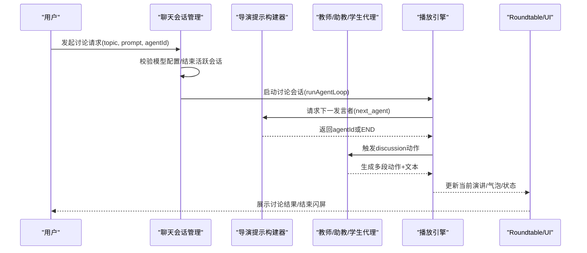
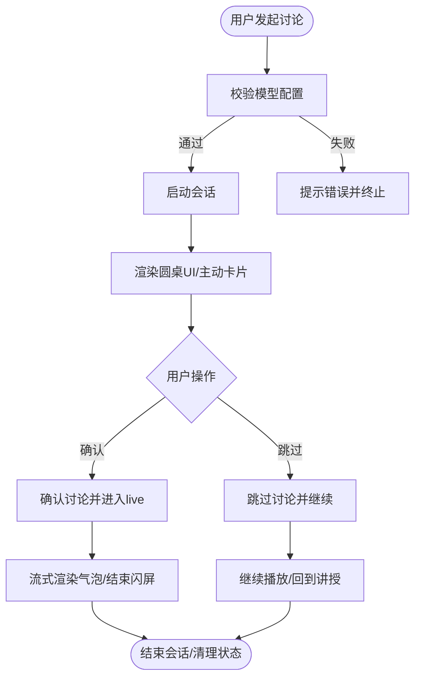
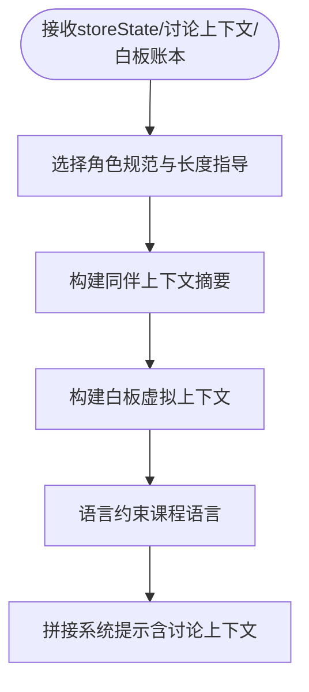
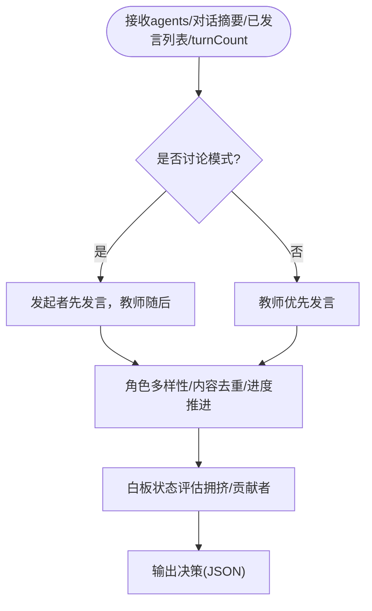
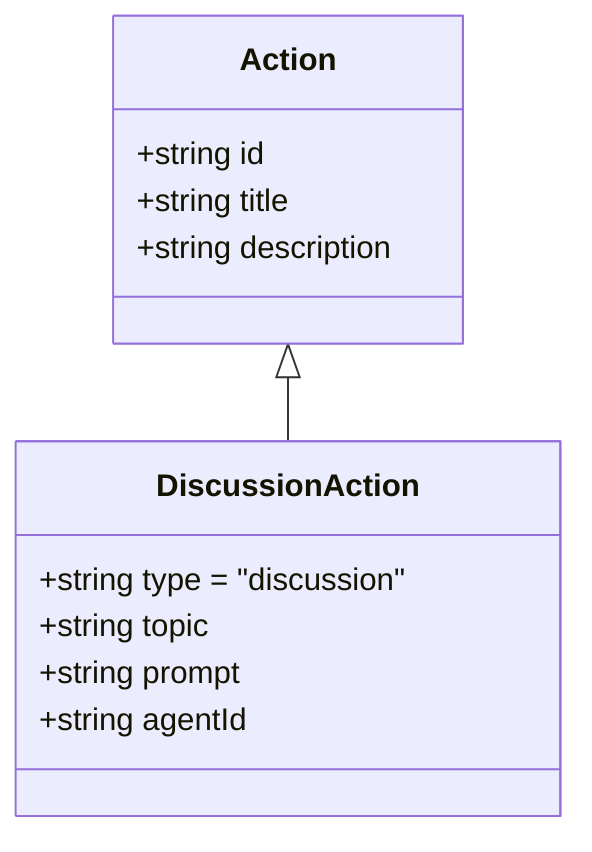
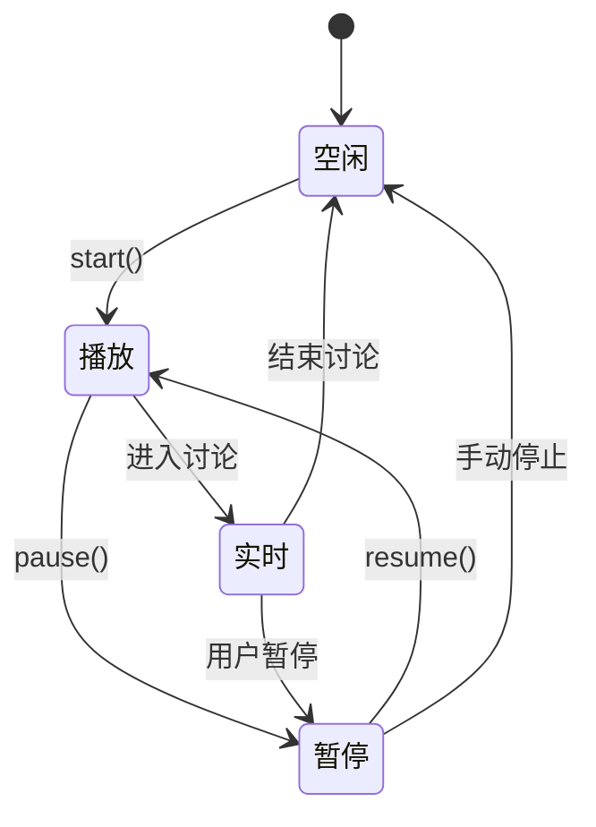
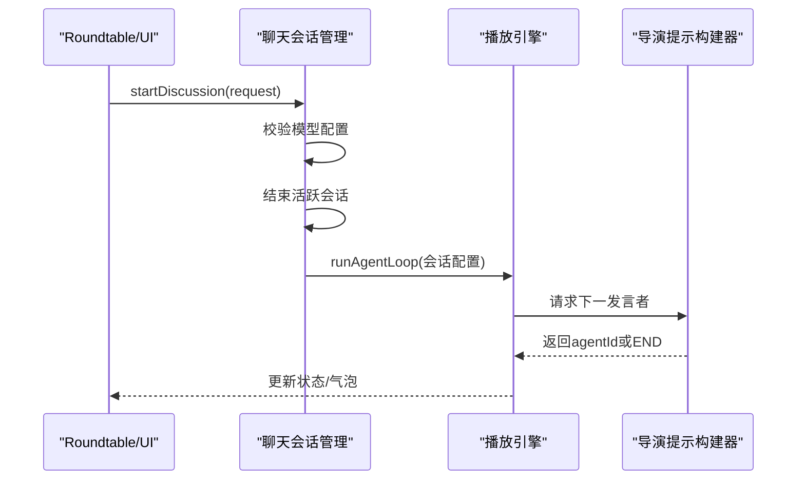
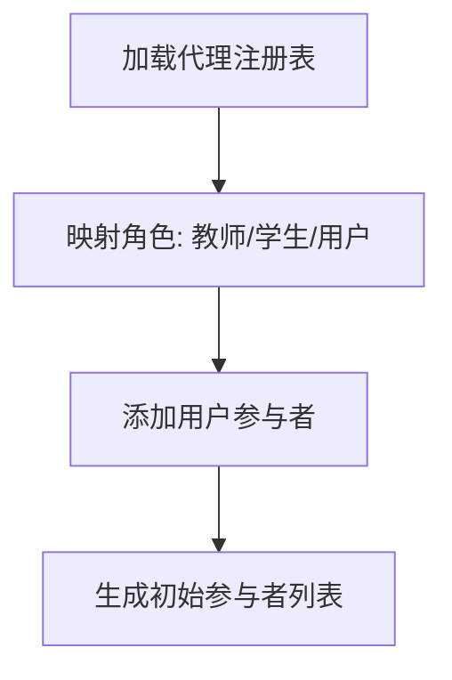
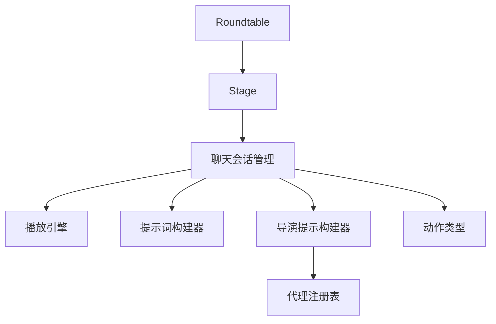

# 讨论模式实现

<cite>
**本文档引用的文件**
- [components/roundtable/index.tsx](file://components/roundtable/index.tsx)
- [lib/orchestration/prompt-builder.ts](file://lib/orchestration/prompt-builder.ts)
- [lib/orchestration/director-prompt.ts](file://lib/orchestration/director-prompt.ts)
- [lib/types/action.ts](file://lib/types/action.ts)
- [lib/types/roundtable.ts](file://lib/types/roundtable.ts)
- [lib/playback/engine.ts](file://lib/playback/engine.ts)
- [components/stage.tsx](file://components/stage.tsx)
- [components/chat/use-chat-sessions.ts](file://components/chat/use-chat-sessions.ts)
- [lib/generation/prompts/templates/quiz-actions/system.md](file://lib/generation/prompts/templates/quiz-actions/system.md)
- [lib/generation/prompts/templates/slide-actions/system.md](file://lib/generation/prompts/templates/slide-actions/system.md)
- [lib/orchestration/registry/store.ts](file://lib/orchestration/registry/store.ts)
- [lib/pbl/types.ts](file://lib/pbl/types.ts)
- [components/scene-renderers/pbl/use-pbl-chat.ts](file://components/scene-renderers/pbl/use-pbl-chat.ts)
- [app/api/classroom/route.ts](file://app/api/classroom/route.ts)
</cite>

## 目录
1. [引言](#引言)
2. [项目结构](#项目结构)
3. [核心组件](#核心组件)
4. [架构总览](#架构总览)
5. [详细组件分析](#详细组件分析)
6. [依赖关系分析](#依赖关系分析)
7. [性能考虑](#性能考虑)
8. [故障排除指南](#故障排除指南)
9. [结论](#结论)
10. [附录](#附录)

## 引言
本技术文档围绕“讨论模式”的设计与实现展开，系统性阐述课堂讨论、圆桌辩论与问答模式（QA）在 OpenMAIC 中的架构与运行机制。文档重点覆盖以下方面：
- 讨论模式的设计理念与适用场景：课堂讨论强调学生参与与教师引导；圆桌辩论强调多角色观点交锋；问答模式聚焦问题解答与知识澄清。
- 讨论上下文构建：主题定义、引导提示词、参与者角色分配与发言顺序控制。
- 讨论流程控制：轮次管理、发言顺序、争议处理与会话生命周期。
- 定制指南：新增讨论形式、修改讨论规则、调节参与者行为。
- 效果评估与参与度统计：指标建议与数据采集方法。

## 项目结构
讨论模式涉及前端 UI 组件、后端动作类型定义、提示词构建器、导演决策器以及播放引擎等模块。下图展示与讨论模式直接相关的模块与交互关系：

**图表来源**
- [components/roundtable/index.tsx](file://components/roundtable/index.tsx)
- [components/stage.tsx](file://components/stage.tsx)
- [components/chat/use-chat-sessions.ts](file://components/chat/use-chat-sessions.ts)
- [lib/orchestration/prompt-builder.ts](file://lib/orchestration/prompt-builder.ts)
- [lib/orchestration/director-prompt.ts](file://lib/orchestration/director-prompt.ts)
- [lib/types/action.ts](file://lib/types/action.ts)
- [lib/playback/engine.ts](file://lib/playback/engine.ts)
- [lib/orchestration/registry/store.ts](file://lib/orchestration/registry/store.ts)

**章节来源**
- [components/roundtable/index.tsx](file://components/roundtable/index.tsx)
- [components/stage.tsx](file://components/stage.tsx)
- [components/chat/use-chat-sessions.ts](file://components/chat/use-chat-sessions.ts)
- [lib/orchestration/prompt-builder.ts](file://lib/orchestration/prompt-builder.ts)
- [lib/orchestration/director-prompt.ts](file://lib/orchestration/director-prompt.ts)
- [lib/types/action.ts](file://lib/types/action.ts)
- [lib/playback/engine.ts](file://lib/playback/engine.ts)
- [lib/orchestration/registry/store.ts](file://lib/orchestration/registry/store.ts)

## 核心组件
- Roundtable 圆桌组件：负责渲染讨论界面、输入/语音交互、气泡显示、结束闪屏与工具栏控制。
- 播放引擎：统一状态机驱动讨论/问答会话，支持开始、暂停、恢复与结束。
- 提示词构建器：根据当前场景、白板状态与讨论上下文生成系统提示，约束角色行为与输出格式。
- 导演提示构建器：决定本轮下一个发言者，确保轮次推进与内容多样性。
- 动作类型定义：统一的动作类型体系，包括 discussion 动作及其参数。
- 聊天会话管理：启动/结束讨论会话，校验模型配置，协调前后会话状态。
- 参与者注册：从代理注册表生成初始参与者列表，含教师、学生与用户。

**章节来源**
- [components/roundtable/index.tsx](file://components/roundtable/index.tsx)
- [lib/playback/engine.ts](file://lib/playback/engine.ts)
- [lib/orchestration/prompt-builder.ts](file://lib/orchestration/prompt-builder.ts)
- [lib/orchestration/director-prompt.ts](file://lib/orchestration/director-prompt.ts)
- [lib/types/action.ts](file://lib/types/action.ts)
- [components/chat/use-chat-sessions.ts](file://components/chat/use-chat-sessions.ts)
- [lib/orchestration/registry/store.ts](file://lib/orchestration/registry/store.ts)

## 架构总览
讨论模式采用“动作驱动 + 多智能体对话”的架构。动作类型由场景动作数组定义，播放引擎按序执行同步动作（如 discussion、speech、wb_*），异步动作（spotlight、laser）即时生效。提示词构建器与导演提示构建器分别面向 LLM 的系统提示与决策逻辑，确保讨论有序、有深度且符合教学目标。

**图表来源**
- [components/chat/use-chat-sessions.ts](file://components/chat/use-chat-sessions.ts)
- [lib/orchestration/director-prompt.ts](file://lib/orchestration/director-prompt.ts)
- [lib/playback/engine.ts](file://lib/playback/engine.ts)
- [components/roundtable/index.tsx](file://components/roundtable/index.tsx)

## 详细组件分析

### 圆桌组件（Roundtable）
- 功能职责
  - 渲染教师与学生头像与角色标识，高亮当前说话者。
  - 支持文本输入与语音录制，发送消息触发讨论或问答。
  - 呈现讨论/问答会话期间的结束闪屏与工具栏控制。
  - 基于讨论请求渲染“主动卡片”，允许用户确认/跳过讨论。
- 关键状态
  - 当前演讲文本、会话类型（qa/discussion）、引擎模式（idle/live/paused）、是否正在流式传输。
  - 发送冷却（send cooldown）防止重复提交与闪烁。
- 输入/语音交互
  - 文本输入与语音转写均通过回调 onMessageSend 传递给上层会话管理器。
  - 发送后进入冷却，等待气泡出现再解锁输入。

**图表来源**
- [components/roundtable/index.tsx](file://components/roundtable/index.tsx)
- [components/chat/use-chat-sessions.ts](file://components/chat/use-chat-sessions.ts)

**章节来源**
- [components/roundtable/index.tsx](file://components/roundtable/index.tsx)

### 提示词构建器（PromptBuilder）
- 角色规范与长度约束：针对教师、助教与学生设定不同的长度与风格指导，确保课堂节奏与角色边界清晰。
- 讨论上下文注入：当存在讨论上下文时，在系统提示中插入主题与引导提示，并区分“发起讨论”与“加入讨论”的不同开场策略。
- 白板虚拟上下文：基于白板账本重建本轮已绘制元素，避免重复与冲突。
- 同伴上下文：汇总本轮其他代理已说的话，避免重复与同质化发言。

**图表来源**
- [lib/orchestration/prompt-builder.ts](file://lib/orchestration/prompt-builder.ts)

**章节来源**
- [lib/orchestration/prompt-builder.ts](file://lib/orchestration/prompt-builder.ts)

### 导演提示构建器（DirectorPrompt）
- 决策规则
  - 讨论模式：由发起者先发言，随后教师引导，再由其他学生补充观点。
  - 非讨论模式：通常由教师优先发言，回答用户问题或承接话题。
  - 轮次控制：限制每轮发言人数与回合数，避免冗长。
  - 内容去重：避免重复解释同一概念，鼓励提问、挑战与总结。
  - 角色多样性：避免连续两个相同角色发言。
- 白板状态感知：根据元素数量与贡献者给出路由建议，避免过度拥挤。
- 输出格式：严格返回 {"next_agent":"<agent_id>|USER|END"}。

**图表来源**
- [lib/orchestration/director-prompt.ts](file://lib/orchestration/director-prompt.ts)

**章节来源**
- [lib/orchestration/director-prompt.ts](file://lib/orchestration/director-prompt.ts)

### 动作类型与讨论动作（DiscussionAction）
- 动作类型：统一的动作类型体系，同步动作（speech、discussion、wb_*）阻塞后续动作，异步动作（spotlight、laser）即时生效。
- 讨论动作参数：topic（主题）、prompt（引导提示）、agentId（发起者代理ID）。
- 使用约束：讨论动作必须位于动作序列末尾，且频率应适度，避免滥用。

**图表来源**
- [lib/types/action.ts](file://lib/types/action.ts)

**章节来源**
- [lib/types/action.ts](file://lib/types/action.ts)

### 播放引擎与会话生命周期
- 状态机：idle → playing → paused → live → idle，支持讨论/问答的开始、暂停、恢复与结束。
- 讨论确认：进入 live 模式，隐藏主动卡片，回调通知讨论已确认。
- 结束处理：清理白板、恢复讲授场景索引与动作索引，回到 idle。
- 用户中断：支持用户在播放过程中中断讨论，触发聊天区域的用户中断处理。

**图表来源**
- [lib/playback/engine.ts](file://lib/playback/engine.ts)
- [components/stage.tsx](file://components/stage.tsx)

**章节来源**
- [lib/playback/engine.ts](file://lib/playback/engine.ts)
- [components/stage.tsx](file://components/stage.tsx)

### 聊天会话管理与讨论启动
- 启动流程
  - 校验模型配置（模型ID、API Key/服务端配置）。
  - 自动结束活跃的 QA 或讨论会话，保证同一时间仅有一个活动会话。
  - 创建会话ID，准备 storeState、讨论参数与用户画像，调用 runAgentLoop。
- 会话类型：discussion，携带 discussionTopic、discussionPrompt、triggerAgentId。
- 错误处理：忽略 AbortError（用户中断），记录其他异常。

**图表来源**
- [components/chat/use-chat-sessions.ts](file://components/chat/use-chat-sessions.ts)
- [lib/playback/engine.ts](file://lib/playback/engine.ts)
- [lib/orchestration/director-prompt.ts](file://lib/orchestration/director-prompt.ts)

**章节来源**
- [components/chat/use-chat-sessions.ts](file://components/chat/use-chat-sessions.ts)

### 参与者角色与注册
- 参与者结构：包含 id、name、role、avatar、isOnline、isSpeaking 等字段。
- 角色映射：从代理注册表生成初始参与者列表，第一个教师角色位于左侧，其余为学生，最后添加用户角色。
- 头像与名称：使用本地化名称与默认头像，增强可读性与辨识度。

**图表来源**
- [lib/orchestration/registry/store.ts](file://lib/orchestration/registry/store.ts)
- [lib/types/roundtable.ts](file://lib/types/roundtable.ts)

**章节来源**
- [lib/orchestration/registry/store.ts](file://lib/orchestration/registry/store.ts)
- [lib/types/roundtable.ts](file://lib/types/roundtable.ts)

### 课堂讨论、圆桌辩论与问答模式的实现差异
- 课堂讨论（Discussion）
  - 主题与引导提示来自 discussion 动作参数，系统提示中区分“发起”与“加入”两种情境。
  - 导演规则强调“发起者先讲，教师随后，其他学生补充”，避免冗长与重复。
- 圆桌辩论（Roundtable）
  - UI 层通过 ProactiveCard 提示讨论，用户可确认或跳过；讨论结束后显示结束闪屏。
  - 通过 sessionType 与 engineMode 协调 UI 与引擎状态。
- 问答模式（QA）
  - 与讨论共享会话生命周期与结束闪屏逻辑，但由导演规则与系统提示侧重问题解答与知识点澄清。

**章节来源**
- [lib/orchestration/prompt-builder.ts](file://lib/orchestration/prompt-builder.ts)
- [lib/orchestration/director-prompt.ts](file://lib/orchestration/director-prompt.ts)
- [components/roundtable/index.tsx](file://components/roundtable/index.tsx)
- [components/stage.tsx](file://components/stage.tsx)

### 讨论上下文构建与参与者角色分配
- 主题与引导提示
  - discussion 动作携带 topic 与 prompt，系统提示中明确讨论主题与引导语。
  - 若无引导提示，系统提示仍会要求自然引入主题。
- 参与者角色分配
  - 从注册表中提取代理，按优先级与角色映射生成教师/学生/用户三类角色。
  - 讨论发起者由 agentId 指定，若未指定则按默认策略选择。

**章节来源**
- [lib/types/action.ts](file://lib/types/action.ts)
- [lib/orchestration/prompt-builder.ts](file://lib/orchestration/prompt-builder.ts)
- [lib/orchestration/registry/store.ts](file://lib/orchestration/registry/store.ts)

### 讨论流程控制逻辑
- 轮次管理
  - 导演提示构建器维护 turnCount，结合“内容去重”“角色多样性”“进度推进”规则控制每轮发言。
- 发言顺序
  - 讨论模式：发起者 → 教师 → 学生；非讨论模式：教师优先。
- 争议处理
  - 若出现重复解释或同质化发言，导演提示构建器会建议切换到提问、挑战或总结的角色。
- 会话生命周期
  - 开始（确认讨论）→ 播放（实时）→ 暂停/恢复 → 结束（清理白板、恢复讲授）。

**章节来源**
- [lib/orchestration/director-prompt.ts](file://lib/orchestration/director-prompt.ts)
- [lib/playback/engine.ts](file://lib/playback/engine.ts)

### 讨论模式定制指南
- 新增讨论形式
  - 在动作类型定义中扩展新的动作类型（如 debate、challenge），并在提示词构建器与导演提示构建器中增加相应规则。
  - 在 UI 层（Roundtable）增加对应交互入口与状态呈现。
- 修改讨论规则
  - 调整导演提示构建器中的规则权重与轮次上限，以改变讨论节奏与参与广度。
  - 在提示词构建器中调整角色长度与风格指导，以适配不同课程语言与教学风格。
- 调节参与者行为
  - 通过代理注册表调整代理优先级与角色，影响导演的路由决策。
  - 在系统提示中增加白板使用与互动行为的约束，减少过度拥挤。

**章节来源**
- [lib/types/action.ts](file://lib/types/action.ts)
- [lib/orchestration/director-prompt.ts](file://lib/orchestration/director-prompt.ts)
- [lib/orchestration/prompt-builder.ts](file://lib/orchestration/prompt-builder.ts)
- [lib/orchestration/registry/store.ts](file://lib/orchestration/registry/store.ts)

### 讨论效果评估与参与度统计
- 可用指标建议
  - 讨论轮次：每场讨论的平均发言轮次与总时长。
  - 角色参与度：教师、助教、学生的发言次数与平均长度。
  - 内容多样性：不同观点的数量与交叉引用次数。
  - 白板利用率：绘制元素数量、贡献者分布与清理频率。
  - 用户中断率：用户在播放过程中的中断次数与原因。
- 数据采集方法
  - 通过播放引擎回调与会话管理器记录每次动作与状态变更。
  - 将讨论参数（topic、prompt、agentId）与最终会话结果关联，形成可追踪的评估数据集。
- 统计与可视化
  - 将指标导出为报告，用于教师反思与课程迭代优化。

[本节为通用指导，不直接分析具体文件，故无“章节来源”]

## 依赖关系分析
- 组件耦合
  - Roundtable 依赖 Stage 的播放视图与引擎状态，依赖聊天会话管理器进行消息发送。
  - 聊天会话管理器依赖播放引擎与提示词构建器，协调会话生命周期。
  - 导演提示构建器依赖代理注册表与对话摘要，输出下一发言者决策。
- 外部依赖
  - 动作类型定义为统一接口，确保前后端一致。
  - 播放引擎作为状态机，解耦 UI 与业务逻辑。

**图表来源**
- [components/roundtable/index.tsx](file://components/roundtable/index.tsx)
- [components/stage.tsx](file://components/stage.tsx)
- [components/chat/use-chat-sessions.ts](file://components/chat/use-chat-sessions.ts)
- [lib/playback/engine.ts](file://lib/playback/engine.ts)
- [lib/orchestration/prompt-builder.ts](file://lib/orchestration/prompt-builder.ts)
- [lib/orchestration/director-prompt.ts](file://lib/orchestration/director-prompt.ts)
- [lib/orchestration/registry/store.ts](file://lib/orchestration/registry/store.ts)
- [lib/types/action.ts](file://lib/types/action.ts)

**章节来源**
- [components/roundtable/index.tsx](file://components/roundtable/index.tsx)
- [components/stage.tsx](file://components/stage.tsx)
- [components/chat/use-chat-sessions.ts](file://components/chat/use-chat-sessions.ts)
- [lib/playback/engine.ts](file://lib/playback/engine.ts)
- [lib/orchestration/prompt-builder.ts](file://lib/orchestration/prompt-builder.ts)
- [lib/orchestration/director-prompt.ts](file://lib/orchestration/director-prompt.ts)
- [lib/orchestration/registry/store.ts](file://lib/orchestration/registry/store.ts)
- [lib/types/action.ts](file://lib/types/action.ts)

## 性能考虑
- 流式渲染与自动滚动：在实时讨论/问答期间，保持最新气泡可见，减少 UI 抖动。
- 发送冷却：防止短时间内重复提交，降低后端压力与 UI 刷新开销。
- 白板状态重建：通过账本快速重建虚拟白板，避免重复绘制与冲突。
- 动作阻塞与并发：同步动作串行执行，异步动作即时生效，平衡流畅度与一致性。

[本节为通用指导，不直接分析具体文件，故无“章节来源”]

## 故障排除指南
- 模型配置缺失
  - 现象：启动讨论时报错“模型未配置”。
  - 处理：检查模型ID与API Key/服务端配置，确保已正确设置。
- 会话冲突
  - 现象：同时存在多个活跃会话导致状态异常。
  - 处理：聊天会话管理器会自动结束活跃会话，确保仅一个活动会话。
- 用户中断
  - 现象：播放过程中用户中断讨论。
  - 处理：播放引擎捕获中断并清理状态，UI 显示结束闪屏。
- 白板拥挤
  - 现象：讨论中白板内容过多影响阅读。
  - 处理：导演提示构建器建议清理或组织白板，避免进一步堆积。

**章节来源**
- [components/chat/use-chat-sessions.ts](file://components/chat/use-chat-sessions.ts)
- [lib/playback/engine.ts](file://lib/playback/engine.ts)

## 结论
OpenMAIC 的讨论模式通过“动作驱动 + 多智能体对话”的架构实现了课堂讨论、圆桌辩论与问答模式的统一管理。提示词构建器与导演提示构建器确保讨论有序、有深度且符合教学目标；播放引擎与 UI 组件协同提供流畅的交互体验。通过可扩展的动作类型与规则定制能力，系统能够适应多样化的教学场景，并通过指标与统计持续优化讨论质量与学习效果。

## 附录
- 讨论动作参数参考
  - topic：讨论主题
  - prompt：引导提示（可选）
  - agentId：发起讨论的代理ID（可选，默认策略）
- 讨论频率与位置建议
  - 频率：不宜过高，建议每节课仅1-2次。
  - 位置：优先在课程结尾或开放性内容处引入讨论，以促进反思与总结。

**章节来源**
- [lib/generation/prompts/templates/quiz-actions/system.md](file://lib/generation/prompts/templates/quiz-actions/system.md)
- [lib/generation/prompts/templates/slide-actions/system.md](file://lib/generation/prompts/templates/slide-actions/system.md)
- [lib/types/action.ts](file://lib/types/action.ts)