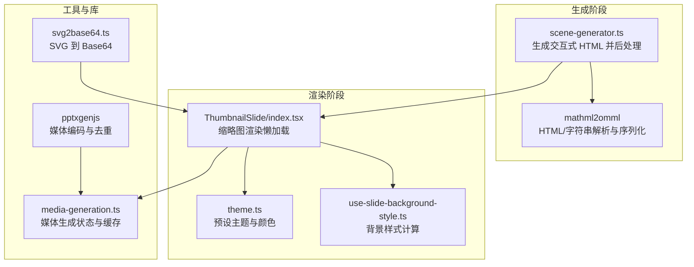
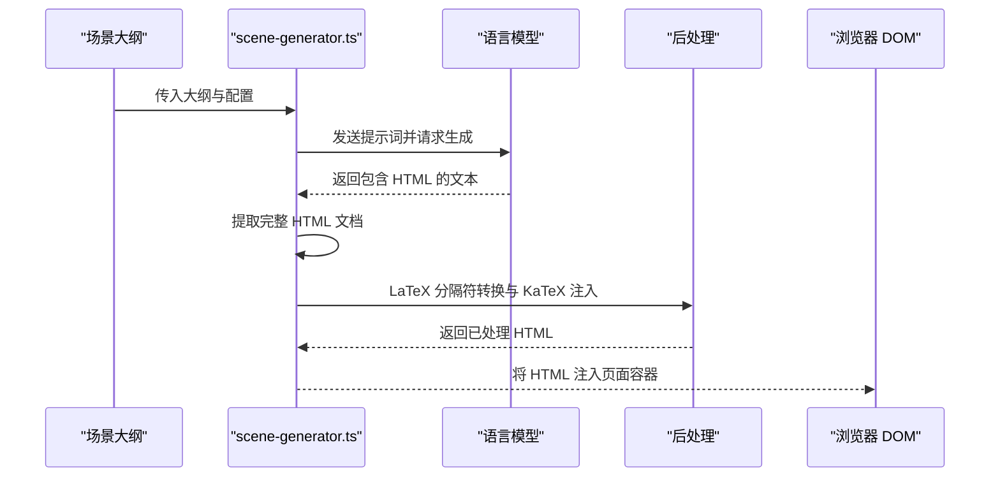
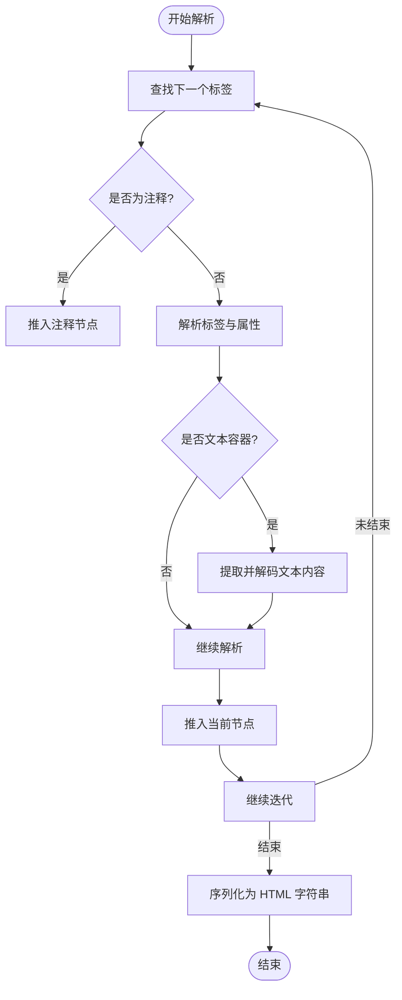
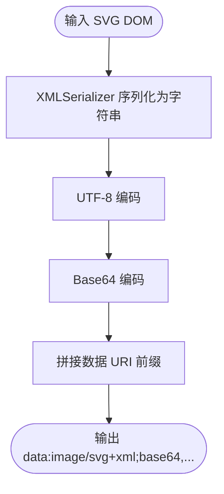
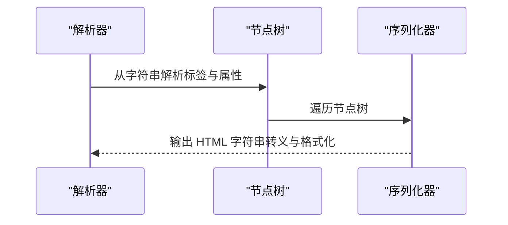
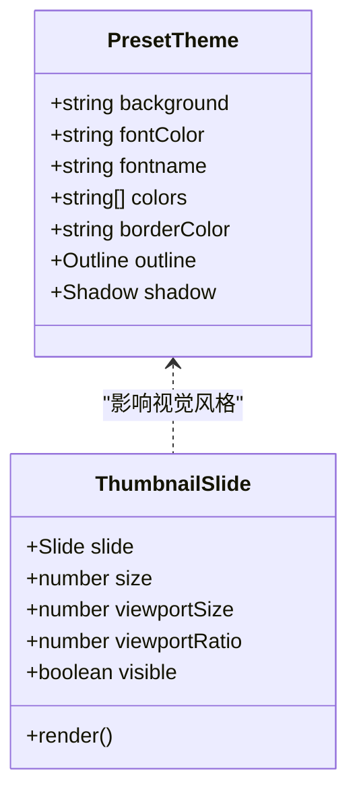
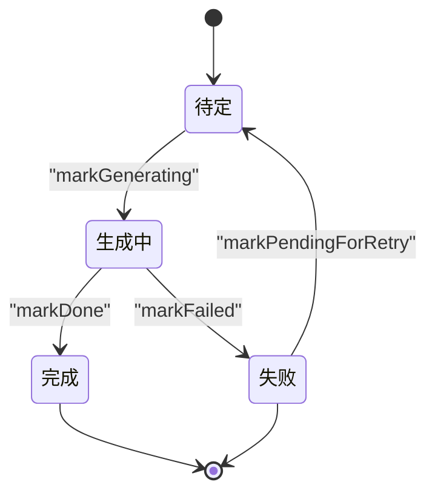
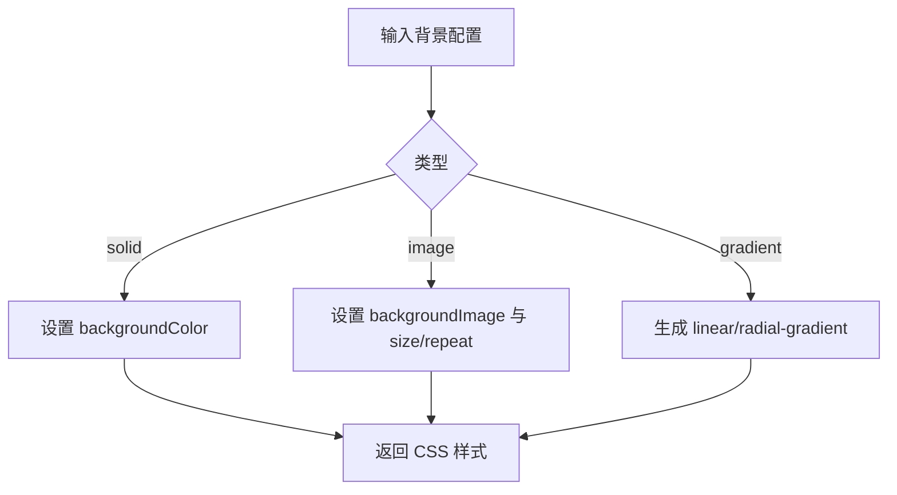
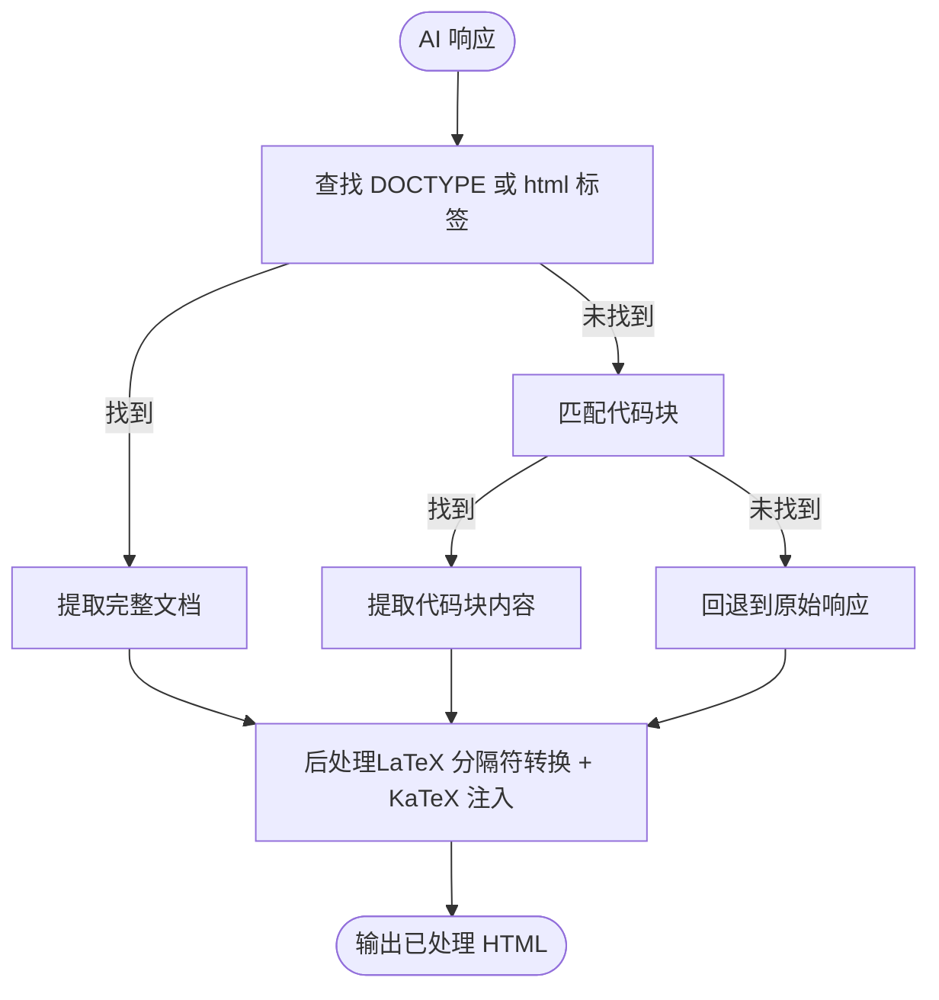
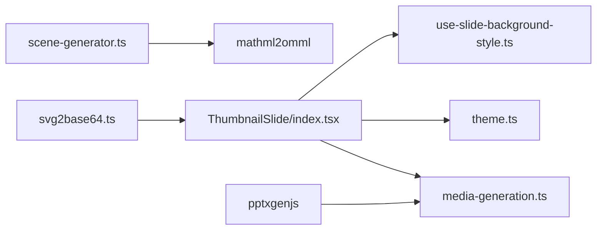

# HTML 导出

<cite>
**本文引用的文件**
- [svg2base64.ts](file://lib/export/svg2base64.ts)
- [scene-generator.ts](file://lib/generation/scene-generator.ts)
- [use-slide-background-style.ts](file://lib/hooks/use-slide-background-style.ts)
- [media-generation.ts](file://lib/store/media-generation.ts)
- [ThumbnailSlide/index.tsx](file://components/slide-renderer/components/ThumbnailSlide/index.tsx)
- [theme.ts](file://configs/theme.ts)
- [layout.tsx](file://app/generation-preview/layout.tsx)
- [index.js（mathml2omml）](file://packages/mathml2omml/dist/index.js)
- [gen-media.ts（pptxgenjs）](file://packages/pptxgenjs/src/gen-media.ts)
</cite>

## 目录
1. [简介](#简介)
2. [项目结构](#项目结构)
3. [核心组件](#核心组件)
4. [架构总览](#架构总览)
5. [详细组件分析](#详细组件分析)
6. [依赖关系分析](#依赖关系分析)
7. [性能考量](#性能考量)
8. [故障排查指南](#故障排查指南)
9. [结论](#结论)
10. [附录](#附录)

## 简介
本技术文档围绕 HTML 导出系统进行系统化梳理，覆盖以下关键主题：
- HTML 页面生成的架构设计：DOM 结构构建、CSS 样式注入与 JavaScript 交互逻辑
- HTML 解析器实现：自定义标记解析器、语法分析器与格式化工具
- SVG 转换机制：SVG 到 Base64 的转换流程与路径解析算法
- HTML 内容的序列化与反序列化：标签处理、属性映射与内容清理
- 导出模板系统：主题定制、布局配置与响应式适配
- 性能优化策略：懒加载、资源压缩与缓存机制
- 实际使用场景与集成示例

## 项目结构
本项目采用 Next.js 应用结构，HTML 导出能力主要由“生成阶段”与“渲染阶段”协同完成：
- 生成阶段：通过 AI 生成 HTML（含交互式页面），并进行后处理（LaTeX 转换、HTML 提取）
- 渲染阶段：将生成的 HTML 注入到页面中，并结合主题、背景与媒体资源进行最终展示
- 工具与库：包含 SVG 到 Base64 的转换工具、数学公式解析与序列化工具、媒体生成与缓存存储等

**图表来源**
- [scene-generator.ts:800-820](file://lib/generation/scene-generator.ts#L800-L820)
- [index.js（mathml2omml）:595-654](file://packages/mathml2omml/dist/index.js#L595-L654)
- [ThumbnailSlide/index.tsx:1-81](file://components/slide-renderer/components/ThumbnailSlide/index.tsx#L1-L81)
- [use-slide-background-style.ts:1-55](file://lib/hooks/use-slide-background-style.ts#L1-L55)
- [theme.ts:1-127](file://configs/theme.ts#L1-L127)
- [svg2base64.ts:1-59](file://lib/export/svg2base64.ts#L1-L59)
- [media-generation.ts:1-230](file://lib/store/media-generation.ts#L1-L230)
- [gen-media.ts（pptxgenjs）:74-97](file://packages/pptxgenjs/src/gen-media.ts#L74-L97)

**章节来源**
- [layout.tsx:1-7](file://app/generation-preview/layout.tsx#L1-L7)
- [scene-generator.ts:800-820](file://lib/generation/scene-generator.ts#L800-L820)
- [ThumbnailSlide/index.tsx:1-81](file://components/slide-renderer/components/ThumbnailSlide/index.tsx#L1-L81)

## 核心组件
- HTML 生成与后处理：从 AI 响应中提取完整 HTML 文档，进行 LaTeX 分隔符转换与 KaTeX 注入
- SVG 到 Base64：将 SVG DOM 序列化为字符串并进行 Base64 编码，添加数据 URI 前缀
- 背景样式计算：根据背景类型（纯色、图像、渐变）生成 CSS 样式
- 媒体生成与缓存：跟踪每元素媒体生成状态，支持 IndexedDB 持久化与对象 URL 回收
- 缩略图渲染：基于 transform scale 的懒加载渲染，提升大画布场景性能

**章节来源**
- [scene-generator.ts:800-820](file://lib/generation/scene-generator.ts#L800-L820)
- [svg2base64.ts:53-58](file://lib/export/svg2base64.ts#L53-L58)
- [use-slide-background-style.ts:7-49](file://lib/hooks/use-slide-background-style.ts#L7-L49)
- [media-generation.ts:73-230](file://lib/store/media-generation.ts#L73-L230)
- [ThumbnailSlide/index.tsx:25-80](file://components/slide-renderer/components/ThumbnailSlide/index.tsx#L25-L80)

## 架构总览
HTML 导出系统的关键流程如下：
- 输入：场景大纲（含交互式配置）
- 处理：AI 生成 HTML；提取完整文档；后处理（LaTeX 转换）
- 输出：可嵌入页面的 HTML 字符串，配合主题、背景与媒体资源渲染

**图表来源**
- [scene-generator.ts:800-820](file://lib/generation/scene-generator.ts#L800-L820)
- [scene-generator.ts:872-903](file://lib/generation/scene-generator.ts#L872-L903)

**章节来源**
- [scene-generator.ts:800-820](file://lib/generation/scene-generator.ts#L800-L820)
- [scene-generator.ts:872-903](file://lib/generation/scene-generator.ts#L872-L903)

## 详细组件分析

### HTML 解析器与格式化工具
- 自定义标记解析器与语法分析器：基于正则表达式匹配标签，解析属性与子节点，支持注释节点
- 标签属性解析：逐项提取键值对，兼容单引号、双引号与无引号值
- 文本容器识别：针对特定标签名（如 mtext、mi、mn、mo、ms）自动提取文本内容
- 序列化工具：将文档树结构还原为 HTML 字符串，转义特殊字符，处理自闭合标签

**图表来源**
- [index.js（mathml2omml）:595-654](file://packages/mathml2omml/dist/index.js#L595-L654)
- [index.js（mathml2omml）:531-590](file://packages/mathml2omml/dist/index.js#L531-L590)

**章节来源**
- [index.js（mathml2omml）:595-654](file://packages/mathml2omml/dist/index.js#L595-L654)
- [index.js（mathml2omml）:531-590](file://packages/mathml2omml/dist/index.js#L531-L590)

### SVG 到 Base64 转换机制
- 流程概述：序列化 SVG DOM 为字符串，进行 UTF-8 编码，再进行 Base64 编码，最后拼接数据 URI 前缀
- 关键点：UTF-8 转换确保多字节字符正确编码；Base64 表与索引映射保证编码一致性；前缀统一为 SVG 图像数据 URI

**图表来源**
- [svg2base64.ts:53-58](file://lib/export/svg2base64.ts#L53-L58)

**章节来源**
- [svg2base64.ts:1-59](file://lib/export/svg2base64.ts#L1-L59)

### HTML 内容的序列化与反序列化
- 反序列化（解析）：从字符串中提取标签、属性与文本，支持注释节点与文本容器
- 序列化（格式化）：将节点树还原为 HTML 字符串，处理自闭合标签与实体转义
- 清理与校验：在生成阶段对无效或缺失字段进行修复与过滤，确保后续渲染稳定

**图表来源**
- [index.js（mathml2omml）:595-654](file://packages/mathml2omml/dist/index.js#L595-L654)
- [index.js（mathml2omml）:344-370](file://packages/mathml2omml/dist/index.js#L344-L370)

**章节来源**
- [index.js（mathml2omml）:595-654](file://packages/mathml2omml/dist/index.js#L595-L654)
- [index.js（mathml2omml）:344-370](file://packages/mathml2omml/dist/index.js#L344-L370)

### 导出模板系统与主题定制
- 主题配置：预设主题数组包含背景、字体色、边框色、字体名与一组主题色
- 布局配置：画布尺寸（宽高比）固定，用于统一渲染体验
- 响应式适配：缩略图组件通过 transform scale 缩放整个视图，避免重复渲染真实元素

**图表来源**
- [theme.ts:3-11](file://configs/theme.ts#L3-L11)
- [ThumbnailSlide/index.tsx:25-80](file://components/slide-renderer/components/ThumbnailSlide/index.tsx#L25-L80)

**章节来源**
- [theme.ts:1-127](file://configs/theme.ts#L1-L127)
- [ThumbnailSlide/index.tsx:1-81](file://components/slide-renderer/components/ThumbnailSlide/index.tsx#L1-L81)

### 媒体生成与缓存机制
- 状态管理：跟踪每个元素的媒体生成状态（待定、生成中、完成、失败），支持重试计数
- 持久化：通过 IndexedDB 存储媒体文件元数据与 Blob，恢复时重建对象 URL
- 资源回收：页面卸载或清理阶段回收对象 URL，防止内存泄漏

**图表来源**
- [media-generation.ts:73-230](file://lib/store/media-generation.ts#L73-L230)

**章节来源**
- [media-generation.ts:1-230](file://lib/store/media-generation.ts#L1-L230)

### 背景样式注入与 CSS 渲染
- 纯色背景：直接设置 backgroundColor
- 图像背景：支持 repeat 与非 repeat 模式，控制 background-size
- 渐变背景：支持线性与径向渐变，按角度与颜色列表生成

**图表来源**
- [use-slide-background-style.ts:7-49](file://lib/hooks/use-slide-background-style.ts#L7-L49)

**章节来源**
- [use-slide-background-style.ts:1-55](file://lib/hooks/use-slide-background-style.ts#L1-L55)

### HTML 生成与后处理流程
- HTML 提取：优先匹配完整文档结构，其次从代码块中提取，最后回退到原始响应
- 后处理：将 LaTeX 分隔符转换为 HTML 可识别形式，并注入 KaTeX 渲染所需脚本与样式

**图表来源**
- [scene-generator.ts:872-903](file://lib/generation/scene-generator.ts#L872-L903)
- [scene-generator.ts:812-814](file://lib/generation/scene-generator.ts#L812-L814)

**章节来源**
- [scene-generator.ts:872-903](file://lib/generation/scene-generator.ts#L872-L903)
- [scene-generator.ts:812-814](file://lib/generation/scene-generator.ts#L812-L814)

## 依赖关系分析
- 组件耦合
  - scene-generator.ts 依赖解析与序列化工具以处理 AI 输出
  - ThumbnailSlide 依赖背景样式钩子与主题配置，同时依赖媒体生成状态驱动懒加载
  - media-generation.ts 作为全局状态管理，被多个渲染组件共享
- 外部依赖
  - pptxgenjs 的媒体编码与去重逻辑可用于导出场景下的资源复用与压缩思路借鉴

**图表来源**
- [scene-generator.ts:800-820](file://lib/generation/scene-generator.ts#L800-L820)
- [ThumbnailSlide/index.tsx:1-81](file://components/slide-renderer/components/ThumbnailSlide/index.tsx#L1-L81)
- [use-slide-background-style.ts:1-55](file://lib/hooks/use-slide-background-style.ts#L1-L55)
- [theme.ts:1-127](file://configs/theme.ts#L1-L127)
- [media-generation.ts:1-230](file://lib/store/media-generation.ts#L1-L230)
- [svg2base64.ts:1-59](file://lib/export/svg2base64.ts#L1-L59)
- [gen-media.ts（pptxgenjs）:74-97](file://packages/pptxgenjs/src/gen-media.ts#L74-L97)

**章节来源**
- [scene-generator.ts:800-820](file://lib/generation/scene-generator.ts#L800-L820)
- [ThumbnailSlide/index.tsx:1-81](file://components/slide-renderer/components/ThumbnailSlide/index.tsx#L1-L81)
- [media-generation.ts:1-230](file://lib/store/media-generation.ts#L1-L230)

## 性能考量
- 懒加载与缩放渲染：缩略图组件通过 transform scale 缩放整个视图，减少真实元素渲染开销
- 媒体生成状态追踪：通过状态机与持久化，避免重复生成与网络请求
- 资源去重与缓存：参考 pptxgenjs 的媒体去重策略，避免重复加载相同资源
- 对象 URL 回收：在清理阶段统一回收，降低内存占用

**章节来源**
- [ThumbnailSlide/index.tsx:25-80](file://components/slide-renderer/components/ThumbnailSlide/index.tsx#L25-L80)
- [media-generation.ts:160-229](file://lib/store/media-generation.ts#L160-L229)
- [gen-media.ts（pptxgenjs）:74-97](file://packages/pptxgenjs/src/gen-media.ts#L74-L97)

## 故障排查指南
- HTML 提取失败：检查 AI 响应是否包含完整文档结构或代码块；必要时启用回退逻辑
- LaTeX 渲染异常：确认分隔符转换与 KaTeX 注入步骤是否执行；检查公式内容合法性
- 媒体生成失败：查看错误码与错误信息，必要时触发重试；确认 IndexedDB 存储与对象 URL 回收
- 背景样式不生效：核对背景类型与参数，确保 CSS 属性正确生成

**章节来源**
- [scene-generator.ts:872-903](file://lib/generation/scene-generator.ts#L872-L903)
- [media-generation.ts:126-154](file://lib/store/media-generation.ts#L126-L154)

## 结论
本 HTML 导出系统通过“生成—后处理—渲染”的闭环流程，实现了从 AI 生成到页面可视化的完整链路。其核心优势在于：
- 稳健的 HTML 解析与序列化工具，确保内容结构与属性的正确映射
- SVG 到 Base64 的高效转换，便于内联渲染与跨平台兼容
- 主题与背景样式的灵活配置，满足多样化的视觉需求
- 媒体生成状态与缓存机制，保障大规模场景下的性能与稳定性

## 附录
- 实际使用场景与集成示例
  - 在生成阶段调用 HTML 生成函数，提取并后处理 HTML，随后注入页面容器
  - 使用主题与背景样式钩子，结合缩略图组件实现懒加载渲染
  - 通过媒体生成状态管理，驱动骨架屏与占位符显示，提升用户体验

**章节来源**
- [scene-generator.ts:800-820](file://lib/generation/scene-generator.ts#L800-L820)
- [ThumbnailSlide/index.tsx:25-80](file://components/slide-renderer/components/ThumbnailSlide/index.tsx#L25-L80)
- [media-generation.ts:73-230](file://lib/store/media-generation.ts#L73-L230)