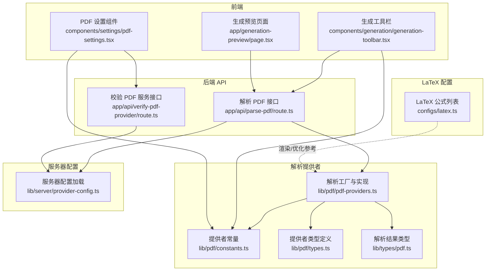
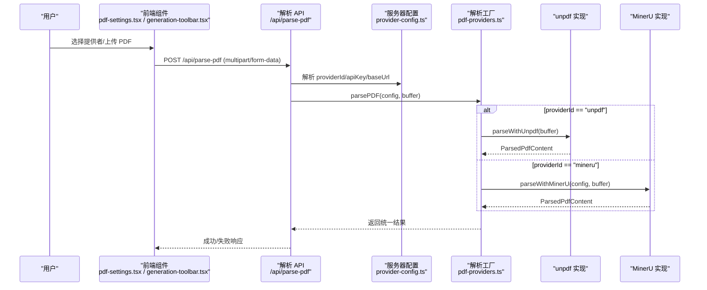
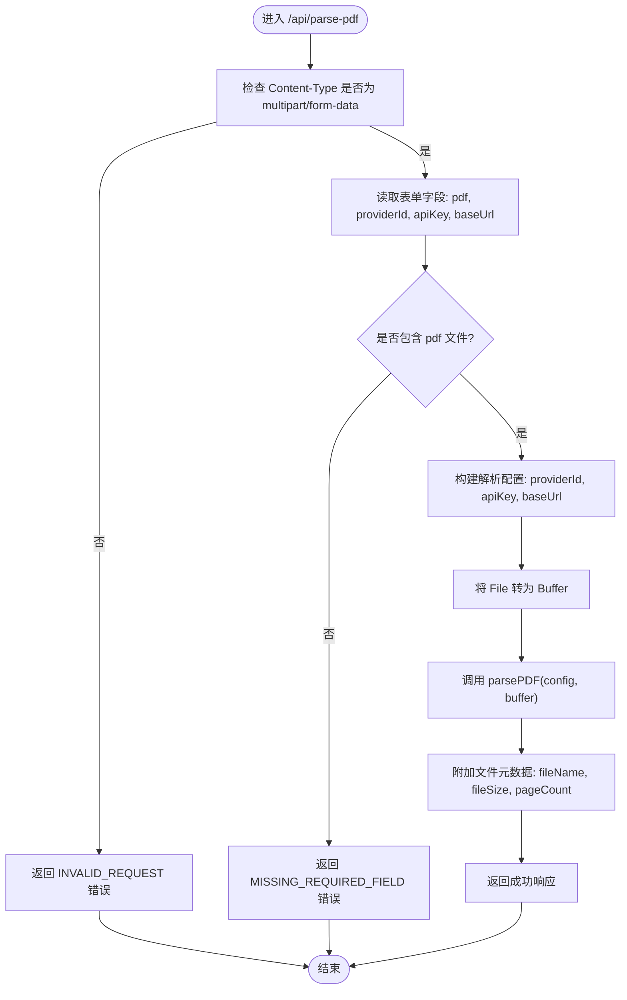
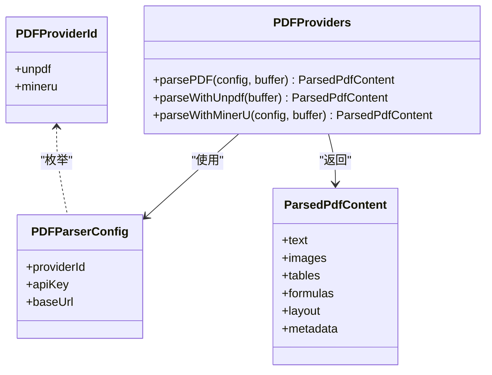
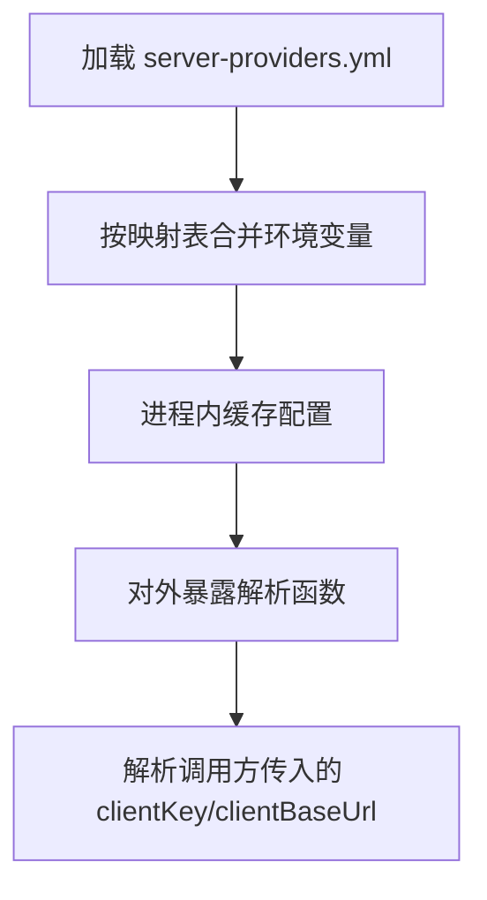
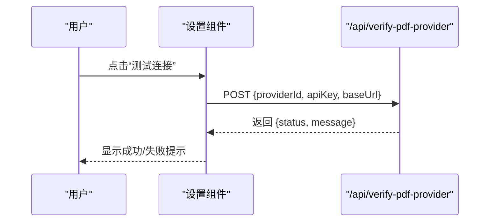
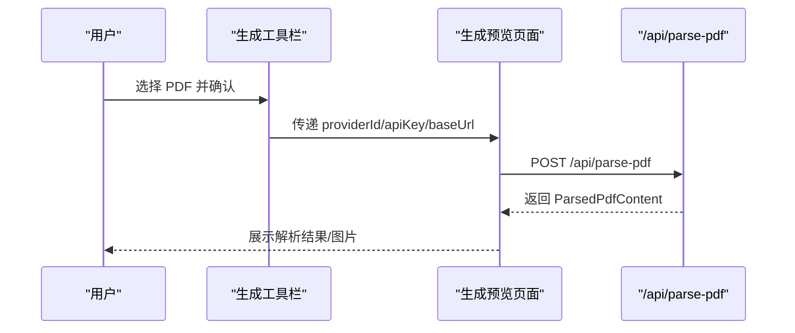
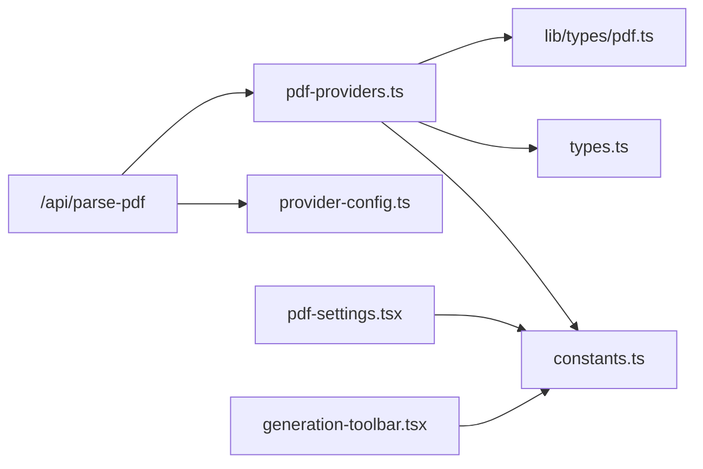

# PDF 处理

<cite>
**本文引用的文件**
- [app/api/parse-pdf/route.ts](file://app/api/parse-pdf/route.ts)
- [app/api/verify-pdf-provider/route.ts](file://app/api/verify-pdf-provider/route.ts)
- [lib/pdf/pdf-providers.ts](file://lib/pdf/pdf-providers.ts)
- [lib/pdf/constants.ts](file://lib/pdf/constants.ts)
- [lib/pdf/types.ts](file://lib/pdf/types.ts)
- [lib/types/pdf.ts](file://lib/types/pdf.ts)
- [lib/pdf/README.md](file://lib/pdf/README.md)
- [lib/server/provider-config.ts](file://lib/server/provider-config.ts)
- [components/settings/pdf-settings.tsx](file://components/settings/pdf-settings.tsx)
- [components/generation/generation-toolbar.tsx](file://components/generation/generation-toolbar.tsx)
- [app/generation-preview/page.tsx](file://app/generation-preview/page.tsx)
- [configs/latex.ts](file://configs/latex.ts)
</cite>

## 目录
1. [简介](#简介)
2. [项目结构](#项目结构)
3. [核心组件](#核心组件)
4. [架构总览](#架构总览)
5. [详细组件分析](#详细组件分析)
6. [依赖关系分析](#依赖关系分析)
7. [性能考量](#性能考量)
8. [故障排除指南](#故障排除指南)
9. [结论](#结论)
10. [附录](#附录)

## 简介
本技术文档围绕 PDF 处理能力进行系统化说明，重点覆盖以下方面：
- PDF 解析与内容提取：文本识别、图像提取、元数据处理
- PDF 转换流程：将 PDF 内容转换为可编辑格式（Markdown/纯文本）
- LaTeX 公式处理：公式识别、解析与渲染优化
- PDF 生成与编辑：内容添加、页面重组与格式调整（概念性说明）
- 性能优化：内存管理、并发处理、缓存机制
- 安全与权限：密钥解析、服务端配置、连接验证
- 应用场景：课程材料转换、文档批注与版本管理
- 故障排除与最佳实践

## 项目结构
本项目的 PDF 处理能力由“前端设置界面 + 后端 API + 解析提供者 + 类型与常量定义 + 服务器配置”构成，形成清晰的分层架构。

图表来源
- [app/api/parse-pdf/route.ts:1-65](file://app/api/parse-pdf/route.ts#L1-L65)
- [app/api/verify-pdf-provider/route.ts:1-58](file://app/api/verify-pdf-provider/route.ts#L1-L58)
- [lib/pdf/pdf-providers.ts:152-189](file://lib/pdf/pdf-providers.ts#L152-L189)
- [lib/pdf/constants.ts:11-27](file://lib/pdf/constants.ts#L11-L27)
- [lib/pdf/types.ts:8-32](file://lib/pdf/types.ts#L8-L32)
- [lib/types/pdf.ts:9-59](file://lib/types/pdf.ts#L9-L59)
- [lib/server/provider-config.ts:304-322](file://lib/server/provider-config.ts#L304-L322)
- [components/settings/pdf-settings.tsx:34-214](file://components/settings/pdf-settings.tsx#L34-L214)
- [components/generation/generation-toolbar.tsx:181-207](file://components/generation/generation-toolbar.tsx#L181-L207)
- [configs/latex.ts:1-275](file://configs/latex.ts#L1-L275)

章节来源
- [app/api/parse-pdf/route.ts:1-65](file://app/api/parse-pdf/route.ts#L1-L65)
- [lib/pdf/pdf-providers.ts:152-189](file://lib/pdf/pdf-providers.ts#L152-L189)
- [lib/pdf/constants.ts:11-27](file://lib/pdf/constants.ts#L11-L27)
- [lib/pdf/types.ts:8-32](file://lib/pdf/types.ts#L8-L32)
- [lib/types/pdf.ts:9-59](file://lib/types/pdf.ts#L9-L59)
- [lib/server/provider-config.ts:304-322](file://lib/server/provider-config.ts#L304-L322)
- [components/settings/pdf-settings.tsx:34-214](file://components/settings/pdf-settings.tsx#L34-L214)
- [components/generation/generation-toolbar.tsx:181-207](file://components/generation/generation-toolbar.tsx#L181-L207)
- [configs/latex.ts:1-275](file://configs/latex.ts#L1-L275)

## 核心组件
- 解析 API（POST /api/parse-pdf）：接收 multipart/form-data，校验请求头，读取文件与配置，调用解析工厂并返回统一结果。
- 提供者工厂（parsePDF）：根据 providerId 分派至具体实现（unpdf、MinerU），统一注入处理耗时元数据。
- 提供者实现：
  - unpdf：基于 unpdf 文档代理提取文本与图像，使用 sharp 将原始像素转 PNG 并编码为 base64。
  - MinerU：向 /file_parse 发送 multipart/form-data，解析返回的 Markdown、图片、内容列表，构建 imageMapping 与 pdfImages。
- 类型与常量：统一的 ParsedPdfContent、PDFProviderId、features、图标与特性清单。
- 服务器配置：从 YAML 与环境变量合并解析 PDF 提供者的 apiKey/baseUrl，支持服务端默认配置与客户端覆盖。
- 设置界面：展示提供者特性、测试连接、显示/隐藏密钥、预览请求 URL。
- 生成工具栏：在生成流程中选择 PDF 提供者并触发解析。
- LaTeX 配置：内置公式与符号列表，为公式渲染与优化提供参考。

章节来源
- [app/api/parse-pdf/route.ts:10-64](file://app/api/parse-pdf/route.ts#L10-L64)
- [lib/pdf/pdf-providers.ts:152-189](file://lib/pdf/pdf-providers.ts#L152-L189)
- [lib/pdf/pdf-providers.ts:194-263](file://lib/pdf/pdf-providers.ts#L194-L263)
- [lib/pdf/pdf-providers.ts:276-438](file://lib/pdf/pdf-providers.ts#L276-L438)
- [lib/pdf/constants.ts:11-27](file://lib/pdf/constants.ts#L11-L27)
- [lib/pdf/types.ts:8-32](file://lib/pdf/types.ts#L8-L32)
- [lib/types/pdf.ts:9-59](file://lib/types/pdf.ts#L9-L59)
- [lib/server/provider-config.ts:304-322](file://lib/server/provider-config.ts#L304-L322)
- [components/settings/pdf-settings.tsx:34-214](file://components/settings/pdf-settings.tsx#L34-L214)
- [components/generation/generation-toolbar.tsx:181-207](file://components/generation/generation-toolbar.tsx#L181-L207)
- [configs/latex.ts:1-275](file://configs/latex.ts#L1-L275)

## 架构总览
下图展示了从用户操作到解析结果返回的关键交互路径，以及提供者选择与配置解析的流程。

图表来源
- [app/api/parse-pdf/route.ts:10-64](file://app/api/parse-pdf/route.ts#L10-L64)
- [lib/server/provider-config.ts:304-322](file://lib/server/provider-config.ts#L304-L322)
- [lib/pdf/pdf-providers.ts:152-189](file://lib/pdf/pdf-providers.ts#L152-L189)
- [lib/pdf/pdf-providers.ts:194-263](file://lib/pdf/pdf-providers.ts#L194-L263)
- [lib/pdf/pdf-providers.ts:276-438](file://lib/pdf/pdf-providers.ts#L276-L438)

## 详细组件分析

### 组件一：解析 API（POST /api/parse-pdf）
职责
- 校验 Content-Type 为 multipart/form-data
- 从表单数据读取 pdf 文件、providerId、apiKey、baseUrl
- 将 File 转为 Buffer
- 调用 parsePDF 并附加文件元数据（文件名、大小、页数）
- 返回统一的成功/失败响应

关键点
- 错误处理：记录日志并返回标准化错误
- 元数据增强：确保 pageCount 为数字；补充 fileName、fileSize

图表来源
- [app/api/parse-pdf/route.ts:10-64](file://app/api/parse-pdf/route.ts#L10-L64)

章节来源
- [app/api/parse-pdf/route.ts:10-64](file://app/api/parse-pdf/route.ts#L10-L64)

### 组件二：解析工厂与提供者实现（parsePDF）
职责
- 根据 providerId 分派到具体实现
- 统一注入 processingTime 元数据
- 对需要密钥的提供者进行前置校验

实现要点
- unpdf：通过文档代理提取文本与图像，逐页迭代；对每张图片使用 sharp 转 PNG 并 base64；记录 imageMapping 与 pdfImages。
- MinerU：构造 FormData，发送到 /file_parse；解析返回的 md_content、images、content_list；构建 imageMapping 与 pdfImages；统计 pageCount。

图表来源
- [lib/pdf/pdf-providers.ts:152-189](file://lib/pdf/pdf-providers.ts#L152-L189)
- [lib/pdf/pdf-providers.ts:194-263](file://lib/pdf/pdf-providers.ts#L194-L263)
- [lib/pdf/pdf-providers.ts:276-438](file://lib/pdf/pdf-providers.ts#L276-L438)
- [lib/pdf/types.ts:8-32](file://lib/pdf/types.ts#L8-L32)
- [lib/types/pdf.ts:9-59](file://lib/types/pdf.ts#L9-L59)

章节来源
- [lib/pdf/pdf-providers.ts:152-189](file://lib/pdf/pdf-providers.ts#L152-L189)
- [lib/pdf/pdf-providers.ts:194-263](file://lib/pdf/pdf-providers.ts#L194-L263)
- [lib/pdf/pdf-providers.ts:276-438](file://lib/pdf/pdf-providers.ts#L276-L438)
- [lib/pdf/types.ts:8-32](file://lib/pdf/types.ts#L8-L32)
- [lib/types/pdf.ts:9-59](file://lib/types/pdf.ts#L9-L59)

### 组件三：服务器配置与密钥解析（provider-config）
职责
- 从默认 YAML 文件加载 PDF 提供者配置
- 支持环境变量覆盖（优先级：环境变量 > YAML）
- 提供 resolvePDFApiKey / resolvePDFBaseUrl 以支持客户端覆盖

图表来源
- [lib/server/provider-config.ts:101-113](file://lib/server/provider-config.ts#L101-L113)
- [lib/server/provider-config.ts:119-168](file://lib/server/provider-config.ts#L119-L168)
- [lib/server/provider-config.ts:304-322](file://lib/server/provider-config.ts#L304-L322)

章节来源
- [lib/server/provider-config.ts:101-113](file://lib/server/provider-config.ts#L101-L113)
- [lib/server/provider-config.ts:119-168](file://lib/server/provider-config.ts#L119-L168)
- [lib/server/provider-config.ts:304-322](file://lib/server/provider-config.ts#L304-L322)

### 组件四：设置界面（PDF 设置）
职责
- 展示提供者特性标签
- 测试连接：调用 /api/verify-pdf-provider
- 显示/隐藏 API Key
- 预览请求 URL（baseUrl + /file_parse）

图表来源
- [components/settings/pdf-settings.tsx:58-90](file://components/settings/pdf-settings.tsx#L58-L90)
- [app/api/verify-pdf-provider/route.ts:8-57](file://app/api/verify-pdf-provider/route.ts#L8-L57)

章节来源
- [components/settings/pdf-settings.tsx:34-214](file://components/settings/pdf-settings.tsx#L34-L214)
- [app/api/verify-pdf-provider/route.ts:8-57](file://app/api/verify-pdf-provider/route.ts#L8-L57)

### 组件五：生成工具栏与预览（生成流程集成）
职责
- 在生成流程中选择 PDF 提供者并上传 PDF
- 触发 /api/parse-pdf 获取解析结果
- 截断超长文本，构建图片元数据并存储图片

图表来源
- [components/generation/generation-toolbar.tsx:181-207](file://components/generation/generation-toolbar.tsx#L181-L207)
- [app/generation-preview/page.tsx:157-242](file://app/generation-preview/page.tsx#L157-L242)
- [app/api/parse-pdf/route.ts:10-64](file://app/api/parse-pdf/route.ts#L10-L64)

章节来源
- [components/generation/generation-toolbar.tsx:181-207](file://components/generation/generation-toolbar.tsx#L181-L207)
- [app/generation-preview/page.tsx:157-242](file://app/generation-preview/page.tsx#L157-L242)
- [app/api/parse-pdf/route.ts:10-64](file://app/api/parse-pdf/route.ts#L10-L64)

### 组件六：LaTeX 公式处理（概念与参考）
- MinerU 提供公式提取（LaTeX），解析结果包含 formulas 字段（页码、LaTeX、位置信息）。
- 项目内置公式与符号列表可用于渲染优化与教学演示。
- 在生成流程中，可通过 imageMapping 将 img_1 等占位符替换为实际图片 URL，从而在幻灯片中正确显示公式图片或渲染后的公式。

章节来源
- [lib/types/pdf.ts:23-28](file://lib/types/pdf.ts#L23-L28)
- [lib/pdf/pdf-providers.ts:350-438](file://lib/pdf/pdf-providers.ts#L350-L438)
- [configs/latex.ts:1-275](file://configs/latex.ts#L1-L275)

## 依赖关系分析
- 组件耦合
  - 解析 API 依赖服务器配置模块以解析密钥与基础地址
  - 解析工厂依赖提供者常量与类型定义
  - 前端设置与工具栏依赖提供者常量以展示特性与图标
- 外部依赖
  - unpdf：文档代理、文本与图像提取
  - sharp：图像格式转换（PNG）
  - fetch：远程 MinerU 服务调用
- 潜在循环依赖
  - 提供者常量与类型定义分离，避免在客户端引入 sharp 导致循环依赖

图表来源
- [app/api/parse-pdf/route.ts:10-64](file://app/api/parse-pdf/route.ts#L10-L64)
- [lib/server/provider-config.ts:304-322](file://lib/server/provider-config.ts#L304-L322)
- [lib/pdf/pdf-providers.ts:152-189](file://lib/pdf/pdf-providers.ts#L152-L189)
- [lib/pdf/constants.ts:11-27](file://lib/pdf/constants.ts#L11-L27)
- [lib/pdf/types.ts:8-32](file://lib/pdf/types.ts#L8-L32)
- [lib/types/pdf.ts:9-59](file://lib/types/pdf.ts#L9-L59)
- [components/settings/pdf-settings.tsx:34-214](file://components/settings/pdf-settings.tsx#L34-L214)
- [components/generation/generation-toolbar.tsx:181-207](file://components/generation/generation-toolbar.tsx#L181-L207)

章节来源
- [lib/pdf/pdf-providers.ts:152-189](file://lib/pdf/pdf-providers.ts#L152-L189)
- [lib/pdf/constants.ts:11-27](file://lib/pdf/constants.ts#L11-L27)
- [lib/pdf/types.ts:8-32](file://lib/pdf/types.ts#L8-L32)
- [lib/types/pdf.ts:9-59](file://lib/types/pdf.ts#L9-L59)
- [lib/server/provider-config.ts:304-322](file://lib/server/provider-config.ts#L304-L322)
- [components/settings/pdf-settings.tsx:34-214](file://components/settings/pdf-settings.tsx#L34-L214)
- [components/generation/generation-toolbar.tsx:181-207](file://components/generation/generation-toolbar.tsx#L181-L207)

## 性能考量
- unpdf
  - 图像处理：逐页提取并使用 sharp 转 PNG，注意内存峰值；建议在高分辨率 PDF 上控制缩放比例或分页处理
  - 错误隔离：单页/单图失败不应中断整体流程，日志记录即可
- MinerU
  - 并发处理：可使用 Promise.all 并行解析多个文件，提升吞吐
  - 结果缓存：可基于文件哈希缓存解析结果，减少重复请求
  - 资源分配：MinerU 服务容器建议增加内存与 CPU，以提升 OCR 与公式识别性能

章节来源
- [lib/pdf/pdf-providers.ts:244-251](file://lib/pdf/pdf-providers.ts#L244-L251)
- [lib/pdf/README.md:313-342](file://lib/pdf/README.md#L313-L342)

## 故障排除指南
- 无法连接 MinerU 服务
  - 检查服务健康状态与网络连通性
  - 查看容器日志定位问题
- 图片不显示
  - 确认 imageMapping 与 pdfImages 已正确传递到后续生成流程
  - 检查图片 ID 格式与 base64 编码完整性
- 解析速度慢
  - 增加 MinerU 服务资源（内存/CPU）
  - 使用并发解析与结果缓存
- API Key 未生效
  - 确认客户端覆盖优先于服务端配置
  - 使用“测试连接”功能验证

章节来源
- [lib/pdf/README.md:261-298](file://lib/pdf/README.md#L261-L298)
- [app/api/verify-pdf-provider/route.ts:39-56](file://app/api/verify-pdf-provider/route.ts#L39-L56)
- [lib/server/provider-config.ts:314-322](file://lib/server/provider-config.ts#L314-L322)

## 结论
本项目提供了完整的 PDF 处理能力：本地 unpdf 与远程 MinerU 两种解析路径，统一的结果结构与元数据增强，完善的服务器配置与密钥解析，以及前端设置与生成流程的深度集成。结合并发与缓存策略，可在保证安全性的前提下满足课程材料转换、文档批注与版本管理等场景需求。

## 附录
- 应用场景建议
  - 课程材料转换：使用 MinerU 保留布局与公式，结合 LaTeX 符号列表优化渲染
  - 文档批注：利用 pdfImages 与 imageMapping 将图片与批注关联
  - 版本管理：基于文件哈希缓存解析结果，减少重复处理
- 最佳实践
  - 优先使用服务端配置，必要时允许客户端覆盖
  - 对大文件采用分页/降采样策略，降低内存压力
  - 使用并发与缓存提升吞吐与响应速度