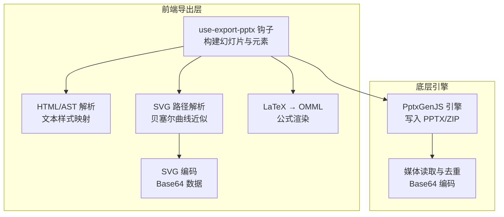
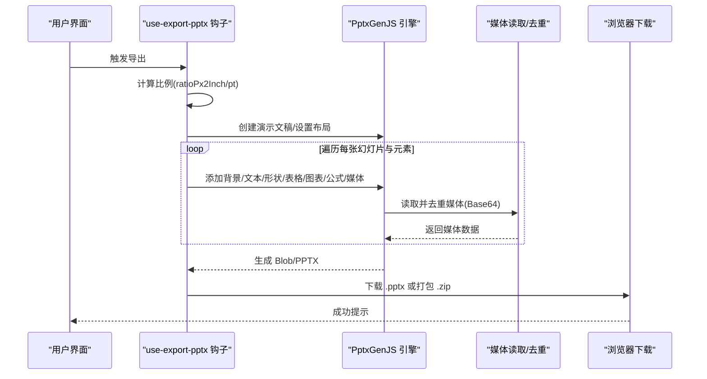
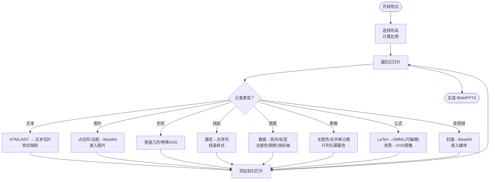
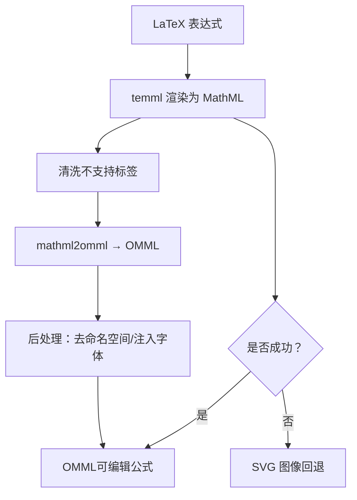
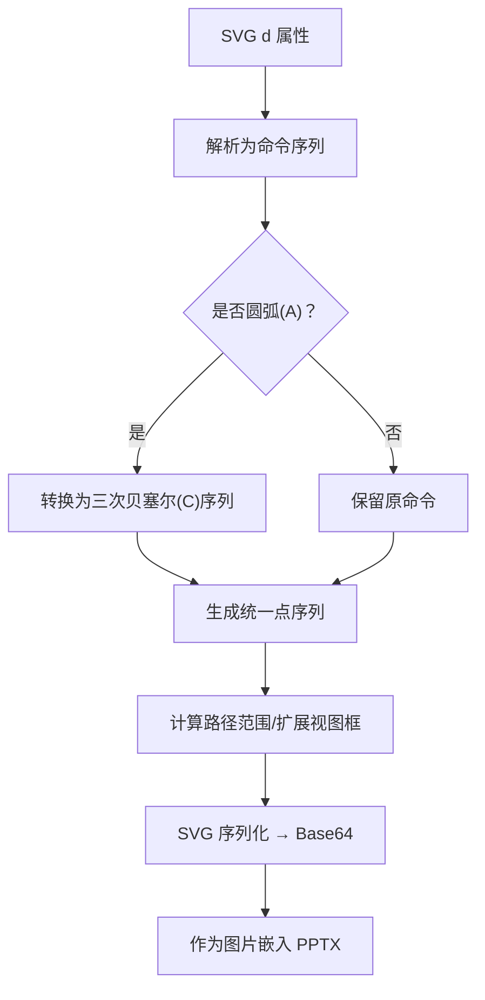
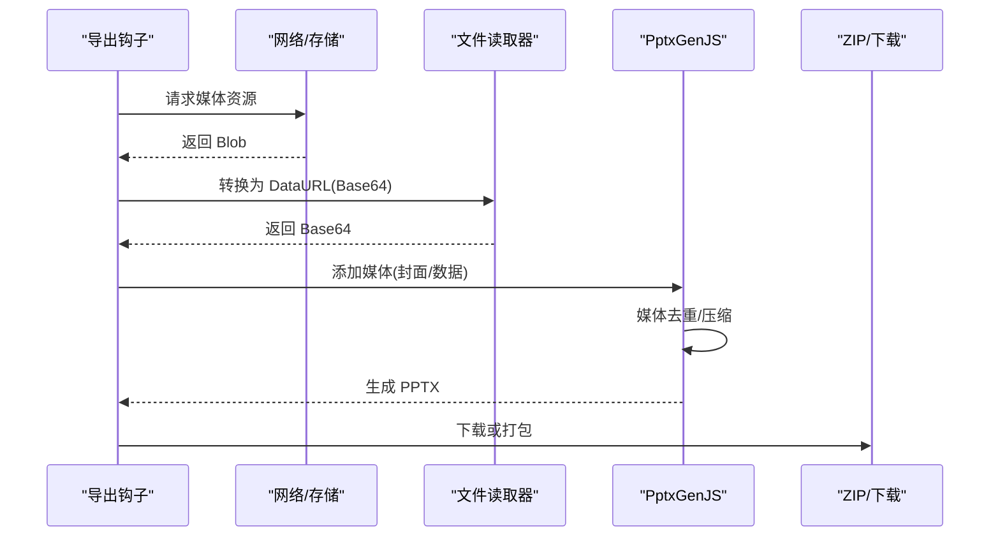
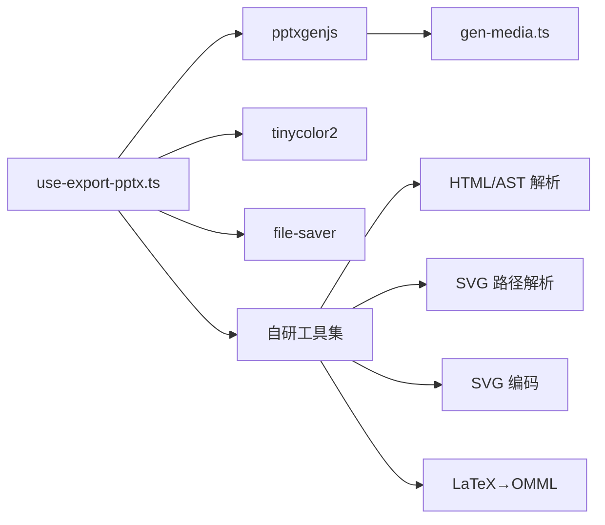

# PowerPoint 导出

<cite>
**本文引用的文件**
- [use-export-pptx.ts](file://lib/export/use-export-pptx.ts)
- [latex-to-omml.ts](file://lib/export/latex-to-omml.ts)
- [svg-path-parser.ts](file://lib/export/svg-path-parser.ts)
- [svg2base64.ts](file://lib/export/svg2base64.ts)
- [pptxgen.ts](file://packages/pptxgenjs/src/pptxgen.ts)
- [gen-media.ts](file://packages/pptxgenjs/src/gen-media.ts)
- [export.ts](file://lib/types/export.ts)
</cite>

## 目录
1. [简介](#简介)
2. [项目结构](#项目结构)
3. [核心组件](#核心组件)
4. [架构总览](#架构总览)
5. [详细组件分析](#详细组件分析)
6. [依赖关系分析](#依赖关系分析)
7. [性能与内存优化](#性能与内存优化)
8. [故障排查指南](#故障排查指南)
9. [结论](#结论)
10. [附录：导出配置与用法示例](#附录导出配置与用法示例)

## 简介
本文件面向 PowerPoint 导出功能，系统性阐述从课堂内容到 PPTX 的完整实现链路，覆盖以下关键主题：
- 幻灯片结构构建：布局选择、背景、元素分层与层级关系
- 样式保持：字体、颜色、阴影、描边、对齐、段落缩进等
- 多媒体内容嵌入：图片、视频、音频的获取、转换与嵌入策略
- use-export-pptx 钩子工作原理：导出流程、并发与去重、资源打包
- 数学公式转换：LaTeX 到 Office Math（OMML）的转换管线与回退机制
- SVG 转换：路径解析、贝塞尔曲线近似、矢量图形渲染
- 导出配置：分辨率、压缩、输出质量与浏览器下载行为
- 大文件与内存优化：媒体去重、按需加载、Base64 嵌入限制
- 实际使用示例与常见问题

## 项目结构
与 PowerPoint 导出直接相关的核心模块如下：
- 导出钩子与主流程：lib/export/use-export-pptx.ts
- 公式转换：lib/export/latex-to-omml.ts
- SVG 路径解析与编码：lib/export/svg-path-parser.ts、lib/export/svg2base64.ts
- 底层 PPTX 引擎：packages/pptxgenjs/src/pptxgen.ts、packages/pptxgenjs/src/gen-media.ts
- 导出类型定义：lib/types/export.ts

**图表来源**
- [use-export-pptx.ts:362-1065](file://lib/export/use-export-pptx.ts#L362-L1065)
- [latex-to-omml.ts:70-81](file://lib/export/latex-to-omml.ts#L70-L81)
- [svg-path-parser.ts:36-112](file://lib/export/svg-path-parser.ts#L36-L112)
- [svg2base64.ts:53-58](file://lib/export/svg2base64.ts#L53-L58)
- [pptxgen.ts:442-474](file://packages/pptxgenjs/src/pptxgen.ts#L442-L474)
- [gen-media.ts:37-72](file://packages/pptxgenjs/src/gen-media.ts#L37-L72)

**章节来源**
- [use-export-pptx.ts:1-1182](file://lib/export/use-export-pptx.ts#L1-L1182)
- [latex-to-omml.ts:1-82](file://lib/export/latex-to-omml.ts#L1-L82)
- [svg-path-parser.ts:1-142](file://lib/export/svg-path-parser.ts#L1-L142)
- [svg2base64.ts:1-59](file://lib/export/svg2base64.ts#L1-L59)
- [pptxgen.ts:442-474](file://packages/pptxgenjs/src/pptxgen.ts#L442-L474)
- [gen-media.ts:37-72](file://packages/pptxgenjs/src/gen-media.ts#L37-L72)

## 核心组件
- use-export-pptx 钩子：负责收集场景与画布数据、计算像素到英寸/点的比例、逐元素构建 PPTX、触发下载或打包为 ZIP
- LaTeX → OMML：通过 temml 渲染 LaTeX 为 MathML，再经由 mathml2omml 转换为 OMML，并注入 PPTX 可识别的字体与命名空间
- SVG 路径解析：将 SVG 路径命令解析为统一的内部点序列，圆弧（A）命令转换为三次贝塞尔（C）序列，便于引擎绘制
- SVG 编码：将 SVG DOM 序列化为字符串并进行 Base64 编码，作为内嵌图像插入
- PptxGenJS 引擎：负责最终的 PPTX 写入、媒体读取与去重、压缩与输出类型控制

**章节来源**
- [use-export-pptx.ts:362-1065](file://lib/export/use-export-pptx.ts#L362-L1065)
- [latex-to-omml.ts:70-81](file://lib/export/latex-to-omml.ts#L70-L81)
- [svg-path-parser.ts:36-112](file://lib/export/svg-path-parser.ts#L36-L112)
- [svg2base64.ts:53-58](file://lib/export/svg2base64.ts#L53-L58)
- [pptxgen.ts:442-474](file://packages/pptxgenjs/src/pptxgen.ts#L442-L474)

## 架构总览
下图展示从“课堂内容”到“PPTX”的端到端流程，包括元素类型、样式映射、公式与 SVG 处理、媒体嵌入与下载。

**图表来源**
- [use-export-pptx.ts:1069-1181](file://lib/export/use-export-pptx.ts#L1069-L1181)
- [pptxgen.ts:442-474](file://packages/pptxgenjs/src/pptxgen.ts#L442-L474)
- [gen-media.ts:37-72](file://packages/pptxgenjs/src/gen-media.ts#L37-L72)

## 详细组件分析

### use-export-pptx 钩子与导出流程
- 布局与比例
  - 根据视口宽高比选择布局（16x10、4x3、16x9），并计算像素到英寸与点的换算系数
- 幻灯片与元素构建
  - 遍历每张幻灯片及其元素，分别处理：文本、图片、形状（含特殊形状）、线段、图表、表格、公式（LaTeX/OMML/SVG）、音视频
  - 文本：将 HTML/AST 解析为多切片文本，映射字体、颜色、加粗、斜体、下划线、删除线、上/下标、对齐、列表符号、段前距、缩进等
  - 图片：支持占位符解析、远程/本地/数据 URI，统一转换为 Base64 后嵌入
  - 形状：普通几何图形走自定义几何绘制；特殊形状（如图标）通过临时 SVG 生成后以图像方式嵌入
  - 表格：根据主题色与行列头脚设置交替行/列着色，合并单元格隐藏占位
  - 图表：按系列与标签组织数据，自动推断主题色序列，设置坐标轴标签颜色与字号、图例位置与颜色
  - 公式：优先尝试 OMML（可编辑），失败时回退为 SVG 图像
  - 媒体：视频/音频先获取封面（优先 poster，否则首帧截图），再统一转换为 Base64 嵌入
- 下载与打包
  - 单独导出：生成 Blob 并触发浏览器下载
  - 资源包：同时生成 PPTX 与交互式 HTML 页面，打包为 ZIP

**图表来源**
- [use-export-pptx.ts:362-1065](file://lib/export/use-export-pptx.ts#L362-L1065)

**章节来源**
- [use-export-pptx.ts:1069-1181](file://lib/export/use-export-pptx.ts#L1069-L1181)
- [use-export-pptx.ts:362-1065](file://lib/export/use-export-pptx.ts#L362-L1065)

### LaTeX 到 OMML 的转换系统
- 转换管线
  - LaTeX → MathML（temml）
  - 清洗不被 mathml2omml 支持的标签（如 mpadded）
  - MathML → OMML（mathml2omml）
  - OMML 后处理：移除 Word 命名空间、注入 PPTX 可识别的字体声明（Cambria Math）
- 字号估算
  - 依据公式在盒内的高度与行数估算字号，提升渲染适配度
- 回退策略
  - 若 OMML 生成失败，则将公式渲染为 SVG 图像并以图片形式嵌入

**图表来源**
- [latex-to-omml.ts:70-81](file://lib/export/latex-to-omml.ts#L70-L81)
- [use-export-pptx.ts:885-948](file://lib/export/use-export-pptx.ts#L885-L948)

**章节来源**
- [latex-to-omml.ts:1-82](file://lib/export/latex-to-omml.ts#L1-L82)
- [use-export-pptx.ts:885-948](file://lib/export/use-export-pptx.ts#L885-L948)

### SVG 到 PPTX 的转换过程
- 路径解析
  - 将 SVG 路径命令标准化为内部点序列，圆弧（A）命令转换为三次贝塞尔（C）序列，便于引擎绘制
- 视图框与尺寸
  - 计算路径范围，结合描边宽度扩展 viewBox，确保渲染完整
- SVG 编码
  - 将 SVG DOM 序列化为字符串并进行 Base64 编码，作为内嵌图像插入
- 形状渲染
  - 特殊形状通过临时 SVG 生成后再以图像方式嵌入；普通形状则转换为自定义几何点序列

**图表来源**
- [svg-path-parser.ts:36-112](file://lib/export/svg-path-parser.ts#L36-L112)
- [svg-path-parser.ts:114-139](file://lib/export/svg-path-parser.ts#L114-L139)
- [svg2base64.ts:53-58](file://lib/export/svg2base64.ts#L53-L58)
- [use-export-pptx.ts:542-578](file://lib/export/use-export-pptx.ts#L542-L578)
- [use-export-pptx.ts:906-947](file://lib/export/use-export-pptx.ts#L906-L947)

**章节来源**
- [svg-path-parser.ts:1-142](file://lib/export/svg-path-parser.ts#L1-L142)
- [svg2base64.ts:1-59](file://lib/export/svg2base64.ts#L1-L59)
- [use-export-pptx.ts:542-578](file://lib/export/use-export-pptx.ts#L542-L578)
- [use-export-pptx.ts:906-947](file://lib/export/use-export-pptx.ts#L906-L947)

### 多媒体内容嵌入策略
- 图片
  - 支持占位符解析、远程/本地/数据 URI；统一转换为 Base64 后嵌入
- 视频/音频
  - 获取封面：优先 poster，否则通过首帧截图生成 PNG Base64
  - 媒体数据：统一转换为 Base64 后嵌入，自动推断扩展名
- 媒体去重
  - 引擎对相同路径的媒体标记重复项，仅读取一次并复用数据，降低 IO 与内存占用

**图表来源**
- [use-export-pptx.ts:950-1060](file://lib/export/use-export-pptx.ts#L950-L1060)
- [gen-media.ts:37-72](file://packages/pptxgenjs/src/gen-media.ts#L37-L72)

**章节来源**
- [use-export-pptx.ts:950-1060](file://lib/export/use-export-pptx.ts#L950-L1060)
- [gen-media.ts:37-72](file://packages/pptxgenjs/src/gen-media.ts#L37-L72)

## 依赖关系分析
- use-export-pptx.ts 依赖：
  - pptxgenjs：用于创建幻灯片、添加元素、写入 PPTX
  - tinycolor2：颜色格式化与混合
  - file-saver：浏览器下载
  - 自研工具：HTML/AST 解析、SVG 路径解析、SVG 编码、LaTeX→OMML
  - store：媒体生成状态、画布与场景数据
- 引擎层：
  - PptxGenJS 提供布局、写入、压缩、输出类型控制
  - gen-media 提供媒体读取、去重与错误处理

**图表来源**
- [use-export-pptx.ts:1-30](file://lib/export/use-export-pptx.ts#L1-L30)
- [pptxgen.ts:442-474](file://packages/pptxgenjs/src/pptxgen.ts#L442-L474)
- [gen-media.ts:37-72](file://packages/pptxgenjs/src/gen-media.ts#L37-L72)

**章节来源**
- [use-export-pptx.ts:1-30](file://lib/export/use-export-pptx.ts#L1-L30)
- [pptxgen.ts:442-474](file://packages/pptxgenjs/src/pptxgen.ts#L442-L474)
- [gen-media.ts:37-72](file://packages/pptxgenjs/src/gen-media.ts#L37-L72)

## 性能与内存优化
- 媒体去重
  - 对相同路径的媒体标记重复项，仅读取一次并复用数据，避免重复 IO 与内存占用
- 按需加载
  - 图片/音视频在嵌入前统一转换为 Base64，避免离线 PPTX 中无法访问外部资源
- 压缩与输出类型
  - 引擎支持压缩与多种输出类型，浏览器默认使用 Blob 输出，可按需开启压缩
- 比例换算
  - 统一使用像素到英寸/点的换算系数，减少单位换算误差与重复计算
- 大文件策略
  - 使用 JSZip 打包资源包，避免一次性生成超大对象；媒体读取采用流式转换

**章节来源**
- [gen-media.ts:37-72](file://packages/pptxgenjs/src/gen-media.ts#L37-L72)
- [pptxgen.ts:7164-7168](file://packages/pptxgenjs/src/pptxgen.ts#L7164-L7168)
- [use-export-pptx.ts:1069-1181](file://lib/export/use-export-pptx.ts#L1069-L1181)

## 故障排查指南
- 公式未显示或不可编辑
  - 检查 OMML 生成是否成功；若失败，确认是否回退为 SVG 图像
  - 确认公式所在盒高与行数估算合理
- 图片/音视频未嵌入
  - 检查占位符是否已解析为可用 URL；确认网络请求与跨域设置
  - 确认 Base64 转换是否成功；必要时检查网络异常与超时
- 媒体重复加载导致卡顿
  - 确认媒体去重逻辑生效；避免重复路径多次读取
- 下载失败或文件损坏
  - 检查浏览器下载库调用与 Blob 生成；确认输出类型与压缩参数正确

**章节来源**
- [use-export-pptx.ts:950-1060](file://lib/export/use-export-pptx.ts#L950-L1060)
- [latex-to-omml.ts:70-81](file://lib/export/latex-to-omml.ts#L70-L81)
- [gen-media.ts:37-72](file://packages/pptxgenjs/src/gen-media.ts#L37-L72)

## 结论
该导出系统以 use-export-pptx 钩子为核心，结合自研的 HTML/AST、SVG 路径解析与 LaTeX→OMML 工具，配合 PptxGenJS 引擎完成从课堂内容到高质量 PPTX 的全链路转换。系统在样式保持、公式与 SVG 渲染、多媒体嵌入与资源去重方面具备完善的实现与优化策略，适合在浏览器端进行大规模课堂内容导出与交付。

## 附录：导出配置与用法示例
- 导出类型枚举
  - 包含 image、pdf、json、pptx、pptist 等导出类型标识
- 导出钩子 API
  - exportPPTX：导出当前场景为 PPTX
  - exportResourcePack：导出 PPTX + 交互式 HTML 页面的资源包（ZIP）
  - exporting：导出中状态，避免重复触发
- 导出配置要点
  - 布局：根据视口宽高比自动选择
  - 比例：ratioPx2Inch 与 ratioPx2Pt 用于像素到英寸/点的换算
  - 压缩：浏览器默认 Blob 输出，可通过引擎参数启用压缩
  - 下载：使用 file-saver 触发浏览器下载

**章节来源**
- [export.ts:1-2](file://lib/types/export.ts#L1-L2)
- [use-export-pptx.ts:1069-1181](file://lib/export/use-export-pptx.ts#L1069-L1181)
- [pptxgen.ts:7164-7168](file://packages/pptxgenjs/src/pptxgen.ts#L7164-L7168)