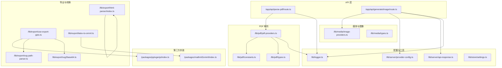
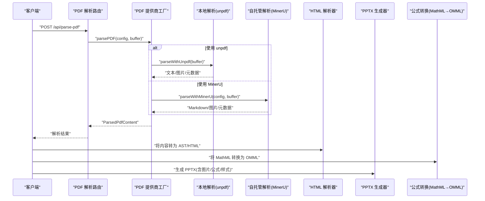
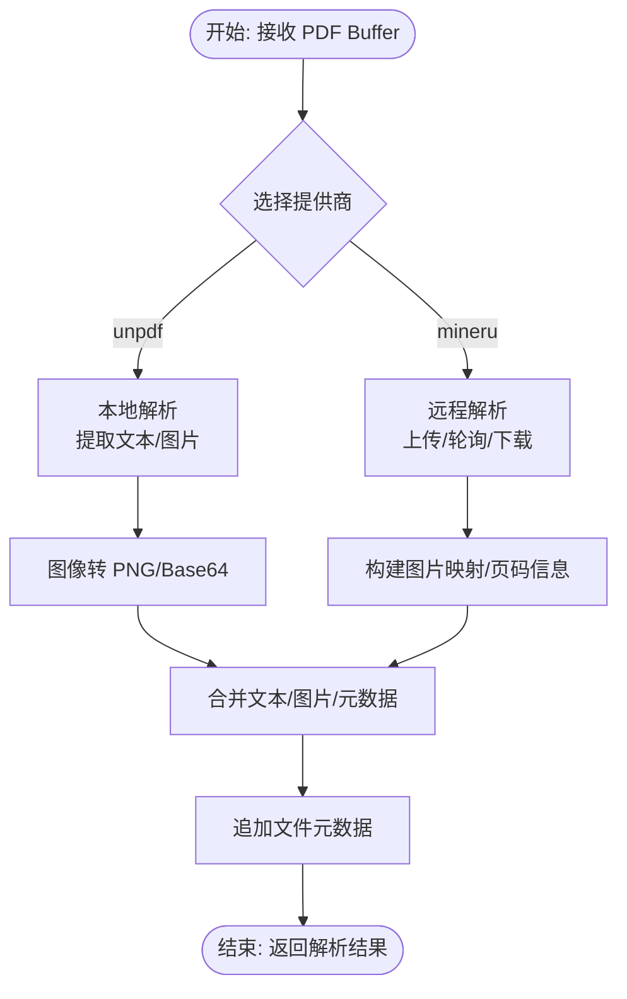
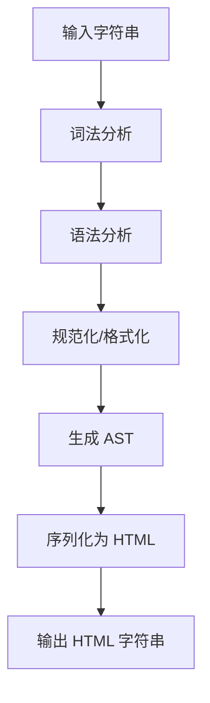
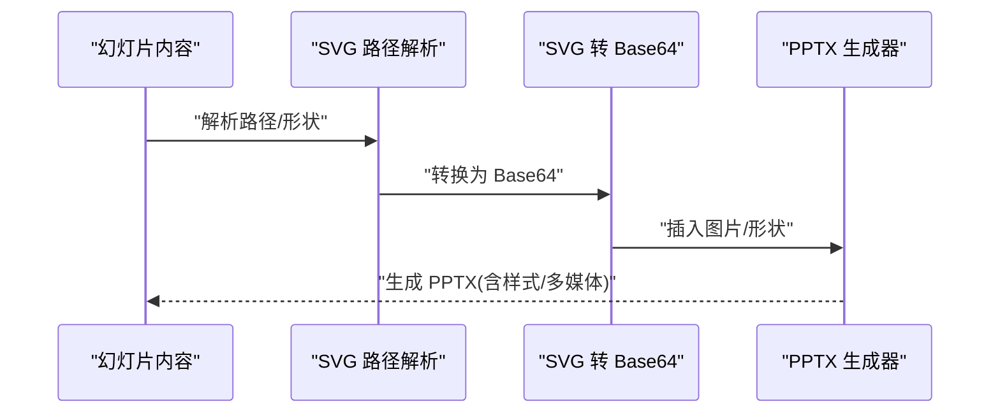
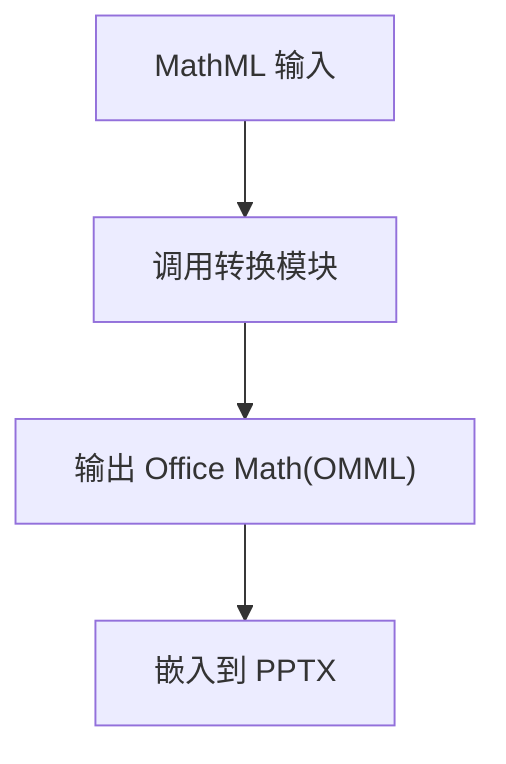
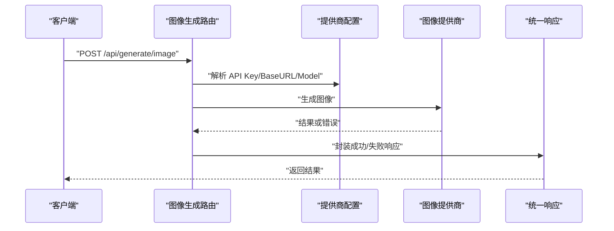
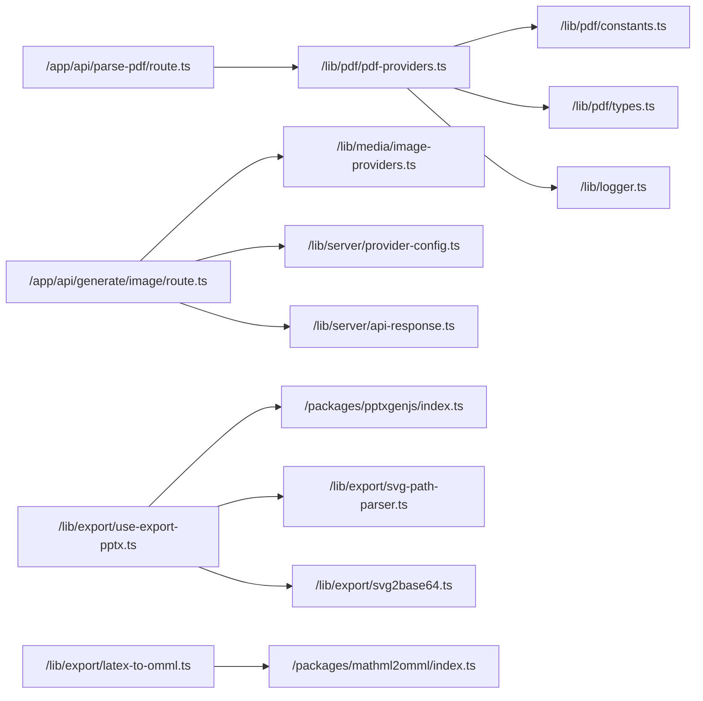

# 导出和集成

<cite>
**本文引用的文件**
- [app/api/parse-pdf/route.ts](file://app/api/parse-pdf/route.ts)
- [lib/pdf/pdf-providers.ts](file://lib/pdf/pdf-providers.ts)
- [lib/pdf/constants.ts](file://lib/pdf/constants.ts)
- [lib/pdf/types.ts](file://lib/pdf/types.ts)
- [lib/export/use-export-pptx.ts](file://lib/export/use-export-pptx.ts)
- [lib/export/latex-to-omml.ts](file://lib/export/latex-to-omml.ts)
- [lib/export/html-parser/index.ts](file://lib/export/html-parser/index.ts)
- [lib/export/html-parser/lexer.ts](file://lib/export/html-parser/lexer.ts)
- [lib/export/html-parser/parser.ts](file://lib/export/html-parser/parser.ts)
- [lib/export/html-parser/format.ts](file://lib/export/html-parser/format.ts)
- [lib/export/html-parser/stringify.ts](file://lib/export/html-parser/stringify.ts)
- [lib/export/svg-path-parser.ts](file://lib/export/svg-path-parser.ts)
- [lib/export/svg2base64.ts](file://lib/export/svg2base64.ts)
- [packages/pptxgenjs/index.ts](file://packages/pptxgenjs/index.ts)
- [packages/mathml2omml/index.ts](file://packages/mathml2omml/index.ts)
- [app/api/generate/image/route.ts](file://app/api/generate/image/route.ts)
- [lib/media/image-providers.ts](file://lib/media/image-providers.ts)
- [lib/media/types.ts](file://lib/media/types.ts)
- [lib/server/provider-config.ts](file://lib/server/provider-config.ts)
- [lib/server/api-response.ts](file://lib/server/api-response.ts)
- [lib/logger.ts](file://lib/logger.ts)
- [lib/store/settings.ts](file://lib/store/settings.ts)
</cite>

## 目录
1. [简介](#简介)
2. [项目结构](#项目结构)
3. [核心组件](#核心组件)
4. [架构总览](#架构总览)
5. [详细组件分析](#详细组件分析)
6. [依赖关系分析](#依赖关系分析)
7. [性能考量](#性能考量)
8. [故障排查指南](#故障排查指南)
9. [结论](#结论)
10. [附录](#附录)

## 简介
本技术文档聚焦于系统的导出与集成能力，覆盖以下方面：
- PowerPoint 导出：PPTX 文件生成、样式保持与多媒体嵌入
- HTML 导出：交互式网页生成与打包机制
- PDF 处理：解析、内容提取与格式转换
- 第三方集成：API 封装、数据映射与错误处理
- 数学公式转换：MathML 到 Office Math 的转换与公式渲染
- 导出配置：格式选择、质量设置与输出路径
- 性能优化与大文件处理策略
- 实际使用示例与集成最佳实践

## 项目结构
围绕导出与集成的关键目录与文件如下：
- 导出与解析逻辑：lib/export、lib/pdf
- API 入口：app/api 下的 parse-pdf、generate/image 等路由
- 第三方封装包：packages/pptxgenjs、packages/mathml2omml
- 媒体与图像生成：lib/media、app/api/generate/image
- 配置与响应工具：lib/server、lib/logger、lib/store

图表来源
- [app/api/parse-pdf/route.ts:1-65](file://app/api/parse-pdf/route.ts#L1-L65)
- [lib/pdf/pdf-providers.ts:1-464](file://lib/pdf/pdf-providers.ts#L1-L464)
- [lib/pdf/constants.ts](file://lib/pdf/constants.ts)
- [lib/pdf/types.ts](file://lib/pdf/types.ts)
- [lib/export/use-export-pptx.ts](file://lib/export/use-export-pptx.ts)
- [lib/export/html-parser/index.ts:1-16](file://lib/export/html-parser/index.ts#L1-L16)
- [lib/export/latex-to-omml.ts](file://lib/export/latex-to-omml.ts)
- [lib/export/svg-path-parser.ts](file://lib/export/svg-path-parser.ts)
- [lib/export/svg2base64.ts](file://lib/export/svg2base64.ts)
- [packages/pptxgenjs/index.ts](file://packages/pptxgenjs/index.ts)
- [packages/mathml2omml/index.ts](file://packages/mathml2omml/index.ts)
- [app/api/generate/image/route.ts:1-79](file://app/api/generate/image/route.ts#L1-L79)
- [lib/media/image-providers.ts](file://lib/media/image-providers.ts)
- [lib/media/types.ts](file://lib/media/types.ts)
- [lib/server/provider-config.ts](file://lib/server/provider-config.ts)
- [lib/server/api-response.ts](file://lib/server/api-response.ts)
- [lib/logger.ts](file://lib/logger.ts)
- [lib/store/settings.ts](file://lib/store/settings.ts)

章节来源
- [app/api/parse-pdf/route.ts:1-65](file://app/api/parse-pdf/route.ts#L1-L65)
- [lib/pdf/pdf-providers.ts:1-464](file://lib/pdf/pdf-providers.ts#L1-L464)
- [lib/pdf/constants.ts](file://lib/pdf/constants.ts)
- [lib/pdf/types.ts](file://lib/pdf/types.ts)
- [lib/export/use-export-pptx.ts](file://lib/export/use-export-pptx.ts)
- [lib/export/html-parser/index.ts:1-16](file://lib/export/html-parser/index.ts#L1-L16)
- [lib/export/latex-to-omml.ts](file://lib/export/latex-to-omml.ts)
- [lib/export/svg-path-parser.ts](file://lib/export/svg-path-parser.ts)
- [lib/export/svg2base64.ts](file://lib/export/svg2base64.ts)
- [packages/pptxgenjs/index.ts](file://packages/pptxgenjs/index.ts)
- [packages/mathml2omml/index.ts](file://packages/mathml2omml/index.ts)
- [app/api/generate/image/route.ts:1-79](file://app/api/generate/image/route.ts#L1-L79)
- [lib/media/image-providers.ts](file://lib/media/image-providers.ts)
- [lib/media/types.ts](file://lib/media/types.ts)
- [lib/server/provider-config.ts](file://lib/server/provider-config.ts)
- [lib/server/api-response.ts](file://lib/server/api-response.ts)
- [lib/logger.ts](file://lib/logger.ts)
- [lib/store/settings.ts](file://lib/store/settings.ts)

## 核心组件
- PDF 解析与提取：统一入口函数负责路由到不同提供商（本地 unpdf、自托管 MinerU），并返回文本、图片与元数据；支持错误处理与性能统计。
- HTML 导出与解析：提供从字符串到 AST、再回转为 HTML 的轻量级解析器，便于在导出流程中进行结构化处理与格式化。
- PowerPoint 导出：通过封装第三方库生成 PPTX，结合 SVG 路径解析与 SVG 转 Base64 工具，实现图形与多媒体元素的嵌入。
- 数学公式转换：提供从 MathML 到 Office Math 的转换模块，支撑公式渲染与导出。
- 图像生成与集成：图像生成 API 支持多提供商、可选模型与尺寸推断，并对敏感内容进行拦截与反馈。
- 配置与日志：集中化的提供商配置解析、统一的 API 响应封装与日志记录。

章节来源
- [lib/pdf/pdf-providers.ts:152-189](file://lib/pdf/pdf-providers.ts#L152-L189)
- [lib/pdf/pdf-providers.ts:194-263](file://lib/pdf/pdf-providers.ts#L194-L263)
- [lib/pdf/pdf-providers.ts:276-348](file://lib/pdf/pdf-providers.ts#L276-L348)
- [lib/export/html-parser/index.ts:9-15](file://lib/export/html-parser/index.ts#L9-L15)
- [lib/export/use-export-pptx.ts](file://lib/export/use-export-pptx.ts)
- [lib/export/latex-to-omml.ts](file://lib/export/latex-to-omml.ts)
- [lib/export/svg-path-parser.ts](file://lib/export/svg-path-parser.ts)
- [lib/export/svg2base64.ts](file://lib/export/svg2base64.ts)
- [packages/pptxgenjs/index.ts](file://packages/pptxgenjs/index.ts)
- [packages/mathml2omml/index.ts](file://packages/mathml2omml/index.ts)
- [app/api/generate/image/route.ts:29-78](file://app/api/generate/image/route.ts#L29-L78)
- [lib/server/provider-config.ts](file://lib/server/provider-config.ts)
- [lib/server/api-response.ts](file://lib/server/api-response.ts)
- [lib/logger.ts](file://lib/logger.ts)

## 架构总览
下图展示从 API 请求到导出产物的端到端流程，包括 PDF 解析、HTML 处理、PPTX 生成与公式转换等关键环节。

图表来源
- [app/api/parse-pdf/route.ts:10-59](file://app/api/parse-pdf/route.ts#L10-L59)
- [lib/pdf/pdf-providers.ts:152-189](file://lib/pdf/pdf-providers.ts#L152-L189)
- [lib/pdf/pdf-providers.ts:194-263](file://lib/pdf/pdf-providers.ts#L194-L263)
- [lib/pdf/pdf-providers.ts:276-348](file://lib/pdf/pdf-providers.ts#L276-L348)
- [lib/export/html-parser/index.ts:9-15](file://lib/export/html-parser/index.ts#L9-L15)
- [lib/export/latex-to-omml.ts](file://lib/export/latex-to-omml.ts)
- [packages/pptxgenjs/index.ts](file://packages/pptxgenjs/index.ts)

## 详细组件分析

### PDF 解析与导出集成
- 统一入口：parsePDF 根据 providerId 分发到具体实现，内置校验与超时统计。
- 本地解析：unpdf 直接解析 PDF 文本与图片，使用 sharp 进行图像格式转换与错误降级。
- 自托管解析：MinerU 通过表单上传与远程 API 获取结构化内容与图片映射。
- 元数据增强：在 API 层追加文件名、大小与页数等信息，便于前端展示与导出决策。

图表来源
- [lib/pdf/pdf-providers.ts:152-189](file://lib/pdf/pdf-providers.ts#L152-L189)
- [lib/pdf/pdf-providers.ts:194-263](file://lib/pdf/pdf-providers.ts#L194-L263)
- [lib/pdf/pdf-providers.ts:276-348](file://lib/pdf/pdf-providers.ts#L276-L348)
- [app/api/parse-pdf/route.ts:48-57](file://app/api/parse-pdf/route.ts#L48-L57)

章节来源
- [lib/pdf/pdf-providers.ts:1-138](file://lib/pdf/pdf-providers.ts#L1-L138)
- [lib/pdf/pdf-providers.ts:152-189](file://lib/pdf/pdf-providers.ts#L152-L189)
- [lib/pdf/pdf-providers.ts:194-263](file://lib/pdf/pdf-providers.ts#L194-L263)
- [lib/pdf/pdf-providers.ts:276-348](file://lib/pdf/pdf-providers.ts#L276-L348)
- [app/api/parse-pdf/route.ts:1-65](file://app/api/parse-pdf/route.ts#L1-L65)

### HTML 导出系统与交互式网页生成
- 轻量解析器：提供 toAST 与 toHTML，支持从字符串到 AST 再回到 HTML 的往返转换，便于在导出前进行结构化处理与格式化。
- 适用场景：在生成 HTML 报告或交互式网页时，先解析再按需重写节点属性与结构，最后序列化输出。

图表来源
- [lib/export/html-parser/index.ts:9-15](file://lib/export/html-parser/index.ts#L9-L15)
- [lib/export/html-parser/lexer.ts](file://lib/export/html-parser/lexer.ts)
- [lib/export/html-parser/parser.ts](file://lib/export/html-parser/parser.ts)
- [lib/export/html-parser/format.ts](file://lib/export/html-parser/format.ts)
- [lib/export/html-parser/stringify.ts](file://lib/export/html-parser/stringify.ts)

章节来源
- [lib/export/html-parser/index.ts:1-16](file://lib/export/html-parser/index.ts#L1-L16)

### PowerPoint 导出：PPTX 文件生成、样式保持与多媒体嵌入
- PPTX 生成：通过封装第三方库实现 PPTX 创建与页面元素添加。
- 样式保持：在导出过程中保留字体、颜色、对齐等样式信息。
- 多媒体嵌入：SVG 路径解析与 SVG 转 Base64 工具用于将矢量图形与图片嵌入幻灯片。
- 配置与路径：导出配置项（如格式、质量、输出路径）由导出钩子与外部库共同控制。

图表来源
- [lib/export/use-export-pptx.ts](file://lib/export/use-export-pptx.ts)
- [lib/export/svg-path-parser.ts](file://lib/export/svg-path-parser.ts)
- [lib/export/svg2base64.ts](file://lib/export/svg2base64.ts)
- [packages/pptxgenjs/index.ts](file://packages/pptxgenjs/index.ts)

章节来源
- [lib/export/use-export-pptx.ts](file://lib/export/use-export-pptx.ts)
- [lib/export/svg-path-parser.ts](file://lib/export/svg-path-parser.ts)
- [lib/export/svg2base64.ts](file://lib/export/svg2base64.ts)
- [packages/pptxgenjs/index.ts](file://packages/pptxgenjs/index.ts)

### 数学公式转换：MathML 到 Office Math
- 转换模块：提供从 MathML 到 Office Math 的转换能力，确保公式在 Office 生态中的正确渲染。
- 集成方式：在导出流程中调用转换模块，将公式节点替换为可渲染的 OMML 结构，随后由 PPTX 生成器嵌入。

图表来源
- [lib/export/latex-to-omml.ts](file://lib/export/latex-to-omml.ts)
- [packages/mathml2omml/index.ts](file://packages/mathml2omml/index.ts)

章节来源
- [lib/export/latex-to-omml.ts](file://lib/export/latex-to-omml.ts)
- [packages/mathml2omml/index.ts](file://packages/mathml2omml/index.ts)

### 第三方集成：API 封装、数据映射与错误处理
- API 封装：图像生成 API 支持多提供商、可选模型与尺寸推断，统一响应格式与错误分类。
- 数据映射：PDF 解析结果统一为文本、图片数组与元数据对象，便于后续导出处理。
- 错误处理：对内容安全过滤、网络异常、配置缺失等情况进行分类与降级处理。

图表来源
- [app/api/generate/image/route.ts:29-78](file://app/api/generate/image/route.ts#L29-L78)
- [lib/server/provider-config.ts](file://lib/server/provider-config.ts)
- [lib/server/api-response.ts](file://lib/server/api-response.ts)

章节来源
- [app/api/generate/image/route.ts:1-79](file://app/api/generate/image/route.ts#L1-L79)
- [lib/server/provider-config.ts](file://lib/server/provider-config.ts)
- [lib/server/api-response.ts](file://lib/server/api-response.ts)
- [lib/logger.ts](file://lib/logger.ts)

## 依赖关系分析
- 组件内聚与耦合
  - PDF 解析模块内部通过常量与类型定义解耦提供商列表与配置，工厂函数仅负责分发与错误处理。
  - 导出模块通过独立工具函数与第三方封装包实现低耦合扩展。
- 外部依赖
  - PDF：unpdf、sharp
  - 图像：第三方提供商 SDK（通过统一接口接入）
  - PPTX：第三方库封装
  - 公式：第三方转换库封装

图表来源
- [app/api/parse-pdf/route.ts:1-65](file://app/api/parse-pdf/route.ts#L1-L65)
- [lib/pdf/pdf-providers.ts:1-464](file://lib/pdf/pdf-providers.ts#L1-L464)
- [lib/pdf/constants.ts](file://lib/pdf/constants.ts)
- [lib/pdf/types.ts](file://lib/pdf/types.ts)
- [lib/export/use-export-pptx.ts](file://lib/export/use-export-pptx.ts)
- [lib/export/latex-to-omml.ts](file://lib/export/latex-to-omml.ts)
- [lib/export/svg-path-parser.ts](file://lib/export/svg-path-parser.ts)
- [lib/export/svg2base64.ts](file://lib/export/svg2base64.ts)
- [packages/pptxgenjs/index.ts](file://packages/pptxgenjs/index.ts)
- [packages/mathml2omml/index.ts](file://packages/mathml2omml/index.ts)
- [app/api/generate/image/route.ts:1-79](file://app/api/generate/image/route.ts#L1-L79)
- [lib/media/image-providers.ts](file://lib/media/image-providers.ts)
- [lib/server/provider-config.ts](file://lib/server/provider-config.ts)
- [lib/server/api-response.ts](file://lib/server/api-response.ts)
- [lib/logger.ts](file://lib/logger.ts)

章节来源
- [lib/pdf/pdf-providers.ts:1-464](file://lib/pdf/pdf-providers.ts#L1-L464)
- [app/api/parse-pdf/route.ts:1-65](file://app/api/parse-pdf/route.ts#L1-L65)
- [app/api/generate/image/route.ts:1-79](file://app/api/generate/image/route.ts#L1-L79)
- [lib/export/use-export-pptx.ts](file://lib/export/use-export-pptx.ts)
- [lib/export/latex-to-omml.ts](file://lib/export/latex-to-omml.ts)
- [lib/export/svg-path-parser.ts](file://lib/export/svg-path-parser.ts)
- [lib/export/svg2base64.ts](file://lib/export/svg2base64.ts)
- [packages/pptxgenjs/index.ts](file://packages/pptxgenjs/index.ts)
- [packages/mathml2omml/index.ts](file://packages/mathml2omml/index.ts)

## 性能考量
- PDF 解析
  - 本地解析：优先使用 unpdf 进行快速文本与图片提取；对单页失败进行降级处理，避免整页阻塞。
  - 远程解析：MinerU 采用异步任务与轮询，建议设置合理的超时与重试策略。
- 图像处理
  - 使用 sharp 进行高效图像转换与压缩，建议根据目标分辨率调整采样比例。
- 导出生成
  - PPTX 生成时批量插入图片与公式，注意内存占用与并发限制。
  - 对超大文件采用流式处理或分页导出策略。
- 缓存与复用
  - 对解析结果与转换中间产物进行缓存，减少重复计算。

## 故障排查指南
- PDF 解析失败
  - 检查提供商配置是否正确（API Key、Base URL）。
  - 查看日志定位具体页码或图片转换错误。
- 图像生成被拦截
  - 关注内容安全过滤错误码，调整提示词或更换提供商。
- 导出异常
  - 确认导出配置项（格式、质量、输出路径）是否有效。
  - 检查第三方库版本兼容性与权限。

章节来源
- [app/api/parse-pdf/route.ts:14-20](file://app/api/parse-pdf/route.ts#L14-L20)
- [app/api/parse-pdf/route.ts:60-63](file://app/api/parse-pdf/route.ts#L60-L63)
- [app/api/generate/image/route.ts:68-77](file://app/api/generate/image/route.ts#L68-L77)
- [lib/pdf/pdf-providers.ts:244-250](file://lib/pdf/pdf-providers.ts#L244-L250)
- [lib/pdf/pdf-providers.ts:327-330](file://lib/pdf/pdf-providers.ts#L327-L330)

## 结论
本系统以模块化设计实现了从 PDF 解析、HTML 处理到 PPTX 导出与公式转换的完整链路。通过统一的提供商接口与错误处理机制，保证了在多源数据与复杂导出需求下的稳定性与可扩展性。建议在生产环境中结合缓存、限流与监控进一步提升性能与可靠性。

## 附录
- 实际使用示例与集成最佳实践
  - PDF 解析：通过 /api/parse-pdf 上传 PDF，选择合适的提供商，解析完成后在前端展示并触发导出。
  - HTML 导出：先将内容转为 AST，再按需修改节点属性，最后序列化为 HTML。
  - PPTX 导出：准备幻灯片内容与多媒体资源，调用导出钩子生成 PPTX。
  - 公式转换：在导出前将 MathML 节点转换为 OMML 并嵌入 PPTX。
  - 图像生成：在需要时调用 /api/generate/image，传入提供商与参数，处理返回结果。