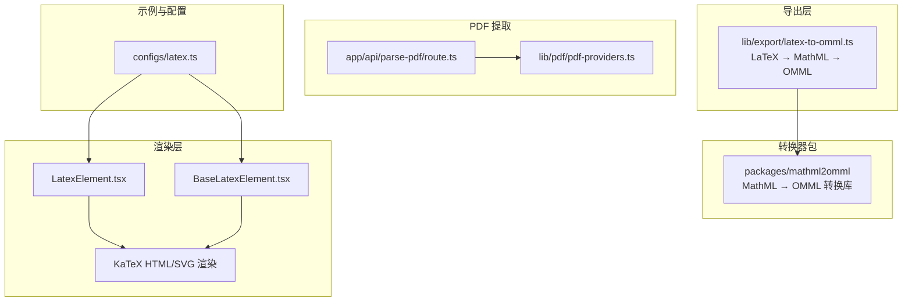
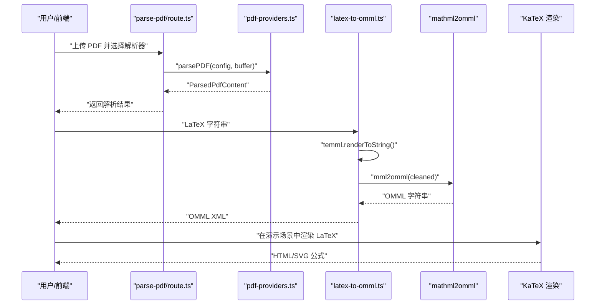
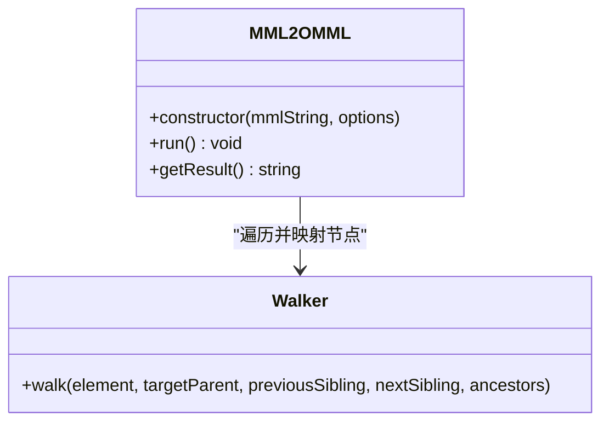
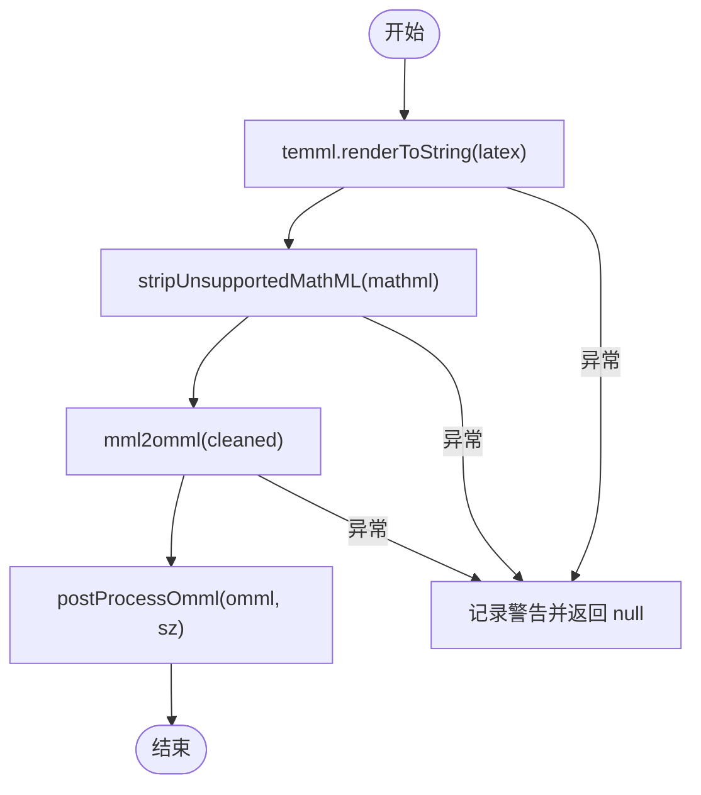
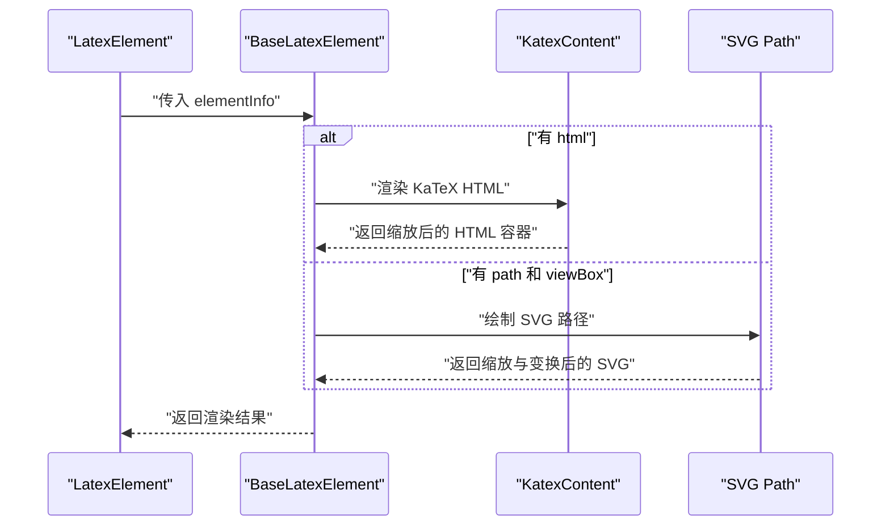
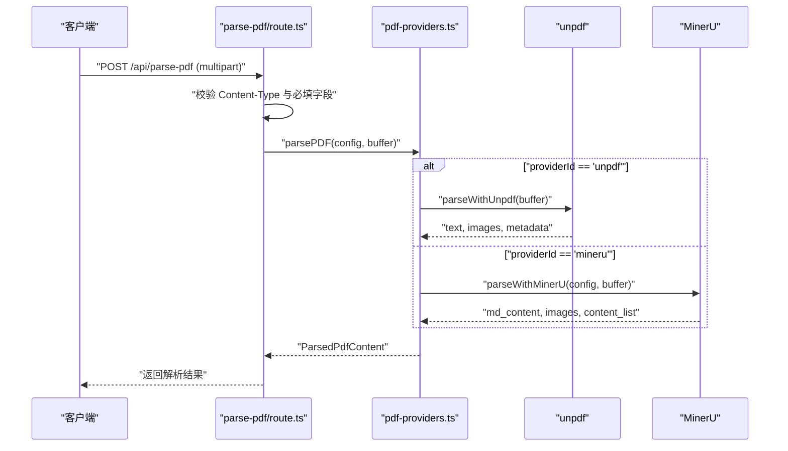
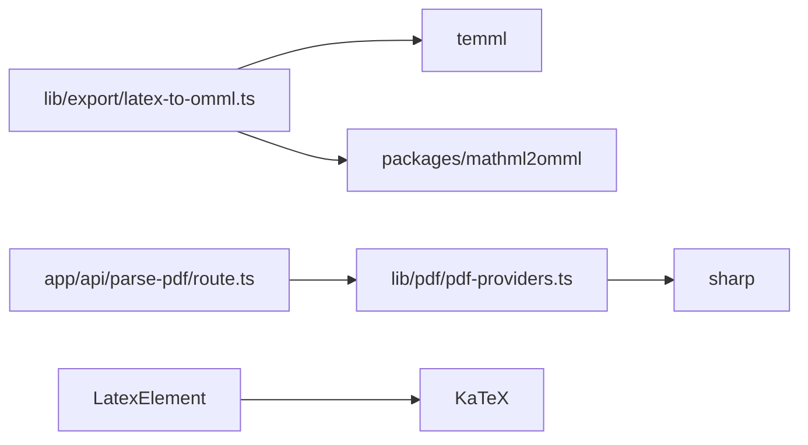

# 数学公式转换

<cite>
**本文引用的文件**
- [packages/mathml2omml/package.json](file://packages/mathml2omml/package.json)
- [packages/mathml2omml/src/index.js](file://packages/mathml2omml/src/index.js)
- [packages/mathml2omml/src/index.d.ts](file://packages/mathml2omml/src/index.d.ts)
- [packages/mathml2omml/src/walker.js](file://packages/mathml2omml/src/walker.js)
- [lib/export/latex-to-omml.ts](file://lib/export/latex-to-omml.ts)
- [configs/latex.ts](file://configs/latex.ts)
- [components/slide-renderer/components/element/LatexElement/BaseLatexElement.tsx](file://components/slide-renderer/components/element/LatexElement/BaseLatexElement.tsx)
- [components/slide-renderer/components/element/LatexElement/index.tsx](file://components/slide-renderer/components/element/LatexElement/index.tsx)
- [app/api/parse-pdf/route.ts](file://app/api/parse-pdf/route.ts)
- [lib/pdf/pdf-providers.ts](file://lib/pdf/pdf-providers.ts)
- [README.md](file://README.md)
</cite>

## 目录
1. [简介](#简介)
2. [项目结构](#项目结构)
3. [核心组件](#核心组件)
4. [架构总览](#架构总览)
5. [详细组件分析](#详细组件分析)
6. [依赖关系分析](#依赖关系分析)
7. [性能考量](#性能考量)
8. [故障排查指南](#故障排查指南)
9. [结论](#结论)
10. [附录](#附录)

## 简介
本技术文档面向“数学公式转换系统”，聚焦以下目标：
- 深入解释 MathML 到 Office Math（OMML）的转换算法：语法树解析、节点映射与格式转换。
- 详述 LaTeX 公式处理流程：LaTeX 到 MathML 的转换机制与公式渲染优化。
- 文档化公式渲染引擎：SVG 生成、样式应用与交互支持。
- 解释公式识别与提取技术：OCR 集成与自动检测算法。
- 提供质量控制：精度验证、格式检查与兼容性测试。
- 性能优化策略：公式缓存、批量处理与异步转换。
- 支持的公式类型与限制条件，以及转换失败的处理方案。
- 实际使用示例与调试工具说明。

## 项目结构
该仓库采用多包工作区组织，数学公式转换能力主要分布在以下位置：
- 转换器包：packages/mathml2omml（独立的 MathML 到 OMML 转换库）
- 导出层：lib/export/latex-to-omml.ts（LaTeX → MathML → OMML 的桥接）
- 渲染层：components/slide-renderer/components/element/LatexElement（KaTeX HTML/SVG 渲染）
- PDF 提取：lib/pdf/pdf-providers.ts 与 app/api/parse-pdf/route.ts（含 OCR 的公式/图片提取）
- 示例与配置：configs/latex.ts（内置公式样例）

**图表来源**
- [packages/mathml2omml/package.json:1-45](file://packages/mathml2omml/package.json#L1-L45)
- [lib/export/latex-to-omml.ts:1-81](file://lib/export/latex-to-omml.ts#L1-L81)
- [components/slide-renderer/components/element/LatexElement/BaseLatexElement.tsx:1-121](file://components/slide-renderer/components/element/LatexElement/BaseLatexElement.tsx#L1-L121)
- [components/slide-renderer/components/element/LatexElement/index.tsx:1-106](file://components/slide-renderer/components/element/LatexElement/index.tsx#L1-L106)
- [app/api/parse-pdf/route.ts:1-65](file://app/api/parse-pdf/route.ts#L1-L65)
- [lib/pdf/pdf-providers.ts:1-464](file://lib/pdf/pdf-providers.ts#L1-L464)
- [configs/latex.ts:1-275](file://configs/latex.ts#L1-L275)

**章节来源**
- [README.md:372-426](file://README.md#L372-L426)

## 核心组件
- MathML 到 OMML 转换器（packages/mathml2omml）
  - 提供 mml2omml 函数与 MML2OMML 类，负责将 MathML 字符串转换为 OMML 字符串。
  - 关键流程：解析输入 → 语法树遍历 → 节点映射 → 输出 OMML。
- LaTeX 到 OMML 导出桥接（lib/export/latex-to-omml.ts）
  - 使用 temml 将 LaTeX 渲染为 MathML，再调用 mml2omml 转换为 OMML，并注入字体属性。
  - 包含对不被支持的 MathML 标签的清理逻辑。
- LaTeX 渲染组件（components/slide-renderer/components/element/LatexElement）
  - 在只读/播放模式下优先使用 KaTeX HTML；若无 HTML，则回退到 SVG 路径渲染。
  - 支持缩放、对齐与旋转。
- PDF 公式提取（lib/pdf/pdf-providers.ts 与 app/api/parse-pdf/route.ts）
  - 支持 unpdf 本地解析与 MinerU 远程服务；MinerU 可返回包含公式内容列表的结果。
  - 提供统一的 ParsedPdfContent 结构，便于后续公式处理。

**章节来源**
- [packages/mathml2omml/src/index.js:1-28](file://packages/mathml2omml/src/index.js#L1-L28)
- [packages/mathml2omml/src/index.d.ts:1-40](file://packages/mathml2omml/src/index.d.ts#L1-L40)
- [lib/export/latex-to-omml.ts:1-81](file://lib/export/latex-to-omml.ts#L1-L81)
- [components/slide-renderer/components/element/LatexElement/BaseLatexElement.tsx:1-121](file://components/slide-renderer/components/element/LatexElement/BaseLatexElement.tsx#L1-L121)
- [components/slide-renderer/components/element/LatexElement/index.tsx:1-106](file://components/slide-renderer/components/element/LatexElement/index.tsx#L1-L106)
- [app/api/parse-pdf/route.ts:1-65](file://app/api/parse-pdf/route.ts#L1-L65)
- [lib/pdf/pdf-providers.ts:1-464](file://lib/pdf/pdf-providers.ts#L1-L464)

## 架构总览
从用户输入到最终输出的端到端路径如下：

**图表来源**
- [app/api/parse-pdf/route.ts:1-65](file://app/api/parse-pdf/route.ts#L1-L65)
- [lib/pdf/pdf-providers.ts:152-189](file://lib/pdf/pdf-providers.ts#L152-L189)
- [lib/export/latex-to-omml.ts:70-81](file://lib/export/latex-to-omml.ts#L70-L81)
- [packages/mathml2omml/src/index.js:24-28](file://packages/mathml2omml/src/index.js#L24-L28)
- [components/slide-renderer/components/element/LatexElement/BaseLatexElement.tsx:30-61](file://components/slide-renderer/components/element/LatexElement/BaseLatexElement.tsx#L30-L61)

## 详细组件分析

### 组件一：MathML 到 OMML 转换器（packages/mathml2omml）
- 设计要点
  - 解析阶段：将 MathML 字符串解析为内部 XML 表示。
  - 遍历阶段：通过 walker 对每个节点进行映射，处理脚本级别、样式与特殊结构（如 nary、prescript）。
  - 输出阶段：将映射后的 OMML 结构序列化为字符串。
- 关键接口
  - mml2omml(mmlString, options?)：返回 OMML 字符串。
  - MML2OMML 类：构造器 → run() → getResult()。
- 支持的特性
  - 样式继承：从祖先元素继承 color、mathsize、scriptlevel、mathbackground 等。
  - 特殊结构：nary 运算符链路、上/下标预脚本重定向。
  - 不支持标签清理：对不被支持的标签进行剥离，确保 OMML 兼容性。

**图表来源**
- [packages/mathml2omml/src/index.js:4-22](file://packages/mathml2omml/src/index.js#L4-L22)
- [packages/mathml2omml/src/walker.js:4-102](file://packages/mathml2omml/src/walker.js#L4-L102)

**章节来源**
- [packages/mathml2omml/src/index.js:1-28](file://packages/mathml2omml/src/index.js#L1-L28)
- [packages/mathml2omml/src/index.d.ts:1-40](file://packages/mathml2omml/src/index.d.ts#L1-L40)
- [packages/mathml2omml/src/walker.js:1-103](file://packages/mathml2omml/src/walker.js#L1-L103)

### 组件二：LaTeX 到 OMML 导出桥接（lib/export/latex-to-omml.ts）
- 处理流程
  - LaTeX → MathML：使用 temml 渲染为 MathML。
  - 清理不支持标签：移除不被 mml2omml 支持的标签（如 mpadded），保留内部内容。
  - MathML → OMML：调用 mml2omml 转换。
  - 注入字体属性：为 OMML 中的每个文本运行注入 Cambria Math 字体与字号信息。
- 错误处理
  - 转换异常时记录警告并返回空结果，避免中断导出流程。

**图表来源**
- [lib/export/latex-to-omml.ts:70-81](file://lib/export/latex-to-omml.ts#L70-L81)

**章节来源**
- [lib/export/latex-to-omml.ts:1-81](file://lib/export/latex-to-omml.ts#L1-L81)

### 组件三：LaTeX 渲染组件（components/slide-renderer/components/element/LatexElement）
- 功能概述
  - 只读/播放模式：优先使用 KaTeX HTML；若无 HTML，回退到 SVG 路径渲染。
  - 缩放与对齐：根据容器尺寸计算缩放比例，支持左/中/右对齐。
  - 交互支持：可编辑模式下支持拖拽选择与锁定状态。
- 关键逻辑
  - BaseLatexElement：用于静态展示，包含 HTML 与 SVG 渲染分支。
  - LatexElement：在交互模式下添加事件处理与锁定态样式。

**图表来源**
- [components/slide-renderer/components/element/LatexElement/BaseLatexElement.tsx:14-62](file://components/slide-renderer/components/element/LatexElement/BaseLatexElement.tsx#L14-L62)
- [components/slide-renderer/components/element/LatexElement/index.tsx:17-76](file://components/slide-renderer/components/element/LatexElement/index.tsx#L17-L76)

**章节来源**
- [components/slide-renderer/components/element/LatexElement/BaseLatexElement.tsx:1-121](file://components/slide-renderer/components/element/LatexElement/BaseLatexElement.tsx#L1-L121)
- [components/slide-renderer/components/element/LatexElement/index.tsx:1-106](file://components/slide-renderer/components/element/LatexElement/index.tsx#L1-L106)

### 组件四：PDF 公式提取与识别（lib/pdf/pdf-providers.ts 与 app/api/parse-pdf/route.ts）
- API 层
  - parse-pdf/route.ts：接收 multipart/form-data，校验字段与内容类型，调用 parsePDF 并返回统一结构。
- 提供商层
  - unpdf：本地解析，提取文本与图片，将图像转为 PNG base64。
  - MinerU：远程服务，支持 OCR、公式与表格提取，返回内容列表与图片映射。
- 输出结构
  - ParsedPdfContent：包含文本、图片数组与元数据（页数、解析器、处理时间、图片映射等）。

**图表来源**
- [app/api/parse-pdf/route.ts:10-64](file://app/api/parse-pdf/route.ts#L10-L64)
- [lib/pdf/pdf-providers.ts:152-189](file://lib/pdf/pdf-providers.ts#L152-L189)
- [lib/pdf/pdf-providers.ts:194-263](file://lib/pdf/pdf-providers.ts#L194-L263)
- [lib/pdf/pdf-providers.ts:276-348](file://lib/pdf/pdf-providers.ts#L276-L348)

**章节来源**
- [app/api/parse-pdf/route.ts:1-65](file://app/api/parse-pdf/route.ts#L1-L65)
- [lib/pdf/pdf-providers.ts:1-464](file://lib/pdf/pdf-providers.ts#L1-L464)

## 依赖关系分析
- 内部依赖
  - latex-to-omml.ts 依赖 temml 与 mathml2omml。
  - mathml2omml 包提供独立的转换能力，供导出与渲染模块复用。
- 外部依赖
  - temml：LaTeX 到 MathML 渲染。
  - sharp：PDF 图像提取时的图像处理。
  - tesseract.js（可选）：OCR 能力（在 pdf-providers.ts 中作为扩展思路存在）。
- 前端渲染
  - KaTeX：在演示场景中优先使用 HTML 渲染，提升性能与交互体验。

**图表来源**
- [lib/export/latex-to-omml.ts:1-5](file://lib/export/latex-to-omml.ts#L1-L5)
- [packages/mathml2omml/package.json:34-43](file://packages/mathml2omml/package.json#L34-L43)
- [app/api/parse-pdf/route.ts:1-8](file://app/api/parse-pdf/route.ts#L1-L8)
- [lib/pdf/pdf-providers.ts:140-146](file://lib/pdf/pdf-providers.ts#L140-L146)

**章节来源**
- [packages/mathml2omml/package.json:1-45](file://packages/mathml2omml/package.json#L1-L45)
- [lib/export/latex-to-omml.ts:1-81](file://lib/export/latex-to-omml.ts#L1-L81)
- [lib/pdf/pdf-providers.ts:140-146](file://lib/pdf/pdf-providers.ts#L140-L146)

## 性能考量
- 渲染优化
  - 优先使用 KaTeX HTML：在演示场景中，HTML 渲染通常比 SVG 更快，且更利于交互。
  - 自适应缩放：根据容器与自然尺寸计算缩放因子，避免过度缩放导致的像素化或溢出。
- 转换管线
  - LaTeX → MathML：temml 渲染为 MathML，尽量保持表达式简洁以减少节点数量。
  - 不支持标签清理：提前移除不被 OMML 支持的标签，降低转换复杂度。
- 批量与异步
  - PDF 解析：支持异步任务与轮询，避免阻塞主线程；对单页失败进行日志记录并继续处理。
  - 公式缓存：建议在应用层对已转换的 OMML 进行缓存，避免重复转换。
- 资源处理
  - 图像提取：使用 sharp 进行高效 PNG 转换；对单个图像失败进行容错处理，保证整体流程稳定。

[本节为通用性能建议，无需特定文件引用]

## 故障排查指南
- LaTeX 到 OMML 转换失败
  - 现象：返回 null 或记录警告。
  - 排查：确认 LaTeX 语法正确；检查是否包含不被支持的标签；查看清理步骤是否生效。
  - 参考：[lib/export/latex-to-omml.ts:70-81](file://lib/export/latex-to-omml.ts#L70-L81)
- PDF 解析错误
  - 现象：API 返回错误或抛出异常。
  - 排查：检查 Content-Type 是否为 multipart/form-data；确认 providerId、apiKey、baseUrl 配置；查看提供商日志。
  - 参考：[app/api/parse-pdf/route.ts:10-64](file://app/api/parse-pdf/route.ts#L10-L64)，[lib/pdf/pdf-providers.ts:152-189](file://lib/pdf/pdf-providers.ts#L152-L189)
- 渲染异常
  - 现象：演示场景中公式未显示或布局错乱。
  - 排查：确认 elementInfo 中的 html/path 与 viewBox 是否正确；检查缩放与对齐参数。
  - 参考：[components/slide-renderer/components/element/LatexElement/BaseLatexElement.tsx:14-62](file://components/slide-renderer/components/element/LatexElement/BaseLatexElement.tsx#L14-L62)

**章节来源**
- [lib/export/latex-to-omml.ts:70-81](file://lib/export/latex-to-omml.ts#L70-L81)
- [app/api/parse-pdf/route.ts:10-64](file://app/api/parse-pdf/route.ts#L10-L64)
- [lib/pdf/pdf-providers.ts:152-189](file://lib/pdf/pdf-providers.ts#L152-L189)
- [components/slide-renderer/components/element/LatexElement/BaseLatexElement.tsx:14-62](file://components/slide-renderer/components/element/LatexElement/BaseLatexElement.tsx#L14-L62)

## 结论
本系统通过“LaTeX → MathML → OMML”的清晰转换链路，结合 KaTeX 的高性能渲染与 PDF 的 OCR/公式提取能力，实现了从输入到输出的完整闭环。MathML 到 OMML 的转换器提供了稳健的节点映射与样式继承机制，适合在 PowerPoint 等 Office 场景中高质量呈现数学公式。同时，渲染层与 PDF 提取层分别覆盖了演示与文档两类典型使用场景，具备良好的扩展性与容错能力。

[本节为总结性内容，无需特定文件引用]

## 附录

### 支持的公式类型与限制
- LaTeX 支持范围
  - 基础运算符、分数、根式、上下标、积分与求和符号等常见结构。
  - 参考示例集合：[configs/latex.ts:1-275](file://configs/latex.ts#L1-L275)
- MathML 到 OMML 映射
  - 支持大多数标准 MathML 结构；对不被 OMML 支持的标签（如 mpadded）进行清理。
  - 参考：[lib/export/latex-to-omml.ts:11-19](file://lib/export/latex-to-omml.ts#L11-L19)
- 渲染限制
  - 演示场景优先使用 KaTeX HTML；若无 HTML，回退到 SVG 路径，需确保 path 与 viewBox 正确。

**章节来源**
- [configs/latex.ts:1-275](file://configs/latex.ts#L1-L275)
- [lib/export/latex-to-omml.ts:11-19](file://lib/export/latex-to-omml.ts#L11-L19)
- [components/slide-renderer/components/element/LatexElement/BaseLatexElement.tsx:30-61](file://components/slide-renderer/components/element/LatexElement/BaseLatexElement.tsx#L30-L61)

### 实际使用示例与调试工具
- 使用示例
  - LaTeX 到 OMML：调用 latexToOmml(latex, fontSize?) 获取 OMML 字符串。
    - 参考：[lib/export/latex-to-omml.ts:70-81](file://lib/export/latex-to-omml.ts#L70-L81)
  - PDF 解析：POST /api/parse-pdf，携带 pdf 文件与 providerId、apiKey、baseUrl。
    - 参考：[app/api/parse-pdf/route.ts:10-64](file://app/api/parse-pdf/route.ts#L10-L64)，[lib/pdf/pdf-providers.ts:152-189](file://lib/pdf/pdf-providers.ts#L152-L189)
- 调试建议
  - 启用日志：关注 parse-pdf/route.ts 与 pdf-providers.ts 中的日志输出。
  - 样例对照：使用 configs/latex.ts 中的公式进行回归测试。
  - 渲染验证：在演示场景中对比 KaTeX HTML 与 SVG 路径渲染效果。

**章节来源**
- [lib/export/latex-to-omml.ts:70-81](file://lib/export/latex-to-omml.ts#L70-L81)
- [app/api/parse-pdf/route.ts:10-64](file://app/api/parse-pdf/route.ts#L10-L64)
- [lib/pdf/pdf-providers.ts:152-189](file://lib/pdf/pdf-providers.ts#L152-L189)
- [configs/latex.ts:1-275](file://configs/latex.ts#L1-L275)