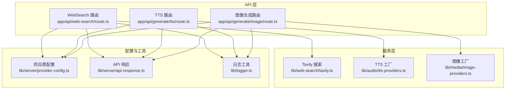
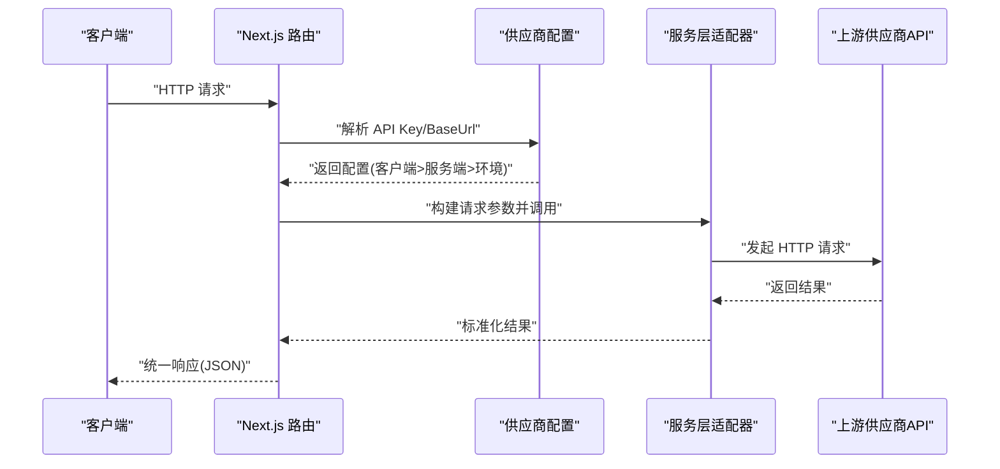
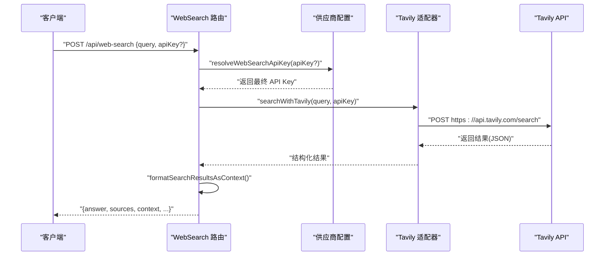
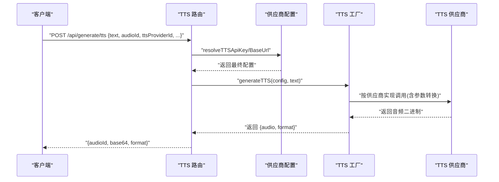
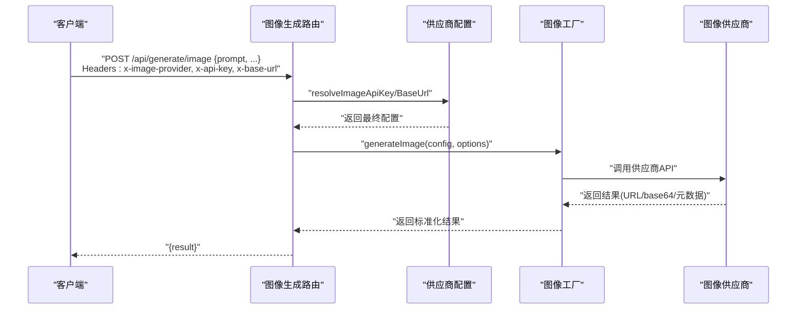
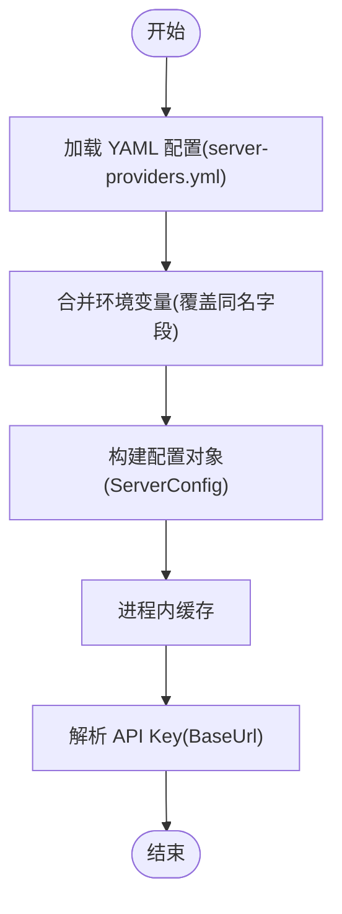
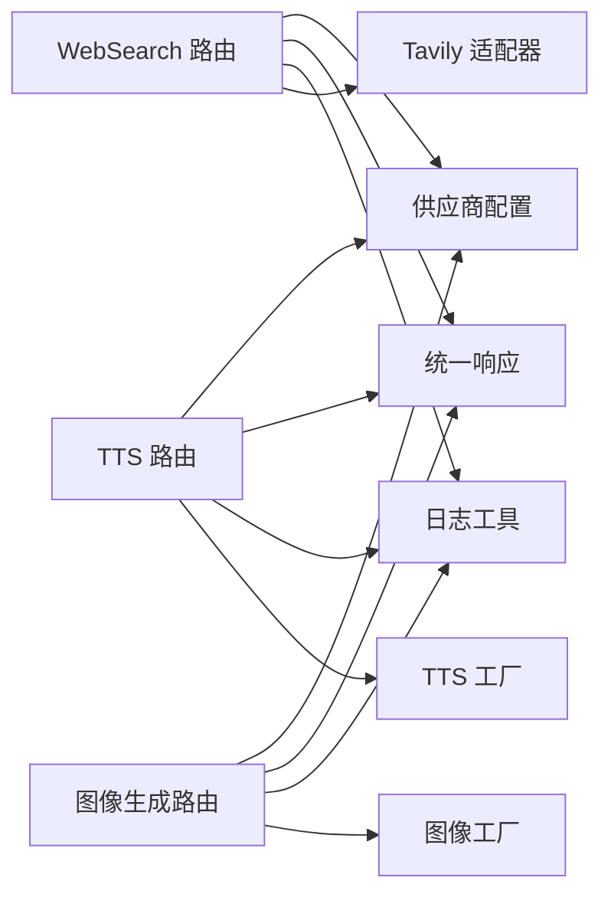

# 第三方集成

<cite>
**本文引用的文件**
- [app/api/web-search/route.ts](file://app/api/web-search/route.ts)
- [app/api/generate/tts/route.ts](file://app/api/generate/tts/route.ts)
- [app/api/generate/image/route.ts](file://app/api/generate/image/route.ts)
- [lib/server/provider-config.ts](file://lib/server/provider-config.ts)
- [lib/server/api-response.ts](file://lib/server/api-response.ts)
- [lib/logger.ts](file://lib/logger.ts)
- [lib/web-search/tavily.ts](file://lib/web-search/tavily.ts)
- [lib/web-search/types.ts](file://lib/web-search/types.ts)
- [lib/audio/tts-providers.ts](file://lib/audio/tts-providers.ts)
- [lib/audio/types.ts](file://lib/audio/types.ts)
- [lib/media/image-providers.ts](file://lib/media/image-providers.ts)
- [lib/media/types.ts](file://lib/media/types.ts)
</cite>

## 目录
1. [简介](#简介)
2. [项目结构](#项目结构)
3. [核心组件](#核心组件)
4. [架构总览](#架构总览)
5. [详细组件分析](#详细组件分析)
6. [依赖关系分析](#依赖关系分析)
7. [性能考量](#性能考量)
8. [故障排查指南](#故障排查指南)
9. [结论](#结论)
10. [附录](#附录)

## 简介
本文件面向第三方集成功能，系统性阐述外部服务集成的架构设计与实现细节，覆盖以下方面：
- API 封装：统一入口、参数校验、响应格式与错误码
- 认证机制：客户端密钥优先、服务端配置回退、环境变量兜底
- 数据映射：请求参数到上游 API 的转换、响应结果的标准化
- Web 搜索集成：Tavily 搜索 API 的调用与结果处理
- 多媒体服务集成：TTS、ASR、图像生成的服务封装与配置
- 同步与一致性：基于配置缓存与环境变量的加载策略
- 错误处理与重试：统一错误码、日志记录与异常上报
- 监控与日志：结构化日志输出与最小级别控制
- 安全考虑：密钥不外泄、代理支持、内容安全过滤
- 实践示例与最佳实践：如何新增供应商、如何配置与排障

## 项目结构
第三方集成相关代码主要分布在以下模块：
- API 层：Next.js 路由处理器，负责请求解析、鉴权与调用业务层
- 服务层：具体供应商适配器与工具函数（Web 搜索、TTS、图像生成）
- 配置层：服务端供应商配置加载与解析（YAML + 环境变量）
- 响应与日志：统一 API 响应格式与日志工具

图表来源
- [app/api/web-search/route.ts:1-52](file://app/api/web-search/route.ts#L1-L52)
- [app/api/generate/tts/route.ts:1-81](file://app/api/generate/tts/route.ts#L1-L81)
- [app/api/generate/image/route.ts:1-79](file://app/api/generate/image/route.ts#L1-L79)
- [lib/web-search/tavily.ts:1-93](file://lib/web-search/tavily.ts#L1-L93)
- [lib/audio/tts-providers.ts:1-357](file://lib/audio/tts-providers.ts#L1-L357)
- [lib/media/image-providers.ts:1-113](file://lib/media/image-providers.ts#L1-L113)
- [lib/server/provider-config.ts:1-398](file://lib/server/provider-config.ts#L1-L398)
- [lib/server/api-response.ts:1-46](file://lib/server/api-response.ts#L1-L46)
- [lib/logger.ts:1-53](file://lib/logger.ts#L1-L53)

章节来源
- [app/api/web-search/route.ts:1-52](file://app/api/web-search/route.ts#L1-L52)
- [app/api/generate/tts/route.ts:1-81](file://app/api/generate/tts/route.ts#L1-L81)
- [app/api/generate/image/route.ts:1-79](file://app/api/generate/image/route.ts#L1-L79)
- [lib/server/provider-config.ts:1-398](file://lib/server/provider-config.ts#L1-L398)

## 核心组件
- Web 搜索 API：接收查询，解析密钥，调用 Tavily 并返回结构化结果
- TTS 生成 API：接收文本与语音参数，选择供应商，生成音频并返回 base64
- 图像生成 API：接收提示词与尺寸，解析供应商与密钥，调用对应适配器
- 供应商配置：从 YAML 与环境变量加载配置，支持客户端覆盖与服务端回退
- 统一响应与错误码：标准化错误码与响应结构
- 日志工具：结构化日志输出，支持最小级别与 JSON 格式

章节来源
- [app/api/web-search/route.ts:15-51](file://app/api/web-search/route.ts#L15-L51)
- [app/api/generate/tts/route.ts:21-80](file://app/api/generate/tts/route.ts#L21-L80)
- [app/api/generate/image/route.ts:29-78](file://app/api/generate/image/route.ts#L29-L78)
- [lib/server/provider-config.ts:208-397](file://lib/server/provider-config.ts#L208-L397)
- [lib/server/api-response.ts:26-45](file://lib/server/api-response.ts#L26-L45)
- [lib/logger.ts:28-52](file://lib/logger.ts#L28-L52)

## 架构总览
第三方集成采用“路由层 -> 服务层 -> 供应商适配器”的分层架构，配合统一的配置解析与响应/日志工具，形成可扩展、可维护的集成体系。

图表来源
- [app/api/web-search/route.ts:15-51](file://app/api/web-search/route.ts#L15-L51)
- [app/api/generate/tts/route.ts:21-80](file://app/api/generate/tts/route.ts#L21-L80)
- [app/api/generate/image/route.ts:29-78](file://app/api/generate/image/route.ts#L29-L78)
- [lib/server/provider-config.ts:208-397](file://lib/server/provider-config.ts#L208-L397)
- [lib/web-search/tavily.ts:23-67](file://lib/web-search/tavily.ts#L23-L67)
- [lib/audio/tts-providers.ts:106-141](file://lib/audio/tts-providers.ts#L106-L141)
- [lib/media/image-providers.ts:89-103](file://lib/media/image-providers.ts#L89-L103)

## 详细组件分析

### Web 搜索集成（Tavily）
- 入口路由：解析请求体，校验必填字段，解析 API Key，调用搜索与结果格式化
- 适配器：使用代理请求封装调用 Tavily REST API，返回结构化结果
- 结果处理：将答案与来源列表格式化为 LLM 提示可用的上下文字符串

图表来源
- [app/api/web-search/route.ts:15-51](file://app/api/web-search/route.ts#L15-L51)
- [lib/server/provider-config.ts:391-397](file://lib/server/provider-config.ts#L391-L397)
- [lib/web-search/tavily.ts:16-67](file://lib/web-search/tavily.ts#L16-L67)
- [lib/web-search/tavily.ts:72-92](file://lib/web-search/tavily.ts#L72-L92)

章节来源
- [app/api/web-search/route.ts:15-51](file://app/api/web-search/route.ts#L15-L51)
- [lib/web-search/tavily.ts:16-67](file://lib/web-search/tavily.ts#L16-L67)
- [lib/web-search/tavily.ts:72-92](file://lib/web-search/tavily.ts#L72-L92)
- [lib/web-search/types.ts:8-19](file://lib/web-search/types.ts#L8-L19)

### TTS 生成集成
- 入口路由：校验必填参数，拒绝浏览器原生 TTS（必须在客户端处理），解析 API Key 与 BaseUrl，调用 TTS 工厂生成音频并返回 base64
- 工厂模式：根据 providerId 分发到具体供应商实现；对需要 API Key 的供应商进行校验；支持不同参数映射（速度、SSML 等）

图表来源
- [app/api/generate/tts/route.ts:21-80](file://app/api/generate/tts/route.ts#L21-L80)
- [lib/server/provider-config.ts:266-274](file://lib/server/provider-config.ts#L266-L274)
- [lib/audio/tts-providers.ts:106-141](file://lib/audio/tts-providers.ts#L106-L141)

章节来源
- [app/api/generate/tts/route.ts:21-80](file://app/api/generate/tts/route.ts#L21-L80)
- [lib/audio/tts-providers.ts:106-141](file://lib/audio/tts-providers.ts#L106-L141)
- [lib/audio/types.ts:80-132](file://lib/audio/types.ts#L80-L132)

### 图像生成集成
- 入口路由：校验必填字段，解析供应商与密钥，解析尺寸或从宽高比推导尺寸，调用图像工厂并返回结果
- 工厂模式：根据 providerId 分发到具体供应商适配器；对敏感内容进行拦截与错误码返回

图表来源
- [app/api/generate/image/route.ts:29-78](file://app/api/generate/image/route.ts#L29-L78)
- [lib/server/provider-config.ts:337-348](file://lib/server/provider-config.ts#L337-L348)
- [lib/media/image-providers.ts:89-103](file://lib/media/image-providers.ts#L89-L103)

章节来源
- [app/api/generate/image/route.ts:29-78](file://app/api/generate/image/route.ts#L29-L78)
- [lib/media/image-providers.ts:16-69](file://lib/media/image-providers.ts#L16-L69)
- [lib/media/types.ts:72-169](file://lib/media/types.ts#L72-L169)

### 供应商配置与认证机制
- 配置来源：优先 YAML 文件，其次环境变量；客户端可传入覆盖项，服务端配置作为回退
- 解析规则：按供应商类别（LLM/TTS/ASR/PDF/Image/Video/WebSearch）分别加载；支持模型列表与代理配置
- 密钥解析：客户端密钥优先于服务端密钥，服务端密钥优先于环境变量

图表来源
- [lib/server/provider-config.ts:101-113](file://lib/server/provider-config.ts#L101-L113)
- [lib/server/provider-config.ts:119-168](file://lib/server/provider-config.ts#L119-L168)
- [lib/server/provider-config.ts:179-189](file://lib/server/provider-config.ts#L179-L189)
- [lib/server/provider-config.ts:208-217](file://lib/server/provider-config.ts#L208-L217)

章节来源
- [lib/server/provider-config.ts:101-168](file://lib/server/provider-config.ts#L101-L168)
- [lib/server/provider-config.ts:179-217](file://lib/server/provider-config.ts#L179-L217)
- [lib/server/provider-config.ts:235-245](file://lib/server/provider-config.ts#L235-L245)
- [lib/server/provider-config.ts:391-397](file://lib/server/provider-config.ts#L391-L397)

### 数据映射与类型定义
- Web 搜索：统一结果结构（答案、来源、查询、响应时间），并提供上下文格式化函数
- TTS：统一模型配置（providerId、apiKey、baseUrl、voice、speed、format），按供应商差异转换参数
- 图像生成：统一配置与选项（prompt、negativePrompt、width/height/aspectRatio、style），适配多供应商能力

章节来源
- [lib/web-search/tavily.ts:61-67](file://lib/web-search/tavily.ts#L61-L67)
- [lib/web-search/tavily.ts:72-92](file://lib/web-search/tavily.ts#L72-L92)
- [lib/audio/types.ts:80-132](file://lib/audio/types.ts#L80-L132)
- [lib/media/types.ts:122-169](file://lib/media/types.ts#L122-L169)

## 依赖关系分析
- 路由层依赖配置解析与统一响应工具，间接依赖日志工具
- 服务层依赖类型定义与供应商常量，部分适配器依赖代理请求封装
- 配置层依赖 YAML 解析与环境变量，提供解析后的键值
- 统一响应与日志为所有集成点提供一致的错误与可观测性

图表来源
- [app/api/web-search/route.ts:1-52](file://app/api/web-search/route.ts#L1-L52)
- [app/api/generate/tts/route.ts:1-81](file://app/api/generate/tts/route.ts#L1-L81)
- [app/api/generate/image/route.ts:1-79](file://app/api/generate/image/route.ts#L1-L79)
- [lib/server/provider-config.ts:1-398](file://lib/server/provider-config.ts#L1-L398)
- [lib/server/api-response.ts:1-46](file://lib/server/api-response.ts#L1-L46)
- [lib/logger.ts:1-53](file://lib/logger.ts#L1-L53)
- [lib/web-search/tavily.ts:1-93](file://lib/web-search/tavily.ts#L1-L93)
- [lib/audio/tts-providers.ts:1-357](file://lib/audio/tts-providers.ts#L1-L357)
- [lib/media/image-providers.ts:1-113](file://lib/media/image-providers.ts#L1-L113)

章节来源
- [lib/server/provider-config.ts:1-398](file://lib/server/provider-config.ts#L1-L398)
- [lib/server/api-response.ts:1-46](file://lib/server/api-response.ts#L1-L46)
- [lib/logger.ts:1-53](file://lib/logger.ts#L1-L53)

## 性能考量
- 路由超时限制：TTS 与图像生成路由设置了最大执行时长，避免长时间占用资源
- 代理请求：Web 搜索通过代理封装，提升网络稳定性与跨域兼容性
- 缓存策略：供应商配置在进程内缓存，减少重复读取与解析开销
- 异步任务：图像/视频等异步生成场景建议采用任务适配器模式（已在类型中定义），便于后续扩展

章节来源
- [app/api/generate/tts/route.ts:19](file://app/api/generate/tts/route.ts#L19)
- [app/api/generate/image/route.ts:27](file://app/api/generate/image/route.ts#L27)
- [lib/server/provider-config.ts:176-217](file://lib/server/provider-config.ts#L176-L217)
- [lib/media/types.ts:304-320](file://lib/media/types.ts#L304-L320)

## 故障排查指南
- 统一错误码：包含缺失字段、缺少密钥、无效请求、URL/重定向限制、内容敏感、上游错误、生成失败、转写失败、解析失败、内部错误等
- 日志记录：支持最小级别与 JSON 格式输出，便于集中采集与检索
- 常见问题定位：
  - Web 搜索：检查密钥解析与 Tavily 返回状态；查看日志中的错误信息
  - TTS：确认供应商 ID、API Key、速度参数范围；注意浏览器原生 TTS 必须在客户端处理
  - 图像生成：确认尺寸/比例推导逻辑；留意内容安全过滤导致的敏感内容错误码

章节来源
- [lib/server/api-response.ts:3-15](file://lib/server/api-response.ts#L3-L15)
- [lib/server/api-response.ts:26-45](file://lib/server/api-response.ts#L26-L45)
- [lib/logger.ts:4-11](file://lib/logger.ts#L4-L11)
- [app/api/web-search/route.ts:46-50](file://app/api/web-search/route.ts#L46-L50)
- [app/api/generate/tts/route.ts:72-79](file://app/api/generate/tts/route.ts#L72-L79)
- [app/api/generate/image/route.ts:68-77](file://app/api/generate/image/route.ts#L68-L77)

## 结论
该第三方集成功能以清晰的分层架构与统一的工具链实现了对外部服务的可靠封装。通过“客户端覆盖 + 服务端回退 + 环境变量兜底”的认证机制，既满足灵活配置又保障安全；通过工厂模式与类型约束，易于扩展新的供应商；通过统一响应与日志，提升了可观测性与可维护性。建议在生产环境中结合代理网络、限流与熔断策略，并持续完善任务型生成的异步适配器。

## 附录

### 安全与合规
- 密钥管理：密钥仅在服务端解析，不暴露给客户端；客户端仅传递必要覆盖项
- 内容安全：图像生成对敏感内容进行拦截并返回明确错误码
- 传输安全：通过代理封装与 HTTPS 调用上游 API

章节来源
- [lib/server/provider-config.ts:235-245](file://lib/server/provider-config.ts#L235-L245)
- [app/api/generate/image/route.ts:70-74](file://app/api/generate/image/route.ts#L70-L74)
- [lib/web-search/tavily.ts:23-40](file://lib/web-search/tavily.ts#L23-L40)

### 新增供应商最佳实践
- 类型定义：在相应类型文件中添加新的供应商 ID 与配置接口
- 常量注册：在常量文件中补充供应商元数据（名称、图标、默认 BaseUrl、音色/模型列表等）
- 工厂实现：在工厂文件中实现具体调用逻辑，并在分发 switch 中新增分支
- 路由集成：在对应路由中解析客户端覆盖项与服务端配置，调用工厂并返回统一响应
- 错误处理：遵循统一错误码，记录详细日志
- 文档与国际化：补充提供商名称的翻译键

章节来源
- [lib/audio/types.ts:79-91](file://lib/audio/types.ts#L79-L91)
- [lib/audio/tts-providers.ts:14-90](file://lib/audio/tts-providers.ts#L14-L90)
- [lib/media/types.ts:72-77](file://lib/media/types.ts#L72-L77)
- [lib/media/image-providers.ts:16-69](file://lib/media/image-providers.ts#L16-L69)