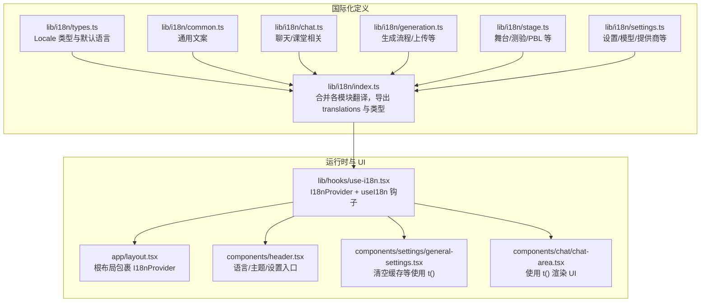
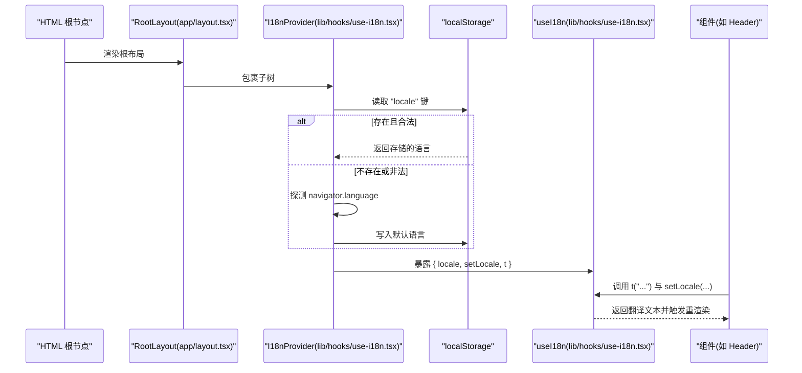
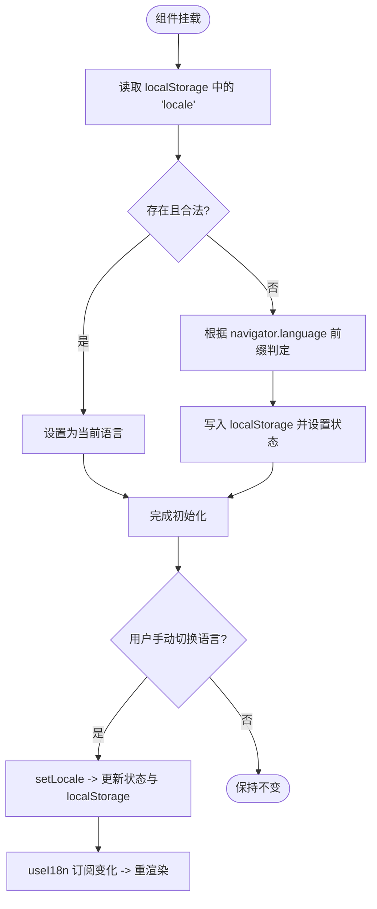
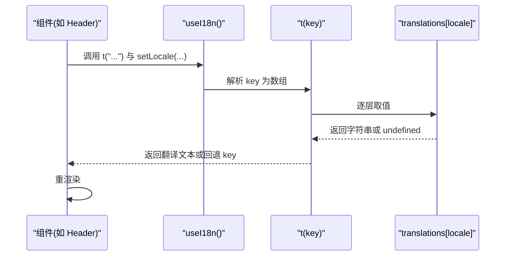
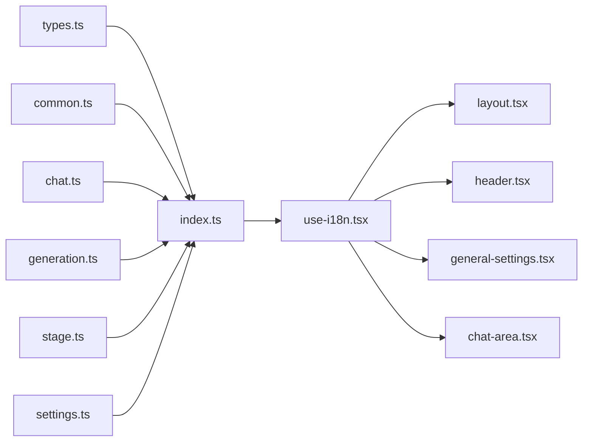

# 国际化 (i18n)

<cite>
**本文引用的文件**
- [lib/i18n/index.ts](file://lib/i18n/index.ts)
- [lib/i18n/types.ts](file://lib/i18n/types.ts)
- [lib/i18n/common.ts](file://lib/i18n/common.ts)
- [lib/i18n/chat.ts](file://lib/i18n/chat.ts)
- [lib/i18n/generation.ts](file://lib/i18n/generation.ts)
- [lib/i18n/stage.ts](file://lib/i18n/stage.ts)
- [lib/i18n/settings.ts](file://lib/i18n/settings.ts)
- [lib/hooks/use-i18n.tsx](file://lib/hooks/use-i18n.tsx)
- [app/layout.tsx](file://app/layout.tsx)
- [components/header.tsx](file://components/header.tsx)
- [components/settings/general-settings.tsx](file://components/settings/general-settings.tsx)
- [components/chat/chat-area.tsx](file://components/chat/chat-area.tsx)
</cite>

## 目录
1. [简介](#简介)
2. [项目结构](#项目结构)
3. [核心组件](#核心组件)
4. [架构总览](#架构总览)
5. [详细组件分析](#详细组件分析)
6. [依赖关系分析](#依赖关系分析)
7. [性能考量](#性能考量)
8. [故障排查指南](#故障排查指南)
9. [结论](#结论)
10. [附录](#附录)

## 简介
本文件面向国际化（i18n）系统，系统采用“按模块拆分 + 运行时动态解析”的设计，提供中英文双语支持。翻译键值以层级结构组织，支持占位符替换与简单复数/上下文适配；语言切换在客户端完成，持久化于本地存储，并在页面水合后进行语言探测与回填。本文将从系统架构、数据结构、调用流程、最佳实践与部署建议等方面进行深入说明。

## 项目结构
国际化相关代码主要位于 lib/i18n 与 lib/hooks 下，UI 层通过自定义 Hook 在组件中消费翻译与语言切换能力。

**图表来源**
- [lib/i18n/index.ts:1-27](file://lib/i18n/index.ts#L1-L27)
- [lib/i18n/types.ts:1-4](file://lib/i18n/types.ts#L1-L4)
- [lib/hooks/use-i18n.tsx:1-62](file://lib/hooks/use-i18n.tsx#L1-L62)
- [app/layout.tsx:25-46](file://app/layout.tsx#L25-L46)
- [components/header.tsx:29-301](file://components/header.tsx#L29-L301)
- [components/settings/general-settings.tsx:24-181](file://components/settings/general-settings.tsx#L24-L181)
- [components/chat/chat-area.tsx:55-200](file://components/chat/chat-area.tsx#L55-L200)

**章节来源**
- [lib/i18n/index.ts:1-27](file://lib/i18n/index.ts#L1-L27)
- [lib/i18n/types.ts:1-4](file://lib/i18n/types.ts#L1-L4)
- [lib/hooks/use-i18n.tsx:1-62](file://lib/hooks/use-i18n.tsx#L1-L62)
- [app/layout.tsx:25-46](file://app/layout.tsx#L25-L46)

## 核心组件
- 翻译键集合与合并
  - 通过 index.ts 将 common、stage、chat、generation、settings 等模块的 zh-CN/en-US 翻译合并为 translations 对象，统一导出类型与默认语言。
- 运行时翻译函数与语言切换
  - use-i18n.tsx 提供 I18nProvider 与 useI18n 钩子：维护 locale 状态、从本地存储与浏览器语言探测初始化、持久化切换、提供 t(key) 动态解析。
- 默认语言与类型
  - types.ts 定义 Locale 与 defaultLocale，确保类型安全与默认行为一致。

关键要点
- 键名以点号分隔的层级结构，如 “settings.clearCache”、“stage.currentScene”、“generation.upload.requirementPlaceholder”。
- t 函数按层级逐层取值，若找不到对应字符串则回退为原始 key，避免运行时崩溃。
- 语言切换通过 setLocale 更新状态与本地存储，组件通过 useI18n 订阅变更并重渲染。

**章节来源**
- [lib/i18n/index.ts:1-27](file://lib/i18n/index.ts#L1-L27)
- [lib/i18n/types.ts:1-4](file://lib/i18n/types.ts#L1-L4)
- [lib/hooks/use-i18n.tsx:17-61](file://lib/hooks/use-i18n.tsx#L17-L61)

## 架构总览
下图展示从根布局到具体组件的国际化调用链路，以及语言切换的持久化与回填过程。

**图表来源**
- [app/layout.tsx:36-41](file://app/layout.tsx#L36-L41)
- [lib/hooks/use-i18n.tsx:17-41](file://lib/hooks/use-i18n.tsx#L17-L41)

**章节来源**
- [app/layout.tsx:25-46](file://app/layout.tsx#L25-L46)
- [lib/hooks/use-i18n.tsx:17-61](file://lib/hooks/use-i18n.tsx#L17-L61)

## 详细组件分析

### 翻译键结构与模块划分
- common.ts：通用 UI 文案（如“确定/取消/加载中”）、首页标语、工具栏提示、导出文案等。
- chat.ts：聊天/课堂相关文案（标签页、徽章、语音输入、动作状态等）。
- generation.ts：生成流程文案（PDF 上传限制、进度步骤、错误提示、网络搜索等）。
- stage.ts：舞台/测验/PBL/白板等场景文案。
- settings.ts：设置面板文案（语言/主题、模型/提供商、TTS/ASR、PDF/图像/视频生成、危险区等）。
- index.ts：将各模块翻译合并为 zh-CN/en-US 两套完整字典，导出类型与默认语言。

复杂度与数据结构
- translations 为只读映射，键为语言码，值为对象树，叶子为字符串。
- t(key) 通过 split('.') 逐层取值，时间复杂度 O(k)，k 为层级数；空间复杂度 O(1)。
- 合并策略为浅拷贝展开，保证模块间键冲突时后者覆盖前者，便于按模块增量维护。

**章节来源**
- [lib/i18n/common.ts:1-82](file://lib/i18n/common.ts#L1-L82)
- [lib/i18n/chat.ts:1-142](file://lib/i18n/chat.ts#L1-L142)
- [lib/i18n/generation.ts:1-130](file://lib/i18n/generation.ts#L1-L130)
- [lib/i18n/stage.ts:1-271](file://lib/i18n/stage.ts#L1-L271)
- [lib/i18n/settings.ts:1-580](file://lib/i18n/settings.ts#L1-L580)
- [lib/i18n/index.ts:9-24](file://lib/i18n/index.ts#L9-L24)

### 运行时语言切换机制
- 初始化：组件挂载后从 localStorage 读取语言；若不存在则基于 navigator.language 前缀判定 zh-CN 或 en-US，并写回 localStorage。
- 切换：调用 setLocale 更新状态与本地存储；组件通过 useI18n 订阅变化，触发重渲染。
- 会话与存储：语言切换不涉及服务端会话，仅影响当前浏览器实例的本地存储键值。

**图表来源**
- [lib/hooks/use-i18n.tsx:22-41](file://lib/hooks/use-i18n.tsx#L22-L41)

**章节来源**
- [lib/hooks/use-i18n.tsx:17-61](file://lib/hooks/use-i18n.tsx#L17-L61)

### 翻译函数的使用方法
- 基本用法：在组件中引入 useI18n，解构得到 t 与 locale；通过 t("模块.键") 获取翻译。
- 参数化翻译：部分文案包含占位符（如“第 {n} 页”、“{count} 个动作”），在组件侧传入变量进行替换。
- 复数与上下文：当前实现以静态键区分不同语义（如“多选/单选/简答”），未引入 ICU 或 plural 规则；如需复杂复数/性别/时态，可在文案层通过键细分或在 t 实现中扩展。

示例位置
- 语言切换入口与主题选择：components/header.tsx
- 清空缓存对话框文案与按钮：components/settings/general-settings.tsx
- 聊天区域标签页与加载文案：components/chat/chat-area.tsx
- 根布局包裹 I18nProvider：app/layout.tsx

**章节来源**
- [components/header.tsx:29-301](file://components/header.tsx#L29-L301)
- [components/settings/general-settings.tsx:24-181](file://components/settings/general-settings.tsx#L24-L181)
- [components/chat/chat-area.tsx:55-200](file://components/chat/chat-area.tsx#L55-L200)
- [app/layout.tsx:36-41](file://app/layout.tsx#L36-L41)

### UI 组件中的国际化调用
- Header：提供语言切换按钮与主题切换菜单，使用 t() 渲染文案。
- Settings-General：使用 t() 渲染清空缓存的标题、描述、确认项列表与按钮文案。
- Chat-Area：使用 t() 渲染标签页、加载状态、占位提示等。

**图表来源**
- [lib/hooks/use-i18n.tsx:43-50](file://lib/hooks/use-i18n.tsx#L43-L50)
- [lib/i18n/index.ts:9-24](file://lib/i18n/index.ts#L9-L24)

**章节来源**
- [lib/hooks/use-i18n.tsx:43-50](file://lib/hooks/use-i18n.tsx#L43-L50)
- [lib/i18n/index.ts:9-24](file://lib/i18n/index.ts#L9-L24)

## 依赖关系分析
- 模块内聚与耦合
  - 各模块（common/chat/stage/generation/settings）彼此独立，通过 index.ts 合并，降低耦合。
  - use-i18n.tsx 仅依赖 types.ts 与 index.ts，职责单一，便于测试与替换。
- 外部依赖
  - 无第三方 i18n 库，纯自研实现，减少外部依赖与打包体积。
- 可能的循环依赖
  - 当前结构为单向依赖（hooks -> i18n -> modules），未见循环。

**图表来源**
- [lib/i18n/index.ts:1-27](file://lib/i18n/index.ts#L1-L27)
- [lib/hooks/use-i18n.tsx:1-62](file://lib/hooks/use-i18n.tsx#L1-L62)
- [app/layout.tsx:25-46](file://app/layout.tsx#L25-L46)

**章节来源**
- [lib/i18n/index.ts:1-27](file://lib/i18n/index.ts#L1-L27)
- [lib/hooks/use-i18n.tsx:1-62](file://lib/hooks/use-i18n.tsx#L1-L62)

## 性能考量
- t(key) 的解析为 O(k)（k 为层级数），在 UI 中频繁调用时建议：
  - 缓存常用键的翻译结果（在组件内部或上层 store）。
  - 避免在渲染热路径中拼接大量 key，尽量将组合逻辑下沉到业务层。
- 合并策略为浅展开，新增模块时注意键冲突与覆盖顺序。
- 本地存储读写为同步操作，初始化阶段仅一次，对首屏影响可忽略。

## 故障排查指南
- 切换语言无效
  - 检查 localStorage 是否可写，确认 setLocale 已调用且值在有效枚举内。
  - 确认组件是否在 I18nProvider 上下文中使用 useI18n。
- 文案未翻译回退为 key
  - 检查 key 是否存在于 translations[locale] 对应模块树中，注意大小写与层级。
- SSR 与 hydration 不一致
  - use-i18n.tsx 在 useEffect 中进行 hydrate，避免在首屏直接读取 localStorage；确保根布局包裹 I18nProvider。

**章节来源**
- [lib/hooks/use-i18n.tsx:22-41](file://lib/hooks/use-i18n.tsx#L22-L41)
- [lib/hooks/use-i18n.tsx:55-61](file://lib/hooks/use-i18n.tsx#L55-L61)

## 结论
本国际化系统以“模块化翻译 + 运行时解析 + 本地存储持久化”为核心，结构清晰、易于扩展。通过在 UI 组件中统一使用 t() 与 setLocale，实现了灵活的语言切换与一致的用户体验。未来如需增强复数、性别、时态等规则，可在文案层细化键设计或在 t 实现中引入更复杂的插值与规则引擎。

## 附录

### 翻译键命名与占位符使用规范
- 命名规范
  - 使用“模块.子模块.键”层级，避免跨模块重复；同一模块内尽量语义化。
  - 复数/上下文差异通过不同键区分，如“settings.multiAgentMode”与“settings.singleAgentMode”。
- 占位符
  - 使用花括号包裹占位符，如“{n}”、“{count}”，在组件侧传参替换。
- 文化适配
  - 数字格式、日期/时间、货币等建议在专用工具中处理，避免直接拼接。

### 开发最佳实践
- 新增翻译
  - 在对应模块新增键，同时在 zh-CN 与 en-US 中补齐。
  - 在 index.ts 中确认合并顺序，避免覆盖。
- 组件使用
  - 优先在顶层容器组件集中消费 t()，避免分散调用。
  - 对高频渲染区域考虑缓存翻译结果。
- 语言切换
  - 仅在用户显式操作时调用 setLocale，避免在路由或数据流中频繁切换。
- 测试
  - 为关键文案增加回归测试，确保切换语言后 UI 正常。

### 多语言项目的部署方案
- 构建与分发
  - 保持翻译键稳定，避免破坏性变更；如需调整，提供迁移脚本与回滚策略。
- 服务端集成
  - 若未来引入服务端语言探测或会话级语言偏好，可在服务端返回首选语言并在客户端 hydrate 时合并。
- A/B 与灰度
  - 可通过 feature flag 控制新文案灰度发布，逐步替换旧键。