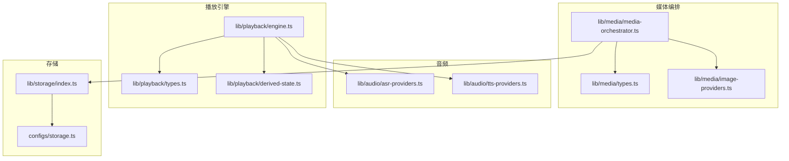
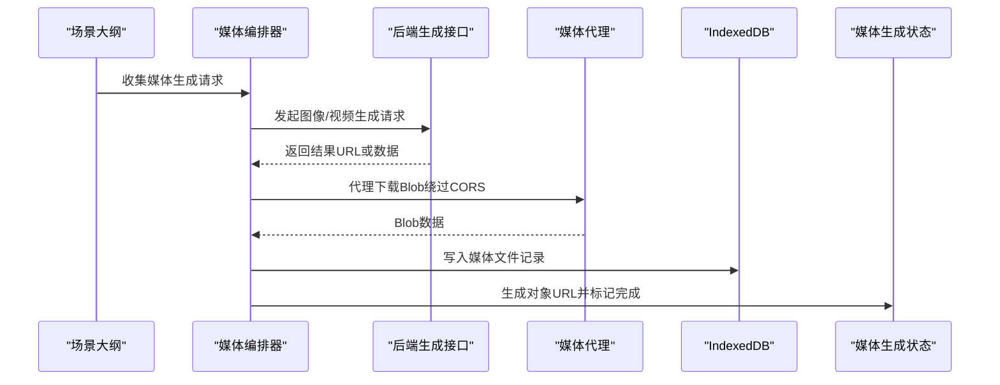
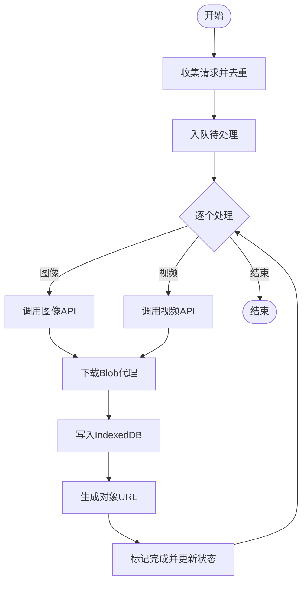
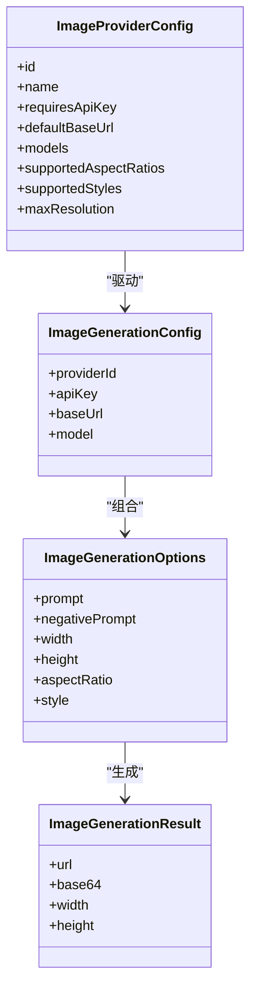
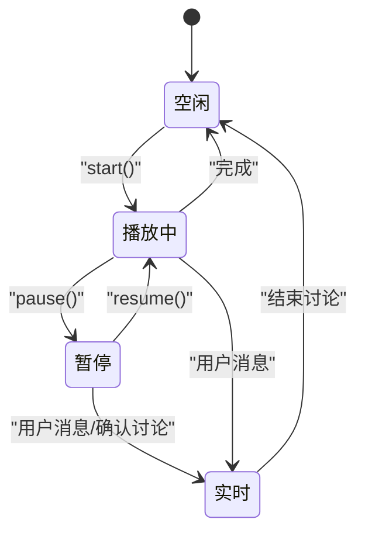
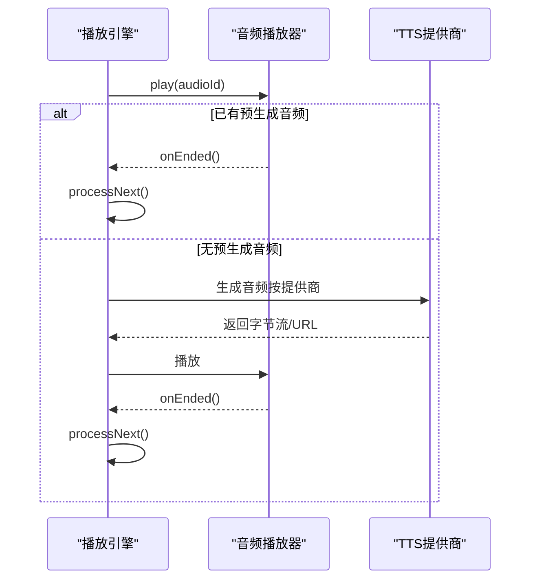
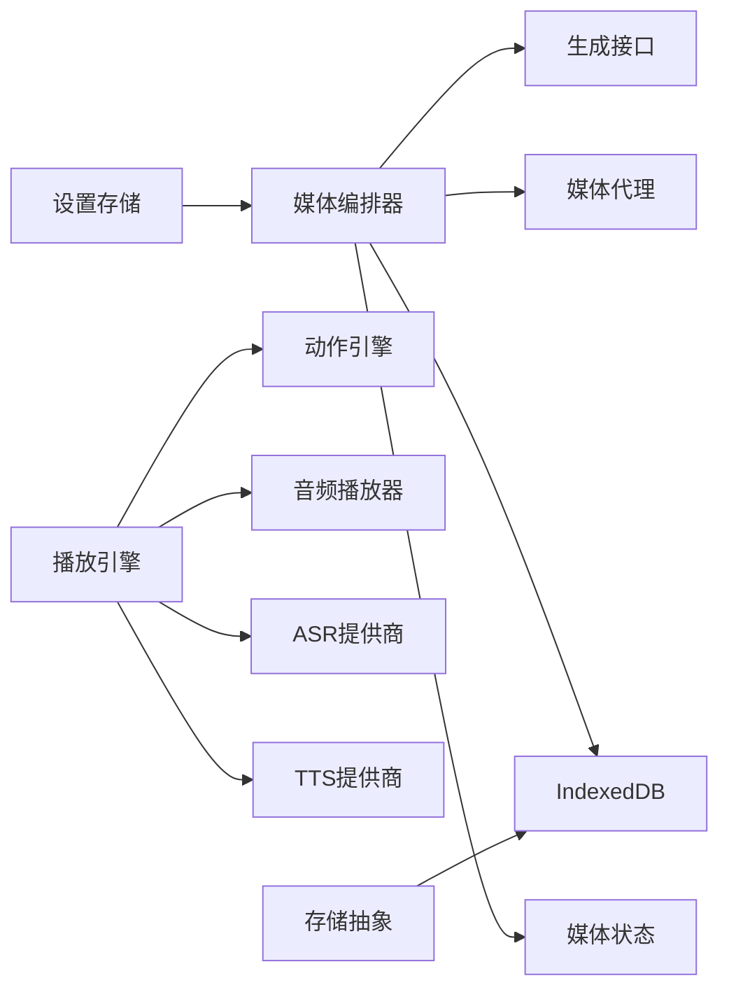

# 媒体处理工具

<cite>
**本文引用的文件**
- [lib/playback/engine.ts](file://lib/playback/engine.ts)
- [lib/playback/types.ts](file://lib/playback/types.ts)
- [lib/playback/derived-state.ts](file://lib/playback/derived-state.ts)
- [lib/media/media-orchestrator.ts](file://lib/media/media-orchestrator.ts)
- [lib/media/types.ts](file://lib/media/types.ts)
- [lib/media/image-providers.ts](file://lib/media/image-providers.ts)
- [lib/audio/asr-providers.ts](file://lib/audio/asr-providers.ts)
- [lib/audio/tts-providers.ts](file://lib/audio/tts-providers.ts)
- [lib/storage/index.ts](file://lib/storage/index.ts)
- [configs/storage.ts](file://configs/storage.ts)
</cite>

## 目录
1. [简介](#简介)
2. [项目结构](#项目结构)
3. [核心组件](#核心组件)
4. [架构总览](#架构总览)
5. [详细组件分析](#详细组件分析)
6. [依赖关系分析](#依赖关系分析)
7. [性能考量](#性能考量)
8. [故障排查指南](#故障排查指南)
9. [结论](#结论)
10. [附录：使用示例与配置项](#附录使用示例与配置项)

## 简介
本技术文档围绕媒体处理工具进行系统性说明，重点覆盖以下方面：
- 图像存储与生成：图片上传、压缩、格式转换与缓存管理（基于前端生成、IndexedDB 存储与对象 URL 的策略）。
- 音频播放器与合成：音频文件加载、播放控制、音量与语速调节、播放状态管理。
- 元素处理工具：DOM 元素操作、事件绑定与属性管理（结合画板/场景渲染器中的元素操作模块）。
- 媒体文件存储策略：本地存储（IndexedDB）、CDN 配置与文件清理机制。
- 最佳实践：性能优化、错误处理与用户体验建议。
- 使用示例与配置项：提供可直接参考的调用路径与参数说明。

## 项目结构
该仓库采用按功能域分层的组织方式，媒体相关能力主要分布在如下目录：
- lib/media：媒体生成编排、类型定义与提供商适配
- lib/audio：ASR/TTS 提供商适配与配置
- lib/playback：统一的播放引擎（含状态机、触发器、计时器）
- lib/storage：通用存储抽象与默认提供者
- configs：配置常量（如本地丢弃数据库键名）

图表来源
- [lib/media/media-orchestrator.ts:1-287](file://lib/media/media-orchestrator.ts#L1-L287)
- [lib/media/types.ts:1-321](file://lib/media/types.ts#L1-L321)
- [lib/media/image-providers.ts:1-113](file://lib/media/image-providers.ts#L1-L113)
- [lib/audio/asr-providers.ts:1-354](file://lib/audio/asr-providers.ts#L1-L354)
- [lib/audio/tts-providers.ts:1-357](file://lib/audio/tts-providers.ts#L1-L357)
- [lib/playback/engine.ts:1-525](file://lib/playback/engine.ts#L1-L525)
- [lib/playback/types.ts](file://lib/playback/types.ts)
- [lib/playback/derived-state.ts](file://lib/playback/derived-state.ts)
- [lib/storage/index.ts:1-14](file://lib/storage/index.ts#L1-L14)
- [configs/storage.ts:1-2](file://configs/storage.ts#L1-L2)

章节来源
- [lib/media/media-orchestrator.ts:1-287](file://lib/media/media-orchestrator.ts#L1-L287)
- [lib/media/types.ts:1-321](file://lib/media/types.ts#L1-L321)
- [lib/media/image-providers.ts:1-113](file://lib/media/image-providers.ts#L1-L113)
- [lib/audio/asr-providers.ts:1-354](file://lib/audio/asr-providers.ts#L1-L354)
- [lib/audio/tts-providers.ts:1-357](file://lib/audio/tts-providers.ts#L1-L357)
- [lib/playback/engine.ts:1-525](file://lib/playback/engine.ts#L1-L525)
- [lib/playback/types.ts](file://lib/playback/types.ts)
- [lib/playback/derived-state.ts](file://lib/playback/derived-state.ts)
- [lib/storage/index.ts:1-14](file://lib/storage/index.ts#L1-L14)
- [configs/storage.ts:1-2](file://configs/storage.ts#L1-L2)

## 核心组件
- 媒体编排器（MediaOrchestrator）：负责收集场景大纲中的媒体生成请求，串行调度到后端接口，拉取结果 Blob，写入 IndexedDB 并在内存中维护对象 URL，同时更新全局状态。
- 图像提供商路由（ImageProviders）：集中注册与路由不同图像生成提供商，支持连通性测试、生成调用与宽高换算。
- 播放引擎（PlaybackEngine）：统一的状态机引擎，驱动“讲授播放”和“实时讨论”，协调 ActionEngine 执行动作、音频播放器播放语音、计时器模拟阅读时间等。
- ASR/TTS 提供商适配：封装多种语音识别与合成提供商的调用细节，统一返回格式或对象 URL。
- 存储抽象（Storage）：提供统一的 StorageProvider 接口与默认空实现，便于扩展本地/云端存储。

章节来源
- [lib/media/media-orchestrator.ts:31-64](file://lib/media/media-orchestrator.ts#L31-L64)
- [lib/media/image-providers.ts:89-103](file://lib/media/image-providers.ts#L89-L103)
- [lib/playback/engine.ts:43-84](file://lib/playback/engine.ts#L43-L84)
- [lib/audio/asr-providers.ts:163-190](file://lib/audio/asr-providers.ts#L163-L190)
- [lib/audio/tts-providers.ts:106-141](file://lib/audio/tts-providers.ts#L106-L141)
- [lib/storage/index.ts:6-11](file://lib/storage/index.ts#L6-L11)

## 架构总览
整体流程从“场景大纲”出发，编排器根据设置与任务状态决定是否发起生成；生成完成后通过代理服务下载 Blob，持久化到 IndexedDB，并以对象 URL 形式注入到媒体生成状态中；播放引擎在运行时根据动作类型选择播放音频或执行画板动作。

图表来源
- [lib/media/media-orchestrator.ts:104-184](file://lib/media/media-orchestrator.ts#L104-L184)
- [lib/media/media-orchestrator.ts:186-261](file://lib/media/media-orchestrator.ts#L186-L261)
- [lib/media/media-orchestrator.ts:263-286](file://lib/media/media-orchestrator.ts#L263-L286)

## 详细组件分析

### 组件一：图像存储与生成（媒体编排器）
- 职责
  - 收集场景大纲中的媒体生成请求，过滤已完成/失败的任务。
  - 串行调用后端图像/视频生成接口，支持中断信号。
  - 下载 Blob，写入 IndexedDB，生成对象 URL 并更新状态。
  - 对失败任务进行分类处理与持久化，支持重试。
- 关键流程
  - 生成单个媒体：根据类型调用对应 API，下载 Blob，写入 DB，生成对象 URL，标记完成。
  - 失败处理：区分可重试与不可重试错误，对不可重试错误写入占位记录以便刷新页面后仍可见失败状态。
  - 代理下载：对远程 URL 通过 /api/proxy-media 绕过跨域限制。
- 数据模型要点
  - IndexedDB 表包含媒体 ID、阶段 ID、类型、MIME 类型、大小、提示词、参数、创建时间、错误信息与错误码等字段。
  - 对象 URL 用于在前端安全地消费 Blob，避免重复下载。

图表来源
- [lib/media/media-orchestrator.ts:31-64](file://lib/media/media-orchestrator.ts#L31-L64)
- [lib/media/media-orchestrator.ts:104-184](file://lib/media/media-orchestrator.ts#L104-L184)
- [lib/media/media-orchestrator.ts:186-261](file://lib/media/media-orchestrator.ts#L186-L261)
- [lib/media/media-orchestrator.ts:263-286](file://lib/media/media-orchestrator.ts#L263-L286)

章节来源
- [lib/media/media-orchestrator.ts:31-64](file://lib/media/media-orchestrator.ts#L31-L64)
- [lib/media/media-orchestrator.ts:104-184](file://lib/media/media-orchestrator.ts#L104-L184)
- [lib/media/media-orchestrator.ts:186-261](file://lib/media/media-orchestrator.ts#L186-L261)
- [lib/media/media-orchestrator.ts:263-286](file://lib/media/media-orchestrator.ts#L263-L286)

### 组件二：图像提供商路由与类型定义
- 提供商注册与路由
  - 注册 Seedream、Qwen Image、Nano Banana 等图像提供商，包含名称、是否需要密钥、默认基础地址、可用模型、支持的宽高比等元数据。
  - 提供连通性测试与生成入口函数，按配置选择具体适配器。
- 类型定义
  - 统一的图像生成配置、选项与结果类型，支持宽度/高度或宽高比两种输出尺寸指定方式。
  - 宽高比到像素尺寸的换算工具函数。

图表来源
- [lib/media/types.ts:84-169](file://lib/media/types.ts#L84-L169)
- [lib/media/types.ts:122-152](file://lib/media/types.ts#L122-L152)
- [lib/media/types.ts:160-169](file://lib/media/types.ts#L160-L169)
- [lib/media/image-providers.ts:16-69](file://lib/media/image-providers.ts#L16-L69)

章节来源
- [lib/media/image-providers.ts:16-69](file://lib/media/image-providers.ts#L16-L69)
- [lib/media/types.ts:84-169](file://lib/media/types.ts#L84-L169)
- [lib/media/types.ts:122-152](file://lib/media/types.ts#L122-L152)
- [lib/media/types.ts:160-169](file://lib/media/types.ts#L160-L169)

### 组件三：播放引擎（状态机与播放控制）
- 状态机
  - 状态：idle、playing、paused、live。
  - 转移：start/pause/resume/stop、讨论确认/跳过、用户打断、自然结束。
- 关键行为
  - 计时器：无预生成音频时估算阅读时长（中英文不同速率），暂停时保存剩余时间，恢复时续播。
  - 触发器：讨论动作前延迟显示交互卡片，等待用户确认或跳过。
  - 回调：进度、场景切换、演讲者变更、效果触发、语音开始/结束、讨论确认/结束、用户打断等。
- 与外部协作
  - 依赖 ActionEngine 执行画板动作。
  - 依赖 AudioPlayer 控制音频播放/暂停/停止与回调。

图表来源
- [lib/playback/engine.ts:7-24](file://lib/playback/engine.ts#L7-L24)
- [lib/playback/engine.ts:111-131](file://lib/playback/engine.ts#L111-L131)
- [lib/playback/engine.ts:134-198](file://lib/playback/engine.ts#L134-L198)
- [lib/playback/engine.ts:224-286](file://lib/playback/engine.ts#L224-L286)

章节来源
- [lib/playback/engine.ts:43-84](file://lib/playback/engine.ts#L43-L84)
- [lib/playback/engine.ts:369-523](file://lib/playback/engine.ts#L369-L523)

### 组件四：音频播放器与合成（TTS）
- TTS 生成
  - 支持 OpenAI、Azure、GLM、Qwen 等提供商，统一返回字节流与格式。
  - Azure 使用 SSML 标记语速；Qwen 通过参数映射语速；OpenAI/Qwen 直接参数传入。
- 播放控制
  - 引擎侧通过 AudioPlayer 接口进行播放/暂停/停止与 onEnded 回调注册。
  - 未生成音频时使用阅读时长计时器推进下一步。
- 语言与速度
  - TTS 配置包含速度范围与默认值，ASR 配置包含语言列表与格式支持。

图表来源
- [lib/playback/engine.ts:436-444](file://lib/playback/engine.ts#L436-L444)
- [lib/audio/tts-providers.ts:106-141](file://lib/audio/tts-providers.ts#L106-L141)
- [lib/audio/tts-providers.ts:146-177](file://lib/audio/tts-providers.ts#L146-L177)
- [lib/audio/tts-providers.ts:182-217](file://lib/audio/tts-providers.ts#L182-L217)
- [lib/audio/tts-providers.ts:222-260](file://lib/audio/tts-providers.ts#L222-L260)
- [lib/audio/tts-providers.ts:265-317](file://lib/audio/tts-providers.ts#L265-L317)

章节来源
- [lib/audio/tts-providers.ts:106-141](file://lib/audio/tts-providers.ts#L106-L141)
- [lib/audio/tts-providers.ts:146-177](file://lib/audio/tts-providers.ts#L146-L177)
- [lib/audio/tts-providers.ts:182-217](file://lib/audio/tts-providers.ts#L182-L217)
- [lib/audio/tts-providers.ts:222-260](file://lib/audio/tts-providers.ts#L222-L260)
- [lib/audio/tts-providers.ts:265-317](file://lib/audio/tts-providers.ts#L265-L317)
- [lib/playback/engine.ts:436-444](file://lib/playback/engine.ts#L436-L444)

### 组件五：语音识别（ASR）
- 支持 OpenAI Whisper、浏览器原生 Web Speech API、Qwen ASR。
- 提供统一转录结果结构，错误处理包含静音/过短音频的特殊分支。
- 通过设置状态读取当前提供商与语言配置。

章节来源
- [lib/audio/asr-providers.ts:163-190](file://lib/audio/asr-providers.ts#L163-L190)
- [lib/audio/asr-providers.ts:195-235](file://lib/audio/asr-providers.ts#L195-L235)
- [lib/audio/asr-providers.ts:240-327](file://lib/audio/asr-providers.ts#L240-L327)
- [lib/audio/asr-providers.ts:333-350](file://lib/audio/asr-providers.ts#L333-L350)

### 组件六：元素处理工具（画板/场景渲染器）
- 元素操作模块位于 slide-renderer/components/element 下，涵盖文本、形状、表格、图像、视频、公式等元素的绘制、编辑、轮廓、裁剪、滤镜等能力。
- 与播放引擎协同：播放引擎执行动作时，ActionEngine 将同步/异步动作应用到画布元素，实现白板书写、标注、高亮等效果。
- 事件绑定与属性管理：通过 hooks 与操作面板实现拖拽、缩放、旋转、多选、对齐线、标尺等交互。

章节来源
- [lib/playback/engine.ts:448-461](file://lib/playback/engine.ts#L448-L461)
- [lib/playback/engine.ts:509-516](file://lib/playback/engine.ts#L509-L516)

## 依赖关系分析
- 编排器依赖设置与状态存储，调用后端生成接口与代理服务，写入 IndexedDB 并更新状态。
- 播放引擎依赖 ActionEngine 与 AudioPlayer，内部维护计时器与触发器，通过回调与外部通信。
- ASR/TTS 提供商适配器通过统一配置与错误处理，屏蔽不同提供商差异。
- 存储抽象提供默认空实现，便于替换为真实存储提供者。

图表来源
- [lib/media/media-orchestrator.ts:9-16](file://lib/media/media-orchestrator.ts#L9-L16)
- [lib/playback/engine.ts:37-39](file://lib/playback/engine.ts#L37-L39)
- [lib/storage/index.ts:1-14](file://lib/storage/index.ts#L1-L14)

章节来源
- [lib/media/media-orchestrator.ts:9-16](file://lib/media/media-orchestrator.ts#L9-L16)
- [lib/playback/engine.ts:37-39](file://lib/playback/engine.ts#L37-L39)
- [lib/storage/index.ts:1-14](file://lib/storage/index.ts#L1-L14)

## 性能考量
- 串行生成与并发限制：编排器对请求进行串行处理，避免第三方 API 的并发限制导致超限或不稳定。
- 代理下载与跨域：对远程资源通过代理服务下载，减少浏览器跨域带来的额外开销与失败率。
- 对象 URL 生命周期：生成对象 URL 后及时释放不再使用的资源，避免内存占用过高。
- 阅读时长估算：在无预生成音频时，按语言特征估算阅读时长，减少不必要的网络请求。
- 状态持久化：对失败任务写入占位记录，保证刷新后仍可恢复失败状态，提升用户体验。

## 故障排查指南
- 生成失败
  - 检查错误码与错误信息，区分可重试与不可重试错误；对不可重试错误会在 DB 中写入占位记录。
  - 参考路径：[lib/media/media-orchestrator.ts:155-183](file://lib/media/media-orchestrator.ts#L155-L183)
- CORS 与下载失败
  - 确认代理服务正常工作；检查返回状态与错误信息。
  - 参考路径：[lib/media/media-orchestrator.ts:263-286](file://lib/media/media-orchestrator.ts#L263-L286)
- 播放异常
  - 检查音频播放器状态与 onEnded 回调是否正确注册；确认 TTS 生成成功且格式匹配。
  - 参考路径：[lib/playback/engine.ts:436-444](file://lib/playback/engine.ts#L436-L444)
- ASR/TTS 配置问题
  - 确认提供商 ID、API Key、语言/速度参数合法；查看提供商返回的错误信息。
  - 参考路径：[lib/audio/asr-providers.ts:177-190](file://lib/audio/asr-providers.ts#L177-L190), [lib/audio/tts-providers.ts:120-141](file://lib/audio/tts-providers.ts#L120-L141)

章节来源
- [lib/media/media-orchestrator.ts:155-183](file://lib/media/media-orchestrator.ts#L155-L183)
- [lib/media/media-orchestrator.ts:263-286](file://lib/media/media-orchestrator.ts#L263-L286)
- [lib/playback/engine.ts:436-444](file://lib/playback/engine.ts#L436-L444)
- [lib/audio/asr-providers.ts:177-190](file://lib/audio/asr-providers.ts#L177-L190)
- [lib/audio/tts-providers.ts:120-141](file://lib/audio/tts-providers.ts#L120-L141)

## 结论
本工具链通过“编排器 + 提供商适配 + 播放引擎 + 存储抽象”的分层设计，实现了从前端媒体生成、本地缓存到播放控制的完整闭环。其关键优势在于：
- 易扩展：通过统一类型与工厂模式，新增提供商只需遵循既定协议。
- 可靠性：失败任务持久化与重试机制，保障生成稳定性。
- 用户体验：对象 URL 与代理下载降低首帧延迟，阅读时长估算减少等待焦虑。
建议在生产环境中结合 CDN 与缓存策略进一步优化加载性能，并完善监控与告警体系。

## 附录：使用示例与配置项
- 媒体生成
  - 调用路径：[lib/media/media-orchestrator.ts:31-64](file://lib/media/media-orchestrator.ts#L31-L64)
  - 参数说明：请求类型（图像/视频）、提示词、元素 ID、宽高比、风格等。
  - 参考类型：[lib/media/types.ts:281-292](file://lib/media/types.ts#L281-L292)
- 图像提供商
  - 路由与测试：[lib/media/image-providers.ts:89-103](file://lib/media/image-providers.ts#L89-L103)
  - 配置项：提供商 ID、模型、基础地址、是否需要密钥、支持的宽高比与风格。
  - 参考类型：[lib/media/types.ts:92-114](file://lib/media/types.ts#L92-L114)
- 播放引擎
  - 状态控制：start/continuePlayback/pause/resume/stop/confirmDiscussion/skipDiscussion/handleEndDiscussion/handleUserInterrupt/isExhausted
  - 参考实现：[lib/playback/engine.ts:111-222](file://lib/playback/engine.ts#L111-L222), [lib/playback/engine.ts:224-336](file://lib/playback/engine.ts#L224-L336)
- ASR/TTS
  - 调用入口：[lib/audio/asr-providers.ts:163-190](file://lib/audio/asr-providers.ts#L163-L190), [lib/audio/tts-providers.ts:106-141](file://lib/audio/tts-providers.ts#L106-L141)
  - 配置项：提供商 ID、API Key、基础地址、语言/速度/音色等。
  - 参考类型：[lib/audio/types.ts](file://lib/audio/types.ts)
- 存储
  - 默认提供者与接口：[lib/storage/index.ts:6-11](file://lib/storage/index.ts#L6-L11)
  - 本地丢弃数据库键名：[configs/storage.ts:1](file://configs/storage.ts#L1)