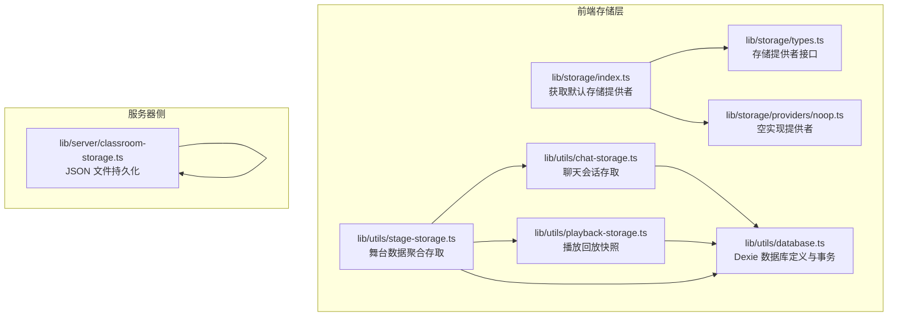
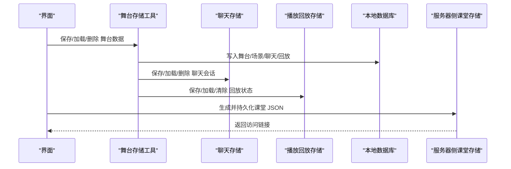
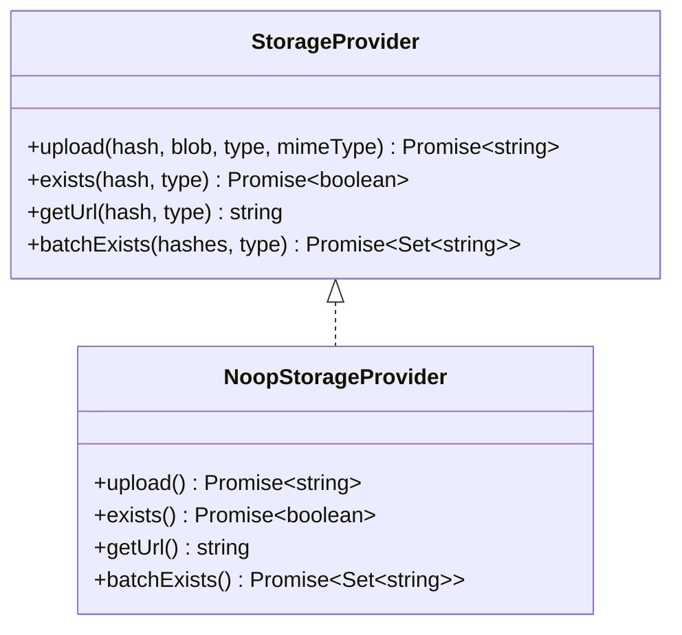
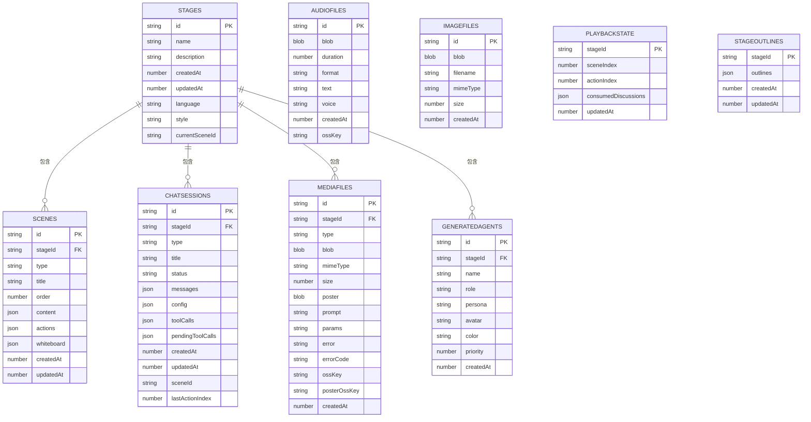
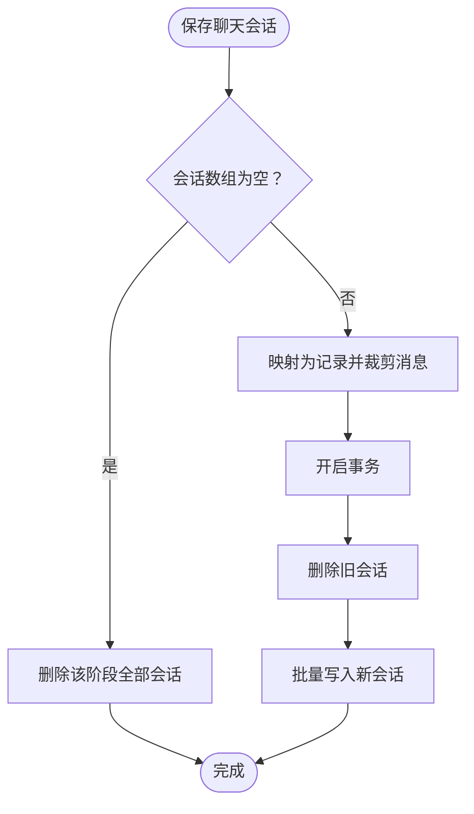
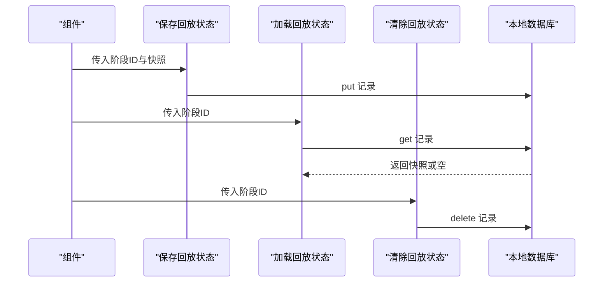
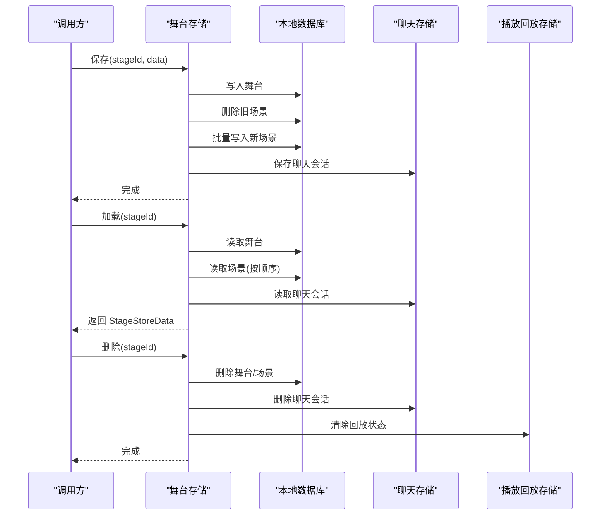
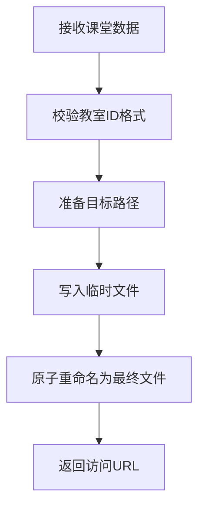
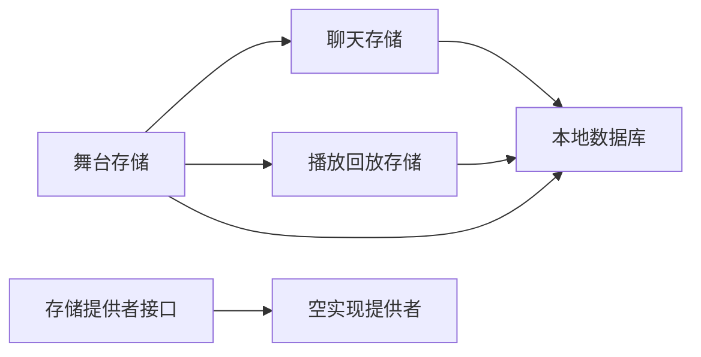

# 存储管理工具

<cite>
**本文引用的文件**
- [lib/storage/index.ts](file://lib/storage/index.ts)
- [lib/storage/types.ts](file://lib/storage/types.ts)
- [lib/storage/providers/noop.ts](file://lib/storage/providers/noop.ts)
- [configs/storage.ts](file://configs/storage.ts)
- [lib/utils/database.ts](file://lib/utils/database.ts)
- [lib/utils/chat-storage.ts](file://lib/utils/chat-storage.ts)
- [lib/utils/playback-storage.ts](file://lib/utils/playback-storage.ts)
- [lib/utils/stage-storage.ts](file://lib/utils/stage-storage.ts)
- [lib/server/classroom-storage.ts](file://lib/server/classroom-storage.ts)
</cite>

## 目录
1. [简介](#简介)
2. [项目结构](#项目结构)
3. [核心组件](#核心组件)
4. [架构总览](#架构总览)
5. [详细组件分析](#详细组件分析)
6. [依赖关系分析](#依赖关系分析)
7. [性能考量](#性能考量)
8. [故障排查指南](#故障排查指南)
9. [结论](#结论)
10. [附录](#附录)

## 简介
本文件系统性梳理 OpenMAIC 的存储管理工具，覆盖以下方面：
- 聊天存储：聊天会话的保存、检索与清理机制
- 播放回放存储：课堂播放状态的持久化与恢复
- 舞台存储工具：课堂场景数据的存储与管理
- 数据库工具：数据模型、查询与事务管理
- 存储策略选择：内存、本地与服务器存储的权衡
- 数据迁移、备份与恢复方案

## 项目结构
围绕存储相关的代码主要分布在如下位置：
- 存储抽象与提供者：lib/storage（接口与空实现）
- 本地数据库与模型：lib/utils/database.ts
- 面向业务的存储封装：lib/utils/chat-storage.ts、lib/utils/playback-storage.ts、lib/utils/stage-storage.ts
- 服务器侧课堂持久化：lib/server/classroom-storage.ts
- 存储相关配置：configs/storage.ts

图表来源
- [lib/storage/index.ts:1-13](file://lib/storage/index.ts#L1-L13)
- [lib/storage/types.ts:1-13](file://lib/storage/types.ts#L1-L13)
- [lib/storage/providers/noop.ts:1-18](file://lib/storage/providers/noop.ts#L1-L18)
- [lib/utils/database.ts:176-315](file://lib/utils/database.ts#L176-L315)
- [lib/utils/chat-storage.ts:1-82](file://lib/utils/chat-storage.ts#L1-L82)
- [lib/utils/playback-storage.ts:1-59](file://lib/utils/playback-storage.ts#L1-L59)
- [lib/utils/stage-storage.ts:1-228](file://lib/utils/stage-storage.ts#L1-L228)
- [lib/server/classroom-storage.ts:1-85](file://lib/server/classroom-storage.ts#L1-L85)

章节来源
- [lib/storage/index.ts:1-13](file://lib/storage/index.ts#L1-L13)
- [lib/storage/types.ts:1-13](file://lib/storage/types.ts#L1-L13)
- [lib/storage/providers/noop.ts:1-18](file://lib/storage/providers/noop.ts#L1-L18)
- [lib/utils/database.ts:176-315](file://lib/utils/database.ts#L176-L315)
- [lib/utils/chat-storage.ts:1-82](file://lib/utils/chat-storage.ts#L1-L82)
- [lib/utils/playback-storage.ts:1-59](file://lib/utils/playback-storage.ts#L1-L59)
- [lib/utils/stage-storage.ts:1-228](file://lib/utils/stage-storage.ts#L1-L228)
- [lib/server/classroom-storage.ts:1-85](file://lib/server/classroom-storage.ts#L1-L85)

## 核心组件
- 存储提供者接口与默认实现
  - 接口定义包含上传、存在性检查、批量存在性检查与构建下载 URL 的能力，支持媒体类型区分。
  - 默认提供者为空实现，用于在未配置外部存储时保证运行。
- 本地数据库与模型
  - 基于 Dexie 的多表结构，涵盖舞台、场景、音频、图片、聊天会话、播放回放快照、生成大纲、媒体文件、AI 生成代理等。
  - 提供版本迁移、事务、导出/导入、统计查询等辅助能力。
- 聊天存储
  - 将会话按阶段写入独立表，自动截断消息数量上限，清理运行时状态，支持批量写入与删除。
- 播放回放存储
  - 以阶段为单位保存最小可恢复状态（场景索引、动作索引、已消费讨论），提供保存、加载与清除。
- 舞台存储工具
  - 统一封装舞台、场景、聊天与播放状态的保存、加载、删除与列表；提供首张幻灯片缩略图解析占位符的能力。
- 服务器侧课堂存储
  - 将课堂数据以 JSON 文件形式写入磁盘目录，提供原子写入与校验。

章节来源
- [lib/storage/types.ts:1-13](file://lib/storage/types.ts#L1-L13)
- [lib/storage/providers/noop.ts:1-18](file://lib/storage/providers/noop.ts#L1-L18)
- [lib/utils/database.ts:36-173](file://lib/utils/database.ts#L36-L173)
- [lib/utils/chat-storage.ts:15-51](file://lib/utils/chat-storage.ts#L15-L51)
- [lib/utils/playback-storage.ts:10-58](file://lib/utils/playback-storage.ts#L10-L58)
- [lib/utils/stage-storage.ts:17-132](file://lib/utils/stage-storage.ts#L17-L132)
- [lib/server/classroom-storage.ts:37-84](file://lib/server/classroom-storage.ts#L37-L84)

## 架构总览
下图展示前端本地存储与服务器侧课堂持久化的整体交互：

图表来源
- [lib/utils/stage-storage.ts:36-132](file://lib/utils/stage-storage.ts#L36-L132)
- [lib/utils/chat-storage.ts:21-81](file://lib/utils/chat-storage.ts#L21-L81)
- [lib/utils/playback-storage.ts:21-58](file://lib/utils/playback-storage.ts#L21-L58)
- [lib/server/classroom-storage.ts:61-84](file://lib/server/classroom-storage.ts#L61-L84)

## 详细组件分析

### 存储提供者与默认实现
- 设计要点
  - 抽象接口统一上传、存在性检查与 URL 构建，便于替换为云存储或自建服务。
  - 默认提供者返回空值，避免在无外部存储配置时出现异常。
- 使用建议
  - 在生产环境应注入真实提供者；开发/演示环境可用默认空实现以快速启动。

图表来源
- [lib/storage/types.ts:3-12](file://lib/storage/types.ts#L3-L12)
- [lib/storage/providers/noop.ts:4-17](file://lib/storage/providers/noop.ts#L4-L17)

章节来源
- [lib/storage/types.ts:1-13](file://lib/storage/types.ts#L1-L13)
- [lib/storage/providers/noop.ts:1-18](file://lib/storage/providers/noop.ts#L1-L18)
- [lib/storage/index.ts:1-13](file://lib/storage/index.ts#L1-L13)

### 数据库工具与数据模型
- 数据模型概览
  - 舞台、场景、音频、图片、聊天会话、播放回放快照、生成大纲、媒体文件、AI 生成代理等。
  - 多表联合查询与事务支持，确保一致性。
- 版本迁移与兼容
  - 通过版本链式升级处理表结构调整与数据重写（如媒体文件复合主键迁移）。
- 辅助能力
  - 初始化请求持久化存储、导出/导入、统计查询、批量删除等。

图表来源
- [lib/utils/database.ts:38-173](file://lib/utils/database.ts#L38-L173)

章节来源
- [lib/utils/database.ts:176-315](file://lib/utils/database.ts#L176-L315)
- [lib/utils/database.ts:319-382](file://lib/utils/database.ts#L319-L382)
- [lib/utils/database.ts:384-445](file://lib/utils/database.ts#L384-L445)

### 聊天存储工具
- 功能特性
  - 保存：对活动会话标记为中断，清理运行时状态，截断消息至上限，批量写入。
  - 加载：按创建时间排序返回会话列表。
  - 删除：按阶段删除所有会话。
- 性能与可靠性
  - 使用事务包裹删除与插入，避免部分写入。
  - 截断策略控制单会话消息规模，防止 IndexedDB 膨胀。

图表来源
- [lib/utils/chat-storage.ts:21-51](file://lib/utils/chat-storage.ts#L21-L51)

章节来源
- [lib/utils/chat-storage.ts:15-82](file://lib/utils/chat-storage.ts#L15-L82)

### 播放回放存储工具
- 功能特性
  - 快照包含场景索引、动作索引与已消费讨论集合，支持可选场景标识。
  - 保存、加载与清除，每个阶段最多一条回放记录。
- 使用场景
  - 页面刷新后从断点恢复播放进度，提升用户体验。

图表来源
- [lib/utils/playback-storage.ts:21-58](file://lib/utils/playback-storage.ts#L21-L58)

章节来源
- [lib/utils/playback-storage.ts:10-59](file://lib/utils/playback-storage.ts#L10-L59)

### 舞台存储工具
- 功能特性
  - 保存：写入舞台元信息、删除旧场景并批量写入新场景、保存聊天会话。
  - 加载：读取舞台、按顺序读取场景、加载聊天会话，计算当前场景。
  - 删除：级联删除舞台、场景、聊天会话、播放回放状态。
  - 列表：按更新时间倒序列出舞台及其场景数。
  - 缩略图：解析首张幻灯片中的占位媒体为真实图片。
- 关键流程
  - 保存与加载均使用事务，保证一致性。
  - 聊天与回放分别委托专用模块处理。

图表来源
- [lib/utils/stage-storage.ts:36-132](file://lib/utils/stage-storage.ts#L36-L132)

章节来源
- [lib/utils/stage-storage.ts:17-228](file://lib/utils/stage-storage.ts#L17-L228)

### 服务器侧课堂存储
- 功能特性
  - 将课堂数据序列化为 JSON 并原子写入磁盘，提供目录校验与安全命名。
  - 支持构建访问 URL，便于分享。
- 使用建议
  - 生产环境建议配合静态资源服务与 CDN，确保可扩展性与高可用。

图表来源
- [lib/server/classroom-storage.ts:44-84](file://lib/server/classroom-storage.ts#L44-L84)

章节来源
- [lib/server/classroom-storage.ts:37-85](file://lib/server/classroom-storage.ts#L37-L85)

## 依赖关系分析
- 组件耦合
  - 舞台存储同时依赖聊天与播放回放模块，形成业务层聚合。
  - 所有本地存取均通过数据库模块进行，保持一致的事务与查询接口。
- 外部依赖
  - 本地数据库基于 Dexie；存储提供者接口面向外部存储插件。
- 循环依赖
  - 当前模块间无循环依赖，职责清晰。

图表来源
- [lib/utils/stage-storage.ts:10-12](file://lib/utils/stage-storage.ts#L10-L12)
- [lib/utils/chat-storage.ts:10](file://lib/utils/chat-storage.ts#L10)
- [lib/utils/playback-storage.ts:8](file://lib/utils/playback-storage.ts#L8)
- [lib/storage/types.ts:3-12](file://lib/storage/types.ts#L3-L12)
- [lib/storage/providers/noop.ts:4](file://lib/storage/providers/noop.ts#L4)

章节来源
- [lib/utils/stage-storage.ts:10-12](file://lib/utils/stage-storage.ts#L10-L12)
- [lib/utils/chat-storage.ts:10](file://lib/utils/chat-storage.ts#L10)
- [lib/utils/playback-storage.ts:8](file://lib/utils/playback-storage.ts#L8)
- [lib/storage/types.ts:3-12](file://lib/storage/types.ts#L3-L12)
- [lib/storage/providers/noop.ts:4-17](file://lib/storage/providers/noop.ts#L4-L17)

## 性能考量
- IndexedDB 与 Dexie
  - 使用事务批量写入，减少碎片与锁竞争。
  - 合理设置索引（如复合索引）以优化查询。
  - 对大对象（媒体）采用分表或外部存储，避免主表膨胀。
- 消息截断与清理
  - 聊天消息截断上限可显著降低存储体积与查询开销。
- 原子写入与持久化
  - 服务器侧 JSON 写入采用临时文件+重命名，避免部分写入。
  - 浏览器端请求持久化存储，降低被系统回收的风险。

## 故障排查指南
- 数据库初始化失败
  - 检查浏览器是否支持 IndexedDB 与持久化存储；查看日志输出。
- 导入/导出异常
  - 确认数据结构与版本匹配；逐表核对字段。
- 媒体占位符未解析
  - 检查媒体文件表中是否存在对应记录；确认复合主键格式正确。
- 课堂 JSON 写入失败
  - 校验目录权限与磁盘空间；确认教室 ID 符合命名规范。

章节来源
- [lib/utils/database.ts:323-334](file://lib/utils/database.ts#L323-L334)
- [lib/utils/database.ts:365-382](file://lib/utils/database.ts#L365-L382)
- [lib/utils/stage-storage.ts:168-214](file://lib/utils/stage-storage.ts#L168-L214)
- [lib/server/classroom-storage.ts:44-84](file://lib/server/classroom-storage.ts#L44-L84)

## 结论
本存储体系以 Dexie 为核心，结合专用的聊天与播放回放模块，实现了课堂场景数据的可靠持久化。通过事务、截断与版本迁移等手段，兼顾了性能与可维护性。服务器侧提供 JSON 原子写入能力，满足分享与复用需求。建议在生产环境中引入外部存储提供者与 CDN，以进一步提升扩展性与稳定性。

## 附录

### 存储策略选择建议
- 内存存储
  - 适用：临时状态、非关键数据。
  - 风险：页面刷新即丢失。
- 本地存储（IndexedDB/Dexie）
  - 适用：用户生成内容、会话与回放状态。
  - 优势：无需网络、离线可用。
  - 注意：容量限制、版本迁移。
- 服务器存储（JSON/对象存储）
  - 适用：课堂分享、跨设备同步。
  - 优势：可扩展、可备份。
  - 注意：网络与权限、CDN 加速。

### 数据迁移、备份与恢复
- 迁移
  - 使用数据库版本链与升级回调处理结构变更（如媒体文件主键迁移）。
- 备份
  - 导出数据库内容（含舞台、场景、聊天、回放等表）。
- 恢复
  - 在新实例中执行导入，确保事务内批量写入。

章节来源
- [lib/utils/database.ts:258-282](file://lib/utils/database.ts#L258-L282)
- [lib/utils/database.ts:345-382](file://lib/utils/database.ts#L345-L382)
- [configs/storage.ts:1](file://configs/storage.ts#L1)