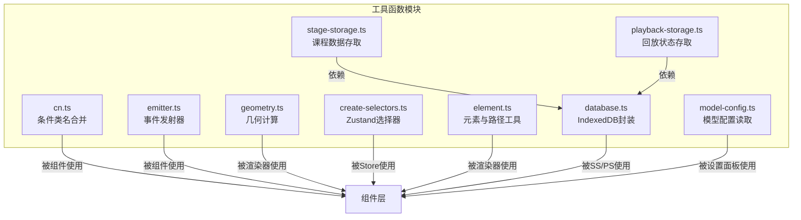
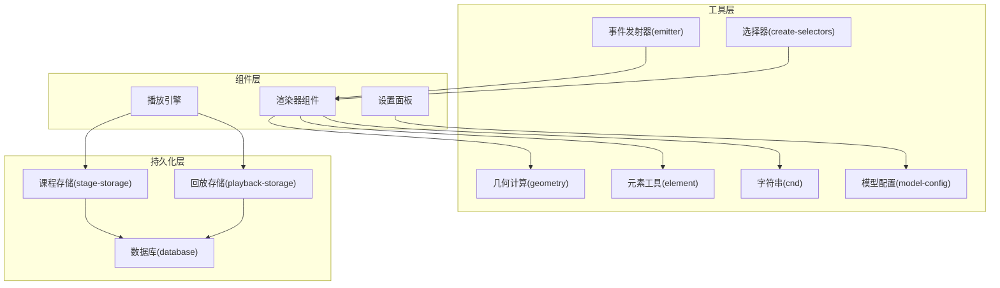
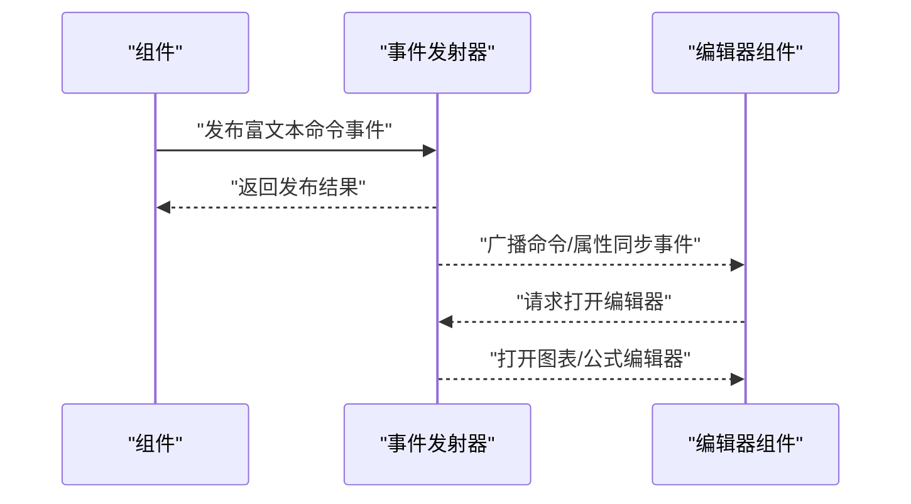
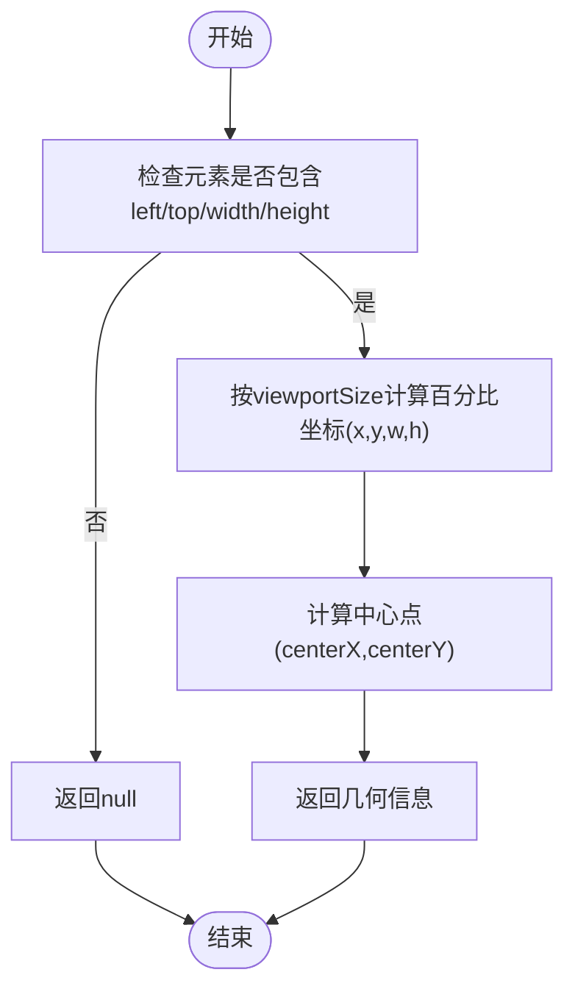
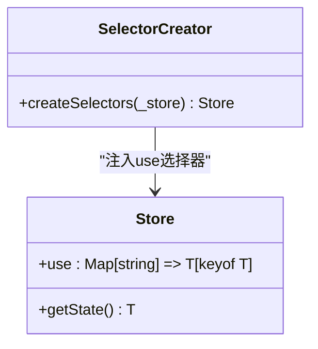
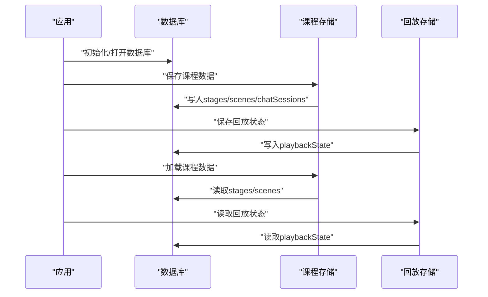
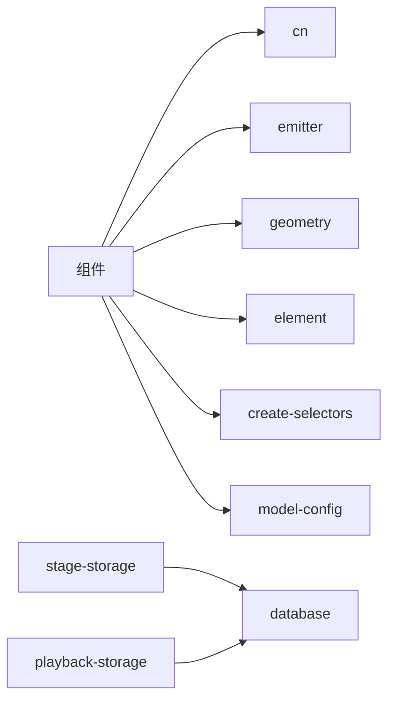

# 工具函数库

<cite>
**本文引用的文件**
- [lib/utils/cn.ts](file://lib/utils/cn.ts)
- [lib/utils/emitter.ts](file://lib/utils/emitter.ts)
- [lib/utils/geometry.ts](file://lib/utils/geometry.ts)
- [lib/utils/create-selectors.ts](file://lib/utils/create-selectors.ts)
- [lib/utils/element.ts](file://lib/utils/element.ts)
- [lib/utils/index.ts](file://lib/utils/index.ts)
- [lib/utils/database.ts](file://lib/utils/database.ts)
- [lib/utils/stage-storage.ts](file://lib/utils/stage-storage.ts)
- [lib/utils/playback-storage.ts](file://lib/utils/playback-storage.ts)
- [lib/utils/model-config.ts](file://lib/utils/model-config.ts)
</cite>

## 目录
1. [简介](#简介)
2. [项目结构](#项目结构)
3. [核心组件](#核心组件)
4. [架构总览](#架构总览)
5. [详细组件分析](#详细组件分析)
6. [依赖分析](#依赖分析)
7. [性能考虑](#性能考虑)
8. [故障排查指南](#故障排查指南)
9. [结论](#结论)
10. [附录](#附录)

## 简介
本文件系统性梳理并文档化工具函数库，覆盖以下主题：
- 字符串处理：条件类名合并工具
- 数组与对象操作：元素范围计算、对齐吸附线去重、ID 映射、路径生成等
- 几何计算：百分比坐标转换、元素定位查找、最近角点判定
- 事件发射器：富文本命令分发与编辑器开关事件
- 选择器创建工具：Zustand 状态选择器增强
- 数据持久化：IndexedDB 数据库封装、课程与回放状态存储
- 使用示例与注意事项：在组件中的典型应用与性能建议

## 项目结构
工具函数集中于 lib/utils 目录，按功能域拆分模块，便于按需导入与复用。

图表来源
- [lib/utils/cn.ts:1-7](file://lib/utils/cn.ts#L1-L7)
- [lib/utils/emitter.ts:1-30](file://lib/utils/emitter.ts#L1-L30)
- [lib/utils/geometry.ts:1-122](file://lib/utils/geometry.ts#L1-L122)
- [lib/utils/create-selectors.ts:1-16](file://lib/utils/create-selectors.ts#L1-L16)
- [lib/utils/element.ts:1-259](file://lib/utils/element.ts#L1-L259)
- [lib/utils/database.ts:1-446](file://lib/utils/database.ts#L1-L446)
- [lib/utils/stage-storage.ts:1-228](file://lib/utils/stage-storage.ts#L1-L228)
- [lib/utils/playback-storage.ts:1-59](file://lib/utils/playback-storage.ts#L1-L59)
- [lib/utils/model-config.ts:1-24](file://lib/utils/model-config.ts#L1-L24)

章节来源
- [lib/utils/index.ts:1-2](file://lib/utils/index.ts#L1-L2)

## 核心组件
- 条件类名合并：基于 clsx 与 tailwind-merge 的安全合并工具，避免重复与冲突类名
- 事件发射器：统一的富文本命令与编辑器开关事件中心，解耦组件间通信
- 几何计算：百分比坐标换算、元素定位查询、最近角点计算
- 选择器创建：为 Zustand Store 自动注入 use.xxx 选择器，简化订阅写法
- 元素工具：旋转范围计算、对齐吸附线去重、ID 映射、SVG 路径生成、视口可见性判断
- 数据库与存储：IndexedDB 封装、课程数据持久化、回放状态快照

章节来源
- [lib/utils/cn.ts:1-7](file://lib/utils/cn.ts#L1-L7)
- [lib/utils/emitter.ts:1-30](file://lib/utils/emitter.ts#L1-L30)
- [lib/utils/geometry.ts:1-122](file://lib/utils/geometry.ts#L1-L122)
- [lib/utils/create-selectors.ts:1-16](file://lib/utils/create-selectors.ts#L1-L16)
- [lib/utils/element.ts:1-259](file://lib/utils/element.ts#L1-L259)
- [lib/utils/database.ts:1-446](file://lib/utils/database.ts#L1-L446)
- [lib/utils/stage-storage.ts:1-228](file://lib/utils/stage-storage.ts#L1-L228)
- [lib/utils/playback-storage.ts:1-59](file://lib/utils/playback-storage.ts#L1-L59)
- [lib/utils/model-config.ts:1-24](file://lib/utils/model-config.ts#L1-L24)

## 架构总览
工具函数库采用“按功能域模块化”的组织方式，通过明确的导出入口与类型约束，确保在组件层与服务层之间保持低耦合高内聚。

图表来源
- [lib/utils/emitter.ts:1-30](file://lib/utils/emitter.ts#L1-L30)
- [lib/utils/geometry.ts:1-122](file://lib/utils/geometry.ts#L1-L122)
- [lib/utils/create-selectors.ts:1-16](file://lib/utils/create-selectors.ts#L1-L16)
- [lib/utils/element.ts:1-259](file://lib/utils/element.ts#L1-L259)
- [lib/utils/cn.ts:1-7](file://lib/utils/cn.ts#L1-L7)
- [lib/utils/model-config.ts:1-24](file://lib/utils/model-config.ts#L1-L24)
- [lib/utils/database.ts:1-446](file://lib/utils/database.ts#L1-L446)
- [lib/utils/stage-storage.ts:1-228](file://lib/utils/stage-storage.ts#L1-L228)
- [lib/utils/playback-storage.ts:1-59](file://lib/utils/playback-storage.ts#L1-L59)

## 详细组件分析

### 条件类名合并（cn）
- 功能概述：将多个类名输入经由 clsx 合并，再通过 tailwind-merge 去重与覆盖，输出最终类名字符串
- 关键特性：类型安全、自动去重、Tailwind 冲突覆盖
- 典型场景：动态样式切换、主题切换、条件样式拼接
- 性能特性：O(n) 字符串拼接与解析，常数级开销；适合高频调用
- 使用注意：避免传入空字符串或无意义片段；与 Tailwind 预构建规则配合最佳

章节来源
- [lib/utils/cn.ts:1-7](file://lib/utils/cn.ts#L1-L7)
- [lib/utils/index.ts:1-2](file://lib/utils/index.ts#L1-L2)

### 事件发射器（emitter）
- 功能概述：定义富文本命令与编辑器开关等事件枚举，封装 mitt 发布/订阅，提供强类型事件映射
- 类型设计：事件枚举 + 事件载荷接口，保证订阅/发布一致性
- 典型场景：富文本编辑器命令分发、LaTeX/图表编辑器弹窗控制
- 性能特性：mitt 为轻量事件总线，内存占用低；事件订阅/触发为 O(1)
- 使用注意：避免在组件卸载后仍持有回调引用；必要时提供清理函数

图表来源
- [lib/utils/emitter.ts:1-30](file://lib/utils/emitter.ts#L1-L30)

章节来源
- [lib/utils/emitter.ts:1-30](file://lib/utils/emitter.ts#L1-L30)

### 几何计算（geometry）
- 功能概述：将元素绝对坐标转换为百分比坐标，支持不同场景结构；计算元素中心点与最近角点
- 输入输出：支持旧/新场景结构；返回百分比几何信息（x,y,w,h,centerX,centerY）
- 典型场景：画布布局、吸附对齐、元素定位与交互反馈
- 性能特性：纯数学运算，O(1) 时间复杂度；findNearestCorner 对四个角点遍历，常数时间
- 使用注意：viewportSize 应与渲染视口一致；16:9 宽高比用于高度换算

图表来源
- [lib/utils/geometry.ts:11-45](file://lib/utils/geometry.ts#L11-L45)

章节来源
- [lib/utils/geometry.ts:1-122](file://lib/utils/geometry.ts#L1-L122)

### 选择器创建工具（create-selectors）
- 功能概述：为 Zustand Store 注入 use.xxx 选择器，基于当前状态键名自动生成订阅函数
- 设计要点：泛型约束 + 动态属性枚举，保证类型安全与易用性
- 典型场景：在组件中以 use.storeKey 形式直接订阅状态，减少样板代码
- 性能特性：仅在初始化时遍历一次状态键，后续订阅为 O(1)
- 使用注意：Store 初始化后调用，避免在未绑定状态时访问

图表来源
- [lib/utils/create-selectors.ts:1-16](file://lib/utils/create-selectors.ts#L1-L16)

章节来源
- [lib/utils/create-selectors.ts:1-16](file://lib/utils/create-selectors.ts#L1-L16)

### 元素与路径工具（element）
- 功能概述：旋转范围计算、对齐吸附线去重、ID 映射、SVG 路径生成、视口可见性判断
- 关键算法：
  - 旋转矩形范围：利用辅助角与半径计算四顶点投影，求 x/y 范围
  - 对齐吸附线去重：按位置聚合，合并区间
  - SVG 路径：支持折线、曲线、三次贝塞尔等路径公式
- 典型场景：元素拖拽/缩放边界计算、吸附对齐、渲染路径生成
- 性能特性：旋转范围 O(1)；吸附线去重 O(n)；路径生成 O(1)
- 使用注意：折线/曲线分支较多，确保输入参数类型正确

章节来源
- [lib/utils/element.ts:1-259](file://lib/utils/element.ts#L1-L259)

### 数据库与存储（database、stage-storage、playback-storage）
- 数据库封装：Dexie 封装 IndexedDB，定义多表结构与版本迁移策略
- 课程存储：将 Stage/Scene/Chat 拆表持久化，支持批量写入与删除
- 回放存储：保存播放断点场景索引与已消费讨论，支持恢复播放
- 典型场景：应用启动初始化、课程数据备份/恢复、播放断点续播
- 性能特性：批量写入减少事务次数；版本升级脚本幂等
- 使用注意：跨课程媒体文件使用复合主键避免冲突；持久化前请求持久存储

图表来源
- [lib/utils/database.ts:182-311](file://lib/utils/database.ts#L182-L311)
- [lib/utils/stage-storage.ts:36-110](file://lib/utils/stage-storage.ts#L36-L110)
- [lib/utils/playback-storage.ts:21-51](file://lib/utils/playback-storage.ts#L21-L51)

章节来源
- [lib/utils/database.ts:1-446](file://lib/utils/database.ts#L1-L446)
- [lib/utils/stage-storage.ts:1-228](file://lib/utils/stage-storage.ts#L1-L228)
- [lib/utils/playback-storage.ts:1-59](file://lib/utils/playback-storage.ts#L1-L59)

### 模型配置读取（model-config）
- 功能概述：从设置 Store 中读取当前 Provider 与 Model 配置，输出标准化模型字符串与基础地址/密钥信息
- 典型场景：对话/生成接口调用前的配置准备
- 性能特性：读取 Store 状态，O(1)
- 使用注意：Provider 配置缺失时默认字段为空字符串，调用方需做兜底

章节来源
- [lib/utils/model-config.ts:1-24](file://lib/utils/model-config.ts#L1-L24)

## 依赖分析
- 组件依赖：渲染器与设置面板依赖工具函数；事件发射器作为跨组件通信中枢
- 外部依赖：mitt（事件总线）、dexie（IndexedDB）、nanoid（ID 生成）、tinycolor2（颜色处理）
- 内聚与耦合：各模块职责单一，通过明确接口耦合；事件与存储模块对上层透明

图表来源
- [lib/utils/emitter.ts:1-30](file://lib/utils/emitter.ts#L1-L30)
- [lib/utils/geometry.ts:1-122](file://lib/utils/geometry.ts#L1-L122)
- [lib/utils/element.ts:1-259](file://lib/utils/element.ts#L1-L259)
- [lib/utils/create-selectors.ts:1-16](file://lib/utils/create-selectors.ts#L1-L16)
- [lib/utils/cn.ts:1-7](file://lib/utils/cn.ts#L1-L7)
- [lib/utils/model-config.ts:1-24](file://lib/utils/model-config.ts#L1-L24)
- [lib/utils/database.ts:1-446](file://lib/utils/database.ts#L1-L446)
- [lib/utils/stage-storage.ts:1-228](file://lib/utils/stage-storage.ts#L1-L228)
- [lib/utils/playback-storage.ts:1-59](file://lib/utils/playback-storage.ts#L1-L59)

## 性能考虑
- 字符串与样式：cn 合并为 O(n)，建议在状态稳定时缓存结果
- 事件总线：mitt 订阅/触发为 O(1)，避免在高频循环中重复创建事件监听
- 几何计算：百分比换算与最近角点均为 O(1)/O(n) 常数级，可放心在渲染帧中调用
- 存储操作：批量写入优于单条插入；版本迁移脚本幂等，避免重复执行
- 渲染路径：SVG 路径生成按分支选择，确保输入参数类型与范围正确，减少无效计算

## 故障排查指南
- 事件未触发：确认事件名称与载荷类型一致；检查订阅者是否在组件卸载后仍持有引用
- 百分比坐标异常：核对 viewportSize 与渲染视口一致；确认元素具备 left/top/width/height
- 吸附线不生效：检查对齐线范围合并逻辑；确保相同位置的多条线被正确去重
- 数据库初始化失败：检查浏览器存储权限与持久化请求；查看日志错误堆栈
- 回放断点错位：确认 sceneId 与断点记录匹配；不匹配时应丢弃旧断点

章节来源
- [lib/utils/emitter.ts:1-30](file://lib/utils/emitter.ts#L1-L30)
- [lib/utils/geometry.ts:1-122](file://lib/utils/geometry.ts#L1-L122)
- [lib/utils/element.ts:1-259](file://lib/utils/element.ts#L1-L259)
- [lib/utils/database.ts:323-334](file://lib/utils/database.ts#L323-L334)
- [lib/utils/playback-storage.ts:40-51](file://lib/utils/playback-storage.ts#L40-L51)

## 结论
工具函数库以模块化与类型安全为核心设计原则，覆盖样式、几何、事件、状态与持久化等关键领域。通过清晰的接口与合理的性能考量，既满足组件层的高频调用需求，又保障了跨模块协作的稳定性与可维护性。

## 附录
- 导出入口：cn 作为对外唯一导出项，其余工具按需导入
- 版本与兼容：数据库版本号与迁移脚本确保向后兼容；媒体文件主键复合化避免冲突
- 最佳实践：在组件中优先使用 use.xxx 选择器；对高频计算结果进行缓存；严格校验事件与几何输入

章节来源
- [lib/utils/index.ts:1-2](file://lib/utils/index.ts#L1-L2)
- [lib/utils/database.ts:176-311](file://lib/utils/database.ts#L176-L311)