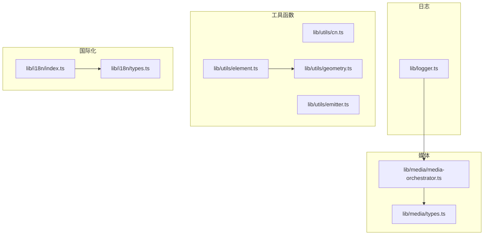
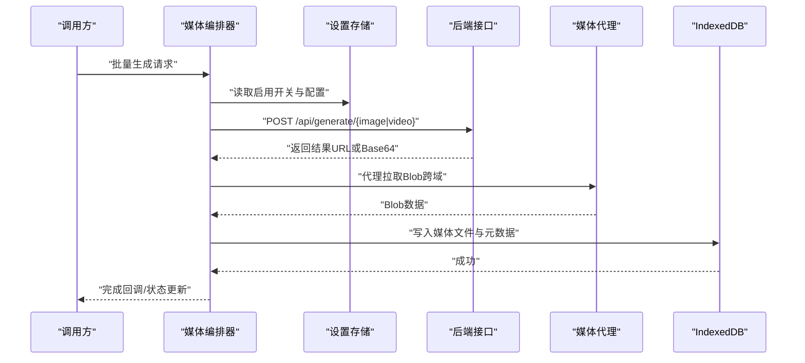
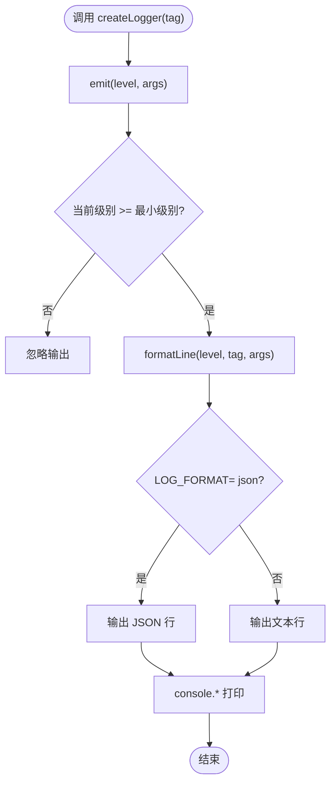
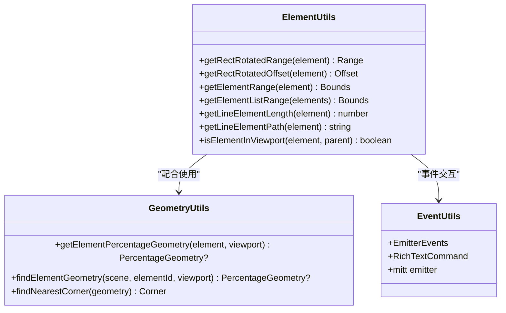
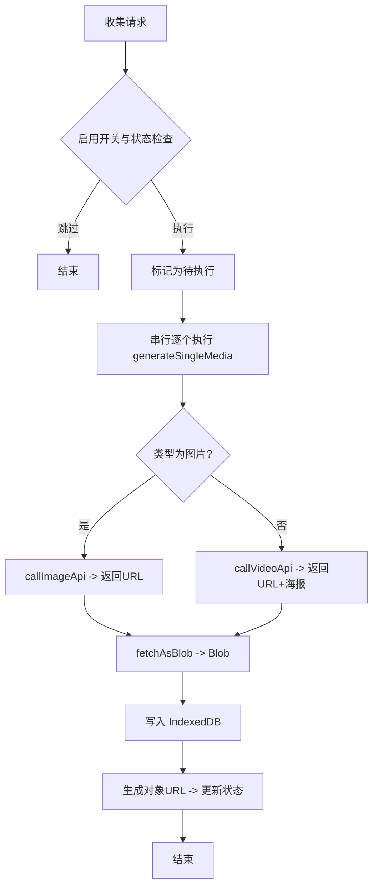
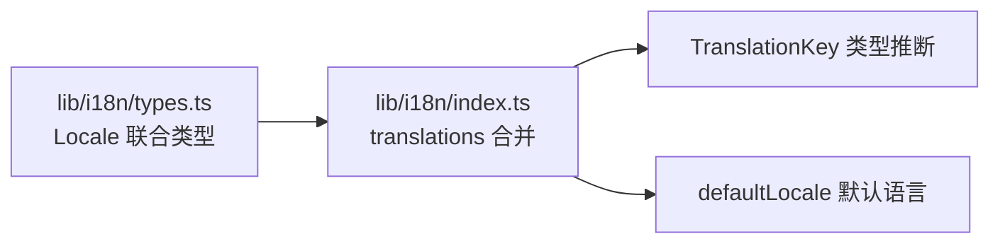
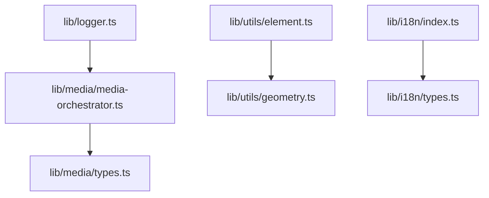

# 工具和实用程序

<cite>
**本文引用的文件**
- [logger.ts](file://lib/logger.ts)
- [cn.ts](file://lib/utils/cn.ts)
- [element.ts](file://lib/utils/element.ts)
- [geometry.ts](file://lib/utils/geometry.ts)
- [emitter.ts](file://lib/utils/emitter.ts)
- [types.ts](file://lib/media/types.ts)
- [media-orchestrator.ts](file://lib/media/media-orchestrator.ts)
- [index.ts](file://lib/i18n/index.ts)
- [types.ts](file://lib/i18n/types.ts)
</cite>

## 目录
1. [简介](#简介)
2. [项目结构](#项目结构)
3. [核心组件](#核心组件)
4. [架构总览](#架构总览)
5. [详细组件分析](#详细组件分析)
6. [依赖分析](#依赖分析)
7. [性能考虑](#性能考虑)
8. [故障排查指南](#故障排查指南)
9. [结论](#结论)
10. [附录](#附录)

## 简介
本文件聚焦于 OpenMAIC 项目中的工具与实用程序模块，系统性地梳理并文档化以下能力：
- 日志系统：日志级别、格式化选项与输出目标配置
- 工具函数库：字符串处理、数值计算、几何与元素操作、事件总线
- 媒体处理工具：图像/视频生成类型定义、前端编排器与存储策略
- 国际化（i18n）系统：多语言支持、翻译合并与默认语言配置
- 导航与格式化：几何坐标换算、百分比布局、最近角落定位等

文档旨在帮助开发者快速理解模块职责、调用方式、性能特征与扩展方法。

## 项目结构
围绕“工具与实用程序”的核心目录与文件如下：
- 日志：lib/logger.ts
- 工具函数：lib/utils 下的 cn.ts、element.ts、geometry.ts、emitter.ts 等
- 媒体类型与编排：lib/media/types.ts、media-orchestrator.ts
- 国际化：lib/i18n/index.ts、types.ts

**图表来源**
- [logger.ts:1-53](file://lib/logger.ts#L1-L53)
- [cn.ts:1-7](file://lib/utils/cn.ts#L1-L7)
- [element.ts:1-259](file://lib/utils/element.ts#L1-L259)
- [geometry.ts:1-122](file://lib/utils/geometry.ts#L1-L122)
- [emitter.ts:1-30](file://lib/utils/emitter.ts#L1-L30)
- [types.ts:1-321](file://lib/media/types.ts#L1-L321)
- [media-orchestrator.ts:1-287](file://lib/media/media-orchestrator.ts#L1-L287)
- [index.ts:1-27](file://lib/i18n/index.ts#L1-L27)
- [types.ts:1-4](file://lib/i18n/types.ts#L1-L4)

**章节来源**
- [logger.ts:1-53](file://lib/logger.ts#L1-L53)
- [cn.ts:1-7](file://lib/utils/cn.ts#L1-L7)
- [element.ts:1-259](file://lib/utils/element.ts#L1-L259)
- [geometry.ts:1-122](file://lib/utils/geometry.ts#L1-L122)
- [emitter.ts:1-30](file://lib/utils/emitter.ts#L1-L30)
- [types.ts:1-321](file://lib/media/types.ts#L1-L321)
- [media-orchestrator.ts:1-287](file://lib/media/media-orchestrator.ts#L1-L287)
- [index.ts:1-27](file://lib/i18n/index.ts#L1-L27)
- [types.ts:1-4](file://lib/i18n/types.ts#L1-L4)

## 核心组件
- 日志系统：基于环境变量控制最小日志级别与输出格式，统一输出到控制台
- 工具函数库：Tailwind 合并类名、元素旋转范围计算、百分比几何换算、富文本命令事件总线
- 媒体处理：统一的图像/视频生成类型定义与前端编排器，负责并发调度、结果持久化与状态更新
- 国际化：按模块聚合翻译键值，支持默认语言与键类型推断

**章节来源**
- [logger.ts:1-53](file://lib/logger.ts#L1-L53)
- [cn.ts:1-7](file://lib/utils/cn.ts#L1-L7)
- [element.ts:1-259](file://lib/utils/element.ts#L1-L259)
- [geometry.ts:1-122](file://lib/utils/geometry.ts#L1-L122)
- [emitter.ts:1-30](file://lib/utils/emitter.ts#L1-L30)
- [types.ts:1-321](file://lib/media/types.ts#L1-L321)
- [media-orchestrator.ts:1-287](file://lib/media/media-orchestrator.ts#L1-L287)
- [index.ts:1-27](file://lib/i18n/index.ts#L1-L27)
- [types.ts:1-4](file://lib/i18n/types.ts#L1-L4)

## 架构总览
下图展示媒体生成从请求到落盘与状态更新的整体流程，以及日志在其中的作用点。

**图表来源**
- [media-orchestrator.ts:31-184](file://lib/media/media-orchestrator.ts#L31-L184)
- [types.ts:281-321](file://lib/media/types.ts#L281-L321)

**章节来源**
- [media-orchestrator.ts:1-287](file://lib/media/media-orchestrator.ts#L1-L287)
- [types.ts:1-321](file://lib/media/types.ts#L1-L321)

## 详细组件分析

### 日志系统
- 功能要点
  - 支持 debug、info、warn、error 四级日志
  - 最小日志级别由环境变量控制，默认为 info
  - 输出格式可选 JSON 或人类可读格式
  - 统一通过 console.* 输出
- 使用建议
  - 生产环境建议提升最小级别并开启 JSON 格式，便于日志采集
  - 错误对象自动序列化为 stack/message，避免丢失堆栈

**图表来源**
- [logger.ts:28-52](file://lib/logger.ts#L28-L52)

**章节来源**
- [logger.ts:1-53](file://lib/logger.ts#L1-L53)

### 工具函数库
- Tailwind 类名合并：cn 函数将多个输入合并并去重冲突
- 元素几何与旋转
  - 计算旋转后矩形覆盖范围与偏移
  - 计算元素/元素组在画布中的边界范围
  - 计算线条长度与路径字符串
  - 判断元素是否在视口内
- 几何百分比换算
  - 将像素坐标换算为相对视口的百分比坐标（含 16:9 比例换算）
  - 根据场景与元素ID查找百分比几何
  - 计算元素中心到最近角落的距离
- 事件总线
  - 定义富文本命令事件与编辑器打开事件
  - 使用 mitt 实现轻量发布订阅

**图表来源**
- [element.ts:1-259](file://lib/utils/element.ts#L1-L259)
- [geometry.ts:1-122](file://lib/utils/geometry.ts#L1-L122)
- [emitter.ts:1-30](file://lib/utils/emitter.ts#L1-L30)

**章节来源**
- [cn.ts:1-7](file://lib/utils/cn.ts#L1-L7)
- [element.ts:1-259](file://lib/utils/element.ts#L1-L259)
- [geometry.ts:1-122](file://lib/utils/geometry.ts#L1-L122)
- [emitter.ts:1-30](file://lib/utils/emitter.ts#L1-L30)

### 媒体处理工具
- 类型定义
  - 图像/视频提供商标识、配置、生成参数与结果
  - 统一的媒体生成请求类型，支持异步任务适配器模式
- 编排器
  - 收集待执行的任务，按设置开关过滤已完成或失败项
  - 串行执行以控制并发，避免 API 限流
  - 拉取远程资源为 Blob，写入 IndexedDB 并生成对象 URL
  - 结构化错误码持久化，支持重试与恢复

**图表来源**
- [media-orchestrator.ts:31-184](file://lib/media/media-orchestrator.ts#L31-L184)
- [types.ts:281-321](file://lib/media/types.ts#L281-L321)

**章节来源**
- [types.ts:1-321](file://lib/media/types.ts#L1-L321)
- [media-orchestrator.ts:1-287](file://lib/media/media-orchestrator.ts#L1-L287)

### 国际化（i18n）系统
- 多语言支持
  - 默认语言为 zh-CN；提供 en-US 对应翻译
  - 按模块聚合翻译键值（common、stage、chat、generation、settings）
- 类型安全
  - 通过联合类型约束可用语言
  - 提供翻译键类型推断，减少拼写错误

**图表来源**
- [index.ts:1-27](file://lib/i18n/index.ts#L1-L27)
- [types.ts:1-4](file://lib/i18n/types.ts#L1-L4)

**章节来源**
- [index.ts:1-27](file://lib/i18n/index.ts#L1-L27)
- [types.ts:1-4](file://lib/i18n/types.ts#L1-L4)

## 依赖分析
- 日志系统被媒体编排器使用，贯穿错误记录与运行时诊断
- 工具函数之间存在协作关系：元素工具用于几何换算，几何工具用于场景定位
- 媒体编排器依赖设置存储、数据库与后端接口，形成完整的前端媒体管线
- 国际化系统独立，通过键名与翻译映射为 UI 层提供文案

**图表来源**
- [logger.ts:1-53](file://lib/logger.ts#L1-L53)
- [media-orchestrator.ts:1-287](file://lib/media/media-orchestrator.ts#L1-L287)
- [element.ts:1-259](file://lib/utils/element.ts#L1-L259)
- [geometry.ts:1-122](file://lib/utils/geometry.ts#L1-L122)
- [types.ts:1-321](file://lib/media/types.ts#L1-L321)
- [index.ts:1-27](file://lib/i18n/index.ts#L1-L27)
- [types.ts:1-4](file://lib/i18n/types.ts#L1-L4)

**章节来源**
- [logger.ts:1-53](file://lib/logger.ts#L1-L53)
- [media-orchestrator.ts:1-287](file://lib/media/media-orchestrator.ts#L1-L287)
- [element.ts:1-259](file://lib/utils/element.ts#L1-L259)
- [geometry.ts:1-122](file://lib/utils/geometry.ts#L1-L122)
- [types.ts:1-321](file://lib/media/types.ts#L1-L321)
- [index.ts:1-27](file://lib/i18n/index.ts#L1-L27)
- [types.ts:1-4](file://lib/i18n/types.ts#L1-L4)

## 性能考虑
- 日志
  - 控制最小级别与输出格式可降低 I/O 开销
  - JSON 格式利于结构化日志采集与检索
- 工具函数
  - 几何计算复杂度多为 O(n)，元素组范围计算注意批量处理
  - 视口判断与路径构造尽量缓存中间结果
- 媒体编排
  - 串行执行避免 API 并发限制导致的失败
  - Blob 写入 IndexedDB 建议分块与去重，避免重复下载
  - 对远端资源优先使用代理接口绕过跨域，减少失败重试
- 国际化
  - 翻译键合并发生在初始化阶段，运行时访问为常量时间

[本节为通用指导，无需特定文件来源]

## 故障排查指南
- 日志问题
  - 现象：无日志或日志过多
  - 排查：检查最小级别与格式环境变量；确认日志级别顺序与输出函数映射
- 媒体生成失败
  - 现象：任务失败且无法重试
  - 排查：检查设置开关、错误码持久化、代理接口可用性与网络权限
- 几何计算异常
  - 现象：元素越界或路径不正确
  - 排查：核对输入坐标、旋转角度与比例换算参数
- 国际化缺失
  - 现象：文案未翻译或显示键名
  - 排查：确认键名存在于对应语言映射，检查默认语言与键类型

**章节来源**
- [logger.ts:1-53](file://lib/logger.ts#L1-L53)
- [media-orchestrator.ts:155-183](file://lib/media/media-orchestrator.ts#L155-L183)
- [geometry.ts:11-45](file://lib/utils/geometry.ts#L11-L45)
- [index.ts:9-24](file://lib/i18n/index.ts#L9-L24)

## 结论
本项目工具与实用程序模块以清晰的职责划分与强类型定义支撑了前端功能的稳定性与可维护性。日志系统提供可控的可观测性；工具函数库覆盖 UI 几何与事件交互；媒体编排器构建了可靠的前端生成流水线；国际化系统保障多语言体验。建议在扩展新功能时遵循现有类型与命名约定，确保一致的开发体验与可测试性。

[本节为总结，无需特定文件来源]

## 附录
- 使用示例（路径指引）
  - 创建日志器并输出不同级别日志：[logger.ts:28-52](file://lib/logger.ts#L28-L52)
  - 合并 Tailwind 类名：[cn.ts:4-6](file://lib/utils/cn.ts#L4-L6)
  - 计算元素旋转范围与路径：[element.ts:21-246](file://lib/utils/element.ts#L21-L246)
  - 百分比几何换算与最近角落定位：[geometry.ts:11-121](file://lib/utils/geometry.ts#L11-L121)
  - 发布富文本命令事件：[emitter.ts:27-30](file://lib/utils/emitter.ts#L27-L30)
  - 统一媒体生成类型与任务适配器：[types.ts:281-321](file://lib/media/types.ts#L281-L321)
  - 媒体生成编排与持久化：[media-orchestrator.ts:31-184](file://lib/media/media-orchestrator.ts#L31-L184)
  - 多语言翻译合并与默认语言：[index.ts:9-24](file://lib/i18n/index.ts#L9-L24), [types.ts:1-4](file://lib/i18n/types.ts#L1-L4)
- 扩展开发指南
  - 新增日志标签：使用 createLogger(tag) 包裹业务模块
  - 新增媒体提供商：在类型定义中扩展标识与配置，实现适配器并在编排器中接入
  - 新增国际化模块：在 i18n 下新增文件并合并到 translations
  - 新增几何/元素工具：保持纯函数与类型安全，提供边界条件测试

[本节为补充说明，无需特定文件来源]