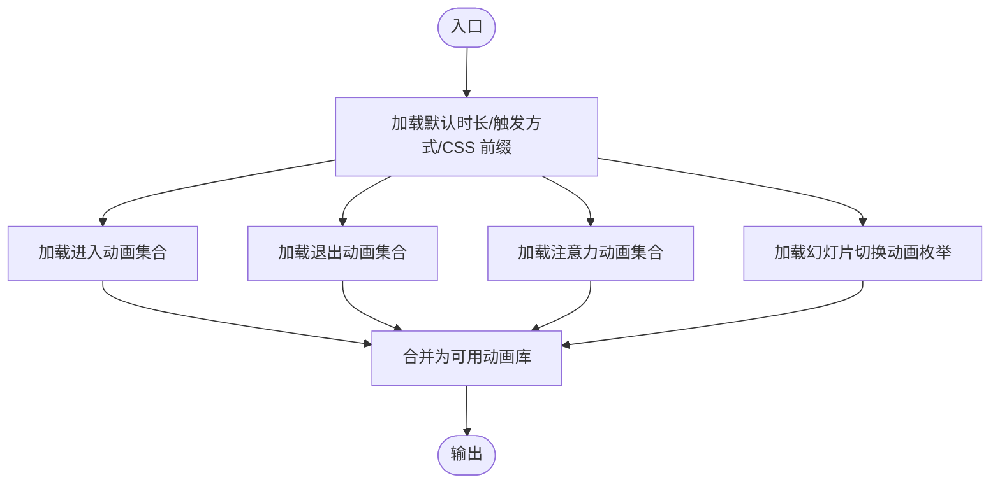
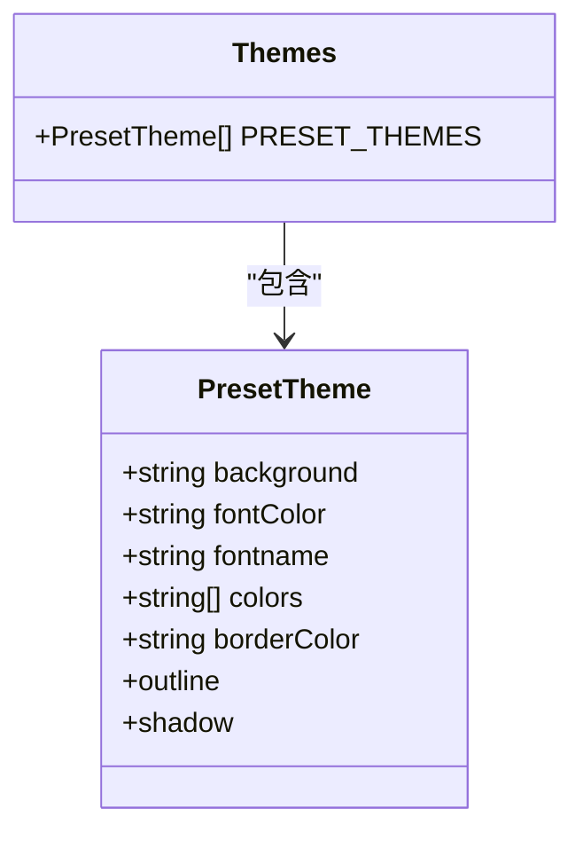
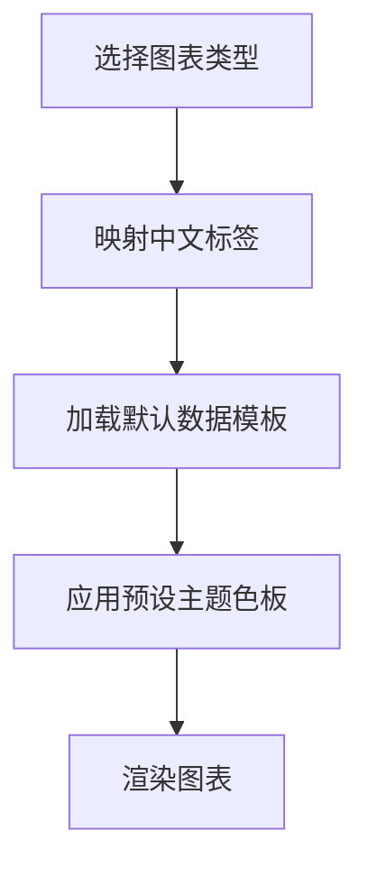
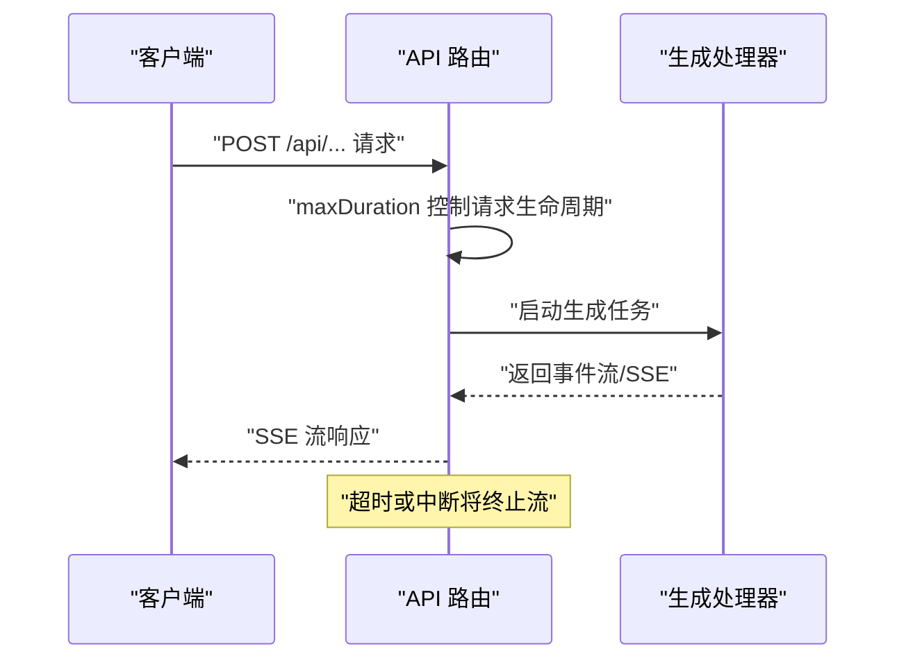

# 常量定义

<cite>
**本文引用的文件**
- [configs/animation.ts](file://configs/animation.ts)
- [configs/theme.ts](file://configs/theme.ts)
- [configs/font.ts](file://configs/font.ts)
- [configs/chart.ts](file://configs/chart.ts)
- [configs/latex.ts](file://configs/latex.ts)
- [configs/element.ts](file://configs/element.ts)
- [configs/hotkey.ts](file://configs/hotkey.ts)
- [configs/mime.ts](file://configs/mime.ts)
- [configs/storage.ts](file://configs/storage.ts)
- [lib/constants/generation.ts](file://lib/constants/generation.ts)
- [app/api/chat/route.ts](file://app/api/chat/route.ts)
- [app/api/generate/scene-content/route.ts](file://app/api/generate/scene-content/route.ts)
- [app/api/generate/scene-outlines-stream/route.ts](file://app/api/generate/scene-outlines-stream/route.ts)
- [app/api/generate/image/route.ts](file://app/api/generate/image/route.ts)
- [app/api/generate/video/route.ts](file://app/api/generate/video/route.ts)
- [app/api/generate/tts/route.ts](file://app/api/generate/tts/route.ts)
- [app/api/generate/agent-profiles/route.ts](file://app/api/generate/agent-profiles/route.ts)
- [app/api/generate-classroom/route.ts](file://app/api/generate-classroom/route.ts)
- [app/api/proxy-media/route.ts](file://app/api/proxy-media/route.ts)
- [app/api/transcription/route.ts](file://app/api/transcription/route.ts)
- [app/api/azure-voices/route.ts](file://app/api/azure-voices/route.ts)
- [app/api/verify-model/route.ts](file://app/api/verify-model/route.ts)
- [app/api/verify-pdf-provider/route.ts](file://app/api/verify-pdf-provider/route.ts)
</cite>

## 目录
1. [引言](#引言)
2. [项目结构](#项目结构)
3. [核心组件](#核心组件)
4. [架构总览](#架构总览)
5. [详细组件分析](#详细组件分析)
6. [依赖分析](#依赖分析)
7. [性能考量](#性能考量)
8. [故障排查指南](#故障排查指南)
9. [结论](#结论)
10. [附录](#附录)

## 引言
本文件系统性梳理 OpenMAIC 项目中的常量定义，覆盖颜色与主题、字体、动画与过渡、图表与公式、元素尺寸与类型、热键映射、MIME 类型、存储键名以及生成流程的超时限制等。文档将常量按用途分为 UI 常量、业务常量与配置常量三类，说明其分类与组织方式；给出命名约定与使用规范；提供维护策略与最佳实践；并以表格形式汇总关键常量及使用示例路径。

## 项目结构
常量主要分布在以下位置：
- configs：集中存放 UI 主题、动画、字体、图表、LaTeX 公式、元素类型与最小尺寸、热键、MIME 映射、存储键名等配置常量
- lib/constants：存放跨客户端与服务端共享的业务常量（如 PDF 生成）
- app/api/*：部分 API 路由中定义请求最大时长（maxDuration），作为运行时控制参数

```mermaid
graph TB
subgraph "配置常量configs"
A["animation.ts<br/>动画与过渡常量"]
B["theme.ts<br/>主题与配色常量"]
C["font.ts<br/>字体选项常量"]
D["chart.ts<br/>图表类型与默认数据常量"]
E["latex.ts<br/>公式与符号常量"]
F["element.ts<br/>元素类型与最小尺寸常量"]
G["hotkey.ts<br/>热键映射常量"]
H["mime.ts<br/>MIME 映射常量"]
I["storage.ts<br/>本地存储键名常量"]
end
subgraph "业务常量lib/constants"
J["generation.ts<br/>PDF 生成业务常量"]
end
subgraph "运行时控制app/api"
K["chat/route.ts<br/>maxDuration=60"]
L["generate/scene-content/route.ts<br/>maxDuration=300"]
M["generate/scene-outlines-stream/route.ts<br/>maxDuration=300"]
N["generate/image/route.ts<br/>maxDuration=60"]
O["generate/video/route.ts<br/>maxDuration=300"]
P["generate/tts/route.ts<br/>maxDuration=30"]
Q["generate/agent-profiles/route.ts<br/>maxDuration=120"]
R["generate-classroom/route.ts<br/>maxDuration=30"]
S["proxy-media/route.ts<br/>maxDuration=60"]
T["transcription/route.ts<br/>maxDuration=60"]
U["azure-voices/route.ts<br/>maxDuration=30"]
end
A --> |"被组件/渲染器使用"| B
B --> |"被主题/样式模块使用"| C
C --> |"被编辑器/渲染器使用"| D
D --> |"被图表组件使用"| E
E --> |"被公式/编辑器使用"| F
F --> |"被元素工具栏/布局使用"| G
G --> |"被快捷键处理模块使用"| H
H --> |"被媒体/上传模块使用"| I
I --> |"被持久化模块使用"| J
J --> |"被生成流程使用"| K
K --> |"被流式生成控制"| L
L --> |"被流式生成控制"| M
M --> |"被流式生成控制"| N
N --> |"被流式生成控制"| O
O --> |"被流式生成控制"| P
P --> |"被流式生成控制"| Q
Q --> |"被流式生成控制"| R
R --> |"被流式生成控制"| S
S --> |"被流式生成控制"| T
T --> |"被流式生成控制"| U
```

**图表来源**
- [configs/animation.ts:1-235](file://configs/animation.ts#L1-L235)
- [configs/theme.ts:1-127](file://configs/theme.ts#L1-L127)
- [configs/font.ts:1-32](file://configs/font.ts#L1-L32)
- [configs/chart.ts:1-89](file://configs/chart.ts#L1-L89)
- [configs/latex.ts:1-275](file://configs/latex.ts#L1-L275)
- [configs/element.ts:1-23](file://configs/element.ts#L1-L23)
- [configs/hotkey.ts:1-148](file://configs/hotkey.ts#L1-L148)
- [configs/mime.ts:1-26](file://configs/mime.ts#L1-L26)
- [configs/storage.ts:1-2](file://configs/storage.ts#L1-L2)
- [lib/constants/generation.ts:1-11](file://lib/constants/generation.ts#L1-L11)
- [app/api/chat/route.ts:25](file://app/api/chat/route.ts#L25)
- [app/api/generate/scene-content/route.ts:23](file://app/api/generate/scene-content/route.ts#L23)
- [app/api/generate/scene-outlines-stream/route.ts:37](file://app/api/generate/scene-outlines-stream/route.ts#L37)
- [app/api/generate/image/route.ts:26](file://app/api/generate/image/route.ts#L26)
- [app/api/generate/video/route.ts:27](file://app/api/generate/video/route.ts#L27)
- [app/api/generate/tts/route.ts:18](file://app/api/generate/tts/route.ts#L18)
- [app/api/generate/agent-profiles/route.ts:16](file://app/api/generate/agent-profiles/route.ts#L16)
- [app/api/generate-classroom/route.ts:8](file://app/api/generate-classroom/route.ts#L8)
- [app/api/proxy-media/route.ts:20](file://app/api/proxy-media/route.ts#L20)
- [app/api/transcription/route.ts:8](file://app/api/transcription/route.ts#L8)
- [app/api/azure-voices/route.ts:6](file://app/api/azure-voices/route.ts#L6)

**章节来源**
- [configs/animation.ts:1-235](file://configs/animation.ts#L1-L235)
- [configs/theme.ts:1-127](file://configs/theme.ts#L1-L127)
- [configs/font.ts:1-32](file://configs/font.ts#L1-L32)
- [configs/chart.ts:1-89](file://configs/chart.ts#L1-L89)
- [configs/latex.ts:1-275](file://configs/latex.ts#L1-L275)
- [configs/element.ts:1-23](file://configs/element.ts#L1-L23)
- [configs/hotkey.ts:1-148](file://configs/hotkey.ts#L1-L148)
- [configs/mime.ts:1-26](file://configs/mime.ts#L1-L26)
- [configs/storage.ts:1-2](file://configs/storage.ts#L1-L2)
- [lib/constants/generation.ts:1-11](file://lib/constants/generation.ts#L1-L11)
- [app/api/chat/route.ts:25](file://app/api/chat/route.ts#L25)
- [app/api/generate/scene-content/route.ts:23](file://app/api/generate/scene-content/route.ts#L23)
- [app/api/generate/scene-outlines-stream/route.ts:37](file://app/api/generate/scene-outlines-stream/route.ts#L37)
- [app/api/generate/image/route.ts:26](file://app/api/generate/image/route.ts#L26)
- [app/api/generate/video/route.ts:27](file://app/api/generate/video/route.ts#L27)
- [app/api/generate/tts/route.ts:18](file://app/api/generate/tts/route.ts#L18)
- [app/api/generate/agent-profiles/route.ts:16](file://app/api/generate/agent-profiles/route.ts#L16)
- [app/api/generate-classroom/route.ts:8](file://app/api/generate-classroom/route.ts#L8)
- [app/api/proxy-media/route.ts:20](file://app/api/proxy-media/route.ts#L20)
- [app/api/transcription/route.ts:8](file://app/api/transcription/route.ts#L8)
- [app/api/azure-voices/route.ts:6](file://app/api/azure-voices/route.ts#L6)

## 核心组件
本节对各类常量进行分类与要点说明，便于快速定位与复用。

- 动画与过渡常量（UI 常量）
  - 默认时长、触发方式、CSS 类前缀
  - 进入/退出/注意力动画集合（含中英文名称）
  - 幻灯片切换动画枚举
  - 参考路径：[configs/animation.ts:1-235](file://configs/animation.ts#L1-L235)

- 主题与配色常量（UI 常量）
  - 预设主题数组，包含背景、字体色、边框色、字体族、主色板等
  - 参考路径：[configs/theme.ts:1-127](file://configs/theme.ts#L1-L127)

- 字体选项常量（UI 常量）
  - 中英文字体映射列表
  - 参考路径：[configs/font.ts:1-32](file://configs/font.ts#L1-L32)

- 图表类型与默认数据常量（UI 常量）
  - 图表类型中文映射
  - 各图表类型的默认标签、图例与数据模板
  - 预设主题色板
  - 参考路径：[configs/chart.ts:1-89](file://configs/chart.ts#L1-L89)

- LaTeX 公式与符号常量（UI 常量）
  - 公式列表（含中文标签与 LaTeX 表达式）
  - 符号分类（运算符、组合、函数、希腊字母）
  - 参考路径：[configs/latex.ts:1-275](file://configs/latex.ts#L1-L275)

- 元素类型与最小尺寸常量（业务常量）
  - 元素类型中文映射
  - 各元素类型的最小尺寸阈值
  - 参考路径：[configs/element.ts:1-23](file://configs/element.ts#L1-L23)

- 热键映射常量（配置常量）
  - 键位枚举
  - 按功能分组的快捷键说明
  - 参考路径：[configs/hotkey.ts:1-148](file://configs/hotkey.ts#L1-L148)

- MIME 类型映射常量（配置常量）
  - 音频与视频 MIME 到扩展名的映射
  - 参考路径：[configs/mime.ts:1-26](file://configs/mime.ts#L1-L26)

- 本地存储键名常量（配置常量）
  - 丢弃数据库标识键名
  - 参考路径：[configs/storage.ts:1-2](file://configs/storage.ts#L1-L2)

- 生成业务常量（业务常量）
  - PDF 内容截断字符上限
  - 视觉内容最大图片数量
  - 参考路径：[lib/constants/generation.ts:1-11](file://lib/constants/generation.ts#L1-L11)

- API 最大时长常量（运行时控制）
  - 各生成与对话 API 的 maxDuration 设置
  - 参考路径：
    - [app/api/chat/route.ts:25](file://app/api/chat/route.ts#L25)
    - [app/api/generate/scene-content/route.ts:23](file://app/api/generate/scene-content/route.ts#L23)
    - [app/api/generate/scene-outlines-stream/route.ts:37](file://app/api/generate/scene-outlines-stream/route.ts#L37)
    - [app/api/generate/image/route.ts:26](file://app/api/generate/image/route.ts#L26)
    - [app/api/generate/video/route.ts:27](file://app/api/generate/video/route.ts#L27)
    - [app/api/generate/tts/route.ts:18](file://app/api/generate/tts/route.ts#L18)
    - [app/api/generate/agent-profiles/route.ts:16](file://app/api/generate/agent-profiles/route.ts#L16)
    - [app/api/generate-classroom/route.ts:8](file://app/api/generate-classroom/route.ts#L8)
    - [app/api/proxy-media/route.ts:20](file://app/api/proxy-media/route.ts#L20)
    - [app/api/transcription/route.ts:8](file://app/api/transcription/route.ts#L8)
    - [app/api/azure-voices/route.ts:6](file://app/api/azure-voices/route.ts#L6)

**章节来源**
- [configs/animation.ts:1-235](file://configs/animation.ts#L1-L235)
- [configs/theme.ts:1-127](file://configs/theme.ts#L1-L127)
- [configs/font.ts:1-32](file://configs/font.ts#L1-L32)
- [configs/chart.ts:1-89](file://configs/chart.ts#L1-L89)
- [configs/latex.ts:1-275](file://configs/latex.ts#L1-L275)
- [configs/element.ts:1-23](file://configs/element.ts#L1-L23)
- [configs/hotkey.ts:1-148](file://configs/hotkey.ts#L1-L148)
- [configs/mime.ts:1-26](file://configs/mime.ts#L1-L26)
- [configs/storage.ts:1-2](file://configs/storage.ts#L1-L2)
- [lib/constants/generation.ts:1-11](file://lib/constants/generation.ts#L1-L11)
- [app/api/chat/route.ts:25](file://app/api/chat/route.ts#L25)
- [app/api/generate/scene-content/route.ts:23](file://app/api/generate/scene-content/route.ts#L23)
- [app/api/generate/scene-outlines-stream/route.ts:37](file://app/api/generate/scene-outlines-stream/route.ts#L37)
- [app/api/generate/image/route.ts:26](file://app/api/generate/image/route.ts#L26)
- [app/api/generate/video/route.ts:27](file://app/api/generate/video/route.ts#L27)
- [app/api/generate/tts/route.ts:18](file://app/api/generate/tts/route.ts#L18)
- [app/api/generate/agent-profiles/route.ts:16](file://app/api/generate/agent-profiles/route.ts#L16)
- [app/api/generate-classroom/route.ts:8](file://app/api/generate-classroom/route.ts#L8)
- [app/api/proxy-media/route.ts:20](file://app/api/proxy-media/route.ts#L20)
- [app/api/transcription/route.ts:8](file://app/api/transcription/route.ts#L8)
- [app/api/azure-voices/route.ts:6](file://app/api/azure-voices/route.ts#L6)

## 架构总览
下图展示常量在系统中的分布与使用关系，帮助理解“配置常量”“业务常量”“运行时控制”三者如何协同工作。

```mermaid
graph LR
subgraph "配置层"
CFG1["animation.ts"]
CFG2["theme.ts"]
CFG3["font.ts"]
CFG4["chart.ts"]
CFG5["latex.ts"]
CFG6["element.ts"]
CFG7["hotkey.ts"]
CFG8["mime.ts"]
CFG9["storage.ts"]
end
subgraph "业务层"
BUS1["generation.ts"]
end
subgraph "运行时控制"
RT1["chat/route.ts"]
RT2["generate/scene-content/route.ts"]
RT3["generate/scene-outlines-stream/route.ts"]
RT4["generate/image/route.ts"]
RT5["generate/video/route.ts"]
RT6["generate/tts/route.ts"]
RT7["generate/agent-profiles/route.ts"]
RT8["generate-classroom/route.ts"]
RT9["proxy-media/route.ts"]
RT10["transcription/route.ts"]
RT11["azure-voices/route.ts"]
end
CFG1 --> CFG2
CFG2 --> CFG3
CFG3 --> CFG4
CFG4 --> CFG5
CFG5 --> CFG6
CFG6 --> CFG7
CFG7 --> CFG8
CFG8 --> CFG9
CFG9 --> BUS1
BUS1 --> RT1
RT1 --> RT2
RT2 --> RT3
RT3 --> RT4
RT4 --> RT5
RT5 --> RT6
RT6 --> RT7
RT7 --> RT8
RT8 --> RT9
RT9 --> RT10
RT10 --> RT11
```

**图表来源**
- [configs/animation.ts:1-235](file://configs/animation.ts#L1-L235)
- [configs/theme.ts:1-127](file://configs/theme.ts#L1-L127)
- [configs/font.ts:1-32](file://configs/font.ts#L1-L32)
- [configs/chart.ts:1-89](file://configs/chart.ts#L1-L89)
- [configs/latex.ts:1-275](file://configs/latex.ts#L1-L275)
- [configs/element.ts:1-23](file://configs/element.ts#L1-L23)
- [configs/hotkey.ts:1-148](file://configs/hotkey.ts#L1-L148)
- [configs/mime.ts:1-26](file://configs/mime.ts#L1-L26)
- [configs/storage.ts:1-2](file://configs/storage.ts#L1-L2)
- [lib/constants/generation.ts:1-11](file://lib/constants/generation.ts#L1-L11)
- [app/api/chat/route.ts:25](file://app/api/chat/route.ts#L25)
- [app/api/generate/scene-content/route.ts:23](file://app/api/generate/scene-content/route.ts#L23)
- [app/api/generate/scene-outlines-stream/route.ts:37](file://app/api/generate/scene-outlines-stream/route.ts#L37)
- [app/api/generate/image/route.ts:26](file://app/api/generate/image/route.ts#L26)
- [app/api/generate/video/route.ts:27](file://app/api/generate/video/route.ts#L27)
- [app/api/generate/tts/route.ts:18](file://app/api/generate/tts/route.ts#L18)
- [app/api/generate/agent-profiles/route.ts:16](file://app/api/generate/agent-profiles/route.ts#L16)
- [app/api/generate-classroom/route.ts:8](file://app/api/generate-classroom/route.ts#L8)
- [app/api/proxy-media/route.ts:20](file://app/api/proxy-media/route.ts#L20)
- [app/api/transcription/route.ts:8](file://app/api/transcription/route.ts#L8)
- [app/api/azure-voices/route.ts:6](file://app/api/azure-voices/route.ts#L6)

## 详细组件分析

### 动画与过渡常量（configs/animation.ts）
- 设计要点
  - 提供统一的默认动画时长、触发方式与 CSS 类前缀
  - 分类列举进入/退出/注意力动画，便于 UI 组件选择
  - 提供幻灯片切换动画枚举，支持“无/随机/推移/淡入淡出/旋转/展开/缩放/反向缩放”
- 使用建议
  - 在组件中优先引用预设动画集合，避免魔法数字
  - 对于自定义动画，保持与前缀一致，确保样式体系统一
- 复杂度与性能
  - 数据结构为静态数组/对象，访问复杂度 O(1)，性能开销极低
- 维护策略
  - 新增动画时同步更新中文名称与枚举值，保证一致性
  - 版本升级时检查动画类名是否变更，避免样式失效

**图表来源**
- [configs/animation.ts:1-235](file://configs/animation.ts#L1-L235)

**章节来源**
- [configs/animation.ts:1-235](file://configs/animation.ts#L1-L235)

### 主题与配色常量（configs/theme.ts）
- 设计要点
  - 定义主题接口，包含背景、字体色、边框色、字体族与主色板
  - 提供多套预设主题，覆盖浅色/深色与不同风格
- 使用建议
  - 在主题切换逻辑中直接引用预设数组，避免硬编码颜色值
  - 通过接口约束确保新增主题字段完整
- 复杂度与性能
  - 预设数组为只读，访问与遍历成本低
- 维护策略
  - 新增主题时遵循接口字段，补充必要的对比度与可读性校验

**图表来源**
- [configs/theme.ts:1-127](file://configs/theme.ts#L1-L127)

**章节来源**
- [configs/theme.ts:1-127](file://configs/theme.ts#L1-L127)

### 字体选项常量（configs/font.ts）
- 设计要点
  - 提供中英文字体映射列表，便于国际化与本地化
- 使用建议
  - 在字体选择器中直接绑定该列表，减少重复维护
- 复杂度与性能
  - 数组长度有限，查找与渲染开销可忽略
- 维护策略
  - 新增字体时同步补充中英文标签，保持一致性

**章节来源**
- [configs/font.ts:1-32](file://configs/font.ts#L1-L32)

### 图表类型与默认数据常量（configs/chart.ts）
- 设计要点
  - 图表类型中文映射，便于 UI 展示
  - 各图表类型的默认标签、图例与数据模板，便于首次渲染
  - 预设主题色板，提升视觉一致性
- 使用建议
  - 在图表组件初始化时使用默认数据模板，再允许用户覆盖
  - 切换图表类型时同步更新默认数据结构
- 复杂度与性能
  - 默认数据为静态模板，初始化时一次性分配
- 维护策略
  - 新增图表类型时补充默认数据与中文标签

**图表来源**
- [configs/chart.ts:1-89](file://configs/chart.ts#L1-L89)

**章节来源**
- [configs/chart.ts:1-89](file://configs/chart.ts#L1-L89)

### LaTeX 公式与符号常量（configs/latex.ts）
- 设计要点
  - 公式列表包含常用公式与中文标签
  - 符号按类别分组（运算符、组合、函数、希腊字母），便于检索
- 使用建议
  - 在公式面板中按类别筛选，提升用户体验
  - 与渲染引擎配合，确保符号与公式正确解析
- 复杂度与性能
  - 列表规模适中，按需渲染即可
- 维护策略
  - 新增公式或符号时，按现有结构归类，保持层级清晰

**章节来源**
- [configs/latex.ts:1-275](file://configs/latex.ts#L1-L275)

### 元素类型与最小尺寸常量（configs/element.ts）
- 设计要点
  - 元素类型中文映射，便于 UI 展示
  - 各元素类型的最小尺寸阈值，用于布局与交互约束
- 使用建议
  - 在元素创建/调整大小时校验最小尺寸，避免不可见或交互异常
- 复杂度与性能
  - 查表为 O(1)，影响极小
- 维护策略
  - 新增元素类型时补充中文标签与最小尺寸

**章节来源**
- [configs/element.ts:1-23](file://configs/element.ts#L1-L23)

### 热键映射常量（configs/hotkey.ts）
- 设计要点
  - 键位枚举统一管理
  - 按功能分组的快捷键说明，便于帮助文档与提示
- 使用建议
  - 在快捷键处理器中引用枚举与分组，避免魔法字符串
- 复杂度与性能
  - 结构简单，查找与匹配开销低
- 维护策略
  - 新增快捷键时同步更新分组与说明

**章节来源**
- [configs/hotkey.ts:1-148](file://configs/hotkey.ts#L1-L148)

### MIME 类型映射常量（configs/mime.ts）
- 设计要点
  - 音频与视频 MIME 到扩展名的映射，便于文件识别与下载
- 使用建议
  - 在媒体上传与导出流程中统一使用该映射
- 复杂度与性能
  - 映射为静态对象，查询 O(1)
- 维护策略
  - 新增媒体类型时同步补充映射

**章节来源**
- [configs/mime.ts:1-26](file://configs/mime.ts#L1-L26)

### 本地存储键名常量（configs/storage.ts）
- 设计要点
  - 统一管理本地存储键名，避免分散硬编码
- 使用建议
  - 在存储模块中统一引用该常量
- 复杂度与性能
  - 常量仅作键名使用，无性能负担
- 维护策略
  - 修改键名时需同步迁移旧数据或提供兼容逻辑

**章节来源**
- [configs/storage.ts:1-2](file://configs/storage.ts#L1-L2)

### 生成业务常量（lib/constants/generation.ts）
- 设计要点
  - PDF 内容截断字符上限与视觉内容最大图片数量
- 使用建议
  - 在生成流程中先做截断与数量限制，再提交给后端
- 复杂度与性能
  - 常量为数值，无额外计算
- 维护策略
  - 根据平台限制与性能表现定期评估与调整

**章节来源**
- [lib/constants/generation.ts:1-11](file://lib/constants/generation.ts#L1-L11)

### API 最大时长常量（app/api/*）
- 设计要点
  - 各生成与对话 API 的 maxDuration 控制请求生命周期
- 使用建议
  - 在前端发起请求时根据 maxDuration 设置合理的超时与重试策略
- 复杂度与性能
  - 仅影响运行时控制，不引入额外计算
- 维护策略
  - 变更时需同步更新前端与监控告警阈值

**图表来源**
- [app/api/chat/route.ts:25](file://app/api/chat/route.ts#L25)
- [app/api/generate/scene-content/route.ts:23](file://app/api/generate/scene-content/route.ts#L23)
- [app/api/generate/scene-outlines-stream/route.ts:37](file://app/api/generate/scene-outlines-stream/route.ts#L37)
- [app/api/generate/image/route.ts:26](file://app/api/generate/image/route.ts#L26)
- [app/api/generate/video/route.ts:27](file://app/api/generate/video/route.ts#L27)
- [app/api/generate/tts/route.ts:18](file://app/api/generate/tts/route.ts#L18)
- [app/api/generate/agent-profiles/route.ts:16](file://app/api/generate/agent-profiles/route.ts#L16)
- [app/api/generate-classroom/route.ts:8](file://app/api/generate-classroom/route.ts#L8)
- [app/api/proxy-media/route.ts:20](file://app/api/proxy-media/route.ts#L20)
- [app/api/transcription/route.ts:8](file://app/api/transcription/route.ts#L8)
- [app/api/azure-voices/route.ts:6](file://app/api/azure-voices/route.ts#L6)

**章节来源**
- [app/api/chat/route.ts:25](file://app/api/chat/route.ts#L25)
- [app/api/generate/scene-content/route.ts:23](file://app/api/generate/scene-content/route.ts#L23)
- [app/api/generate/scene-outlines-stream/route.ts:37](file://app/api/generate/scene-outlines-stream/route.ts#L37)
- [app/api/generate/image/route.ts:26](file://app/api/generate/image/route.ts#L26)
- [app/api/generate/video/route.ts:27](file://app/api/generate/video/route.ts#L27)
- [app/api/generate/tts/route.ts:18](file://app/api/generate/tts/route.ts#L18)
- [app/api/generate/agent-profiles/route.ts:16](file://app/api/generate/agent-profiles/route.ts#L16)
- [app/api/generate-classroom/route.ts:8](file://app/api/generate-classroom/route.ts#L8)
- [app/api/proxy-media/route.ts:20](file://app/api/proxy-media/route.ts#L20)
- [app/api/transcription/route.ts:8](file://app/api/transcription/route.ts#L8)
- [app/api/azure-voices/route.ts:6](file://app/api/azure-voices/route.ts#L6)

## 依赖分析
- 组件耦合
  - UI 组件依赖动画、主题、字体、图表、LaTeX、元素与热键常量
  - 业务组件依赖生成常量与 API 时长常量
  - 存储模块依赖存储键名常量
- 外部依赖
  - 图表与 LaTeX 渲染依赖第三方库，常量仅提供数据模板
- 循环依赖
  - 常量文件之间无循环导入，结构清晰

```mermaid
graph TB
UI["UI 组件"] --> A["animation.ts"]
UI --> B["theme.ts"]
UI --> C["font.ts"]
UI --> D["chart.ts"]
UI --> E["latex.ts"]
UI --> F["element.ts"]
UI --> G["hotkey.ts"]
MEDIA["媒体/存储"] --> H["mime.ts"]
MEDIA --> I["storage.ts"]
GEN["生成流程"] --> J["generation.ts"]
GEN --> K["chat/route.ts"]
GEN --> L["generate/scene-content/route.ts"]
GEN --> M["generate/scene-outlines-stream/route.ts"]
GEN --> N["generate/image/route.ts"]
GEN --> O["generate/video/route.ts"]
GEN --> P["generate/tts/route.ts"]
GEN --> Q["generate/agent-profiles/route.ts"]
GEN --> R["generate-classroom/route.ts"]
GEN --> S["proxy-media/route.ts"]
GEN --> T["transcription/route.ts"]
GEN --> U["azure-voices/route.ts"]
```

**图表来源**
- [configs/animation.ts:1-235](file://configs/animation.ts#L1-L235)
- [configs/theme.ts:1-127](file://configs/theme.ts#L1-L127)
- [configs/font.ts:1-32](file://configs/font.ts#L1-L32)
- [configs/chart.ts:1-89](file://configs/chart.ts#L1-L89)
- [configs/latex.ts:1-275](file://configs/latex.ts#L1-L275)
- [configs/element.ts:1-23](file://configs/element.ts#L1-L23)
- [configs/hotkey.ts:1-148](file://configs/hotkey.ts#L1-L148)
- [configs/mime.ts:1-26](file://configs/mime.ts#L1-L26)
- [configs/storage.ts:1-2](file://configs/storage.ts#L1-L2)
- [lib/constants/generation.ts:1-11](file://lib/constants/generation.ts#L1-L11)
- [app/api/chat/route.ts:25](file://app/api/chat/route.ts#L25)
- [app/api/generate/scene-content/route.ts:23](file://app/api/generate/scene-content/route.ts#L23)
- [app/api/generate/scene-outlines-stream/route.ts:37](file://app/api/generate/scene-outlines-stream/route.ts#L37)
- [app/api/generate/image/route.ts:26](file://app/api/generate/image/route.ts#L26)
- [app/api/generate/video/route.ts:27](file://app/api/generate/video/route.ts#L27)
- [app/api/generate/tts/route.ts:18](file://app/api/generate/tts/route.ts#L18)
- [app/api/generate/agent-profiles/route.ts:16](file://app/api/generate/agent-profiles/route.ts#L16)
- [app/api/generate-classroom/route.ts:8](file://app/api/generate-classroom/route.ts#L8)
- [app/api/proxy-media/route.ts:20](file://app/api/proxy-media/route.ts#L20)
- [app/api/transcription/route.ts:8](file://app/api/transcription/route.ts#L8)
- [app/api/azure-voices/route.ts:6](file://app/api/azure-voices/route.ts#L6)

**章节来源**
- [configs/animation.ts:1-235](file://configs/animation.ts#L1-L235)
- [configs/theme.ts:1-127](file://configs/theme.ts#L1-L127)
- [configs/font.ts:1-32](file://configs/font.ts#L1-L32)
- [configs/chart.ts:1-89](file://configs/chart.ts#L1-L89)
- [configs/latex.ts:1-275](file://configs/latex.ts#L1-L275)
- [configs/element.ts:1-23](file://configs/element.ts#L1-L23)
- [configs/hotkey.ts:1-148](file://configs/hotkey.ts#L1-L148)
- [configs/mime.ts:1-26](file://configs/mime.ts#L1-L26)
- [configs/storage.ts:1-2](file://configs/storage.ts#L1-L2)
- [lib/constants/generation.ts:1-11](file://lib/constants/generation.ts#L1-L11)
- [app/api/chat/route.ts:25](file://app/api/chat/route.ts#L25)
- [app/api/generate/scene-content/route.ts:23](file://app/api/generate/scene-content/route.ts#L23)
- [app/api/generate/scene-outlines-stream/route.ts:37](file://app/api/generate/scene-outlines-stream/route.ts#L37)
- [app/api/generate/image/route.ts:26](file://app/api/generate/image/route.ts#L26)
- [app/api/generate/video/route.ts:27](file://app/api/generate/video/route.ts#L27)
- [app/api/generate/tts/route.ts:18](file://app/api/generate/tts/route.ts#L18)
- [app/api/generate/agent-profiles/route.ts:16](file://app/api/generate/agent-profiles/route.ts#L16)
- [app/api/generate-classroom/route.ts:8](file://app/api/generate-classroom/route.ts#L8)
- [app/api/proxy-media/route.ts:20](file://app/api/proxy-media/route.ts#L20)
- [app/api/transcription/route.ts:8](file://app/api/transcription/route.ts#L8)
- [app/api/azure-voices/route.ts:6](file://app/api/azure-voices/route.ts#L6)

## 性能考量
- 常量均为静态数据，访问复杂度为 O(1)，对性能影响可忽略
- 在高频渲染场景中，建议缓存常量引用，避免重复导入
- 对于大型列表（如公式/符号），可在 UI 层采用虚拟滚动或分页，降低渲染压力

## 故障排查指南
- 常量变更导致的样式或行为异常
  - 检查是否遗漏更新相关 UI 组件或配置
  - 确认新旧常量的兼容性与默认回退值
- 运行时控制异常
  - 当 maxDuration 变更时，需同步调整前端超时与重试策略
  - 关注代理/浏览器对空闲 SSE 连接的关闭行为，必要时增加心跳机制
- 第三方渲染问题
  - 图表/LaTeX 渲染失败时，优先核对默认数据结构与符号映射是否匹配

**章节来源**
- [app/api/chat/route.ts:96-116](file://app/api/chat/route.ts#L96-L116)
- [app/api/verify-model/route.ts:48-68](file://app/api/verify-model/route.ts#L48-L68)
- [app/api/verify-pdf-provider/route.ts:42-57](file://app/api/verify-pdf-provider/route.ts#L42-L57)

## 结论
本项目通过集中化的常量定义实现了 UI 一致性、业务稳定性与配置可维护性。建议在后续迭代中：
- 严格遵循命名约定与使用规范
- 建立常量变更追踪与回归测试
- 对大型常量集合引入分包与懒加载策略

## 附录

### 常量表与使用示例路径
- 动画与过渡
  - 默认时长：[configs/animation.ts:3](file://configs/animation.ts#L3)
  - 触发方式：[configs/animation.ts:4](file://configs/animation.ts#L4)
  - CSS 前缀：[configs/animation.ts:5](file://configs/animation.ts#L5)
  - 进入动画集合：[configs/animation.ts:7-96](file://configs/animation.ts#L7-L96)
  - 退出动画集合：[configs/animation.ts:98-187](file://configs/animation.ts#L98-L187)
  - 注意力动画集合：[configs/animation.ts:189-214](file://configs/animation.ts#L189-L214)
  - 幻灯片切换动画枚举：[configs/animation.ts:221-234](file://configs/animation.ts#L221-L234)

- 主题与配色
  - 预设主题数组：[configs/theme.ts:13-126](file://configs/theme.ts#L13-L126)

- 字体选项
  - 字体映射列表：[configs/font.ts:1-31](file://configs/font.ts#L1-L31)

- 图表类型与默认数据
  - 类型映射：[configs/chart.ts:3-12](file://configs/chart.ts#L3-L12)
  - 默认数据模板：[configs/chart.ts:14-73](file://configs/chart.ts#L14-L73)
  - 预设主题色板：[configs/chart.ts:75-88](file://configs/chart.ts#L75-L88)

- LaTeX 公式与符号
  - 公式列表：[configs/latex.ts:1-74](file://configs/latex.ts#L1-L74)
  - 符号分类：[configs/latex.ts:76-274](file://configs/latex.ts#L76-L274)

- 元素类型与最小尺寸
  - 类型映射：[configs/element.ts:1-11](file://configs/element.ts#L1-L11)
  - 最小尺寸阈值：[configs/element.ts:13-22](file://configs/element.ts#L13-L22)

- 热键映射
  - 键位枚举：[configs/hotkey.ts:1-32](file://configs/hotkey.ts#L1-L32)
  - 快捷键分组：[configs/hotkey.ts:42-147](file://configs/hotkey.ts#L42-L147)

- MIME 类型映射
  - 音频映射：[configs/mime.ts:1-12](file://configs/mime.ts#L1-L12)
  - 视频映射：[configs/mime.ts:14-25](file://configs/mime.ts#L14-L25)

- 本地存储键名
  - 键名：[configs/storage.ts:1](file://configs/storage.ts#L1)

- 生成业务常量
  - PDF 截断字符上限：[lib/constants/generation.ts:7](file://lib/constants/generation.ts#L7)
  - 视觉内容最大图片数量：[lib/constants/generation.ts:10](file://lib/constants/generation.ts#L10)

- API 最大时长常量
  - 对话：[app/api/chat/route.ts:25](file://app/api/chat/route.ts#L25)
  - 场景内容：[app/api/generate/scene-content/route.ts:23](file://app/api/generate/scene-content/route.ts#L23)
  - 场景大纲流：[app/api/generate/scene-outlines-stream/route.ts:37](file://app/api/generate/scene-outlines-stream/route.ts#L37)
  - 图像生成：[app/api/generate/image/route.ts:26](file://app/api/generate/image/route.ts#L26)
  - 视频生成：[app/api/generate/video/route.ts:27](file://app/api/generate/video/route.ts#L27)
  - 文生图：[app/api/generate/tts/route.ts:18](file://app/api/generate/tts/route.ts#L18)
  - 代理配置：[app/api/generate/agent-profiles/route.ts:16](file://app/api/generate/agent-profiles/route.ts#L16)
  - 教室生成：[app/api/generate-classroom/route.ts:8](file://app/api/generate-classroom/route.ts#L8)
  - 媒体代理：[app/api/proxy-media/route.ts:20](file://app/api/proxy-media/route.ts#L20)
  - 转录：[app/api/transcription/route.ts:8](file://app/api/transcription/route.ts#L8)
  - Azure 语音：[app/api/azure-voices/route.ts:6](file://app/api/azure-voices/route.ts#L6)