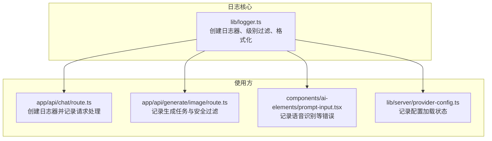
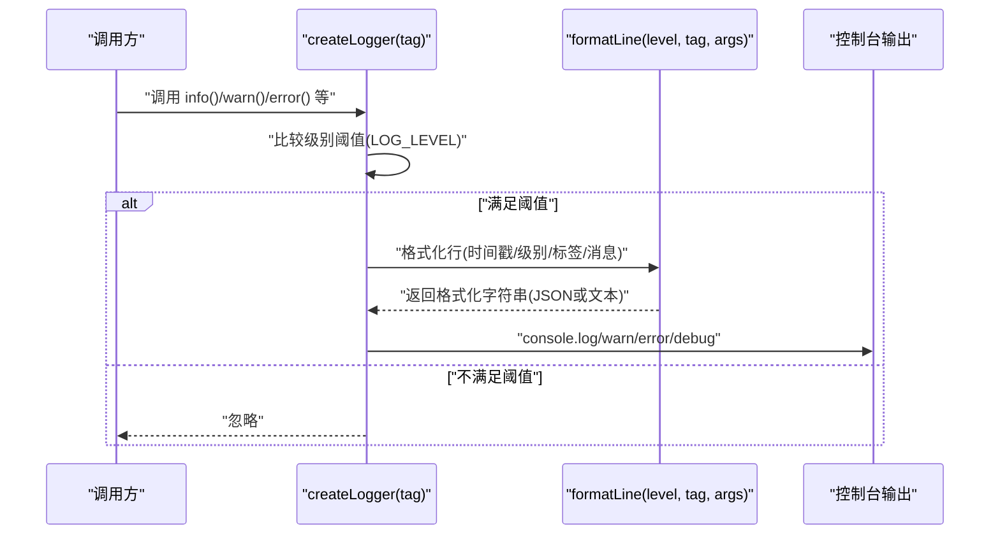
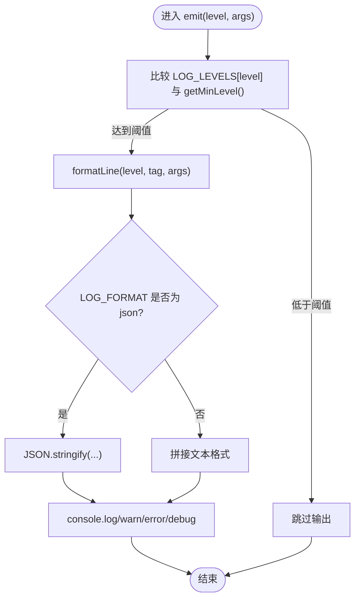
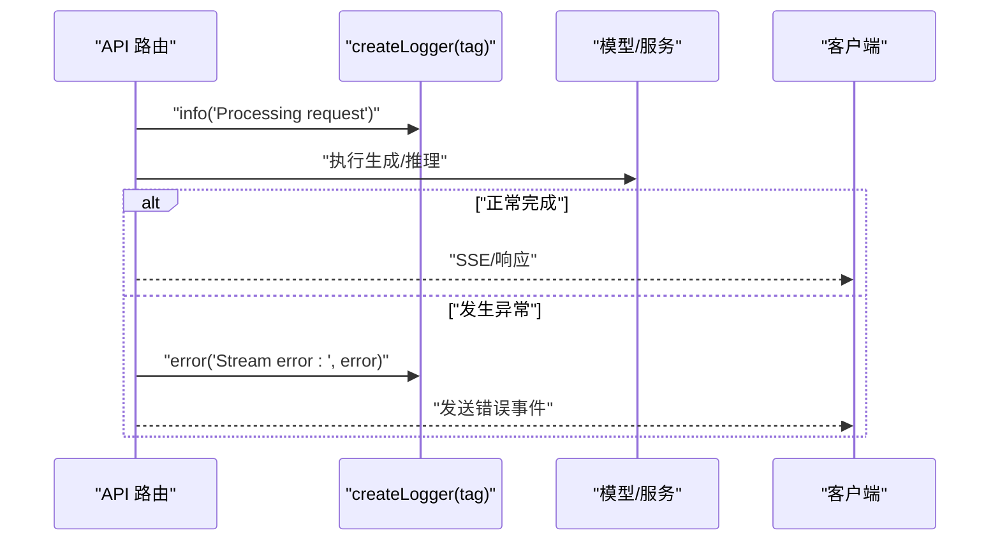
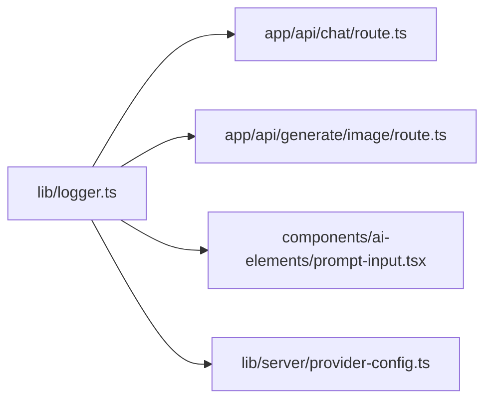

# 日志系统

<cite>
**本文引用的文件**
- [lib/logger.ts](file://lib/logger.ts)
- [app/api/chat/route.ts](file://app/api/chat/route.ts)
- [app/api/generate/image/route.ts](file://app/api/generate/image/route.ts)
- [components/ai-elements/prompt-input.tsx](file://components/ai-elements/prompt-input.tsx)
- [lib/server/provider-config.ts](file://lib/server/provider-config.ts)
- [Dockerfile](file://Dockerfile)
- [docker-compose.yml](file://docker-compose.yml)
- [vercel.json](file://vercel.json)
- [package.json](file://package.json)
</cite>

## 目录
1. [简介](#简介)
2. [项目结构](#项目结构)
3. [核心组件](#核心组件)
4. [架构总览](#架构总览)
5. [详细组件分析](#详细组件分析)
6. [依赖关系分析](#依赖关系分析)
7. [性能考量](#性能考量)
8. [故障排查指南](#故障排查指南)
9. [结论](#结论)
10. [附录](#附录)

## 简介
本文件为 OpenMAIC 项目的日志系统技术文档，聚焦于日志记录器的实现与使用。内容涵盖：
- 日志级别定义与使用场景
- 日志格式化选项（时间戳、消息结构、元数据）
- 输出目标现状与扩展建议
- 过滤与级别控制机制（环境变量与运行时）
- 最佳实践（错误追踪、性能监控、调试信息收集）
- 具体代码示例与配置选项路径

## 项目结构
日志系统的核心位于 lib/logger.ts，通过 createLogger(tag) 创建带标签的日志器实例；在多个 API 路由与前端组件中被广泛使用。

图表来源
- [lib/logger.ts:1-53](file://lib/logger.ts#L1-L53)
- [app/api/chat/route.ts:20-25](file://app/api/chat/route.ts#L20-L25)
- [app/api/generate/image/route.ts:20-26](file://app/api/generate/image/route.ts#L20-L26)
- [components/ai-elements/prompt-input.tsx:30-40](file://components/ai-elements/prompt-input.tsx#L30-L40)
- [lib/server/provider-config.ts:10-15](file://lib/server/provider-config.ts#L10-L15)

章节来源
- [lib/logger.ts:1-53](file://lib/logger.ts#L1-L53)
- [app/api/chat/route.ts:20-25](file://app/api/chat/route.ts#L20-L25)
- [app/api/generate/image/route.ts:20-26](file://app/api/generate/image/route.ts#L20-L26)
- [components/ai-elements/prompt-input.tsx:30-40](file://components/ai-elements/prompt-input.tsx#L30-L40)
- [lib/server/provider-config.ts:10-15](file://lib/server/provider-config.ts#L10-L15)

## 核心组件
- 日志级别：debug、info、warn、error，按数值递增排序，便于基于阈值进行过滤。
- 级别阈值：通过环境变量 LOG_LEVEL 控制最小输出级别，默认为 info。
- 格式化：支持文本与 JSON 两种格式，JSON 模式下包含时间戳、级别、标签与消息字段。
- 输出目标：当前实现仅输出到控制台（console.debug/log/warn/error），未包含文件或远程服务集成。
- 日志器创建：createLogger(tag) 返回包含 debug/info/warn/error 四个方法的对象。

章节来源
- [lib/logger.ts:1-11](file://lib/logger.ts#L1-L11)
- [lib/logger.ts:28-52](file://lib/logger.ts#L28-L52)

## 架构总览
日志系统采用“轻量内建 + 可扩展”的设计：核心逻辑集中在 lib/logger.ts，业务模块通过导入 createLogger(tag) 获取日志器实例，在关键流程中记录事件、参数与异常。

图表来源
- [lib/logger.ts:4-11](file://lib/logger.ts#L4-L11)
- [lib/logger.ts:13-26](file://lib/logger.ts#L13-L26)
- [lib/logger.ts:28-52](file://lib/logger.ts#L28-L52)

## 详细组件分析

### 日志记录器实现（lib/logger.ts）
- 级别常量与类型：定义 debug/info/warn/error 的数值顺序，用于阈值比较。
- 环境变量读取：
  - LOG_LEVEL：决定最小输出级别，默认 info。
  - LOG_FORMAT：当等于 json 时启用 JSON 格式输出。
- 格式化函数：
  - 时间戳：使用 ISO 字符串。
  - 消息拼接：对 Error 对象优先使用 stack 或 message；对非字符串对象进行 JSON 序列化。
  - 文本格式："[时间戳] [级别] [标签] 消息"。
  - JSON 格式："{timestamp, level, tag, message}"。
- 输出策略：根据级别选择 console.debug/log/warn/error/log，确保不同级别在终端中有差异化显示。

图表来源
- [lib/logger.ts:4-11](file://lib/logger.ts#L4-L11)
- [lib/logger.ts:13-26](file://lib/logger.ts#L13-L26)
- [lib/logger.ts:28-52](file://lib/logger.ts#L28-L52)

章节来源
- [lib/logger.ts:1-53](file://lib/logger.ts#L1-L53)

### 使用示例与场景

#### API 路由中的日志使用
- Chat API：记录请求处理、代理配置解析、流式传输心跳与异常。
- 图像生成 API：记录生成参数、内容安全过滤拦截与错误回传。

图表来源
- [app/api/chat/route.ts:70-80](file://app/api/chat/route.ts#L70-L80)
- [app/api/chat/route.ts:140-172](file://app/api/chat/route.ts#L140-L172)
- [app/api/generate/image/route.ts:60-76](file://app/api/generate/image/route.ts#L60-L76)

章节来源
- [app/api/chat/route.ts:70-80](file://app/api/chat/route.ts#L70-L80)
- [app/api/chat/route.ts:140-172](file://app/api/chat/route.ts#L140-L172)
- [app/api/generate/image/route.ts:60-76](file://app/api/generate/image/route.ts#L60-L76)

#### 前端组件中的日志使用
- PromptInput 组件：记录语音识别错误等用户交互相关问题，便于定位前端异常。

章节来源
- [components/ai-elements/prompt-input.tsx:1080-1090](file://components/ai-elements/prompt-input.tsx#L1080-L1090)

#### 服务器配置加载中的日志使用
- ServerProviderConfig：记录配置文件加载与环境变量覆盖情况，便于运维核验。

章节来源
- [lib/server/provider-config.ts:100-113](file://lib/server/provider-config.ts#L100-L113)
- [lib/server/provider-config.ts:191-206](file://lib/server/provider-config.ts#L191-L206)

## 依赖关系分析
- 内部依赖：各业务模块仅依赖 lib/logger.ts 导出的 createLogger(tag)，耦合度低，便于统一升级与替换。
- 外部依赖：日志系统不直接依赖第三方日志库，避免引入额外复杂性；如需扩展可在此基础上封装适配器。

图表来源
- [lib/logger.ts:28-52](file://lib/logger.ts#L28-L52)
- [app/api/chat/route.ts:20-25](file://app/api/chat/route.ts#L20-L25)
- [app/api/generate/image/route.ts:20-26](file://app/api/generate/image/route.ts#L20-L26)
- [components/ai-elements/prompt-input.tsx:30-40](file://components/ai-elements/prompt-input.tsx#L30-L40)
- [lib/server/provider-config.ts:10-15](file://lib/server/provider-config.ts#L10-L15)

章节来源
- [lib/logger.ts:28-52](file://lib/logger.ts#L28-L52)
- [app/api/chat/route.ts:20-25](file://app/api/chat/route.ts#L20-L25)
- [app/api/generate/image/route.ts:20-26](file://app/api/generate/image/route.ts#L20-L26)
- [components/ai-elements/prompt-input.tsx:30-40](file://components/ai-elements/prompt-input.tsx#L30-L40)
- [lib/server/provider-config.ts:10-15](file://lib/server/provider-config.ts#L10-L15)

## 性能考量
- 级别过滤：通过 LOG_LEVEL 在 emit 阶段快速短路，避免不必要的格式化与输出开销。
- JSON 格式：在高吞吐场景下，JSON 更利于下游日志采集系统解析，但序列化成本略高于文本拼接。
- 控制台输出：当前实现直接写入 stdout/stderr，无需网络 IO，延迟低；若接入远程服务，需评估网络与序列化开销。
- 建议：生产环境默认 info 或 warn，开发环境可设为 debug；对高频事件避免传递大型对象，必要时只记录关键字段。

## 故障排查指南
- 级别不生效
  - 检查 LOG_LEVEL 是否设置为 debug/info/warn/error 中的一个，且大小写不敏感。
  - 确认环境变量是否在运行环境中生效（容器/平台/CI）。
- 格式异常
  - 若期望 JSON 输出，请确认 LOG_FORMAT 设置为 json。
  - 错误对象未显示堆栈：确保传入的是 Error 实例，否则会退化为 message。
- 输出缺失
  - 检查是否在 emit 前后被条件分支提前返回。
  - 确认业务模块已正确导入并调用 createLogger(tag)。
- 平台差异
  - Vercel 函数与 Docker 容器均支持环境变量注入，可在对应配置文件中设置。

章节来源
- [lib/logger.ts:4-11](file://lib/logger.ts#L4-L11)
- [lib/logger.ts:13-26](file://lib/logger.ts#L13-L26)
- [vercel.json:6-14](file://vercel.json#L6-L14)
- [docker-compose.yml:6-12](file://docker-compose.yml#L6-L12)
- [Dockerfile:34-36](file://Dockerfile#L34-L36)

## 结论
OpenMAIC 的日志系统以极简实现提供了统一、可控的日志能力：清晰的级别体系、灵活的阈值与格式控制、一致的输出接口。当前版本专注于控制台输出，适合本地开发与基础生产场景；后续可在此基础上扩展文件落盘与远程日志服务集成，以满足更复杂的运维需求。

## 附录

### 日志级别与使用场景
- debug：开发调试、内部流程细节、参数快照。
- info：常规运行状态、关键流程节点、聚合统计。
- warn：潜在问题、降级策略、安全过滤拦截。
- error：异常与错误、失败回退、告警信号。

章节来源
- [lib/logger.ts:1-2](file://lib/logger.ts#L1-L2)
- [app/api/chat/route.ts:140-172](file://app/api/chat/route.ts#L140-L172)
- [app/api/generate/image/route.ts:60-76](file://app/api/generate/image/route.ts#L60-L76)
- [components/ai-elements/prompt-input.tsx:1080-1090](file://components/ai-elements/prompt-input.tsx#L1080-L1090)

### 日志格式化选项
- 时间戳：ISO 8601 字符串。
- 消息结构：
  - 文本："[时间戳] [级别] [标签] 消息"
  - JSON：包含 timestamp、level、tag、message 字段。
- 元数据：标签 tag 由 createLogger(tag) 注入，便于区分模块来源。

章节来源
- [lib/logger.ts:13-26](file://lib/logger.ts#L13-L26)

### 输出目标配置
- 当前实现：控制台输出（console.debug/log/warn/error/log）。
- 文件输出：可通过在 lib/logger.ts 中增加文件句柄与写入逻辑实现。
- 远程日志服务：可在 emit 流程中增加 HTTP/UDP 发送或接入现有 SDK（如 OpenTelemetry Exporter）。

章节来源
- [lib/logger.ts:28-52](file://lib/logger.ts#L28-L52)

### 过滤与级别控制机制
- 环境变量：
  - LOG_LEVEL：设置最小输出级别（debug/info/warn/error）。
  - LOG_FORMAT：设置为 json 启用 JSON 输出。
- 运行时调整：通过更新环境变量重启进程即可生效；在容器平台可借助配置文件注入。

章节来源
- [lib/logger.ts:4-11](file://lib/logger.ts#L4-L11)
- [docker-compose.yml:6-12](file://docker-compose.yml#L6-L12)
- [Dockerfile:34-36](file://Dockerfile#L34-L36)
- [vercel.json:6-14](file://vercel.json#L6-L14)

### 最佳实践
- 错误追踪：统一使用 error 记录异常，必要时携带上下文对象键值摘要；避免在 info/warn 中吞掉错误。
- 性能监控：对高频事件使用 info 记录聚合指标，避免在 debug 中输出大对象。
- 调试信息收集：开发阶段开启 debug，生产阶段关闭；对敏感数据仅记录摘要。
- 标签规范：每个模块/路由使用唯一 tag，便于筛选与关联。

章节来源
- [lib/logger.ts:28-52](file://lib/logger.ts#L28-L52)
- [app/api/chat/route.ts:70-80](file://app/api/chat/route.ts#L70-L80)
- [app/api/generate/image/route.ts:60-76](file://app/api/generate/image/route.ts#L60-L76)

### 代码示例与配置选项路径
- 创建日志器并记录信息
  - 示例路径：[app/api/chat/route.ts:20-25](file://app/api/chat/route.ts#L20-L25)
  - 示例路径：[app/api/generate/image/route.ts:20-26](file://app/api/generate/image/route.ts#L20-L26)
  - 示例路径：[components/ai-elements/prompt-input.tsx:30-40](file://components/ai-elements/prompt-input.tsx#L30-L40)
- 设置最小级别与格式
  - 示例路径：[lib/logger.ts:4-11](file://lib/logger.ts#L4-L11)
- JSON 输出开关
  - 示例路径：[lib/logger.ts:9-11](file://lib/logger.ts#L9-L11)
- 服务器配置加载日志
  - 示例路径：[lib/server/provider-config.ts:100-113](file://lib/server/provider-config.ts#L100-L113)
  - 示例路径：[lib/server/provider-config.ts:191-206](file://lib/server/provider-config.ts#L191-L206)
- 平台配置（容器/平台）
  - 示例路径：[docker-compose.yml:6-12](file://docker-compose.yml#L6-L12)
  - 示例路径：[Dockerfile:34-36](file://Dockerfile#L34-L36)
  - 示例路径：[vercel.json:6-14](file://vercel.json#L6-L14)