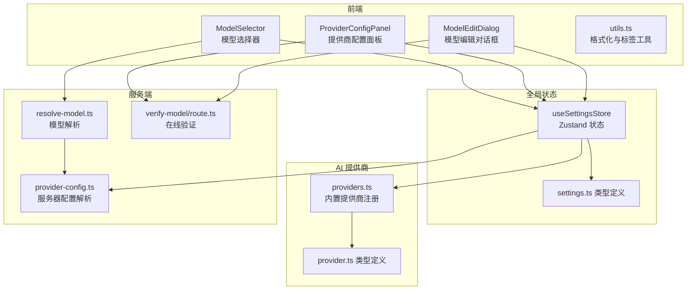
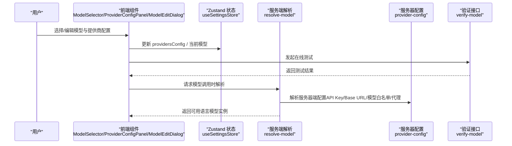
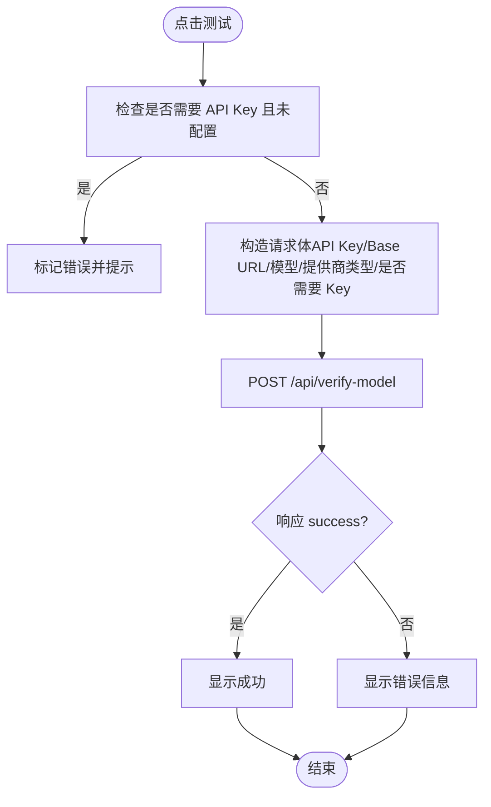
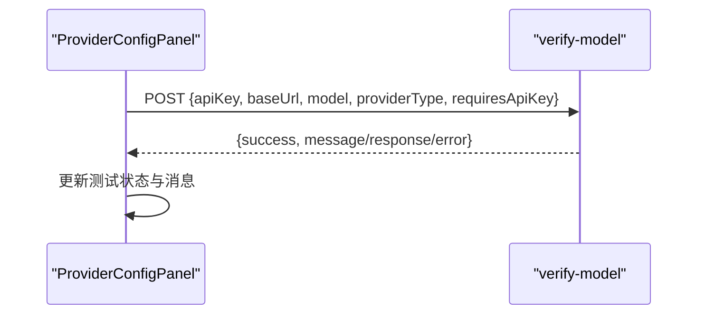
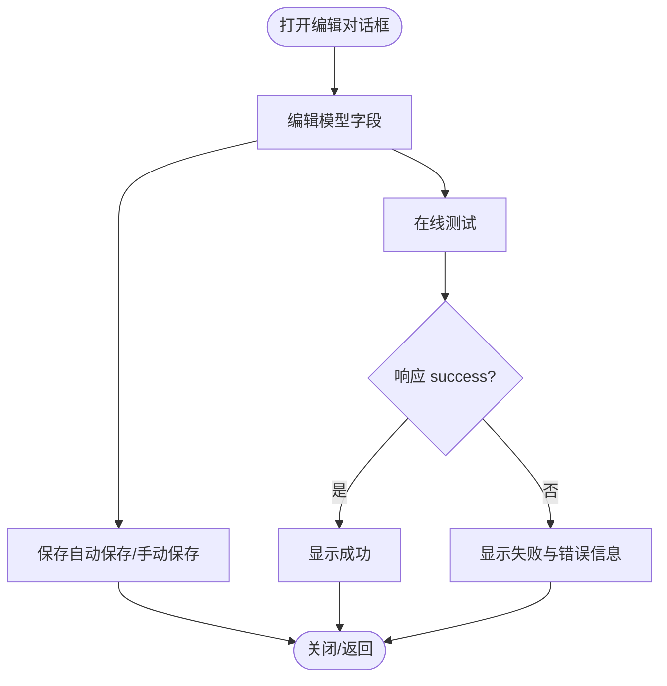
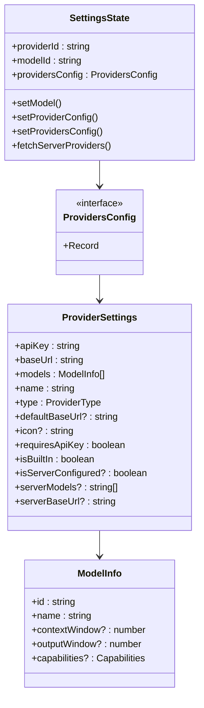
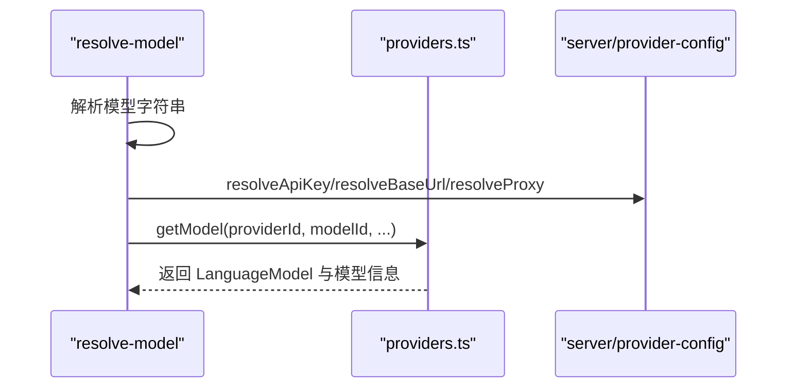
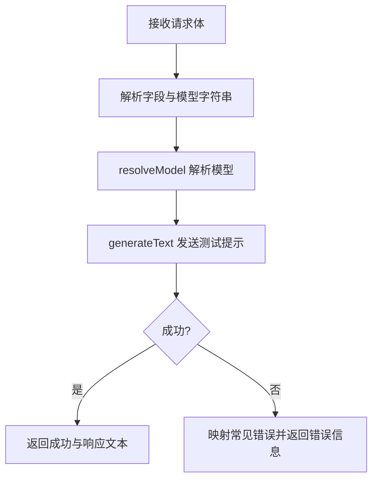
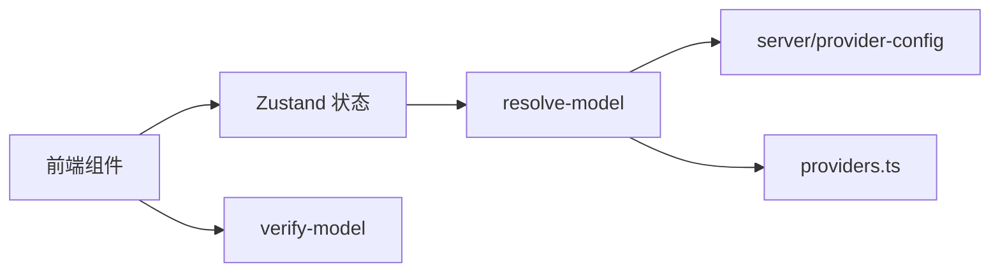

# 模型配置工具

<cite>
**本文档引用的文件**
- [components/settings/model-selector.tsx](file://components/settings/model-selector.tsx)
- [components/settings/model-edit-dialog.tsx](file://components/settings/model-edit-dialog.tsx)
- [components/settings/provider-config-panel.tsx](file://components/settings/provider-config-panel.tsx)
- [components/settings/utils.ts](file://components/settings/utils.ts)
- [lib/types/settings.ts](file://lib/types/settings.ts)
- [lib/types/provider.ts](file://lib/types/provider.ts)
- [lib/store/settings.ts](file://lib/store/settings.ts)
- [lib/ai/providers.ts](file://lib/ai/providers.ts)
- [lib/server/resolve-model.ts](file://lib/server/resolve-model.ts)
- [lib/server/provider-config.ts](file://lib/server/provider-config.ts)
- [app/api/verify-model/route.ts](file://app/api/verify-model/route.ts)
- [lib/utils/model-config.ts](file://lib/utils/model-config.ts)
</cite>

## 目录
1. [简介](#简介)
2. [项目结构](#项目结构)
3. [核心组件](#核心组件)
4. [架构总览](#架构总览)
5. [详细组件分析](#详细组件分析)
6. [依赖关系分析](#依赖关系分析)
7. [性能考量](#性能考量)
8. [故障排查指南](#故障排查指南)
9. [结论](#结论)
10. [附录](#附录)

## 简介
本文件面向“模型配置工具”的技术文档，系统阐述在 OpenMAIC 项目中如何定义、验证与管理 AI 模型配置，覆盖以下方面：
- 模型配置的数据结构与字段含义（模型类型、API 密钥、基础地址、超参数与能力标识）
- 配置文件与存储结构（本地持久化、服务器端配置注入）
- 参数校验、兼容性检查与错误处理流程
- 动态更新与热重载机制
- 安全、性能与版本管理最佳实践
- 典型配置示例与使用场景

## 项目结构
模型配置工具横跨前端组件、全局状态管理、类型定义、服务端解析与验证等模块，形成“前端交互 + 本地持久化 + 服务端解析 + 在线验证”的完整链路。

**图表来源**
- [components/settings/model-selector.tsx:1-414](file://components/settings/model-selector.tsx#L1-L414)
- [components/settings/provider-config-panel.tsx:55-237](file://components/settings/provider-config-panel.tsx#L55-L237)
- [components/settings/model-edit-dialog.tsx:1-351](file://components/settings/model-edit-dialog.tsx#L1-L351)
- [lib/store/settings.ts:1-800](file://lib/store/settings.ts#L1-L800)
- [lib/ai/providers.ts:1-800](file://lib/ai/providers.ts#L1-L800)
- [lib/server/resolve-model.ts:1-61](file://lib/server/resolve-model.ts#L1-L61)
- [lib/server/provider-config.ts:1-398](file://lib/server/provider-config.ts#L1-L398)
- [app/api/verify-model/route.ts:1-69](file://app/api/verify-model/route.ts#L1-L69)

**章节来源**
- [components/settings/model-selector.tsx:1-414](file://components/settings/model-selector.tsx#L1-L414)
- [lib/store/settings.ts:1-800](file://lib/store/settings.ts#L1-L800)
- [lib/ai/providers.ts:1-800](file://lib/ai/providers.ts#L1-L800)

## 核心组件
- 前端交互组件
  - 模型选择器：支持按提供商筛选、搜索过滤、测试连接、显示模型能力与上下文窗口等。
  - 提供商配置面板：集中管理 API Key、Base URL、是否需要 Key 等，并可一键测试。
  - 模型编辑对话框：新增/编辑自定义模型，支持能力勾选、上下文窗口等高级设置，并可在线测试。
- 全局状态与类型
  - Zustand 状态：统一保存当前模型选择、提供商配置、音频/图像/视频等多类配置，并持久化到 localStorage。
  - 类型定义：ProviderSettings、ProvidersConfig、ModelInfo、ProviderConfig、ModelConfig 等。
- 服务端解析与验证
  - resolve-model：从请求体或请求头解析模型字符串，合并客户端与服务器端配置，生成可用的语言模型实例。
  - provider-config：从 YAML/环境变量加载服务器端配置，暴露仅元数据不泄露密钥。
  - verify-model：对给定模型进行连通性测试，返回成功/失败及错误提示。

**章节来源**
- [components/settings/model-selector.tsx:1-414](file://components/settings/model-selector.tsx#L1-L414)
- [components/settings/provider-config-panel.tsx:55-237](file://components/settings/provider-config-panel.tsx#L55-L237)
- [components/settings/model-edit-dialog.tsx:1-351](file://components/settings/model-edit-dialog.tsx#L1-L351)
- [lib/store/settings.ts:1-800](file://lib/store/settings.ts#L1-L800)
- [lib/types/settings.ts:1-50](file://lib/types/settings.ts#L1-L50)
- [lib/types/provider.ts:1-104](file://lib/types/provider.ts#L1-L104)
- [lib/server/resolve-model.ts:1-61](file://lib/server/resolve-model.ts#L1-L61)
- [lib/server/provider-config.ts:1-398](file://lib/server/provider-config.ts#L1-L398)
- [app/api/verify-model/route.ts:1-69](file://app/api/verify-model/route.ts#L1-L69)

## 架构总览
模型配置工具采用“前端 UI + 本地持久化 + 服务端解析 + 在线验证”的分层设计：
- 前端负责用户交互与即时反馈（测试连接、能力展示）。
- 全局状态负责配置的持久化与跨组件共享。
- 服务端负责合并服务器端配置（如 Base URL、模型白名单、代理），并对模型进行最终解析与调用。
- 在线验证接口用于快速确认配置的有效性与连通性。

**图表来源**
- [components/settings/model-selector.tsx:135-184](file://components/settings/model-selector.tsx#L135-L184)
- [components/settings/provider-config-panel.tsx:110-137](file://components/settings/provider-config-panel.tsx#L110-L137)
- [components/settings/model-edit-dialog.tsx:61-97](file://components/settings/model-edit-dialog.tsx#L61-L97)
- [lib/server/resolve-model.ts:17-45](file://lib/server/resolve-model.ts#L17-L45)
- [lib/server/provider-config.ts:235-250](file://lib/server/provider-config.ts#L235-L250)
- [app/api/verify-model/route.ts:8-68](file://app/api/verify-model/route.ts#L8-L68)

## 详细组件分析

### 组件一：模型选择器（ModelSelector）
职责与行为
- 展示已配置且可用的提供商列表（需满足：有 Key 或服务器已配置；至少一个模型；有 Base URL 或默认 Base URL）。
- 支持按提供商切换、搜索过滤、测试单个模型连通性。
- 显示模型能力（流式、工具、视觉）、上下文窗口与输出窗口等元信息。
- 通过 /api/verify-model 进行在线测试，反馈成功/失败与错误信息。

关键流程（测试模型）

**图表来源**
- [components/settings/model-selector.tsx:135-184](file://components/settings/model-selector.tsx#L135-L184)
- [app/api/verify-model/route.ts:8-68](file://app/api/verify-model/route.ts#L8-L68)

**章节来源**
- [components/settings/model-selector.tsx:1-414](file://components/settings/model-selector.tsx#L1-L414)
- [components/settings/utils.ts:1-29](file://components/settings/utils.ts#L1-L29)

### 组件二：提供商配置面板（ProviderConfigPanel）
职责与行为
- 管理单个提供商的 API Key、Base URL、是否需要 Key 等。
- 支持一键测试该提供商下首个可用模型的连通性。
- 支持重置为默认配置、保存变更等。

关键流程（测试提供商）

**图表来源**
- [components/settings/provider-config-panel.tsx:110-137](file://components/settings/provider-config-panel.tsx#L110-L137)
- [app/api/verify-model/route.ts:8-68](file://app/api/verify-model/route.ts#L8-L68)

**章节来源**
- [components/settings/provider-config-panel.tsx:55-237](file://components/settings/provider-config-panel.tsx#L55-L237)

### 组件三：模型编辑对话框（ModelEditDialog）
职责与行为
- 新增/编辑自定义模型，支持：
  - 模型 ID/名称
  - 能力勾选（视觉、工具、流式）
  - 上下文窗口与输出窗口（数值输入）
- 在线测试所选模型，反馈测试结果。

关键流程（编辑与测试）

**图表来源**
- [components/settings/model-edit-dialog.tsx:61-97](file://components/settings/model-edit-dialog.tsx#L61-L97)
- [app/api/verify-model/route.ts:8-68](file://app/api/verify-model/route.ts#L8-L68)

**章节来源**
- [components/settings/model-edit-dialog.tsx:1-351](file://components/settings/model-edit-dialog.tsx#L1-L351)

### 组件四：全局状态与类型（useSettingsStore / 类型定义）
职责与行为
- 统一管理：
  - 当前模型选择（providerId + modelId）
  - 所有提供商配置（ProvidersConfig）
  - 多媒体/语音/搜索等其他配置
- 默认值与迁移逻辑：
  - 初始化内置提供商配置
  - 从旧版 localStorage 迁移
  - 保证内置提供商新增模型时自动纳入
- 服务器配置合并：
  - fetchServerProviders 将服务器端提供的 Base URL、模型白名单、是否服务器配置等合并入本地状态

**图表来源**
- [lib/store/settings.ts:26-233](file://lib/store/settings.ts#L26-L233)
- [lib/types/settings.ts:14-43](file://lib/types/settings.ts#L14-L43)
- [lib/types/provider.ts:63-104](file://lib/types/provider.ts#L63-L104)

**章节来源**
- [lib/store/settings.ts:1-800](file://lib/store/settings.ts#L1-L800)
- [lib/types/settings.ts:1-50](file://lib/types/settings.ts#L1-L50)
- [lib/types/provider.ts:1-104](file://lib/types/provider.ts#L1-L104)

### 组件五：AI 提供商注册与模型解析（providers.ts / resolve-model.ts）
职责与行为
- providers.ts：内置多家提供商及其模型清单、默认 Base URL、是否需要 Key、图标等。
- resolve-model.ts：将模型字符串解析为 providerId 与 modelId，结合服务器端配置（API Key/Base URL/代理）生成可用模型实例。

**图表来源**
- [lib/ai/providers.ts:925-963](file://lib/ai/providers.ts#L925-L963)
- [lib/server/resolve-model.ts:17-45](file://lib/server/resolve-model.ts#L17-L45)
- [lib/server/provider-config.ts:235-250](file://lib/server/provider-config.ts#L235-L250)

**章节来源**
- [lib/ai/providers.ts:1-800](file://lib/ai/providers.ts#L1-L800)
- [lib/server/resolve-model.ts:1-61](file://lib/server/resolve-model.ts#L1-L61)
- [lib/server/provider-config.ts:1-398](file://lib/server/provider-config.ts#L1-L398)

### 组件六：在线验证（verify-model/route.ts）
职责与行为
- 接收前端传入的 API Key、Base URL、模型、提供商类型与是否需要 Key。
- 使用 resolve-model 解析出可用模型后，发送最小测试提示词进行连通性验证。
- 对常见错误（401/404/429/网络异常/超时）进行分类与友好提示。

**图表来源**
- [app/api/verify-model/route.ts:8-68](file://app/api/verify-model/route.ts#L8-L68)

**章节来源**
- [app/api/verify-model/route.ts:1-69](file://app/api/verify-model/route.ts#L1-L69)

## 依赖关系分析
- 组件依赖
  - ModelSelector/ProviderConfigPanel/ModelEditDialog 依赖 useSettingsStore 获取与更新配置。
  - 三个组件均依赖 /api/verify-model 进行在线验证。
- 状态与类型
  - SettingsState 与 ProviderSettings/ModelInfo 等类型强耦合，确保配置结构一致。
- 服务端解析
  - resolve-model 依赖 provider-config 的解析函数，以优先使用服务器端配置。
- 数据流向
  - 前端 UI -> Zustand 状态 -> 服务端解析 -> 在线验证 -> 返回结果。

**图表来源**
- [lib/store/settings.ts:1-800](file://lib/store/settings.ts#L1-L800)
- [lib/server/resolve-model.ts:1-61](file://lib/server/resolve-model.ts#L1-L61)
- [lib/server/provider-config.ts:1-398](file://lib/server/provider-config.ts#L1-L398)
- [lib/ai/providers.ts:1-800](file://lib/ai/providers.ts#L1-L800)

**章节来源**
- [lib/store/settings.ts:1-800](file://lib/store/settings.ts#L1-L800)
- [lib/server/resolve-model.ts:1-61](file://lib/server/resolve-model.ts#L1-L61)
- [lib/server/provider-config.ts:1-398](file://lib/server/provider-config.ts#L1-L398)
- [lib/ai/providers.ts:1-800](file://lib/ai/providers.ts#L1-L800)

## 性能考量
- 本地持久化与缓存
  - 使用 Zustand + persist 将配置持久化至 localStorage，减少重复初始化成本。
  - 服务器配置合并采用一次性拉取与缓存策略，避免频繁网络请求。
- 渲染优化
  - ModelSelector 支持按提供商切换与搜索过滤，减少不必要的渲染。
  - 测试状态与消息在组件内部局部管理，避免全局抖动。
- 服务端解析
  - resolve-model 将解析与合并逻辑集中在一处，减少重复计算与网络调用。
- 错误处理
  - 在线验证对常见错误进行分类与友好提示，降低用户重试成本。

[本节为通用指导，无需特定文件来源]

## 故障排查指南
- API Key 相关
  - 现象：测试失败提示“API Key 无效或过期”。
  - 排查：确认提供商配置面板中的 API Key 是否正确；若服务器端已配置，确认是否使用了服务器端 Key。
- Base URL 相关
  - 现象：提示无法连接到 API 服务器或 Base URL 不可用。
  - 排查：核对 Base URL 是否正确；若服务器端提供了 Base URL，确认是否被正确合并。
- 模型不可用
  - 现象：提示模型不存在或 API 端点错误。
  - 排查：确认模型 ID 是否正确；若服务器端限制了模型白名单，确认该模型是否在允许列表内。
- 网络与限流
  - 现象：提示速率限制或连接超时。
  - 排查：检查网络状况；等待一段时间后重试；必要时调整请求频率。
- 服务器配置冲突
  - 现象：本地配置与服务器配置不一致导致行为异常。
  - 排查：调用 fetchServerProviders 后确认 isServerConfigured、serverModels、serverBaseUrl 等字段是否符合预期。

**章节来源**
- [app/api/verify-model/route.ts:48-68](file://app/api/verify-model/route.ts#L48-L68)
- [lib/server/provider-config.ts:235-250](file://lib/server/provider-config.ts#L235-L250)

## 结论
本模型配置工具通过“前端交互 + 本地持久化 + 服务端解析 + 在线验证”的架构，实现了对多提供商、多模型的统一配置与管理。其优势在于：
- 配置结构清晰、类型约束明确；
- 支持服务器端配置注入与模型白名单控制；
- 提供即时在线验证，提升配置成功率；
- 通过 Zustand 实现状态持久化与跨组件共享。

建议在生产环境中配合安全策略（如服务器端 Key 注入、白名单限制）与性能监控（如解析耗时、验证成功率）持续优化。

[本节为总结，无需特定文件来源]

## 附录

### 配置文件结构与字段说明
- ProviderSettings（提供商设置）
  - apiKey：API Key（可为空，取决于 requiresApiKey 与服务器配置）
  - baseUrl：用户自定义 Base URL（可为空）
  - models：模型数组（包含 id/name/capabilities/contextWindow/outputWindow 等）
  - name/type/defaultBaseUrl/icon：提供商元信息
  - requiresApiKey：是否必须提供 Key
  - isBuiltIn：是否内置提供商
  - isServerConfigured/serverModels/serverBaseUrl：服务器端配置注入后的状态
- ProvidersConfig：以 providerId 为键的映射表
- ModelInfo：模型信息（id/name/capabilities/contextWindow/outputWindow）
- ModelConfig：调用时使用的模型配置（providerId/modelId/apiKey/baseUrl/proxy/providerType/requiresApiKey）

**章节来源**
- [lib/types/settings.ts:14-43](file://lib/types/settings.ts#L14-L43)
- [lib/types/provider.ts:63-104](file://lib/types/provider.ts#L63-L104)

### 配置验证机制与兼容性检查
- 前端测试
  - ModelSelector/ProviderConfigPanel/ModelEditDialog 通过 /api/verify-model 进行连通性测试。
- 服务端解析
  - resolve-model 合并客户端与服务器端配置，生成可用模型实例。
- 兼容性检查
  - 若服务器端配置存在，优先使用服务器端 Base URL 与模型白名单。
  - 若提供商要求 Key 但未提供，抛出相应错误。

**章节来源**
- [components/settings/model-selector.tsx:135-184](file://components/settings/model-selector.tsx#L135-L184)
- [components/settings/provider-config-panel.tsx:110-137](file://components/settings/provider-config-panel.tsx#L110-L137)
- [components/settings/model-edit-dialog.tsx:61-97](file://components/settings/model-edit-dialog.tsx#L61-L97)
- [lib/server/resolve-model.ts:17-45](file://lib/server/resolve-model.ts#L17-L45)
- [lib/server/provider-config.ts:235-250](file://lib/server/provider-config.ts#L235-L250)

### 动态更新与热重载
- 热重载
  - fetchServerProviders 会拉取服务器端配置并合并到本地状态，无需重启应用即可生效。
- 自动迁移
  - 旧版 localStorage 数据会自动迁移到新结构，内置提供商新增模型也会自动纳入。

**章节来源**
- [lib/store/settings.ts:620-800](file://lib/store/settings.ts#L620-L800)

### 最佳实践
- 安全
  - 优先使用服务器端配置注入 API Key，避免在客户端暴露敏感信息。
  - 对 Base URL 与模型白名单进行严格控制，防止越权访问。
- 性能
  - 合理使用在线验证，避免频繁触发；在编辑模式下可采用失焦自动保存。
  - 通过 Zustand 的持久化中间件减少初始化开销。
- 版本管理
  - 内置提供商模型更新时，ensureBuiltIn 会自动合并新模型，无需手动干预。
  - 服务器端配置变更后，及时调用 fetchServerProviders 以同步最新配置。

**章节来源**
- [lib/store/settings.ts:316-351](file://lib/store/settings.ts#L316-L351)
- [lib/store/settings.ts:620-800](file://lib/store/settings.ts#L620-L800)

### 使用场景示例
- 场景一：首次配置
  - 在提供商配置面板中填写 API Key 与 Base URL，点击“测试连接”，确认成功后再选择目标模型。
- 场景二：企业级部署
  - 通过服务器端配置文件与环境变量注入 API Key 与 Base URL，客户端仅读取服务器端配置，实现统一管控。
- 场景三：多模型对比
  - 在模型编辑对话框中为不同模型设置不同的上下文窗口与能力，结合在线测试快速评估效果。

**章节来源**
- [components/settings/provider-config-panel.tsx:110-137](file://components/settings/provider-config-panel.tsx#L110-L137)
- [components/settings/model-edit-dialog.tsx:61-97](file://components/settings/model-edit-dialog.tsx#L61-L97)
- [lib/server/provider-config.ts:235-250](file://lib/server/provider-config.ts#L235-L250)