# Canvas 编辑器

<cite>
**本文档引用的文件**
- [Canvas/index.tsx](file://components/slide-renderer/Editor/Canvas/index.tsx)
- [ViewportBackground.tsx](file://components/slide-renderer/Editor/Canvas/ViewportBackground.tsx)
- [GridLines.tsx](file://components/slide-renderer/Editor/Canvas/GridLines.tsx)
- [Ruler.tsx](file://components/slide-renderer/Editor/Canvas/Ruler.tsx)
- [MouseSelection.tsx](file://components/slide-renderer/Editor/Canvas/MouseSelection.tsx)
- [AlignmentLine.tsx](file://components/slide-renderer/Editor/Canvas/AlignmentLine.tsx)
- [ElementCreateSelection.tsx](file://components/slide-renderer/Editor/Canvas/ElementCreateSelection.tsx)
- [ShapeCreateCanvas.tsx](file://components/slide-renderer/Editor/Canvas/ShapeCreateCanvas.tsx)
- [EditableElement.tsx](file://components/slide-renderer/Editor/Canvas/EditableElement.tsx)
- [Operate/index.tsx](file://components/slide-renderer/Editor/Canvas/Operate/index.tsx)
- [useSelectElement.ts](file://components/slide-renderer/Editor/Canvas/hooks/useSelectElement.ts)
- [useDragElement.ts](file://components/slide-renderer/Editor/Canvas/hooks/useDragElement.ts)
- [useMouseSelection.ts](file://components/slide-renderer/Editor/Canvas/hooks/useMouseSelection.ts)
- [useViewportSize.ts](file://components/slide-renderer/Editor/Canvas/hooks/useViewportSize.ts)
- [use-canvas-operations.ts](file://lib/hooks/use-canvas-operations.ts)
- [canvas.ts](file://lib/store/canvas.ts)
- [edit.ts](file://lib/types/edit.ts)
</cite>

## 目录
1. [简介](#简介)
2. [项目结构](#项目结构)
3. [核心组件](#核心组件)
4. [架构总览](#架构总览)
5. [详细组件分析](#详细组件分析)
6. [依赖关系分析](#依赖关系分析)
7. [性能考虑](#性能考虑)
8. [故障排查指南](#故障排查指南)
9. [结论](#结论)

## 简介
本文件为基于 HTML Canvas 的演示文稿编辑器的技术文档，聚焦于 Canvas 区域的架构与实现细节，包括画布初始化、坐标系统与视口管理；元素选择与拖拽（含鼠标事件处理、命中测试与对齐吸附）；网格线与标尺系统；元素创建选择器（矩形选择与预览）；对齐辅助线；以及性能优化策略（脏区域重绘与虚拟滚动思路）。文档以渐进方式呈现，既适合初学者快速上手，也便于资深工程师深入理解实现。

## 项目结构
Canvas 编辑器位于演示文稿渲染器的“编辑模式”子模块中，采用分层组织：顶层 Canvas 负责协调状态与交互；子组件负责具体 UI 展示；Hooks 提供可复用的交互逻辑；Store 统一管理 UI 状态；工具方法提供几何计算与操作封装。

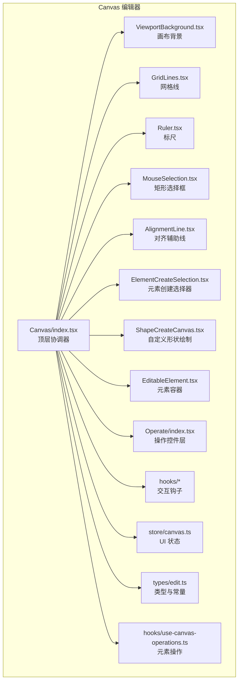

**图表来源**
- [Canvas/index.tsx:1-416](file://components/slide-renderer/Editor/Canvas/index.tsx#L1-L416)
- [GridLines.tsx:1-50](file://components/slide-renderer/Editor/Canvas/GridLines.tsx#L1-L50)
- [Ruler.tsx:1-123](file://components/slide-renderer/Editor/Canvas/Ruler.tsx#L1-L123)
- [MouseSelection.tsx:1-38](file://components/slide-renderer/Editor/Canvas/MouseSelection.tsx#L1-L38)
- [AlignmentLine.tsx:1-39](file://components/slide-renderer/Editor/Canvas/AlignmentLine.tsx#L1-L39)
- [ElementCreateSelection.tsx:1-201](file://components/slide-renderer/Editor/Canvas/ElementCreateSelection.tsx#L1-L201)
- [ShapeCreateCanvas.tsx:1-191](file://components/slide-renderer/Editor/Canvas/ShapeCreateCanvas.tsx#L1-L191)
- [EditableElement.tsx:1-309](file://components/slide-renderer/Editor/Canvas/EditableElement.tsx#L1-L309)
- [Operate/index.tsx:1-174](file://components/slide-renderer/Editor/Canvas/Operate/index.tsx#L1-L174)
- [useViewportSize.ts:1-166](file://components/slide-renderer/Editor/Canvas/hooks/useViewportSize.ts#L1-L166)
- [useSelectElement.ts:1-132](file://components/slide-renderer/Editor/Canvas/hooks/useSelectElement.ts#L1-L132)
- [useDragElement.ts:1-405](file://components/slide-renderer/Editor/Canvas/hooks/useDragElement.ts#L1-L405)
- [useMouseSelection.ts:1-201](file://components/slide-renderer/Editor/Canvas/hooks/useMouseSelection.ts#L1-L201)
- [canvas.ts:1-473](file://lib/store/canvas.ts#L1-L473)
- [edit.ts:1-136](file://lib/types/edit.ts#L1-L136)
- [use-canvas-operations.ts:1-590](file://lib/hooks/use-canvas-operations.ts#L1-L590)

**章节来源**
- [Canvas/index.tsx:1-416](file://components/slide-renderer/Editor/Canvas/index.tsx#L1-L416)

## 核心组件
- 顶层协调器：Canvas 负责聚合所有子组件、订阅状态、绑定事件、协调元素列表与操作链路。
- 视口与背景：ViewportBackground 渲染当前场景背景；useViewportSize 计算缩放与定位。
- 网格与标尺：GridLines 基于背景色动态选择线条颜色；Ruler 显示像素刻度与选区范围。
- 选择与拖拽：MouseSelection 实时矩形选择；useMouseSelection 命中测试；useDragElement 支持吸附对齐与多选同步。
- 元素容器与操作：EditableElement 动态分发具体元素组件；Operate 展示旋转/缩放/连线等控件。
- 创建器：ElementCreateSelection 支持矩形创建与比例约束；ShapeCreateCanvas 支持自由路径绘制。
- 对齐辅助线：AlignmentLine 在拖拽过程中实时显示吸附线。
- 状态与操作：canvas.ts 管理 UI 状态；use-canvas-operations 提供元素 CRUD 与编排。

**章节来源**
- [Canvas/index.tsx:62-413](file://components/slide-renderer/Editor/Canvas/index.tsx#L62-L413)
- [ViewportBackground.tsx:12-30](file://components/slide-renderer/Editor/Canvas/ViewportBackground.tsx#L12-L30)
- [GridLines.tsx:6-49](file://components/slide-renderer/Editor/Canvas/GridLines.tsx#L6-L49)
- [Ruler.tsx:12-122](file://components/slide-renderer/Editor/Canvas/Ruler.tsx#L12-L122)
- [MouseSelection.tsx:16-37](file://components/slide-renderer/Editor/Canvas/MouseSelection.tsx#L16-L37)
- [AlignmentLine.tsx:13-38](file://components/slide-renderer/Editor/Canvas/AlignmentLine.tsx#L13-L38)
- [ElementCreateSelection.tsx:10-200](file://components/slide-renderer/Editor/Canvas/ElementCreateSelection.tsx#L10-L200)
- [ShapeCreateCanvas.tsx:13-190](file://components/slide-renderer/Editor/Canvas/ShapeCreateCanvas.tsx#L13-L190)
- [EditableElement.tsx:47-308](file://components/slide-renderer/Editor/Canvas/EditableElement.tsx#L47-L308)
- [Operate/index.tsx:54-173](file://components/slide-renderer/Editor/Canvas/Operate/index.tsx#L54-L173)
- [useSelectElement.ts:11-131](file://components/slide-renderer/Editor/Canvas/hooks/useSelectElement.ts#L11-L131)
- [useDragElement.ts:16-399](file://components/slide-renderer/Editor/Canvas/hooks/useDragElement.ts#L16-L399)
- [useMouseSelection.ts:7-199](file://components/slide-renderer/Editor/Canvas/hooks/useMouseSelection.ts#L7-L199)
- [useViewportSize.ts:15-164](file://components/slide-renderer/Editor/Canvas/hooks/useViewportSize.ts#L15-L164)
- [canvas.ts:49-473](file://lib/store/canvas.ts#L49-L473)
- [edit.ts:48-136](file://lib/types/edit.ts#L48-L136)
- [use-canvas-operations.ts:49-586](file://lib/hooks/use-canvas-operations.ts#L49-L586)

## 架构总览
Canvas 编辑器采用“状态驱动 + 钩子解耦”的架构：
- 状态层：Zustand Store（canvas.ts）集中管理 UI 状态（缩放、网格、标尺、选中、创建中等）。
- 协调层：Canvas（index.tsx）订阅状态、绑定事件、协调元素列表与操作。
- 交互层：多个 Hooks 封装拖拽、选择、创建、视口拖拽等复杂交互。
- 展示层：各子组件按职责渲染网格、标尺、元素、操作控件与辅助线。

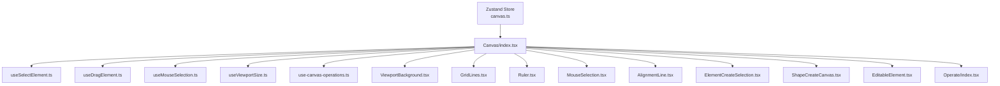

**图表来源**
- [canvas.ts:251-473](file://lib/store/canvas.ts#L251-L473)
- [Canvas/index.tsx:62-413](file://components/slide-renderer/Editor/Canvas/index.tsx#L62-L413)
- [useSelectElement.ts:11-131](file://components/slide-renderer/Editor/Canvas/hooks/useSelectElement.ts#L11-L131)
- [useDragElement.ts:16-399](file://components/slide-renderer/Editor/Canvas/hooks/useDragElement.ts#L16-L399)
- [useMouseSelection.ts:7-199](file://components/slide-renderer/Editor/Canvas/hooks/useMouseSelection.ts#L7-L199)
- [useViewportSize.ts:15-164](file://components/slide-renderer/Editor/Canvas/hooks/useViewportSize.ts#L15-L164)
- [use-canvas-operations.ts:49-586](file://lib/hooks/use-canvas-operations.ts#L49-L586)
- [ViewportBackground.tsx:12-30](file://components/slide-renderer/Editor/Canvas/ViewportBackground.tsx#L12-L30)
- [GridLines.tsx:6-49](file://components/slide-renderer/Editor/Canvas/GridLines.tsx#L6-L49)
- [Ruler.tsx:12-122](file://components/slide-renderer/Editor/Canvas/Ruler.tsx#L12-L122)
- [MouseSelection.tsx:16-37](file://components/slide-renderer/Editor/Canvas/MouseSelection.tsx#L16-L37)
- [AlignmentLine.tsx:13-38](file://components/slide-renderer/Editor/Canvas/AlignmentLine.tsx#L13-L38)
- [ElementCreateSelection.tsx:10-200](file://components/slide-renderer/Editor/Canvas/ElementCreateSelection.tsx#L10-L200)
- [ShapeCreateCanvas.tsx:13-190](file://components/slide-renderer/Editor/Canvas/ShapeCreateCanvas.tsx#L13-L190)
- [EditableElement.tsx:47-308](file://components/slide-renderer/Editor/Canvas/EditableElement.tsx#L47-L308)
- [Operate/index.tsx:54-173](file://components/slide-renderer/Editor/Canvas/Operate/index.tsx#L54-L173)

## 详细组件分析

### 画布初始化与视口管理
- 初始化：Canvas 通过 useViewportSize 计算 viewport 尺寸、缩放比例与居中位置，并在容器尺寸变化或比例变化时自动重算。
- 视口拖拽：当空格键按下时，Canvas 提供拖拽遮罩，拖动时通过 dragViewport 更新 viewport 偏移。
- 背景渲染：ViewportBackground 仅订阅背景样式，避免无关重渲染。

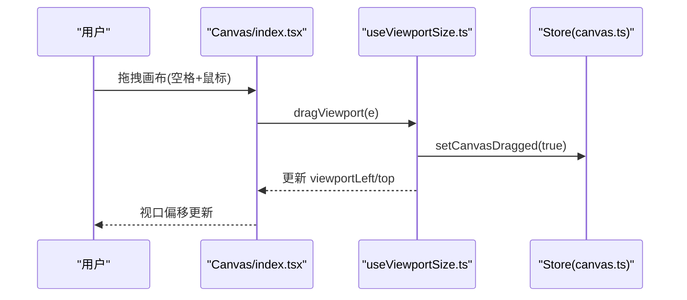

**图表来源**
- [Canvas/index.tsx:138-159](file://components/slide-renderer/Editor/Canvas/index.tsx#L138-L159)
- [useViewportSize.ts:115-148](file://components/slide-renderer/Editor/Canvas/hooks/useViewportSize.ts#L115-L148)
- [canvas.ts:287-298](file://lib/store/canvas.ts#L287-L298)

**章节来源**
- [Canvas/index.tsx:104-107](file://components/slide-renderer/Editor/Canvas/index.tsx#L104-L107)
- [useViewportSize.ts:27-92](file://components/slide-renderer/Editor/Canvas/hooks/useViewportSize.ts#L27-L92)
- [ViewportBackground.tsx:12-30](file://components/slide-renderer/Editor/Canvas/ViewportBackground.tsx#L12-L30)

### 坐标系统与视口定位
- 视口尺寸：由 viewportSize 与 viewportRatio 决定，Canvas 百分比决定实际显示尺寸。
- 缩放：canvasScale 用于将逻辑坐标映射到屏幕像素。
- 定位：viewportLeft/Top 控制视口在容器中的偏移，保证画布在容器内居中。

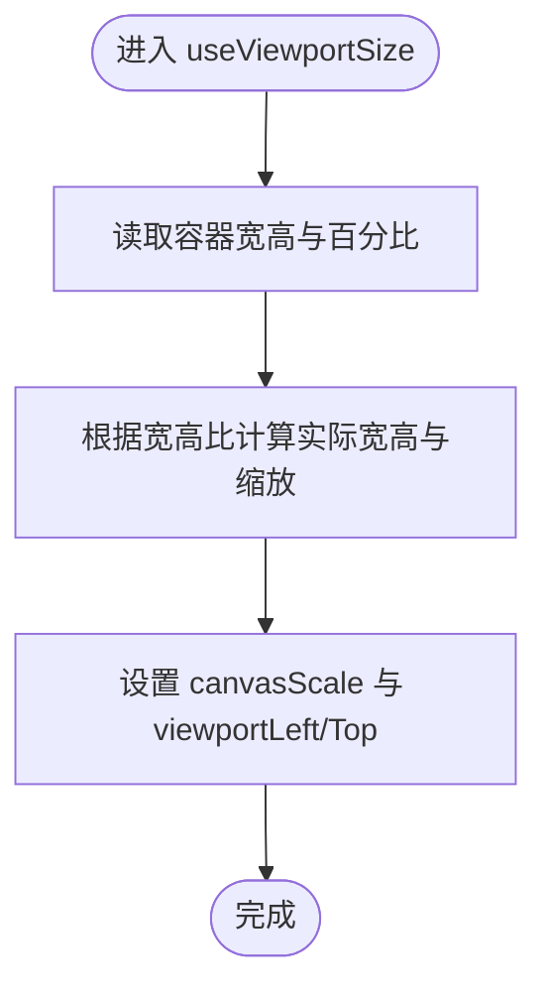

**图表来源**
- [useViewportSize.ts:27-76](file://components/slide-renderer/Editor/Canvas/hooks/useViewportSize.ts#L27-L76)
- [canvas.ts:185-247](file://lib/store/canvas.ts#L185-L247)

**章节来源**
- [useViewportSize.ts:15-164](file://components/slide-renderer/Editor/Canvas/hooks/useViewportSize.ts#L15-L164)

### 元素选择与拖拽（含命中测试与吸附）
- 单选/多选：useSelectElement 支持 Ctrl/Shift 多选与组内联动选择；点击已选元素可切换 handleElement 或激活组内成员。
- 拖拽：useDragElement 计算目标元素边界（含旋转矩形），收集其他元素与画布边缘的对齐参考线，进行吸附校正；支持 Shift 锁定方向与 Misoperation 过滤。
- 命中测试：useMouseSelection 使用四象限方向与包含关系判断，支持 Ctrl/Shift 的追加/排除行为，并过滤锁定与隐藏元素。

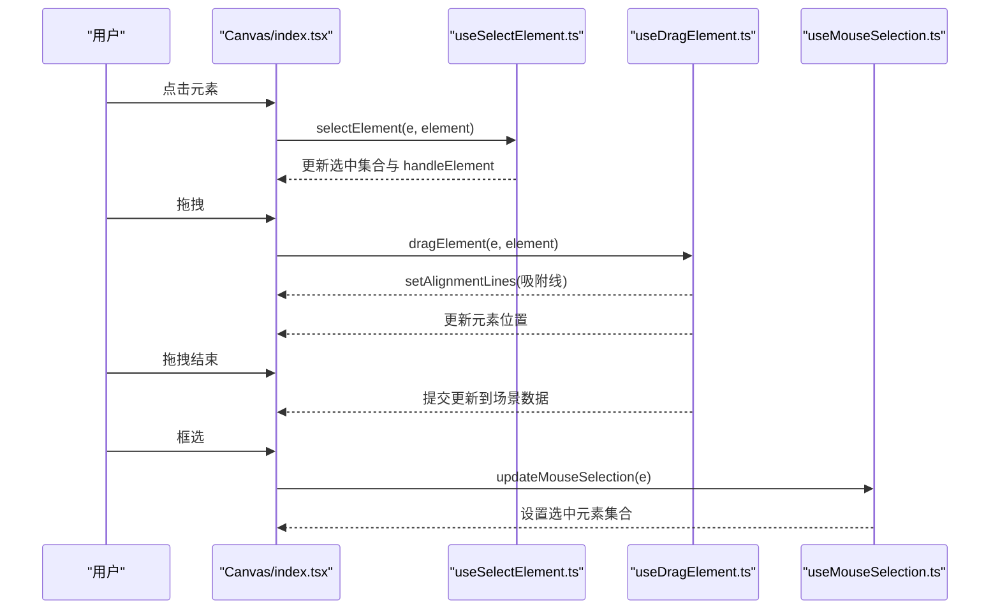

**图表来源**
- [useSelectElement.ts:26-126](file://components/slide-renderer/Editor/Canvas/hooks/useSelectElement.ts#L26-L126)
- [useDragElement.ts:32-399](file://components/slide-renderer/Editor/Canvas/hooks/useDragElement.ts#L32-L399)
- [useMouseSelection.ts:26-192](file://components/slide-renderer/Editor/Canvas/hooks/useMouseSelection.ts#L26-L192)

**章节来源**
- [useSelectElement.ts:11-131](file://components/slide-renderer/Editor/Canvas/hooks/useSelectElement.ts#L11-L131)
- [useDragElement.ts:16-399](file://components/slide-renderer/Editor/Canvas/hooks/useDragElement.ts#L16-L399)
- [useMouseSelection.ts:7-199](file://components/slide-renderer/Editor/Canvas/hooks/useMouseSelection.ts#L7-L199)

### 网格线系统
- 颜色自适应：根据背景色明暗选择黑/白，避免与背景融合。
- 网格生成：遍历 viewport 尺寸，生成横竖线条路径，使用 SVG 渲染。
- 开关控制：通过 Store 中 gridLineSize 控制显示与密度。

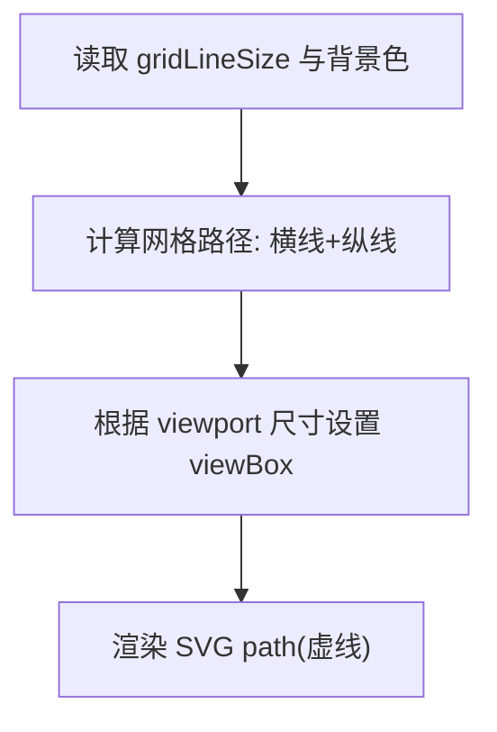

**图表来源**
- [GridLines.tsx:6-49](file://components/slide-renderer/Editor/Canvas/GridLines.tsx#L6-L49)
- [canvas.ts:299-303](file://lib/store/canvas.ts#L299-L303)

**章节来源**
- [GridLines.tsx:6-49](file://components/slide-renderer/Editor/Canvas/GridLines.tsx#L6-L49)

### 标尺系统
- 刻度计算：根据 markerSize（由视口宽度与缩放共同决定）动态显示刻度与主副刻度。
- 选区范围：当存在活动元素时，计算元素范围并在标尺上叠加高亮范围条。
- 角标与双轴：左上角角标连接水平与垂直标尺，形成十字参考。

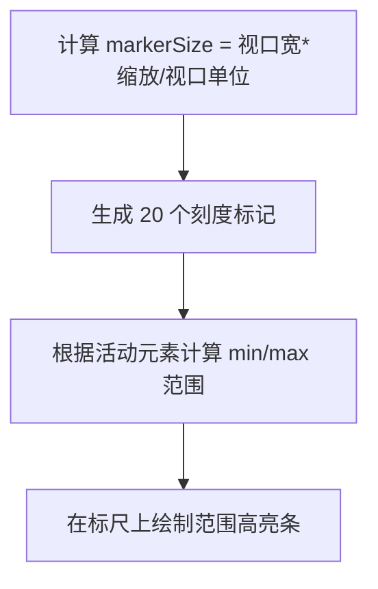

**图表来源**
- [Ruler.tsx:12-122](file://components/slide-renderer/Editor/Canvas/Ruler.tsx#L12-L122)

**章节来源**
- [Ruler.tsx:12-122](file://components/slide-renderer/Editor/Canvas/Ruler.tsx#L12-L122)

### 元素创建选择器（矩形选择与预览）
- 鼠标拖拽：记录起止点，按 Ctrl/Shift 键启用比例锁定（矩形）或方向锁定（直线）。
- 默认尺寸：若拖拽不足最小阈值，使用默认尺寸生成矩形。
- 预览：非线段元素渲染边框，线段元素渲染路径预览。

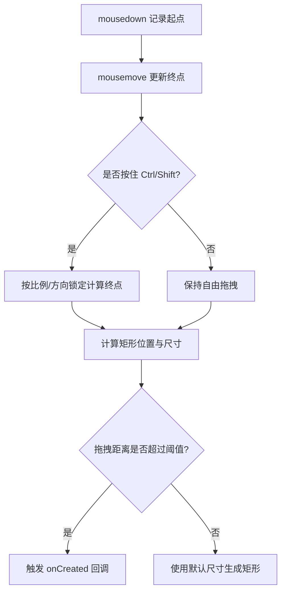

**图表来源**
- [ElementCreateSelection.tsx:26-119](file://components/slide-renderer/Editor/Canvas/ElementCreateSelection.tsx#L26-L119)
- [ElementCreateSelection.tsx:150-170](file://components/slide-renderer/Editor/Canvas/ElementCreateSelection.tsx#L150-L170)

**章节来源**
- [ElementCreateSelection.tsx:10-200](file://components/slide-renderer/Editor/Canvas/ElementCreateSelection.tsx#L10-L200)

### 自定义形状绘制
- 自由路径：记录点击点序列，支持 ESC 取消、ENTER 提前完成。
- 闭合检测：接近首点时高亮闭合态，点击完成闭合。
- 输出：计算最小包围盒与相对路径字符串，输出创建数据。

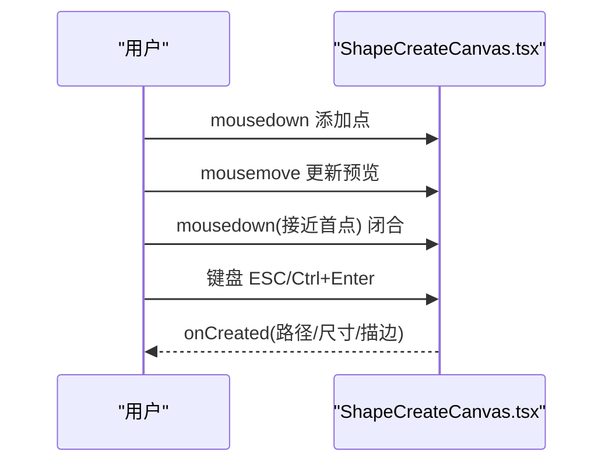

**图表来源**
- [ShapeCreateCanvas.tsx:134-163](file://components/slide-renderer/Editor/Canvas/ShapeCreateCanvas.tsx#L134-L163)
- [ShapeCreateCanvas.tsx:29-62](file://components/slide-renderer/Editor/Canvas/ShapeCreateCanvas.tsx#L29-L62)

**章节来源**
- [ShapeCreateCanvas.tsx:13-190](file://components/slide-renderer/Editor/Canvas/ShapeCreateCanvas.tsx#L13-L190)

### 对齐辅助线
- 数据结构：AlignmentLineProps 描述线类型（水平/垂直）、轴点与长度。
- 渲染：AlignmentLine 根据 canvasScale 缩放线段尺寸，使用虚线样式突出显示。
- 生成：useDragElement 在拖拽时收集对齐参考线（元素边缘、中心与画布边界），去重后传入组件渲染。

```mermaid
classDiagram
class AlignmentLineProps {
+type : "vertical"|"horizontal"
+axis : {x : number,y : number}
+length : number
}
class AlignmentLine {
+render(type,axis,length,canvasScale)
}
AlignmentLine --> AlignmentLineProps : "接收"
```

**图表来源**
- [edit.ts:53-57](file://lib/types/edit.ts#L53-L57)
- [AlignmentLine.tsx:13-38](file://components/slide-renderer/Editor/Canvas/AlignmentLine.tsx#L13-L38)
- [useDragElement.ts:65-144](file://components/slide-renderer/Editor/Canvas/hooks/useDragElement.ts#L65-L144)

**章节来源**
- [AlignmentLine.tsx:13-38](file://components/slide-renderer/Editor/Canvas/AlignmentLine.tsx#L13-L38)
- [useDragElement.ts:65-321](file://components/slide-renderer/Editor/Canvas/hooks/useDragElement.ts#L65-L321)

### 元素容器与操作控件
- 动态分发：EditableElement 根据元素类型映射到具体元素组件（文本、图片、形状、线条、表格、视频、图表、公式）。
- 上下文菜单：统一提供复制/粘贴/对齐/层级/组合/删除等操作入口。
- 操作层：Operate 根据元素类型渲染对应控件（旋转、缩放、连线端点、关键点移动），并支持动画索引展示。

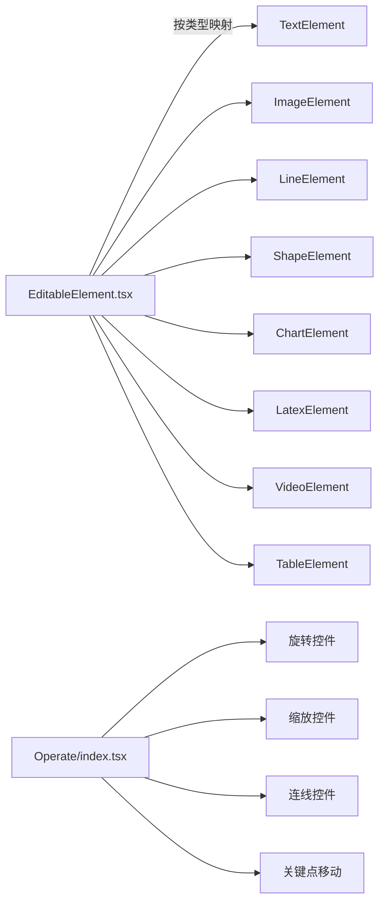

**图表来源**
- [EditableElement.tsx:54-69](file://components/slide-renderer/Editor/Canvas/EditableElement.tsx#L54-L69)
- [Operate/index.tsx:103-117](file://components/slide-renderer/Editor/Canvas/Operate/index.tsx#L103-L117)

**章节来源**
- [EditableElement.tsx:47-308](file://components/slide-renderer/Editor/Canvas/EditableElement.tsx#L47-L308)
- [Operate/index.tsx:54-173](file://components/slide-renderer/Editor/Canvas/Operate/index.tsx#L54-L173)

### 元素操作与历史快照
- 操作封装：use-canvas-operations 提供添加、删除、更新、锁定/解锁、对齐、层级调整、组合/拆分、全选等能力。
- 历史快照：拖拽结束与批量操作后调用 addHistorySnapshot，确保撤销/重做可用。
- 场景数据：通过 useSceneData 更新当前场景的元素列表与背景等。

**章节来源**
- [use-canvas-operations.ts:49-586](file://lib/hooks/use-canvas-operations.ts#L49-L586)

## 依赖关系分析
- 组件耦合：Canvas 作为协调者，依赖 Hooks 与 Store；子组件之间低耦合，通过 props 传递数据与回调。
- 状态依赖：Canvas 通过 useCanvasStore 读写 UI 状态；子组件通过 useSceneSelector 读取场景数据。
- 事件链路：Canvas 绑定事件 -> Hooks 处理 -> Store 更新 -> 子组件重渲染。

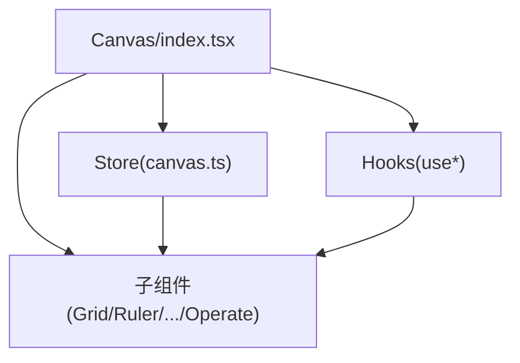

**图表来源**
- [Canvas/index.tsx:62-413](file://components/slide-renderer/Editor/Canvas/index.tsx#L62-L413)
- [canvas.ts:251-473](file://lib/store/canvas.ts#L251-L473)

**章节来源**
- [Canvas/index.tsx:62-413](file://components/slide-renderer/Editor/Canvas/index.tsx#L62-L413)
- [canvas.ts:251-473](file://lib/store/canvas.ts#L251-L473)

## 性能考虑
- 状态订阅粒度：ViewportBackground 仅订阅背景，减少无关重渲染；Canvas 通过局部状态与本地 elementListRef 降低全局订阅成本。
- 事件处理：拖拽与框选使用 document 级事件，结束后及时清理，避免内存泄漏。
- 几何计算：对齐吸附使用去重算法与边界范围计算，避免重复渲染。
- 建议优化（通用指导）：
  - 脏区域重绘：仅在吸附线、选区矩形、元素边界等小范围区域重绘，减少全量重绘。
  - 虚拟滚动：对超大画布或大量元素场景，采用虚拟化策略只渲染可视区域内的元素与辅助线。
  - 批量更新：合并多次状态变更，使用 requestAnimationFrame 合成帧更新。
  - 图像与矢量：优先使用 SVG 渲染辅助线与网格，避免频繁 Canvas 重绘。

[本节为通用性能建议，不直接分析具体文件]

## 故障排查指南
- 画布无法拖拽
  - 检查空格键状态与 dragViewport 是否被调用。
  - 确认 setCanvasDragged 已更新。
- 拖拽无吸附
  - 检查 sorptionRange 与对齐线收集逻辑。
  - 确认旋转元素使用 getRectRotatedRange 重新计算边界。
- 框选无效
  - 检查最小阈值与四象限方向判断。
  - 确认锁定与隐藏元素未被误选。
- 网格线不可见
  - 检查 gridLineSize 与背景色亮度对比。
- 标尺刻度异常
  - 检查 markerSize 与 viewport 尺寸/缩放比例。

**章节来源**
- [useDragElement.ts:44-144](file://components/slide-renderer/Editor/Canvas/hooks/useDragElement.ts#L44-L144)
- [useMouseSelection.ts:33-192](file://components/slide-renderer/Editor/Canvas/hooks/useMouseSelection.ts#L33-L192)
- [GridLines.tsx:15-22](file://components/slide-renderer/Editor/Canvas/GridLines.tsx#L15-L22)
- [Ruler.tsx:32-34](file://components/slide-renderer/Editor/Canvas/Ruler.tsx#L32-L34)

## 结论
该 Canvas 编辑器通过清晰的分层架构与细粒度的状态管理，实现了从视口布局、元素选择与拖拽、网格与标尺到创建器与对齐辅助线的完整编辑体验。借助 Hooks 抽象复杂交互，组件职责明确、可维护性强。结合脏区域重绘与虚拟滚动等优化策略，可在大规模场景中保持流畅体验。